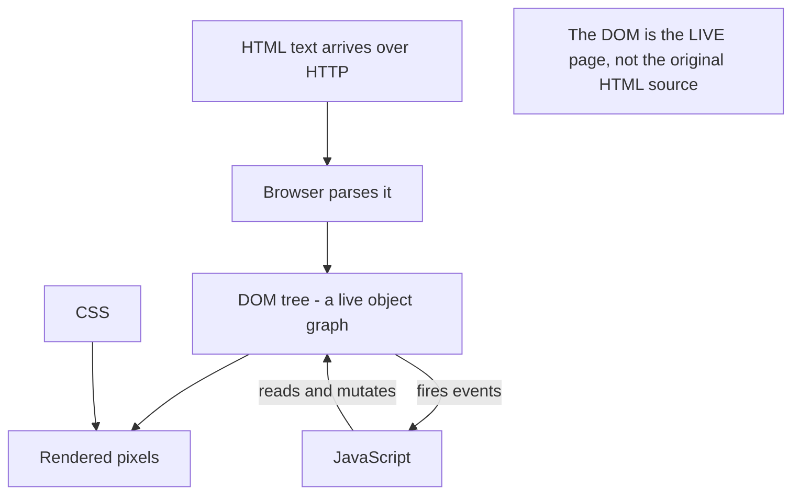
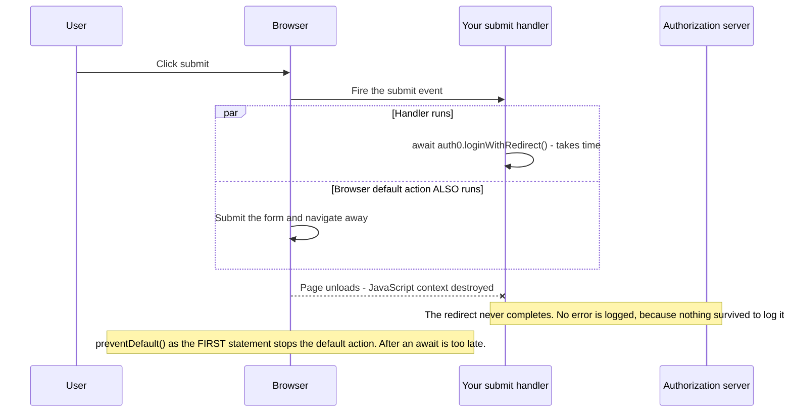
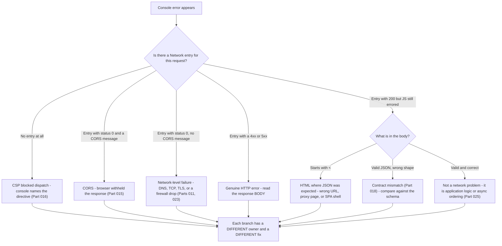
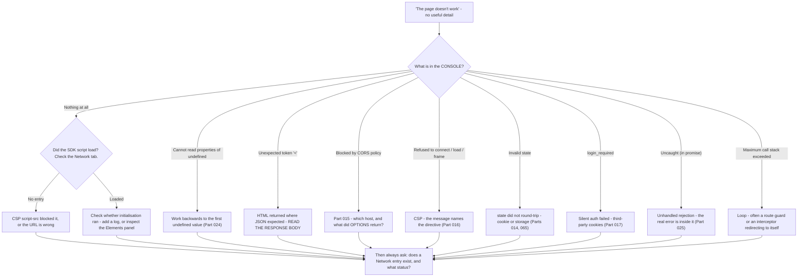

# Part 026 - DOM, Events, fetch, and Browser Errors

> Section goal: Complete the browser-side picture — how a page is structured, how it reacts to the user, how it talks to the network, and above all how to map a console message straight to a network or configuration cause. Reading a console error correctly is one of the fastest diagnostics you own.

Covers index item **026**. Maps to JD signals: *proficient in at least one programming language; ideally JavaScript*, *knowledge of HTTP*, *strong analytical and problem-solving skills*, *instinctive ability to subdivide problems into basic components*, and *basic security concepts*.

---

## 1. Start From Zero: What the DOM Is

The **DOM** (Document Object Model) is the browser's live, in-memory representation of the page as a tree of objects. JavaScript manipulates that tree; the browser re-renders to match.



| Term | Meaning |
|---|---|
| **Element** | A node, e.g. `<button>` |
| **Attribute** | A value on an element in the HTML, e.g. `id="login"` |
| **Property** | A value on the DOM object in memory — usually mirrors the attribute, but not always |
| **Event** | Something that happened: click, submit, load, message |
| **Listener** | A function registered to run when an event fires |

> **Analogy.** The HTML file is a blueprint. The DOM is the actual building after construction — walls can be moved, rooms added, and the blueprint no longer matches. "View source" shows the blueprint; DevTools' Elements panel shows the building.
>
> **Where it stops:** a building changes slowly and visibly. The DOM can be rebuilt hundreds of times a second by a framework, which is why "the element was there a moment ago" is a real and common bug.

### 🔍 Plain-English deep-dive: why "view source" misleads people in identity tickets

A customer says *"the login button isn't on the page"* and sends you the page source. It contains almost nothing — just a `<div id="root">` and a script tag.

That is expected for a SPA. The HTML delivered over the network is a shell; JavaScript builds the real page afterwards. So:

- **View source** shows what the *server sent*.
- **DevTools → Elements** shows what *currently exists*.

The gap between them is everything the JavaScript did — which in an identity context includes whether the SDK initialised, whether it decided the user is authenticated, and whether it rendered a login button or a dashboard.

**The practical consequence:** when a customer sends page source as evidence of a rendering problem, it is usually the wrong artifact. Ask for a screenshot of the **Elements** panel, or better, the console errors — because a SPA that renders nothing has almost always thrown an error during initialisation.

**Analogy:** judging a finished room by the delivery note for the flat-pack furniture. **Where it stops:** the delivery note is at least accurate about what arrived. Page source can also be misleading about *when* — server-rendered frameworks blur the line further.

---

## 2. Events and Listeners

```js
document.getElementById("login").addEventListener("click", async (event) => {
  event.preventDefault();                 // stop the default action
  await auth0.loginWithRedirect();
});
```

| Concept | Meaning | Identity relevance |
|---|---|---|
| `addEventListener` | Register a handler | How login buttons work |
| `event.preventDefault()` | Stop the browser's default behavior | Stops a form submitting before your handler finishes |
| `event.stopPropagation()` | Stop the event bubbling to ancestors | Rarely needed; occasionally the cause of a dead button |
| **Bubbling** | Events travel from the target up to the root | A parent handler can intercept |
| **Capturing** | The opposite direction, if requested | Rare |
| Duplicate listeners | Registering twice means running twice | **Duplicate `/authorize` requests** |



### 🔍 Plain-English deep-dive: `preventDefault` and the vanishing login

Consider a login form:

```js
form.addEventListener("submit", async (e) => {
  await auth0.loginWithRedirect();     // async - takes time
});
```

There is no `preventDefault()`. So the moment the handler starts, the browser **also** performs its default action: submitting the form and navigating away. The page unloads mid-`await`, the login redirect never completes, and the user lands somewhere unexpected — or back where they started.

The symptom is *"clicking login does nothing"* or *"the page just reloads"*. There is often no error at all, because the page was destroyed before anything could be logged.

**Two related traps:**

- **Adding a listener inside a re-rendering component** without cleanup registers a new listener on every render. Ten renders means ten handlers, so one click starts ten login flows — which shows up as duplicate `/authorize` requests and `state` mismatches (Part 065).
- **`preventDefault` after an `await`** is too late. The default action already happened. It must be the first statement.

**Analogy:** telling someone "don't post that letter" after they have already dropped it in the box. **Where it stops:** you could chase the postman. A page unload is unrecoverable — the JavaScript context is gone.

---

## 3. `fetch` in Practice

```js
const res = await fetch("https://api.example.com/orders", {
  method: "GET",
  headers: { Authorization: `Bearer ${token}` },
  credentials: "same-origin",
  mode: "cors"
});

if (!res.ok) throw new Error(`HTTP ${res.status}`);
const data = await res.json();
```

### The options that matter

| Option | Values | Effect |
|---|---|---|
| `credentials` | `omit` / `same-origin` (default) / `include` | Whether cookies are sent |
| `mode` | `cors` (default) / `same-origin` / `no-cors` | How cross-origin is handled |
| `redirect` | `follow` (default) / `manual` / `error` | Redirect handling |
| `cache` | `default` / `no-store` / `reload` | Cache interaction |
| `signal` | An `AbortSignal` | Cancellation and timeouts |

### 🔍 Plain-English deep-dive: `credentials: 'include'` and `mode: 'no-cors'`, the two options developers reach for wrongly

**`credentials: 'include'`** sends cookies on cross-origin requests. Developers add it when a cookie is not arriving. Two consequences they usually do not anticipate:

1. The server must respond with `Access-Control-Allow-Credentials: true` **and** a specific origin — a wildcard is forbidden with credentials (Part 015).
2. It makes the request subject to third-party cookie restrictions (Part 017). So it may work in one browser and silently fail in another.

**`mode: 'no-cors'`** is the more damaging one. Developers add it because it "makes the CORS error go away." It does — by making the response **opaque**:

| With `no-cors` you get | You do not get |
|---|---|
| A response object | Any status code (always `0`) |
| The request was sent | Any headers |
| | Any body |
| | Any way to know whether it succeeded |

So the error disappears and so does all the information. The code proceeds as if it worked. **This is strictly worse than the original error**, and when you see it in a customer's code it is worth flagging even if it is not what they asked about.

**The correct fix for a CORS error is always server-side headers** (Part 015). `no-cors` is not a fix; it is a blindfold.

**Analogy:** silencing a smoke alarm by removing the battery. The noise stops. **Where it stops:** you would smell the smoke eventually. An opaque response gives no signal at all.

### `AbortController` — timeouts done properly

```js
const controller = new AbortController();
const timer = setTimeout(() => controller.abort(), 5000);
try {
  const res = await fetch(url, { signal: controller.signal });
} catch (e) {
  if (e.name === "AbortError") { /* timed out */ }
} finally {
  clearTimeout(timer);
}
```

`fetch` has **no built-in timeout**. A request can hang indefinitely — which, combined with a corporate firewall silently dropping packets (Part 023), produces the "it just hangs forever" report. Recommending `AbortController` is a genuine best practice.

---

## 4. Reading Console Errors

This is the practical core of the Part: a lookup table from message to cause.

| Console message | Almost always means | First check |
|---|---|---|
| `Cannot read properties of undefined (reading 'x')` | Something before `.x` was undefined | Log the parent object; work backwards |
| `x is not a function` | Wrong type, typo, or a failed import | `typeof x` |
| `x is not defined` | Not declared, out of scope, or script never loaded | Is the script in the Network tab? |
| `Unexpected token '<' ... is not valid JSON` | **You parsed an HTML page as JSON** | The endpoint returned an error page or a login redirect |
| `Failed to fetch` | Network-level failure, **or CORS** | Check the Network tab and the CORS message beneath |
| `Access to fetch ... has been blocked by CORS policy` | CORS (Part 015) | Read the rest of the sentence — it names the missing header |
| `Refused to connect to ... because it violates ... Content Security Policy` | CSP `connect-src` (Part 016) | **No network entry will exist** |
| `Refused to load the script ... Content Security Policy` | CSP `script-src` | The SDK never loaded |
| `Refused to frame ... because an ancestor violates ...` | `frame-ancestors` / `X-Frame-Options` | Silent auth iframe or embedded login |
| `Blocked a frame with origin ... from accessing a cross-origin frame` | Same-origin policy on frame access | Use `postMessage` instead |
| `Invalid state` / `state mismatch` | The `state` value did not round-trip | Cookie or storage lost (Parts 014, 065) |
| `login_required` | Silent auth failed — no IdP session available | Third-party cookies (Part 017) |
| `Uncaught (in promise) ...` | An unhandled rejection (Part 025) | Missing `try/catch` or `.catch()` |
| `Converting circular structure to JSON` | `JSON.stringify` on a self-referencing object | Usually a request/response object being logged |
| `Maximum call stack size exceeded` | Infinite recursion | Often a redirect or interceptor loop |
| `Mixed Content: ... requested an insecure resource` | `https` page loading `http` | Scheme mismatch, often a proxy header issue (Part 012) |

### 🔍 Plain-English deep-dive: `Unexpected token '<'` is a network diagnosis, not a JavaScript one

This message is so common and so misread that it deserves its own explanation.

`Unexpected token '<' ... is not valid JSON` means the code called `.json()` on a response whose body starts with `<` — in other words, **HTML**.

The JavaScript is behaving perfectly. The *network* returned something unexpected. The realistic causes, in rough order of frequency:

| Cause | What the HTML actually is |
|---|---|
| Wrong URL | A 404 page from the web server |
| Session expired at a proxy | A corporate portal or captive-portal login page (Part 023) |
| Server error | A framework's HTML error page |
| Path returned the SPA shell | A misconfigured route serving `index.html` for `/api/*` |
| Rate limited by an edge service | A WAF or CDN block page |

**So the diagnostic instruction is: stop looking at the JavaScript and look at the response body in the Network tab.** The first line of that HTML usually names the cause immediately — `<title>404 Not Found</title>`, or a proxy vendor's name.

This is a genuinely satisfying diagnosis to hand a customer, because they were looking in entirely the wrong place.

**Analogy:** a machine that reports "cannot read barcode" when someone fed it a photograph. The reader is fine; the input is wrong. **Where it stops:** a photograph is visibly not a barcode. An HTTP response body is invisible unless you go and look at it.

---

## 5. Mapping Console to Network

The single most valuable habit in this Part.



**Ask one question — "is there a Network entry, and what status?" — and the seven possible worlds collapse to one.** This is Part 011's layered triage expressed in browser terms.

---

## 6. Framework Realities

You will read code from React, Angular, Vue, and Next.js. You do not need to know them deeply, but three behaviors cause identity tickets.

| Behavior | What happens | Identity symptom |
|---|---|---|
| **Re-rendering** | A component's function body re-runs many times | Login initiated repeatedly if not guarded |
| **Strict-mode double invocation** (React, development) | Effects deliberately run twice | **Duplicate `/token` POST → `invalid_grant`** (Part 012) |
| **Effect cleanup** | Listeners and timers must be removed | Duplicate listeners → duplicate `/authorize` |
| **Hydration** | Server-rendered HTML is "activated" client-side | Auth state differs between server and client render |
| **Route guards** | Redirect if unauthenticated | Redirect loops if the auth check is async and unresolved |

### 🔍 Plain-English deep-dive: why "it only fails in development" is often strict mode

React's development strict mode intentionally invokes effects twice to surface bugs caused by code that is not safe to run more than once.

For an identity integration, that means a code-exchange effect can run twice. The first call consumes the single-use authorization code; the second presents the same code and receives **`invalid_grant`** (Part 012).

The developer sees a login that fails in development, works in production, and has no obvious cause. They frequently blame the SDK.

**The correct framing:** strict mode did not create the bug — it *revealed* one. The code exchange is not idempotent, and running it twice is exactly what a page refresh, a double-click, or a re-render would also do. The fix is to guard the exchange so it runs once, not to disable strict mode.

**How to say it well:** *"Strict mode is doing its job — it found real code that isn't safe to run twice. Disabling it would hide the problem rather than fix it, and the same thing can happen in production from a refresh or a re-render. The fix is a guard around the exchange."*

**Analogy:** a smoke test that deliberately double-presses every button before shipping. Finding a button that breaks when pressed twice is a success, not a fault in the test. **Where it stops:** a real user is less likely to double-press than strict mode is — but "less likely" is not "never", and identity failures are visible to everyone.

---

## 7. Failure Modes

| Failure mode | Symptom | Consequence | Correction |
|---|---|---|---|
| **Missing `preventDefault`** | "Login does nothing"; page reloads | Flow destroyed mid-redirect | `preventDefault()` as the first statement |
| **Listener registered per render** | Duplicate `/authorize` requests | `state` mismatch, confusing HAR | Register once; clean up |
| **`mode: 'no-cors'`** | Error gone, nothing works | Opaque response — all information lost | Fix server-side CORS headers |
| **`credentials: 'include'` without server support** | Still blocked, new CORS error | Wildcard origin now forbidden | Echo a specific validated origin |
| **No timeout on `fetch`** | "It hangs forever" | Never resolves; UI stuck | `AbortController` |
| **Parsing HTML as JSON** | `Unexpected token '<'` | Looking in the wrong layer entirely | Read the response body |
| **Ignoring `res.ok`** | Error handling never fires | Bad data flows on (Part 025) | Check `res.ok` |
| **Reading page source for a SPA** | "The button isn't in the HTML" | Wrong artifact | Elements panel and console errors |
| **Strict-mode blamed on the SDK** | "Login fails in dev only" | Real non-idempotent code left in place | Guard the exchange |
| **Redirect loop in a route guard** | Infinite navigation | Async auth check not awaited | Resolve auth state before deciding |
| **Console not checked at all** | "There's no error" | The answer was sitting in the console | Always ask for console *and* network |

---

## 8. Troubleshooting Decision Tree: "The Page Just Doesn't Work"



### Worked example

*"Our React app shows a blank page after login. No error. It works in production but not on the developer's machine."*

1. **"Blank page, no error" is rarely true** — ask them to confirm the console is showing all levels, including errors that occurred before they opened DevTools. Ask them to reload with the console open.
2. **They re-check:** there is an `Uncaught (in promise) Error: invalid_grant`.
3. **`invalid_grant` after a successful login** points at the token exchange (Part 012's four causes).
4. **Ask for the HAR.** There are **two** `POST /oauth/token` requests, 8 ms apart, with the same `code`.
5. **Diagnosis:** the authorization code is single-use. The second request presents a spent code. React strict mode double-invoked the effect performing the exchange.
6. **Why production works:** strict mode's double invocation is development-only.
7. **Fix:** guard the exchange so it runs once — a module-scoped flag, or the SDK's own provider component which handles this. **Do not disable strict mode.**
8. **The concept to teach:** strict mode revealed a real defect. The exchange is not idempotent, and a page refresh or a re-render can cause the same double execution in production. The guard is the fix.
9. **The blank page is explained too:** the unhandled rejection aborted rendering, and because it was an unhandled *promise* rejection rather than a thrown error, no error boundary caught it.

Three questions — console, HAR, and how many `/token` requests — converted "blank page, no error" into a precise, teachable root cause.

---

## 9. Lab: Break the Browser Deliberately

**Purpose.** Generate each console error yourself so the lookup table in §4 becomes recall rather than reference.

**Prerequisites.** Part 007's lab, Parts 015–016's local origins, Part 024–025's labs. **Localhost and your own tenant only.**

**Steps.**

1. Create `okta-prep/labs/026-dom-fetch/`.
2. **DOM versus source.** Serve a page whose HTML is only `<div id="root"></div>` plus a script that injects a button. View source, then the Elements panel. **Screenshot both.** Write one line on why page source is the wrong artifact for a SPA rendering ticket.
3. **`preventDefault`.** Build a form whose submit handler `await`s a two-second fake login. Run it without `preventDefault` and record what happens. Add it and record the difference.
4. **Duplicate listeners.** Register a click listener inside a function you call five times. Click once and count the handler executions. Record it.
5. **Generate the error catalogue.** Deliberately produce and record the **verbatim** console message for each of:
   - a. Reading a property of `undefined`
   - b. Calling a non-function
   - c. Using an undeclared variable
   - d. `JSON.parse` on an HTML string
   - e. `fetch` to a blocked CSP `connect-src`
   - f. `fetch` cross-origin with no CORS headers
   - g. Framing a page that sets `X-Frame-Options: DENY`
   - h. An unhandled promise rejection
   - i. `JSON.stringify` on a circular object
   - j. Infinite recursion
6. **Network correlation.** For each of (d) through (g), record **whether a Network entry exists and its status**. Build the §5 mapping from your own observations.
7. **`Unexpected token '<'`.** Point a `fetch` at a path that returns your local server's 404 HTML page and call `.json()`. Record the exact message, then record the first line of the actual response body. **This is the diagnosis you hand customers.**
8. **`no-cors` demonstration.** Make a blocked cross-origin request normally and record the error. Repeat with `mode: 'no-cors'` and record `res.status`, `res.type`, and what happens when you call `.json()`. **Write one line on why this is worse than the error.**
9. **`AbortController`.** Implement a five-second timeout around a `fetch` to a local endpoint that never responds. Record the `AbortError`.
10. **Strict-mode double invocation.** If comfortable with React, scaffold a minimal app with an effect that logs and increments a counter, and observe it running twice in development. If not using React, simulate it by calling an exchange function twice with the same fake code and recording the second failure. Record either way.
11. **Reference + catalog.** Write `console-to-cause.md` — §4's table, but populated with **your own verbatim messages** and the Network-entry status for each. Add rows to the failure catalog. Complete `MANIFEST.md`.

**Expected evidence.** Two screenshots, a `preventDefault` before/after, a duplicate-listener count, ten verbatim console messages, a Network-entry correlation for four of them, an `Unexpected token '<'` with its underlying HTML, a `no-cors` opacity demonstration, an `AbortError`, and a double-invocation record.

**Validation rubric.**

| Check | Pass condition |
|---|---|
| Source vs DOM | Both screenshots present, difference explained |
| `preventDefault` | Both behaviors recorded, difference clear |
| Ten messages verbatim | Copied exactly, not paraphrased |
| Network correlation | Entry presence and status recorded for at least four |
| HTML-as-JSON | Both the console message and the response body's first line captured |
| `no-cors` opacity | `status`, `type`, and `.json()` behavior all recorded |
| Timeout implemented | `AbortError` caught and identified by name |
| Table is yours | Built from your own observations, not copied from §4 |

**Cleanup and privacy.** Localhost and your own tenant only. Use fake tokens throughout. The recursion test can hang a tab — use a separate window. Stop all local servers when finished.

---

## 10. JD Mapping

| Supplied JD signal | How this Part supports it |
|---|---|
| **Proficient in a programming language; ideally JavaScript** | DOM, events, and `fetch` are the JavaScript a support engineer actually reads |
| Knowledge of HTTP | §3's `fetch` options and §5's console-to-network mapping |
| Strong analytical and problem-solving skills | §4's message-to-cause table and §5's single discriminating question |
| **Instinctive ability to subdivide problems** | "Is there a Network entry, and what status?" collapses seven possibilities to one |
| Basic security concepts | The `no-cors` blindfold, frame refusal, and mixed content |
| Promote best practices | `AbortController` timeouts, `res.ok` checks, guarding non-idempotent effects |
| Exceed expectations on response quality | Handing a customer the response body when they were reading the JavaScript |

---

## 11. Candidate Honesty Note

- **Production transfer:** you have read browser console errors and correlated them with network evidence on real escalations. This is refinement of an existing skill, not new ground.
- **The strongest specific thing you own after this Part:** *"`Unexpected token '<'` is a network diagnosis, not a JavaScript one — the code called `.json()` on an HTML body. I stop looking at their code and read the response body, and the first line usually names the cause: a 404 page, a corporate proxy portal, or the SPA shell being served for an API path."*
- **A second strong point:** *"My first question on any browser ticket is 'is there a Network entry for this request, and what status?' — because no entry means CSP, status 0 with a CORS message means CORS, status 0 without one means a network-level failure, and a 200 with a bad body means a contract problem. One question, four different owners."*
- **On frameworks, be precise:** you can read React, Angular, and Vue code and recognise the three behaviors that cause identity bugs. You are not a framework specialist. Both are true and the first is sufficient.
- **The `no-cors` flag is worth raising unprompted** — recognising it in a customer's code as a blindfold rather than a fix demonstrates judgement, not just knowledge.

---

## 12. Official Source Anchors

Accessed **26 August 2026**.

| Source | What it defines |
|---|---|
| MDN — DOM introduction, `addEventListener`, `Event` | §§1–2 |
| MDN — `fetch`, `Request`, `Response`, `AbortController` | §3, including the absence of a default timeout |
| WHATWG Fetch Standard | `mode`, `credentials`, and opaque response semantics |
| MDN — CORS errors reference | One page per console message, matching §4 |
| W3C Content Security Policy Level 3 | The exact wording of CSP refusal messages |
| MDN — `JSON.parse` and error messages | The `Unexpected token` family |
| React documentation — Strict Mode | §6's double invocation and its stated purpose |
| Auth0 and Okta SPA SDK documentation | Real initialisation, callback handling, and provider components |

**Revalidate after 26 August 2026:** exact console wording varies between browsers and versions — record your own, and expect a customer's message to differ slightly from yours.

---

## ⭐ Likely Interview Questions for This Section

### Q1. "A customer says their SPA shows a blank page after login, with no error. What do you do?"
> *Model answer:* "'No error' is rarely literally true, so first I'd ask them to reload with DevTools already open and the console showing all levels — errors thrown during initialisation are frequently missed because the console was opened afterwards. In my experience the most common finding is an `Uncaught (in promise)` rejection, which doesn't get caught by error boundaries and silently aborts rendering. If it's `invalid_grant`, I'd go straight to the HAR and count the `POST /oauth/token` requests — two, milliseconds apart with the same code, means the exchange ran twice and the second presented a spent single-use code. In development that's usually React strict mode double-invoking the effect. The fix is to guard the exchange so it's idempotent, not to disable strict mode, because a page refresh or a re-render can cause the same thing in production."

### Q2. "What does `Unexpected token '<' ... is not valid JSON` tell you?"
> *Model answer:* "That the code called `.json()` on a response whose body starts with `<` — so it's HTML, not JSON. The JavaScript is behaving perfectly; the network returned something unexpected, and that's the important reframe because the developer is usually staring at their parsing code. So I stop looking at the JavaScript and read the response body in the Network tab, where the first line almost always names the cause: a `<title>404 Not Found</title>`, a corporate proxy or captive-portal login page, a framework error page, or the SPA's own `index.html` being served for an `/api/*` path because of a routing misconfiguration. It's a satisfying diagnosis to hand over because they were looking in entirely the wrong layer."

### Q3. "A developer added `mode: 'no-cors'` and says the CORS error is gone. Is that a fix?"
> *Model answer:* "No — it's a blindfold, and it's strictly worse than the error. `no-cors` makes the response *opaque*: the status is always 0, there are no headers, and the body is unreadable, so there's no way to know whether the request succeeded. The error disappears and so does every piece of information they'd need. The code then proceeds as though it worked, which means the failure surfaces later somewhere unrelated. The correct fix for a CORS error is always server-side headers — an `Access-Control-Allow-Origin` matching the calling origin, from a validated allow-list. If I saw `no-cors` in a customer's code I'd flag it even if it wasn't what they contacted me about, because it's actively hiding problems from them."

### Q4. "A customer says clicking their login button does nothing. Where do you start?"
> *Model answer:* "Three candidates, and the console usually distinguishes them quickly. First, a missing `preventDefault()` on a form submit handler — the handler starts an async login while the browser simultaneously performs the default form submission, so the page unloads mid-flow and the redirect never completes. There's often no error because the JavaScript context was destroyed. It has to be the first statement in the handler; after an `await` is too late. Second, the handler never registered — the SDK script may have been blocked by CSP `script-src`, in which case there's no Network entry for it at all. Third, an error thrown inside the handler that's swallowed as an unhandled rejection. So I'd ask for the console with all levels shown, and whether the SDK script appears in the Network tab."

### Q5. "How do you use the console and Network tab together?"
> *Model answer:* "One question does most of the work: is there a Network entry for this request, and what status? No entry at all means Content Security Policy blocked dispatch, and the console names the directive. An entry with status 0 plus a CORS message means the browser withheld the response — the server saw a 200. Status 0 with no CORS message means a network-level failure: DNS, TCP, TLS, or a firewall silently dropping. A genuine 4xx or 5xx means read the response body. And a 200 where the JavaScript still errored means the body wasn't what was expected — either HTML instead of JSON, or a contract mismatch. That's four completely different owners and four different fixes, separated by one question, which is why I ask it before anything else."

### Q6. "Why does `fetch` need `AbortController`?"
> *Model answer:* "Because `fetch` has no built-in timeout — a request can hang indefinitely, and there's no option to set one. That matters in identity work because it combines badly with corporate networks: a firewall configured to drop rather than reject means packets vanish silently, so the fetch never resolves and never rejects, and the UI sits on a spinner forever. That's the 'it just hangs' report. `AbortController` gives you a signal you can abort on a timer, and the fetch then rejects with an `AbortError` you can identify by name and handle properly — retry, show a message, or fall back. I'd recommend it as a default for any external call, because 'hangs forever' is a much worse user experience than 'failed after five seconds', and it's also much harder to diagnose."

### Q7. "A customer's login works in production but fails in development. What's your first hypothesis?"
> *Model answer:* "React strict mode double-invoking an effect, if they're on React. It deliberately runs effects twice in development to surface code that isn't safe to run more than once — and a token exchange is exactly that, because authorization codes are single-use. The first call succeeds, the second presents a spent code and gets `invalid_grant`. The evidence is two `POST /oauth/token` requests milliseconds apart with the same code in the HAR. The important framing is that strict mode didn't create the bug, it revealed one — the same double execution can happen in production from a refresh or a re-render, so disabling strict mode would hide a real defect. The fix is a guard so the exchange runs once, or using the SDK's own provider component which handles it. Other candidates for dev-only failures are a production-only CSP and different redirect URIs per environment."

### Q8. "Why is page source the wrong evidence for a SPA rendering problem?"
> *Model answer:* "Because for a SPA the HTML delivered over the network is just a shell — typically a single empty div and a script tag. Everything visible is built afterwards by JavaScript. So view source shows what the *server sent*, and the Elements panel shows what *currently exists*, and the gap between them is everything the application did, including whether the SDK initialised and whether it decided the user is authenticated. When a customer sends page source as evidence that a login button is missing, it's the wrong artifact and it tells us nothing. What I'd ask for instead is the console errors, because a SPA that renders nothing has almost always thrown during initialisation, and a screenshot of the Elements panel to confirm what actually got built."

---

## 🧠 30-Second Memory Hooks

- **View source = what the server sent. Elements panel = what exists now.** For a SPA these are completely different.
- **Missing `preventDefault` = page unloads mid-login.** Must be the **first** statement; after an `await` is too late.
- **Listener registered per render = duplicate `/authorize`.**
- **`Unexpected token '<'` is a NETWORK diagnosis.** Read the response body — its first line names the cause.
- **`mode: 'no-cors'` is a blindfold, not a fix.** Status always 0, no headers, unreadable body.
- **`fetch` has NO timeout.** Use `AbortController` — otherwise a dropped packet means a spinner forever.
- **`fetch` does not reject on 4xx/5xx.** Check `res.ok`.
- **One question: "Is there a Network entry, and what status?"** No entry = CSP · 0 + CORS message = CORS · 0 alone = network · 4xx/5xx = read the body · 200 + JS error = contract or HTML.
- **`Uncaught (in promise)` = the real error is inside it**, and no error boundary will catch it.
- **Dev-only login failure = React strict mode double invocation.** Guard the exchange; do not disable strict mode.

---

## ✅ Completion Checklist

- [ ] **Knowledge:** I can map ten console messages to causes and state the single question that separates CSP, CORS, network, and contract failures.
- [ ] **Lab artifact:** `026-dom-fetch/` contains ten verbatim messages with Network-entry correlation, an HTML-as-JSON capture with the underlying body, a `no-cors` opacity record, and an `AbortError`.
- [ ] **Spoken:** I can deliver the `Unexpected token '<'` diagnosis and redirect the customer to the response body, in under 45 seconds.
- [ ] **Honesty check:** all captures are from my own local servers and lab tenant, with fake token values.
- [ ] **Source check:** I have read MDN's CORS errors reference and the Fetch Standard's note on opaque responses myself.

---

*Next suggested section:* **[Part 027 - npm, Modules, Bundlers, and Front-End Toolchains](Part-027-npm-modules-bundlers-and-front-end-toolchains.md)** — the build layer, where "it worked yesterday" is usually a dependency that moved underneath them.
