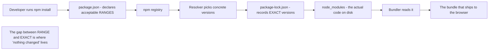
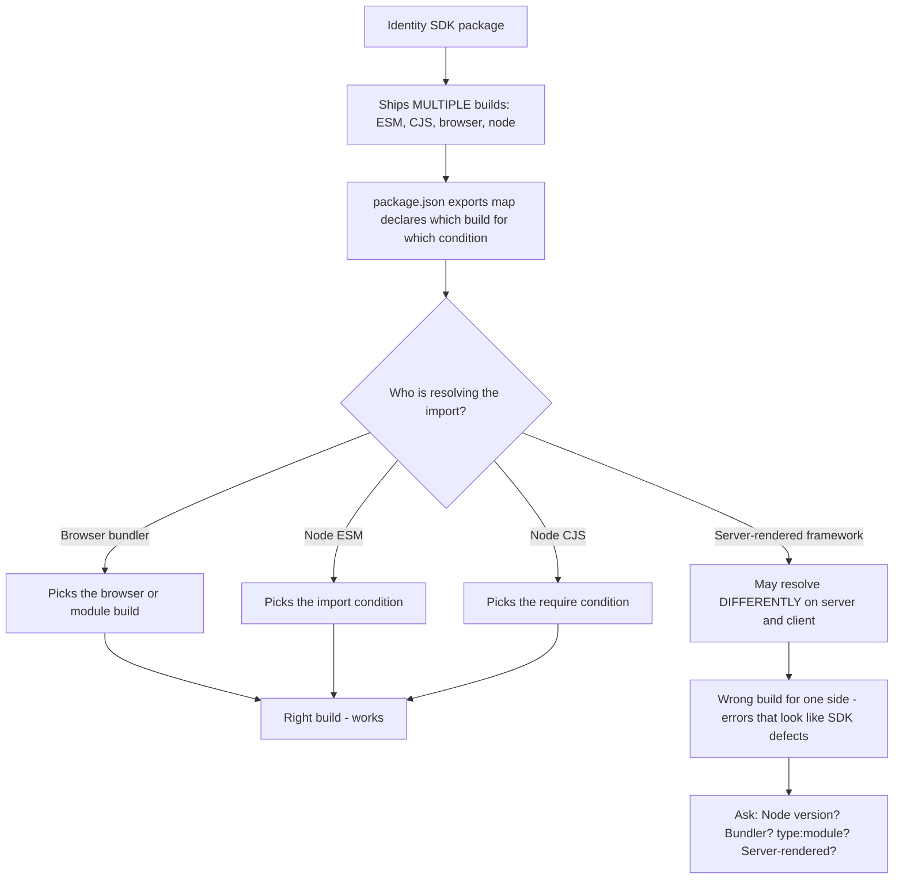
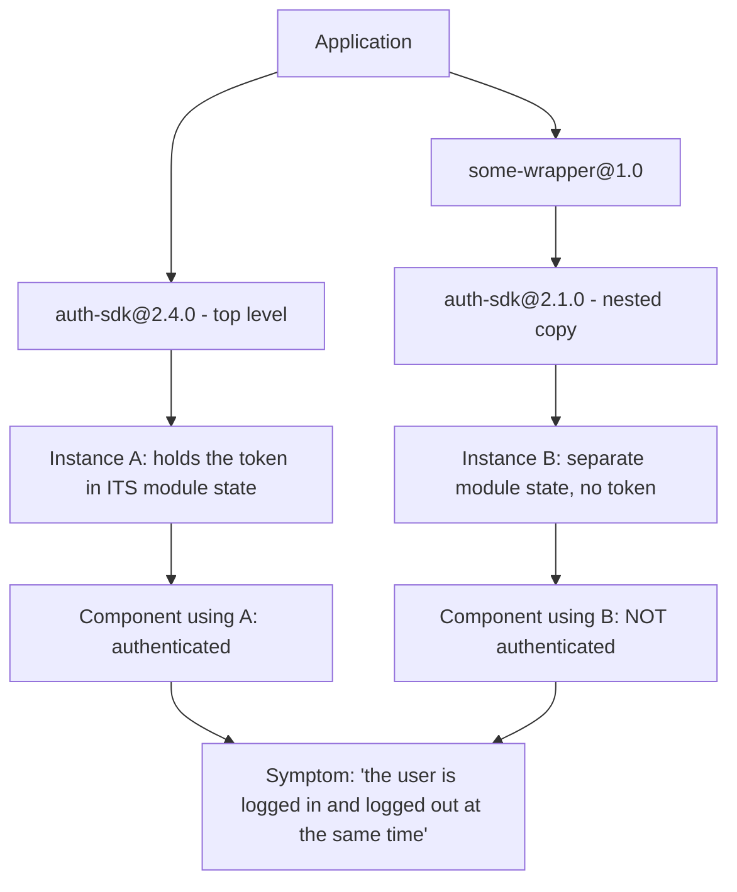
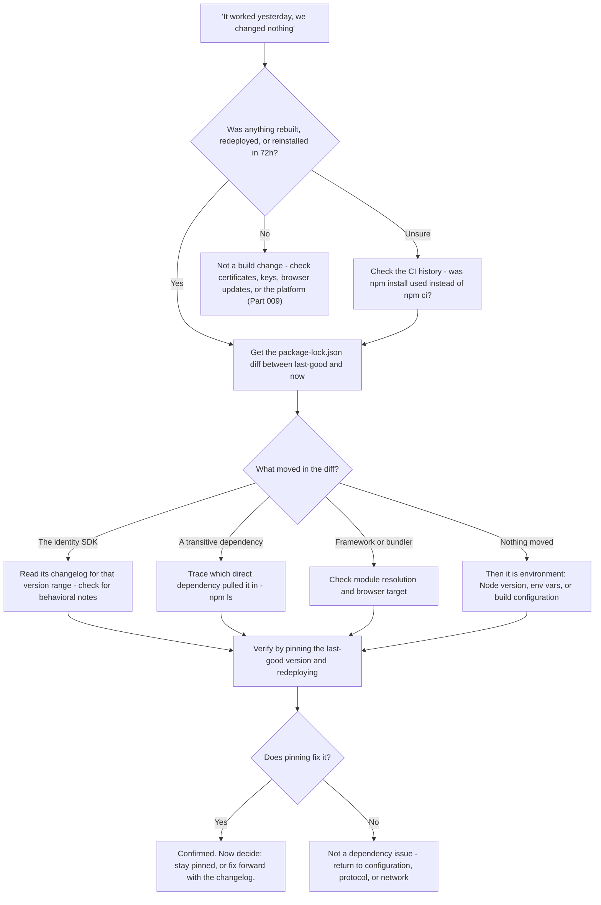

# Part 027 - npm, Modules, Bundlers, and Front-End Toolchains

> Section goal: Understand the build layer, because "it worked yesterday and we changed nothing" is most often a dependency that moved underneath them. This is where Part 009's lockfile discipline meets JavaScript specifics, and where a large share of identity SDK tickets actually originate.

Covers index item **027**. Maps to JD signals: *knowledge of software development fundamentals*, *knowledge of the Development lifecycle*, *proficient in at least one programming language*, *strong analytical and problem-solving skills*, and *promote best practices*.

---

## 1. Start From Zero: What npm Is

**npm** is the package registry and command-line tool for JavaScript. When a developer wants an identity SDK, they run `npm install @some/auth-sdk` and it appears in their project.



| File | Records | Committed? |
|---|---|---|
| `package.json` | Which versions are **acceptable** (ranges) | **Yes** |
| `package-lock.json` | Which versions are **actually installed** | **Yes — always** |
| `node_modules/` | The code itself | **No** — regenerated |

### 🔍 Plain-English deep-dive: why the lockfile is the ground truth

Part 009 established this in principle. Here is the JavaScript specific.

`package.json` says `"@some/auth-sdk": "^2.3.0"` — meaning "any 2.x at or above 2.3.0". That is a **range**, not a version.

So two developers, or two CI builds, running `npm install` on **different days** can end up with **different code**, from an identical `package.json`.

| Command | Behavior |
|---|---|
| `npm install` | May **update** the lockfile to newer versions within range |
| `npm ci` | Installs **exactly** what the lockfile says; fails if it disagrees with `package.json` |

**Therefore:**

- **`npm ci` is what CI should run.** It is reproducible.
- **`npm install` is what a developer runs locally**, and it is what silently moves things.
- **The lockfile is the only accurate answer to "what version are you running?"**

**The question you ask on every "nothing changed" ticket** is not "what version?" but: *"can you send the diff of your `package-lock.json` between the last known-good deployment and now?"* That diff is a complete, factual list of everything that moved.

**Analogy:** a recipe saying "a medium onion" versus a photograph of the actual onion used. The recipe has not changed; the onion has. **Where it stops:** you can weigh an onion. A transitive dependency four levels deep is invisible without the lockfile.

---

## 2. Version Ranges

| Range | Means | Risk |
|---|---|---|
| `2.3.1` | Exactly that version | None from drift |
| `~2.3.1` | `>=2.3.1 <2.4.0` — patches only | Low |
| `^2.3.1` | `>=2.3.1 <3.0.0` — minors and patches | **Moderate — the default** |
| `^0.3.1` | `>=0.3.1 <0.4.0` — **special rule for 0.x** | Pre-1.0 packages treat minor as breaking |
| `*` or `latest` | Anything | High |
| `>=2.0.0` | Anything above | High |

**`^` is npm's default**, so most projects accept minor upgrades automatically. Since a minor is *supposed* to be backwards-compatible, this is usually fine — until a package ships a behavioral change it believed was non-breaking (Part 018).

### Dependency types

| Field | Installed when | Ships to the browser? |
|---|---|---|
| `dependencies` | Always | **Yes** |
| `devDependencies` | Not with `--production` | No |
| `peerDependencies` | Must be provided by the host project | Depends |
| `optionalDependencies` | Failure to install is tolerated | Maybe |

**Peer dependency conflicts** are a genuine source of identity SDK problems: an SDK requires a peer version of a framework, the project has a different one, and the resolver either warns, errors, or installs two copies — the last of which causes the "two instances" problem in §5.

---

## 3. Modules: CommonJS versus ES Modules

JavaScript has **two** module systems, and the friction between them causes real errors.

| | CommonJS (CJS) | ES Modules (ESM) |
|---|---|---|
| Import | `const x = require("y")` | `import x from "y"` |
| Export | `module.exports = x` | `export default x` |
| Loading | Synchronous | Asynchronous |
| Origin | Node.js | The language standard |
| File extension | `.cjs`, or `.js` by default | `.mjs`, or `.js` with `"type": "module"` |
| Browser support | Not native | **Native** |
| Tree-shaking | Poor | **Good** |

### 🔍 Plain-English deep-dive: the errors this dual system produces

You will see these in customer tickets and they look alarming:

| Error | Cause | Fix direction |
|---|---|---|
| `Cannot use import statement outside a module` | ESM syntax in a CJS context | Add `"type": "module"`, or use `.mjs`, or transpile |
| `require() of ES Module ... not supported` | CJS trying to `require` an ESM-only package | Use dynamic `import()`, or find a CJS build |
| `ERR_MODULE_NOT_FOUND` for a relative import | ESM requires **file extensions** in relative imports | Add `.js` to the path |
| `exports is not defined` | CJS output loaded as ESM in a browser | Bundler or output-format misconfiguration |
| `default is not a function` | Interop mismatch on the default export | `import * as x`, or check the package's documented shape |

**Why identity SDKs hit this disproportionately:** an SDK must work in browsers, in Node, in bundlers, and in server-rendered frameworks. So packages ship **multiple builds** and declare them in `package.json`'s `exports` map. When a bundler, framework, or Node version picks the wrong entry point, you get one of the errors above — and the developer reasonably concludes the SDK is broken.

**The support instinct:** these errors are almost never a defect in the SDK. They are an **environment and configuration** mismatch. The useful questions are: Node version, bundler and version, whether the project is ESM or CJS, and whether it is server-rendered.



**Analogy:** a device shipped with three different plug adaptors, and a socket that silently selects the wrong one. The device works; the connection does not. **Where it stops:** you can see a plug. Module resolution is invisible until it fails.

---

## 4. Bundlers and Build Tools

A **bundler** takes many source files and dependencies and produces the files that actually ship.

| Tool | Role |
|---|---|
| **Vite**, **webpack**, **Rollup**, **esbuild**, **Parcel** | Bundling |
| **Babel**, **SWC**, **TypeScript** | Transpiling to older or plain JavaScript |
| **Next.js**, **Nuxt**, **Angular CLI**, **Create React App** | Framework toolchains wrapping the above |

### What a bundler does that matters to you

| Behavior | Identity consequence |
|---|---|
| **Inlines environment variables** | **A secret in an env var can end up in the shipped bundle** |
| **Tree-shakes unused code** | Rarely, removes something reached only dynamically |
| **Minifies** | Error messages and stack traces become unreadable without source maps |
| **Code-splits** | A chunk may fail to load, producing a partially working page |
| **Targets browsers** | Too-old a target can break modern SDK code; too-new can break older browsers |
| **Resolves module entry points** | Chooses which of an SDK's builds is used (§3) |

### 🔍 Plain-English deep-dive: how a client secret ends up in a public bundle

This is one of the highest-severity findings you can make in a code review, and the mechanism is worth knowing precisely.

Front-end tooling exposes selected environment variables to browser code by **textual substitution at build time** — a prefixed name like `VITE_*`, `NEXT_PUBLIC_*`, or `REACT_APP_*` is replaced with its literal value in the output.

A developer, reasoning that "environment variables are secret", writes:

```js
const clientSecret = import.meta.env.VITE_CLIENT_SECRET;
```

The bundler replaces that expression with the actual string. The secret is now a plain literal inside a JavaScript file served to every visitor. It is not encrypted, not hidden, and not recoverable once published — it must be rotated.

**Two rules to state clearly to customers:**

1. **A SPA is a public client (Part 010). It cannot hold a secret.** Anything in the bundle is published.
2. **The prefix is an "expose this to the browser" marker, not a security marker.** Prefixing a secret is the opposite of protecting it.

**How to verify in thirty seconds:** open the deployed site, DevTools → Sources, and search the bundle for the secret's first few characters, or for `client_secret`. If it is there, tell the customer immediately and advise rotation (Part 006 §6).

**Analogy:** writing your PIN on a note labelled "confidential" and taping it to the shop window. The label does not change who can read it. **Where it stops:** you could remove the note. A published bundle has been cached by browsers, CDNs, and archives — rotation is the only remediation.

---

## 5. The "Two Instances" Problem

A subtle failure worth recognising because it looks impossible.



npm can install **two versions of the same package** if two dependents require incompatible ranges. Each copy has its **own module-level state**.

For an identity SDK holding a token in module scope, that means two independent auth states in one application. Symptoms:

- "One component sees the user as authenticated and another does not."
- "The token exists but `isAuthenticated` is false."
- "Logging out in one place doesn't log out the other."

**How to detect:** `npm ls <package-name>` prints the dependency tree and shows every installed copy. **How to fix:** align versions, use `overrides`/`resolutions` to force a single copy, or declare it as a peer dependency.

This is also exactly why identity SDKs declare framework packages as **peer** dependencies — to prevent a second copy of React or Angular, which produces an even more confusing set of symptoms.

---

## 6. Failure Modes

| Failure mode | Symptom | Consequence | Correction |
|---|---|---|---|
| **Lockfile not committed** | Different builds get different code | "Works on my machine" forever | Commit it; use `npm ci` in CI |
| **`npm install` in CI** | Silent version drift between builds | Unreproducible builds | `npm ci` |
| **`^` range plus a behavioral minor** | "Nothing changed" but behavior did | Days lost in the wrong place | Lockfile diff |
| **Secret in an exposed env var** | Client secret in the public bundle | **Serious credential exposure** | Rotate; SPAs are public clients |
| **Two SDK copies** | Contradictory auth state | Looks impossible | `npm ls`; force a single version |
| **Peer dependency ignored** | Duplicate framework instances | Hooks and context break inexplicably | Satisfy the peer range |
| **Wrong module format** | `Cannot use import statement outside a module` | Build fails or runtime errors | Match ESM/CJS to the environment |
| **Missing extension in ESM import** | `ERR_MODULE_NOT_FOUND` | Build fails | Add `.js` |
| **Minified without source maps** | Unreadable stack traces | Cannot diagnose production errors | Ship source maps, restricted appropriately |
| **Browser target too old or too new** | Syntax errors for some users only | A browser-defined cohort fails | Align the build target |
| **Stale `node_modules`** | Local behavior differs from CI | Phantom bugs | Delete and reinstall from the lockfile |
| **Transitive dependency changed** | Behavior shifts with no direct change | Invisible without the lockfile | Diff the lockfile, not `package.json` |

---

## 7. Troubleshooting Decision Tree: "It Worked Yesterday"



### Worked example

*"Our login broke overnight. We didn't deploy. Well — CI redeploys nightly, but the code is identical."*

1. **"CI redeploys nightly" is the answer already forming.** Identical code, different build.
2. **Ask:** does CI run `npm install` or `npm ci`? Answer: `npm install`.
3. **Explain the mechanism:** `npm install` may update the lockfile to newer versions within the declared ranges. With `^` on the identity SDK, a new minor released yesterday was picked up. The code is identical; the dependencies are not.
4. **Get the lockfile diff** from the last-good build to now. The SDK moved from 2.4.1 to 2.5.0, and two transitive packages moved with it.
5. **Read the changelog** for 2.5.0. It changed a default — say, token storage defaulting to memory instead of local storage.
6. **That explains the symptom:** users are logged out on refresh, matching Part 017's pattern but caused here by a *default change* rather than a browser change.
7. **Immediate fix:** pin to 2.4.1 and redeploy to restore service.
8. **Proper fix:** set the storage option explicitly rather than relying on a default, then move to 2.5.0 deliberately.
9. **Prevention — three things:** switch CI to `npm ci`; commit the lockfile if it is not already; and add a login smoke test to the deploy pipeline so a dependency-induced regression is caught before users find it.

That answer resolves the incident, explains the mechanism, and fixes the process that allowed it — which is the difference between closing a ticket and preventing the next five.

---

## 8. Lab: Make Dependency Drift Visible

**Purpose.** Experience version drift, module-format errors, and bundle exposure first-hand, so the questions you ask customers are grounded.

**Prerequisites.** Part 007's lab (Node, npm, Git), Part 009's repo. **Local only; nothing sensitive.**

**Steps.**

1. Create `okta-prep/labs/027-toolchain/`, `npm init -y`.
2. **Range versus exact.** Install a small package with a caret range. Open `package.json` and `package-lock.json` side by side. Record the range and the resolved version, and write one line on why they differ.
3. **Drift demonstration.** Install an older minor of the same package explicitly, commit the lockfile, then run `npm install <pkg>@^<older-minor>` again after deleting the lockfile. Record whether the resolved version changed. **Save `git diff` of the lockfile.**
4. **`npm ci` versus `npm install`.** Delete `node_modules`, run `npm ci`, and confirm the installed version matches the lockfile exactly. Then deliberately edit `package.json` to a range the lockfile does not satisfy and run `npm ci` again. **Record the exact failure message** — that failure is the feature.
5. **Two instances.** Create a tiny local package that depends on an older version of another package your project also depends on directly, with incompatible ranges. Run `npm ls <package>` and **record the tree showing two copies**. Write one line on why module-level state would then diverge.
6. **Module format errors.** In a CJS project, create a file using `import` syntax and run it. **Record the exact error.** Then add `"type": "module"` and record what changes — including any relative import that now fails without a file extension.
7. **Bundle exposure — the important one.** Set up a minimal Vite (or equivalent) project. Add an environment variable with an exposed prefix containing an obviously fake secret such as `FAKE_SECRET_DO_NOT_USE`. Reference it in code. **Build for production, then search the output bundle for that string.** Screenshot the match. This is a thirty-second demonstration you can describe to any customer.
8. **Unprefixed contrast.** Add a second variable **without** the exposed prefix, reference it, build again, and record that it is `undefined` in the browser. Write one line explaining that the prefix means "expose", not "protect".
9. **Minification and source maps.** Build with and without source maps, throw an error in both, and record how the stack trace differs.
10. **Reference + catalog.** Write `toolchain-questions.md` — the eight questions you will ask on any "it worked yesterday" JavaScript ticket, each with the cause it discriminates. Add rows to the failure catalog. Complete `MANIFEST.md`.

**Expected evidence.** A range-versus-resolved record, a saved lockfile diff, an `npm ci` failure message, an `npm ls` tree showing two copies, two module-format errors verbatim, a screenshot of a fake secret inside a production bundle, an unprefixed contrast, and a source-map comparison.

**Validation rubric.**

| Check | Pass condition |
|---|---|
| Range vs resolved | Both recorded, difference explained |
| Lockfile diff saved | An actual `git diff` output, not a description |
| `npm ci` failure | Exact message captured; you can explain why failing is correct |
| Two copies proven | `npm ls` output showing both versions |
| Module errors verbatim | Both recorded exactly |
| Secret found in bundle | Screenshot of the search hit, using an obviously fake value |
| Prefix contrast | Unprefixed variable shown to be `undefined` in the browser |
| Questions justified | Eight questions, each naming what it discriminates |

**Cleanup and privacy.** Use only obviously fake secret values such as `FAKE_SECRET_DO_NOT_USE` — **never a real client secret from any tenant, including your own lab tenant**, because the whole point is that it becomes permanently public. Delete `node_modules` and build output when finished; keep the screenshots and diffs.

---

## 9. JD Mapping

| Supplied JD signal | How this Part supports it |
|---|---|
| Knowledge of software development fundamentals | Package management, module systems, and build pipelines |
| **Knowledge of the Development lifecycle** | §7's decision tree is lifecycle knowledge as a diagnostic instrument |
| Proficient in a programming language | Understanding a real JavaScript project's structure, not just its syntax |
| Strong analytical and problem-solving skills | Lockfile diffing turns "nothing changed" into a factual list |
| Promote best practices | `npm ci` in CI, commit the lockfile, explicit options over defaults, smoke tests |
| Basic security concepts | §4's bundle-exposure mechanism and the "prefix means expose" rule |
| Instinctive ability to subdivide problems | §5's `npm ls` isolates an invisible duplicate-instance cause |
| Proactivity | §7's prevention step fixes the process, not just the incident |

---

## 10. Candidate Honesty Note

- **Production transfer:** you already ask version questions and understand release and deployment impact from the support side. Part 009 established this; here it becomes JavaScript-specific.
- **The strongest specific thing you own after this Part:** *"A secret in an exposed environment variable is inlined into the shipped bundle by the bundler. The prefix means 'expose to the browser', not 'protect'. I can verify it in thirty seconds — open Sources and search the bundle — and I've reproduced it with a fake value so I know exactly what to look for."*
- **A second strong point:** *"On any 'nothing changed' JavaScript ticket I ask for the `package-lock.json` diff between the last known-good deployment and now, and whether CI runs `npm install` or `npm ci`. `npm install` can move versions within a caret range, so identical code produces a different build."*
- **A third, less common one:** *"Contradictory auth state in one app — logged in here, logged out there — is usually two copies of the SDK with separate module state. `npm ls` shows it immediately."* That is an unusual diagnosis and it lands well.
- **Do not claim** to be a build-tooling specialist. You diagnose dependency and build problems from evidence and know which questions to ask — which is the role.

---

## 11. Official Source Anchors

Accessed **26 August 2026**.

| Source | What it defines |
|---|---|
| npm documentation — `package.json`, `package-lock.json`, `npm ci`, `npm ls`, `overrides` | §§1–2 and §5 |
| Semantic Versioning specification | The range semantics in §2, including the 0.x rule |
| Node.js documentation — modules, `exports` field, ESM/CJS interop | §3's error family |
| Vite, webpack, and Next.js documentation — environment variables | §4's exposure mechanism and the prefix conventions |
| Rollup and esbuild documentation — tree-shaking and output formats | §4's bundler behaviors |
| MDN — JavaScript modules | ESM semantics |
| Auth0 and Okta JavaScript SDK documentation — installation, peer dependencies, supported module formats | Real SDK packaging, and which builds ship |
| Auth0 changelog and Okta SDK release notes | The changelog reading in §7's worked example |

**Revalidate after 26 August 2026:** SDK major versions, framework env-var prefixes, and bundler defaults all change.

---

## ⭐ Likely Interview Questions for This Section

### Q1. "A customer says nothing changed but their login broke. What do you ask?"
> *Model answer:* "Two questions immediately. First: was anything rebuilt, redeployed, or reinstalled in the last 72 hours, including CI runs? Nightly deploys are extremely common and people don't count them as changes because the code is identical. Second: does CI run `npm install` or `npm ci`? That matters because `npm install` can update the lockfile to newer versions within the declared caret ranges, so identical source produces a different build. Then I'd ask for the `package-lock.json` diff between the last known-good deployment and now — that's a complete factual list of everything that moved, including transitive dependencies four levels down that nobody chose. If the SDK moved, I'd read its changelog for that range, because a behavioral change in a minor that the maintainer believed was non-breaking is a very common cause."

### Q2. "What's the difference between `package.json` and `package-lock.json`?"
> *Model answer:* "`package.json` declares which versions are *acceptable* — usually ranges like `^2.3.0`, meaning any 2.x from 2.3.0 up. `package-lock.json` records which versions were *actually installed*, exactly, including every transitive dependency. So the lockfile is the only accurate answer to 'what are you running'. The practical consequences are that the lockfile must always be committed, and CI should run `npm ci` rather than `npm install` — `npm ci` installs exactly what the lockfile says and fails if the lockfile disagrees with `package.json`, which makes builds reproducible. When a customer tells me a version number, I want to know whether they read it from `package.json` or from the lockfile, because those can be different things."

### Q3. "How can a client secret end up in a browser bundle?"
> *Model answer:* "Front-end build tools expose selected environment variables to browser code by textual substitution at build time — a prefixed name like `VITE_`, `NEXT_PUBLIC_`, or `REACT_APP_` gets replaced with its literal value in the output. A developer reasons that environment variables are secret, prefixes one containing a client secret, and references it in code. The bundler substitutes the actual string, so the secret is now a plain literal in a JavaScript file served to every visitor. The two things to say to the customer are: a SPA is a public client and structurally cannot hold a secret; and the prefix means 'expose this to the browser', it is not a security marker — prefixing a secret is the opposite of protecting it. I can verify it in thirty seconds by opening the deployed site's Sources panel and searching the bundle. And it's not recoverable — the bundle has been cached by browsers and CDNs, so rotation is the only remediation."

### Q4. "A customer says one part of their app sees the user as logged in and another doesn't. What's your hypothesis?"
> *Model answer:* "Two copies of the SDK installed, each with its own module-level state. npm will install two versions of the same package if two dependents require incompatible ranges — often the app depends on the SDK directly, and a wrapper library depends on an older version. Each copy holds its own token and its own authentication state, so components importing one see an authenticated user and components importing the other don't. Logging out in one doesn't affect the other. It looks impossible until you know the mechanism. `npm ls <package>` prints the tree and shows both copies immediately. The fix is to align versions, or use `overrides` to force a single copy. It's also exactly why identity SDKs declare framework packages as *peer* dependencies — to prevent a second copy of React, which produces even stranger symptoms with hooks and context."

### Q5. "What's the difference between `npm install` and `npm ci`?"
> *Model answer:* "`npm install` resolves the ranges in `package.json` and may update the lockfile to newer versions within those ranges. `npm ci` installs exactly what the lockfile specifies, deletes `node_modules` first, and fails outright if the lockfile and `package.json` disagree. So `npm ci` is what CI should run, because it's reproducible — the same commit always produces the same dependency tree. `npm install` is what a developer runs locally when they're deliberately adding or updating something. The failure mode I'd highlight is that a project running `npm install` in CI has no reproducible builds at all: the same commit deployed twice a week apart can contain different code, and nobody realises because the source diff is empty. That's the mechanism behind a large share of 'nothing changed' incidents."

### Q6. "A customer gets `Cannot use import statement outside a module`. What's happening?"
> *Model answer:* "ESM syntax in a CommonJS context. JavaScript has two module systems — CommonJS with `require`, which came from Node, and ES Modules with `import`, which is the language standard — and the friction between them produces a family of confusing errors. The fixes are environment-dependent: add `\"type\": \"module\"` to `package.json`, use the `.mjs` extension, or transpile. The reason identity SDKs hit this disproportionately is that they have to work in browsers, in Node, in bundlers, and in server-rendered frameworks, so they ship multiple builds and declare them in an `exports` map — and when a bundler or Node version picks the wrong entry point you get one of these errors. The important framing is that it's almost never a defect in the SDK; it's an environment and configuration mismatch. So I'd ask for Node version, bundler and version, whether the project is ESM or CJS, and whether it's server-rendered."

### Q7. "Why does minification matter to you as a support engineer?"
> *Model answer:* "Because it makes production stack traces unreadable — you get errors in `chunk-a8f3.js` at column 40219 with variable names reduced to single letters, so you can't tell which of their code paths failed or which library threw. Source maps solve it by mapping the minified output back to the original source, so the browser shows real file names and line numbers. My advice to customers is to generate source maps and make them available to their error-reporting tooling; whether to serve them publicly is a judgement call, since they expose original source. It matters practically because 'we can't reproduce it locally and the production stack trace is unreadable' is a genuinely stuck ticket, and source maps unstick it. It's also a good example of something worth asking about proactively rather than after two days of guessing."

### Q8. "How would you help a customer prevent dependency-induced regressions?"
> *Model answer:* "Four things, roughly in order of value. Run `npm ci` in CI and commit the lockfile, so builds are reproducible and the same commit always produces the same code. Add a login smoke test to the deploy pipeline — an end-to-end test that actually completes an authentication flow — because identity regressions are exactly the kind that unit tests miss and users find first. Pin the identity SDK to an exact version and upgrade deliberately after reading the changelog, rather than accepting minors automatically through a caret range. And set options explicitly rather than relying on defaults, because a default changing in a minor version is a behavioral change that's technically non-breaking and practically breaking. That last one is worth emphasising — a lot of 'nothing changed' incidents are a default that moved underneath code that never stated its intent."

---

## 🧠 30-Second Memory Hooks

- **`package.json` = acceptable RANGES. `package-lock.json` = what is ACTUALLY installed.** Always ask for the lockfile.
- **`npm install` can move versions. `npm ci` cannot.** CI must use `npm ci`.
- **`^2.3.0` accepts any 2.x** — so a behavioral minor arrives without a code change.
- **The lockfile DIFF is the factual list of what moved.** Ask for it on every "nothing changed".
- **`VITE_` / `NEXT_PUBLIC_` / `REACT_APP_` mean "EXPOSE", not "protect".** A secret there is inlined into the public bundle.
- **A SPA is a public client. It cannot hold a secret.** Verify in 30s: Sources → search the bundle.
- **Two copies of an SDK = two module states = contradictory auth state.** `npm ls` shows it.
- **Peer dependencies exist to prevent duplicate framework copies.**
- **ESM vs CJS errors are environment mismatches, not SDK defects.** Ask: Node version, bundler, module type, server-rendered?
- **ESM relative imports need file extensions.**
- **No source maps = unreadable production stack traces.** Ask about them early.

---

## ✅ Completion Checklist

- [ ] **Knowledge:** I can explain range-versus-lockfile, `npm install` versus `npm ci`, and how a secret reaches a public bundle.
- [ ] **Lab artifact:** `027-toolchain/` contains a lockfile diff, an `npm ci` failure message, an `npm ls` two-copy tree, two module-format errors, and a screenshot of a fake secret found inside a production bundle.
- [ ] **Spoken:** I can deliver the "nightly CI plus caret range" explanation in under 60 seconds.
- [ ] **Honesty check:** the bundle-exposure demonstration used an obviously fake value; no real secret from any tenant was ever built into a bundle.
- [ ] **Source check:** I have read npm's `npm ci` documentation and my bundler's environment-variable page myself.

---

*Next suggested section:* **[Part 028 - Node.js and Express for Support Engineers](Part-028-nodejs-and-express-for-support-engineers.md)** — build the server side, so you can reproduce backend auth tickets locally and produce the API half of your portfolio artifact.
