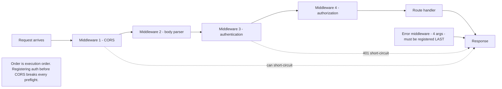
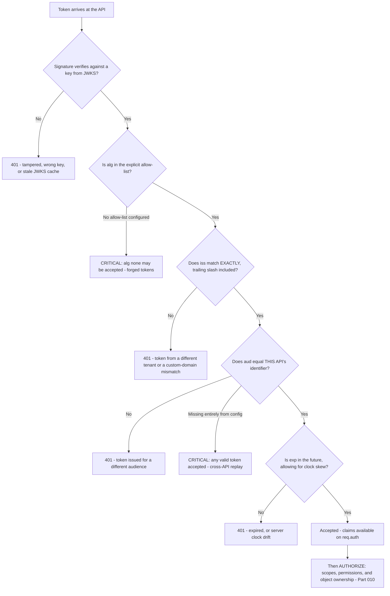
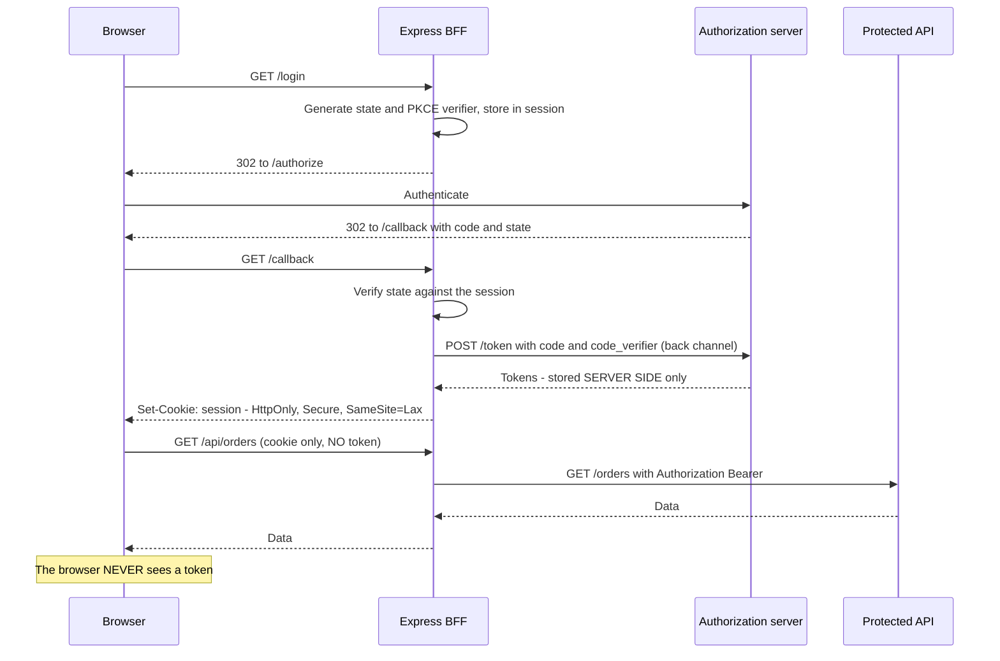
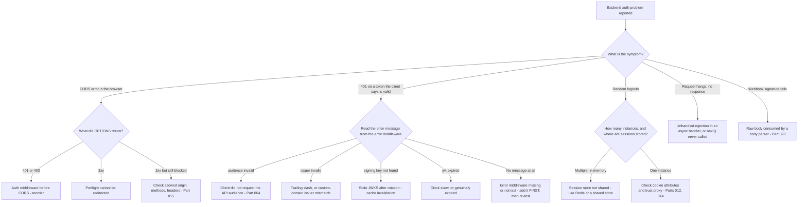

# Part 028 - Node.js and Express for Support Engineers

> Section goal: Build the server side. After this Part you can reproduce backend authentication tickets locally, read middleware ordering problems at a glance, and you will have produced the API half of the portfolio artifact that turns "ideally JavaScript" from a CV line into something you can show.

Covers index item **028**. Maps to JD signals: *proficient in at least one programming language; ideally JavaScript*, *knowledge of software development fundamentals and common architectures*, *knowledge of HTTP*, *strong analytical and problem-solving skills*, and *basic security concepts*.

---

## 1. Start From Zero: What Node.js Is

**Node.js** runs JavaScript outside a browser. Same language, different environment.

| | Browser JavaScript | Node.js |
|---|---|---|
| Has a DOM | ✅ | ❌ |
| Has `window` / `document` | ✅ | ❌ |
| Has file system access | ❌ | ✅ |
| Has environment variables | ❌ (build-inlined only — Part 027) | ✅ `process.env` |
| Can keep a secret | ❌ | ✅ |
| Client type (Part 010) | **Public** | **Confidential** |
| Enforces CORS | ✅ | ❌ (it *sends* CORS headers) |

**That "can keep a secret" row is the whole reason Node matters in identity work.** A Node server is a confidential client, so it can hold a client secret, perform a back-channel token exchange, and store tokens where the browser cannot reach them.

> **Analogy.** The browser is a shop floor — everything is visible to customers. Node is the back office — same staff, same company, but the safe is in there.
>
> **Where it stops:** a back office has a physical door. A Node process is only as private as its deployment, its environment variables, and its logs — all of which leak secrets routinely.

### 🔍 Plain-English deep-dive: why a support engineer needs to run a server at all

You are not being hired to build backends. But you cannot diagnose these ticket types without one:

| Ticket type | Requires a local server |
|---|---|
| "Our API rejects your tokens" | To reproduce validation with the same library |
| "Our middleware order breaks CORS preflight" | To reproduce the 401-on-`OPTIONS` (Part 015) |
| "Sessions don't persist behind our load balancer" | To reproduce a session store problem |
| "The BFF pattern doesn't work for us" | To build one and show it does |
| "Webhook signature verification always fails" | To reproduce the raw-body trap (Part 020) |
| "Client credentials returns 401" | To reproduce the audience problem without a browser |

Each of those is a **confidential-client or server-side** problem that a browser cannot demonstrate. Forty lines of Express reproduces every one of them.

**Analogy:** a mechanic who can only test-drive cars, never open the bonnet. Half the faults are diagnosable, half are not. **Where it stops:** you still cannot see inside the *platform* — for that you need tenant logs (Part 107). Express gives you the customer's half.

---

## 2. Express in Ten Minutes

**Express** is the standard minimal web framework for Node.

```js
import express from "express";
const app = express();

app.use(express.json());                       // middleware: parse JSON bodies

app.get("/health", (req, res) => {
  res.json({ ok: true });
});

app.post("/echo", (req, res) => {
  res.status(200).json({ received: req.body });
});

app.listen(4000, () => console.log("listening on 4000"));
```

| Concept | Meaning |
|---|---|
| `app.use(fn)` | Register **middleware** — runs for matching requests, in order |
| `app.get/post/...` | Register a **route handler** |
| `req` | The incoming request: `req.headers`, `req.body`, `req.query`, `req.params` |
| `res` | The response: `res.status()`, `res.json()`, `res.send()`, `res.set()` |
| `next()` | Pass control to the next middleware |
| Error middleware | A handler with **four** parameters `(err, req, res, next)` |

### Middleware order is the whole game



**Express middleware runs in registration order.** That single fact explains a large share of Express-related identity tickets, and it is worth being able to state instantly.

---

## 3. The Four Middleware Ordering Bugs

### 🔍 Plain-English deep-dive: why ordering causes such disproportionate damage

Middleware is a pipeline, and each stage can *stop* the request. So a stage registered too early can reject requests that later stages were supposed to handle — and the later stage never runs, so its correct configuration is irrelevant.

The developer then looks at the stage they configured, sees it is correct, and concludes the platform is broken. The actual fault is invisible because it is a property of the *arrangement*, not of any component.

| # | Wrong order | Symptom | Correct order |
|---|---|---|---|
| 1 | Auth **before** CORS | **`OPTIONS` returns 401**; every cross-origin call fails with a CORS error (Part 015) | CORS first — preflight carries no credentials |
| 2 | JSON parser **before** the webhook route | **Signature never validates** (Part 020) | Raw-body capture for that route first |
| 3 | Error middleware **not last** | Errors fall through unhandled; generic 500s with no detail | Register it after all routes |
| 4 | Session **after** the routes using it | `req.session` is `undefined`; login loop | Session before any route that reads it |

**Bug 1 is the most common and the most misdiagnosed.** A preflight `OPTIONS` request deliberately carries no `Authorization` header and no cookies. Authentication middleware sees an unauthenticated request and returns 401. The browser sees a non-2xx preflight and reports a CORS error. The developer spends a day adding CORS headers to a handler that is never reached.

**Diagnostic:** look for the `OPTIONS` request in the HAR returning 401 or 403. Five seconds, once you know.

**Analogy:** a building where the ID check is placed before the reception desk that issues the IDs. Nobody can ever get one. **Where it stops:** a person would notice the absurdity. A middleware stack has no vantage point from which the arrangement is visible.

---

## 4. Validating a Token in Express

This is the code you will read most often in customer tickets.

```js
import express from "express";
import { expressjwt } from "express-jwt";
import jwksRsa from "jwks-rsa";
import cors from "cors";

const app = express();

// 1. CORS FIRST - so preflight never reaches auth
app.use(cors({
  origin: "https://app.example.com",     // specific, validated - never a wildcard with credentials
  credentials: true,
  allowedHeaders: ["Authorization", "Content-Type"],
  maxAge: 600
}));

// 2. Token validation
const checkJwt = expressjwt({
  secret: jwksRsa.expressJwtSecret({
    jwksUri: "https://TENANT/.well-known/jwks.json",
    cache: true,                 // cache the keys - Part 019
    rateLimit: true,
    jwksRequestsPerMinute: 5
  }),
  audience: "https://api.example.com",   // MUST be the API identifier - Part 064
  issuer: "https://TENANT/",             // note the trailing slash
  algorithms: ["RS256"]                  // NEVER allow "none"
});

app.get("/orders", checkJwt, (req, res) => {
  // req.auth now holds the verified claims
  res.json({ sub: req.auth.sub });
});

// 3. Error middleware LAST
app.use((err, req, res, next) => {
  if (err.name === "UnauthorizedError") {
    return res.status(401).json({ error: "invalid_token", message: err.message });
  }
  next(err);
});
```

### The five things to check in any customer's validation code

| # | Check | Why it matters | Failure if wrong |
|---|---|---|---|
| 1 | `audience` equals the **API identifier** | A token for another audience must be rejected | 401 with "audience invalid", or worse, acceptance |
| 2 | `issuer` matches exactly, **including trailing slash** | Prevents tokens from another tenant | 401 "jwt issuer invalid" |
| 3 | `algorithms` is an explicit allow-list | Prevents algorithm confusion (Part 043) | **Critical vulnerability** if `none` is accepted |
| 4 | JWKS is **cached** with rotation handling | Refetching per request causes 429 (Part 019) | Rate limiting, latency |
| 5 | Error middleware is registered and **last** | Otherwise the failure reason is invisible | Generic 500s, undiagnosable |

**Point 3 deserves emphasis.** If a library is configured to accept `alg: none`, an attacker can forge any token by simply omitting the signature. Verifying that `algorithms` is explicitly set is a security review you should perform on every piece of validation code you read, whether or not it is the reported issue.



### 🔍 Plain-English deep-dive: why validation order matters for the error message

The checks above are not interchangeable, and the order determines what the customer sees.

Signature verification comes first because every other claim is meaningless if the token is forged — an attacker could put any `iss` and `aud` they liked into an unsigned payload. So a library that checked audience before signature would be reporting on attacker-controlled data.

But that ordering has a support consequence: **a signature failure masks everything else.** If a customer's JWKS cache is stale after a key rotation, they get "signing key not found" — and they will *not* learn that their audience is also misconfigured until the first problem is fixed. So a token validation ticket can require two rounds even when both faults were present from the start.

**The habit this produces:** when a customer fixes one validation error and immediately reports another, that is not a new bug and it is not your first diagnosis being wrong. It is the next check in the sequence becoming reachable. Saying so explicitly — *"that's expected; the signature check was masking the audience check, and this is the next one in the chain"* — preserves your credibility and sets the right expectation.

**Analogy:** a car that fails an inspection on brakes. Fixing the brakes reveals a failed emissions test that was always there; the inspector was not wrong the first time. **Where it stops:** an inspector can list every fault at once. A validation library short-circuits on the first failure by design, because continuing to evaluate an unverified token would be unsafe.

---

## 5. Sessions and the BFF

For a server-rendered app or a Backend-for-Frontend (Part 010), the server holds the tokens and the browser gets only a session cookie.



### Session store: the load-balancer trap

| Store | Survives restart? | Works across instances? | Verdict |
|---|---|---|---|
| **In-memory (default)** | ❌ | ❌ | **Development only** |
| Redis / shared cache | ✅ | ✅ | Standard production choice |
| Database | ✅ | ✅ | Fine, slower |
| Signed cookie (data in the cookie) | ✅ | ✅ | Beware the 4 KB limit (Part 014) |

**The in-memory default is the trap.** Express's default session store is memory-based and explicitly not for production. With two or more instances behind a load balancer, a user's session exists on one instance only. Requests routed elsewhere see no session, so the app redirects to login — and the loop's frequency depends on load balancing, which is why it presents as *"random logouts that get worse under load."*

**Diagnostic question:** *"How many instances are you running, and where is the session stored?"* If the answer is "several" and "in memory", that is the whole ticket.

---

## 6. Failure Modes

| Failure mode | Symptom | Consequence | Correction |
|---|---|---|---|
| **Auth before CORS** | `OPTIONS` returns 401 | Every cross-origin call fails | CORS middleware first |
| **JSON parser before webhook route** | Signature never validates | Blocked webhook integration | Capture raw body for that route |
| **Error middleware not last** | Generic 500s, no reason | Undiagnosable failures | Register after all routes |
| **In-memory sessions in production** | Random logouts, worse under load | Constant re-authentication | Shared session store |
| **Missing `audience`** | Any valid token accepted | **Cross-API token replay** | Set it to the API identifier |
| **`algorithms` not set** | `alg: none` may be accepted | **Forged tokens** | Explicit allow-list |
| **Issuer trailing slash mismatch** | 401 "issuer invalid" | Total failure, confusing message | Match the discovery document exactly |
| **JWKS not cached** | 429s, latency spikes | Rate limiting | Cache with `kid`-miss refetch |
| **Secrets in code** | Client secret committed | Permanent exposure | `process.env`, git-ignored `.env` |
| **`trust proxy` not set** | `http` redirect URIs; `Secure` cookies rejected | Login loop (Part 012) | `app.set("trust proxy", 1)` |
| **Unhandled promise in a handler** | Request hangs, no response | Client times out | `try/catch`, or an async wrapper |
| **Logging the whole request** | Tokens and cookies in logs | Credential exposure | Redact before logging (Part 006) |

---

## 7. Troubleshooting Decision Tree: Diagnosing an Express Auth Problem



**Note T5.** If a customer reports "just a 401 with no detail", the first fix is not to guess — it is to **get the error middleware in place** so the library's actual message is visible. That single change frequently ends the investigation, because `express-jwt` and its peers produce precise messages that nobody was surfacing.

### Worked example

*"Our React app can't call our Express API. CORS error. Works in Postman."*

1. **"Works in Postman" is expected** — Postman is not a browser and ignores CORS entirely (Part 015). Say so kindly; it is offered as evidence the API is fine, and it does usefully confirm the API works.
2. **Which host returned the failing response?** From the HAR: their own API. So this is their Express configuration, not the identity vendor's.
3. **Is there an `OPTIONS` request?** Yes — they send `Authorization: Bearer`, which is not a safelisted header, so the request is preflighted.
4. **What did `OPTIONS` return?** **401.**
5. **Ask for their middleware registration order.** They send:
   ```js
   app.use(checkJwt);
   app.use(cors({ origin: "https://app.example.com" }));
   ```
6. **Diagnosis:** authentication is registered first. The preflight carries no `Authorization` header by design, so `checkJwt` rejects it with 401. The CORS middleware never runs, so no CORS headers are ever sent, and the browser reports a CORS failure for a request that was actually an authentication failure.
7. **Fix:** swap the order. CORS first, then authentication. Also add `authorization` to `allowedHeaders`, set `maxAge` so preflights are cached, and add `Vary: Origin` if a CDN is in front.
8. **The next trap they will hit:** with `credentials: true`, the origin must be a specific validated value — a wildcard is forbidden with credentials, and reflecting any incoming origin is a genuine vulnerability.
9. **Prevention:** an integration test issuing a cross-origin `OPTIONS` and asserting a 2xx with the expected headers, because this regresses whenever middleware is reordered.

Two questions — *which host* and *what did `OPTIONS` return* — reached a precise root cause in someone else's middleware arrangement.

---

## 8. Lab: Build the API Half of Your Portfolio

**Purpose.** Produce a working, correctly-configured Express API with token validation, then break it in the six ways customers do. This is a showable artifact.

**Prerequisites.** Part 007's lab tenant with an API registered, Node.js, Parts 024–027. **Your own tenant and localhost only.**

**Steps.**

1. Create `okta-prep/labs/028-express-api/`. `npm init -y`, then install Express, a JWT-validation middleware, a JWKS client, and a CORS middleware.
2. **Secrets hygiene first.** Create `.env` with your tenant domain and API identifier. Confirm `.env` is git-ignored **before** writing any code (Part 007).
3. **Health route.** `GET /health` returning `{ ok: true }`, no auth. Confirm with curl.
4. **Protected route.** `GET /orders` behind token validation, configured with all five checks from §4: correct `audience`, exact `issuer`, explicit `algorithms`, JWKS caching, and a proper error middleware **registered last**.
5. **Get a real token.** Use the Part 022 scripts to obtain an access token for this API from your lab tenant. Call `/orders` with it. **Confirm 200 and log the verified `sub` claim.**
6. **Break it, six ways.** For each, record the **exact** error message the error middleware surfaces:
   - a. Remove `audience` from the config, then call with a token for a different audience
   - b. Change `issuer` by removing the trailing slash
   - c. Call with an expired token (wait, or use a short-lived one)
   - d. Tamper with one character of the signature
   - e. Point `jwksUri` at a wrong path so the key cannot be found
   - f. Remove the error middleware entirely and observe what the client sees instead
   **Step (f) is the point of the exercise** — record how much less useful the response becomes.
7. **The CORS ordering bug.** Register `checkJwt` before `cors`. From a browser page on a different port, call `/orders`. **Record the console error and the `OPTIONS` 401 in the Network tab.** Then swap the order and confirm it works. Screenshot both.
8. **Trust proxy.** Add a middleware that logs `req.protocol` and `req.secure`. Run behind a local reverse proxy that sets `X-Forwarded-Proto: https` and record the values with and without `app.set("trust proxy", 1)`.
9. **Session store.** Add a session-based route. Run **two** instances on different ports with an in-memory store, alternate requests between them, and record the session being lost. Then swap in a shared store (a file or SQLite store is sufficient) and record it persisting.
10. **Redaction.** Add request logging that deliberately logs all headers. Observe the `Authorization` header in the log. Then implement redaction and confirm it is masked. **Record both** — this is the Part 006 lesson made concrete.
11. **README.** Write a short README describing what the API does, how to run it, the five validation checks, and the six failure modes with their exact messages. **This file is what you would show an interviewer.**
12. **Failure catalog + manifest.** Add all rows. Complete `MANIFEST.md`, stating honestly that this is a lab API, not production experience.

**Expected evidence.** A running Express API with correct validation, a successful authenticated call, six verbatim error messages, before/after screenshots of the CORS ordering bug, a trust-proxy comparison, a two-instance session-loss demonstration, a redaction before/after, and a README.

**Validation rubric.**

| Check | Pass condition |
|---|---|
| `.env` ignored first | Its `.gitignore` entry precedes any code commit |
| Five checks present | Audience, issuer, algorithms, JWKS caching, error middleware last |
| Real token accepted | 200 returned, `sub` logged from verified claims |
| Six errors verbatim | Copied exactly; (f) shows the loss of detail without error middleware |
| CORS bug reproduced | `OPTIONS` 401 captured, then fixed and re-verified |
| Trust proxy shown | `req.protocol` differs with and without the setting |
| Session loss shown | Two instances, in-memory store, session lost; shared store fixes it |
| Redaction shown | `Authorization` visible before, masked after |
| README usable | An interviewer could run it from the README alone |

**Cleanup and privacy.** Your own tenant and localhost only. Never commit `.env`. **Redact every token from saved output.** Use synthetic users. Rotate any client secret used when the lab is complete, and delete the lab API registration from your tenant if you are finished with it.

---

## 9. JD Mapping

| Supplied JD signal | How this Part supports it |
|---|---|
| **Proficient in a programming language; ideally JavaScript** | §8 produces a real, runnable, showable API |
| Knowledge of software development fundamentals | Middleware pipelines, configuration, environment separation, session state |
| **Knowledge of common architectures** | §5's BFF sequence and the load-balanced session problem |
| Knowledge of HTTP | Preflight, headers, status codes, proxy headers |
| Strong analytical and problem-solving skills | §7's tree, and the "get error middleware in place first" instinct |
| Basic security concepts | Explicit `algorithms`, audience validation, secret handling, log redaction |
| Promote best practices | CORS-first ordering, JWKS caching, shared session stores, integration tests |
| Instinctive ability to subdivide problems | Two questions locate a fault inside someone else's middleware arrangement |

---

## 10. Candidate Honesty Note

- **This Part produces your single most useful portfolio artifact.** A working Express API with correct token validation, plus a documented list of six failure modes with exact messages, is concrete evidence that no CV line can match.
- **The strongest thing you can say:** *"I built an Express API that validates tokens properly — audience, issuer, explicit algorithms, cached JWKS, and error middleware last — and then broke it six ways so I know what each failure actually says. The one I'd flag in any customer's code even if it's not the reported issue is `algorithms` not being explicitly set, because accepting `alg: none` means anyone can forge a token."*
- **A second strong point:** *"If a customer says 'just a 401 with no detail', my first move isn't to guess — it's to get their error middleware registered and last, because the library's actual message is precise and nobody was surfacing it. That change alone often ends the investigation."*
- **A third:** *"'Random logouts that get worse under load' with multiple instances and an in-memory session store is the whole ticket in one question."*
- **Be honest about scope:** you built a lab API. You have not operated a production backend. Say exactly that, and let the artifact speak.
- **Never claim** backend engineering experience. You reproduce, diagnose, and correct — which is the role.

---

## 11. Official Source Anchors

Accessed **26 August 2026**.

| Source | What it defines |
|---|---|
| Node.js documentation — `process.env`, HTTP module, ESM support | §1 |
| Express documentation — middleware, routing, error handling, `trust proxy` | §§2–3, and the proxy setting in §6 |
| `express-jwt` and `jwks-rsa` documentation | The validation configuration in §4 |
| `cors` middleware documentation | Options and ordering in §4 and §7 |
| `express-session` documentation — store warning | §5's explicit statement that the default store is not for production |
| IETF RFC 7519 and the JWT Best Current Practices RFC | Why `algorithms` must be an explicit allow-list (Part 043) |
| Auth0 and Okta backend/API quickstarts | Vendor-recommended validation configuration to compare against |
| OWASP — logging cheat sheet | Redaction guidance for §8 step 10 |

**Revalidate after 26 August 2026:** middleware package APIs and vendor quickstart code. Express and Node fundamentals are stable.

---

## ⭐ Likely Interview Questions for This Section

### Q1. "A customer's React app gets a CORS error calling their own Express API. Where do you start?"
> *Model answer:* "Two questions. Which host returned the failing response — because a lot of CORS tickets opened with an identity vendor are actually about the customer's own API, and the HAR settles it. Then: is there an `OPTIONS` preflight, and what did it return? If it's a 401, that's middleware ordering — their authentication middleware is registered before their CORS middleware, and a preflight deliberately carries no `Authorization` header, so auth rejects it and the CORS middleware never runs. The browser then reports a CORS error for what was actually an authentication failure, and the developer spends a day adding CORS headers to a handler that's never reached. The fix is to register CORS first. I'd also check `allowedHeaders` includes `authorization`, set `maxAge` so preflights are cached, and note that with `credentials: true` the origin must be a specific validated value rather than a wildcard."

### Q2. "What would you check in a customer's token validation code?"
> *Model answer:* "Five things, and I'd check them in this order. Audience — is it set to their API identifier, because without it a token issued for a completely different API would be accepted. Issuer — does it match exactly, including the trailing slash, and does it account for a custom domain if they have one. Algorithms — is it an explicit allow-list, because if the library accepts `alg: none` anyone can forge a token by omitting the signature, and that's the one I'd flag even if it isn't the reported issue. JWKS caching — are they fetching keys per request, which causes rate limiting and latency, and does the cache refetch on an unknown `kid` so key rotation doesn't cause an outage. And error middleware — is it registered, and is it last, because without it the library's precise error message is replaced by a generic 500 and nobody can diagnose anything."

### Q3. "A customer says they get 'just a 401 with no detail'. What do you do?"
> *Model answer:* "Get the detail before guessing. In Express, JWT middleware throws errors with precise messages — 'jwt audience invalid', 'jwt issuer invalid', 'signing key not found', 'jwt expired' — but they only reach the client if there's an error-handling middleware registered, with four parameters, after all the routes. Very often there isn't one, so the framework's default handler returns a generic 500 or an empty 401 and all that precision is discarded. So my first response is to have them add the error middleware and re-test rather than to hypothesise. That single change frequently ends the investigation, because the message names the cause exactly. It's also a good thing to leave them with permanently, because they'll diagnose the next one themselves."

### Q4. "A customer has random logouts that get worse under load. What's your hypothesis?"
> *Model answer:* "Session store not shared across instances. Express's default session store is in-memory and explicitly documented as not for production. With two or more instances behind a load balancer, a user's session exists on whichever instance handled the login, so any request routed elsewhere sees no session and the app redirects to login. It looks random because it depends on load-balancer routing, and it gets worse under load because more instances and more requests mean more chances of landing on the wrong one. So the question is: how many instances are you running, and where is the session stored? If the answer is 'several' and 'in memory', that's the whole ticket. The fix is a shared store — Redis or a database. And I'd check the cookie attributes too, because a `Secure` cookie behind a TLS-terminating proxy without `trust proxy` set produces a similar-looking loop for a different reason."

### Q5. "Why does middleware order matter so much?"
> *Model answer:* "Because middleware is a pipeline where each stage can stop the request, and it runs in registration order. So a stage registered too early can reject requests that a later stage was supposed to handle — and because the later stage never runs, its configuration is irrelevant no matter how correct it is. That's what makes it so hard to self-diagnose: the developer inspects the component they configured, sees it's right, and concludes the platform is broken. The fault is a property of the arrangement rather than of any component. The four orderings that cause identity problems are: auth before CORS, which breaks every preflight; a JSON body parser before a webhook route, which breaks signature verification because the raw bytes are consumed; error middleware not registered last, which hides every failure reason; and session middleware after the routes that read the session."

### Q6. "Why does a Node backend matter for identity when the app is a SPA?"
> *Model answer:* "Because a Node process can keep a secret and a browser cannot — that's the whole distinction between a confidential and a public client. It unlocks three things. First, a proper back-channel token exchange with client authentication, which a SPA can't do. Second, the BFF pattern, where the server holds the tokens and the browser gets only an `HttpOnly` session cookie, so there's no token in the browser for XSS to steal and no reliance on third-party cookies for renewal. Third, machine-to-machine calls with client credentials, where there's no user at all. From a support perspective it also matters because half the ticket types — token validation, middleware ordering, session persistence, webhook signature verification — can only be reproduced server-side. A browser simply cannot demonstrate them."

### Q7. "What's `trust proxy` and why does it matter?"
> *Model answer:* "It tells Express to trust the `X-Forwarded-*` headers set by a reverse proxy or load balancer. Without it, when the load balancer terminates TLS and forwards over plain HTTP, Express sees `req.protocol` as `http` and `req.secure` as false. Two things then break simultaneously: any URL the app builds — including redirect URIs — uses `http`, so it fails exact-match against the allow-list; and any cookie marked `Secure` is refused because the app believes the connection is insecure, which produces a login loop on top of the mismatch. Setting `app.set('trust proxy', 1)` fixes both. The important caveat is that it must only trust the proxy in front of it — trusting forwarded headers from arbitrary clients turns them into a spoofing vector, so the value should reflect the actual number of trusted hops rather than blanket trust."

### Q8. "You built a lab API. What does that actually prove?"
> *Model answer:* "It proves I can read and write the code customers send me, and that I know what correct looks like — audience, issuer, explicit algorithms, cached JWKS, error middleware last. More usefully, it proves I've *broken* it: I have the exact error text for six distinct validation failures, so when a customer pastes one I recognise it rather than reasoning it out. And it proves the middleware-ordering bug isn't theory for me — I reproduced the `OPTIONS` 401 and screenshotted it. What it doesn't prove is production backend experience, and I wouldn't claim that. I built a lab API, not a service under load with real users. But for this role that's the right depth: I'm not being hired to build backends, I'm being hired to diagnose someone else's and hand back a corrected snippet that runs."

---

## 🧠 30-Second Memory Hooks

- **Node can keep a secret; a browser cannot.** Confidential vs public client — the whole distinction.
- **Express middleware runs in REGISTRATION order.** Order is the game.
- **Auth before CORS = `OPTIONS` returns 401** = every cross-origin call fails. **The classic.**
- **Error middleware has FOUR args and must be LAST.** Without it, precise messages become generic 500s.
- **"Just a 401 with no detail" → add error middleware FIRST, then re-test.** Often ends the investigation.
- **Five validation checks:** `audience` · `issuer` (trailing slash!) · explicit `algorithms` · cached JWKS · error middleware last.
- **`algorithms` not set = `alg: none` may be accepted = forged tokens.** Flag it always.
- **In-memory sessions + multiple instances = "random logouts, worse under load."** One question.
- **`trust proxy` unset behind a TLS-terminating LB = `http` redirect URIs AND rejected `Secure` cookies.** Two bugs, one cause.
- **JSON parser before a webhook route destroys the raw body** → signature can never validate.

---

## ✅ Completion Checklist

- [ ] **Knowledge:** I can name the five validation checks, the four middleware ordering bugs, and why in-memory sessions fail under load.
- [ ] **Lab artifact:** `028-express-api/` runs, validates real tokens from my tenant, has six verbatim failure messages, before/after CORS screenshots, a session-loss demonstration, and a README an interviewer could follow.
- [ ] **Spoken:** I can deliver the CORS-ordering diagnosis in under 60 seconds, including why "works in Postman" is expected.
- [ ] **Honesty check:** `.env` was never committed; all tokens are redacted; the manifest states this is a lab API, not production experience.
- [ ] **Source check:** I have read the `express-session` store warning and my JWT middleware's own configuration documentation.

---

*Next suggested section:* **[Part 029 - Application Types: SPA, Web App, Native, and Machine-to-Machine](Part-029-application-types-spa-web-app-native-and-machine-to-machine.md)** — with both halves of the stack built, classify every application shape by whether it can keep a secret, and derive the correct flow for each.
