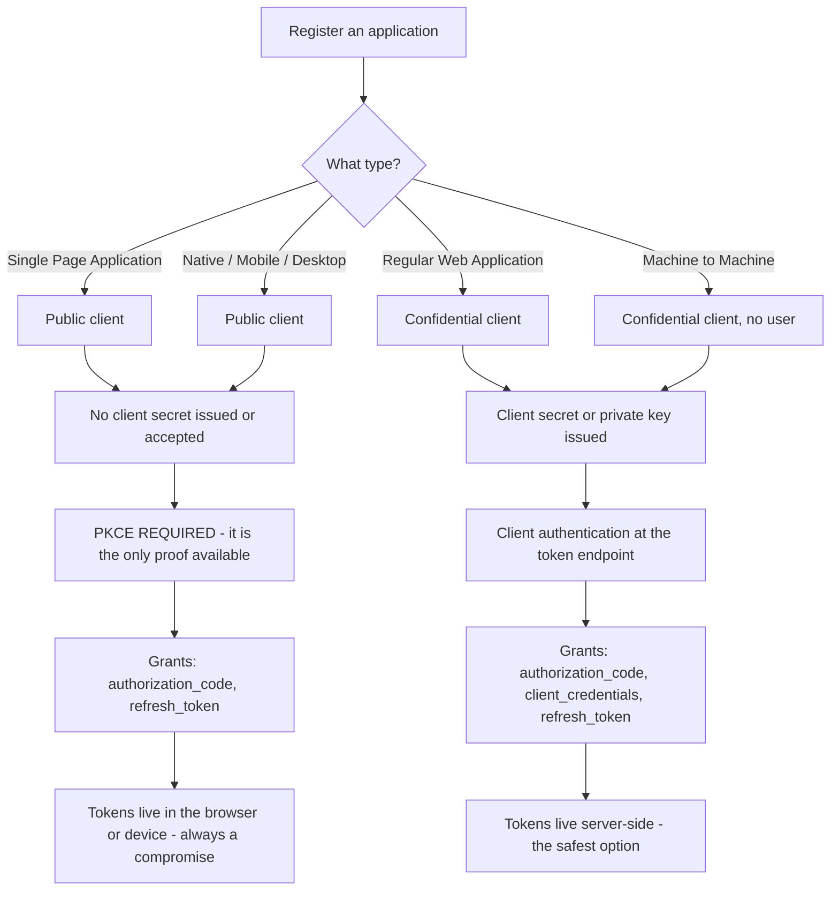
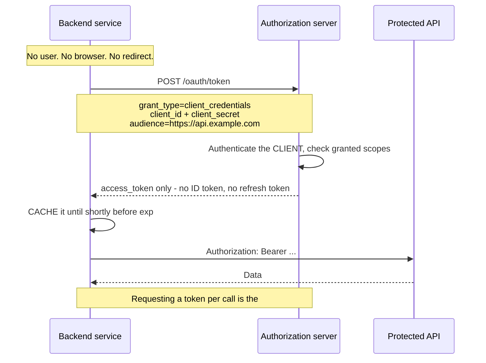
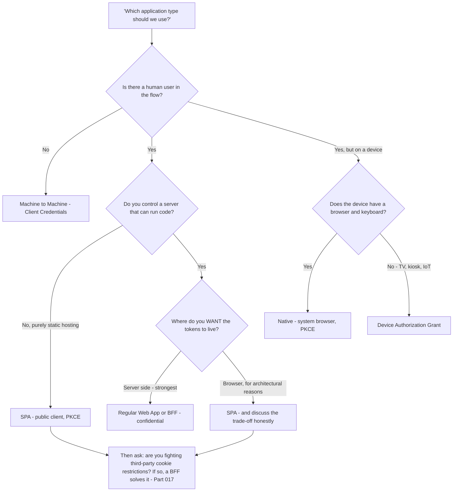
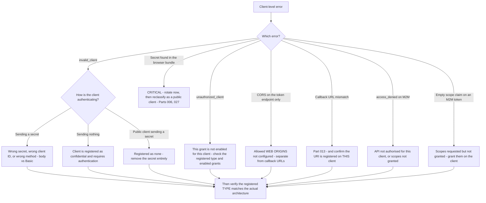

# Part 029 - Application Types: SPA, Web App, Native, and Machine-to-Machine

> Section goal: Turn "what kind of app is it?" into a fast, reliable classification that immediately determines the flow, the client authentication method, where tokens live, and the three most likely causes of their ticket. Part 010 mapped where identity sits in an architecture; this Part is the registration-level decision that follows from it.

Covers index item **029**. Maps to JD signals: *knowledge of common architectures*, *understanding of authentication and authorization concepts*, *proficient in at least one programming language*, *business and technical analysis skills*, and *promote best practices*.

---

## 1. Start From Zero: Why the Platform Asks You to Pick a Type

When a developer registers an application in an identity tenant, the first choice is its **type**. That choice is not cosmetic — it changes what the platform will allow.

**The single question underneath all of it, from Part 010:** *can this component keep a secret?*

| | Can keep a secret | Cannot keep a secret |
|---|---|---|
| Called | **Confidential client** | **Public client** |
| Examples | Server-rendered web app, backend service, daemon, BFF | SPA, mobile app, desktop app, CLI |
| Proves identity by | Client secret, or private key JWT | **It cannot** — PKCE proves *continuity* instead |
| Token endpoint | Authenticates the client | Accepts the request with a PKCE verifier |
| Refresh tokens | Standard | Permitted, but require rotation |

> **Analogy.** A shop giving out keys. Staff get a named key that identifies them. Customers get a numbered ticket that proves they are the same person who checked the coat in — not who they are.
>
> **Where it stops:** a coat-check ticket can be handed to someone else. PKCE cannot, because the verifier is never transmitted until it is redeemed — which is exactly the point.

### 🔍 Plain-English deep-dive: what PKCE actually replaces

A confidential client says to the token endpoint: *"here is the code, and here is my secret, which proves I am the client this code was issued to."*

A public client has no secret. So PKCE substitutes a different proof:

1. Before starting, the client generates a random **`code_verifier`** and keeps it locally.
2. It sends only a **hash** of it (`code_challenge`) on the `/authorize` request.
3. At the token endpoint, it sends the original `code_verifier`.
4. The server hashes it and compares.

That proves the party redeeming the code is the **same party that started the flow** — because only they ever had the verifier. It does *not* prove *who* they are, and it does not need to.

**Why this matters in support:** a developer who tries to use a client secret from a SPA is solving the wrong problem in the wrong place. The platform will typically refuse to issue a secret for a SPA type at all, and if they force one in from elsewhere, it is published to every visitor (Part 027). The correct answer is not "hide the secret better" — it is "you are a public client; PKCE is the mechanism."

**Analogy:** a signature versus a torn-ticket stub. A signature says who you are; a matching stub says you are the person who was handed the other half. Different proofs, both valid, for different situations. **Where it stops:** a stub can be stolen physically. A verifier held in memory and never transmitted until redemption is much harder to intercept — which is precisely why PKCE was designed this way.

---

## 2. The Four Types, In Detail

### 2.1 Single Page Application

| Property | Value |
|---|---|
| Client type | **Public** |
| Flow | Authorization Code **with PKCE** |
| Client authentication | None |
| Token storage | Memory (safest), or storage (persists, XSS-exposed) — Part 016 |
| Session renewal | Rotating refresh token, or silent auth (fragile — Part 017) |
| Registration needs | Allowed callback URLs, allowed logout URLs, **allowed web origins** (CORS) |
| Top three ticket causes | CORS · exact redirect URI · missing `audience` |

**The registration detail people miss:** allowed **callback URLs** and allowed **web origins** are different settings. Callback URLs govern where the authorization response may be delivered (Part 013). Web origins govern which origins may call the token endpoint from the browser (Part 015). Configuring one and not the other produces a flow that reaches the callback and then fails at the token exchange with a CORS error — and the developer, reasonably, assumes the callback setting covered it.

### 2.2 Regular Web Application

| Property | Value |
|---|---|
| Client type | **Confidential** |
| Flow | Authorization Code (+ PKCE, now recommended even here) |
| Client authentication | Client secret, or private key JWT |
| Token storage | **Server-side.** The browser holds only a session cookie |
| Session renewal | Server-side refresh token |
| Registration needs | Callback URLs, logout URLs, a secret |
| Top three ticket causes | Cookie attributes · session store not shared · `trust proxy` unset |

**This is the safest shape** and it is worth recommending when a customer has the option. No token ever reaches the browser, so there is no XSS token-theft surface and no third-party cookie dependency.

### 2.3 Native / Mobile / Desktop

| Property | Value |
|---|---|
| Client type | **Public** — a shipped binary can be decompiled |
| Flow | Authorization Code with PKCE, in the **system browser** |
| Client authentication | None |
| Token storage | Platform secure storage (Keychain, Keystore, credential manager) |
| Redirect mechanism | Custom URI scheme, claimed HTTPS URL, or loopback |
| Registration needs | Callback URLs including the scheme or loopback pattern |
| Top three ticket causes | Redirect scheme not registered · embedded webview · deep link not claimed |

**The loopback special case:** for desktop and CLI applications, the redirect is often `http://127.0.0.1:PORT/callback` where the OS assigns the port at runtime. The specification permits the port to vary for loopback redirects precisely because the application cannot know it in advance. Knowing this saves an argument about why a fixed-port registration keeps failing.

### 2.4 Machine-to-Machine

| Property | Value |
|---|---|
| Client type | **Confidential** |
| Flow | **Client Credentials** — no user, no browser, no redirect |
| Client authentication | Client secret, or private key JWT |
| Token content | **No ID token.** The subject *is* the application |
| Registration needs | An authorised API, and granted scopes/permissions |
| Top three ticket causes | Wrong `audience` · scopes not granted · **token not cached** |

**Two things developers consistently get wrong here:**

1. **They expect an ID token.** There is no user, so there is no identity to assert. `sub` is the client itself.
2. **They request a token per API call.** It works at low volume and produces 429s at scale (Part 019).

---

## 3. The Classification Table

When a developer describes their system in one sentence, this is what you reach for.

| They say | Type | Flow | Secret? | Tokens live | First three checks |
|---|---|---|---|---|---|
| "React / Angular / Vue app" | SPA | Code + PKCE | ❌ | Browser | Web origins · redirect URI · `audience` |
| "Django / Rails / ASP.NET, server renders pages" | Web app | Code + PKCE | ✅ | Server session | Cookie attributes · session store · trust proxy |
| "Next.js / Nuxt" | **Depends** | Code + PKCE | Depends | Depends | **Which half runs the flow?** |
| "iOS / Android app" | Native | Code + PKCE | ❌ | Secure storage | Scheme registered · system browser · deep link claimed |
| "Electron / desktop app" | Native | Code + PKCE, loopback | ❌ | OS credential store | Loopback port handling |
| "CLI tool" | Native | Code + PKCE loopback, or Device Flow | ❌ | OS keychain | Loopback port · Device Flow polling |
| "Nightly sync job" | M2M | Client Credentials | ✅ | Secrets manager | `audience` · granted scopes · **caching** |
| "Smart TV / kiosk" | Native | **Device Authorization Grant** | ❌ | Device store | Polling interval, `slow_down` |
| "SPA plus a small server we own" | **BFF** | Code + PKCE at the server | ✅ | Server session | Cookie `SameSite` · CSRF · shared session store |

### 🔍 Plain-English deep-dive: the Next.js problem, and why "it depends" is the correct answer

Server-rendered React frameworks — Next.js, Nuxt, SvelteKit — are genuinely ambiguous, and this is one of the most common sources of confused registration.

The same codebase runs in **two places**:

| Runs on | Can keep a secret? | Implication |
|---|---|---|
| The server (route handlers, server components) | ✅ Yes | Confidential client |
| The browser (client components) | ❌ No | Public client |

So the answer to "which type?" is: **whichever half performs the token exchange.**

- If the exchange happens in a server route handler → register as a **Regular Web Application**, use a secret, keep tokens server-side. This is the recommended shape and is effectively a BFF.
- If the exchange happens in browser code → register as a **SPA**, use PKCE, no secret.
- **If they are unsure, that is itself the diagnosis** — mixed configuration is a very common cause of "it works locally and fails when deployed", because the server and client halves resolve differently.

**The dangerous middle case:** a developer registers as a Regular Web Application, obtains a secret, and then references it in a component that is bundled to the browser. Part 027's mechanism inlines it into the public bundle. That is a live secret exposure requiring rotation.

**The clarifying question:** *"Which file performs the code exchange, and does that file run on the server or in the browser?"* If they cannot answer immediately, ask them to search the bundle for the secret (Part 027 §4) — it takes thirty seconds and settles it definitively.

**Analogy:** a building with a public lobby and a staff area, and staff keys that work in both. The key is safe in the staff area and published in the lobby. Which room is the door in? **Where it stops:** you can see which room you are standing in. Framework code frequently does not make it obvious, which is exactly why this catches people.

---

## 4. Registration Settings That Cause Tickets

| Setting | Governs | Failure if wrong | Part |
|---|---|---|---|
| **Allowed callback URLs** | Where the authorization response may be delivered | Error before the login page appears | 013 |
| **Allowed logout URLs** | Where the user may be returned after logout | Logout completes but returns to an error | 075 |
| **Allowed web origins** | Which browser origins may call token endpoints | Login works, token exchange fails with CORS | 015 |
| **Grant types enabled** | Which flows this client may use | `unauthorized_client` | 069 |
| **Token endpoint auth method** | `none` / `client_secret_post` / `client_secret_basic` / `private_key_jwt` | `invalid_client` | 060 |
| **Refresh token rotation** | Whether refresh tokens rotate and reuse is detected | Mass logout under concurrency | 025, 061 |
| **Token lifetimes** | Expiry of each token type | Too short: churn. Too long: exposure | 045 |
| **Authorised APIs and scopes** | What an M2M client may request | `access_denied` or an empty scope claim | 060 |
| **Application type itself** | Everything above | Cascading, confusing failures | This Part |

### 🔍 Plain-English deep-dive: `invalid_client` versus `unauthorized_client`

These two error codes look similar, and distinguishing them is a fast, expert-looking diagnosis.

| Error | Means | Cause |
|---|---|---|
| **`invalid_client`** | *"I could not authenticate you as a client at all"* | Wrong secret, wrong client ID, or the wrong **authentication method** — e.g. sending the secret in the body when the client is configured for Basic auth, or sending one at all when the client is registered as `none` |
| **`unauthorized_client`** | *"I know who you are, and you may not use this grant type"* | The grant is not enabled for this client — e.g. an M2M client attempting an authorization code flow, or a SPA attempting client credentials |

**The parallel to remember:** `invalid_client` is the client-level equivalent of a **401**, and `unauthorized_client` is the client-level equivalent of a **403** (Part 012). Same distinction, same diagnostic value: one means "prove who you are again", the other means "nothing you retry will change this."

**Where the application type causes it:** registering as a SPA and then attempting client credentials produces `unauthorized_client`, because the SPA type does not enable that grant. Registering as a Regular Web Application and then sending no secret produces `invalid_client`. Both are type-mismatch symptoms wearing protocol clothing.

---

## 5. Choosing a Type: The Advisory Conversation

Developers frequently ask which type to use. The JD's *"business and technical analysis skills"* means interrogating the requirement rather than answering the feature question.

**The follow-up question worth asking every time:** *"Are you already having trouble keeping users signed in across page reloads or in Safari?"* If yes, they are hitting Part 017, and a BFF or custom domain is the structural answer rather than a workaround.

> 💡 **Tie-in to your background:** this is the same consultative pattern you already run in support — a customer asks for a setting, and the useful response establishes the underlying requirement first. Your CV's *"business and technical analysis skills"* line is exactly this, and it transfers unchanged.

---

## 6. Failure Modes

| Failure mode | Symptom | Consequence | Correction |
|---|---|---|---|
| **Wrong type registered** | Cascading, confusing errors | Every downstream setting is wrong | Reclassify by "can it keep a secret?" |
| **Secret used from a SPA** | Secret in the public bundle | **Live credential exposure** | Public client; PKCE; rotate the secret |
| **Web origins not configured** | Login works, token exchange CORS-fails | Confusing partial success | Configure origins *and* callbacks |
| **Next.js half-and-half** | Works locally, fails deployed | Mixed client identity | Establish which half exchanges the code |
| **M2M expecting an ID token** | "Where is the user?" | Wrong mental model | No user exists; `sub` is the client |
| **M2M token per call** | 429 under load | Rate limiting | Cache until near `exp` |
| **Native using an embedded webview** | No SSO; federation refuses | Poor UX, broken enterprise login | System browser (Part 010) |
| **Fixed loopback port for a desktop app** | Intermittent redirect failures | Port already in use | Permit a varying loopback port |
| **`invalid_client` misread as a token problem** | Investigating the wrong layer | Time lost | Client authentication method mismatch |
| **`unauthorized_client` retried** | Loops without progress | Nothing will change | The grant is not enabled for this client |
| **Type changed without updating settings** | Previously working flow breaks | Orphaned configuration | Re-verify every setting after a type change |

---

## 7. Troubleshooting Decision Tree: Type-Related Failures

### Worked example

*"Our Next.js app works locally but gets `invalid_client` when deployed. Same code, same client ID."*

1. **Same code, different environment** → Part 009 says compare configuration, not code.
2. **Ask:** which file performs the code exchange, and does it run on the server or in the browser?
3. **They are not sure.** That uncertainty is itself informative.
4. **Ask them to search the deployed bundle** for the first few characters of the client secret (Part 027 §4). **It is there.**
5. **Two findings, in priority order.** First and urgent: their client secret is published in the browser bundle and must be rotated immediately (Part 006 §6). Second: the exchange is running in client code, so it cannot authenticate as a confidential client — hence `invalid_client`.
6. **Why it works locally:** their development server executes the route on the server side, so the exchange happens there with the secret intact. The production build moved that code into the client bundle.
7. **Two possible fixes**, and this is where the advisory conversation matters:
   - **Recommended:** move the exchange into a server route handler, keep the type as a Regular Web Application, keep tokens server-side. This is effectively a BFF and it is the strongest shape.
   - **Alternative:** reclassify as a SPA, remove the secret entirely, use PKCE, and accept tokens in the browser.
8. **Immediate actions:** rotate the secret **now**, before anything else. Then implement the chosen fix.
9. **Prevention:** a build-time check that greps the output bundle for the secret and fails the build if found — a genuinely useful thing to hand them.

That answer surfaces a security incident the customer did not know they had, explains the mechanism, offers a real choice with trade-offs, and leaves them with prevention. It began with one classification question.

---

## 8. Lab: Register and Break All Four Types

**Purpose.** Configure each application type in your own tenant, observe what the platform allows and refuses, and record the type-mismatch errors.

**Prerequisites.** Part 007's lab tenant, Parts 022 and 028's labs. **Your own tenant only, synthetic users only.**

**Steps.**

1. Create `okta-prep/labs/029-app-types/`.
2. **Register all four.** In your tenant, create one application of each type: SPA, Regular Web Application, Native, and Machine-to-Machine. Give each an obviously-lab name.
3. **Compare the settings.** For each, record which settings the platform offers and which it withholds — specifically: is a client secret issued, which grant types are enabled by default, and which URL settings appear. **Build a four-column comparison table from observation.**
4. **SPA happy path.** Complete Authorization Code + PKCE against the SPA client using your Part 022 scripts. Record success.
5. **SPA type mismatch.** Attempt client credentials with the SPA client. **Record the exact error** — expect `unauthorized_client`.
6. **Web app happy path.** Complete the code flow with the Regular Web Application, sending the client secret. Record success.
7. **Web app, no secret.** Repeat, omitting the secret. **Record the exact error** — expect `invalid_client`.
8. **Wrong auth method.** Send the secret in the body when the client expects Basic, or vice versa. Record the error and note that it is also `invalid_client` — so the message alone does not distinguish the cause.
9. **M2M happy path.** Obtain a token via client credentials for your lab API. **Decode it.** Record: is there an ID token? What is `sub`? What scopes are present?
10. **M2M without granted scopes.** Request a scope the client has not been granted. Record what happens to the `scope` claim — note whether the request fails or simply returns fewer scopes, because that difference matters diagnostically.
11. **Web origins.** On the SPA client, remove the allowed web origin, then retry the browser-based token exchange. **Record the CORS error and confirm the callback still worked** — this is the "login works, token exchange fails" pattern.
12. **Classification drill.** Write ten one-sentence application descriptions and, **timed at 30 seconds each**, record the type, flow, secret yes/no, token location, and first three checks. Score yourself.
13. **Reference + catalog.** Write `app-type-matrix.md` — the §3 table rebuilt from your own observations, plus an `invalid_client` versus `unauthorized_client` decision note. Add rows to the failure catalog. Complete `MANIFEST.md`.

**Expected evidence.** A four-type settings comparison from observation, four happy-path flows, at least four verbatim type-mismatch errors, a decoded M2M token showing no ID token, a web-origins CORS reproduction, and a scored classification drill.

**Validation rubric.**

| Check | Pass condition |
|---|---|
| Four types registered | All created, differences in offered settings recorded |
| `unauthorized_client` reproduced | SPA attempting client credentials |
| `invalid_client` reproduced twice | Missing secret, and wrong auth method — noting the identical message |
| M2M token decoded | No ID token; `sub` is the client; scopes recorded |
| Scope-not-granted behavior | You recorded whether it errors or silently narrows |
| Web origins reproduced | CORS on token exchange while the callback succeeded |
| Drill timed and scored | Ten descriptions, 30 seconds each |
| Matrix is yours | Built from observation, not copied |

**Cleanup and privacy.** Your own tenant, synthetic users, and obviously-lab application names. **Redact every client secret** — store them only in the git-ignored `secrets/` folder and reference them by environment variable. Rotate or delete all four applications when the lab is complete.

---

## 9. JD Mapping

| Supplied JD signal | How this Part supports it |
|---|---|
| **Knowledge of common architectures** | §§2–3 classify every shape a Customer Identity engineer meets |
| Understanding of authentication and authorization concepts | §1's confidential/public split and PKCE's substitution for client authentication |
| **Business and technical analysis skills** | §5's advisory tree interrogates the requirement before answering |
| Promote best practices | Server-side tokens where possible; system browser for native; token caching for M2M |
| Proficient in a programming language | §8 exercises real flows against real registrations |
| Strong analytical and problem-solving skills | §4's `invalid_client` versus `unauthorized_client` distinction |
| Instinctive ability to subdivide problems | One classification question eliminates most of the possibility space |
| Basic security concepts | §7's worked example surfaces an undetected secret exposure |

---

## 10. Candidate Honesty Note

- **Production transfer:** the consultative pattern in §5 — establishing the requirement before answering the feature question — is genuinely yours, and your CV's "business and technical analysis skills" line supports it directly.
- **New here:** the registration-level settings and the specific error codes. Both are observable in one lab session.
- **The strongest thing you can say:** *"`invalid_client` and `unauthorized_client` are the client-level equivalents of 401 and 403. One means 'I couldn't authenticate you as a client at all' — wrong secret, wrong ID, or wrong authentication method. The other means 'I know who you are and this grant isn't enabled for you', which is usually a registered application type that doesn't match what they're attempting. Retrying the second one will never work."*
- **A second strong point:** *"Next.js and similar frameworks are genuinely ambiguous, and the question that settles it is 'which file performs the code exchange, and does it run on the server or in the browser?' If they can't answer, I'd have them search the deployed bundle for their client secret — thirty seconds, and it's occasionally a security incident they didn't know about."*
- **Be honest about the lab:** you registered and tested four application types in a free-tier tenant. You have not managed application registrations for an enterprise customer estate. Say exactly that.
- **On advisory questions**, resist giving a single answer. Naming the trade-off is the senior response; naming a winner without asking about their constraints is the junior one.

---

## 11. Official Source Anchors

Accessed **26 August 2026**.

| Source | What it defines |
|---|---|
| IETF RFC 6749 §2.1 | Client types: confidential and public |
| IETF RFC 6749 §5.2 | `invalid_client` and `unauthorized_client` definitions |
| IETF RFC 7636 (PKCE) | The verifier/challenge mechanism in §1 |
| IETF RFC 8252 (OAuth for Native Apps) | System browser requirement, loopback redirects, varying ports |
| IETF RFC 8628 (Device Authorization Grant) | The device flow referenced in §3 |
| IETF OAuth 2.0 Security BCP | Current guidance on PKCE for confidential clients too |
| IETF OAuth 2.0 for Browser-Based Applications | The BFF recommendation in §5 |
| Auth0 documentation — application types, grant types, allowed callback URLs versus allowed web origins | The registration settings in §4 |
| Okta developer documentation — application types and redirect versus embedded authentication | The equivalent on the Okta side |
| Next.js documentation — server versus client components and environment variables | §3's ambiguity and §7's worked example |

**Revalidate after 26 August 2026:** vendor application-type names and default grant configurations. The RFC definitions are stable.

---

## ⭐ Likely Interview Questions for This Section

### Q1. "How do you decide which application type a customer should register?"
> *Model answer:* "One question underneath everything: can this component keep a secret? Server-side code can, so it's a confidential client and authenticates with a secret or a private key JWT. Browser JavaScript and shipped mobile binaries cannot, so they're public clients and use PKCE instead — which proves the party redeeming the code is the same one that started the flow, rather than proving who they are. Then I'd interrogate the requirement rather than just answering: is there a human user at all, because if not it's machine-to-machine with client credentials; do they control a server, because if they do then keeping tokens server-side is strictly safer; and are they already struggling to keep users signed in across reloads or in Safari, because if so they're hitting third-party cookie restrictions and a BFF is the structural answer rather than a workaround."

### Q2. "What's the difference between `invalid_client` and `unauthorized_client`?"
> *Model answer:* "They're the client-level equivalents of 401 and 403, and the distinction saves a lot of time. `invalid_client` means the server couldn't authenticate the client at all — wrong secret, wrong client ID, or the wrong authentication *method*, like sending the secret in the request body when the client is configured for HTTP Basic. Worth noting the message is identical for all three causes, so it doesn't discriminate on its own. `unauthorized_client` means the server knows exactly who the client is and this grant type isn't enabled for it — typically a SPA attempting client credentials, or an M2M client attempting an authorization code flow. The practical consequence mirrors 401 versus 403: `invalid_client` might be fixed by correcting credentials, whereas retrying `unauthorized_client` will never work because it's a registration decision, not a credential problem."

### Q3. "A customer's SPA login works but the token exchange fails with a CORS error. What's wrong?"
> *Model answer:* "Almost certainly allowed web origins not configured. Those are a separate setting from allowed callback URLs, and that separation is exactly what catches people. Callback URLs govern where the authorization response may be delivered, which is why the login itself completes and the browser lands back on their app. Web origins govern which browser origins may call the token endpoint directly, which is what a SPA does because it exchanges the code from JavaScript. So configuring callbacks alone gives you a flow that gets all the way to the callback and then fails at the exchange — and the developer reasonably assumes the callback setting covered everything. I'd confirm from the HAR that the callback succeeded and the failure is specifically on the `POST` to the token endpoint, then have them add their origin to the web origins list."

### Q4. "A customer's Next.js app works locally but fails when deployed. Where do you start?"
> *Model answer:* "By establishing which half of the framework performs the token exchange, because Next.js is genuinely ambiguous — the same codebase runs both on the server, where a secret is safe, and in the browser, where it isn't. So my question is: which file does the code exchange, and does that file run on the server or the client? If they're not sure, that uncertainty is itself the diagnosis, and I'd ask them to search their deployed bundle for the first few characters of their client secret. If it's there, I have two findings and I'd lead with the urgent one: their secret is published to every visitor and must be rotated immediately. Then the technical one: client-side code can't authenticate as a confidential client, hence `invalid_client`. It works locally because the dev server runs that route server-side. Then I'd offer both fixes with trade-offs — move the exchange to a server route handler, which is the stronger shape, or reclassify as a SPA and drop the secret."

### Q5. "What's different about machine-to-machine?"
> *Model answer:* "There's no user, so several things people expect simply don't exist. No browser, no redirect, no consent, and critically no ID token — because there's no user identity to assert. The subject of the access token is the application itself. It uses the client credentials grant: the client authenticates directly to the token endpoint with its secret or a private key JWT, names the audience it wants a token for, and gets an access token back. The three things customers get wrong are: expecting an ID token and being confused when there isn't one; getting the audience wrong so their API rejects a perfectly valid token; and — by far the most common — requesting a fresh token on every single API call rather than caching it until near expiry. That last one works fine at low volume and collapses into 429s at production scale, so I ask about caching early on any M2M ticket."

### Q6. "Why can't a SPA use a client secret?"
> *Model answer:* "Because everything shipped to a browser is readable by anyone who opens DevTools — there's no such thing as a hidden value in a SPA. A secret placed there is published to every visitor. And it's not just about someone deliberately looking: front-end build tools inline environment variables with an exposed prefix into the bundle by textual substitution, so a developer who reasons that 'environment variables are secret' can publish one without realising. The platform typically refuses to issue a secret for a SPA registration at all, which is the right guardrail. The correct mechanism is PKCE — the client generates a random verifier, sends only its hash to the authorize endpoint, and presents the original at the token endpoint. That proves the redeemer is the party that started the flow, which is what actually needed proving, without requiring a secret to exist."

### Q7. "A desktop app's redirect keeps failing intermittently. What's your hypothesis?"
> *Model answer:* "Loopback port handling. Desktop and CLI applications typically redirect to `http://127.0.0.1:PORT/callback`, and the port is assigned by the operating system at runtime because a fixed port may already be in use by something else. The specification explicitly permits the port to vary for loopback redirects for exactly this reason. So if the application was registered with a fixed port, it works whenever that port happens to be free and fails whenever it isn't — which produces the intermittent pattern. I'd confirm by asking whether the failures correlate with anything else running on the machine, and check how the redirect URI is registered. The related trap is that `localhost` and `127.0.0.1` are not the same string for exact matching, so registering one and using the other fails consistently rather than intermittently — a useful discriminator."

### Q8. "When would you recommend a BFF over a plain SPA?"
> *Model answer:* "Three situations. When they have real security requirements — a BFF means no token ever reaches the browser, so XSS can't exfiltrate one, which is the strongest available posture for a browser application. When they're already fighting third-party cookie restrictions and their silent renewal keeps failing in Safari or incognito, because a BFF makes the session first-party by construction and sidesteps the problem entirely rather than working around it. And when they're already running a server, so it's not new infrastructure. I'd be honest about the costs though: they now operate a server, every API call is proxied through it, and because they're back on cookies they need CSRF protection and a session store shared across instances. If they're on purely static hosting with no server at all, a SPA with rotating refresh tokens is the right answer and I wouldn't push them into infrastructure they don't want."

---

## 🧠 30-Second Memory Hooks

- **One question: can it keep a secret?** Server = confidential. Browser, mobile, CLI = **public**.
- **Public clients use PKCE** — it proves *continuity*, not *identity*. That is the substitution.
- **`invalid_client` = client-level 401** (wrong secret, ID, or auth **method**). **`unauthorized_client` = client-level 403** (grant not enabled). Retrying the second never works.
- **Allowed callback URLs ≠ allowed web origins.** Callbacks let login finish; origins let the **token exchange** succeed.
- **Next.js is ambiguous.** Ask: *"which file does the exchange, and where does it run?"* If unsure → **search the bundle for the secret**.
- **M2M: no user, no ID token, `sub` is the client.** And **cache the token** — per-call is the #1 M2M ticket.
- **Native: system browser, never an embedded webview.** Loopback ports vary by design.
- **`localhost` ≠ `127.0.0.1`** for exact redirect matching.
- **Changing the application type orphans its settings.** Re-verify everything afterwards.
- **BFF when: real security needs · fighting third-party cookies · already running a server.**

---

## ✅ Completion Checklist

- [ ] **Knowledge:** given a one-sentence description, I can state type, flow, secret, token location, and three checks in under 30 seconds.
- [ ] **Lab artifact:** `029-app-types/` contains four registered types with a settings comparison, four verbatim type-mismatch errors, a decoded M2M token, a web-origins CORS reproduction, and a scored drill.
- [ ] **Spoken:** I can explain `invalid_client` versus `unauthorized_client` with the 401/403 parallel in under 45 seconds.
- [ ] **Honesty check:** all four applications are in my own lab tenant with obviously-lab names; every secret is redacted and stored only in the git-ignored folder.
- [ ] **Source check:** I have read RFC 6749 §2.1 and §5.2, and RFC 8252's loopback guidance, myself.

---

*Next suggested section:* **[Part 030 - Reading, Reviewing, and Debugging Customer Code](Part-030-reading-reviewing-and-debugging-customer-code.md)** — the skill that turns everything in Group C into ticket resolution: reading unfamiliar code fast, and knowing exactly which lines matter.
