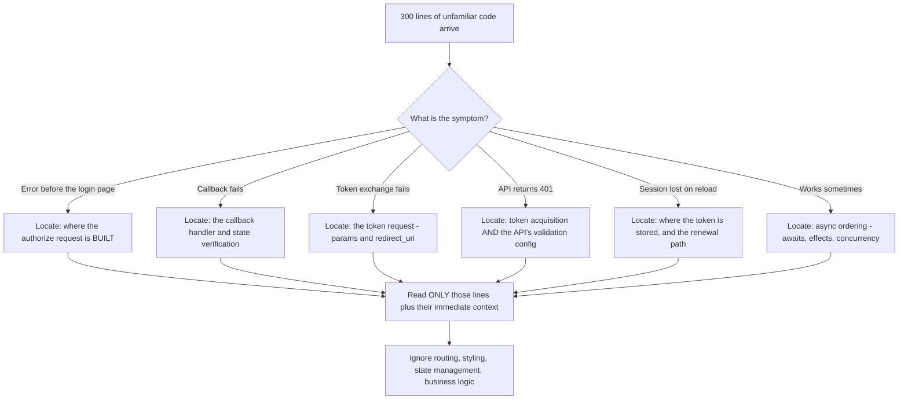
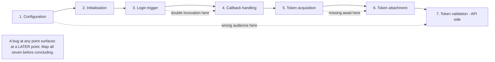
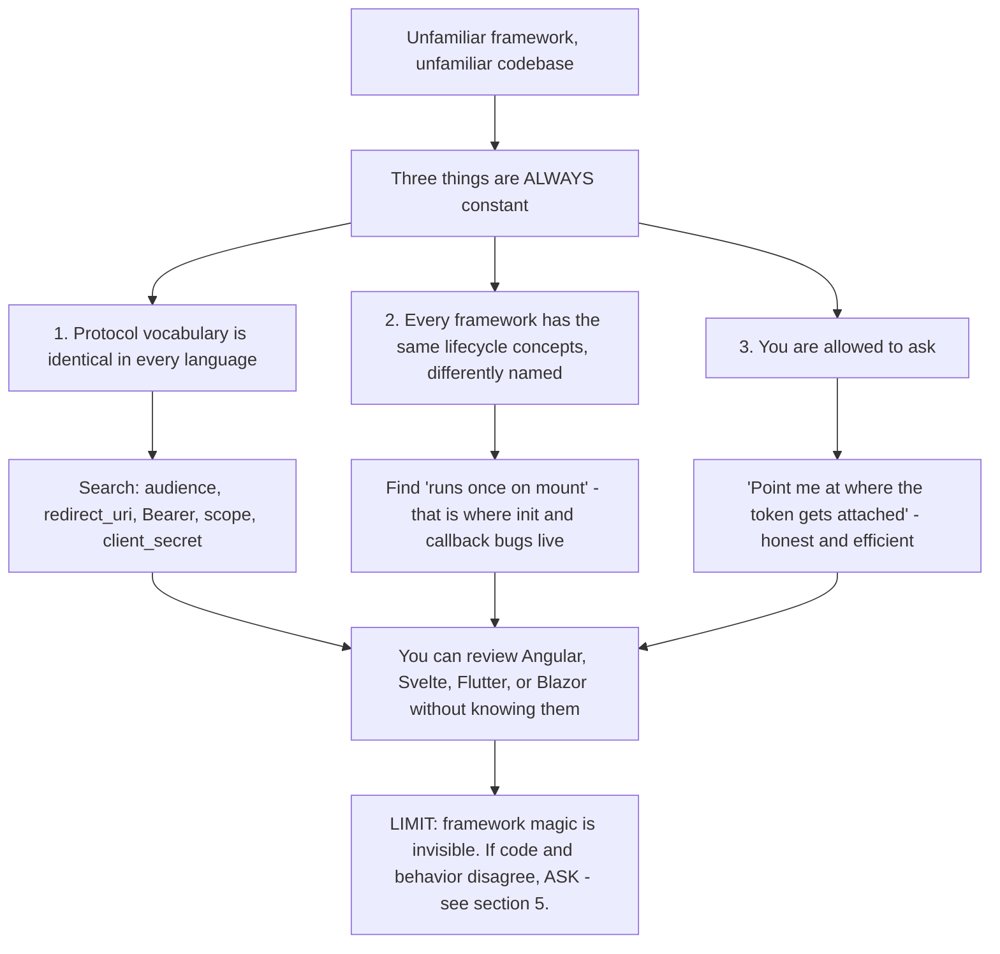
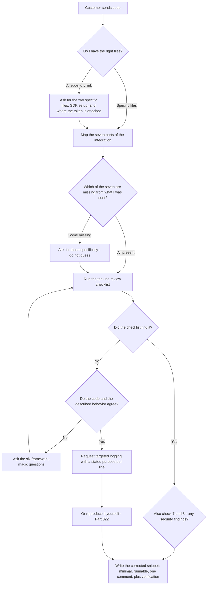

# Part 030 - Reading, Reviewing, and Debugging Customer Code

> Section goal: Turn everything in Group C into ticket resolution. A customer sends 300 lines of unfamiliar code in a framework you have never used. You need to find the 8 lines that matter, in minutes, without being able to run it. This is the single highest-leverage skill in developer support.

Covers index item **030**. Maps to JD signals: *proficient in at least one programming language*, *knowledge of software development fundamentals and common architectures*, *strong analytical and problem-solving skills*, *instinctive ability to subdivide problems into basic components*, and *exceed customer expectations on response quality*.

---

## 1. Start From Zero: You Are Not Reading the Code, You Are Locating It

The instinct of a beginner is to read from the top. That does not scale — a customer's repository is thousands of lines and you have minutes.

The professional method is **targeted location**: you already know, from the symptom, which *category* of line the bug is in. You search for those lines specifically and ignore everything else.



> **Analogy.** A pathologist does not examine the whole body uniformly. The symptoms indicate an organ, and that organ gets the attention.
>
> **Where it stops:** a body has a fixed anatomy. Codebases are arbitrarily organised, so you also need search patterns rather than knowing where to look — which is §3.

### 🔍 Plain-English deep-dive: the four questions that locate almost any auth bug

Before reading a single line, you can usually narrow to a handful by answering four questions from the ticket alone:

| Question | Narrows to |
|---|---|
| **1. Where is the token obtained?** | The SDK initialisation and the login call |
| **2. Where is the token attached?** | The HTTP client, interceptor, or `fetch` wrapper |
| **3. Where is the token validated?** | The API's middleware configuration |
| **4. Where is the token stored?** | The SDK options, or explicit storage calls |

Almost every identity bug lives at one of those four points. Business logic, routing, styling, and state management are noise — and they are usually 90% of what you were sent.

**The practical consequence:** rather than "please send me your code", ask for something specific: *"could you send the file where you initialise the SDK, and the file where you attach the token to API calls?"* You get less code, faster, and the customer has already done the first stage of triage for you.

**Analogy:** asking a witness "what did you see?" versus "what was the person wearing?" One produces a narrative; the other produces evidence. **Where it stops:** a witness knows what they saw. A developer may genuinely not know where their token is attached, especially if a framework does it for them — and that answer is itself informative.

---

## 2. The Anatomy of an Auth Integration

Whatever the framework, an integration has the same seven parts. Find each one and you have mapped the code.

| # | Part | What to look for | Common bug |
|---|---|---|---|
| 1 | **Configuration** | Domain, client ID, audience, scope, redirect URI | Wrong or missing `audience` |
| 2 | **Initialisation** | Creating the SDK client or provider | Created more than once; created too late |
| 3 | **Login trigger** | The call that starts the flow | Missing `preventDefault`; called on every render |
| 4 | **Callback handling** | Reading `code` and `state`, exchanging | Runs twice; `state` not verified |
| 5 | **Token acquisition** | Getting a token for an API call | Missing `await`; no `audience`; no caching |
| 6 | **Token attachment** | Interceptor or explicit header | Attached to the wrong requests, or not at all |
| 7 | **Token validation** *(API side)* | Middleware configuration | Missing audience/issuer/algorithms (Part 028) |



**The dashed arrows are the point.** A configuration mistake at step 1 surfaces as a 401 at step 7. A double invocation at step 3 surfaces as `invalid_grant` at step 4. **Always map all seven before concluding**, because the visible failure is rarely where the cause lives — the same principle as Part 021's "first anomaly, not last error."

---

## 3. Search Patterns

You will not know the framework. You do not need to. **Search for the vocabulary of the protocol**, which is identical everywhere.

| Search for | Finds |
|---|---|
| `audience`, `aud` | Audience configuration — the most common missing piece |
| `redirect_uri`, `redirectUri`, `callbackUrl` | Redirect configuration |
| `scope`, `scopes` | Requested permissions |
| `getAccessToken`, `getToken`, `acquireToken` | Token acquisition |
| `Authorization`, `Bearer` | Token attachment |
| `interceptor`, `axios.create`, `fetch(` | The HTTP client |
| `localStorage`, `sessionStorage`, `cacheLocation` | Token storage |
| `useEffect`, `componentDidMount`, `ngOnInit` | Initialisation and lifecycle |
| `handleRedirectCallback`, `parseCallback`, `exchange` | Callback handling |
| `client_secret`, `clientSecret` | **Secrets — always check where these appear** |
| `verify`, `jwtVerify`, `expressjwt`, `algorithms` | Validation configuration |
| `catch`, `.catch(` | Error handling — or its absence |



### 🔍 Plain-English deep-dive: reading a framework you have never used

You will be sent Angular, Svelte, Blazor, Flutter, or something you have not seen. You can still read it, because three things are constant.

**1. The protocol vocabulary is identical.** `audience`, `scope`, `redirect_uri`, `Bearer` mean the same thing in every language. Search for those, not for framework constructs.

**2. Every framework has the same lifecycle concepts** under different names:

| Concept | React | Angular | Vue | Svelte |
|---|---|---|---|---|
| Runs on mount | `useEffect(fn, [])` | `ngOnInit` | `onMounted` | `onMount` |
| Shared state | Context | Service | Provide/inject | Store |
| Route guard | Wrapper component | `CanActivate` | Navigation guard | `load` function |

You do not need to know the syntax. You need to recognise *"this runs once when the component appears"* — and that is where initialisation and callback bugs live.

**3. You can ask.** *"I'm not deeply familiar with this framework — could you point me at where the token gets attached to your API requests?"* Developers respond well to this. It is honest, it is efficient, and it does not damage credibility, because your value is protocol expertise rather than framework expertise. **Pretending** to know a framework, and then getting a detail wrong, damages credibility far more.

**Analogy:** a translator working with an unfamiliar dialect who still recognises the legal terms, because those are standardised across dialects. **Where it stops:** an unfamiliar framework may do something *invisible* — auto-attaching tokens, auto-refreshing, auto-redirecting — that is not in the code you were sent. When behavior does not match the code, suspect framework magic and ask what the framework is doing for them.

---

## 4. The Ten-Line Review Checklist

Given any auth integration, check these ten things. Most tickets are answered by one of them.

| # | Check | Wrong looks like | Part |
|---|---|---|---|
| 1 | Is `audience` passed at login? | Absent → API 401 | 064 |
| 2 | Is the token acquisition `await`ed? | `Bearer [object Promise]` | 025 |
| 3 | Is the token cached, or fetched per call? | 429 under load | 019 |
| 4 | Does the callback handler run exactly once? | Duplicate `/token`, `invalid_grant` | 012 |
| 5 | Is `state` verified? | Missing check = CSRF exposure | 065 |
| 6 | Where is the token stored? | `localStorage` with no CSP | 016 |
| 7 | Is there a client secret in client-side code? | **Security incident** | 027 |
| 8 | Does the API validate audience, issuer, and algorithms? | Missing → replay or forgery | 028 |
| 9 | Is there error handling around async calls? | Silent failures | 025 |
| 10 | Do redirect URIs match the registration exactly? | Mismatch before login | 013 |

**Checks 7 and 8 are security findings.** Raise them regardless of whether they caused the reported issue — that is the *"promote best practices"* duty, and it is also the right thing to do.

---

## 5. Debugging Without Access

You cannot run their code, attach a debugger, or see their screen. You have three instruments.

| Instrument | What it gives | When to use |
|---|---|---|
| **Ask for evidence** | HAR, tokens, logs, versions | Always first (Part 021) |
| **Ask for targeted logging** | Values at a specific point | When evidence is ambiguous |
| **Reproduce yourself** | Full control of variables | When you have a hypothesis (Part 022) |

### Requesting targeted logging

Vague requests waste a round trip. Be surgical, and say what each line will tell you:

> *"Could you add these three lines immediately before your API call and send the output?*
> ```js
> console.log("typeof token:", typeof token);
> console.log("token segments:", String(token).split(".").length);
> console.log("payload:", JSON.parse(atob(String(token).split(".")[1] || "e30")));
> ```
> *The first tells me whether it's a string or an unresolved Promise. The second tells me whether it's a JWT at all. The third shows the claims — please redact anything sensitive, though I mainly need `aud`, `iss`, and `exp`."*

That request is specific, each line has a stated purpose, and it explicitly asks for redaction. It also cannot be misread as "send me your tokens."

### 🔍 Plain-English deep-dive: the questions that reveal framework magic

The hardest debugging situation is when the behavior does not match the code. That almost always means something is happening that is not in the file you were sent.

Ask these, in order:

| Question | Reveals |
|---|---|
| "Are you using the SDK's provider or wrapper component?" | It may handle the callback automatically — so their manual handler runs *as well*, causing duplicates |
| "Is there an HTTP interceptor configured anywhere?" | Tokens attached (or not) somewhere they did not mention |
| "Does your framework run this file on the server, the client, or both?" | Part 029's ambiguity |
| "Is there a route guard or middleware that redirects?" | Redirect loops caused by an unresolved async auth check |
| "Are you in development or production mode?" | Strict mode, source maps, CSP differences (Part 026) |
| "Does your framework auto-refresh tokens?" | Explains renewal behavior absent from their code |

**The tell that you need these questions:** the customer's description and their code disagree. When a developer says *"it calls the API once"* and the HAR shows three calls, do not assume they are wrong — assume something else is also calling. Framework wrappers, interceptors, and provider components are the usual culprits.

**Analogy:** a driver insisting they did not brake, while the car has automatic emergency braking they forgot was fitted. Both statements are true. **Where it stops:** you can inspect a car. You are inferring the presence of framework behavior from its effects, so ask rather than deduce.

---

## 6. Writing the Corrected Snippet

From Part 004, element five of a good answer is runnable code. Five rules:

| Rule | Why |
|---|---|
| **Make it complete enough to run** | Pseudocode creates new bugs |
| **Change only what is necessary** | A rewrite is not reviewable |
| **Comment the changed line only** | One short line stating what it fixes |
| **Match their style and framework** | They must recognise it as their code |
| **Include the verification step** | So they can confirm without a round trip |

**Example — good:**

```js
const token = await auth0.getAccessTokenSilently({
  authorizationParams: { audience: "https://api.example.com" }   // added: token must be for your API
});

const res = await fetch("/orders", { headers: { Authorization: `Bearer ${token}` } });
```
> *Verify: decode the new token and confirm `aud` is `https://api.example.com`, then retry the call.*

**Example — poor:**

```js
// Get the token with the right audience and use it
const token = getToken();  // make sure to await this
```
Not runnable, not specific, and it delegates the thinking back to the customer.

---

## 7. Failure Modes

| Failure mode | What it looks like | Consequence | Correction |
|---|---|---|---|
| **Reading from the top** | Working through 300 lines linearly | Slow; the bug is on line 240 | Locate by symptom category |
| **Asking for "your code"** | Receiving a repository link | Overwhelming, slow | Request specific files by role |
| **Pretending to know the framework** | Confident, wrong framework claim | Credibility damaged | Say you are unfamiliar; ask for the pointer |
| **Missing framework magic** | Code and behavior disagree | Chasing a phantom | Ask the six §5 questions |
| **Not checking for secrets** | Reviewing only the reported issue | A live exposure is missed | Always search for `client_secret` |
| **Rewriting instead of correcting** | A wholesale replacement | Not reviewable; introduces new bugs | Minimal diff |
| **Pseudocode** | "Make sure to await this" | Ambiguity creates a second ticket | Runnable snippet |
| **Ignoring the API side** | Only reviewing the client | The bug was in validation config | Check both halves for 401s |
| **Asking for tokens carelessly** | "Send me your access token" | Credential exposure | Ask for decoded claims, redacted |
| **Concluding from one part** | Fixing step 5 when step 1 was wrong | Symptom returns | Map all seven parts first |

---

## 8. Troubleshooting Decision Tree: Reviewing Customer Code



### Worked example

*"Our Angular app gets 401 from our API. Here's our repository."*

1. **Do not open the repository.** Ask for two files: *"where you configure and initialise the SDK, and where you attach the token to API requests."*
2. **They send an `AuthModule` config and an HTTP interceptor.**
3. **Map the seven parts.** Configuration: present. Initialisation: present. Login trigger: not sent. Callback: handled by the SDK's own component. Token acquisition: inside the interceptor. Attachment: the interceptor. Validation: **not sent — it is on the API side.**
4. **Run the checklist.** Check 1: is `audience` configured? **It is not.** Check 2: acquisition is properly awaited. Check 8: cannot assess without the API code.
5. **Two candidate causes, and this is the key move:** either the client never requested a token for the API (no `audience`), or the API is misconfigured. **Do not guess between them — the token tells you.**
6. **Request the decoded token**, redacted, using the targeted-logging snippet from §5. `aud` comes back as the tenant's UserInfo endpoint. **Confirmed: cause is at part 1, surfacing at part 7.**
7. **Write the correction** — add `audience` to the SDK configuration, matching their Angular module style, with one comment and a verification step.
8. **Raise a second finding:** ask for the API's validation configuration anyway, and confirm it sets `audience`, `issuer`, and an explicit `algorithms` allow-list. If it does not, that is a separate and more serious issue than the one they reported.
9. **Name the next trap:** once the audience is correct, the API must also validate `iss`, otherwise a correctly-signed token from any tenant of the same provider would pass.

Two files, one checklist, one decoded token — and a security finding they did not ask about.

---

## 9. Lab: Review Real Integrations

**Purpose.** Build the location-and-checklist reflex on authentic code, and produce the review artifacts you will reuse.

**Prerequisites.** Parts 024–029. Read-only use of public repositories and documentation. **Do not use any employer or customer code.**

**Steps.**

1. Create `okta-prep/labs/030-code-review/`.
2. **Anatomy map.** Take the official SPA quickstart from Part 024's lab. Map all seven parts of §2, quoting the relevant lines. Save as `anatomy-map.md`. Note any part the quickstart handles invisibly.
3. **Framework comparison.** Find official quickstarts for **three** frameworks you have not used — for example Angular, Vue, and a mobile one. For each, locate parts 1, 5, and 6 only. **Time yourself.** Record how long each took and what you searched for. **The point is that the search terms are identical across all three.**
4. **Deliberate breaks.** Take your own working SPA from Part 028's lab and introduce these bugs one at a time, saving the diff for each:
   - a. Remove `audience`
   - b. Remove an `await` on token acquisition
   - c. Call the callback handler twice
   - d. Move the client secret into client-side code (use `FAKE_SECRET_DO_NOT_USE`)
   - e. Remove `state` verification
   **For each, write the review you would send** — root cause, evidence, concept, corrected snippet, verification.
5. **Blind review.** Ask someone else, or use your own diffs shuffled and renamed, to present one broken version without telling you which bug it is. **Time how long the ten-line checklist takes to find it.** Record it.
6. **Forum reviews.** In the Auth0 community forum, find three posts where a developer has pasted code with an auth bug. For each, write your review privately in `forum-reviews.md` — do not post. Then compare against the published answer and note what you missed or found first.
7. **Targeted-logging templates.** Write `logging-requests.md` — five ready-to-paste logging requests, each with a stated purpose per line and an explicit redaction note: token shape, callback invocation count, storage contents, interceptor firing, and validation configuration.
8. **File-request template.** Write `file-request.md` — the message you send instead of "please share your code", naming the specific files by role.
9. **Reference + catalog.** Write `review-checklist.md` — §4's ten checks with, for each, the search term you would use and the Part it connects to. Add rows to the failure catalog. Complete `MANIFEST.md`.

**Expected evidence.** A seven-part anatomy map, three timed framework locations, five deliberate breaks with reviews written, a timed blind review, three forum reviews compared against published answers, five logging templates, a file-request template, and a searchable checklist.

**Validation rubric.**

| Check | Pass condition |
|---|---|
| All seven parts mapped | Including any handled invisibly by the SDK |
| Three unfamiliar frameworks | Timed, with the search terms recorded — and shown to be the same terms |
| Five breaks reviewed | Each review has root cause, evidence, concept, runnable snippet, verification |
| Blind review timed | Under ten minutes using the checklist |
| Forum comparison honest | You recorded what you missed, not only what you got right |
| Logging requests specific | Every line has a stated purpose and a redaction note |
| Checklist searchable | Each of the ten checks has a concrete search term |

**Cleanup and privacy. Never use employer or customer code in any artifact**, even anonymised — that is a confidentiality breach and it would be visible in a portfolio. Forum posts are public, but do not copy anyone's tenant identifiers, domains, or tokens into your notes; paraphrase the pattern only. Use `FAKE_SECRET_DO_NOT_USE` for the secret-exposure exercise.

---

## 10. JD Mapping

| Supplied JD signal | How this Part supports it |
|---|---|
| **Proficient in a programming language** | Reading unfamiliar code fluently is the applied form of proficiency |
| Knowledge of software development fundamentals | §2's integration anatomy is architecture-independent |
| **Instinctive ability to subdivide problems** | §1's symptom-to-location mapping and §4's checklist |
| Strong analytical and problem-solving skills | §8's tree, and refusing to guess between two candidates when evidence can decide |
| **Exceed expectations on response quality** | §6's rules for a corrected snippet, plus the verification step |
| Promote best practices | Raising checks 7 and 8 regardless of the reported issue |
| Business and technical analysis skills | Requesting specific files rather than accepting a repository |
| Team player with communication skills | §3's honest "I'm not familiar with this framework — point me at X" |

---

## 11. Candidate Honesty Note

- **This Part is where Group C pays off.** Parts 024–029 built the language; this one converts it into ticket resolution.
- **The strongest thing you can say:** *"I don't read customer code from the top — I locate it. Every auth integration has the same seven parts regardless of framework, and the symptom tells me which part to look at. Then I run a ten-point checklist. I've timed myself doing it on three frameworks I'd never used, and the search terms are identical every time because the protocol vocabulary doesn't change."*
- **A second strong point — the honest one about frameworks:** *"If I don't know the framework I say so and ask them to point me at where the token is attached. That's efficient and it costs nothing, because my value is protocol expertise. Pretending to know a framework and then getting a detail wrong would cost far more."*
- **A third:** *"I always check two things that usually aren't the reported issue — whether a client secret appears in client-side code, and whether the API validates audience, issuer, and an explicit algorithms allow-list. Both are security findings and both are worth raising anyway."*
- **Be honest about scope:** you review and correct integrations. You have not worked as a developer on a product team. Both are true and the first is what the role needs.
- **Never** use employer or customer code as a portfolio example, even anonymised.

---

## 12. Official Source Anchors

Accessed **26 August 2026**.

| Source | Use it for |
|---|---|
| Auth0 and Okta quickstarts across frameworks | The reference implementations you map in §9 |
| Auth0 and Okta SDK API references | What each SDK method actually does, including anything implicit |
| Auth0 community forum and Okta developer forum | Authentic customer code with real bugs, for §9 step 6 |
| React, Angular, Vue, and Svelte official documentation — lifecycle | §3's lifecycle-equivalence table |
| Next.js documentation — server versus client components | Framework magic in §5 |
| IETF RFC 6749, RFC 7636, RFC 7519 | The vocabulary that makes cross-framework searching possible |
| OWASP — code review guide and API Security Top 10 | The security checks in §4 |

**Revalidate after 26 August 2026:** SDK method names and quickstart code change; the seven-part anatomy and the checklist do not.

---

## ⭐ Likely Interview Questions for This Section

### Q1. "A customer sends you 300 lines of code in a framework you don't know. What do you do?"
> *Model answer:* "I don't read it — I locate. Every auth integration has the same seven parts regardless of framework: configuration, initialisation, login trigger, callback handling, token acquisition, token attachment, and validation on the API side. The symptom tells me which part to look at — a 401 from their API points at configuration and validation, an intermittent failure points at async ordering. Then I search for protocol vocabulary rather than framework constructs, because `audience`, `redirect_uri`, `Bearer`, and `scope` mean the same thing in every language. Business logic, routing, and styling are noise and they're usually ninety percent of what I was sent. If I genuinely can't find something, I ask — 'I'm not deeply familiar with this framework, could you point me at where the token gets attached?' That's efficient and honest, and it costs nothing because my value is protocol expertise, not framework expertise."

### Q2. "What's on your review checklist?"
> *Model answer:* "Ten items. Is `audience` passed at login, because that's the most common missing piece. Is token acquisition awaited — `Bearer [object Promise]` in a HAR is unmistakable. Is the token cached or fetched per call. Does the callback handler run exactly once. Is `state` verified. Where is the token stored. Is there a client secret in client-side code. Does the API validate audience, issuer, and an explicit algorithms allow-list. Is there error handling around the async calls. And do the redirect URIs match the registration exactly. Two of those — the secret and the validation configuration — are security findings, and I raise them whether or not they caused the reported issue. That's partly the 'promote best practices' expectation and partly just the right thing to do."

### Q3. "How do you debug when you can't run their code?"
> *Model answer:* "Three instruments, in order. First, evidence — a HAR and the decoded token usually answer the question without needing their code at all. Second, targeted logging: I send three or four specific lines with a stated purpose for each, rather than 'add some logging'. For a token problem that's `typeof token`, the number of dot-separated segments, and the decoded payload — which tells me whether it's an unresolved Promise, whether it's a JWT at all, and what the claims say. I always include an explicit redaction note so it can't be misread as asking for their tokens. Third, reproduce it myself once I have a hypothesis, because then I control every variable and can produce two commands differing by one character. The ordering matters: evidence first, because it's free and it often ends the investigation."

### Q4. "The customer's description and their code don't match. What now?"
> *Model answer:* "Assume something else is also running, rather than assuming they're wrong — that's usually framework magic. So I'd ask six questions. Are they using the SDK's provider or wrapper component, because that may handle the callback automatically and their manual handler is then running *as well*, which produces duplicates. Is there an HTTP interceptor configured somewhere. Does the framework run this file on the server, the client, or both. Is there a route guard or middleware that redirects. Are they in development or production mode, because strict mode and CSP differ. And does the framework auto-refresh tokens. The tell is exactly what you described — when a developer says 'it calls the API once' and the HAR shows three, both statements are usually true and something invisible is making the extra calls."

### Q5. "How do you write a corrected code snippet?"
> *Model answer:* "Five rules. Complete enough to actually run, because pseudocode creates a second ticket — 'make sure to await this' isn't an answer. Change only what's necessary, because a rewrite isn't reviewable and introduces new bugs. Comment only the changed line, one short line stating what it fixes. Match their style and framework so they recognise it as their code rather than mine. And include the verification step, so they can confirm the fix without another round trip — for an audience fix that's 'decode the new token, confirm `aud` matches your API identifier, then retry.' That last one is what turns a correct answer into a closed ticket, because otherwise you get an 'it's still broken' round trip when they didn't apply it the way you meant."

### Q6. "What files would you ask for?"
> *Model answer:* "Specific ones by role, never 'your code' and definitely not a repository link. For a client-side problem: the file where they configure and initialise the SDK, and the file where they attach the token to API requests. For a 401 from their own API, I'd add the middleware configuration where the token is validated, because the cause is as likely to be there as on the client. That gets me less code, faster, and it makes the customer do the first stage of triage, which is useful in itself. If they can't tell me where the token is attached, that answer is informative — it usually means a framework or interceptor is doing it for them, which is exactly the framework-magic case."

### Q7. "You find a security issue that isn't what they asked about. Do you raise it?"
> *Model answer:* "Yes, always, and I'd separate it clearly from the reported issue so it doesn't feel like deflection. The two I check every time are a client secret appearing in client-side code, and an API's validation configuration missing audience, issuer, or an explicit algorithms allow-list. A secret in browser code is a live exposure requiring rotation, and I'd lead with that even if their ticket was about something trivial, because urgency matters more than tidiness. Missing `algorithms` means the library might accept `alg: none`, which lets anyone forge a token. I'd phrase it as 'separately from your question, I noticed X — here's why it matters and here's the fix' so it reads as helpful rather than as avoiding their actual problem. Not raising it would be a professional failure."

### Q8. "How do you avoid guessing between two possible causes?"
> *Model answer:* "By finding the piece of evidence that discriminates, rather than picking the more likely one. A concrete example: a 401 from a customer's API is either the client not requesting a token for that API, or the API being misconfigured. Those need completely different fixes, and guessing wrong costs a round trip and some credibility. But the token settles it — if `aud` is the tenant's own UserInfo endpoint, the client never asked for the API audience; if `aud` is correct, the fault is in validation. So instead of guessing I ask for the decoded token, redacted, with a specific logging snippet. One artifact, and both hypotheses collapse to one. That's the habit generally: when two causes are plausible, ask what single piece of evidence would separate them, and request exactly that."

---

## 🧠 30-Second Memory Hooks

- **Don't read code — LOCATE it.** The symptom names the category; search for that.
- **Seven parts of every integration:** config · init · login trigger · callback · acquisition · attachment · validation.
- **A bug at part 1 surfaces at part 7.** Map all seven before concluding.
- **Search protocol vocabulary, not framework constructs.** `audience`, `Bearer`, `redirect_uri` are universal.
- **Ask for two specific files**, never "your code" and never a repository link.
- **"I'm not familiar with this framework — point me at where the token is attached"** costs nothing. Pretending costs a lot.
- **Code and behavior disagree = framework magic.** Ask the six questions.
- **Ten-point checklist.** Two of them (secret in client code, validation config) are **security findings — raise them regardless**.
- **Targeted logging: state the purpose of every line, and include a redaction note.**
- **Corrected snippet: complete · minimal · one comment · their style · plus verification.**
- **Two plausible causes? Ask what evidence discriminates, and request exactly that.**

---

## ✅ Completion Checklist

- [ ] **Knowledge:** I can name the seven parts of an auth integration and recite the ten-point checklist.
- [ ] **Lab artifact:** `030-code-review/` contains an anatomy map, three timed unfamiliar-framework locations, five reviewed breaks, a timed blind review, three forum comparisons, and reusable request templates.
- [ ] **Spoken:** I can explain the locate-don't-read method in under 45 seconds.
- [ ] **Honesty check:** no employer or customer code appears anywhere in my artifacts, and the secret-exposure exercise used an obviously fake value.
- [ ] **Source check:** I have read at least three official quickstarts for frameworks I do not know, and located parts 1, 5, and 6 in each.

---

*Next suggested section:* **[Part 031 - Identity SDKs: What They Do Under the Hood](Part-031-identity-sdks-what-they-do-under-the-hood.md)** — open the black box, so you can tell what the SDK is doing for a customer and what breaks when they hand-roll it instead.
