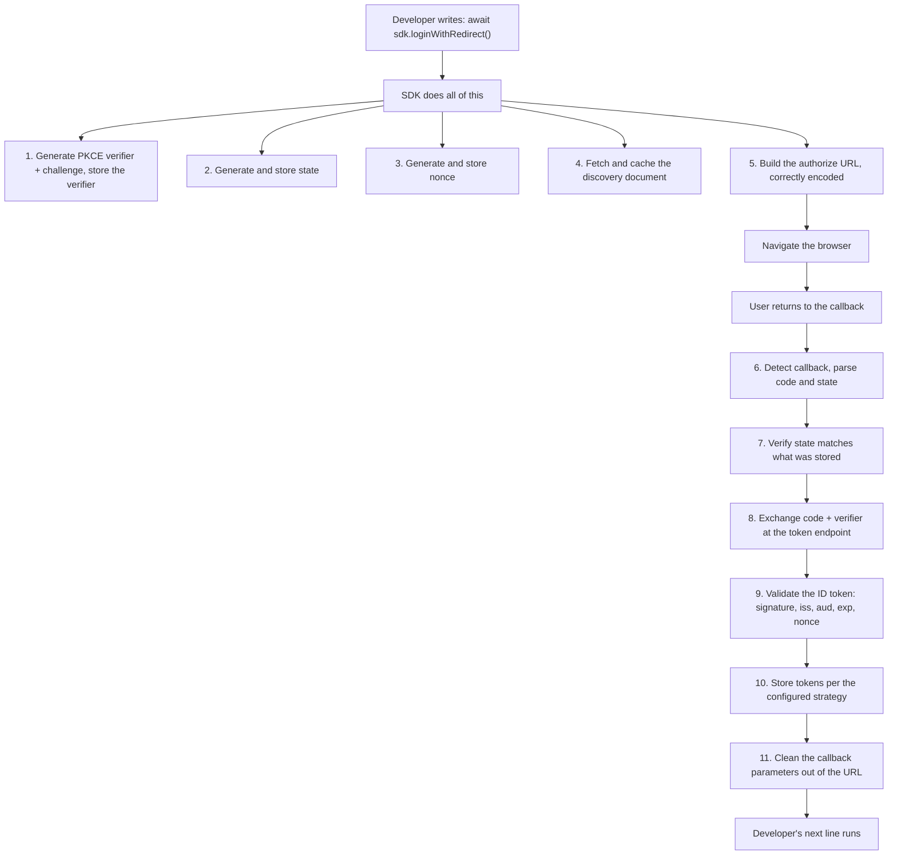
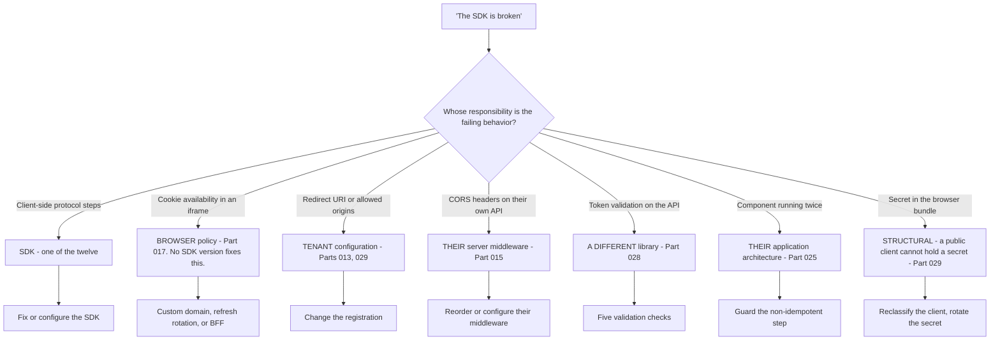
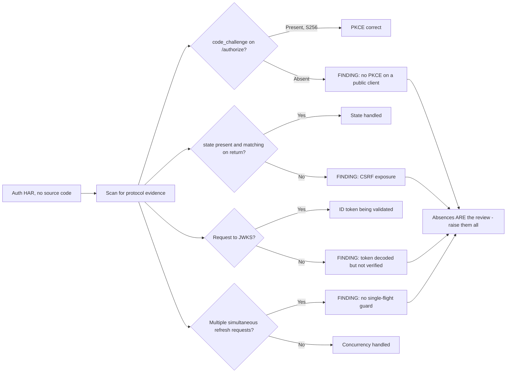
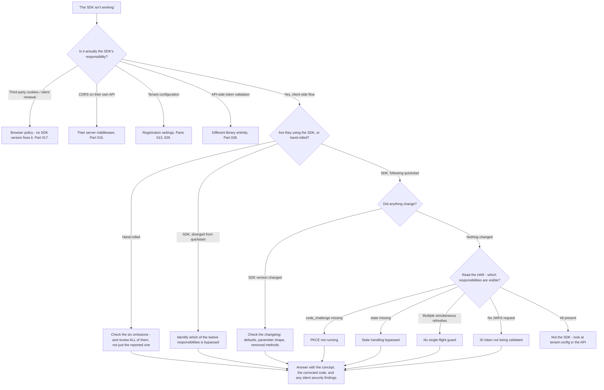

# Part 031 - Identity SDKs: What They Do Under the Hood

> Section goal: Open the black box. An SDK silently handles a dozen things a developer would otherwise have to get right. Knowing exactly which things — and what breaks when someone hand-rolls it, diverges from the quickstart, or upgrades a major version — explains a large share of the ticket queue.

Covers index item **031**. Maps to JD signals: *knowledge of software development fundamentals*, *proficient in at least one programming language*, *understanding of authentication and authorization concepts*, *strong analytical and problem-solving skills*, and *promote best practices*.

---

## 1. Start From Zero: What an SDK Is For

An **SDK** (Software Development Kit) is a library that wraps a protocol so a developer writes three lines instead of three hundred.

```js
// What the developer writes
await auth0.loginWithRedirect();
const token = await auth0.getAccessTokenSilently();
```

Underneath, that is a full OAuth 2.0 Authorization Code flow with PKCE, state management, token caching, expiry handling, renewal, and validation.

> **Analogy.** An automatic gearbox. You press one pedal; the gearbox performs clutch control, gear selection, and rev matching. Most drivers never learn what it does — until it behaves oddly, and then knowing what it *should* be doing is the whole diagnosis.
>
> **Where it stops:** a gearbox is one component with one job. An SDK spans the browser, the network, storage, and timing, so it has far more places to interact badly with the environment around it.

### 🔍 Plain-English deep-dive: the two ticket categories this creates

Understanding the SDK's boundary splits your queue cleanly in two:

| Category | What happened | Where the fix lives |
|---|---|---|
| **"The quickstart worked, then we diverged"** | The developer replaced or bypassed something the SDK was handling | Restore the SDK behavior, or implement it correctly themselves |
| **"We hand-rolled it"** | No SDK; the developer implemented the protocol directly | Find which of the dozen responsibilities they missed |

Both reduce to the same question: **which of the SDK's responsibilities is not being met?**

That is why this Part matters. Without knowing the list, you are guessing. With it, you have a checklist that covers the majority of client-side identity tickets.

**Analogy:** a recipe that quietly handles proving time, oven preheat, and resting. Someone who "simplified" it and got a flat loaf did not remove an ingredient — they removed a *step they could not see*. **Where it stops:** a recipe's steps are at least written down. An SDK's are inferred from documentation and behavior, which is why this Part is worth memorising.

---

## 2. The Twelve Responsibilities

This is the list. Learn it.

| # | Responsibility | What the SDK does | If missing |
|---|---|---|---|
| 1 | **PKCE** | Generates `code_verifier`, derives `code_challenge`, stores the verifier, sends it at exchange | `invalid_grant`; or an insecure public client |
| 2 | **`state`** | Generates, stores, sends, verifies on return | CSRF exposure; "invalid state" |
| 3 | **`nonce`** | Generates, sends, verifies in the ID token | Replay exposure |
| 4 | **Discovery** | Fetches the well-known document, caches endpoints | Hard-coded endpoints that break on change |
| 5 | **Redirect handling** | Detects the callback, parses parameters, cleans the URL | Code left in history; double processing |
| 6 | **Token exchange** | Correct `Content-Type`, body, and parameters | 415; `invalid_grant` |
| 7 | **ID token validation** | Signature, `iss`, `aud`, `exp`, `nonce`, `azp` | **Accepting forged or foreign tokens** |
| 8 | **Token storage** | Applies the configured strategy | Tokens in the wrong place, or lost |
| 9 | **Expiry tracking** | Knows `exp`, refreshes before it | 401s at expiry |
| 10 | **Silent renewal** | Iframe or refresh-token renewal, with fallback | Users logged out on reload |
| 11 | **Concurrency control** | Single-flight refresh (Part 025) | Stampede → 429 or mass logout |
| 12 | **Logout** | Clears local state and calls the end-session endpoint | "Logout didn't work" |



**Eleven distinct operations, from one line of code.** When a developer says "the SDK is broken", they are usually saying "one of eleven things I did not know about did not happen."

---

## 3. What the SDK Cannot Do

Equally important, and frequently misunderstood:

| The SDK cannot | Why | Consequence |
|---|---|---|
| Make third-party cookies work | Browser policy (Part 017) | Silent renewal fails regardless of SDK version |
| Configure the tenant | Different system | Redirect URI and origin settings are the customer's |
| Fix CORS on the customer's own API | Their server (Part 015) | Their middleware, not the SDK |
| Prevent XSS | Application-level concern | Token storage choice only limits the damage |
| Keep a secret in a browser | Structural (Part 029) | A public client is a public client |
| Guarantee ordering across components | Application architecture (Part 025) | Double invocation is the app's to guard |
| Validate tokens on the API side | A different library entirely | Part 028's five checks |

**The most common misattribution:** a customer opens a ticket saying "your SDK doesn't keep users logged in", when the actual cause is third-party cookie blocking (Part 017). No SDK version fixes that, because it is a browser platform change. Being able to say so clearly — and offer the three structural alternatives — is the difference between a resolved ticket and a version-upgrade wild goose chase.



---

## 4. Hand-Rolled Implementations: The Six Things People Miss

When a developer implements the protocol themselves, these are the omissions, roughly in order of frequency.

| # | Missed | Symptom | Severity |
|---|---|---|---|
| 1 | **`state` verification** | Nothing — it works fine | **Security: CSRF exposure.** Silent |
| 2 | **`nonce` verification** | Nothing | **Security: replay exposure.** Silent |
| 3 | **Full ID token validation** | Nothing until attacked | **Security: forged tokens accepted.** Silent |
| 4 | **PKCE verifier persistence** | `invalid_grant` after a page reload | Visible |
| 5 | **Single-flight refresh** | 429s or mass logout under load | Visible, intermittent |
| 6 | **URL cleanup after callback** | Code and state in browser history | Low, but a leak |

### 🔍 Plain-English deep-dive: why the dangerous omissions are silent

Notice the pattern in that table: **the three security-critical omissions produce no symptom at all.**

A hand-rolled implementation that skips `state` verification works perfectly. Logins succeed, tokens arrive, users are happy. Nothing in a test suite fails. The vulnerability is invisible until someone exploits it.

Conversely, the *visible* problems — `invalid_grant` after a reload, 429s under load — are the ones customers open tickets about.

**So the customer's ticket is almost never about the dangerous problem.** They contact you about item 4 or 5, and items 1, 2, and 3 are sitting there unmentioned.

**This is why you review the whole implementation, not just the reported symptom.** From Part 030's checklist: checks 5 and 8 exist precisely because nobody will ever report them.

**How to raise it well:**

> *"Separately from the reload issue — I noticed the callback handler doesn't verify that `state` matches what was stored before the redirect. That won't cause any visible problem, which is why it's easy to miss, but it's the control that stops an attacker injecting their own authorization code into one of your users' sessions. Same for `nonce` on the ID token. Both are a few lines and I've included them in the corrected snippet."*

That is factual, non-alarming, explains the *why*, and delivers the fix. It is also, honestly, the most valuable thing you will do that week.

**Analogy:** a car with no seatbelts. It drives perfectly. Nobody notices, right up until the moment it matters. **Where it stops:** you can see whether a car has seatbelts. Missing `state` verification is invisible without reading the code — which is why you have to read it.

---

## 5. Version Upgrades and Behavioral Changes

An SDK major version can change defaults. From Part 009 and Part 027, this is a leading cause of "nothing changed."

| Change type | Example | Symptom |
|---|---|---|
| Default token storage | Memory instead of local storage | Logged out on reload |
| Default renewal strategy | Refresh tokens instead of silent auth | Different failure mode, different browser behavior |
| Parameter shape | Options moved under `authorizationParams` | Silently ignored parameters |
| Removed method | A renamed or dropped API | Build or runtime error |
| Stricter validation | Now enforcing something previously lenient | Previously working tokens rejected |
| Module format | ESM-only build | Part 027's import errors |

### The parameter-shape change deserves special attention

When an SDK moves options into a nested object, the old shape often **does not error** — it is simply ignored:

```js
// v1
await auth0.loginWithRedirect({ audience: "https://api.example.com" });

// v2 - options moved
await auth0.loginWithRedirect({ authorizationParams: { audience: "https://api.example.com" } });

// v2 with v1 shape - NO ERROR, audience silently dropped
await auth0.loginWithRedirect({ audience: "https://api.example.com" });
```

The result: a token without the requested audience, and a 401 from their API — the exact symptom of Part 021's worked example, but caused by an upgrade rather than a never-configured parameter.

**The diagnostic:** if the token's `aud` is wrong and the code *appears* to set `audience`, check the SDK major version against the documentation for that version. A parameter in the wrong place is indistinguishable from a parameter that is absent.

### 🔍 Plain-English deep-dive: why silently ignoring an unknown option is the default

It seems obviously wrong that passing an option the library does not recognise produces no warning. Why would anyone design it that way?

Because JavaScript objects are open. A function receiving `{ audience: "..." }` has no built-in way to distinguish "a parameter I should have handled" from "a property the caller attached for their own reasons." Rejecting unknown properties would break every caller who passes extra context, and it is the mirror image of the **tolerant reader** principle from Part 018 — be liberal in what you accept.

So the library reads the properties it knows about and ignores the rest. That is a defensible design choice, and it produces a genuinely nasty failure mode when a major version relocates an option.

**What this means for you diagnostically:**

| Observation | Conclusion |
|---|---|
| Code sets `audience`, HAR shows no `audience` | The option is in a shape this version does not read |
| Code sets `audience`, HAR shows it, token `aud` still wrong | The tenant is not configured for that API, or the API identifier differs |
| Code does not set `audience`, HAR has none | Simply never configured |

**The rule: trust the wire, not the source.** The HAR shows what the SDK actually sent, and the code shows what the developer intended. When those disagree, the gap is the bug, and the gap is almost always a version or shape mismatch.

**Analogy:** a form where you write your phone number in the margin because the box moved to page two. The form is complete and legible, and the office never sees the number. **Where it stops:** an office might phone to ask. A library has nowhere to send a query, so it proceeds silently.

---

## 6. Reading SDK Behavior From a HAR

You can determine which responsibilities the SDK is meeting purely from a capture.

| Evidence in the HAR | Tells you |
|---|---|
| `code_challenge` present on `/authorize` | PKCE is in use (responsibility 1) |
| `code_challenge_method=S256` | Correct method, not `plain` |
| `state` present and matching on return | State handling present (2) |
| `nonce` present on `/authorize` | Nonce handling present (3) |
| A request to `/.well-known/openid-configuration` | Discovery in use (4) |
| `audience` on `/authorize` | Requesting an API token (Part 064) |
| `code_verifier` in the `/token` body | Exchange correct (6) |
| A request to `/.well-known/jwks.json` | Validating the ID token (7) |
| Hidden iframe to `/authorize?prompt=none` | Silent renewal via iframe (10) |
| `grant_type=refresh_token` on `/token` | Renewal via refresh tokens (10) |
| **Multiple simultaneous** `/token` refresh requests | **No single-flight guard (11)** |
| A request to `/v2/logout` or an end-session endpoint | Logout implemented (12) |

**This is a genuinely fast review technique.** Without seeing a line of code, a HAR tells you whether PKCE, state, nonce, discovery, validation, and single-flight are present. Absences are findings.



---

## 7. Failure Modes

| Failure mode | Symptom | Consequence | Correction |
|---|---|---|---|
| **Diverged from the quickstart** | Worked, then broke | An invisible step was removed | Identify which of the twelve is unmet |
| **Hand-rolled, missing `state`** | None | **Silent CSRF exposure** | Add verification; explain why |
| **Hand-rolled, missing validation** | None | **Forged tokens accepted** | Full ID token validation |
| **PKCE verifier lost on reload** | `invalid_grant` | Login fails after refresh | Persist the verifier across navigation |
| **Blaming the SDK for cookies** | "Your SDK doesn't keep users logged in" | Version upgrades that cannot help | Part 017's structural alternatives |
| **Upgrade parameter-shape change** | `aud` wrong; code looks correct | Silently ignored options | Check version against docs |
| **Two SDK copies** | Contradictory auth state | Separate module state | Part 027's `npm ls` |
| **Manual handler plus provider component** | Duplicate `/token` | `invalid_grant` | One handler only |
| **Mixing SDK and manual calls** | Inconsistent state | Cache and storage diverge | Pick one approach |
| **No single-flight** | 429 or mass logout | Stampede (Part 025) | Guard the refresh |
| **Assuming the SDK validates the API side** | API accepts anything | **Serious** | Different library; Part 028 |

---

## 8. Troubleshooting Decision Tree: SDK-Related Tickets



### Worked example

*"We upgraded the SDK to v2 and now our API returns 401. We didn't change any of our code."*

1. **"Upgraded and now 401" plus unchanged code** → suspect a behavioral change, not their logic (Part 027).
2. **Ask for the decoded access token.** `aud` is the tenant's UserInfo endpoint, not their API identifier.
3. **Ask for the login call.** They send:
   ```js
   await auth0.loginWithRedirect({ audience: "https://api.example.com" });
   ```
4. **That looks correct** — which is exactly why it is confusing.
5. **Check the v2 documentation.** Authorization parameters moved under `authorizationParams`. The old shape is **not an error** — it is ignored.
6. **Confirm from the HAR:** the `/authorize` request has no `audience` parameter, despite the code appearing to set one. **Decisive.**
7. **Fix:**
   ```js
   await auth0.loginWithRedirect({
     authorizationParams: { audience: "https://api.example.com" }   // v2: options moved here
   });
   ```
8. **The concept to teach:** an ignored option is indistinguishable from an absent one, so when the token contradicts the code, check whether the SDK version interprets that option shape at all.
9. **The next trap:** other parameters — `scope`, `redirect_uri`, custom parameters — moved in the same change. They should audit every option they pass, not just this one.
10. **Prevention:** read the migration guide before a major upgrade, and add an end-to-end login test that asserts `aud` on the resulting token.

Note the decisive step: comparing **what the code says** against **what the wire shows**. When those disagree, the answer is always between them.

---

## 9. Lab: Hand-Roll the Flow, Then Compare

**Purpose.** Implement the protocol manually so you know exactly what the SDK does, then compare the two side by side.

**Prerequisites.** Parts 022, 024–029. Your lab tenant with a SPA application. **Your own tenant and localhost only.**

**Steps.**

1. Create `okta-prep/labs/031-sdk-internals/`.
2. **SDK baseline.** Build a minimal SPA using the official SDK, following the quickstart exactly. Capture a HAR of a full login. Save it redacted.
3. **HAR responsibility audit.** Using §6's table, record which of the twelve responsibilities are **visible in the capture**. Note which are invisible because they happen entirely in memory. Save as `sdk-har-audit.md`.
4. **Hand-roll it.** Build a second page implementing the same flow with **no SDK** — plain `fetch` and Web Crypto only:
   - a. Generate `code_verifier` and `code_challenge` (`S256`)
   - b. Generate and store `state` and `nonce`
   - c. Fetch the discovery document
   - d. Build and navigate to the authorize URL
   - e. Handle the callback: parse, **verify `state`**
   - f. Exchange the code with the verifier
   - g. **Validate the ID token**: fetch JWKS, verify signature, check `iss`, `aud`, `exp`, `nonce`
   - h. Store the token in memory
   - i. Clean the callback parameters from the URL
5. **Count the lines.** Record how many lines the hand-rolled version took versus the SDK version. **That ratio is a persuasive thing to quote.**
6. **Break each responsibility.** One at a time, remove a piece and record the exact symptom:
   - Remove `state` verification → record that **nothing visibly changes**
   - Remove `nonce` verification → record that **nothing visibly changes**
   - Skip ID token signature validation → record that **nothing visibly changes**
   - Lose the verifier across a reload → record `invalid_grant`
   - Remove URL cleanup → record the code remaining in history
   **The three "nothing changes" results are the entire point of this lab.**
7. **Single-flight.** Add token renewal without a guard, trigger ten concurrent calls with an expired token, and count the requests. Add the guard and count again. (Reuse the Part 025 counter approach — **simulate rather than actually triggering reuse detection on a real tenant**.)
8. **Version-shape simulation.** Write a small wrapper that accepts options in two shapes and silently ignores the old one. Demonstrate that a parameter in the wrong place produces a token without the audience and no error. Record it.
9. **Comparison document.** Write `sdk-vs-handrolled.md`: the twelve responsibilities, whether the SDK handles each, how many lines it took you, and the symptom when omitted.
10. **Failure catalog + manifest.** Add all rows, especially the three silent ones. Complete `MANIFEST.md`.

**Expected evidence.** An SDK baseline HAR with a responsibility audit, a working hand-rolled implementation, a line-count comparison, six recorded omission results including three "no visible change", a single-flight counter proof, a parameter-shape demonstration, and a twelve-row comparison document.

**Validation rubric.**

| Check | Pass condition |
|---|---|
| HAR audit complete | All twelve assessed; invisible ones noted as such |
| Hand-rolled works | Full flow completes, including ID token validation |
| Line ratio recorded | Both counts, with the ratio stated |
| Three silent omissions | Explicitly recorded as producing **no visible symptom** |
| `invalid_grant` reproduced | From verifier loss across a reload |
| Single-flight proven | Ten requests before the guard, one after |
| Parameter shape shown | Option silently ignored, no error, wrong `aud` |
| Comparison complete | Twelve rows, each with SDK behavior and omission symptom |

**Cleanup and privacy.** Your own tenant, synthetic users, localhost only. **Do not deliberately trigger refresh-token reuse detection on a real tenant** — simulate the stampede with a counter as in Part 025. Redact every token and the client ID from saved captures. Decode tokens locally only.

---

## 10. JD Mapping

| Supplied JD signal | How this Part supports it |
|---|---|
| Knowledge of software development fundamentals | Library abstraction, versioning, and what a dependency is actually doing |
| **Proficient in a programming language** | §9 implements a full OAuth flow by hand |
| Understanding of authentication and authorization concepts | The twelve responsibilities *are* the protocol's client-side obligations |
| Strong analytical and problem-solving skills | §6's HAR-based audit determines behavior without reading code |
| **Promote best practices** | §4's silent security omissions are raised precisely because nobody reports them |
| Instinctive ability to subdivide problems | §8's tree first separates what is and is not the SDK's responsibility |
| Business and technical analysis skills | Correctly reattributing "the SDK is broken" to browser policy or tenant configuration |

---

## 11. Candidate Honesty Note

- **This Part produces a genuinely impressive artifact.** Hand-rolling the flow — including ID token validation against JWKS — is more than most candidates for this role will have done.
- **The strongest thing you can say:** *"I implemented the authorization code flow with PKCE by hand, including fetching JWKS and validating the ID token, so I know exactly which twelve things the SDK is doing silently. When a customer says the SDK is broken, my first question is which of those twelve isn't happening — and the HAR usually answers it without needing their code."*
- **The most valuable thing you can say — and it is a judgement point, not a knowledge point:** *"The three omissions that matter most in a hand-rolled implementation — `state` verification, `nonce` verification, and ID token validation — produce no visible symptom at all. So the customer's ticket is never about them. That's exactly why I review the whole implementation rather than only the reported issue."*
- **A third:** *"An option in the wrong shape after a major upgrade is silently ignored rather than erroring, so it's indistinguishable from an option that was never set. When the token contradicts the code, I check the SDK version against its documentation before anything else."*
- **Be honest about scope:** you built a hand-rolled flow in a lab to understand the SDK. You have not maintained an SDK or shipped one. Say exactly that.
- **Do not overstate cryptographic depth.** You verified a signature using a standard library; you did not implement the cryptography.

---

## 12. Official Source Anchors

Accessed **26 August 2026**.

| Source | What it defines |
|---|---|
| IETF RFC 6749, RFC 7636 (PKCE), RFC 7519 (JWT) | The responsibilities in §2 |
| OpenID Connect Core — ID token validation | The exact validation steps in responsibility 7 |
| IETF OAuth 2.0 for Browser-Based Applications | Current guidance on what browser clients must do |
| Auth0 SPA SDK and Okta Auth JS documentation | Real SDK behavior, options, and defaults |
| Auth0 SDK migration guides and Okta SDK release notes | §5's parameter-shape and default changes |
| MDN — Web Crypto API (`crypto.subtle`) | Generating the PKCE challenge and verifying signatures in §9 |
| MDN — `URLSearchParams`, `history.replaceState` | Building the authorize URL and cleaning the callback |
| Auth0 and Okta community forums | Real "the SDK is broken" tickets and how they resolve |

**Revalidate after 26 August 2026:** SDK option shapes, defaults, and method names change between majors. The protocol responsibilities do not.

---

## ⭐ Likely Interview Questions for This Section

### Q1. "What does an identity SDK actually do for a developer?"
> *Model answer:* "About twelve things from what looks like one line of code. It generates and stores the PKCE verifier and derives the challenge; generates, stores and verifies `state` and `nonce`; fetches and caches the discovery document; builds a correctly encoded authorize URL; detects and parses the callback; exchanges the code with the right content type and parameters; fully validates the ID token including fetching JWKS and checking issuer, audience, expiry and nonce; stores tokens per the configured strategy; tracks expiry and renews ahead of it; handles concurrency so simultaneous callers don't each trigger a refresh; cleans the callback parameters out of the URL; and handles logout properly. When a customer says the SDK is broken, they're usually saying one of those twelve isn't happening — and a HAR tells me which one without needing to see their code."

### Q2. "A hand-rolled implementation is missing `state` verification. How do you raise it?"
> *Model answer:* "Carefully, and I raise it even though it isn't what they contacted me about — because it will never be what anyone contacts me about. That's the whole problem: missing `state` verification produces no symptom at all. Logins succeed, tokens arrive, tests pass. It's only visible when someone exploits it. So I'd separate it clearly from their reported issue and explain the mechanism: `state` is what binds the callback to a request their application actually initiated, and without verifying it an attacker can inject their own authorization code into a victim's session. Same reasoning for `nonce` on the ID token, and for skipping signature validation. I'd phrase it as 'separately from your reload issue, I noticed X — it won't cause a visible problem, which is why it's easy to miss, here's why it matters and here's the fix in the corrected snippet.'"

### Q3. "A customer upgraded the SDK and now their API returns 401, with no code change. What's your hypothesis?"
> *Model answer:* "A parameter-shape change in the major version. SDKs often move authorization parameters into a nested object between majors, and the critical detail is that the old shape usually doesn't error — it's silently ignored. So their code appears to set `audience`, the SDK drops it, and they get a token scoped to the identity provider's own endpoints rather than their API. I'd confirm by asking for the decoded access token — if `aud` is the UserInfo endpoint, that's it — and then checking the `/authorize` request in the HAR, which will have no `audience` parameter at all despite the code. That contradiction between what the code says and what the wire shows is decisive. The concept worth teaching is that an ignored option is indistinguishable from an absent one, and they should audit every option they pass, not just this one."

### Q4. "What can't an SDK fix?"
> *Model answer:* "Several things customers regularly attribute to it. It can't make third-party cookies work — that's browser policy, so no version upgrade helps, and 'your SDK doesn't keep users logged in' is very often that. It can't configure their tenant, so redirect URI and allowed-origin problems are theirs. It can't fix CORS on their own API, which is their server middleware. It can't prevent XSS — storage choice only limits the blast radius. It can't keep a secret in a browser, because a public client is structurally a public client. It can't guarantee ordering across their components, so double invocation is theirs to guard. And it doesn't validate tokens on the API side — that's an entirely different library. Being able to reattribute a ticket accurately matters, because otherwise the customer spends a week chasing SDK versions for a browser platform change."

### Q5. "How do you tell what an SDK is doing from a HAR alone?"
> *Model answer:* "Several responsibilities leave visible traces. `code_challenge` on the `/authorize` request means PKCE is running, and `code_challenge_method=S256` confirms it's the strong variant rather than `plain`. `state` and `nonce` present and matching on return means those are being handled. A request to the well-known discovery document means it's not hard-coding endpoints. A request to JWKS means it's validating the ID token rather than just decoding it. `audience` on `/authorize` tells me it's requesting an API token. A hidden iframe with `prompt=none` means silent renewal; `grant_type=refresh_token` means refresh-based renewal. And multiple simultaneous refresh requests means there's no single-flight guard. It's a fast review — absences are findings, and I can assess most of the twelve responsibilities without reading a line of their code."

### Q6. "Why would anyone hand-roll instead of using the SDK?"
> *Model answer:* "Usually for a legitimate reason: bundle size, an unsupported framework or language, an unusual architecture, or a security team that won't accept a third-party dependency in the auth path. Those are all reasonable, and I wouldn't push back on the decision itself. What I'd do is make sure they know what they've taken on — twelve responsibilities, three of which are security-critical and produce no visible symptom if missed. So my advice would be: hand-roll if you must, but treat `state` verification, `nonce` verification, and full ID token validation as non-negotiable, and add a single-flight guard on refresh before you go to production. I'd also point out that a conformance-tested library exists in most ecosystems even if the vendor's own SDK doesn't fit — using someone's well-tested implementation is usually better than writing a new one."

### Q7. "What's the single-flight problem in an SDK context?"
> *Model answer:* "When multiple parts of an application need a token simultaneously and the cached one has expired, each caller independently sees the cache as stale and starts its own refresh. A good SDK prevents that internally — at most one refresh in progress, everyone else awaits the same promise. A hand-rolled implementation almost never does, and the consequences escalate: a burst on the token endpoint causes 429s, and if refresh token rotation with reuse detection is enabled, the second and subsequent presentations of the same refresh token look exactly like theft, so the entire grant is revoked and every session on that client terminates. It only manifests under concurrency, so it passes every local test and appears as 'every few days all our users get logged out'. It's four lines to fix, and it's the thing I'd check first on any intermittent mass-logout ticket."

### Q8. "You hand-rolled the flow in a lab. What did that teach you?"
> *Model answer:* "Two things. Concretely, the size of the gap — the SDK version is a handful of lines and mine was several hundred with proper ID token validation, which is a persuasive number to quote to a customer considering hand-rolling. But the more useful lesson was which omissions are silent. I removed `state` verification and everything still worked. I removed `nonce` verification and everything still worked. I skipped signature validation on the ID token and everything still worked. Three security-critical gaps with zero symptoms. Meanwhile losing the PKCE verifier across a reload gave an immediate, loud `invalid_grant`. That asymmetry is why I review the whole implementation rather than only the reported issue — the customer will only ever report the loud one."

---

## 🧠 30-Second Memory Hooks

- **One line of SDK code = twelve responsibilities.** "The SDK is broken" usually means "one of twelve isn't happening."
- **The twelve:** PKCE · state · nonce · discovery · redirect handling · exchange · **ID token validation** · storage · expiry · renewal · **single-flight** · logout.
- **The three security-critical omissions are SILENT:** `state`, `nonce`, ID token validation. Nobody will ever report them.
- **Therefore review the whole implementation, not just the reported symptom.**
- **The SDK cannot fix:** third-party cookies · their tenant config · their API's CORS · XSS · secrets in a browser · their component ordering · API-side validation.
- **After a major upgrade, an option in the wrong shape is silently IGNORED, not rejected** — indistinguishable from absent.
- **When the code and the wire disagree, the answer is between them.**
- **HAR audit:** `code_challenge` = PKCE · `state`/`nonce` = handled · JWKS request = validating · simultaneous refreshes = **no single-flight**.
- **PKCE verifier lost across a reload = `invalid_grant`.** Loud, and therefore reported.

---

## ✅ Completion Checklist

- [ ] **Knowledge:** I can list the twelve responsibilities and name the three whose omission is silent.
- [ ] **Lab artifact:** `031-sdk-internals/` contains a working hand-rolled flow with ID token validation, a line-count comparison, six omission results including three "no visible change", and a single-flight proof.
- [ ] **Spoken:** I can explain what an SDK does in under 60 seconds and name three things it cannot fix.
- [ ] **Honesty check:** the stampede was simulated with a counter; no real tenant grant was put at risk; all tokens decoded locally.
- [ ] **Source check:** I have read the OpenID Connect Core ID token validation steps and my SDK's own migration guide.

---

*Next suggested section:* **[Part 032 - Writing Minimal Reproducible Examples](Part-032-writing-minimal-reproducible-examples.md)** — the single highest-leverage developer-support skill: reducing a customer's report to the smallest runnable case that still fails.
