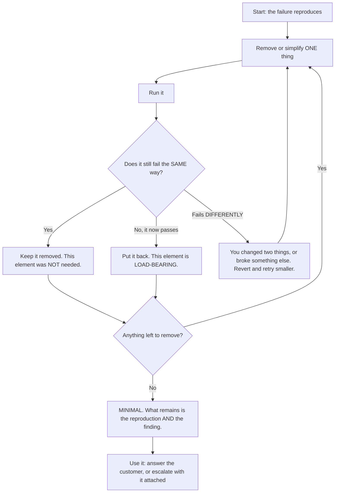
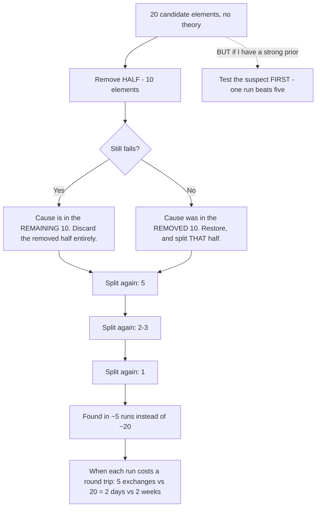
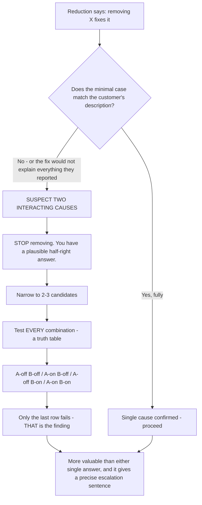
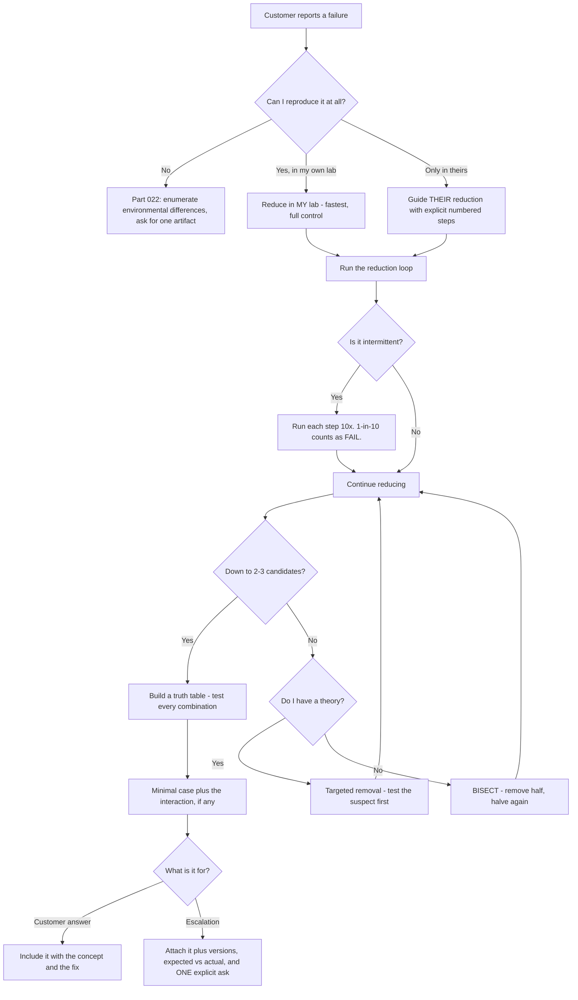

# Part 032 - Writing Minimal Reproducible Examples

> Section goal: Learn the single highest-leverage skill in developer support — reducing a sprawling customer report to the smallest runnable case that still fails. A minimal reproducible example is simultaneously a diagnosis, a proof, and the one artifact that makes an escalation impossible to bounce.

Covers index item **032**. Maps to JD signals: *instinctive ability to subdivide problems into basic components*, *strong analytical and problem-solving skills*, *collaborate with other departments*, *exceed customer expectations on response quality*, and *proficient in at least one programming language*.

---

## 1. Start From Zero: What "Minimal Reproducible" Means

A **minimal reproducible example** (MRE) is the smallest amount of code, configuration, and data that still produces the failure — and that someone else can run.

Three words, three requirements:

| Word | Requirement | Test |
|---|---|---|
| **Minimal** | Nothing can be removed without the failure disappearing | Remove one more thing — does it still fail? |
| **Reproducible** | It fails every time, for anyone, not just sometimes | Run it three times. Hand it to someone else |
| **Example** | It is *runnable*, not described | Can someone paste and execute it? |

> **Analogy.** Isolating a fault in a circuit by removing components one at a time until the shortest path that still blows the fuse remains. What is left *is* the fault.
>
> **Where it stops:** a circuit is fully observable and you can measure any point. Customer code often has hidden dependencies — framework behavior, network conditions, tenant configuration — that do not travel with the code, which is why §5 exists.

### 🔍 Plain-English deep-dive: why the reduction *is* the diagnosis

Beginners treat reduction as preparation for the real work. It is the other way round.

Consider a 300-line React application that fails. You remove routing — still fails. You remove state management — still fails. You remove the UI framework — still fails. You remove the second API call — **it now works**.

You have not just produced a smaller test case. **You have discovered that the second API call is load-bearing.** That is the finding, and it arrived without a single hypothesis.

This is why the JD's phrase *"instinctive ability to subdivide problems into basic components in order to efficiently pinpoint the root cause"* describes exactly this skill. Reduction is not tidying up before diagnosing — reduction is a *search algorithm* over the possibility space, and it works even when you have no theory at all.

**The corollary that matters:** you can reduce a problem in a framework you do not understand, in a language you barely read, with no idea what is wrong. That is a genuinely powerful property, and it is why this skill outranks framework knowledge.

**Analogy:** finding a broken link in a chain by removing links until it holds. You never needed to know metallurgy. **Where it stops:** some faults only appear under combination — two things that each work alone but fail together. §4 covers that.

---

## 2. The Reduction Loop

### The order to remove things

Remove in this order, because it eliminates the most noise soonest:

| Order | Remove | Why first |
|---|---|---|
| 1 | UI, styling, layout | Never the cause; always the bulk |
| 2 | Routing and navigation | Rarely the cause |
| 3 | State management (Redux, stores) | Usually incidental |
| 4 | Business logic | Not identity-related |
| 5 | Extra API calls | Unless the interaction is the bug |
| 6 | The framework itself | Reduce to plain HTML plus a script |
| 7 | Dependencies | Down to just the SDK, or none |
| 8 | **Configuration options** | Last — these are frequently the cause |

**Note that configuration is removed last**, deliberately. Options like `audience`, `scope`, `cacheLocation`, and `useRefreshTokens` are the most likely culprits, so you strip everything around them first and then vary them one at a time.

---

## 3. Reducing Without Access to Their Code

Most of the time you cannot edit the customer's project. You have three moves.

| Move | How | When |
|---|---|---|
| **Reduce it yourself** | Rebuild the described flow minimally in your own lab | You have enough detail |
| **Guide their reduction** | Give them explicit removal steps | They must run it in their environment |
| **Bisect by configuration** | Change one setting at a time in your reproduction | The difference is likely configuration |

### Guiding a customer's reduction

Developers frequently resist this — it feels like being asked to do your job. Frame it as **the fastest path**, and give explicit steps:

> *"To narrow this down quickly, could you try three things in order and tell me at which point it starts working?*
> 1. *Comment out the second API call and retry.*
> 2. *Then remove the `audience` parameter and retry.*
> 3. *Then load the page directly rather than through your router and retry.*
>
> *Each step eliminates a whole category, so whichever one changes the behavior tells us where to look. If none of them change it, that's also useful — it rules out three areas at once."*

Three properties make that message work: each step is concrete, the *purpose* is stated, and a negative result is explicitly framed as progress. Customers cooperate with reduction when they can see it is a search rather than busywork.

### 🔍 Plain-English deep-dive: bisection, and why it beats linear removal

If you have twenty candidate elements and remove them one at a time, you need up to twenty runs.

**Bisection** halves the space each time: remove *half* the elements. If it still fails, the cause is in the remaining half — discard the removed half entirely. If it now passes, the cause was in the half you removed — restore it and split *that* half.

Twenty candidates then take about **five** runs instead of twenty ($\log_2 20 \approx 4.3$).

This matters enormously when each run costs a round trip to the customer. Five exchanges instead of twenty is the difference between a two-day case and a two-week one.

**When linear removal is still better:** when you have a strong prior. If the symptom is a 401 and you suspect `audience`, test that single thing first — one run beats five. **Bisection is for when you have no theory; targeted removal is for when you do.**

**Analogy:** finding a name in a phone book. Opening it in the middle beats starting at A — unless you already know the surname begins with Z. **Where it stops:** bisection assumes one cause. With two interacting causes, removing half can make the symptom vanish for the wrong reason, which is §4.

---

## 4. When Reduction Gets Hard

| Difficulty | Why it happens | What to do |
|---|---|---|
| **Intermittent failure** | A race (Part 025) | Run each step ten times; treat "1 in 10" as a fail |
| **Two interacting causes** | Removing either hides the symptom | Reduce to two candidates, then vary them together in a truth table |
| **Environment-dependent** | Their network, browser, or fleet policy (Part 023) | Reduce the *code*; capture the *environment* separately |
| **Data-dependent** | One specific user or organisation | Reduce to a synthetic record with the same shape |
| **Timing-dependent** | Only at expiry, or under load | Compress the timescale — short token lifetimes in a lab |
| **Framework magic** | Something invisible is contributing (Part 030) | Remove the framework entirely and see if it survives |

### 🔍 Plain-English deep-dive: the interacting-causes trap

The standard loop assumes one cause. Sometimes there are two, and neither alone is sufficient.

Example: a login fails only when **both** (a) the user arrives via a bookmarked deep link, **and** (b) the browser has a stale session cookie. Remove either and it works.

Under naive reduction you remove the deep link, it works, and you conclude the deep link is the cause. You are half right, and your explanation will not survive contact with reality — because the customer will report it still failing for some users.

**The tell:** the reduction "works" but the minimal case does not match the customer's description, or the fix does not fully resolve it in their environment.

**The technique:** once you are down to two or three candidates, stop removing and start a **truth table** — test every combination:

| Deep link | Stale cookie | Result |
|---|---|---|
| No | No | Pass |
| Yes | No | Pass |
| No | Yes | Pass |
| **Yes** | **Yes** | **Fail** |

That table *is* the finding, and it is far more valuable than either single answer. It also produces a precise statement for the escalation: "fails only when both conditions hold."

**Analogy:** a door that only sticks when it is humid *and* the hinge is loose. Fix either and it opens; understand both and you can explain why it recurs in August. **Where it stops:** a truth table over five variables is 32 combinations, which is impractical. Reduce to two or three first, then tabulate.

---

## 5. What an MRE Must Include

A reproduction is only useful if the recipient can actually run it. Include:

| Element | Why | Common omission |
|---|---|---|
| **Runnable code** | Not a description | Pseudocode |
| **Exact versions** | Behavior varies by version | "Latest" |
| **Configuration** | With secrets redacted | Assumed |
| **Steps to run** | Install, start, click | "Just run it" |
| **Expected result** | What *should* happen | Assumed obvious |
| **Actual result** | Verbatim error, including where it appears | Paraphrased |
| **Environment** | Browser, OS, Node version | Omitted |
| **What is already ruled out** | Saves repeating your work | Omitted |
| **Frequency** | Always, or 1 in 10? | Omitted for races |

### The escalation-quality bar

From Part 005, an escalation packet needs a minimal reproduction. Here is what distinguishes an accepted one from a bounced one:

| Bounced | Accepted |
|---|---|
| "Customer reports login fails" | A 40-line file that fails on the reviewer's machine |
| "Using the latest SDK" | `@sdk/spa@2.4.1`, Node 20.11.0, Chrome 131 |
| "Sometimes fails" | "Fails 3 times in 10; capture attached" |
| "See attached repository" | A single file, self-contained |
| "It should work" | "Expected: token with `aud=https://api.example.com`. Actual: `aud=https://tenant/userinfo`" |
| No ask | "Please confirm whether `audience` is expected to be honoured in this option shape" |

**A reproduction that runs is the single most effective thing you can attach to an escalation**, because "cannot reproduce" is the most common reason escalations are returned at triage.

---

## 6. Failure Modes

| Failure mode | What it looks like | Consequence | Correction |
|---|---|---|---|
| **Not reducing at all** | Forwarding the customer's repository | Bounced escalation; slow | Reduce first, always |
| **Changing two things at once** | Failure disappears, cause unknown | No information gained | One variable; revert between |
| **Stopping too early** | A 200-line "minimal" example | Cause still obscured | Keep going until nothing more comes out |
| **Reducing past the failure** | Removed the thing that mattered | Reproduction no longer valid | Put it back the moment it passes |
| **Assuming one cause** | Fix does not fully resolve it | Recurs for some users | Truth-table two or three candidates |
| **Ignoring frequency** | Treating 1-in-10 as a pass | Race declared fixed | Run ten times per step |
| **Reduction without versions** | Runs differently for the reviewer | Bounced | Pin exact versions |
| **Secrets in the MRE** | Client secret in an attached file | Credential exposure | Redact; use placeholders |
| **Description not a reproduction** | "Just call it without awaiting" | Not runnable | Actual file, actual code |
| **Reducing their environment away** | Code reproduces, theirs still fails | Missed a proxy or policy | Capture the environment separately (Part 023) |

---

## 7. Troubleshooting Decision Tree: Building an MRE

### Worked example

*"Our production app intermittently fails login — maybe one user in twenty. We can't reproduce it. Here's our repository."*

1. **Do not open the repository.** Establish the shape first: intermittent, a minority of users, production only.
2. **Intermittent plus a minority cohort** → either an async race (Part 025) or a cohort variable (Part 009). Ask what the affected users have in common. Answer: nothing obvious — different browsers, different regions.
3. **"Nothing in common" plus "intermittent"** shifts the weight to a race.
4. **Ask for a HAR from a failing attempt.** It shows **two** `POST /oauth/token` requests, 6 ms apart, with the same `code`. The second returns `invalid_grant`.
5. **Now reduce, in your own lab.** Build a minimal page: the SDK, a login button, and a callback handler. It works every time.
6. **Add back one thing at a time.** Add a router — still works. Add a second component that also initialises the SDK — **fails, intermittently.**
7. **Reduce further.** Remove the router: still fails. Remove the UI: still fails. **Two components initialising the SDK is the minimal failing case: about 25 lines.**
8. **Run it ten times** to characterise the frequency: fails 4 times in 10. Note it — "intermittent" is not a precise enough description for an escalation.
9. **Explain the mechanism:** both components mount and both attempt to handle the callback. Whichever exchanges first wins; the second presents a spent single-use code. It is a race, so it depends on mount timing — which is why only some users, on some loads, are affected.
10. **The fix:** a single callback handler, or the SDK's provider component which guards it.
11. **Attach the 25-line reproduction** to the answer. The customer can run it, see it fail, apply the guard, and see it pass.

Note that step 6 — adding back rather than removing — was the productive direction here, because the minimal starting point *worked*. **Reduction and construction are the same search from opposite ends**, and you pick whichever end you are closer to.

---

## 8. Lab: Reduce Real Failures

**Purpose.** Practise reduction until it is automatic, and produce reusable MRE templates.

**Prerequisites.** Parts 022, 024–031. Your lab tenant and local apps. **Your own systems only.**

**Steps.**

1. Create `okta-prep/labs/032-mre/`.
2. **Build a deliberately bloated app.** Take your Part 028/029 SPA and add: a router, a state store, three UI components, two unrelated API calls, and a styling framework. Then introduce **one** identity bug — a missing `audience`. Confirm it fails. **This is your reduction target.** Record the starting line count.
3. **Reduce it.** Run the loop from §2, following the removal order. **Record the line count and the result after every single step** in `reduction-log.md`. Continue until nothing more can be removed.
4. **Measure.** Record the final line count and the ratio. Record how many steps it took.
5. **Reduce a second, different bug — blind.** Have someone else introduce one of the five Part 030 bugs into a copy without telling you which, or shuffle your own saved diffs and pick one at random. **Time the reduction.** Record which bug it was and how long it took.
6. **Bisection versus linear.** Build a version with ten candidate elements and one cause. Reduce it linearly, recording the number of runs. Reset and reduce by bisection, recording the number of runs. **Record both figures side by side** — that comparison is the argument for bisection.
7. **Interacting causes.** Deliberately create a two-cause failure — for example, a `SameSite` cookie issue that only manifests when the callback uses `form_post` mode. Reduce naively and record the wrong conclusion you reach. Then build the four-row truth table and record the correct one. **The wrong conclusion is the valuable part of this exercise.**
8. **Intermittent characterisation.** Reproduce the Part 025 double-invocation race. Run it ten times and record the failure rate. Write the sentence you would put in an escalation: *"fails N times in 10 under condition X."*
9. **MRE template.** Write `mre-template.md` — the §5 checklist as a fill-in form: code, versions, config, steps, expected, actual, environment, ruled out, frequency, and one explicit ask.
10. **Guided-reduction template.** Write `guided-reduction.md` — the customer message from §3, with three numbered steps, a stated purpose per step, and the "a negative result is also progress" framing.
11. **Escalation packet.** Take your reduction from step 3 and write a full escalation packet around it using Part 005's eight elements. **This is a showable artifact.**
12. **Failure catalog + manifest.** Add rows. Complete `MANIFEST.md`.

**Expected evidence.** A reduction log with line counts at every step, a start-to-finish ratio, a timed blind reduction, a linear-versus-bisection run-count comparison, a two-cause truth table with the wrong conclusion recorded first, a characterised failure rate, two templates, and a complete escalation packet.

**Validation rubric.**

| Check | Pass condition |
|---|---|
| Every step logged | Line count and pass/fail recorded per step, not just the end result |
| Genuinely minimal | Removing anything further makes the failure disappear |
| Ratio recorded | Starting and final line counts, with the ratio stated |
| Blind reduction timed | Bug identified, time recorded |
| Bisection compared | Run counts for both methods, side by side |
| Truth table built | Four rows, and the naive wrong conclusion recorded |
| Frequency characterised | "N times in 10", not "intermittent" |
| Packet complete | All eight elements, with a runnable reproduction attached |
| No secrets | Every value redacted or a placeholder |

**Cleanup and privacy.** Your own tenant and local apps only — **never reduce using employer or customer code**, even anonymised. Redact every client ID, secret, and token from the MRE and the escalation packet; use placeholders like `YOUR_CLIENT_ID`. The escalation packet is a portfolio artifact, so it must be safe to show.

---

## 9. JD Mapping

| Supplied JD signal | How this Part supports it |
|---|---|
| **Instinctive ability to subdivide problems into basic components** | This Part *is* that phrase, made into a repeatable procedure |
| Strong analytical and problem-solving skills | §3's bisection and §4's truth tables are formal search strategies |
| **Collaborate with other departments** | §5's escalation bar; a runnable MRE is what stops a bounce |
| **Exceed expectations on response quality** | Attaching a reproduction the customer can run beats any explanation |
| Proficient in a programming language | Reduction requires reading and editing unfamiliar code confidently |
| Resolve issues in a timely fashion | Bisection turns twenty round trips into five |
| Business and technical analysis skills | §4's interacting-causes discipline prevents a plausible wrong answer |

---

## 10. Candidate Honesty Note

- **This is the skill to lead with when asked about problem-solving**, because it maps word-for-word onto the JD's "subdivide problems into basic components in order to efficiently pinpoint the root cause."
- **The strongest thing you can say:** *"Reduction isn't preparation for diagnosis — it *is* the diagnosis. When I remove the second API call and the failure disappears, I've found that it's load-bearing, and I got there with no hypothesis at all. That means I can reduce a problem in a framework I don't know, in a language I barely read."*
- **A second strong point:** *"If each run costs a round trip to the customer, I bisect rather than removing linearly — twenty candidates take five exchanges instead of twenty. But if I have a strong prior I test that single thing first, because one run beats five. Bisection is for when I have no theory."*
- **A third, and it shows real judgement:** *"The trap is assuming one cause. If the reduction 'works' but the minimal case doesn't match the customer's description, I stop removing and build a truth table over two or three candidates — because a plausible half-right answer that recurs next week is worse than taking another hour."*
- **A fourth, small and practical:** *"'Intermittent' isn't good enough for an escalation. I characterise it — 'fails 4 times in 10 under condition X' — because that's the difference between an accepted work item and one that's returned as not reproducible."*
- **Be honest about origin:** you practised this on deliberately bloated apps you built yourself. That is still genuine practice, and you have the logs.

---

## 11. Official Source Anchors

Accessed **26 August 2026**.

| Source | Use it for |
|---|---|
| Stack Overflow — "How to create a Minimal, Reproducible Example" | The canonical community definition of the three requirements |
| `git bisect` documentation | The formal bisection algorithm in §3, applied to history rather than code |
| Auth0 and Okta community forums | Real posts, and the visible difference between reproducible and non-reproducible reports |
| Auth0 and Okta support documentation — what to include when raising a case | Vendor-stated expectations; align your MRE template with them |
| Part 005 of this guide | The eight-element escalation packet the MRE slots into |
| Part 022 of this guide | Command-line reproduction, which is often the smallest possible MRE |
| Delta debugging literature (Zeller and Hildebrandt) | The formal treatment of automated input reduction, if you want the theory |

**Revalidate after 26 August 2026:** vendor case-submission requirements. The reduction method itself is timeless.

---

## ⭐ Likely Interview Questions for This Section

### Q1. "How do you approach a problem you can't reproduce and don't understand?"
> *Model answer:* "Reduction, because it works without a hypothesis. I take whatever fails and start removing things one at a time — UI first, then routing, state management, business logic, extra API calls, the framework itself, and configuration last because that's most likely to be the cause. After each removal I re-run. If it still fails, the thing I removed wasn't needed. If it starts passing, I put it back, because that element is load-bearing. What remains when nothing more can come out is both the minimal reproduction and the finding. The property I like about it is that it's a search algorithm over the possibility space rather than a test of a theory — so I can reduce a problem in a framework I've never used, in a language I barely read, with no idea what's wrong."

### Q2. "That could take a lot of iterations. How do you speed it up?"
> *Model answer:* "Bisection, when I have no theory. Instead of removing one element at a time, I remove half. If it still fails, the cause is in the remaining half and I discard the removed half entirely. If it passes, the cause was in what I removed, so I restore it and split that half. Twenty candidates take about five runs instead of twenty. That matters enormously when each run costs a round trip to a customer in another timezone — five exchanges instead of twenty is the difference between a two-day case and a two-week one. But if I do have a strong prior — say the symptom is a 401 and I suspect a missing `audience` — I test that single thing first, because one run beats five. Bisection is the no-theory strategy; targeted removal is the with-theory one."

### Q3. "What if removing something makes the failure go away, but you don't think that's the real cause?"
> *Model answer:* "Then I probably have two interacting causes, and I stop removing and start tabulating. The tell is exactly that instinct — the reduction 'works' but the minimal case doesn't match the customer's description, or the fix wouldn't explain everything they've reported. So once I'm down to two or three candidates I test every combination in a truth table rather than continuing to strip. A real example would be a login that only fails when the user arrives via a bookmarked deep link *and* has a stale session cookie — remove either and it works, so naive reduction gives you a confident half-right answer that comes back next week. The truth table is more valuable than either single answer, and it gives me a precise sentence for the escalation: fails only when both conditions hold."

### Q4. "How do you handle an intermittent failure during reduction?"
> *Model answer:* "Two adjustments. First, I run each step multiple times — usually ten — and treat any failure as a fail. Otherwise I'll remove something, see one pass, and wrongly conclude it was the cause. Second, I characterise the rate rather than calling it 'intermittent', because 'fails 4 times in 10 under condition X' is what makes an escalation acceptable and 'intermittent' is what gets it returned as not reproducible. Intermittent also carries diagnostic information in itself — combined with 'worse under load' and 'disappears when you add logging', it's the signature of an async race, so I'd suspect ordering before configuration. If it's timing-dependent rather than concurrency-dependent, I compress the timescale in the lab — short token lifetimes turn an hourly failure into a one-minute one."

### Q5. "The customer won't reduce their code. What do you do?"
> *Model answer:* "Usually it's because it feels like being asked to do my job, so I'd frame it as the fastest path and make it trivially easy. Concrete numbered steps rather than 'please simplify' — 'comment out the second API call and retry; then remove the `audience` parameter and retry; then load the page directly rather than through your router' — with the purpose of each stated, because each one eliminates a whole category. And I'd explicitly say that if none of them change the behavior, that's also useful, because it rules out three areas at once. Framing a negative result as progress is what gets cooperation. In parallel I'd reduce it myself in my own lab from their description, because I control every variable there and don't need to wait for them — and often that gets there first."

### Q6. "Why does a reproduction matter so much for an escalation?"
> *Model answer:* "Because 'cannot reproduce' is the main reason escalations get returned at triage, and a runnable file removes that entirely. A reviewer can paste it, run it, and see the failure on their own machine within a minute — there's nothing left to dispute and nothing to ask me for. Beyond that it changes the *character* of the escalation: instead of relaying a customer's account, I'm presenting an experiment anyone can repeat. Around it I'd put the rest of the packet — exact versions rather than 'latest', expected versus actual stated precisely so 'wrong' is objective, the failure rate if it's intermittent, what I've already ruled out so they don't repeat my first two days, and one explicit answerable ask. But the reproduction is the element that does the heavy lifting."

### Q7. "How small should a minimal example be?"
> *Model answer:* "Small enough that removing anything else makes the failure disappear — that's the actual definition and it's testable, which is what I like about it. In practice I've reduced a three-hundred-line app with routing, a state store, several components and a UI framework down to about twenty-five lines. The test is mechanical: try to remove one more thing. If it still fails, you weren't minimal. Where people stop too early is at a hundred lines that 'looks small enough' — but the remaining ninety lines are exactly where a reviewer will look for excuses, and the cause is still hidden among them. The other failure is reducing past it: the moment it starts passing, put the last thing back, because you've just removed the load-bearing element."

### Q8. "Give me an example of a reduction that found something surprising."
> *Model answer:* "A customer reported intermittent login failures affecting maybe one user in twenty, production only, with nothing obviously in common between affected users. A HAR from a failing attempt showed two token requests six milliseconds apart with the same authorization code, the second returning `invalid_grant`. So I rebuilt it minimally in my own lab — SDK, a login button, a callback handler — and it worked every time. Then I added things back rather than removing, because my minimal starting point passed. Router: still fine. A second component that also initialised the SDK: it failed, intermittently. Both components were mounting and both attempting to handle the callback; whichever exchanged first won and the second presented a spent single-use code. Twenty-five lines, and it fails four times in ten. The lesson I took from it is that reduction and construction are the same search from opposite ends — you pick whichever end you're closer to."

---

## 🧠 30-Second Memory Hooks

- **Minimal · Reproducible · Example.** Each word is a testable requirement.
- **Reduction IS the diagnosis**, not preparation for it. It works with **no hypothesis**.
- **Removal order:** UI → routing → state → business logic → extra calls → framework → dependencies → **configuration last**.
- **Still fails after removing it? Keep it out. Now passes? Put it back — it is load-bearing.**
- **No theory → bisect** (20 candidates ≈ 5 runs). **Strong theory → test the suspect first** (1 run).
- **Reduction "works" but doesn't match their description → TWO causes.** Stop removing; build a truth table.
- **Intermittent → run each step 10×.** One failure in ten counts as a **fail**.
- **Never say "intermittent" in an escalation.** Say **"fails N times in 10 under condition X."**
- **"Cannot reproduce" is the top reason escalations bounce.** A runnable file removes it.
- **If your minimal start already passes, ADD BACK instead of removing.** Same search, opposite end.
- **Redact everything.** An MRE gets attached, forwarded, and stored.

---

## ✅ Completion Checklist

- [ ] **Knowledge:** I can state the removal order, explain when to bisect versus target, and describe the interacting-causes tell.
- [ ] **Lab artifact:** `032-mre/` contains a step-by-step reduction log with line counts, a timed blind reduction, a linear-versus-bisection comparison, a two-cause truth table, and a complete escalation packet.
- [ ] **Spoken:** I can explain "reduction is the diagnosis" with a concrete example in under 60 seconds.
- [ ] **Honesty check:** no employer or customer code was used; every reproduction is redacted and safe to show.
- [ ] **Source check:** I have read the canonical MRE definition and my vendor's own case-submission requirements.

---

*Next suggested section:* **[Part 033 - Catalog of Common Application-Side Auth Bugs](Part-033-catalog-of-common-application-side-auth-bugs.md)** — Group C closes with the consolidated reference: every recurring client-side mistake, its symptom, its cause, and its fix, in one place.
