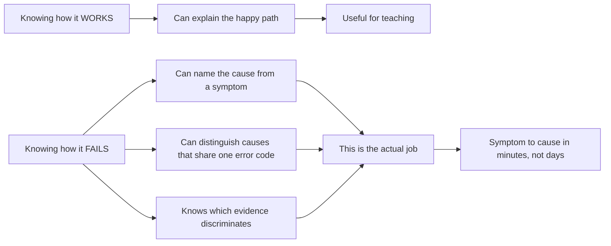
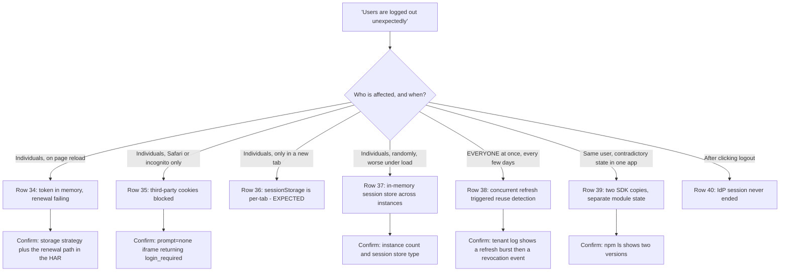
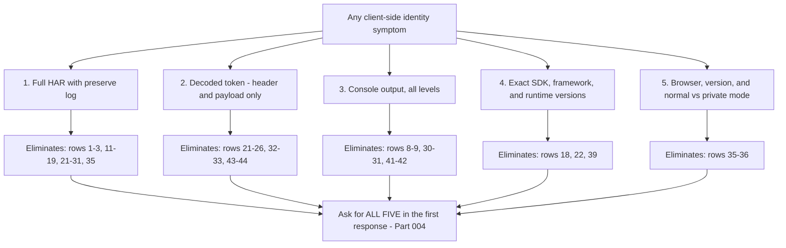
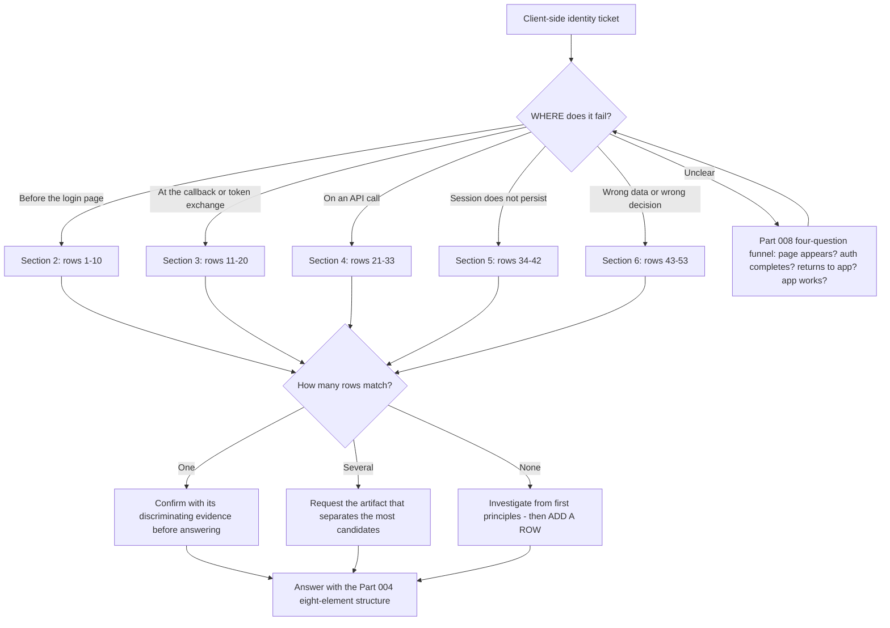

# Part 033 - Catalog of Common Application-Side Auth Bugs

> Section goal: Consolidate everything in Group C into one reference. Every recurring client-side mistake, its symptom, its cause, its fix, and the evidence that confirms it — in a single searchable table you can use on a live ticket and revise from before an interview.

Covers index item **033**. Maps to JD signals: *instinctive ability to subdivide problems into basic components*, *strong analytical and problem-solving skills*, *contribute to and maintain a repository of product-area knowledge*, *promote best practices*, and *exceed customer expectations on response quality*.

---

## 1. Start From Zero: Why a Catalog Beats Knowledge

Support expertise is not knowing how things work. It is **knowing how things fail, and being able to tell one failure from another that looks identical**.

> **Analogy.** A doctor's value is not knowing anatomy — it is differential diagnosis: three conditions present identically, and one question or one test separates them.
>
> **Where it stops:** medicine has a bounded set of conditions. Software has an unbounded set — so the catalog is a working tool that grows, not a complete reference.

### 🔍 Plain-English deep-dive: why one error code has many causes

The recurring frustration in identity support is that a handful of error codes cover dozens of distinct causes.

| Error | Distinct causes |
|---|---|
| `invalid_grant` | At least 4 (Part 012) |
| `401` from an API | At least 6 |
| `Callback URL mismatch` | At least 12 (Part 013) |
| "Logged out unexpectedly" | At least 5 |
| "CORS error" | At least 6 (Part 015) |

This is deliberate. Detailed error responses leak information to an attacker probing an endpoint, so the public error is coarse and the detail stays in the server-side log.

**The consequence for you:** the error code narrows the field but never identifies the cause. What identifies the cause is the **surrounding evidence** — which is why every row in this catalog names its discriminating evidence rather than just its fix.

**The habit this creates:** when you see a familiar error, do not jump to the most common cause. Ask *"which of the N causes is this, and what single piece of evidence separates them?"* That question is the difference between being right most of the time and being right reliably.

**Analogy:** a car warning light that means "engine fault". It narrows things usefully; it does not tell you which fault. The diagnostic port does. **Where it stops:** a diagnostic port gives a precise code. Your equivalent is a HAR plus a tenant log, and you have to correlate them yourself.

---

## 2. The Catalog: Before the Login Page

| # | Symptom | Cause | Discriminating evidence | Fix | Part |
|---|---|---|---|---|---|
| 1 | Error page before any login prompt | `redirect_uri` not on the allow-list | Error appears on the authorization server's own page | Register the exact URI | 013 |
| 2 | "Callback URL mismatch" but the URIs look identical | Trailing slash, path case, scheme, `www`, or port | Byte-length diff; first differing index | Align exactly | 013 |
| 3 | `%25` visible in the redirect URI | Double-encoding | `%25` in the HAR value | Use a URL-building API | 013 |
| 4 | `unauthorized_client` | Grant not enabled for this application type | The registered type versus the grant attempted | Correct the type or enable the grant | 029 |
| 5 | `invalid_client` at `/token` | Wrong secret, client ID, or **auth method** | Which method the client is registered for | Match the method | 029 |
| 6 | Login page will not load at all | DNS, TLS, firewall, or a blocked hostname | Works on mobile data; per-hostname test | Network evidence pack | 023 |
| 7 | Login page half-renders | Asset hostnames not allow-listed | Which requests failed in the HAR | Complete hostname allow-list | 023 |
| 8 | SPA renders nothing; no button | SDK script blocked, or an init error | **No Network entry** = CSP; console error otherwise | Allow-list the script, or fix init | 016, 026 |
| 9 | Clicking login does nothing | Missing `preventDefault`, or the handler never registered | Page reloads; or no listener | `preventDefault()` first | 026 |
| 10 | Users sent to the wrong identity provider | Home realm discovery | The organisation hint in the `/authorize` request | Fix domain mapping | 003 |

---

## 3. The Catalog: Callback and Token Exchange

| # | Symptom | Cause | Discriminating evidence | Fix | Part |
|---|---|---|---|---|---|
| 11 | `invalid_grant` — code already used | Callback handler ran twice | **Two `/token` POSTs, same `code`, ms apart** | Guard the exchange | 012, 026 |
| 12 | `invalid_grant` — code expired | Delay between callback and exchange | Elapsed time in the HAR | Exchange immediately | 012 |
| 13 | `invalid_grant` — PKCE mismatch | Verifier lost across a reload | A navigation between authorize and token | Persist the verifier | 031 |
| 14 | `invalid_grant` — redirect URI mismatch | `redirect_uri` differs between the two requests | Compare both values in one HAR | Make them identical | 013 |
| 15 | "Invalid state" | `state` cookie or storage lost | Cookie absent; or two tabs racing | Fix storage; guard concurrency | 014, 065 |
| 16 | Login loop, never completes | Session cookie not set or not returned | `Set-Cookie` present? Attributes? | Cookie attributes; `trust proxy` | 012, 014 |
| 17 | 415 at `/token` | JSON sent where form encoding required | Request `Content-Type` | Form-encode | 012 |
| 18 | Fails only in development | Strict-mode double invocation | Two `/token` POSTs in dev only | Guard; do not disable strict mode | 026 |
| 19 | Works locally, fails deployed | Configuration or environment difference | Compare tenant, app, URI, audience | Align configuration | 009 |
| 20 | `invalid_client` deployed only | Secret-bearing code moved to the client bundle | **Search the bundle for the secret** | Move the exchange server-side; **rotate** | 027, 029 |

---

## 4. The Catalog: API Calls and Tokens

| # | Symptom | Cause | Discriminating evidence | Fix | Part |
|---|---|---|---|---|---|
| 21 | 401 — `aud` is the IdP's own endpoint | `audience` not requested at login | Decoded token `aud` | Pass `audience` | 064 |
| 22 | 401 — code appears to set `audience` | SDK major version moved the option | **No `audience` on `/authorize` despite the code** | Correct the option shape | 031 |
| 23 | `Bearer [object Promise]` | Missing `await` | The literal string in the HAR | Add `await` | 025 |
| 24 | 401 — "signing key not found" | Stale JWKS after rotation | `kid` not in the current JWKS | Cache with `kid`-miss refetch | 042 |
| 25 | 401 — "issuer invalid" | Trailing slash, or custom-domain mismatch | Compare `iss` against discovery | Match exactly | 028 |
| 26 | 401 — "jwt expired" on some hosts only | Clock skew | Failures correlate with specific instances | Sync clocks; allow skew | 028 |
| 27 | 403, retried forever | Client retries an authorization failure | Repeated identical 403s | 403 is permanent — do not retry | 012 |
| 28 | 429 under load | Token requested per call | Token endpoint volume ≈ API volume | Cache until near `exp` | 019 |
| 29 | CORS error on the API call | Their API's headers or middleware order | **What did `OPTIONS` return?** | CORS before auth | 015, 028 |
| 30 | Request never appears in Network | CSP `connect-src` | **No entry at all** + console line | Allow-list the origin | 016 |
| 31 | `Unexpected token '<'` | HTML returned where JSON expected | **Read the response body** | Fix the URL or the proxy | 026 |
| 32 | API accepts any valid token | `audience` not configured on the API | Validation config | Set audience | 028 |
| 33 | Forged tokens would be accepted | `algorithms` not an explicit allow-list | Validation config | Explicit allow-list | 028 |

### 🔍 Plain-English deep-dive: the decoded token settles almost this entire section

Rows 21 to 33 look like thirteen separate problems. They are mostly one artifact away from being resolved.

An access token's header and payload are Base64url-encoded, not encrypted — anyone can read them, and decoding locally takes seconds (Part 040). What they contain answers most of this section directly:

| Claim | Resolves |
|---|---|
| `aud` | Rows 21, 22, 32 — is this token even *for* this API? |
| `iss` | Row 25 — right tenant, right issuer string, trailing slash included |
| `exp` | Row 26 — genuinely expired, or a clock problem on one host |
| `kid` (header) | Row 24 — is this key in the current JWKS? |
| `alg` (header) | Row 33 — what algorithm is actually being used |
| `scope` | Row 27 — is this a 403 because the scope is genuinely absent? |
| Not a JWT at all | Row 23 — `[object Promise]`, or an opaque token being decoded wrongly |

**So the highest-value single question on any API-side ticket is: "can you send me the decoded token — header and payload, signature removed?"** One artifact, thirteen candidates narrowed to one or two.

**The redaction framing matters**, because customers are rightly cautious: *"I need the header and payload claims, not the signature — without the signature the token is inert. Please redact any personal claims; I mainly need `aud`, `iss`, `exp`, `kid`, and `scope`."* That is safe, specific, and it usually gets you a usable answer immediately rather than a negotiation.

**Analogy:** a parcel's address label answers most delivery questions without opening the parcel. **Where it stops:** the label still contains personal data (Part 006) — removing the signature makes the token *unusable*, not *non-personal*.

---

## 5. The Catalog: Sessions and Renewal

| # | Symptom | Cause | Discriminating evidence | Fix | Part |
|---|---|---|---|---|---|
| 34 | Logged out on every reload | Token in memory; renewal failing | Storage strategy plus the renewal path | Refresh rotation, or BFF | 016, 017 |
| 35 | Logged out only in Safari or incognito | Third-party cookie blocking | `prompt=none` iframe returns `login_required` | Custom domain, refresh rotation, or BFF | 017 |
| 36 | Logged out in a new tab | `sessionStorage` is per tab | Storage mechanism | Expected — explain, or change mechanism | 016 |
| 37 | Random logouts, worse under load | In-memory session store, multiple instances | Instance count and store type | Shared session store | 028 |
| 38 | **All users logged out at once, periodically** | Concurrent refresh triggered reuse detection | Burst of refresh exchanges, then revocation | **Single-flight guard** | 025, 061 |
| 39 | Logged in here, logged out there | Two SDK copies with separate state | `npm ls <sdk>` shows two versions | Force a single version | 027 |
| 40 | "Logout didn't work" | Only local state cleared; IdP session intact | No call to the end-session endpoint | Call it | 075 |
| 41 | Popup completes, parent hangs forever | `Cross-Origin-Opener-Policy: same-origin` | The header on the parent page | `same-origin-allow-popups` | 016 |
| 42 | Silent auth iframe blank | `frame-src` CSP, or `frame-ancestors` | Console refusal message | Allow-list, or change mechanism | 016 |

---

## 6. The Catalog: Data, Types, and Logic

| # | Symptom | Cause | Discriminating evidence | Fix | Part |
|---|---|---|---|---|---|
| 43 | Unverified users allowed in | `"false"` is a truthy string | `typeof` the claim | `=== true`; normalise at the boundary | 024 |
| 44 | Verified users denied | Claim absent → `undefined` | The claim missing from the token | Distinguish absent from false | 024 |
| 45 | Config value of `0` becomes a default | `\|\|` instead of `??` | The defaulting expression | Use `??` | 024 |
| 46 | "Only works for the last item" | `var` in a loop with callbacks | The loop declaration | Use `let` | 024 |
| 47 | Some record IDs unreachable | JSON number precision on large integers | Compare raw text with parsed value | Treat IDs as strings | 018 |
| 48 | Fields silently cleared on update | `null` serialised for absent fields | The request body | Omit rather than null | 018 |
| 49 | Whole profile wiped | `PUT` with a partial object | Method and body | `PATCH`, or read-modify-write | 018 |
| 50 | "Data is missing" — a round number | Page one only | Count is 25, 50, or 100 | Follow pagination | 019 |
| 51 | Some bulk items silently skipped | `Promise.all` hid the failures | Client code | `Promise.allSettled` | 025 |
| 52 | Error handling never fires | `fetch` does not reject on 4xx/5xx | Missing `res.ok` check | Check `res.ok` | 025 |
| 53 | Cross-tenant data exposure | Missing organisation check | The authorization check itself | **Subject + action + resource + org** | 010 |

---

## 7. Using the Catalog Live

### 🔍 Plain-English deep-dive: how to use this without pattern-matching badly

A catalog is dangerous if it turns you into a lookup table. Two failure modes:

1. **Premature matching.** You see `invalid_grant`, jump to the most common cause, and give an answer that is wrong for this case. You will be right often enough to feel confident and wrong often enough to lose credibility.
2. **Catalog blindness.** The cause is not in the catalog, and you force the closest match instead of investigating.

**The discipline is to use the catalog as a *hypothesis generator*, never as an answer.** The workflow:

| Step | Action |
|---|---|
| 1 | Symptom → look up **all** matching rows |
| 2 | Note the **discriminating evidence** column for each |
| 3 | Request the single artifact that separates the most candidates |
| 4 | Eliminate rows from the evidence |
| 5 | If nothing matches, **investigate from first principles and add a new row** |

**Step 5 is what keeps the catalog honest.** Every ticket that does not match is a gap, and filling it is how the catalog stays useful rather than becoming a source of confident wrong answers.

**Analogy:** a field guide to birds. It speeds identification enormously, and someone who forces every bird into the nearest illustration will misidentify constantly. The guide is a starting point for looking more carefully. **Where it stops:** a field guide is finite and complete. Yours is neither, by design.

### The evidence that discriminates the most

Some artifacts eliminate many candidates at once. Request these first.

**That is why Part 004's rule — request everything you foresee needing in one message — matters so much.** Those five artifacts collectively eliminate the majority of this catalog.

---

## 8. Troubleshooting Decision Tree: Catalog Entry Point

### Worked example

*"Users are logged out unexpectedly. It's not everyone and it's not all the time."*

1. **Where does it fail?** Session persistence → Section 5, rows 34–42.
2. **Nine candidates.** Too many to guess between, so find the discriminating evidence.
3. **The cheapest discriminators, asked together:** which browser and mode; how many application instances and where sessions are stored; does it happen on reload, in a new tab, or spontaneously; and does it affect everyone at once or individuals.
4. **Answers:** affects **everyone simultaneously**, every few days, all browsers, single-page app with refresh tokens.
5. **Eliminate:** row 35 needs a browser cohort — eliminated. Row 36 needs a new tab — eliminated. Row 37 needs multiple instances and server sessions — eliminated. Rows 39–42 have distinct signatures — eliminated.
6. **Remaining: row 38.** "All users at once, periodically" is the signature of concurrent refresh triggering reuse detection.
7. **Confirm with the discriminating evidence:** ask for the tenant log around the event. A burst of refresh exchanges followed by a grant revocation event. **Confirmed.**
8. **Answer:** their token cache has no single-flight guard, so concurrent callers each present the same refresh token; rotation treats the repeats as reuse and revokes the grant. Four-line fix, plus the concept that reuse detection is working correctly and the fix belongs client-side.

Nine candidates to one, with four questions and one log lookup. **That is what the catalog is for** — not to supply the answer, but to make the elimination fast and complete.

---

## 9. Lab: Build and Test Your Own Catalog

**Purpose.** Convert this reference into a personal, verified artifact where every row is something you have actually reproduced.

**Prerequisites.** All of Groups A–C, and the failure catalog you have been building since Part 007.

**Steps.**

1. Create `okta-prep/labs/033-bug-catalog/`.
2. **Consolidate.** Merge every row from your running `failures/failure-catalog.md` into one table, with columns: symptom, cause, **discriminating evidence**, fix, Part reference, and **verified-by-me yes/no**.
3. **Audit coverage.** Compare your table against §§2–6. Mark every row you have **not** personally reproduced. **Be honest** — that column is the value of the exercise.
4. **Close the gaps.** Pick the ten highest-frequency unverified rows and reproduce them in your lab. Update the verified column. Record the exact error text for each.
5. **Discriminator map.** For each of the five key artifacts in §7, list which of your rows it eliminates. **Verify by taking three of your reproductions and checking that the named artifact really does distinguish them.**
6. **Sort by frequency.** Order the catalog by how often you would expect each to appear, based on what you saw in the community forums during Parts 004 and 030. Note that this ordering is an estimate, not data.
7. **Blind drill.** Have someone present ten symptoms (or shuffle your own reproductions and pick blind). **Timed at 60 seconds each**, name: the likely rows, the discriminating evidence, and the first question you would ask. Score yourself.
8. **First-response template.** Write `first-response.md` — a message requesting all five key artifacts, with a stated reason for each and explicit redaction instructions (Part 006). Under 200 words.
9. **Publishable version.** Produce `catalog-public.md` — the same content with everything specific to your tenant removed, safe to show an interviewer. Add a header stating it was built from lab reproductions, not production experience.
10. **Manifest.** Complete `MANIFEST.md`, stating honestly how many rows are personally verified versus learned.

**Expected evidence.** A consolidated catalog with an honest verification column, ten newly closed gaps with exact error text, a discriminator map verified against three reproductions, a frequency ordering, a scored blind drill, a first-response template, and a publishable version.

**Validation rubric.**

| Check | Pass condition |
|---|---|
| Consolidated | Every row from every prior lab is present |
| Verification honest | Unverified rows marked as such, not quietly claimed |
| Ten gaps closed | Reproduced, with verbatim error text |
| Discriminator map tested | Three reproductions actually distinguished by the named artifact |
| Drill timed and scored | Ten symptoms, 60 seconds each, score recorded |
| Template under 200 words | Five artifacts, each with a reason and a redaction note |
| Publishable version clean | No tenant identifiers; honest provenance header |

**Cleanup and privacy.** Everything derives from your own lab reproductions. The publishable version must contain **no** tenant domain, client ID, or user data, and **no** employer or customer material of any kind. State its provenance explicitly — lab reproductions, not production experience — so it can never be mistaken for the latter.

---

## 10. JD Mapping

| Supplied JD signal | How this Part supports it |
|---|---|
| **Instinctive ability to subdivide problems** | §8's entry point routes by failure location, then eliminates by evidence |
| Strong analytical and problem-solving skills | §7's discriminator-first workflow prevents premature matching |
| **Contribute to and maintain a repository of product-area knowledge** | The catalog *is* a knowledge repository, built and maintained personally |
| Promote best practices | Rows 32, 33, 53 are security findings raised regardless of the reported issue |
| **Exceed expectations on response quality** | §7's five-artifact first response eliminates most candidates in one exchange |
| Resolve issues in a timely fashion | Nine candidates to one in four questions |
| Self-starter and continuous growth | §9 step 5 requires investigating and adding rows when nothing matches |

---

## 11. Candidate Honesty Note

- **This catalog is your single most interview-relevant artifact from Group C**, because it is exactly what a support engineer's expertise looks like written down.
- **The strongest thing you can say:** *"Support expertise isn't knowing how things work — it's knowing how they fail and being able to tell one failure from another that looks identical. `invalid_grant` has four causes, a 401 from an API has six, and 'callback URL mismatch' has about twelve. The error code narrows the field; it never identifies the cause. So every row in my catalog names the evidence that discriminates it, not just the fix."*
- **A second strong point:** *"Five artifacts eliminate most of the catalog — a full HAR with preserve log, the decoded token, the console at all levels, exact versions, and the browser plus mode. So I ask for all five in the first response with a reason for each, rather than discovering I need them one at a time across three days of round trips."*
- **A third, which shows judgement rather than knowledge:** *"A catalog is dangerous if it makes you pattern-match. I use it as a hypothesis generator — look up all matching rows, find the evidence that separates them, request that. And if nothing matches, I investigate properly and add a row, because forcing a ticket into the nearest entry is how you become confidently wrong."*
- **Be scrupulously honest about provenance.** Mark which rows you have personally reproduced. Say: *"about forty of these I've reproduced in a lab; the rest I understand from documentation and forum reading."* That distinction is exactly the claim-safety discipline from Part 001, and stating it unprompted is itself a strong signal.
- **Do not present the catalog as production experience.** It is lab-verified knowledge, and that is genuinely impressive for a candidate transitioning in.

---

## 12. Official Source Anchors

Accessed **26 August 2026**.

| Source | Use it for |
|---|---|
| IETF RFC 6749 §5.2 and RFC 6750 §3.1 | The canonical error codes behind rows 4, 5, 11–14, 21–27 |
| OpenID Connect Core — error responses | `login_required` and the silent-auth errors in rows 35, 42 |
| MDN — CORS errors, CSP, cookies, `fetch` | Rows 29–31, 41–42, 52 |
| Auth0 and Okta error-code references | Vendor-specific error text and event codes |
| Auth0 and Okta community forums | Real frequency signal for the §9 step 6 ordering |
| Your own `failures/failure-catalog.md` | The primary source — rows you personally verified |
| Parts 011–032 of this guide | Every row's underlying explanation |

**Revalidate after 26 August 2026:** vendor error text and event codes. The protocol-level codes are stable.

---

## ⭐ Likely Interview Questions for This Section

### Q1. "What does support expertise actually consist of?"
> *Model answer:* "Knowing how things fail, and being able to tell one failure from another that looks identical. Knowing how the happy path works is useful for teaching, but the job is differential diagnosis. `invalid_grant` has at least four distinct causes — code reused, code expired, PKCE verifier mismatch, redirect URI mismatch between the authorize and token requests. A 401 from an API has at least six. 'Callback URL mismatch' has about twelve character-level variants. The error code narrows the field and never identifies the cause, deliberately — detailed errors would leak information to someone probing the endpoint, so the detail stays in the server log. So what matters is knowing, for each symptom, which single piece of evidence separates the candidates. That's what I've built: a catalog where every row names its discriminating evidence, not just its fix."

### Q2. "A customer reports unexpected logouts. Walk me through it."
> *Model answer:* "That symptom has about nine causes, so I wouldn't guess — I'd eliminate. Four cheap questions, asked together: which browser and is it normal or private mode; how many application instances and where are sessions stored; does it happen on reload, in a new tab, or spontaneously; and does it affect everyone at once or individuals. If it's Safari or incognito only, that's third-party cookie blocking and silent auth failing. New tab only is `sessionStorage`, which is per-tab and expected. Multiple instances with server-side sessions is an in-memory session store. And everyone at once, periodically, is the interesting one — that's a concurrent refresh stampede triggering reuse detection, which revokes the whole grant. I'd confirm that from the tenant log: a burst of refresh exchanges followed by a revocation event. Nine candidates to one, in four questions."

### Q3. "What do you ask for in your first response?"
> *Model answer:* "Five artifacts, with a stated reason for each, because they collectively eliminate most of the catalog and asking for them one at a time costs a day each across timezones. A full HAR with preserve log enabled, which covers most of the flow-related causes. The decoded token — header and payload, signature removed — which settles every audience, issuer, expiry, and key-rotation question. The console output at all levels, which distinguishes CSP from CORS from a network failure. Exact SDK, framework, and runtime versions, because behavior differs between majors. And the browser, version, and whether it's normal or private mode, which tests the third-party cookie hypothesis for free. I include explicit redaction instructions too — I need header names and cookie attributes, not values, and I don't need token signatures. That's smaller, safer, and it teaches good practice."

### Q4. "How do you avoid pattern-matching to the wrong answer?"
> *Model answer:* "By treating the catalog as a hypothesis generator rather than an answer. I look up *all* the rows matching the symptom, not the most common one. Then I look at what evidence would discriminate between them and request exactly that. Then I eliminate. The failure mode I'm guarding against is being right often enough to feel confident and wrong often enough to lose credibility — and a confident wrong answer sends a developer down a dead end for days, which costs far more than an extra question. The other discipline is that when nothing in the catalog matches, I investigate from first principles and then add a row, rather than forcing the ticket into the nearest entry. Every non-matching ticket is a gap, and filling it is what keeps the catalog honest."

### Q5. "Which of these bugs would you raise even if it wasn't the reported issue?"
> *Model answer:* "Three, and they're all silent. An API not configured with an `audience`, which means it accepts a valid token issued for any other API — that's cross-API replay. An API without an explicit `algorithms` allow-list, which means the library might accept `alg: none` and anyone can forge a token by omitting the signature. And in a multi-tenant application, an authorization check that verifies subject, action and resource but not *organisation*, which is how cross-tenant data exposure happens. None of those produce a symptom, so nobody will ever open a ticket about them — which is precisely why they need raising. I'd separate them clearly from the reported issue so it reads as helpful rather than deflection: 'separately from your question, I noticed X, here's why it matters and here's the fix.'"

### Q6. "What's the single most useful piece of evidence?"
> *Model answer:* "A full HAR captured with preserve log enabled, from the very first click. It eliminates more candidates than anything else because an identity flow is nine or more requests across two or three hosts, and the failure is almost never where the cause is. From one capture I can check the `/authorize` parameters including `audience`, the exact `redirect_uri`, every `Set-Cookie` and its attributes, whether the callback carried a code or an error, whether the token request used the right content type and the same redirect URI, whether there's a duplicate exchange milliseconds apart, and whether there's a `prompt=none` iframe returning `login_required`. Second most useful is the decoded token, which settles the whole audience-issuer-expiry-key family. Third is the timestamp with timezone, because without it I can't correlate the client-side capture with the server-side log — and a HAR is only ever half the story."

### Q7. "How honest is your catalog about what you've actually done?"
> *Model answer:* "There's a verification column, and it's the most important column in the table. Roughly forty rows I've personally reproduced in a lab — I have the exact error text and I know what the evidence looks like. The rest I understand from documentation, specifications, and reading real forum questions, and they're marked as such. I'd rather have an honest catalog than an impressive-looking one, for two reasons. Practically, if I quote an error message I've never seen and the customer's differs slightly, I'll misdiagnose. And in an interview, claiming to have reproduced something I've only read about would collapse under one follow-up question. So the framing I'd use is: this is lab-verified knowledge, not production experience, and I'd tell you exactly which rows are which."

### Q8. "How would this catalog help a team, not just you?"
> *Model answer:* "That's the part I'd be most interested in, and it maps directly onto the knowledge-repository expectation in the role. A personal catalog helps one engineer. The same content as a team runbook — symptom, candidates, discriminating evidence, fix — lets a frontline engineer resolve something they've never seen, and it's exactly what reduces escalation volume. The discriminating-evidence column is the part that transfers, because 'ask for X to tell these two apart' is a reusable decision rather than a fact to memorise. I did similar work at Microsoft — troubleshooting guides and case-bash sessions built around recurring escalation patterns — and the measurable outcome was frontline engineers getting unstuck without escalating. I'd want to know how the team currently captures this, whether it's tagged case data or written runbooks, and whether the tagging is good enough to tell which patterns are actually most frequent rather than just most memorable."

---

## 🧠 30-Second Memory Hooks

- **Expertise = knowing how things FAIL and telling identical-looking failures apart.**
- **One error code, many causes.** `invalid_grant` ≥ 4 · API 401 ≥ 6 · callback mismatch ≥ 12 · CORS ≥ 6.
- **The error narrows the field; the SURROUNDING EVIDENCE identifies the cause.**
- **Five artifacts eliminate most of the catalog:** HAR (preserve log) · decoded token · console all levels · exact versions · browser + mode.
- **Ask for all five in the FIRST response**, each with a reason and a redaction note.
- **Catalog = hypothesis generator, never an answer.** Look up *all* matching rows, then discriminate.
- **Nothing matches? Investigate properly and ADD A ROW.** Forcing the nearest match is how you become confidently wrong.
- **Three silent security findings to raise regardless:** API missing `audience` · missing explicit `algorithms` · missing **organisation** check.
- **"All users at once, periodically" = concurrent refresh → reuse detection → grant revoked.** Single-flight guard.
- **Mark which rows you have personally reproduced.** An honest catalog beats an impressive one.

---

## ✅ Completion Checklist

- [ ] **Knowledge:** given any of the 53 symptoms, I can name the candidate causes and the evidence that discriminates them.
- [ ] **Lab artifact:** `033-bug-catalog/` contains a consolidated catalog with an honest verification column, ten newly closed gaps, a tested discriminator map, a scored blind drill, and a publishable version.
- [ ] **Spoken:** I can deliver the "expertise is knowing how things fail" answer with the `invalid_grant` example in under 45 seconds.
- [ ] **Honesty check:** the verification column is accurate, and the publishable version carries an explicit provenance header.
- [ ] **Source check:** I have read RFC 6749 §5.2's error list and my vendor's error-code reference myself.

---

*Next suggested section:* **[Part 034 - Encoding versus Hashing versus Encryption versus Signing](Part-034-encoding-versus-hashing-versus-encryption-versus-signing.md)** — Group C is complete. Group D now builds the cryptography and token layer, which is the gateway to OAuth, OIDC, and SAML.
