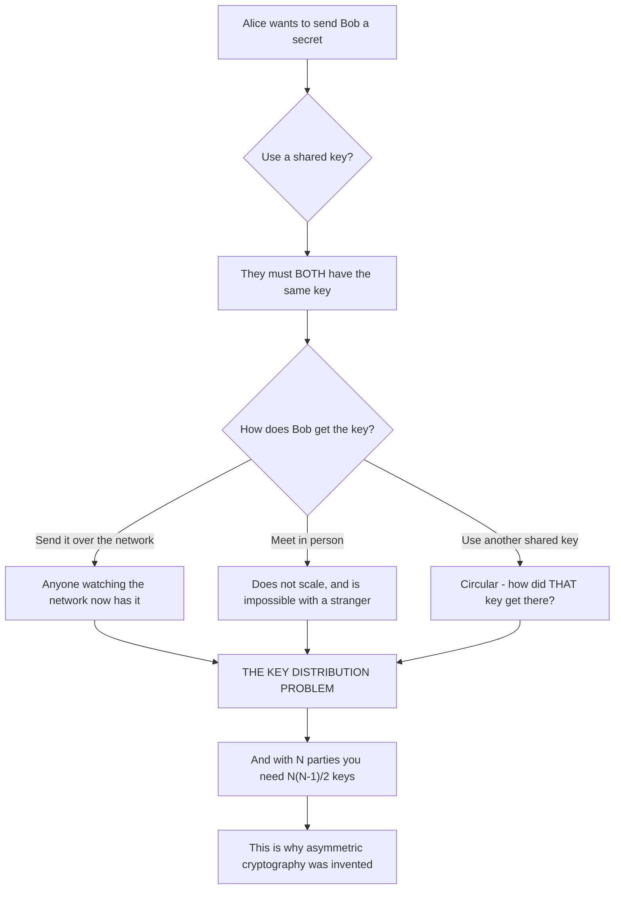
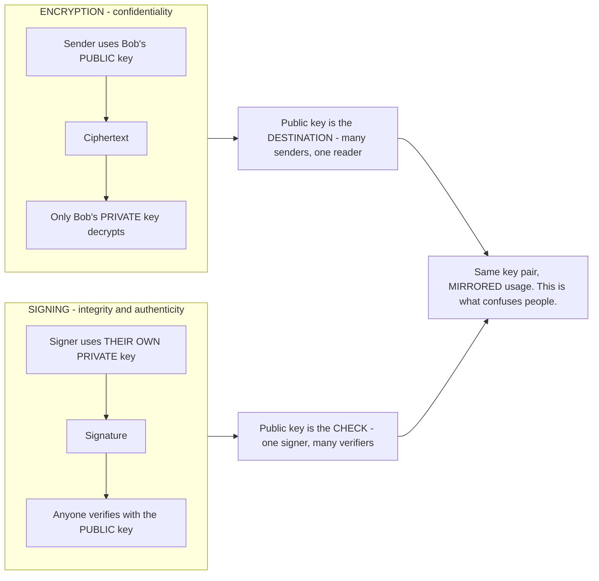
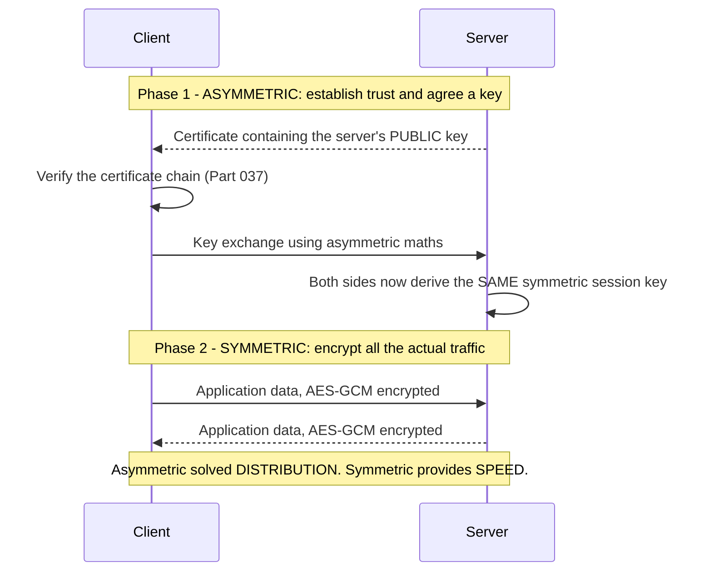
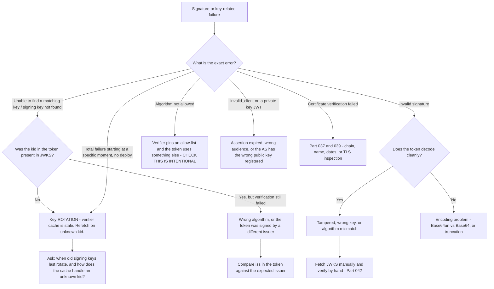

# Part 035 - Symmetric and Asymmetric Cryptography From Zero

> Section goal: Understand the two key arrangements well enough to explain why federation between mutually untrusting parties is possible at all. Every trust relationship in identity — TLS, JWT signing, SAML assertions, mutual TLS, client authentication — is built on the asymmetric idea, and knowing why makes the rest of the guide follow naturally.

Covers index item **035**. Maps to JD signals: *knowledge of encryption*, *basic security concepts*, *understanding of authentication and authorization concepts*, *self-starter on complex concepts*, and *promote best practices*.

---

## 1. Start From Zero: The Key Distribution Problem

Symmetric cryptography is ancient and obvious: both parties share one secret. Same key locks and unlocks.

It works perfectly — as long as you can get the key to the other party safely. And that is the entire problem.

> **Analogy.** A padlock that uses the same key to lock and unlock. Fine if you can hand the key over. Useless if you need to send a locked box to a stranger on another continent — how do you send them the key without someone copying it in transit?
>
> **Where it stops:** a physical key can be couriered under guard. A digital key copied in transit leaves no trace at all, so you never know it happened.

### 🔍 Plain-English deep-dive: why the scaling maths matters for identity

With symmetric keys, every pair of parties needs its own shared secret. For $N$ parties, that is $\frac{N(N-1)}{2}$ keys.

| Parties | Shared keys required |
|---|---|
| 2 | 1 |
| 10 | 45 |
| 100 | 4,950 |
| 1,000 | 499,500 |

Now consider a Customer Identity platform. One tenant issues tokens consumed by dozens of the customer's APIs, and federates upstream to Entra ID, Google, and several SAML providers. Symmetric keys would require a distinct shared secret for every pair, each distributed securely, each rotated on a coordinated schedule.

**With asymmetric cryptography, each party needs exactly one key pair, and publishes half of it.** A thousand parties need a thousand key pairs, not half a million shared secrets. The public half can be published openly — at a JWKS endpoint, in SAML metadata, in a TLS certificate.

**That is the reason federation works.** Not convenience — feasibility. This is worth being able to state in one sentence, because it explains JWKS, SAML metadata, and certificate chains all at once.

**Analogy:** everyone having a personal letterbox anyone can post into, versus every pair of people needing a private shared safe. **Where it stops:** a letterbox is physical and its location is obvious. Public key *distribution* still requires a trust mechanism — which is what PKI provides (Part 037).

---

## 2. Symmetric Cryptography

**One key.** The same value encrypts and decrypts, or signs and verifies.

| Property | Value |
|---|---|
| Keys | One, shared |
| Speed | **Fast** — suitable for bulk data |
| Key length | 128 or 256 bits is strong |
| Common algorithms | AES-GCM, ChaCha20-Poly1305 |
| Signing equivalent | HMAC (`HS256`) |
| Weakness | Key distribution, and every holder can both create and verify |

### Where symmetric cryptography is genuinely correct

| Use | Why symmetric is right |
|---|---|
| **TLS session traffic** | After the handshake, bulk data needs speed (Part 038) |
| **Encrypting data at rest** | One party owns both operations |
| **An app signing its own session cookie** | Signer and verifier are the same party |
| **Client secret** for client authentication | A shared secret between one client and one authorization server |

**Note the pattern:** symmetric works when there is **one party**, or **exactly two parties with an existing relationship**. It breaks down the moment a third party must verify without being able to forge.

### Modes and authenticated encryption

Encryption alone gives confidentiality but not integrity — an attacker can alter ciphertext, and a naive decryptor produces altered plaintext without noticing.

**Authenticated encryption** (AES-GCM, ChaCha20-Poly1305) combines both: it encrypts *and* produces an authentication tag, so tampering is detected on decryption.

**The practical rule to give a customer:** use an authenticated mode. If you see AES-CBC without a separate MAC in a customer's code, that is a finding worth raising — it is a classic source of padding-oracle vulnerabilities.

---

## 3. Asymmetric Cryptography

**Two mathematically related keys.** What one does, only the other can undo.

| | Public key | Private key |
|---|---|---|
| Distribution | Published openly | **Never leaves the owner** |
| Encryption | Encrypts | Decrypts |
| Signing | **Verifies** | **Signs** |
| If leaked | Harmless | **Catastrophic** |

### 🔍 Plain-English deep-dive: the mirror that confuses everyone

Encryption and signing use the same key pair in **opposite directions**, and this is the single most confusing thing about asymmetric cryptography.

| | Who uses the private key | Who uses the public key | How many of each |
|---|---|---|---|
| **Encryption** | The **recipient**, to decrypt | The **sender**, to encrypt | Many senders → one recipient |
| **Signing** | The **signer**, to sign | The **verifier**, to check | One signer → many verifiers |

**The way to keep it straight:** ask *"who is the only one who should be able to do this?"*

- Only Bob should **read** the message → Bob's private key decrypts → so the sender encrypts with Bob's **public** key.
- Only the issuer should **create** a valid token → the issuer's private key signs → so everyone verifies with the issuer's **public** key.

**The private key always performs the operation only one party is allowed to perform.** That single sentence resolves it every time.

**Why it matters in identity:** almost everything you support is the *signing* direction, not the encryption direction. JWT signing, SAML assertion signing, TLS certificate verification, private key JWT client authentication — all signing. So the pattern you will see constantly is **one private key, many public verifiers**, which is exactly why a JWKS endpoint publishes keys openly and why nobody worries about that.

**Analogy:** a wax seal versus a letterbox. A seal is one person stamping, many people checking. A letterbox is many people posting, one person opening. Same idea of asymmetry, opposite direction of flow. **Where it stops:** a seal can be stolen. A private key can also be stolen — which is why key rotation and protection dominate operational identity work.

### Algorithm families

| Family | Basis | Key size for ~128-bit security | JOSE names | Notes |
|---|---|---|---|---|
| **RSA** | Integer factorisation | 3072 bits | `RS256`, `PS256` | Widely supported, large keys and signatures |
| **Elliptic curve (ECDSA)** | Discrete log on a curve | 256 bits | `ES256`, `ES384` | Much smaller, increasingly preferred |
| **EdDSA** | Edwards curves | 256 bits | `EdDSA` | Modern, fast, fewer implementation pitfalls |

**The practical point:** a 256-bit elliptic-curve key gives comparable security to a 3072-bit RSA key. That is why `ES256` produces much smaller tokens, which matters when tokens travel in HTTP headers with size limits (Part 012).

---

## 4. Hybrid Cryptography — How They Are Actually Used Together

Asymmetric operations are **slow** — orders of magnitude slower than symmetric. So real systems use both.

**This is exactly what TLS does** (Part 038), and it is the standard pattern everywhere:

| System | Asymmetric part | Symmetric part |
|---|---|---|
| TLS | Certificate verification and key exchange | Bulk traffic encryption |
| JWE | Encrypting the content encryption key | Encrypting the payload |
| Encrypted email | Encrypting the message key | Encrypting the message |

**The one-line summary:** *asymmetric cryptography solves key distribution; symmetric cryptography does the actual work.*

---

## 5. Key Lifecycle

Keys are not permanent. Managing them is most of the operational work in identity.

| Stage | What happens | Where it appears in support |
|---|---|---|
| **Generation** | Create the pair with sufficient entropy | Weak randomness is a real historical vulnerability |
| **Distribution** | Publish the public half | JWKS, SAML metadata, TLS certificates |
| **Storage** | Protect the private half | HSMs, key vaults, never in a repository |
| **Use** | Sign, verify, encrypt, decrypt | Everyday operation |
| **Rotation** | Replace on a schedule or after compromise | **The most common cause of sudden outages** |
| **Revocation** | Declare a key no longer trusted | CRLs, OCSP (Part 037) |
| **Destruction** | Securely delete the private key | End of life |

### 🔍 Plain-English deep-dive: why rotation causes outages, and how the design avoids it

Rotation is the stage that generates tickets, and understanding the mechanism explains several Parts at once.

**The naive failure:** the issuer starts signing with a new key. A verifier that cached the old key set now sees a `kid` it does not recognise, cannot find a matching key, and rejects every token. **Every request fails simultaneously, with no code change.** This is the archetypal "nothing changed" outage (Part 009).

**The design that prevents it — three elements working together:**

| Element | Role |
|---|---|
| **`kid`** (key ID) in the token header | Tells the verifier *which* key signed this token |
| **JWKS endpoint publishing multiple keys** | The old and new keys coexist during an overlap period |
| **Cache invalidation on unknown `kid`** | The verifier refetches when it sees a `kid` it does not have |

With all three, rotation is invisible: the issuer publishes the new key alongside the old, begins signing with the new one, verifiers see an unknown `kid`, refetch, find it, and continue. The old key is removed only after every outstanding token signed with it has expired.

**Without the third element** — a verifier that caches by time-to-live only — rotation breaks everything until the cache expires. This is why Part 028's validation checklist insists on `kid`-miss refetch, and why Part 019 insists on caching JWKS but invalidating correctly.

**The support signature:** total failure, starting at a specific moment, "signing key not found" or "unable to find a matching key", no deployment, and it affects every request. Ask two questions: *"when did the tenant last rotate signing keys?"* and *"how does your JWKS cache handle an unknown `kid`?"*

**Analogy:** a building changing its locks. Done well, both old and new keys work for a month while everyone collects a new one. Done badly, the locks change at midnight and nobody can get in. **Where it stops:** people at a locked door phone someone. A verifier silently returns 401 to every user at once.

---

## 6. Where Each Appears in Identity

| Mechanism | Symmetric | Asymmetric | Notes |
|---|---|---|---|
| TLS handshake | — | ✅ | Certificate verification, key exchange |
| TLS session data | ✅ | — | AES-GCM |
| JWT signing (`HS256`) | ✅ | — | **Only within one party** |
| JWT signing (`RS256`, `ES256`) | — | ✅ | The correct federation choice |
| JWKS endpoint | — | ✅ | Publishes public keys |
| SAML assertion signing | — | ✅ | IdP private key, SP verifies |
| SAML assertion encryption | Both | Both | Hybrid, like TLS |
| Client secret | ✅ | — | Shared between one client and one AS |
| Private key JWT client auth | — | ✅ | **Stronger — the secret never travels** |
| Mutual TLS | — | ✅ | Client presents its own certificate |
| PKCE `code_challenge` | — | — | **Hashing, not encryption** (Part 034) |
| Password storage | — | — | **Hashing** (Part 036) |

**The last two rows are there deliberately.** PKCE and password storage are frequently misdescribed as encryption. Neither involves a key at all.

### Client secret versus private key JWT

This is a real recommendation you can make.

| | Client secret | Private key JWT |
|---|---|---|
| What the client sends | **The secret itself** | A short-lived signed assertion |
| If intercepted | The secret is compromised | The assertion is single-use and expiring |
| Where the secret lives | Both the client **and** the authorization server | **Only the client** |
| If the AS is breached | Every client secret is exposed | Private keys are unaffected |
| Rotation | Coordinated between two parties | Client publishes a new public key |

**Private key JWT is strictly stronger**, because the credential never travels and the authorization server never holds it. For customers with higher security requirements, or in regulated sectors, this is worth proposing.

---

## 7. Failure Modes

| Failure mode | What it looks like | Consequence | Correction |
|---|---|---|---|
| **Private key in a repository** | Key committed to source control | **Catastrophic — assume compromise** | Rotate immediately; history deletion is not remediation (Part 007) |
| **Private key shared "for debugging"** | Key attached to a ticket | Same | Never; treat as an incident (Part 006) |
| **`HS256` across parties** | Shared secret with verifiers | Every verifier can forge | Asymmetric (Part 034) |
| **JWKS cached by TTL only** | Total failure after rotation | Mass 401s, no code change | Refetch on unknown `kid` |
| **Old key removed too early** | Outstanding tokens rejected | Partial outage until expiry | Overlap until the last token expires |
| **Unauthenticated encryption mode** | AES-CBC with no MAC | Tampering undetected; padding oracle | Use AES-GCM or equivalent |
| **RSA key too small** | 1024-bit key | Below current guidance | 2048 minimum; 3072 preferred |
| **Reusing one key for everything** | Same pair signs and encrypts | Cross-protocol attack surface | Separate keys per purpose |
| **Confusing the directions** | "Encrypt with the private key" | Wrong mental model, wrong advice | Private key = the operation only one party may perform |
| **"PKCE encrypts the verifier"** | Misdescribing a hash | Wrong explanation to a customer | PKCE hashes; no key involved |
| **Weak randomness** | Predictable key or nonce | Key recoverable | Use the platform CSPRNG |

---

## 8. Troubleshooting Decision Tree: Key-Related Failures

### Worked example

*"At 09:14 this morning every API call started returning 401. We deployed nothing. It's still failing."*

1. **Total, simultaneous, no deployment** → an external change. Candidates: certificate expiry, secret expiry, **key rotation**, or a platform incident.
2. **Ask for the exact validation error.** "Unable to find a matching key for kid `abc123`."
3. **That is decisive.** The verifier has a token signed with a key it does not hold.
4. **Fetch the JWKS endpoint manually.** `abc123` **is** present.
5. **So the key exists and the verifier cannot see it** → the verifier's cache is stale.
6. **Ask how their JWKS cache is configured.** Answer: a 24-hour TTL, with no refetch on unknown `kid`.
7. **Root cause:** the tenant rotated signing keys at 09:14. The new key was published immediately, but their verifier will not refetch until its TTL expires — so every token signed with the new key fails until then.
8. **Immediate mitigation:** restart the service to clear the cache. That restores service now.
9. **Proper fix:** configure the JWKS client to refetch on an unknown `kid`, with a rate limit so a flood of bad tokens cannot cause a fetch storm (Part 019). Most JWKS libraries support this directly.
10. **The concept to teach:** rotation is designed to be invisible, and it depends on the verifier holding up its half — `kid`-based lookup plus refetch on miss. Their cache was TTL-only, which is the one configuration rotation breaks.
11. **Prevention:** an alert on JWKS fetch failures, and a note in their runbook that key rotation is expected and should be transparent.

That answer restores service, explains the mechanism, fixes the cause, and teaches why the design is the way it is.

---

## 9. Lab: Generate, Sign, Verify, and Rotate

**Purpose.** Perform every stage of the key lifecycle yourself, including a rotation that breaks a verifier and then does not.

**Prerequisites.** Part 007's lab — OpenSSL, Node. Part 034's lab. **All local; keys generated by you.**

**Steps.**

1. Create `okta-prep/labs/035-crypto-keys/`.
2. **Symmetric round trip.** Encrypt a short message with AES-GCM and a generated key. Decrypt it. Then **alter one byte of the ciphertext** and decrypt again. **Record the authentication failure** — that is authenticated encryption working.
3. **Contrast with an unauthenticated mode.** Repeat with AES-CBC and no MAC, altering one byte. **Record that decryption produces corrupted plaintext without any error.** Write one line on why that is dangerous.
4. **Generate an RSA pair.** `openssl genpkey` for a 2048-bit key, then extract the public key. Record both file sizes. **Note which file must never leave the machine.**
5. **Generate an EC pair.** Do the same with P-256. **Compare key and signature sizes against RSA** and record the ratio.
6. **Sign and verify.** Sign a message with each private key; verify with each public key. Then verify with the *wrong* public key and record the failure.
7. **Tamper detection.** Alter one character of the signed message and verify. Record the failure.
8. **The mirror.** Encrypt a short message with the RSA **public** key and decrypt with the **private** key. Then write, in your own words, why signing uses the pair in the opposite direction.
9. **Build a JWKS.** Convert your public keys into JWK format with a `kid` for each, and assemble a two-key JWKS document. Serve it from a local endpoint.
10. **Sign a JWT.** Using your private key, sign a JWT with the matching `kid` in the header. Verify it against your local JWKS. Record success.
11. **Rotate — the important step.**
    - a. Generate a **third** key. Add it to the JWKS. Sign a new token with it.
    - b. Build a verifier that caches JWKS with a **TTL only**, prime its cache before adding the third key, then present the new token. **Record the "no matching key" failure.**
    - c. Add refetch-on-unknown-`kid` to the verifier. Repeat. **Record that it now succeeds.**
    **This before-and-after is the most valuable artifact in the lab.**
12. **Key removal.** Remove the oldest key from the JWKS while a token signed with it is still valid. Record the failure. Write one line on the correct overlap policy.
13. **Reference + catalog.** Write `key-lifecycle.md` — the seven stages, what you did at each, and the two rotation failure modes with their exact errors. Add rows to the failure catalog. Complete `MANIFEST.md`.

**Expected evidence.** An AES-GCM tamper detection, an AES-CBC silent corruption contrast, RSA and EC key pairs with a size comparison, signature verification successes and three distinct failures, a hand-built JWKS, a signed and verified JWT, the TTL-only rotation failure and the `kid`-refetch fix, and an early-removal failure.

**Validation rubric.**

| Check | Pass condition |
|---|---|
| Authenticated encryption | Tampering detected with an explicit error |
| Unauthenticated contrast | Corruption produced silently, with no error |
| Size comparison | RSA versus EC key and signature sizes recorded |
| Three failure types | Wrong key, tampered message, and unknown `kid` all reproduced |
| JWKS hand-built | Valid JWK format, correct `kid` values, served locally |
| Rotation broken then fixed | Both states recorded with exact errors |
| Early removal | Failure reproduced, correct overlap policy written |
| Private keys protected | Stored git-ignored; deleted at the end |

**Cleanup and privacy.** All keys are generated locally by you and are **real private keys** — store them in the git-ignored `secrets/` folder and **delete them when the lab is complete**. Never use a key from any real system, never commit one, and never attach one to anything. Use fake payloads throughout.

---

## 10. JD Mapping

| Supplied JD signal | How this Part supports it |
|---|---|
| **Knowledge of encryption** | Symmetric, asymmetric, hybrid, and the key lifecycle |
| Basic security concepts | Key distribution, authenticated encryption, key protection |
| Understanding of authentication and authorization concepts | Why asymmetric signing is what makes federation possible |
| Self-starter on complex concepts | §9 builds a JWKS and a verifier from first principles |
| **Promote best practices** | Authenticated modes, private key JWT over client secret, `kid`-based rotation |
| Strong analytical and problem-solving skills | §8's tree routes each signature error to its cause |
| Knowledge of common architectures | §4's hybrid pattern is how TLS, JWE, and encrypted SAML all work |

---

## 11. Candidate Honesty Note

- **Production transfer:** TLS/SSL and certificate troubleshooting are on your CV. The hybrid model in §4 is what you have already been debugging, now named explicitly.
- **The strongest thing you can say:** *"Asymmetric cryptography exists to solve key distribution. With shared secrets you need a key per pair — a thousand parties means half a million secrets. With key pairs each party has one, publishes half of it, and federation becomes feasible. That's why JWKS endpoints publish keys openly and why nobody worries about that."*
- **A second strong point, and it is a very common real ticket:** *"Total simultaneous 401s with no deployment is usually key rotation meeting a verifier that caches JWKS by TTL only. Rotation is designed to be invisible — `kid` in the header, overlapping keys published, refetch on an unknown `kid`. A TTL-only cache is the one configuration that breaks it, and the immediate mitigation is a restart while they fix the cache properly."*
- **A third, which is a real recommendation:** *"Private key JWT is strictly stronger than a client secret, because the credential never travels and the authorization server never holds it. Worth proposing for customers with higher security requirements."*
- **The mirror is worth being able to state cleanly:** *"The private key always performs the operation only one party is allowed to perform. For encryption that's reading, so the recipient's private key decrypts. For signing that's creating, so the issuer's private key signs. Same pair, opposite direction."*
- **Do not claim cryptographic engineering.** You choose, configure, and validate. You do not implement primitives, and saying so plainly is more credible than the alternative.

---

## 12. Official Source Anchors

Accessed **26 August 2026**.

| Source | What it defines |
|---|---|
| NIST SP 800-57 | Key management lifecycle and key-length guidance |
| NIST FIPS 197 (AES) and SP 800-38D (GCM) | Symmetric encryption and authenticated modes |
| IETF RFC 8017 (RSA) and FIPS 186 (ECDSA) | The asymmetric algorithm families in §3 |
| IETF RFC 8032 (EdDSA) | Modern signature scheme |
| IETF RFC 7517 (JWK) and RFC 7518 (JWA) | JWK format, `kid`, and JOSE algorithm identifiers |
| IETF RFC 8446 (TLS 1.3) | The hybrid pattern in §4 |
| IETF RFC 7523 | Private key JWT client authentication in §6 |
| OWASP — cryptographic storage cheat sheet | Practical guidance on modes and key handling |
| OpenSSL documentation | The commands used in §9 |

**Revalidate after 26 August 2026:** key-length and algorithm recommendations move over time. The structural distinctions do not.

---

## ⭐ Likely Interview Questions for This Section

### Q1. "Why does asymmetric cryptography exist when symmetric is faster?"
> *Model answer:* "Key distribution. Symmetric works perfectly as long as both parties already share a secret, and the problem is getting it to them — send it over the network and anyone watching has it, and you can't meet a stranger in person. It also scales terribly: every *pair* of parties needs its own key, so a thousand parties need about half a million shared secrets, each distributed securely and rotated on a coordinated schedule. Asymmetric cryptography means each party has exactly one key pair and publishes half of it openly. A thousand parties need a thousand key pairs. That's not a convenience — it's what makes federation feasible at all, and it's why a JWKS endpoint publishes signing keys publicly and nobody worries about it. In practice systems use both: asymmetric to solve distribution, symmetric to do the actual work, because asymmetric operations are orders of magnitude slower."

### Q2. "Which key encrypts and which key signs?"
> *Model answer:* "They're mirrored, which is what confuses people. For encryption the sender uses the *recipient's public* key and only the recipient's private key decrypts — many senders, one reader. For signing the signer uses *their own private* key and anyone verifies with the public key — one signer, many verifiers. The way I keep it straight is: the private key always performs the operation that only one party is allowed to perform. Only Bob should read, so Bob's private key decrypts. Only the issuer should create valid tokens, so the issuer's private key signs. In identity work it's almost always the signing direction — JWT signing, SAML assertions, TLS certificates, private key JWT client auth — so the pattern you see constantly is one private key and many public verifiers."

### Q3. "Every API call started returning 401 at once, with no deployment. Where do you look?"
> *Model answer:* "Something external that changes on its own — a certificate expiring, a secret expiring, a platform incident, or signing key rotation. I'd get the exact validation error, because it discriminates immediately. 'Unable to find a matching key for kid X' means the verifier has a token signed by a key it doesn't hold. Then I'd fetch the JWKS endpoint manually — if the key *is* there, the key exists and the verifier can't see it, so the cache is stale. Then: how is their JWKS cache configured? If it's a time-to-live only, with no refetch when it encounters an unknown `kid`, that's the cause. Rotation is designed to be invisible — the issuer publishes both keys, the token header names which one, and the verifier refetches on a miss. A TTL-only cache is the one configuration that breaks it. Immediate mitigation is restarting to clear the cache; the fix is refetch-on-unknown-`kid` with a rate limit."

### Q4. "What's the difference between a client secret and private key JWT?"
> *Model answer:* "With a client secret, the client sends the actual secret to the authorization server to authenticate, and both parties hold it. With private key JWT, the client signs a short-lived assertion with its private key and sends *that* — the credential itself never travels, and the authorization server only ever holds the public key. Private key JWT is strictly stronger for three reasons: an intercepted assertion is single-use and expiring rather than a permanent credential; a breach of the authorization server doesn't expose client credentials because it never had them; and rotation is unilateral — the client publishes a new public key rather than coordinating a shared secret change with another party. It's more setup, so it's not always the right trade-off, but for customers with higher security requirements or in regulated sectors it's worth proposing proactively."

### Q5. "Why does key rotation cause outages if it's designed to be safe?"
> *Model answer:* "Because it's a two-sided design and the verifier has to hold up its half. The issuer's half is: publish the new key alongside the old with an overlap period, put a `kid` in every token header naming which key signed it, and don't remove the old key until every token signed with it has expired. The verifier's half is: look the key up by `kid`, and if the `kid` isn't in the cached key set, refetch. If a verifier only caches by time-to-live, then the moment the issuer starts signing with the new key, every token fails until that TTL expires — total, simultaneous, no code change. The other failure is the issuer removing the old key too early, which rejects outstanding tokens that were validly issued. Both are avoidable and both produce the same 'nothing changed' signature, so I'd ask when keys last rotated on any sudden mass-401."

### Q6. "What's authenticated encryption and why does it matter?"
> *Model answer:* "Encryption alone gives confidentiality but not integrity — an attacker can modify the ciphertext, and a naive decryptor produces altered plaintext without noticing anything is wrong. Authenticated encryption modes like AES-GCM or ChaCha20-Poly1305 encrypt *and* produce an authentication tag, so any tampering is detected at decryption and you get an explicit failure instead of silently corrupted data. It matters because unauthenticated modes have a long history of exploitable weaknesses, padding oracles being the classic. So if I see AES-CBC without a separate MAC in a customer's code, that's a finding worth raising even if it isn't what they contacted me about. I demonstrated the difference in a lab: altering one byte of AES-GCM ciphertext gives an explicit authentication failure, and the same alteration with CBC and no MAC just produces garbage plaintext with no error at all."

### Q7. "Why are elliptic curve keys smaller than RSA keys?"
> *Model answer:* "Different underlying maths with different difficulty scaling. RSA security rests on integer factorisation, and elliptic curve security rests on the discrete logarithm problem on a curve, which the best known attacks handle far less efficiently. So a 256-bit EC key gives roughly comparable security to a 3072-bit RSA key. That matters practically in identity because signature size follows key size, and tokens travel in HTTP headers where there are real size limits — a token with an `ES256` signature is meaningfully smaller than the same token with `RS256`. The trade-off is compatibility: RSA is supported everywhere, and some older systems or hardware won't accept EC. So my advice would be `ES256` where the whole chain supports it, and to check that before recommending a change rather than after."

### Q8. "A customer accidentally committed a private key. What do you tell them?"
> *Model answer:* "Treat it as compromised and rotate immediately — that's the only remediation, and I'd say it plainly rather than softening it. Deleting the commit doesn't help, because git history is almost always already copied: a remote, a fork, a CI cache, a code-scanning service, someone's clone. So the key must be assumed public. Concretely: generate a new key pair, publish the new public key alongside the old at whatever endpoint or metadata the relying parties use, switch signing to the new key, and remove the old one once outstanding tokens signed with it have expired — the same overlap discipline as a planned rotation. Then rewrite history if they want to, but as tidy-up rather than as a fix. I'd also ask how the key got into the repository, because a `.gitignore` entry and a pre-commit scan prevent the next one — and if it's a signing key, whether anything signed with it in the exposure window needs to be treated as suspect."

---

## 🧠 30-Second Memory Hooks

- **Symmetric = one shared key.** Fast. Breaks on **key distribution** and scales as $N(N-1)/2$.
- **Asymmetric = a key pair.** Solves distribution. **That is why federation is possible at all.**
- **The private key always performs the operation only ONE party may perform.** Reading → decrypt. Creating → sign.
- **Encryption:** many senders → one reader. **Signing:** one signer → many verifiers. Same pair, mirrored.
- **Hybrid:** asymmetric solves distribution, symmetric does the work. TLS, JWE, encrypted SAML — all the same shape.
- **`ES256` ≈ `RS256` security at a fraction of the size.** Matters for header size limits.
- **Rotation is two-sided:** issuer publishes `kid` + overlap; verifier looks up by `kid` and **refetches on a miss**.
- **TTL-only JWKS cache = the one configuration rotation breaks.** Total simultaneous 401s, no deploy.
- **Removing the old key too early rejects valid outstanding tokens.**
- **Authenticated encryption (GCM) detects tampering. CBC without a MAC corrupts silently.**
- **Private key JWT > client secret** — the credential never travels and the AS never holds it.
- **A committed private key is public. Rotate. History deletion is not remediation.**

---

## ✅ Completion Checklist

- [ ] **Knowledge:** I can explain why asymmetric exists, state the mirror rule, and describe both halves of safe key rotation.
- [ ] **Lab artifact:** `035-crypto-keys/` contains authenticated versus unauthenticated encryption, RSA and EC pairs with sizes, three distinct verification failures, a hand-built JWKS, and the rotation broken-then-fixed pair.
- [ ] **Spoken:** I can deliver the mass-401 rotation diagnosis, including the immediate mitigation, in under 90 seconds.
- [ ] **Honesty check:** every key was generated by me, kept git-ignored, and deleted; no real system's key was used or handled.
- [ ] **Source check:** I have read RFC 7517's `kid` definition and NIST SP 800-57's rotation guidance myself.

---

*Next suggested section:* **[Part 036 - Hashing, HMAC, Salt, and Password Storage](Part-036-hashing-hmac-salt-and-password-storage.md)** — the one place in identity where you deliberately make an operation slow, and why every parameter of that choice matters.
