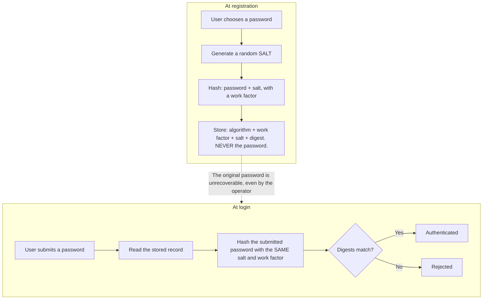
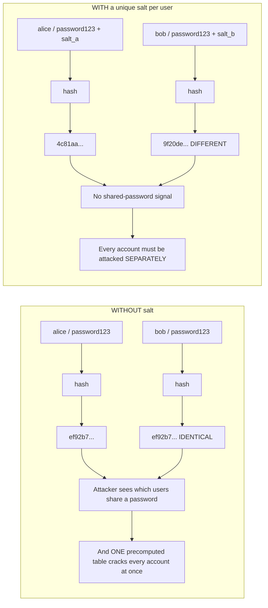
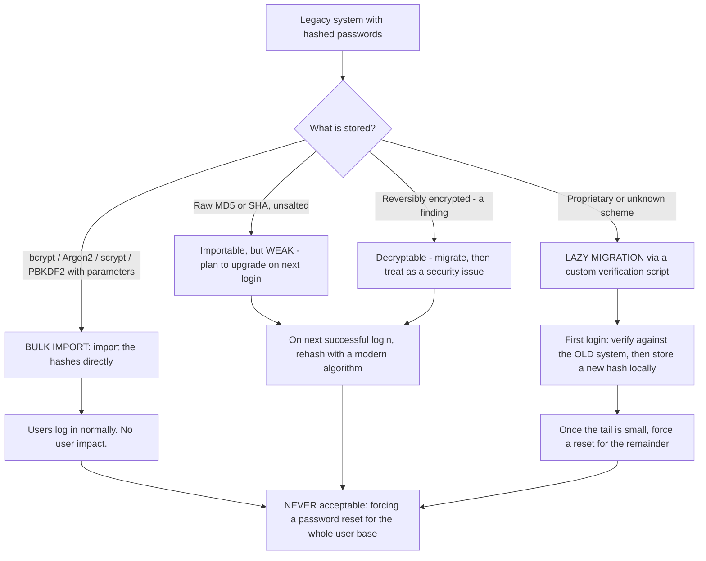
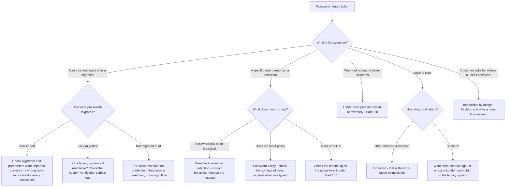

# Part 036 - Hashing, HMAC, Salt, and Password Storage

> Section goal: Understand the one place in identity where you deliberately make an operation slow, and why every parameter of that choice matters. Password storage is also where customer migrations, breached-password checks, and legacy-system integration all meet — so this Part underpins a whole family of Customer Identity tickets.

Covers index item **036**. Maps to JD signals: *knowledge of encryption*, *basic security concepts*, *understanding of authentication and authorization concepts*, *promote best practices*, and *business and technical analysis skills*.

---

## 1. Start From Zero: Why Passwords Are Not Stored

A system that stores passwords is one breach away from handing every user's credential to an attacker — and because people reuse passwords, that breach damages every *other* service those users hold accounts with.

So passwords are never stored. Instead:



> **Analogy.** A left-luggage office that never keeps your key. It records the key's precise shape; when you return, it measures your key and compares. It can confirm a match and can never open the locker without you.
>
> **Where it stops:** a physical shape can be reproduced by a locksmith given enough effort. A password hash cannot be reversed at all — the only attack is guessing candidates and hashing each one, which is exactly why the work factor exists.

### 🔍 Plain-English deep-dive: why a general-purpose hash is the wrong tool

SHA-256 is an excellent hash. It is a **terrible** password hash, and the reason is counterintuitive: **it is too fast.**

SHA-256 is designed to hash large volumes quickly. Modern hardware computes billions of SHA-256 digests per second. So an attacker who steals a database of SHA-256 password hashes can test billions of candidate passwords per second — and most human passwords are drawn from a small, predictable space.

Password hashing functions are built with the opposite goal: **deliberately slow, and deliberately expensive in memory.**

| Property | SHA-256 | bcrypt / scrypt / Argon2 |
|---|---|---|
| Speed | As fast as possible | **Deliberately slow, tunable** |
| Memory use | Trivial | **High** (scrypt, Argon2) — resists GPU and ASIC attacks |
| Salt | You must add it yourself | **Built in** |
| Work factor | None | **Built in and adjustable** |
| Designed for | Integrity, fingerprints | **Password verification** |

**The design goal:** verification should take roughly 100–250 ms for a legitimate login, which no user notices, and which reduces an attacker from billions of guesses per second to a few per second per core.

**Memory-hardness is the newer and more important property.** GPUs and purpose-built hardware are enormously faster than CPUs at simple repeated computation, but they have limited memory per core. An algorithm that requires substantial memory per hash removes most of that advantage — which is why Argon2 is preferred over bcrypt for new systems.

**Analogy:** a lock that takes a quarter of a second to open. Imperceptible if you have the key; ruinous if you are trying every combination. **Where it stops:** a physical lock cannot be attacked in parallel by ten thousand machines. Password hashing is designed on the assumption that it will be.

---

## 2. Salt

A **salt** is a random value, unique per password, stored alongside the digest.



| Salt does | Salt does not |
|---|---|
| Make identical passwords produce different digests | Make a weak password strong |
| Defeat precomputed tables (rainbow tables) | Prevent guessing a single account |
| Force per-account attack effort | Need to be secret |
| Hide which users share a password | Replace a work factor |

**Salts are not secret.** They are stored in plaintext beside the digest, and that is fine — their job is uniqueness, not confidentiality. Customers sometimes ask how to protect their salts; the accurate answer is that they do not need protecting, and if they want a secret component that is a **pepper** (§3).

### The encoded hash string

Modern password hashes store everything needed for verification in one self-describing string:

```
$2b$12$LQv3c1yqBWVHxkd0LHAkCOYz6TtxMQJqhN8/LewKyDvXk1oRVJ7Vy
 │   │  └──────────── salt ───────────┘└─────── digest ────────┘
 │   └── cost / work factor (12)
 └── algorithm identifier (2b = bcrypt)
```

**This is why migration is possible at all** (§5). The stored value declares its own algorithm and parameters, so a new system can verify an old hash without knowing anything in advance.

| Prefix | Algorithm |
|---|---|
| `$2a$`, `$2b$`, `$2y$` | bcrypt |
| `$argon2id$` | Argon2id — current recommendation |
| `$scrypt$` | scrypt |
| `$pbkdf2-sha256$` | PBKDF2 |
| No prefix, 32 or 64 hex characters | **Raw MD5 or SHA — a finding** |

---

## 3. Pepper

A **pepper** is a secret value added to every hash, stored **outside the database** — in application configuration, a key vault, or an HSM.

| | Salt | Pepper |
|---|---|---|
| Unique per password? | ✅ Yes | ❌ No — one value for all |
| Secret? | ❌ No | ✅ **Yes** |
| Stored where? | With the digest | **Separately from the database** |
| Protects against | Precomputed tables, shared-password detection | **Database-only breach** |

**The threat it addresses:** an attacker who steals the database but *not* the application secrets cannot attack the hashes at all, because they are missing an input.

**The operational cost:** rotating a pepper requires rehashing every password, which can only happen at each user's next login — so it is a long transition. And losing the pepper makes every password unverifiable.

**Honest positioning for a customer:** a pepper is defence in depth, not a substitute for a proper algorithm and work factor. Recommend it only after those are right.

---

## 4. HMAC — Related but Different

**HMAC** (Hash-based Message Authentication Code) uses a hash plus a secret key to produce a value that proves both **integrity** and **authenticity**.

| | Plain hash | HMAC |
|---|---|---|
| Key | None | **Shared secret** |
| Anyone can compute it? | ✅ Yes | ❌ Only key holders |
| Proves | Content unchanged | Content unchanged **and** from a key holder |
| Use | Fingerprints, checksums | `HS256` signing, **webhook signatures** |

### 🔍 Plain-English deep-dive: why a plain hash cannot authenticate a webhook

From Part 020: a webhook receiver must verify that an event genuinely came from the provider.

Suppose the provider sent `SHA256(body)` alongside the body. An attacker forging an event simply computes `SHA256(their_own_body)` too — the hash function is public, so anyone can produce a valid-looking digest. It proves nothing about origin.

**HMAC fixes this by requiring a secret**: `HMAC-SHA256(secret, body)`. An attacker without the secret cannot produce a matching value, no matter what body they craft.

Two implementation requirements follow, and both were Part 020's classic bugs:

1. **Compute over the raw bytes.** Parsing and re-serialising JSON changes key order and whitespace, so the HMAC is computed over different bytes and can never match.
2. **Compare in constant time.** A normal string comparison exits at the first differing byte, and the timing difference leaks how many bytes matched — allowing an attacker to discover a valid signature byte by byte. Use the platform's constant-time comparison.

**Analogy:** a tamper-evident seal anyone can buy versus one bearing a unique crest only you own. Both show tampering; only one proves who sealed it. **Where it stops:** a physical crest is hard to copy. An HMAC secret is copyable the instant it leaks — so it is rotated, and it is never put in client-side code.

---

## 5. Password Migration

This is the highest-value practical topic in the Part, because migrating users onto a Customer Identity platform is a common project and password handling is its hardest constraint.

**The constraint:** you cannot recover plaintext passwords from the old system, because it did the right thing and only stored hashes.



| Strategy | How | When | Trade-off |
|---|---|---|---|
| **Bulk import** | Import hashes with their algorithm and parameters | The platform supports that algorithm | Cleanest — zero user impact |
| **Lazy migration** | On first login, verify against the legacy store, then store a modern hash | Unsupported or proprietary hashing | Needs the legacy system online during the transition |
| **Rehash on login** | Verify with the old parameters, immediately rehash with new ones | Upgrading a weak algorithm or work factor | Gradual; a tail remains |
| **Forced reset** | Everyone resets | **Last resort only** | Severe user impact and support volume |

### 🔍 Plain-English deep-dive: why a forced reset is the wrong answer, and what to say

Customers often propose "we'll just make everyone reset their password." It sounds simple. It is usually the worst available option, and being able to explain why is a genuinely valuable consultative contribution.

| Consequence | Effect |
|---|---|
| Conversion loss | A meaningful share of users never complete a reset and are lost permanently |
| Support volume | A reset campaign generates a spike of tickets for the customer's own helpdesk |
| Deliverability risk | A mass email campaign can trigger spam filtering, so many users never receive it |
| Phishing resemblance | "Reset your password" mail arriving unexpectedly is exactly what a phishing campaign looks like — users are trained to distrust it |
| Account recovery load | Users who have lost access to their registration email are stranded |

**The better conversation:** ask what is actually stored. Most legacy systems use bcrypt or PBKDF2 with recorded parameters, and those import directly. If the scheme is proprietary, lazy migration keeps the legacy system available during a transition and moves users invisibly as they log in. A forced reset is reserved for the residual tail — and even then, only after the migrated majority is safe.

**The exception worth naming honestly:** if the legacy hashes were compromised, or the scheme is so weak that it should be treated as compromised, a forced reset for the affected population is the correct answer. That is a different decision, made for a different reason, and framing it as a security response rather than a migration convenience matters.

**Analogy:** rekeying a building. Re-issuing every tenant's key because it is administratively simpler will lose you tenants. Doing it because the master key was stolen is correct. **Where it stops:** a tenant who loses a key can be identified in person. An online user who abandons a reset simply disappears, and you never learn why.

---

## 6. Breached-Password Detection

Customer Identity platforms typically check whether a password appears in known breach corpora.

| Approach | How it works | Privacy property |
|---|---|---|
| **Local corpus** | Compare against a stored breach dataset | Nothing leaves the system |
| **k-anonymity range query** | Send the **first five hex characters** of the SHA-1 digest; receive all matching suffixes; compare locally | The full digest is never transmitted |

**The k-anonymity model is worth understanding**, because customers ask whether it sends passwords anywhere. It does not: the client sends a five-character prefix that matches hundreds of digests, receives them all, and does the actual comparison locally. The service learns only the prefix, which is far too broad to identify a password.

**The support angle:** breached-password blocking is a common source of "a legitimate user cannot sign up or reset" tickets. The user's chosen password appears in a breach corpus, which is correct behavior and unhelpful messaging. The fix is usually clearer wording and guidance, not disabling the control (Part 108).

---

## 7. Failure Modes

| Failure mode | What it looks like | Consequence | Correction |
|---|---|---|---|
| **Plaintext passwords** | Recoverable in the database | Catastrophic on breach | Hash with a password hashing function |
| **Encrypted, not hashed** | Reversible storage | Key compromise exposes everything | Hash — you never need the original |
| **Fast general hash** | Raw MD5, SHA-1, or SHA-256 | Billions of guesses per second | bcrypt, scrypt, or Argon2 |
| **No salt** | Identical passwords, identical digests | Rainbow tables; shared-password signal | Unique random salt per password |
| **Reused salt** | One salt for all users | Same effect as no salt | Per-password randomness |
| **Work factor never raised** | Cost 8 from a decade ago | Now cheap to attack | Raise it; rehash on login |
| **Plain hash as a signature** | `SHA256(body)` on a webhook | **Anyone can forge it** | HMAC with a secret |
| **HMAC over parsed JSON** | Signature never validates | Blocked integration | Raw bytes (Part 020) |
| **Non-constant-time compare** | No symptom | Timing side channel | Platform constant-time compare |
| **Forced reset for migration** | Mass reset campaign | Conversion loss, ticket spike, phishing resemblance | Bulk import or lazy migration |
| **Losing the pepper** | All passwords unverifiable | Total lockout | Treat as a critical secret with recovery |
| **Disabling breach detection** | Control turned off after complaints | Weak passwords accepted | Improve the messaging instead |

---

## 8. Troubleshooting Decision Tree: Password-Related Tickets



### Worked example

*"We migrated 400,000 users last night. About 15% can't log in. The rest are fine."*

1. **A partial failure is a cohort signal** (Part 009). Establish what the failing 15% share.
2. **Ask how migration was done.** Bulk import of bcrypt hashes.
3. **Ask what the failing users have in common.** After checking, the customer reports they are all older accounts.
4. **Hypothesis:** the legacy system changed its hashing at some point, so older records use a different algorithm or work factor from newer ones.
5. **Ask them to inspect a sample of failing and working stored hashes.** Failing records begin `$2a$08$`; working records begin `$2b$12$`.
6. **Two differences:** a different bcrypt variant identifier and a different cost factor. If the import normalised or dropped either, verification fails for those records.
7. **Confirm** by checking whether the imported records retained their original prefix and cost, or whether the import assumed a single set of parameters for all rows.
8. **Fix:** re-import the affected cohort preserving each record's own algorithm identifier and cost. The hash string is self-describing precisely so that mixed parameters can coexist.
9. **The concept to teach:** a stored password hash carries its own algorithm and work factor. An import must preserve them per record, never apply one assumed value to the whole set.
10. **Immediate mitigation for affected users:** a password reset flow — but for 60,000 users, not 400,000, and only as a fallback while the re-import runs.
11. **Prevention:** before any future migration, sample the distribution of hash prefixes to discover how many distinct schemes exist.

That answer turns a vague partial failure into a precise cause via a cohort question and one sample comparison.

---

## 9. Lab: Hash, Salt, Attack, and Migrate

**Purpose.** Observe why work factors and salts matter by measuring them, and rehearse a migration.

**Prerequisites.** Part 007's lab — Node or Python with a bcrypt/Argon2 library. **All local; invented passwords only.**

**Steps.**

1. Create `okta-prep/labs/036-passwords/`.
2. **Speed comparison.** Hash the string `correcthorse` 1,000 times with SHA-256 and time it. Then hash it **10** times with bcrypt at cost 12 and time it. **Record both, and calculate the per-hash ratio.** That number is the entire argument for password hashing functions.
3. **Work factor scaling.** Hash with bcrypt at costs 8, 10, 12, and 14. Record the time for each. **Note that each increment roughly doubles the cost** — and identify which value lands nearest 250 ms on your machine.
4. **Salt demonstration.** Hash the same password twice with bcrypt, without specifying a salt. **Record that the two digests differ** because a fresh salt is generated each time. Then hash the same password with the *same* explicit salt and record that the digests match.
5. **Rainbow table simulation.** Build a small dictionary of 1,000 common passwords. Precompute SHA-256 digests for all of them. Then take an *unsalted* SHA-256 digest of one of those passwords and look it up — **record how instant the reversal is**. Then salt it and confirm the table is useless. **This is the salt argument, demonstrated.**
6. **Encoded hash anatomy.** Produce a bcrypt hash and an Argon2 hash. **Annotate every field of each string** — algorithm, parameters, salt, digest. Save as `hash-anatomy.md`.
7. **Verification.** Write a verifier that reads the algorithm and parameters *from the stored string* and verifies correctly, without them being hard-coded. Test it against both bcrypt and Argon2 records in the same store. **This is what a correct migration import must do.**
8. **Rehash on login.** Extend it: if the stored cost is below your target, verify with the old cost and then transparently store a new hash at the target cost. Record before and after.
9. **HMAC.** Compute `SHA256(body)` and `HMAC-SHA256(secret, body)` for the same body. Then, **without the secret**, forge a valid plain-hash value for a different body — and record that you cannot do the same for the HMAC. Use a constant-time comparison and note why.
10. **Migration rehearsal.** Create a synthetic "legacy" store of 100 records with **mixed** prefixes — some `$2a$08$`, some `$2b$12$`, some raw SHA-256. Write an import that preserves each record's own parameters, and a naive one that assumes a single scheme. **Record the failure rate of the naive version.** This reproduces §8's worked example.
11. **Reference + catalog.** Write `password-storage.md` — the algorithm comparison, the migration strategy table, and your measured timings. Add rows to the failure catalog. Complete `MANIFEST.md`.

**Expected evidence.** A measured speed ratio, a work-factor timing table, salt demonstrations both ways, a rainbow-table reversal and its defeat, annotated hash anatomies, a parameter-reading verifier, a rehash-on-login demonstration, an HMAC forgery contrast, and a mixed-scheme migration with a measured naive failure rate.

**Validation rubric.**

| Check | Pass condition |
|---|---|
| Ratio measured | An actual number, not an estimate |
| Work factors timed | Four costs, with the doubling visible |
| Salt shown both ways | Same password differing, and same salt matching |
| Rainbow reversal | Instant lookup demonstrated, then defeated by salting |
| Anatomy annotated | Every field of both formats identified |
| Verifier reads parameters | Works across two algorithms in one store, nothing hard-coded |
| Rehash works | Old cost verified, new cost stored |
| HMAC contrast | Plain hash forged; HMAC not forgeable |
| Naive import failure rate | Measured, and matches the mixed-scheme proportion |

**Cleanup and privacy.** **Use invented passwords only** — never a real password of yours or anyone else's, and never a real breach corpus containing real credentials. The "rainbow table" is a small dictionary you build from obviously synthetic entries. Store any HMAC secret in the git-ignored `secrets/` folder and delete it afterwards.

---

## 10. JD Mapping

| Supplied JD signal | How this Part supports it |
|---|---|
| **Knowledge of encryption** | Hashing versus encryption, HMAC, and why each is the right tool for its job |
| Basic security concepts | Work factors, salts, peppers, timing side channels, breach detection |
| Understanding of authentication and authorization concepts | How credential verification actually works |
| **Promote best practices** | Argon2 over bcrypt over PBKDF2 over raw hashes; rehash on login; never forced reset by default |
| **Business and technical analysis skills** | §5's migration conversation interrogates the requirement rather than accepting "we'll just reset everyone" |
| Customer-obsessed attitude | Naming the conversion and support cost of a forced reset |
| Strong analytical and problem-solving skills | §8's cohort-based diagnosis of a partial migration failure |

---

## 11. Candidate Honesty Note

- **Production transfer:** you have worked with Active Directory and directory authentication, so credential verification as a concept is familiar. The specific storage mechanics here are new.
- **The strongest thing you can say:** *"SHA-256 is a great hash and a terrible password hash, because it's too fast — hardware does billions per second, so a stolen database is testable at billions of guesses per second. Password hashing functions are deliberately slow and memory-hard, tuned so a legitimate login takes a couple of hundred milliseconds that nobody notices and an attacker gets a handful of guesses per core."*
- **A second strong point, and it is genuinely consultative:** *"When a customer proposes a forced password reset for migration, I'd push back with the actual cost — conversion loss, a ticket spike on their own helpdesk, deliverability risk from a mass campaign, and the fact that an unexpected reset email is indistinguishable from phishing. Most legacy systems store bcrypt or PBKDF2 with recorded parameters, which import directly. Forced reset is right when the hashes are compromised, and that's a security decision rather than a migration convenience."*
- **A third, which is a precise technical detail:** *"A stored password hash is self-describing — it carries its own algorithm and work factor. So a migration import must preserve those per record. An import that assumes one scheme for the whole set breaks every record that used a different one, which presents as a partial failure with an age-based cohort."*
- **Be honest about scope:** you understand and can advise on password storage. You have not run a production credential store or executed a large-scale migration. Say so; the advisory competence is what the role needs.
- **On breached-password blocking:** *"That's usually the control working correctly with unhelpful messaging. The fix is clearer guidance, not disabling it."*

---

## 12. Official Source Anchors

Accessed **26 August 2026**.

| Source | What it defines |
|---|---|
| OWASP — Password Storage Cheat Sheet | Current algorithm and work-factor recommendations |
| NIST SP 800-63B (Digital Identity Guidelines, Authentication) | Password policy, breach checking, and what *not* to require |
| IETF RFC 9106 (Argon2) | The current recommended password hashing function |
| IETF RFC 7914 (scrypt) and RFC 8018 (PBKDF2) | The other memory-hard and iterative options |
| IETF RFC 2104 (HMAC) | §4's construction |
| Auth0 documentation — custom database connections, bulk user import, password hash formats | The migration mechanics in §5 |
| Okta documentation — password import and hashing algorithms | The equivalent on the Okta side |
| Have I Been Pwned — range query API documentation | The k-anonymity model in §6 |

**Revalidate after 26 August 2026:** work-factor recommendations rise as hardware improves, and supported import formats change. The principles do not.

---

## ⭐ Likely Interview Questions for This Section

### Q1. "How should passwords be stored?"
> *Model answer:* "Hashed with a purpose-built password hashing function — Argon2id preferably, bcrypt or scrypt acceptably, PBKDF2 if a standard requires it — with a unique random salt per password and a work factor tuned so verification takes roughly a couple of hundred milliseconds. Never encrypted, because encryption is reversible and a key compromise would expose every password in plaintext; you never need the original back, so hashing is the correct tool. And never a general-purpose hash like SHA-256, which is the counterintuitive part — SHA-256 is an excellent hash and a terrible password hash precisely because it's fast. Hardware computes billions per second, so a stolen database becomes testable at billions of guesses per second. Password hashing functions are deliberately slow and memory-hard, which removes most of the GPU advantage."

### Q2. "What does a salt do, and does it need to be secret?"
> *Model answer:* "A salt is a unique random value per password, and no, it doesn't need to be secret — it's stored in plaintext right next to the digest, which surprises people. Its job is uniqueness, not confidentiality. Without it, identical passwords produce identical digests, which leaks which users share a password and means one precomputed table cracks every matching account at once. With a unique salt, the same password produces different digests for different users and every account has to be attacked separately. What a salt doesn't do is make a weak password strong or replace a work factor — those are different jobs. If a customer wants a *secret* component that's a pepper, which is a single secret value stored outside the database, and it protects against a database-only breach. But I'd only recommend a pepper after the algorithm and work factor are right, because it's defence in depth rather than a substitute."

### Q3. "A customer wants to migrate 400,000 users. How do you advise them?"
> *Model answer:* "First question: what's actually stored? If it's bcrypt, Argon2, scrypt or PBKDF2 with recorded parameters, those import directly and users log in normally with zero impact — that's the clean answer and it's the common case. If it's proprietary or unknown, lazy migration: on each user's first login, verify against the legacy system and then store a modern hash locally, moving people invisibly as they arrive, and force a reset only for the residual tail. If it's a weak scheme like unsalted SHA, it's still importable, and I'd rehash to a modern algorithm on each successful login. What I'd push back on is a forced reset for everyone, because it's usually proposed as the simple option and it's expensive — real conversion loss, a ticket spike on their own helpdesk, deliverability risk from a mass campaign, and an unexpected reset email is indistinguishable from phishing. The exception is if the hashes were compromised, and then it's the right call for a different reason."

### Q4. "After a migration, 15% of users can't log in. Where do you look?"
> *Model answer:* "A partial failure is a cohort signal, so I'd establish what the failing group shares — and for migrations that's usually account age, because legacy systems change their hashing over time and nobody remembers. I'd ask them to sample stored hashes from failing and working accounts and compare the prefixes. If failing records start `$2a$08$` and working ones start `$2b$12$`, that's a different bcrypt variant and a different cost factor, and it means the import applied one assumed set of parameters to the whole set rather than preserving each record's own. The concept underneath is that a password hash is self-describing — the algorithm identifier and work factor are part of the stored string precisely so that mixed schemes can coexist. So the fix is re-importing the affected cohort preserving per-record parameters, and the prevention is sampling the distribution of hash prefixes before any future migration."

### Q5. "Why can't you use a plain hash to authenticate a webhook?"
> *Model answer:* "Because hash functions are public — anyone can compute SHA-256 of anything. So if a provider sent `SHA256(body)` alongside the body, an attacker forging an event just computes the hash of their own body too, and it verifies perfectly. It proves the content wasn't corrupted in transit; it proves nothing about origin. HMAC solves it by mixing in a shared secret, so only a key holder can produce a matching value regardless of what body they craft. Two implementation details matter and both are common bugs: compute it over the *raw* bytes, because parsing and re-serialising JSON changes key order and whitespace so the HMAC is over different bytes and can never match; and compare in constant time, because a normal comparison exits at the first differing byte and the timing leaks how many bytes matched, which lets an attacker discover a valid signature incrementally."

### Q6. "A customer says their bot protection blocks a user whose password 'has been breached'. Is that a bug?"
> *Model answer:* "No — that's breached-password detection working correctly, and the ticket is usually about the messaging rather than the control. The user has chosen a password that appears in a known breach corpus, which means it's in every attacker's credential-stuffing list, so accepting it would be knowingly creating a vulnerable account. What I'd address is the experience: the message should explain clearly that this specific password has appeared in a public breach and isn't safe, rather than sounding like an accusation or a generic policy rejection. Customers sometimes ask to disable the check after complaints, and I'd push back on that with the trade-off — it's a small friction against a real and very common attack. If they ask whether the check sends passwords anywhere, the answer for range-query implementations is no: the client sends a five-character prefix of the hash that matches hundreds of entries and does the actual comparison locally."

### Q7. "How do you choose a work factor?"
> *Model answer:* "By measuring on the actual hardware, targeting roughly 100 to 250 milliseconds per verification. That's imperceptible to a user completing a login and it reduces an attacker from billions of guesses per second to a handful per core. It has to be measured rather than copied from a blog post, because each increment roughly doubles the cost and hardware differs — a value that's right on one machine can be four times too slow on another. It also needs raising over time as hardware improves, which is why rehash-on-login matters: when a user authenticates successfully you already have their plaintext password in memory for that instant, so you can verify with the stored parameters and immediately store a new hash at the current target. That upgrades the population gradually with no user impact. The trade-off to be honest about is that high work factors cost CPU at scale, so it interacts with capacity planning during login spikes."

### Q8. "A customer asks you to retrieve a user's password. What do you say?"
> *Model answer:* "That it's impossible by design, and then I'd explain why that's a feature rather than a limitation — because the reflex response of 'we can't do that' without a reason sounds like an excuse. Passwords are stored as one-way hashes with a per-user salt, so nobody can recover the original: not the platform, not their administrators, not me. That's exactly what protects their users if the database is ever breached, and it's what makes the platform trustworthy to hold credentials at all. Then I'd move to what they actually need, because the request is always a proxy for something else — usually a user locked out, a support agent trying to help someone, or a migration. Each of those has a proper answer: a password reset flow, an administrator-initiated reset, or an impersonation feature with proper audit logging. Interrogating the underlying requirement rather than the literal request is the useful move."

---

## 🧠 30-Second Memory Hooks

- **Never store passwords. Never encrypt them.** Hash with a **password hashing function**.
- **SHA-256 is a great hash and a terrible password hash — because it is FAST.**
- **Argon2id > scrypt/bcrypt > PBKDF2 > raw hashes.** Target **100–250 ms** per verification.
- **Memory-hardness is what removes the GPU advantage.**
- **Salt = unique per password, NOT secret.** Defeats rainbow tables and hides shared passwords.
- **Pepper = one secret value, stored OUTSIDE the database.** Defence in depth only.
- **A stored hash is SELF-DESCRIBING:** `$2b$12$salt+digest`. Migration must preserve per-record parameters.
- **Mixed prefixes in a legacy store → partial migration failure with an age-based cohort.**
- **Plain hash cannot authenticate — anyone can compute it. HMAC needs a secret.**
- **HMAC over RAW bytes, compared in CONSTANT time.**
- **Forced reset for migration = conversion loss + ticket spike + looks like phishing.** Bulk import or lazy migration instead.
- **Breached-password block is the control working.** Fix the message, not the control.
- **"Retrieve a password" is impossible by design** — then ask what they actually need.

---

## ✅ Completion Checklist

- [ ] **Knowledge:** I can explain why fast hashes are wrong, what salt does and does not do, and how a self-describing hash enables migration.
- [ ] **Lab artifact:** `036-passwords/` contains a measured speed ratio, a work-factor timing table, a rainbow-table reversal and its defeat, a parameter-reading verifier, and a mixed-scheme migration failure rate.
- [ ] **Spoken:** I can deliver the forced-reset pushback with all four costs named, in under 60 seconds.
- [ ] **Honesty check:** only invented passwords were used; no real breach corpus; the HMAC secret was git-ignored and deleted.
- [ ] **Source check:** I have read the OWASP Password Storage Cheat Sheet and NIST SP 800-63B's password section myself.

---

*Next suggested section:* **[Part 037 - Digital Signatures, Certificates, and PKI Trust Chains](Part-037-digital-signatures-certificates-and-pki-trust-chains.md)** — how a public key becomes *trusted*, which is the missing piece that makes federation between strangers work.
