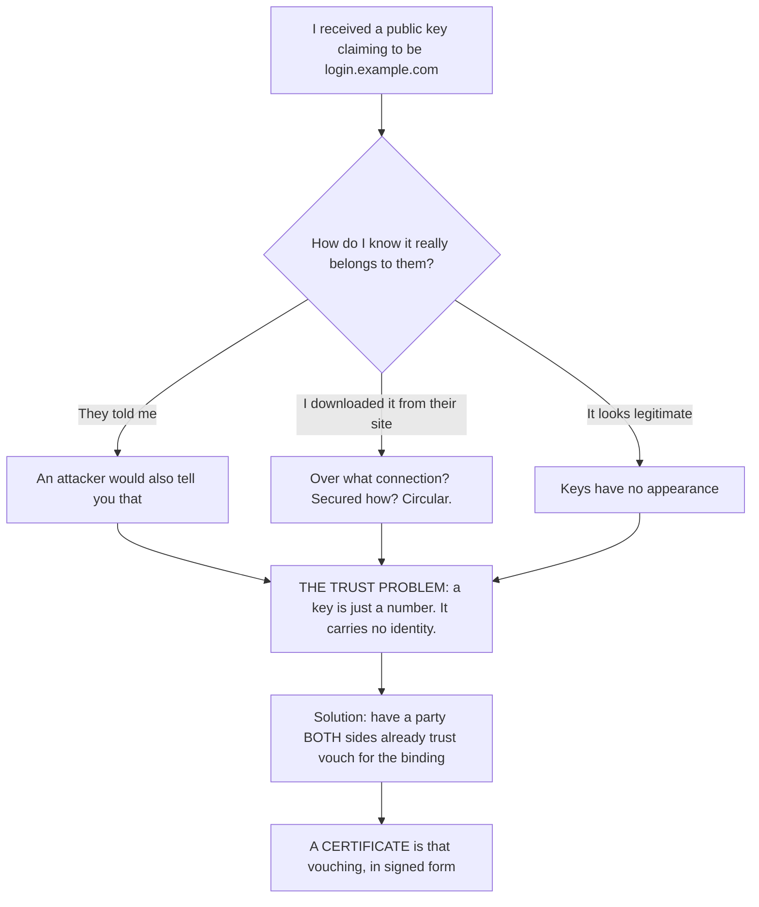
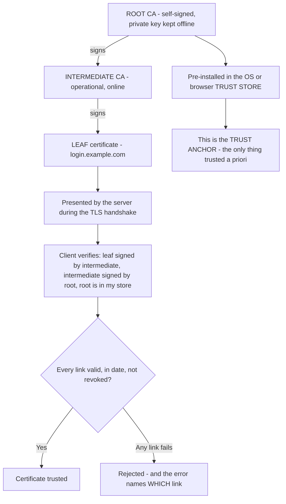
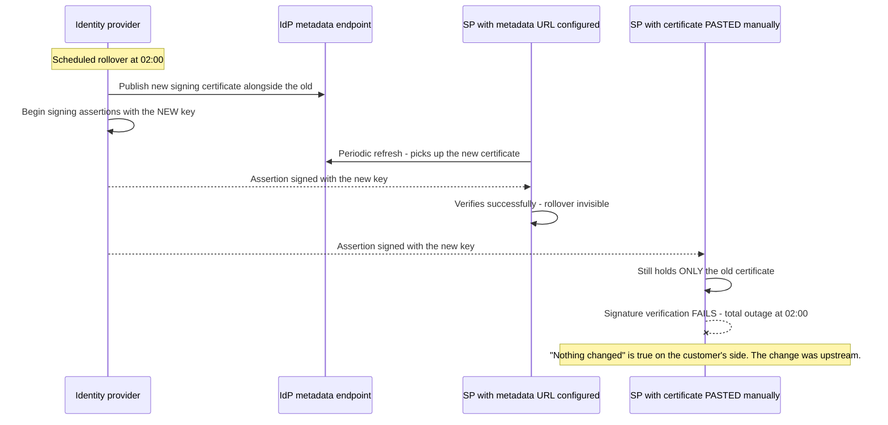
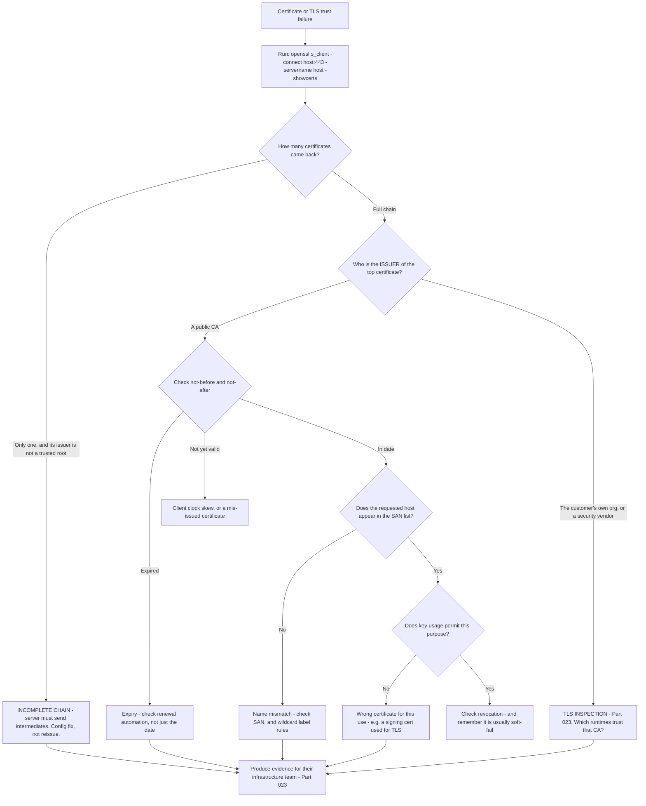

# Part 037 - Digital Signatures, Certificates, and PKI Trust Chains

> Section goal: Answer the question the previous two Parts left open — how does a public key become *trusted*? PKI is the missing piece that lets two parties who have never met verify each other, and it underpins TLS, SAML metadata, and every certificate error you will ever diagnose.

Covers index item **037**. Maps to JD signals: *knowledge of encryption*, *basic security concepts*, *understanding of authentication and authorization concepts*, *strong analytical and problem-solving skills*, and *knowledge of common architectures*.

---

## 1. Start From Zero: The Problem PKI Solves

Part 035 established that a public key can be published openly and used to verify signatures. That solves distribution. It does **not** solve trust.



> **Analogy.** A stranger hands you a key and says it is theirs. You have no way to check. Now they hand you a passport instead — issued by an authority you already trust, containing their photo and name, and physically difficult to forge. You trust the passport office, so you accept the binding between the face and the name.
>
> **Where it stops:** a passport office verifies identity in person with documents. A certificate authority verifies domain control, usually automatically — which is a much weaker claim, and understanding that difference is §4.

### 🔍 Plain-English deep-dive: what a certificate actually is

A **certificate** is not a key, and it is not a secret. It is a **signed statement** binding a public key to an identity.

Concretely, it contains:

| Field | Meaning | Where it appears in support |
|---|---|---|
| **Subject** | Who this certificate is about | The Common Name — largely legacy now |
| **Subject Alternative Name (SAN)** | The actual list of valid names | **This is what browsers check** |
| **Public key** | The key being vouched for | What you use to verify or encrypt |
| **Issuer** | Who signed this certificate | Reveals TLS inspection (Part 023) |
| **Validity period** | Not-before and not-after | Expiry causes overnight outages |
| **Serial number** | Unique per issuer | Used in revocation lists |
| **Extensions** | Key usage, extended key usage, constraints | Determines what the certificate may be used *for* |
| **Signature** | The issuer's signature over all of the above | What makes it a certificate rather than a claim |

**The crucial insight:** a certificate is **public**. It is meant to be handed to everyone. The corresponding **private key** never appears in it and never leaves the owner.

Customers confuse these constantly — "here's our certificate" sometimes arrives with a private key attached, which is a security incident (Part 006). And "we need to keep our certificate secret" is a misunderstanding worth correcting gently: the certificate is designed to be published, and it is the private key that matters.

**Analogy:** a passport is meant to be shown; the ability to *be* that person is not in the passport. **Where it stops:** a passport is one document. A certificate usually arrives as part of a *chain*, which is §2 and the source of the most confusing failures.

---

## 2. The Chain of Trust

No single authority signs every certificate directly. Instead, trust flows down a chain.



| Level | Signed by | Private key location | Why it exists |
|---|---|---|---|
| **Root CA** | Itself (self-signed) | **Offline, heavily protected** | The trust anchor, shipped in trust stores |
| **Intermediate CA** | The root | Online, operational | Isolates the root — a compromise revokes an intermediate, not the root |
| **Leaf** | An intermediate | On the server | The certificate for an actual name |

### 🔍 Plain-English deep-dive: why the intermediate is the one that causes tickets

The server must send its **leaf certificate and every intermediate** up to (but not including) the root. The root is already in the client's trust store, so it need not be sent.

If the server sends only the leaf, the chain is **incomplete** — and here is the part that makes it maddening:

| Client | Result | Why |
|---|---|---|
| A browser that has visited another site using the same intermediate | ✅ Works | It **cached** the intermediate |
| A browser that has not | ⚠️ May work | Some clients fetch the missing intermediate automatically |
| A server-side HTTP client (Node, Python, Java) | ❌ **Fails** | No cache, no auto-fetch |
| A fresh Docker container | ❌ **Fails** | Nothing cached at all |
| `openssl s_client` | ❌ Reports the incomplete chain | Which is why it is the right diagnostic tool |

**So the symptom is "it works in my browser but our backend can't connect"** — and the customer's evidence is genuinely real, which is why they push back.

**The diagnosis in one command:**

```bash
openssl s_client -connect host:443 -servername host -showcerts </dev/null
```

Count the certificates returned. If only one comes back and its issuer is not a root in your store, the chain is incomplete. That takes ten seconds and produces evidence the customer's infrastructure team will accept.

**The fix is server-side:** configure the server to present the full chain, usually by concatenating the leaf and intermediates into one PEM bundle. It is a configuration change, not a certificate reissue — which is worth saying, because customers often assume they need to buy a new certificate.

**Analogy:** a letter of introduction from someone you have never heard of, who turns out to have been introduced by someone you do know — but they forgot to include *that* letter. Some recipients happen to remember; most do not. **Where it stops:** you could phone to ask. A TLS handshake has no such option; it either completes or fails.

---

## 3. Validation: What a Client Actually Checks

When a certificate is presented, a correct client performs several independent checks. Each has its own error, and knowing which failed tells you the cause immediately.

| # | Check | Failure message family | Cause |
|---|---|---|---|
| 1 | **Signature** on each link | "unable to verify the first certificate" | Broken or incomplete chain |
| 2 | **Chain terminates at a trusted root** | "self-signed certificate in certificate chain", "unknown authority" | Root not in the trust store — often TLS inspection |
| 3 | **Validity dates** | "certificate has expired", "not yet valid" | Expiry, or client clock skew |
| 4 | **Name matches** the SAN list | "hostname mismatch", "does not match" | Wrong certificate, or missing SAN entry |
| 5 | **Not revoked** | "certificate revoked" | CRL or OCSP says so |
| 6 | **Key usage permits this** | "unsupported certificate purpose" | Wrong extended key usage |
| 7 | **Path constraints** respected | "path length exceeded" | Rare; misissued intermediate |

**The order matters diagnostically.** A failure at check 1 or 2 masks everything after it. So a customer who fixes an incomplete chain and immediately reports a name mismatch has not hit a new bug — they have reached the next check, exactly as in Part 028's validation-order deep-dive.

### Name matching in detail

| Certificate SAN | Request for | Match? |
|---|---|---|
| `example.com` | `example.com` | ✅ |
| `example.com` | `www.example.com` | ❌ Different name |
| `*.example.com` | `www.example.com` | ✅ |
| `*.example.com` | `example.com` | ❌ **Wildcard does not cover the bare domain** |
| `*.example.com` | `a.b.example.com` | ❌ **Wildcard covers one label only** |
| Common Name only, no SAN | anything | ❌ **Modern clients require SAN** |

**Two of those rows generate real tickets.** A wildcard certificate not covering the apex domain surprises people constantly, and a wildcard covering only a single label breaks multi-level subdomains — which matters for custom identity domains (Part 097).

---

## 4. What a Certificate Does and Does Not Prove

This is the conceptual point that most needs stating clearly, because customers routinely over-read certificates.

| A publicly trusted TLS certificate proves | It does not prove |
|---|---|
| Someone demonstrated control of this domain name | The organisation is legitimate |
| The connection is encrypted | The site is honest |
| The server holds the matching private key | The content is safe |
| The binding was vouched for by a CA in your trust store | Anything about who the operator is |

**Domain-validated certificates** — the overwhelming majority — are issued automatically to whoever can prove control of the DNS name or the web server. That is a genuine and useful claim. It is also a *low* bar: a phishing domain obtains one in minutes and displays a padlock.

| Validation level | What the CA checked | Reality |
|---|---|---|
| **DV** (Domain Validated) | Control of the domain | Automated, minutes, free |
| **OV** (Organisation Validated) | Some organisational checks | Slower, paid |
| **EV** (Extended Validation) | Substantial organisational checks | Browsers no longer display it distinctively |

**The support consequence:** when a customer says "the site has a valid certificate, so it must be legitimate", that is a misunderstanding worth correcting. TLS answers *"am I talking to the server that controls this name?"* — nothing more (Part 011).

---

## 5. Revocation

Certificates are issued for a fixed period. If a private key is compromised before expiry, the certificate must be declared invalid early.

| Mechanism | How | Problem |
|---|---|---|
| **CRL** (Certificate Revocation List) | A published list of revoked serial numbers | Large, cached, often stale |
| **OCSP** | Ask the CA about one certificate | Adds latency; **privacy leak** — the CA learns which sites you visit |
| **OCSP stapling** | The server fetches and attaches a fresh OCSP response | Solves both problems; requires server support |
| **Short lifetimes** | Certificates valid for weeks, renewed automatically | **The direction the industry has moved** |

### 🔍 Plain-English deep-dive: why short lifetimes replaced revocation

Revocation has a structural weakness: **it is soft-fail almost everywhere.**

If a client cannot reach the CA to check revocation status — because the network is slow, the CA is down, or a captive portal is intercepting — most clients **proceed anyway**. Hard-failing would mean a CA outage takes the entire web offline, which is unacceptable. So revocation checking is, in practice, advisory.

An attacker holding a stolen private key can also simply block the revocation check, and the client will accept the certificate.

**The industry's answer is to shorten the exposure window instead.** If certificates are valid for weeks rather than years and renew automatically, a compromised key is useful for a short time regardless of whether revocation works. Automation makes short lifetimes practical.

**The support consequences are significant and worth anticipating:**

| Consequence | What it means for you |
|---|---|
| **Renewal automation is now critical infrastructure** | A failed renewal is an outage, not a warning |
| **Expiry outages are more frequent, not less** | More renewals means more chances to fail |
| **Pinning becomes actively dangerous** | Pinning a certificate that rotates every few weeks guarantees breakage |
| **Monitoring must watch renewal, not just expiry** | An alert at 30 days is useless if the certificate lives 45 |

**Analogy:** replacing a system of recalling faulty products with one where every product expires quickly anyway. Less dependent on the recall working — and it means the production line must never stop. **Where it stops:** a product that expires is visibly out of date. An expired certificate produces an error most users cannot interpret and will click through if permitted.

---

## 6. Certificates in Identity Specifically

| Use | Which certificate | What breaks |
|---|---|---|
| **TLS for the tenant domain** | Server certificate | Login page unreachable |
| **TLS for a custom domain** | Server certificate for the customer's domain | Custom login domain fails (Part 097) |
| **SAML assertion signing** | IdP signing certificate | **Assertion signature invalid after rollover** (Part 081) |
| **SAML assertion encryption** | SP encryption certificate | IdP cannot encrypt |
| **Mutual TLS** | Client certificate | Client authentication fails |
| **Private key JWT client auth** | The client's key pair | `invalid_client` |
| **Corporate TLS inspection** | The corporate CA | Non-browser clients fail (Part 023) |

### The SAML rollover problem

This deserves naming because it is a scheduled outage that customers walk into.

SAML trust is established by exchanging **metadata** containing the signing certificate. When the identity provider rotates that certificate:

| If the service provider… | Result |
|---|---|
| Has metadata configured for automatic refresh | ✅ Picks up the new certificate |
| Has the certificate pasted in manually | ❌ **Breaks at rollover** |
| Supports multiple certificates during overlap | ✅ Both work during transition |
| Supports only one | ❌ A hard cutover, requiring coordination |

**The pattern is identical to JWKS rotation (Part 035):** publish both during an overlap, let the relying party pick by identifier. The difference is that SAML federations frequently use manually pasted certificates and no automatic refresh, which is why SAML rollovers cause outages far more often than JWKS rotations do.

**The proactive move:** when you see a SAML connection configured with a pasted certificate, note the expiry date and flag it. That is exactly the JD's *"proactivity — identify opportunities and take preemptive action against potential problems."*



---

## 7. Failure Modes

| Failure mode | Symptom | Consequence | Correction |
|---|---|---|---|
| **Incomplete chain** | "Works in browser, fails on server" | Backend integrations fail | Serve the full chain — configuration, not reissue |
| **Expired certificate** | Total failure at a precise moment | Outage with no deployment | Automate renewal; monitor renewal, not just expiry |
| **Name mismatch** | "Hostname does not match" | Hard failure | Check the SAN list, not the Common Name |
| **Wildcard on the apex** | `*.example.com` used for `example.com` | Fails for the bare domain | Include both names |
| **Wildcard across two labels** | `*.example.com` for `a.b.example.com` | Fails | Wildcards cover one label |
| **Corporate CA not trusted by a runtime** | Node or Python fails, browser works | Backend fails only | Add the CA to that runtime's trust store (Part 023) |
| **Private key shared** | Key in a ticket or repository | **Catastrophic** | Incident; rotate immediately |
| **Certificate pinning with short lifetimes** | Breaks at every renewal | Recurring self-inflicted outage | Pin the CA, or stop pinning |
| **SAML certificate pasted manually** | Breaks at IdP rollover | Federation outage | Automatic metadata refresh |
| **Clock skew** | "Not yet valid" on some hosts | Confusing partial failure | Sync time |
| **Revocation assumed reliable** | Believing a revoked certificate will be rejected | False assurance | Soft-fail is the norm; short lifetimes are the real control |
| **Treating a certificate as secret** | Refusing to share it | Blocks legitimate federation setup | Certificates are public; private keys are not |

---

## 8. Troubleshooting Decision Tree: Certificate Failures



### Worked example

*"Our SAML login stopped working at 02:00. Nothing changed. Users get an error about an invalid signature."*

1. **Total failure at a precise time, no deployment** → something external and scheduled. For SAML, the prime candidate is **certificate rollover**.
2. **Ask:** when did the identity provider last rotate its signing certificate? They do not know — it is their own Entra ID or AD FS, managed by a different team.
3. **Get the evidence.** Ask for the SAML response from a failing attempt (Part 082), and the connection's configured signing certificate.
4. **Compare.** The assertion is signed with a certificate whose thumbprint does not match the one configured on the connection.
5. **Root cause:** the identity provider rotated its signing certificate on schedule. The connection has the old certificate **pasted in manually**, with no automatic metadata refresh, so it is still expecting the previous key.
6. **Why 02:00:** that is when the rollover was scheduled, which is why "nothing changed" is true from the customer's side — the change was on their identity team's side.
7. **Immediate fix:** update the connection with the new signing certificate from the identity provider's current metadata. Service restored.
8. **Proper fix:** configure the connection to consume the identity provider's **metadata URL** so future rollovers are picked up automatically, and confirm whether the connection supports multiple certificates during an overlap period.
9. **The concept to teach:** SAML trust is a certificate binding, and certificates rotate. The design intends metadata to be refreshed, not pasted once.
10. **Proactive follow-up — and this is the valuable part:** ask whether they have other SAML connections with manually pasted certificates, and offer to help identify their expiry dates. That converts one incident into prevented future ones.

Note that step 10 is what distinguishes a resolved ticket from a resolved *problem*, and it is exactly the JD's proactivity signal.

---

## 9. Lab: Build a Certificate Authority and Break It

**Purpose.** Build a complete chain yourself so every certificate error becomes something you have caused deliberately.

**Prerequisites.** Part 007's lab — OpenSSL. Part 035's lab. **All local; your own CA only.**

**Steps.**

1. Create `okta-prep/labs/037-pki/`.
2. **Root CA.** Generate a key pair and a self-signed root certificate. Inspect it and record: issuer equals subject, the basic constraints marking it as a CA, and its validity period.
3. **Intermediate CA.** Generate a key pair, create a certificate signing request, and sign it with the root. Verify the chain so far.
4. **Leaf certificate.** Generate a key pair for `localhost` with a **SAN** entry, sign it with the intermediate. Record that the SAN is present and what happens if you omit it.
5. **Serve it.** Run a local HTTPS server presenting the **full chain** — leaf plus intermediate. Verify with `openssl s_client -showcerts` and **count the certificates returned**.
6. **Break the chain.** Reconfigure the server to present **only the leaf**. Re-run `s_client` and **record the exact error**. Then:
   - a. Test with `curl` — record the failure.
   - b. Test with Node — record the failure.
   - c. Test with a browser that has previously seen your intermediate — **record whether it succeeds**.
   **This is the "works in browser, fails on server" pattern, reproduced.**
7. **Trust the root.** Add your root CA to your **user** trust store (not machine-wide) and confirm the full-chain server now validates. **Record how to remove it, and remove it at the end.**
8. **Name mismatch.** Generate a leaf for `wrong.example` and serve it on `localhost`. Record the exact error.
9. **Wildcard rules.** Generate `*.test.local` and attempt to validate against `test.local`, `a.test.local`, and `a.b.test.local`. **Record which two fail and why.**
10. **Expiry.** Generate a leaf with a validity window that has already passed. Record the error. Then one that starts tomorrow, and record the "not yet valid" error.
11. **Key usage.** Generate a certificate marked for code signing only, present it for TLS, and record the failure.
12. **Inspection simulation.** Using the local proxy from Part 023 if available, or by simply serving with a differently-issued certificate, **record what the issuer field looks like when interception is present** and contrast it with the public-CA case.
13. **Reference + catalog.** Write `certificate-errors.md` — every check from §3, with the exact error you produced and the command that diagnoses it. Add rows to the failure catalog. Complete `MANIFEST.md`.

**Expected evidence.** A three-level chain built by you, a full-chain server verified, an incomplete-chain failure across three client types with the browser contrast, a trust-store addition and removal, name mismatch, three wildcard results, two date failures, a key-usage failure, and an issuer contrast.

**Validation rubric.**

| Check | Pass condition |
|---|---|
| Three levels built | Root, intermediate, leaf, each verified |
| Chain count recorded | Number of certificates returned in both configurations |
| Three client types | curl, Node, and browser results all recorded |
| Browser contrast shown | Browser succeeding where a runtime fails, or an explanation of why not |
| Wildcard rules proven | Apex and two-label cases both shown to fail |
| Both date errors | Expired and not-yet-valid |
| Trust store reverted | Root removed at the end, and you recorded how |
| Errors verbatim | Every message copied exactly |

**Cleanup and privacy.** Everything is your own local CA. **Add the root only to your user trust store, never machine-wide, and remove it when the lab is complete** — leaving a private CA installed is a standing risk to your own machine. Keep all private keys in the git-ignored `secrets/` folder and delete them at the end. Never install any certificate on a system you do not own.

---

## 10. JD Mapping

| Supplied JD signal | How this Part supports it |
|---|---|
| **Knowledge of encryption** | Certificates, chains, signatures, and revocation |
| Basic security concepts | Trust anchors, what a certificate does and does not prove, revocation's soft-fail reality |
| Understanding of authentication and authorization concepts | How SAML and mutual TLS establish trust via certificates |
| Strong analytical and problem-solving skills | §8's tree routes each check to its own error and command |
| Knowledge of common architectures | Chain topology, trust stores per runtime, metadata-based federation |
| **Proactivity** | §8 step 10: surfacing other manually pasted certificates before they expire |
| Serve as internal and external point of contact | Producing chain evidence their infrastructure team will accept |

---

## 11. Candidate Honesty Note

- **Production transfer (strong):** TLS/SSL and certificate troubleshooting are on your CV and you have handled these on real enterprise escalations. This Part sharpens vocabulary and adds identity-specific cases.
- **The strongest thing you can say:** *"'Works in my browser but our backend can't connect' is almost always an incomplete chain. Browsers often have the intermediate cached from another site; a Node or Python client or a container has nothing cached and fails. `openssl s_client -showcerts` settles it in ten seconds by counting what the server actually sent — and the fix is a server configuration change, not a new certificate, which customers usually assume."*
- **A second strong point, and it is a real proactive contribution:** *"SAML rollovers cause far more outages than JWKS rotations, because SAML federations often use a manually pasted certificate with no automatic metadata refresh. So when I see a connection configured that way, I note the expiry and flag it — that turns one incident into prevented future ones."*
- **A third, which corrects a common misconception:** *"A publicly trusted certificate proves that someone demonstrated control of that domain name. It doesn't prove the organisation is legitimate or the site is honest — a phishing domain gets one in minutes and shows a padlock. TLS answers 'am I talking to the server that controls this name', and nothing more."*
- **A fourth, on revocation:** *"Revocation is soft-fail in practice, because hard-failing would mean a CA outage takes the web down. So it's advisory. The real control is short certificate lifetimes with automated renewal — which shifts the risk from 'revocation might not work' to 'renewal automation is now critical infrastructure'."*
- **Do not claim** to have operated a certificate authority or designed a PKI. You diagnose certificate problems expertly and can build a test chain — which is exactly the role.

---

## 12. Official Source Anchors

Accessed **26 August 2026**.

| Source | What it defines |
|---|---|
| IETF RFC 5280 | X.509 certificate and CRL profile — fields, extensions, path validation |
| IETF RFC 6125 | Verifying server identity against a certificate, including wildcard rules |
| IETF RFC 6960 | OCSP |
| IETF RFC 6961 / TLS 1.3 | OCSP stapling |
| CA/Browser Forum Baseline Requirements | Issuance rules, validation levels, and maximum certificate lifetimes |
| IETF RFC 8446 (TLS 1.3) | Where certificate verification sits in the handshake (Part 038) |
| OASIS SAML 2.0 Metadata specification | Certificate exchange and rollover in §6 |
| OpenSSL documentation — `s_client`, `x509`, `req`, `ca` | Every command used in §9 |
| Microsoft Learn — AD FS and Entra ID certificate rollover | The identity-provider side of §8's worked example |

**Revalidate after 26 August 2026:** maximum certificate lifetimes and CA/Browser Forum requirements change. The validation checks and chain structure do not.

---

## ⭐ Likely Interview Questions for This Section

### Q1. "What is a certificate, and what does it prove?"
> *Model answer:* "It's a signed statement binding a public key to an identity, issued by an authority both parties trust. It contains the subject alternative names, the public key, the issuer, validity dates, key usage, and a signature from the issuer over all of it. Two things matter for support. First, it's *public* — it's meant to be handed to everyone, and the private key is never in it, so 'we need to keep our certificate secret' is a misunderstanding worth correcting gently. Second, what it actually proves is narrower than people assume: for the overwhelming majority of certificates, which are domain-validated, it proves that someone demonstrated control of that domain name. It doesn't prove the organisation is legitimate or the content is safe. A phishing domain obtains one automatically in minutes and displays a padlock."

### Q2. "'It works in my browser but our backend can't connect.' What's your first thought?"
> *Model answer:* "An incomplete certificate chain. The server has to send its leaf certificate plus every intermediate, because only the root is already in the client's trust store. If it sends only the leaf, browsers often still succeed because they cached that intermediate from some other site, or they fetch it automatically — but a Node or Python client, a Java application, or a fresh container has nothing cached and fails. That's why the customer's evidence is real and they push back. `openssl s_client -connect host:443 -servername host -showcerts` settles it in ten seconds: count the certificates returned. If only one comes back and its issuer isn't a root in your store, that's the answer. And the fix is a server configuration change — concatenating the intermediates into the served bundle — not a certificate reissue, which is what customers usually assume they need."

### Q3. "A SAML login broke overnight with an invalid signature error. Where do you look?"
> *Model answer:* "Certificate rollover at the identity provider. SAML trust is a certificate binding — the service provider holds the IdP's signing certificate and verifies assertions against it. When the IdP rotates that certificate on schedule, any connection with the old one pasted in manually stops verifying immediately. That's why 'nothing changed' is genuinely true from the customer's side; the change was on their identity team's side, often a different team entirely. I'd confirm by comparing the certificate that signed the failing assertion against the one configured on the connection — different thumbprints is decisive. The immediate fix is updating the connection with the current certificate from the IdP's metadata; the proper fix is configuring the connection to consume the metadata URL so future rollovers are automatic. And then I'd ask whether they have other connections with pasted certificates, because those are scheduled outages waiting to happen."

### Q4. "Why doesn't a wildcard certificate work for everything?"
> *Model answer:* "Two rules surprise people. A wildcard covers exactly one label, so `*.example.com` matches `www.example.com` but not `a.b.example.com` — multi-level subdomains need their own entry or a different wildcard. And a wildcard doesn't cover the apex, so `*.example.com` does not match `example.com` itself; both names have to be listed if both are used. That second one causes real tickets, because someone buys a wildcard, assumes it covers the bare domain, and the apex fails while every subdomain works. It matters specifically for custom identity domains, where the login host is a subdomain and the application might be on the apex or on a deeper label. And modern clients check the subject alternative names, not the Common Name, so a certificate with only a CN and no SAN fails everywhere regardless of what it says."

### Q5. "How does certificate revocation work, and can you rely on it?"
> *Model answer:* "Not really, and it's worth being honest about that. There are two mechanisms: certificate revocation lists, which are published lists of revoked serial numbers and tend to be large and stale, and OCSP, which queries the CA about one certificate but adds latency and leaks to the CA which sites you're visiting. OCSP stapling fixes both by having the server fetch and attach a fresh response. The structural problem is that revocation checking is soft-fail almost everywhere — if the client can't reach the CA it proceeds anyway, because hard-failing would mean a CA outage takes the web offline. So an attacker with a stolen key can simply block the check. The industry's answer has been to shorten certificate lifetimes to weeks with automated renewal, which shrinks the exposure window regardless. The support consequence is that renewal automation is now critical infrastructure, and monitoring has to watch renewals rather than just expiry dates."

### Q6. "Which certificate checks does a client perform, and why does the order matter?"
> *Model answer:* "Roughly seven: each link's signature, that the chain terminates at a trusted root, the validity dates, that the requested hostname appears in the subject alternative names, revocation status, that key usage permits this purpose, and any path constraints. The order matters diagnostically because a failure early in the sequence masks everything after it. So if a customer fixes an incomplete chain and immediately reports a name mismatch, that isn't a new bug and my first diagnosis wasn't wrong — the chain failure was masking the name check, and they've simply reached the next one. Saying that explicitly preserves credibility and sets the right expectation, because otherwise it looks like you fixed one thing and broke another. It's the same short-circuit pattern as token validation, where a signature failure hides a wrong audience."

### Q7. "A customer's backend fails with 'unknown authority' but their browsers are fine. What's happening?"
> *Model answer:* "Most likely corporate TLS inspection. Their proxy terminates TLS, inspects the traffic, and re-signs with a private certificate authority installed on every managed device. Browsers use the operating system trust store, which has that CA, so they work. Node ships its own CA bundle and ignores the OS store, Python uses certifi, Java has its own keystore, and a container has none of them — so all of those fail. I'd confirm by reading the certificate issuer with `openssl s_client` piped to `openssl x509 -noout -issuer`: if it names their organisation or a security vendor rather than a public CA, that's conclusive and it's evidence their network team will accept. The fix is adding the corporate CA to that specific runtime's trust store. What I'd never advise is disabling certificate verification, because that converts a managed interception into an unmanaged vulnerability and the setting always ships to production."

### Q8. "Why is there an intermediate CA at all?"
> *Model answer:* "To protect the root. A root CA's private key is the ultimate trust anchor — it's shipped in every operating system and browser trust store, and it can't practically be replaced, because replacing it means updating every device in the world. So it's kept offline in heavily protected storage and used only rarely, to sign intermediates. The intermediates are online and do the day-to-day issuing. If an intermediate's key is compromised, that intermediate is revoked and reissued, and the root survives — which would be impossible if the root were signing leaves directly. The support consequence is the one that generates tickets: because the chain has three levels, the server has to send the leaf *and* the intermediate, and forgetting the intermediate produces the 'works in my browser, fails on our server' pattern that's so confusing to diagnose from the customer's side."

---

## 🧠 30-Second Memory Hooks

- **A certificate is a SIGNED STATEMENT binding a public key to a name.** It is **public**; the private key is not in it.
- **Chain: root (offline, in trust stores) → intermediate (online) → leaf.** The server must send **leaf + intermediates**.
- **Incomplete chain = "works in my browser, fails on our server."** Browsers cache intermediates; runtimes do not.
- **Diagnose in 10 seconds:** `openssl s_client -showcerts` → **count the certificates**.
- **The fix is server configuration, not a reissue.**
- **Modern clients check SAN, not Common Name.**
- **Wildcards cover ONE label and NOT the apex.** `*.example.com` ≠ `example.com` and ≠ `a.b.example.com`.
- **A DV certificate proves domain control only.** Not legitimacy, not honesty.
- **An early check masks later ones** — fixing the chain then hitting a name mismatch is progress, not a new bug.
- **Revocation is SOFT-FAIL.** The real control is **short lifetimes + automated renewal** — so renewal is now critical infrastructure.
- **Issuer names the customer's org or a security vendor = TLS inspection.**
- **SAML rollover breaks manually pasted certificates.** Use the metadata URL — and flag the ones you find.

---

## ✅ Completion Checklist

- [ ] **Knowledge:** I can list the validation checks, explain incomplete-chain behavior across client types, and state the two wildcard rules.
- [ ] **Lab artifact:** `037-pki/` contains a three-level chain I built, an incomplete-chain failure across three client types, both date errors, three wildcard results, and a key-usage failure.
- [ ] **Spoken:** I can deliver the "works in browser, fails on server" diagnosis including the ten-second command, in under 45 seconds.
- [ ] **Honesty check:** my root CA was added only to my user trust store and removed afterwards; all private keys were git-ignored and deleted.
- [ ] **Source check:** I have read RFC 6125's wildcard rules and my own tenant's custom-domain certificate requirements.

---

*Next suggested section:* **[Part 038 - TLS Handshake, Versions, Ciphers, and Mutual TLS](Part-038-tls-handshake-versions-ciphers-and-mutual-tls.md)** — put the certificate to work: how the handshake actually runs, and where your Wireshark experience becomes directly valuable again.
