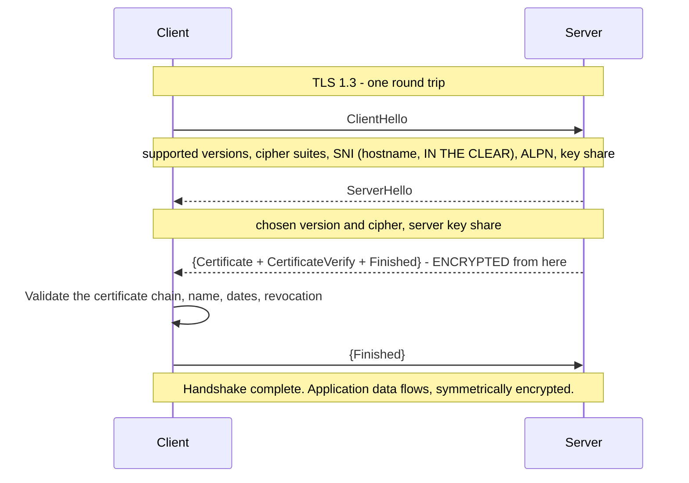
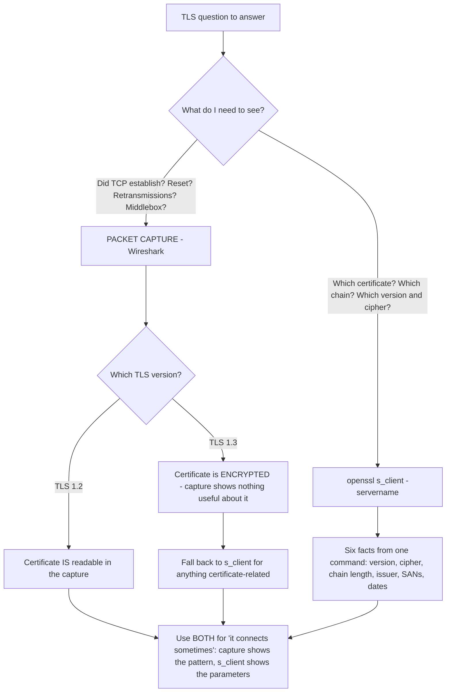
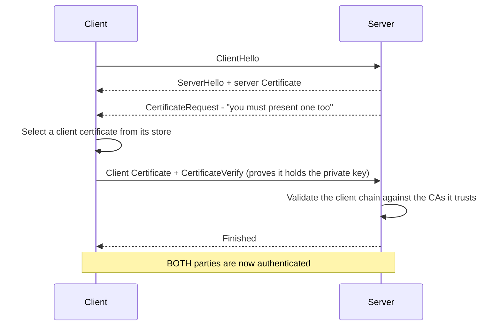
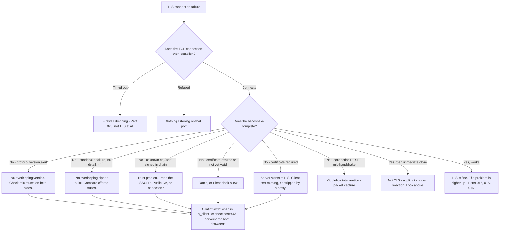

# Part 038 - TLS Handshake, Versions, Ciphers, and Mutual TLS

> Section goal: Put the certificate to work. Walk the handshake step by step, know what each version changed, understand cipher suites well enough to read a negotiation, and recognise mutual TLS. This is where your Wireshark and packet-capture experience becomes directly valuable again.

Covers index item **038**. Maps to JD signals: *knowledge of encryption*, *knowledge of HTTP*, *basic security concepts*, *strong analytical and problem-solving skills*, and *knowledge of common architectures*.

---

## 1. Start From Zero: What the Handshake Must Achieve

Before any application data flows, the two sides must accomplish four things:

| Goal | Achieved by |
|---|---|
| **Agree what to speak** | Version and cipher suite negotiation |
| **Verify the server** | Certificate and chain validation (Part 037) |
| **Agree a shared secret** | Asymmetric key exchange (Part 035) |
| **Switch to fast encryption** | Derive symmetric keys from that secret |

This is Part 035's hybrid model, made concrete: **asymmetric cryptography establishes trust and a shared secret; symmetric cryptography does the actual work.**



> **Analogy.** Two people meeting to exchange confidential documents. They first agree a language both speak, one shows credentials issued by an authority the other trusts, they use those credentials to agree a private code, and only then do they start talking — in that code.
>
> **Where it stops:** people can improvise if something is unclear. A TLS handshake has no fallback conversation; any mismatch is a hard failure, which is why the failure messages matter so much.

### 🔍 Plain-English deep-dive: SNI is sent in the clear, and why that matters

**SNI** (Server Name Indication) is the hostname the client wants, sent in the `ClientHello` — **before any encryption exists**.

It has to be, because one IP address may serve hundreds of sites. The server cannot select the right certificate until it knows which name is being requested, and it cannot decrypt anything until after the certificate is chosen. So the hostname travels in plaintext.

Three consequences you will meet:

| Consequence | Effect |
|---|---|
| **Network filters can block by hostname without decrypting** | A firewall or DNS-layer filter can drop connections to specific hosts (Part 023) |
| **Observers see which hosts you visit** | Not the content, but the destination |
| **`openssl s_client` needs `-servername`** | Without it, you may get the *default* certificate rather than the one you meant to inspect |

**That last one is a genuine diagnostic trap.** If you run `openssl s_client -connect host:443` without `-servername host`, and the server hosts multiple sites, you can receive a completely different certificate and misdiagnose a name mismatch that does not exist. **Always pass `-servername`.**

**Encrypted Client Hello** is the emerging mechanism that closes the visibility gap, but adoption is partial and it is not something to assume.

**Analogy:** posting a letter to a large office building. The building's name is on the envelope for the sorting office to read; the contents are sealed. Anyone handling the envelope knows which building, not what was said. **Where it stops:** you could use a forwarding address. Encrypted Client Hello is roughly that idea, and it is not yet universal.

---

## 2. TLS Versions

| Version | Status | Key characteristics |
|---|---|---|
| SSL 2.0 / 3.0 | **Removed** | Broken; must not be enabled |
| TLS 1.0 / 1.1 | **Deprecated** | Removed from browsers; some legacy systems still request them |
| **TLS 1.2** | Widely supported | Two round trips; large cipher suite catalogue including weak options |
| **TLS 1.3** | Current | **One round trip**, encrypted handshake from the certificate onward, weak options removed |

### What TLS 1.3 changed, and why it matters for diagnosis

| Change | Practical effect |
|---|---|
| One round trip instead of two | Faster connections |
| Certificate is **encrypted** | **You can no longer read the certificate from a plain packet capture** |
| Only AEAD cipher suites | Whole classes of weakness removed |
| Key exchange always forward-secret | A later key compromise cannot decrypt past sessions |
| Renegotiation removed | An attack surface eliminated |
| Cipher suite names simplified | `TLS_AES_128_GCM_SHA256` — no key-exchange or authentication part |

**The diagnostic consequence is significant and worth internalising:** under TLS 1.2, a packet capture shows the certificate in plaintext, so you can inspect it in Wireshark. Under **TLS 1.3 you cannot** — the certificate is encrypted. So for certificate inspection, `openssl s_client` becomes the tool of choice rather than a capture.

> 💡 **Tie-in to your background:** you have read TLS handshakes in Wireshark on real escalations. The adjustment is that TLS 1.3 hides more of it, so your workflow shifts: **use a packet capture for connection-level questions — resets, retransmissions, whether the handshake started at all — and `openssl s_client` for certificate and negotiation questions.** Saying that in an interview shows current, practical knowledge rather than remembered knowledge.



---

## 3. Cipher Suites

A **cipher suite** is the agreed set of algorithms for the session.

### TLS 1.2 naming

```
TLS_ECDHE_RSA_WITH_AES_128_GCM_SHA256
    └─┬──┘ └┬┘      └──────┬─────┘ └──┬──┘
  key exchange auth      bulk cipher   MAC/PRF
```

| Component | Job | Good values |
|---|---|---|
| **Key exchange** | Agree the shared secret | ECDHE (forward secret) |
| **Authentication** | Verify the server | RSA, ECDSA |
| **Bulk cipher** | Encrypt the data | AES-GCM, ChaCha20-Poly1305 |
| **MAC / PRF** | Integrity and key derivation | SHA-256 or better |

### TLS 1.3 naming

```
TLS_AES_128_GCM_SHA256
```

Key exchange and authentication are no longer part of the suite name, because TLS 1.3 negotiates them separately and only permits strong options.

### 🔍 Plain-English deep-dive: forward secrecy, and why it changes incident response

**Forward secrecy** means that compromising the server's long-term private key **does not** allow decryption of previously recorded sessions.

Without it — with old RSA key exchange — the client encrypted the session secret using the server's public key. An attacker who recorded that traffic and later obtained the private key could decrypt every recorded session retroactively.

With **ECDHE**, both sides contribute ephemeral values, derive a shared secret, and discard the ephemeral material. The long-term key is used only to *sign*, proving identity. There is nothing stored that could later reveal the session key.

**Why this matters practically, and it is worth being able to say:**

| Scenario | Without forward secrecy | With forward secrecy |
|---|---|---|
| Private key stolen today | **All recorded past traffic is decryptable** | Past traffic remains protected |
| Incident response scope | Every session ever recorded | Only sessions after the compromise |
| "Record now, decrypt later" attacks | Viable | Not viable |

**TLS 1.3 makes forward secrecy mandatory.** In TLS 1.2 it depends on negotiating an ECDHE suite, which is why disabling non-ECDHE suites is standard hardening advice.

**The support angle:** when a customer's private key is compromised and they ask what the exposure is, forward secrecy is the difference between "sessions from the compromise onward" and "everything we ever transmitted." That is a materially different incident.

**Analogy:** a safe whose combination changes for every visit and is forgotten afterwards, versus one master combination used forever. Stealing the master opens every past recording of the safe. **Where it stops:** a safe's contents persist. Network traffic is transient — unless someone recorded it, which is exactly the threat model forward secrecy addresses.

---

## 4. Mutual TLS

Ordinary TLS authenticates the **server** only. **Mutual TLS** (mTLS) authenticates both sides.



| Property | Ordinary TLS | Mutual TLS |
|---|---|---|
| Server authenticated | ✅ | ✅ |
| Client authenticated | ❌ | ✅ |
| Client needs a certificate and private key | ❌ | ✅ |
| Trust anchors needed | Client trusts public CAs | **Server trusts a specific CA** |
| Survives TLS inspection | ✅ | ❌ **Interception breaks it** |

### Where mTLS appears in identity

| Use | Notes |
|---|---|
| **Client authentication at the token endpoint** | An alternative to a client secret (Part 060) |
| **Certificate-bound access tokens** | Sender-constrained tokens (Part 068) |
| **Service-to-service authentication** | Common in microservices and service meshes (Part 010) |
| **High-assurance and regulated APIs** | Open banking and similar |

### Why mTLS breaks under TLS inspection

An inspecting proxy terminates the client's TLS connection and opens its own to the server (Part 023). The client's certificate is presented to the *proxy*, not to the real server — and the proxy cannot forward it, because it does not hold the client's private key.

**The result:** the server sees a connection with no client certificate, or the proxy's own, and rejects it.

**The only real fix is to exclude mTLS destinations from inspection.** This is a common enterprise friction point, and the evidence pack from Part 023 is exactly what the customer's network team needs.

---

## 5. Reading a Handshake Failure

| Symptom | Likely cause | Diagnostic |
|---|---|---|
| `handshake failure` with no detail | No overlapping version or cipher suite | Compare supported versions on both sides |
| `protocol version` alert | One side requires a version the other has disabled | Check minimum TLS version settings |
| `unknown ca` | Client does not trust the chain | Part 037; check the issuer |
| `certificate expired` | Dates | Read not-after |
| `bad certificate` | Malformed, or wrong purpose | Key usage |
| `certificate required` | Server wants mTLS, client sent none | Client certificate not configured, or stripped by a proxy |
| `decrypt error` | Signature verification failed | Wrong key, or interference |
| Connection **reset** during the handshake | Middlebox intervention | Packet capture (Part 023) |
| Handshake completes, then immediate close | Application-layer rejection, not TLS | Look above TLS |

### The command that answers most of it

```bash
openssl s_client -connect host:443 -servername host -showcerts </dev/null
```

Read, in order: negotiated **version**, negotiated **cipher**, the **certificate chain** (and its length), the **issuer**, the **SANs**, and the **validity dates**. Six facts, one command — and it is the single most useful command in this whole group.

To test a specific version or check whether a weak version is still enabled, add `-tls1_2` or `-tls1_3`.

### 🔍 Plain-English deep-dive: separating TCP, TLS, and application failures

Customers report all three as "it won't connect", and they need completely different owners. Three questions separate them, in order.

| Question | If no | If yes |
|---|---|---|
| **1. Does TCP establish?** | Not TLS at all — firewall, wrong port, or host down (Part 011) | Continue |
| **2. Does the handshake complete?** | A TLS problem — version, cipher, certificate, or trust | Continue |
| **3. Does the connection stay open and carry data?** | An **application-layer** rejection wearing TLS clothing | It is working; look higher (Parts 012, 015) |

**Question 3 is the one people miss.** A handshake that completes and is then immediately closed is not a TLS failure — the encryption succeeded perfectly, and something above it decided to end the conversation. Common causes: an application-level allow-list, an HTTP-layer rejection, a load balancer health check failing, or a protocol mismatch after ALPN negotiated HTTP/2 against a server that cannot speak it.

**Why the distinction matters commercially:** each answer points at a different team inside the customer's organisation. "TCP is being dropped" is a network team problem. "The handshake fails on trust" is a platform or security team problem. "The handshake succeeds and the application closes it" is an application team problem. Handing a customer the wrong one wastes days.

**Analogy:** a phone call that never connects, one that connects to static, and one where someone answers and hangs up. Three different faults, three different people to call. **Where it stops:** you can hear the difference on a phone. Here you have to look, which is why the three questions have to be deliberate rather than intuitive.

---

## 6. TLS in Identity Flows

Every step of an identity flow is TLS-protected, and each has its own failure surface.

| Connection | Client | Server | Failure symptom |
|---|---|---|---|
| Browser → tenant | Browser | Authorization server | Login page unreachable |
| Browser → custom domain | Browser | Customer's domain | Custom login domain fails (Part 097) |
| App server → token endpoint | Their runtime | Authorization server | **Backend fails where the browser works** (Part 037) |
| API → JWKS | Their runtime | Authorization server | "Signing key not found" — but check for a TLS cause first |
| Tenant → upstream IdP | Authorization server | Entra ID, Google, SAML IdP | Enterprise connection fails |
| Tenant → customer webhook | Authorization server | Customer's endpoint | Event delivery fails |
| Tenant → LDAP connector | Connector | Directory | Directory connection fails (Part 095) |

**The row worth highlighting is JWKS.** A "signing key not found" error is usually a stale cache (Part 035) — but it can also be that the verifier **cannot reach JWKS at all** because of a TLS or network failure, and the library reports it as a key problem. Checking that the runtime can actually fetch the JWKS URL is a fast, non-obvious step that occasionally saves an hour.

---

## 7. Failure Modes

| Failure mode | Symptom | Consequence | Correction |
|---|---|---|---|
| **Missing `-servername`** | Wrong certificate inspected | Misdiagnosed name mismatch | Always pass SNI |
| **Expecting to read the certificate in a TLS 1.3 capture** | "The capture shows nothing" | Wasted effort | Use `openssl s_client` |
| **Legacy client requiring TLS 1.0** | Handshake failure after a server upgrade | Old integrations break | Identify the client; plan an upgrade |
| **Non-ECDHE suites enabled** | Works, but no forward secrecy | Recorded traffic decryptable if the key leaks | Restrict to ECDHE |
| **mTLS behind an inspecting proxy** | `certificate required`, or client cert absent | Authentication impossible | Exclude from inspection |
| **Client certificate expired** | mTLS fails at a precise moment | Outage, no deployment | Monitor client certificate expiry too |
| **Server trusts too broad a CA for mTLS** | Any client with a public certificate is accepted | **Weak authentication** | Trust only the intended issuing CA |
| **Disabling verification to "fix" a handshake** | Error gone | Unauthenticated connection shipped | Diagnose properly (Parts 022, 023) |
| **JWKS unreachable, reported as a key error** | "Signing key not found" | Looking in the wrong place | Test fetching the JWKS URL from that runtime |
| **Clock skew** | Certificate "not yet valid" on some hosts | Confusing partial failure | Sync time |
| **Session resumption masking a change** | Old parameters persist after a config change | "The change didn't take effect" | Force a fresh connection |

---

## 8. Troubleshooting Decision Tree: TLS Failures



### Worked example

*"Our payment service can't reach your token endpoint. It worked until we moved it into a container. Everything else in the container works fine."*

1. **"Worked until containerised" plus "everything else works"** is a strong signal — the change is environmental and specific to this connection.
2. **Ask what the error actually says.** "unable to get local issuer certificate."
3. **That is a trust-chain error** (Part 037), not a network error.
4. **Two candidate causes:** the server sends an incomplete chain, or the container lacks a required CA.
5. **Discriminate.** Run `openssl s_client -connect host:443 -servername host -showcerts` **from inside the container** and from the host. If both return a full chain but only the container fails, the container's trust store is the difference.
6. **Finding:** the container image is a minimal base with no CA certificate bundle installed at all.
7. **But there is a second finding.** Ask whether their network uses TLS inspection. It does — so even with a CA bundle, the container would need the **corporate** CA too, which the base image certainly does not have.
8. **Fix — both parts:** install the standard CA bundle in the image, and add the corporate CA at build time from a trusted internal source.
9. **What not to do:** disable certificate verification. Say so explicitly, because it is exactly what a developer under time pressure will reach for, and it will ship.
10. **The concept to teach:** every runtime has its own trust source. Browsers use the OS store; containers start with nothing. "It works on my laptop" and "it works in the container" are genuinely different questions.
11. **Prevention:** a startup health check that fetches the token endpoint's discovery document and fails loudly if TLS validation fails — so this surfaces at deploy time rather than at the first payment.

That answer identifies two independent causes, refuses the dangerous shortcut, and leaves them with a check that prevents recurrence.

---

## 9. Lab: Observe and Break the Handshake

**Purpose.** See the handshake at every layer, and produce a version and cipher inventory you can reuse.

**Prerequisites.** Part 007's lab — OpenSSL, Wireshark. Part 037's local CA and HTTPS server. **Your own systems only.**

**Steps.**

1. Create `okta-prep/labs/038-tls/`.
2. **Baseline inspection.** Run `openssl s_client -connect <your-tenant>:443 -servername <your-tenant> -showcerts </dev/null` and record all six facts: version, cipher, chain length, issuer, SANs, and dates. **This is your reference output.**
3. **The SNI trap.** Run the same command **without** `-servername`. Record whether the certificate differs. Write one line on why omitting it can cause a false name-mismatch diagnosis.
4. **Version negotiation.** Force `-tls1_2` and then `-tls1_3` against your tenant. Record which succeed and the negotiated cipher for each. Then attempt `-tls1_1` and record the failure message.
5. **Cipher inspection.** Record the negotiated cipher for both versions and **decompose the TLS 1.2 name** into its four components. Note that the TLS 1.3 name has fewer.
6. **Packet capture contrast — the important one.** Capture the handshake in Wireshark for a TLS 1.2 connection to your **local** server from Part 037, and then for a TLS 1.3 connection. **Record whether the certificate is readable in each capture.** This proves the §2 diagnostic point first-hand.
7. **Local handshake failures.** Against your own Part 037 server, deliberately create and record the exact error for:
   - a. Server configured for TLS 1.3 only, client forced to TLS 1.2
   - b. Server with an expired leaf certificate
   - c. Server presenting a certificate whose SAN does not match
   - d. Client not trusting your root CA
8. **Mutual TLS.** Configure your local server to require a client certificate. Then:
   - a. Connect with no client certificate — **record `certificate required`**
   - b. Generate a client certificate from your own CA and connect — record success
   - c. Connect with a certificate from a *different* CA — record the rejection
9. **Forward secrecy.** Identify which negotiated suites are ECDHE. Write one line on what an attacker who later steals the server private key can and cannot decrypt in each case.
10. **Runtime trust comparison.** Fetch your local HTTPS URL from: curl, Node, Python, and a browser. **Record which trust your root CA and which do not**, and where each looks for trust anchors.
11. **JWKS reachability.** From a constrained environment (a minimal container if available, otherwise a shell with a deliberately empty CA path), attempt to fetch your tenant's JWKS URL. **Record the failure and note that a library might surface it as "signing key not found".**
12. **Reference + catalog.** Write `tls-diagnostics.md` — the six facts, the one command, and every failure with its exact message. Add rows to the failure catalog. Complete `MANIFEST.md`.

**Expected evidence.** A baseline six-fact record, an SNI contrast, version negotiation results including a failure, a decomposed cipher name, a Wireshark contrast showing the certificate visible in 1.2 and hidden in 1.3, four handshake failures, three mTLS outcomes, a forward-secrecy note, a four-runtime trust comparison, and a JWKS reachability failure.

**Validation rubric.**

| Check | Pass condition |
|---|---|
| Six facts recorded | All six, from one command |
| SNI trap shown | Difference recorded, or explained if the server has only one certificate |
| Version failure captured | Exact message for a rejected version |
| Cipher decomposed | Four components named for the TLS 1.2 suite |
| Capture contrast | Certificate visible in 1.2, not visible in 1.3 |
| Four handshake failures | Each with verbatim error text |
| mTLS all three outcomes | None, valid, and wrong-CA |
| Runtime comparison | Four clients, with each one's trust source named |
| Nothing disabled | Verification was never bypassed at any point |

**Cleanup and privacy.** Use your own tenant and your own local server from Part 037. **Capture packets only on your own traffic** — never on a shared or corporate network, and never on traffic you do not own. Remove your root CA from the user trust store when finished, and delete all private keys including the client certificate.

---

## 10. JD Mapping

| Supplied JD signal | How this Part supports it |
|---|---|
| **Knowledge of encryption** | The handshake, cipher suites, forward secrecy, and mutual TLS |
| Knowledge of HTTP | TLS is the layer HTTP runs on; ALPN negotiates which HTTP version |
| Basic security concepts | Forward secrecy's effect on incident scope; why disabling verification is unacceptable |
| Strong analytical and problem-solving skills | §8's tree separates TCP, TLS, and application failures |
| Knowledge of common architectures | mTLS in service-to-service and sender-constrained tokens |
| Instinctive ability to subdivide problems | "Does TCP connect? Does the handshake complete? Then it is above TLS." |
| Serve as internal and external point of contact | Producing handshake evidence for a customer's network team |

---

## 11. Candidate Honesty Note

- **Production transfer (strong):** Wireshark, TLS/SSL, and network captures are on your CV and were used on real escalations. This Part updates that experience rather than building it.
- **The most current-sounding thing you can say:** *"Under TLS 1.3 the certificate is encrypted, so you can no longer read it from a plain packet capture — which changes the workflow. I use a capture for connection-level questions like resets, retransmissions, and whether the handshake even started, and `openssl s_client` for anything about the certificate or the negotiation."* That distinguishes current knowledge from remembered knowledge.
- **A second strong point:** *"Always pass `-servername`. Without SNI you can receive the server's default certificate rather than the one you meant to inspect, and then diagnose a name mismatch that doesn't exist."* Small, specific, and it signals real hands-on use.
- **A third, which is genuinely consequential:** *"Forward secrecy determines the scope of a key-compromise incident. Without it, an attacker who recorded traffic and later obtains the private key can decrypt everything retroactively. With ECDHE, only sessions after the compromise are at risk. That's the difference between 'we need to assess ongoing exposure' and 'assume everything we ever transmitted is readable'."*
- **A fourth, practical one:** *"Mutual TLS and corporate TLS inspection are fundamentally incompatible — the proxy can't forward a client certificate because it doesn't hold the private key. The only real fix is excluding those destinations from inspection, and that needs an evidence pack for their network team."*
- **Do not claim** to be a TLS or network engineer. You read TLS evidence expertly and diagnose from it — which is exactly what the role needs.

---

## 12. Official Source Anchors

Accessed **26 August 2026**.

| Source | What it defines |
|---|---|
| IETF RFC 8446 (TLS 1.3) | The handshake in §1, encrypted certificate, mandatory forward secrecy |
| IETF RFC 5246 (TLS 1.2) | The two-round-trip handshake and cipher suite naming |
| IETF RFC 6066 | Server Name Indication |
| IETF RFC 7301 | ALPN |
| IETF RFC 8996 | Deprecation of TLS 1.0 and 1.1 |
| IETF RFC 8705 | Mutual TLS client authentication and certificate-bound access tokens |
| Mozilla server-side TLS configuration guidance | Practical version and cipher recommendations |
| OpenSSL `s_client` documentation | Every flag used in §9 |
| Wireshark TLS dissector documentation | What is and is not visible per version |
| Auth0 and Okta documentation — mutual TLS and custom domain certificates | Vendor-side TLS configuration |

**Revalidate after 26 August 2026:** version deprecation timelines and cipher recommendations move. The handshake structure does not.

---

## ⭐ Likely Interview Questions for This Section

### Q1. "Walk me through a TLS handshake."
> *Model answer:* "Four goals: agree what to speak, verify the server, agree a shared secret, and switch to fast symmetric encryption. In TLS 1.3 it's one round trip. The client sends a ClientHello with supported versions, cipher suites, the hostname as SNI, ALPN for which HTTP version, and a key share. The server replies with the chosen version and cipher plus its own key share, and from that point everything is encrypted — including its certificate. The client validates the chain, the name against the SANs, and the dates, then both sides derive symmetric keys and application data flows. TLS 1.2 is similar but takes two round trips and sends the certificate in the clear. That last difference matters practically: under 1.3 you can't read the certificate from a packet capture any more, so certificate questions go to `openssl s_client` and captures are for connection-level questions."

### Q2. "What's forward secrecy and why does it matter?"
> *Model answer:* "It means compromising the server's long-term private key doesn't let an attacker decrypt previously recorded sessions. With old RSA key exchange, the client encrypted the session secret with the server's public key — so anyone who recorded that traffic and later obtained the private key could decrypt every recorded session retroactively. With ECDHE, both sides contribute ephemeral values, derive a shared secret, and discard the ephemeral material; the long-term key only signs, proving identity. There's nothing stored that could later reveal the session key. It matters most in incident response: if a customer's private key is compromised and they ask what the exposure is, forward secrecy is the difference between 'sessions from the compromise onward' and 'assume everything we ever transmitted is readable'. TLS 1.3 makes it mandatory; in 1.2 it depends on negotiating an ECDHE suite, which is why disabling non-ECDHE suites is standard hardening."

### Q3. "A customer's containerised service can't connect but their laptop can. What's happening?"
> *Model answer:* "Almost certainly a trust store difference, and there are often two causes stacked. First, minimal container base images frequently ship with no CA certificate bundle at all, so nothing validates. Second, if their network uses TLS inspection, the connection is re-signed by a corporate CA that the container definitely doesn't have either — so even installing the standard bundle isn't enough. I'd discriminate by running `openssl s_client -connect host:443 -servername host -showcerts` from inside the container and from the host and comparing: if both get a full chain and only the container fails, it's the container's trust store. The fix is installing the CA bundle in the image and adding the corporate CA at build time from a trusted internal source. What I'd explicitly refuse is disabling verification, because that's exactly what a developer under time pressure reaches for and it always ships. And I'd suggest a startup health check so this surfaces at deploy rather than at the first real transaction."

### Q4. "Why does mutual TLS break behind a corporate proxy?"
> *Model answer:* "Because an inspecting proxy terminates the client's TLS connection and opens its own to the server. The client presents its certificate to the *proxy*, and the proxy can't forward it, because proving possession of a certificate requires the private key and the proxy doesn't have it. So the real server sees a connection with no client certificate, or the proxy's own, and rejects it with `certificate required`. It's not a misconfiguration on either side — the two mechanisms are fundamentally incompatible, because one is designed to prove an end-to-end identity and the other is designed to break the connection in the middle. The only real fix is excluding those destinations from inspection, which is a network policy change. That means my deliverable is an evidence pack for the customer's network team: the certificate issuer showing interception, the specific hostnames, and the ask."

### Q5. "What's the one command you'd run for a TLS problem?"
> *Model answer:* "`openssl s_client -connect host:443 -servername host -showcerts` piped to nothing, with stdin closed. It gives me six facts at once: the negotiated version, the negotiated cipher, the full certificate chain and how many certificates the server actually sent, the issuer of the top one, the subject alternative names, and the validity dates. Chain length tells me about incomplete chains, the issuer tells me whether TLS inspection is present, and the SANs and dates cover the two most common validation failures. The `-servername` flag is essential and easy to forget — without SNI you may receive the server's default certificate rather than the one you meant to inspect, and then diagnose a name mismatch that doesn't exist. I'd add `-tls1_2` or `-tls1_3` if I'm specifically testing version negotiation."

### Q6. "How is your Wireshark experience still relevant with TLS 1.3?"
> *Model answer:* "The workflow splits rather than becoming obsolete. TLS 1.3 encrypts the certificate, so I can't read it from a plain capture the way I could with 1.2 — which is a genuine change and worth knowing rather than assuming. What a capture still answers is everything at connection level: did TCP even establish, was there a reset and at which point, are there retransmissions suggesting packet loss, did the handshake start at all, and is a middlebox intervening. Those are exactly the questions where `openssl s_client` gives you nothing useful, because it just reports a failure. So my rule is: capture for connection-level questions, `s_client` for certificate and negotiation questions. Combining them is how I'd approach 'it connects sometimes' — the capture shows the pattern, `s_client` shows the parameters."

### Q7. "A handshake fails with no useful error. How do you narrow it?"
> *Model answer:* "Layer by layer, because a bare 'handshake failure' usually means no overlap in what the two sides support. First I'd confirm TCP even establishes, because a timeout is a firewall dropping and not TLS at all — and refused versus timed out tells the customer which internal team to involve. Then I'd test version negotiation explicitly with `-tls1_2` and `-tls1_3` to see which the server accepts, because a server that's disabled older versions and a client that only supports them produces exactly this symptom, often after a security hardening change. Then cipher suites, comparing what the client offers with what the server permits. If the handshake completes and *then* the connection closes immediately, that's not TLS at all — it's an application-layer rejection and I'd look above. And I'd force a fresh connection rather than trusting a resumed session, because session resumption can carry old parameters and make a configuration change look like it didn't take effect."

### Q8. "How does TLS relate to the identity flows you'd be supporting?"
> *Model answer:* "Every hop is TLS-protected and each has a different failure surface, so identifying *which* connection failed is most of the diagnosis. Browser to tenant means the login page won't load. App server to token endpoint is the classic 'works in the browser, fails on the backend' — usually an incomplete chain or a runtime trust store. Tenant to an upstream identity provider means an enterprise connection failing, which is often on the customer's side entirely. Tenant to their webhook endpoint means event delivery failing. And there's one worth calling out: an API fetching JWKS. 'Signing key not found' is usually a stale cache after key rotation, but it can also be that the runtime simply can't reach the JWKS URL because of a TLS or network failure, and the library reports it as a key problem. Testing whether that runtime can actually fetch the URL is a fast, non-obvious check that occasionally saves an hour."

---

## 🧠 30-Second Memory Hooks

- **Handshake goals:** agree what to speak · verify the server · agree a secret · switch to symmetric.
- **TLS 1.3 = one round trip, certificate ENCRYPTED, forward secrecy mandatory.**
- **You cannot read the certificate from a TLS 1.3 packet capture.** Capture = connection-level; `s_client` = certificate-level.
- **SNI is sent IN THE CLEAR** — which is how hostname-based filtering works without decryption.
- **Always pass `-servername`** or you may inspect the wrong certificate.
- **The one command gives six facts:** version · cipher · chain length · issuer · SANs · dates.
- **Forward secrecy = a stolen key cannot decrypt PAST traffic.** It defines the scope of an incident.
- **mTLS authenticates BOTH sides** — and is **broken by TLS inspection**, because the proxy cannot forward a client certificate.
- **Refused = declined. Timed out = dropped.** Neither is TLS.
- **Handshake completes then immediate close = application layer, not TLS.**
- **"Signing key not found" can be JWKS being unreachable**, not just a stale cache.
- **Never disable verification.** It ships.

---

## ✅ Completion Checklist

- [ ] **Knowledge:** I can walk the handshake, explain forward secrecy's effect on incident scope, and state why mTLS and inspection are incompatible.
- [ ] **Lab artifact:** `038-tls/` contains a six-fact baseline, an SNI contrast, a Wireshark 1.2-versus-1.3 certificate visibility comparison, four handshake failures, three mTLS outcomes, and a four-runtime trust comparison.
- [ ] **Spoken:** I can deliver the containerised-service diagnosis, including both stacked causes and the refusal to disable verification, in under 90 seconds.
- [ ] **Honesty check:** captures were taken only on my own traffic; my root CA and client certificate were removed and deleted afterwards.
- [ ] **Source check:** I have read RFC 8446's handshake overview and RFC 8705's mutual TLS section myself.

---

*Next suggested section:* **[Part 039 - Certificate Failures in Real Support Cases](Part-039-certificate-failures-in-real-support-cases.md)** — consolidate Parts 037 and 038 into a symptom-to-cause catalog for the certificate problems you will actually meet.
