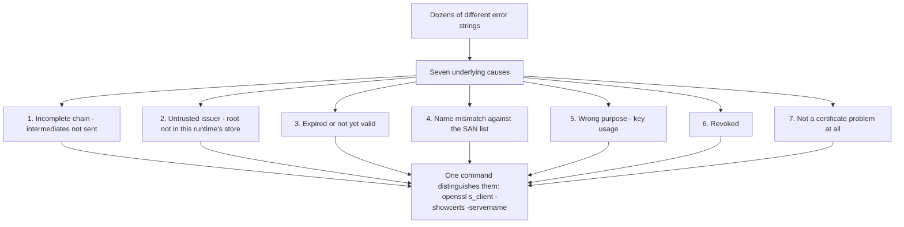
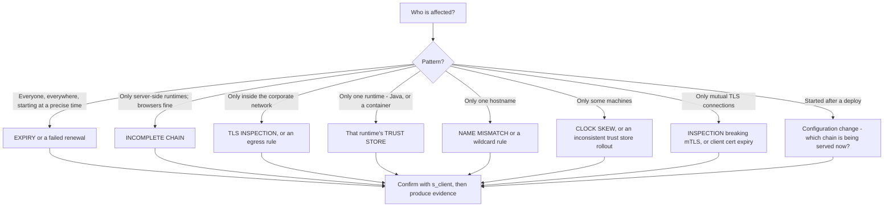
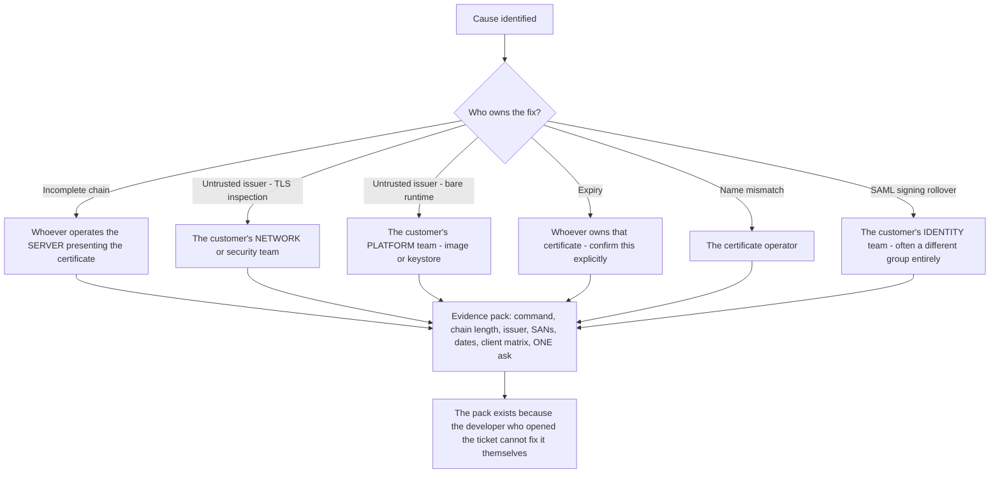
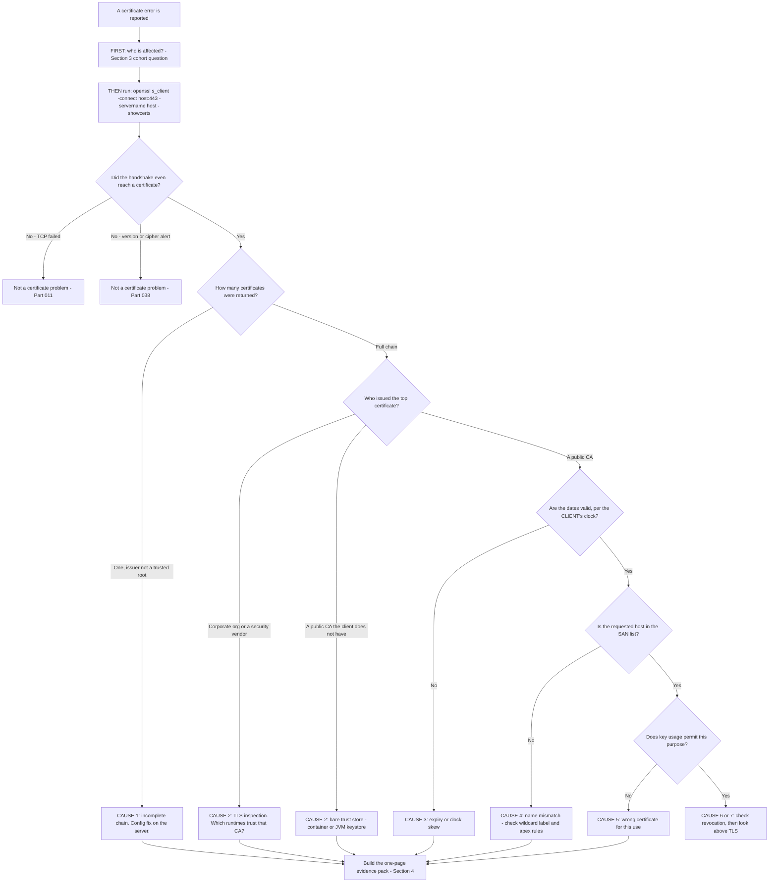

# Part 039 - Certificate Failures in Real Support Cases

> Section goal: Consolidate Parts 037 and 038 into a symptom-to-cause catalog for the certificate problems you will actually meet. Certificate failures share a small number of causes but produce dozens of different error strings across clients, so the skill is recognising the cause behind unfamiliar wording.

Covers index item **039**. Maps to JD signals: *knowledge of encryption*, *strong analytical and problem-solving skills*, *instinctive ability to subdivide problems into basic components*, *serve as internal and external point of contact*, and *proactivity — take preemptive action against potential problems*.

---

## 1. Start From Zero: Many Messages, Few Causes

Certificate errors are unusually confusing because **every client library words them differently**, while the underlying causes number about seven.

> **Analogy.** Seven medical conditions that present as "chest pain" across a dozen different vocabularies depending on who is describing it. The descriptions vary enormously; the diagnostic tests do not.
>
> **Where it stops:** medical vocabulary is at least standardised within a language. TLS libraries genuinely invent their own phrasing, so you must map wording to cause rather than memorising strings.

### 🔍 Plain-English deep-dive: why the same cause reads differently in every client

Each TLS implementation writes its own messages, and they emphasise different things.

**Cause: incomplete chain.** Five clients, five wordings:

| Client | Message |
|---|---|
| OpenSSL / curl | `unable to get local issuer certificate` |
| Node.js | `UNABLE_TO_VERIFY_LEAF_SIGNATURE` |
| Python `requests` | `certificate verify failed: unable to get local issuer certificate` |
| Java | `PKIX path building failed` |
| Browser | Often **works** — the intermediate was cached |

**Cause: untrusted root.** Same five clients again:

| Client | Message |
|---|---|
| OpenSSL / curl | `self-signed certificate in certificate chain` |
| Node.js | `SELF_SIGNED_CERT_IN_CHAIN` |
| Python | `certificate verify failed: self signed certificate in certificate chain` |
| Java | `unable to find valid certification path to requested target` |
| Browser | `NET::ERR_CERT_AUTHORITY_INVALID` |

**Two practical consequences:**

1. **Do not try to memorise error strings.** Learn the seven causes and the one command that distinguishes them.
2. **The client identity is itself evidence.** "Java says PKIX path building failed" tells you both the cause family *and* that they are on a JVM with its own keystore — which narrows the fix immediately.

**The genuinely confusing part** is that "unable to get local issuer" and "self-signed in chain" can both arise from an incomplete chain or an untrusted root, depending on what the server sent. That ambiguity is exactly why you run the command rather than reasoning from the message.

**Analogy:** the same fault code reported in five dialects. Learning the dialects is endless; learning the fault is finite. **Where it stops:** some messages genuinely are precise — "certificate has expired" means exactly that — so read them, just do not rely on them.

---

## 2. The Seven Causes

### Cause 1 — Incomplete chain

| | |
|---|---|
| **Symptom** | Works in a browser, fails in every server-side runtime and container |
| **Why** | Server sent only the leaf; browsers cache or fetch intermediates, runtimes do not |
| **Diagnostic** | `s_client -showcerts` returns **one** certificate whose issuer is not a trusted root |
| **Fix** | Server configuration — serve the full chain. **Not a reissue** |
| **Who owns it** | Whoever operates the server presenting the certificate |

### Cause 2 — Untrusted issuer

| | |
|---|---|
| **Symptom** | Browser works, one specific runtime fails; or everything fails on a container |
| **Why** | The issuing root is not in *that runtime's* trust store — commonly corporate TLS inspection, or a bare container image |
| **Diagnostic** | Read the **issuer**. Corporate name or security vendor = inspection (Part 023) |
| **Fix** | Add the CA to that runtime's trust source |
| **Who owns it** | The customer's platform or network team |

### Cause 3 — Expired or not yet valid

| | |
|---|---|
| **Symptom** | Total failure at a precise moment, no deployment |
| **Why** | Renewal automation failed, or the client's clock is wrong |
| **Diagnostic** | Read not-before and not-after; compare against the client's clock |
| **Fix** | Renew, or fix time sync |
| **Who owns it** | Whoever operates the certificate — or their monitoring |

### Cause 4 — Name mismatch

| | |
|---|---|
| **Symptom** | Consistent hard failure for one hostname |
| **Why** | Requested name is not in the SAN list; wildcard label or apex rules (Part 037) |
| **Diagnostic** | List the SANs and compare exactly |
| **Fix** | Reissue with the correct names, or correct the hostname used |
| **Who owns it** | The certificate operator |

### Cause 5 — Wrong purpose

| | |
|---|---|
| **Symptom** | `unsupported certificate purpose`, or an mTLS rejection |
| **Why** | Extended key usage does not permit this use — e.g. a signing certificate presented for TLS |
| **Diagnostic** | Inspect the key usage extensions |
| **Fix** | Use the right certificate |
| **Who owns it** | Whoever configured it |

### Cause 6 — Revoked

| | |
|---|---|
| **Symptom** | Rare; some clients fail, most proceed |
| **Why** | Revocation is soft-fail almost everywhere (Part 037) |
| **Diagnostic** | Check the CRL or OCSP status explicitly |
| **Fix** | Reissue |
| **Who owns it** | The certificate operator |

### Cause 7 — Not a certificate problem

| | |
|---|---|
| **Symptom** | Reported as a certificate error but the evidence does not fit |
| **Why** | TCP dropped, a version or cipher mismatch, an application-layer close, or a proxy error page |
| **Diagnostic** | Part 038's three questions: TCP? handshake? stays open? |
| **Fix** | Depends entirely |
| **Who owns it** | Depends entirely |

---

## 3. The Cohort Question

From Part 009: **who is affected discriminates faster than any error message.**

**Ask the cohort question first.** It routes to a cause in one exchange, before you have looked at anything.

---

## 4. The Evidence Pack

From Part 023: when the fault is on the customer's side, your deliverable is evidence their own team will accept.

A certificate evidence pack contains:

| Element | Why |
|---|---|
| The **exact command** you ran | Reproducible on their side |
| **Chain length** — how many certificates the server sent | Proves or excludes an incomplete chain |
| The **issuer** of the top certificate | Reveals inspection |
| The **SAN list** | Settles name questions |
| **Validity dates** | Settles expiry |
| **Which clients succeed and which fail**, with each one's trust source | Isolates a runtime trust store |
| The **exact error** from each failing client | So their team recognises it |
| **One concrete ask** | "Serve the full chain", "add the CA to the JVM keystore", "exclude these hosts from inspection" |

**Under one page, ending in one ask.** That is what gets acted on.

### 🔍 Plain-English deep-dive: why the pack matters more than the diagnosis

You can identify the cause in five minutes. The ticket can still sit open for three weeks — and understanding why is what separates a resolved ticket from a resolved problem.

The developer who opened it usually **cannot fix it themselves**. An incomplete chain is fixed by whoever runs the server. TLS inspection is a network policy. A JVM keystore is a platform decision. A SAML signing certificate belongs to an identity team that may not even know this integration exists.

So your diagnosis has to travel — through a person who did not make it, to a team that has no context and no reason to trust a summary relayed second-hand.

**What survives that journey:**

| Survives | Does not survive |
|---|---|
| A command they can run themselves and see the same output | "The vendor says it's our chain" |
| Exact error text from *their* client | A paraphrase |
| A concrete, single ask | "Please investigate" |
| Which clients work and which fail | "It's broken" |

**The rule: write the pack for the team who will act on it, not for the person who reported it.** Keep it to one page, make every claim independently verifiable, and end with one sentence naming exactly what you need changed.

**Analogy:** a diagnosis handed to a patient who must persuade a specialist they have never met. Test results and a specific referral travel; "the other doctor thought it might be this" does not. **Where it stops:** a specialist will re-run tests. A network team will simply not act on an unverifiable claim, and the ticket stalls silently.

---

## 5. Expiry Prevention

Expiry is the most preventable certificate failure and one of the most common. Short lifetimes (Part 037) have made it *more* frequent, not less, because there are more renewals to fail.

| Control | What it catches |
|---|---|
| **Monitor renewal, not just expiry** | A failed renewal, days before it becomes an outage |
| **Alert well before the lifetime** | An alert at 30 days is useless for a 45-day certificate |
| **Monitor every certificate, not just the public one** | SAML signing, client certificates, internal CAs |
| **Track certificates you do not own** | Upstream IdP signing certificates (Part 037 §6) |
| **Test renewal in a lower environment first** | Automation breaks silently |

### 🔍 Plain-English deep-dive: the certificates customers forget

Public TLS certificates are usually monitored. These frequently are not, and each produces an outage that looks mysterious:

| Forgotten certificate | Outage it causes | Why it is forgotten |
|---|---|---|
| **SAML IdP signing certificate** | Federated login stops; "invalid signature" | Owned by a different team, often the customer's own IT |
| **SAML SP encryption certificate** | The IdP cannot encrypt assertions | Rarely changed, easily overlooked |
| **mTLS client certificate** | Client authentication fails | Not a *server* certificate, so it misses server monitoring |
| **Internal CA root** | Everything signed by it fails at once | Decade-long lifetime — nobody who set it up is still there |
| **Custom identity domain certificate** | The login page itself becomes unreachable | Managed by the platform or by the customer, and each assumes the other |
| **Code signing certificate** | Deployments fail, not logins | Different pipeline entirely |

**The proactive move, and it is genuinely valuable:** when you are already looking at a customer's configuration for another reason, note the expiry dates of any certificates you can see and mention the ones approaching. That converts a reactive ticket into a prevented incident, and it is precisely the JD's *"proactivity — identify opportunities and take preemptive action against potential problems."*

**The last row deserves emphasis.** With a custom identity domain, responsibility for the certificate can sit with the platform or with the customer depending on how it was configured — and "each assumed the other was handling it" is a real and recurring cause of outage. Confirming ownership explicitly is worth one sentence.

**Analogy:** a building where the front door lock is serviced on contract and nobody remembers who is responsible for the fire escape. **Where it stops:** you can walk round a building and see every door. Certificates are invisible until they fail.

---

## 6. Failure Modes

| Failure mode | What it looks like | Consequence | Correction |
|---|---|---|---|
| **Reasoning from the error string** | Trying to match unfamiliar wording | Misdiagnosis across clients | Run the command; map to one of seven causes |
| **Assuming the browser is authoritative** | "It works for me" | Miss an incomplete chain entirely | Test the failing runtime specifically |
| **Advising a reissue for a chain problem** | Customer buys a new certificate | Cost and delay, and it does not fix it | Configuration change |
| **Missing `-servername`** | Wrong certificate inspected | False name mismatch | Always pass SNI (Part 038) |
| **Ignoring the cohort question** | Diving into evidence first | Slower, and sometimes wrong | Ask who is affected |
| **Only monitoring public TLS certificates** | SAML or mTLS certificate expires | Unmonitored outage | Inventory every certificate |
| **Alerting too close to expiry** | 30-day alert on a 45-day certificate | Alert fires after renewal should have run | Alert relative to lifetime |
| **Assuming revocation will protect them** | Relying on CRL or OCSP | Soft-fail means it usually will not | Short lifetimes are the real control |
| **Advising verification bypass** | "Just disable it to test" | Ships to production | Never; diagnose properly |
| **Not confirming ownership** | Custom domain certificate lapses | "We thought you handled it" | Confirm explicitly, in writing |
| **Treating "cert error" as one problem** | Single hypothesis | Wrong cause pursued | Seven causes, one command |

---

## 7. Troubleshooting Decision Tree: Any Certificate Error

### Worked example

*"Our Java integration started failing this morning with 'PKIX path building failed'. Our .NET service on the same network is fine. Nothing changed."*

1. **Cohort question first.** One runtime fails, another on the same network succeeds. That immediately excludes expiry, name mismatch, and network-level causes — all of which would affect both.
2. **The client identity is evidence.** "PKIX" means a JVM, which has **its own keystore** separate from the operating system store. That is the strongest single clue.
3. **Run the command** from the same host. The chain returns fully, and the issuer is a **public CA**.
4. **So the certificate is fine** — the problem is that the JVM does not trust that CA.
5. **Ask what changed.** They insist nothing did. **Ask specifically what was rebuilt or redeployed** (Part 009). The Java service was rebuilt overnight on a newer base image.
6. **Root cause:** the new base image ships a different or older JDK with a different bundled `cacerts` keystore, missing the CA that issued this certificate. Their .NET service uses the OS store, which has it — hence the split.
7. **Fix:** import the CA into the JVM's truststore, or use a base image whose JDK keystore is current, or configure the JVM to use the OS trust store where supported.
8. **What not to do:** disable certificate validation in the JVM. Say so explicitly.
9. **The concept to teach:** every runtime has its own trust source. The OS store, the JVM keystore, Node's bundled CAs, Python's certifi, and a container's image are five independent things. "It works on the same machine" proves nothing across runtimes.
10. **Proactive addition:** ask whether other JVM services use the same base image, because they will fail on their next restart. That is a prevented incident.

Note that steps 1 and 2 reached the cause family before any command was run — the cohort plus the client identity did most of the work.

---

## 8. Lab: Build a Certificate Failure Catalog

**Purpose.** Produce every failure across multiple clients so you recognise the cause behind unfamiliar wording.

**Prerequisites.** Part 037's local CA and HTTPS server, Part 038's lab. curl, Node, Python, and a browser. **Your own systems only.**

**Steps.**

1. Create `okta-prep/labs/039-cert-failures/`.
2. **Multi-client harness.** Write a small script that fetches a given HTTPS URL from **four** clients — curl, Node, Python, and `openssl s_client` — and prints each result. This is the tool you will use for every step.
3. **Baseline.** Point it at your Part 037 server with the full chain and your root trusted. Record four successes.
4. **Cause 1 — incomplete chain.** Serve only the leaf. Run the harness. **Record all four messages verbatim.** Then open it in a browser that has previously seen your intermediate and record whether it succeeds.
5. **Cause 2 — untrusted issuer.** Remove your root from the trust store. Run the harness. **Record all four messages.** Note where each client looks for trust anchors.
6. **Cause 3 — expiry.** Serve an already-expired leaf, then one that is not yet valid. Record all messages for both.
7. **Cause 4 — name mismatch.** Serve a certificate whose SAN does not include `localhost`. Record all messages. Then test the three wildcard cases from Part 037 and record which fail.
8. **Cause 5 — wrong purpose.** Serve a certificate marked for code signing. Record the messages.
9. **Cause 7 — not a certificate problem.** Produce two non-certificate failures reported similarly: a closed port, and a version mismatch. Record how each *reads* and note why it could be mistaken for a certificate error.
10. **Java, if available.** Repeat causes 1 and 2 with a JVM client and record the PKIX wording. If a JVM is not available, note that explicitly rather than inventing the output.
11. **Build the catalog.** Write `cert-error-map.md` — a matrix of **cause × client**, with every message you personally recorded. Mark any cell you could not produce.
12. **Evidence pack template.** Write `cert-evidence-pack.md` using §4's elements, filled in with the incomplete-chain case as a worked example. Under one page, ending in one ask.
13. **Expiry inventory template.** Write `cert-inventory.md` — a checklist covering all six forgotten certificate types from §5, with an owner column and a monitoring column.
14. **Failure catalog + manifest.** Add rows. Complete `MANIFEST.md`, noting honestly which cells you could not fill.

**Expected evidence.** A working four-client harness, verbatim messages for at least five causes across four clients, a browser contrast on the incomplete chain, two non-certificate failures for comparison, a cause-by-client matrix, an evidence pack, and an inventory template.

**Validation rubric.**

| Check | Pass condition |
|---|---|
| Harness works | Four clients, one command |
| Messages verbatim | Copied exactly, not paraphrased |
| Browser contrast | Browser behavior recorded and explained |
| Five causes covered | Minimum, across all available clients |
| Non-certificate cases | Two included, with why they could be misread |
| Matrix honest | Unfillable cells marked, not invented |
| Evidence pack | One page, one ask |
| Inventory covers the forgotten six | All types listed with owner and monitoring columns |

**Cleanup and privacy.** Your own local CA and server only. **Remove your root from the user trust store when finished** and delete all keys. Never install a certificate on a machine you do not own, and never test against a third-party host.

---

## 9. JD Mapping

| Supplied JD signal | How this Part supports it |
|---|---|
| **Knowledge of encryption** | Applied certificate diagnosis across real client behavior |
| Strong analytical and problem-solving skills | Seven causes, one command, one matrix |
| **Instinctive ability to subdivide problems** | §3's cohort question routes before any evidence is gathered |
| **Serve as internal and external point of contact** | §4's evidence pack is written for the customer's own team |
| **Proactivity** | §5's forgotten-certificate inventory and the "mention what you notice" habit |
| Resolve issues in a timely fashion | Cohort plus client identity often reaches the cause in one exchange |
| Promote best practices | Monitor renewal not expiry; confirm ownership; never bypass verification |

---

## 10. Candidate Honesty Note

- **Production transfer (strong):** certificate troubleshooting is on your CV. This Part systematises it and adds the identity-specific cases.
- **The strongest thing you can say:** *"There are dozens of certificate error strings and about seven actual causes. I don't reason from the wording, because every library phrases it differently — I ask who's affected, then run one `openssl s_client` command and map to a cause. The client's identity is evidence in itself: 'PKIX path building failed' tells me both the cause family and that they're on a JVM with its own keystore."*
- **A second strong point:** *"Advising a customer to reissue a certificate for an incomplete chain is a common and expensive mistake — it's a server configuration change, not a certificate problem. They just need to serve the intermediates."*
- **A third, and it is a genuine proactive contribution:** *"The certificates customers forget aren't the public TLS ones — those are usually monitored. It's SAML signing certificates owned by a different team, mTLS client certificates that miss server monitoring, and custom domain certificates where each side assumed the other was handling it. If I'm already looking at a configuration for another reason, I'll note the expiry dates I can see and flag the ones approaching."*
- **A fourth:** *"Every runtime has its own trust source — OS store, JVM keystore, Node's bundle, Python's certifi, a container image. So 'it works on the same machine' proves nothing across runtimes, and that split is often the whole diagnosis."*
- **Do not claim** PKI operations experience. You diagnose certificate failures and produce evidence packs — which is the role.

---

## 11. Official Source Anchors

Accessed **26 August 2026**.

| Source | What it defines |
|---|---|
| IETF RFC 5280 | Path validation — the formal basis of the seven causes |
| IETF RFC 6125 | Name matching and wildcard rules |
| OpenSSL `s_client` and `verify` documentation | The diagnostic command and its error codes |
| Node.js TLS documentation and `NODE_EXTRA_CA_CERTS` | Node's trust source and how to extend it |
| Python `certifi` and `requests` documentation | Python's trust source |
| Java documentation — `cacerts`, `keytool`, PKIX | The JVM keystore in §7's worked example |
| Browser certificate error references | Browser-specific wording |
| Auth0 and Okta documentation — custom domains and certificate management | Ownership boundaries in §5 |
| Microsoft Learn — AD FS and Entra ID certificate rollover | The SAML signing certificate case |

**Revalidate after 26 August 2026:** client-specific error wording changes between versions. Build your matrix from your own observations.

---

## ⭐ Likely Interview Questions for This Section

### Q1. "A customer reports a certificate error. What's your first move?"
> *Model answer:* "Ask who's affected, before looking at any evidence. Everyone everywhere starting at a precise time is expiry. Only server-side runtimes while browsers work is an incomplete chain. Only inside the corporate network is TLS inspection or an egress rule. Only one runtime — Java, or a container — is that runtime's trust store. Only one hostname is a name mismatch. That question routes to a cause family in one exchange. Then I run `openssl s_client -connect host:443 -servername host -showcerts` and read six things: version, cipher, how many certificates came back, the issuer, the SANs, and the dates. There are dozens of error strings across clients and about seven actual causes, so I map to a cause rather than trying to interpret unfamiliar wording."

### Q2. "'Works in my browser, fails on our server.' Why, and what do you tell them?"
> *Model answer:* "Almost always an incomplete chain. The server has to send its leaf plus every intermediate, because only the root is pre-installed. Browsers often succeed anyway because they cached that intermediate from another site or fetch it automatically; a Node or Python client, a JVM, or a fresh container has nothing cached and fails. So their evidence is genuinely real, which is why they push back, and I'd acknowledge that rather than contradicting them. The confirmation is counting the certificates `s_client` returns — one, with an issuer that isn't a trusted root, is decisive. And the important part of the advice is that the fix is a server configuration change, concatenating the intermediates into the served bundle. Customers frequently assume they need to buy a new certificate, and telling them they don't saves real cost and delay."

### Q3. "Java fails with 'PKIX path building failed' but .NET on the same machine works. What's happening?"
> *Model answer:* "The JVM has its own truststore — `cacerts` — completely separate from the operating system store that .NET uses. So the certificate is fine and the split is entirely about trust sources. The most common cause is a rebuild onto a base image with a different or older JDK whose bundled keystore doesn't have the issuing CA. That's also why 'nothing changed' is usually true from the customer's side: their code didn't change, their base image did. The fix is importing the CA into the JVM truststore, or moving to an image with a current JDK, or configuring the JVM to use the OS store where that's supported. What I'd never advise is disabling validation in the JVM. And I'd ask whether other JVM services share that base image, because they'll fail on their next restart — that turns one ticket into a prevented incident."

### Q4. "Which certificates do customers forget to monitor?"
> *Model answer:* "Almost never the public TLS certificate — that one's usually watched. It's the others. SAML identity provider signing certificates, which are owned by a different team, often the customer's own IT, and cause 'invalid signature' failures at rollover. mTLS client certificates, which miss server-certificate monitoring because they aren't server certificates. Internal CA roots with decade-long lifetimes where nobody who set them up is still there. And custom identity domain certificates, where responsibility can sit with the platform or with the customer depending on configuration, and 'we each thought the other was handling it' is a real recurring cause of outage. So confirming ownership explicitly is worth one sentence. If I'm already in a customer's configuration for another reason, I'll note expiry dates I can see and flag the ones approaching."

### Q5. "Why has short-lifetime certificates made expiry outages more common?"
> *Model answer:* "Because there are far more renewals, and each one is a chance for automation to fail. A certificate that lived two years failed to renew once every two years; one that lives six weeks has nine renewal events a year. The trade-off is deliberate — short lifetimes shrink the window in which a compromised key is useful, which matters because revocation is soft-fail almost everywhere and can't be relied on. But the operational consequence is that renewal automation becomes critical infrastructure rather than a convenience. Two things follow for monitoring: alert on *renewal* rather than just expiry, so a failure surfaces days before it becomes an outage; and set the alert threshold relative to the lifetime, because a thirty-day warning is meaningless on a forty-five-day certificate. And certificate pinning becomes actively harmful, because it guarantees breakage at every rotation."

### Q6. "What goes in a certificate evidence pack?"
> *Model answer:* "Enough that the customer's own team can act without needing me, and it should fit on one page. The exact command I ran, so it's reproducible on their side. How many certificates the server actually returned, which proves or excludes an incomplete chain. The issuer of the top certificate, which reveals TLS inspection. The SAN list and the validity dates, which settle name and expiry questions. Which clients succeed and which fail, with each one's trust source named, because that isolates a runtime keystore problem. The verbatim error from each failing client, so their team recognises the wording they'll see themselves. And one concrete ask — 'serve the full chain', or 'add this CA to the JVM truststore', or 'exclude these hostnames from TLS inspection'. The single ask is what makes it actionable rather than informative."

### Q7. "A customer wants to disable certificate verification to get past an error. What do you say?"
> *Model answer:* "No, and then I'd solve the actual problem, because that request is always a symptom. Disabling verification means the connection is encrypted but unauthenticated — they'd accept any certificate including an attacker's, undetectably. And the thing about a debugging workaround is that it ships; I've seen `--insecure` in production CI pipelines that started as a five-minute test. So I'd reframe: the error is the diagnosis, not an obstacle. It's telling them one of seven specific things, and each has a proper fix — serve the full chain, add the CA to that runtime's trust store, renew, correct the SANs. Every one of those is a real change someone can make. I'd also point out that if TLS inspection is involved, disabling verification converts a *managed* interception into an *unmanaged* vulnerability, which is meaningfully worse than where they started."

### Q8. "How do you avoid getting lost in unfamiliar error wording?"
> *Model answer:* "By not reasoning from the wording at all. Every TLS library invents its own phrasing — an incomplete chain reads as 'unable to get local issuer certificate' in OpenSSL, `UNABLE_TO_VERIFY_LEAF_SIGNATURE` in Node, 'PKIX path building failed' in Java, and often just works in a browser. Memorising those is endless; learning the seven underlying causes is finite. So I ask the cohort question, run one command, and map to a cause. The one useful thing I *do* take from the wording is the client's identity — 'PKIX' tells me it's a JVM with its own keystore, which narrows the fix immediately. And I keep a matrix of cause by client built from failures I've produced myself in a lab, so when I see wording I don't recognise I can usually place it by shape rather than by memory."

---

## 🧠 30-Second Memory Hooks

- **Dozens of messages, SEVEN causes:** incomplete chain · untrusted issuer · dates · name · purpose · revoked · **not a certificate problem**.
- **Ask the COHORT question first.** Who is affected routes to a cause before any evidence.
- **The client's identity is evidence.** "PKIX" = JVM keystore. Node error codes = Node's bundle.
- **One command, six facts:** `openssl s_client -connect host:443 -servername host -showcerts`.
- **"Works in browser, fails on server" = incomplete chain.** Fix is **server config, not a reissue**.
- **Five independent trust sources:** OS store · JVM `cacerts` · Node bundle · Python certifi · container image.
- **"Works on the same machine" proves nothing across runtimes.**
- **Forgotten certificates:** SAML signing · SP encryption · mTLS client · internal CA root · **custom domain (ownership ambiguity)**.
- **Monitor RENEWAL, not expiry.** Alert relative to lifetime — 30 days is useless on a 45-day certificate.
- **Revocation is soft-fail.** Short lifetimes are the real control, so renewal automation is critical infrastructure.
- **Never bypass verification.** The error *is* the diagnosis.

---

## ✅ Completion Checklist

- [ ] **Knowledge:** I can name the seven causes, the cohort question, and the five distinct runtime trust sources.
- [ ] **Lab artifact:** `039-cert-failures/` contains a four-client harness, verbatim messages for five-plus causes, a browser contrast, a cause-by-client matrix, an evidence pack, and an inventory template.
- [ ] **Spoken:** I can deliver the "works in browser, fails on server" answer including the no-reissue point, in under 45 seconds.
- [ ] **Honesty check:** my root CA was removed from the trust store and all keys deleted; unfillable matrix cells are marked rather than invented.
- [ ] **Source check:** I have read RFC 5280's path validation section and my own runtimes' trust-store documentation.

---

*Next suggested section:* **[Part 040 - Base64, Base64url, PEM, DER, and Safe Decoding](Part-040-base64-base64url-pem-der-and-safe-decoding.md)** — the encodings identity runs on, and how to decode them locally without ever sending a customer's token to a third party.
