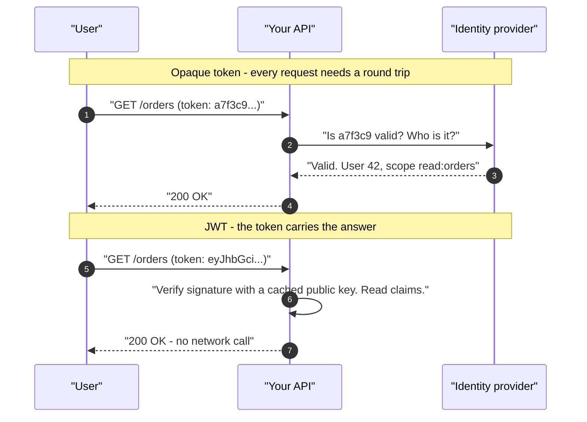
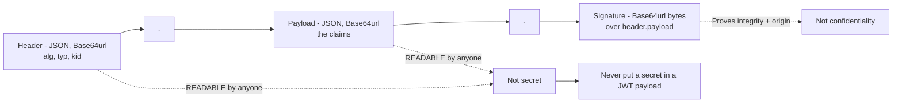
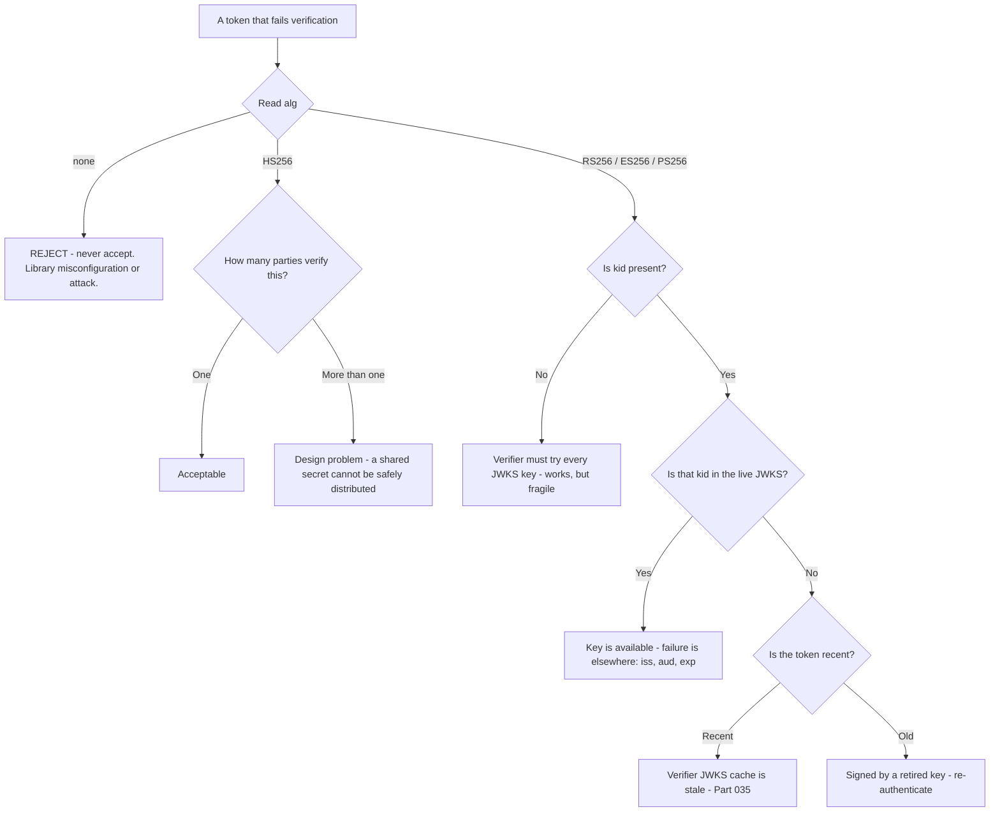
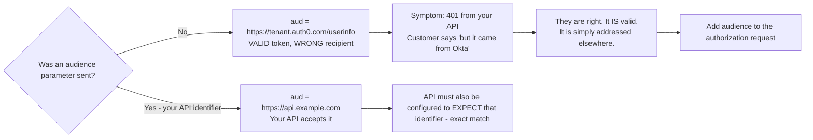
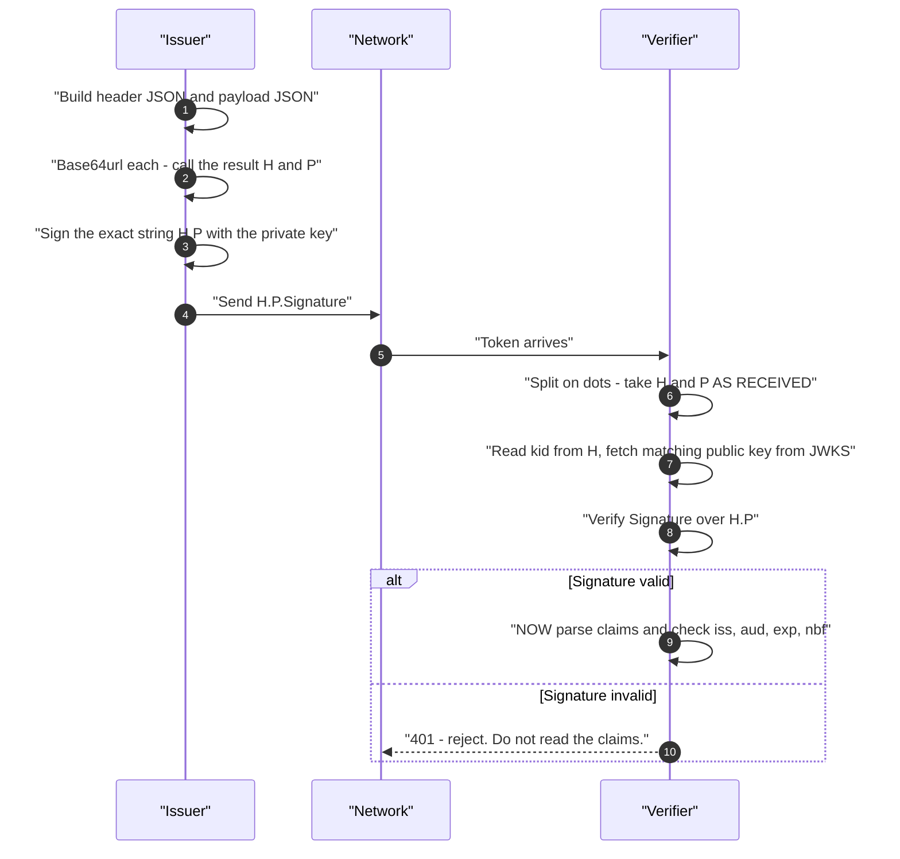
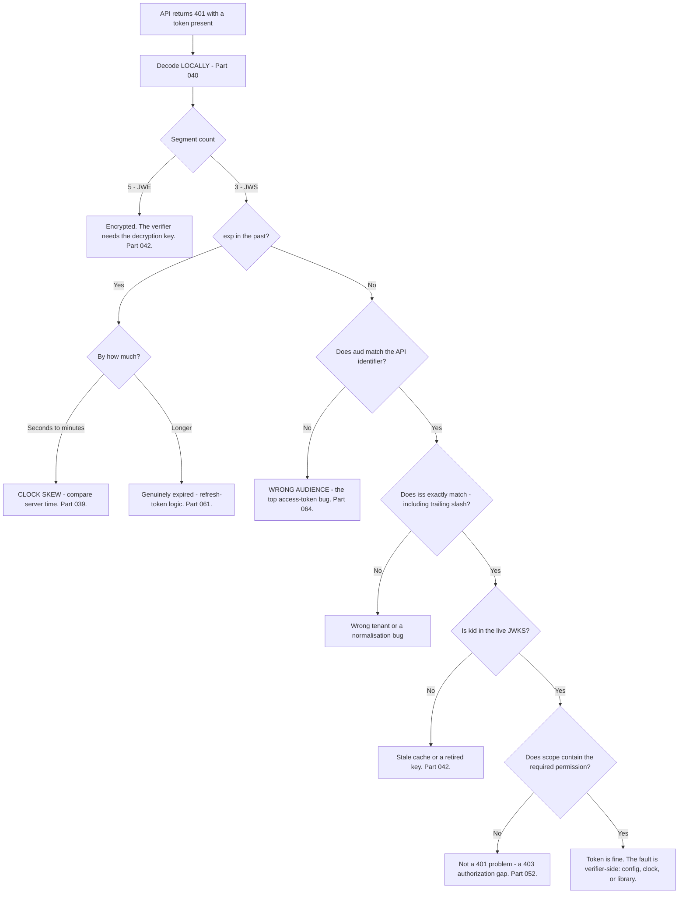

# Part 041 - JWT Anatomy From Zero

> Section goal: Take a JSON Web Token completely apart — every segment, every registered claim, every header field — so that reading a token becomes a five-second diagnostic rather than a puzzle. Most identity tickets are answered by six values inside a token; this Part teaches you which six and what each one means.

Covers index item **041**. Maps to JD signals: *knowledge of encryption*, *basic security concepts*, *strong analytical and problem-solving skills*, *experience with troubleshooting web applications*, and *exceed expectations on response quality*.

---

## 1. Start From Zero: What Problem a JWT Solves

Before JWTs, if service A wanted to tell service B "this user is authenticated," B had to **ask A** — a network call on every request.



A JWT is a **self-contained, signed statement**. The recipient verifies the signature and reads the claims — no call back to the issuer.

> **Analogy.** A passport versus a phone call to the passport office. The passport carries the claims (name, nationality, expiry) and the security features that prove it was issued by a real authority. A border officer verifies it in seconds without ringing anyone.
>
> **Where it stops:** a passport can be reported stolen and checked against a list. A plain JWT cannot be recalled once issued — it is valid until `exp`. That single difference drives almost every JWT design decision, and it is Part 045's whole subject.

### The trade this makes

| Gains | Costs |
|---|---|
| No network call to validate | **Cannot be revoked before `exp`** |
| Scales horizontally — any server can verify | Larger than an opaque token (~33% Base64 overhead) |
| Works across organisations | Claims are **readable by anyone** holding it |
| Standard format, wide library support | Stale claims — a role revoked at 10:00 still appears until expiry |

**That second row on the right is why access-token lifetimes are short** (Part 045), and why every "we removed their access but they can still call the API" ticket has the same answer.

---

## 2. The Three Segments

A JWS-format JWT — the kind you will see 95% of the time — is three Base64url segments joined by dots:

```
eyJhbGciOiJSUzI1NiIsImtpZCI6IkFCQyJ9 . eyJpc3MiOiJodHRwczovL2Rldi5va3RhLmNvbS8ifQ . SflKxwRJSMeKKF2QT4f...
└──────────── header ─────────────┘   └──────────── payload ────────────┘   └──── signature ────┘
```



| Segment | Contents | Encoding | Secret? |
|---|---|---|---|
| **Header** | Metadata about the token itself | Base64url of JSON | ❌ Public |
| **Payload** | The claims | Base64url of JSON | ❌ **Public** |
| **Signature** | Cryptographic proof | Base64url of raw bytes | ❌ Public, but unforgeable |

### The single most important sentence in this Part

> **A JWT payload is signed, not encrypted. Anyone holding the token can read every claim.**

This produces a recurring, high-consequence ticket class: a developer putting an internal user ID, an email, a phone number, or — genuinely observed — an API key into a custom claim, and shipping it to a browser. Part 052 covers claim minimisation properly.

---

## 3. The Header

```json
{
  "alg": "RS256",
  "typ": "JWT",
  "kid": "kXY7...Qw"
}
```

| Field | Meaning | Why it matters in support |
|---|---|---|
| **`alg`** | Signing algorithm | `RS256` = asymmetric (JWKS). `HS256` = shared secret. **`none` must always be rejected.** |
| **`typ`** | Token type | Usually `JWT`. `at+jwt` marks an access token (RFC 9068) |
| **`kid`** | Key ID | Tells the verifier **which key** signed it — the heart of rotation (Part 042) |
| `cty` | Content type | Rare; used for nested tokens |
| `x5t` / `x5c` | Certificate thumbprint / chain | Used when the key travels as a certificate rather than a JWK |

### 🔍 Plain-English deep-dive: why `alg` and `kid` are the first two things you read

Given a failing token, these two header fields eliminate more possibilities than anything else in the token.

**`alg` tells you the entire trust model.**

- `RS256` / `ES256` / `PS256` — asymmetric. The issuer signs with a private key; verifiers fetch the **public** key from JWKS. Anyone can verify, nobody else can sign. This is what federation requires (Part 035).
- `HS256` — symmetric. The same secret signs and verifies. Fine for one service verifying its own tokens; **impossible** to distribute safely to multiple parties, because anyone who can verify can also forge.
- `none` — unsigned. Legitimate only in specific nested-token cases; in practice, seeing it means someone has misconfigured a library or is attacking you.

So `alg: HS256` on a token that three different services need to verify is a design problem you can name immediately.

**`kid` tells you whether the verifier could possibly have found the key.**

A `kid` present in the token but **absent from the issuer's JWKS** produces "unable to find a signing key" — and the two causes are opposite: the JWKS was rotated and the verifier's cache is stale, or the token is old and was signed with a key that has since been retired. Comparing the token's `kid` against the live JWKS answers it in one step.



**Analogy:** the security-feature page of a passport, and the serial of the machine that printed it. The first tells the officer *how* to check; the second tells them *which* reference to check against. **Where it stops:** a passport's features are physical and fixed for its lifetime. A JWKS key set changes underneath you, which is why the `kid`-versus-live-JWKS comparison is a live check rather than a lookup.

---

## 4. The Payload: Registered Claims

RFC 7519 defines seven **registered claims**. Learn these cold — they answer most tickets.

| Claim | Name | Meaning | The failure it causes |
|---|---|---|---|
| **`iss`** | Issuer | Who issued the token | Mismatch → "invalid issuer". Trailing-slash bugs are epidemic |
| **`sub`** | Subject | Who the token is about — the stable user ID | Assuming it is an email; it is **opaque and provider-specific** |
| **`aud`** | Audience | Who the token is **for** | The single most common access-token bug (Part 043) |
| **`exp`** | Expiration | Unix seconds after which it is invalid | "Token expired" — or clock skew |
| **`nbf`** | Not before | Unix seconds before which it is invalid | Clock skew makes a fresh token "not yet valid" |
| **`iat`** | Issued at | Unix seconds when issued | Used for freshness and max-age checks |
| **`jti`** | JWT ID | Unique identifier | Replay detection; must be unique per token |

### Timestamps are Unix seconds, not milliseconds

```
"exp": 1787500800   ✅ seconds  (10 digits)
"exp": 1787500800000 ❌ milliseconds (13 digits)
```

**A 13-digit timestamp is a bug**, and it produces a bizarre symptom: a token that appears valid for approximately 54,000 years. JavaScript's `Date.now()` returns milliseconds, so this happens whenever someone hand-builds a token in Node — which is exactly what happens in custom test harnesses and in Actions (Part 103).

**The reverse also happens:** dividing by 1000 without flooring produces a fractional `exp`, which some strict libraries reject outright.

### Common non-registered claims

| Claim | Typical meaning |
|---|---|
| `scope` | Space-delimited OAuth scopes (Part 052) |
| `azp` | Authorized party — the client the token was issued to |
| `client_id` | The OAuth client |
| `nonce` | Replay protection for ID tokens (Part 065) |
| `auth_time` | When the user actually authenticated — the basis of step-up (Part 049) |
| `acr` / `amr` | Authentication context / methods used |
| `email`, `name`, `picture` | OIDC standard profile claims (Part 071) |
| Namespaced custom claims | e.g. `https://myapp.example.com/roles` — Auth0 requires this shape (Part 103) |

### 🔍 Plain-English deep-dive: `iss` and `aud` are a from-address and a to-address

Two claims cause more tickets than the other five combined, and they are easier to reason about as an envelope.

**`iss` is the from-address.** It says which authorization server minted this token. The verifier compares it against the issuer it was configured to trust — as an **exact string**, not a normalised URL.

That exactness is the trap. `https://tenant.us.auth0.com` and `https://tenant.us.auth0.com/` are different strings, and the second one is what Auth0 actually issues. A verifier configured by hand with the first will reject every token, with an error that says "invalid issuer" and gives no hint that the difference is one character. **The fix is always the same: copy the issuer from the discovery document, never type it.**

**`aud` is the to-address.** It says which recipient this token is for. And this is where the intuition breaks, because `aud` behaves differently for the two token types:

| | ID token | Access token |
|---|---|---|
| `aud` is set to | Your **client ID** | The **API identifier** you requested |
| Meaning | "This is about a user, and it's for you, the app" | "This grants access to *that* API" |
| Who validates it | Your application | The **API**, not the app |
| If it's wrong | Login fails | **401 from the API** |

**The consequence:** an access token requested without an `audience` parameter does not fail. It succeeds, and you get a perfectly valid token addressed to the authorization server's own UserInfo endpoint. It looks right, it verifies, and your API rejects it — because it was never for your API.



**Analogy:** a correctly franked, genuinely posted letter delivered to the wrong building. Nothing about it is forged; the postage is real. It is simply not addressed to you, and no amount of examining the stamp will change that. **Where it stops:** a misdelivered letter is obvious from the envelope. A wrong-audience token looks completely normal until you decode it and read one field — which is exactly why the six-value read in §6 exists.

---

## 5. The Signature

The signature is computed over the **first two segments as they appear**, joined by a dot:

```
signature = Sign( base64url(header) + "." + base64url(payload), key )
```



### Two consequences worth internalising

**1. Any change to any byte breaks the signature.** Re-encoding the payload, reordering JSON keys, or "prettifying" the token invalidates it. This is why a token pasted through a tool that reformats it will fail — and why "it worked in Postman but not in our app" is sometimes just whitespace.

**2. Verify before you read.** The order in the diagram is deliberate: signature first, claims second. Reading claims from an unverified token and acting on them is the single most dangerous JWT mistake, and it looks like working code right up until someone forges a token.

### 🔍 Plain-English deep-dive: what "verified" actually proves — and what it does not

A valid signature proves exactly two things:

1. **Integrity** — the header and payload have not been altered since signing.
2. **Origin** — whoever signed it held the key you verified against.

That is all. It does **not** prove:

| Not proven | Which check covers it |
|---|---|
| The token was meant for **you** | `aud` |
| The token is still **current** | `exp` and `nbf` |
| The token came from the issuer you **trust** | `iss` |
| The bearer is the party it was **issued to** | Nothing, in plain JWT — see DPoP/mTLS (Part 068) |
| The user still has the access described | Nothing — the claims are a **snapshot at issue time** |

**This is why "the signature is valid" is never a complete answer to a support question.** A signature-valid token can still be the wrong audience, expired, from a different tenant, or describing permissions that were revoked twenty minutes ago.

**That last row is the one that generates real tickets.** A customer removes a user's admin role and reports that the user can still perform admin actions. Nothing is broken — the user is holding an access token issued before the change, and the claims inside it are a photograph of a moment that has passed. The answer is short token lifetimes, and where that is not sufficient, introspection or a revocation check (Part 045).

**Analogy:** a genuine, unaltered ticket for last Tuesday's concert. Its authenticity is not in question — it is simply not valid *now*, and it was never valid for *this* venue. **Where it stops:** a paper ticket is checked by a human who notices the date. A verifier only notices if it was configured to check `exp`, and libraries that skip that check by default have caused real breaches.

---

## 6. Reading a Token in Five Seconds

The practical skill. Given any JWT, read these six values in this order:

| # | Value | Question it answers |
|---|---|---|
| 1 | `alg` + `kid` | Can this even be verified? Which key? |
| 2 | `iss` | Which tenant/issuer — is it the one they think? |
| 3 | `aud` | **Is this token for the right API?** |
| 4 | `exp` | Is it expired, and by how long? |
| 5 | `scope` | Does it carry the permission being denied? |
| 6 | `sub` | Which user — and is it the expected one? |

**Six values, one decode, most tickets answered.** If none of the six is wrong, the problem is on the verifier side — its configuration, its clock, or its key cache — and that is a different investigation.

---

## 7. Failure Modes

| Failure mode | What it looks like | Consequence | Correction |
|---|---|---|---|
| **Secret in the payload** | Custom claim with an API key or PII | **Disclosure to anyone holding the token** | Payload is public; minimise claims (Part 052) |
| **Reading claims without verifying** | Decode, then trust | **Forged tokens accepted** | Verify signature *first*, always |
| **`alg: none` accepted** | Library default or misconfiguration | **Total bypass** | Pin expected algorithms explicitly |
| **`HS256` across organisations** | Shared secret distributed widely | Anyone who verifies can forge | Use asymmetric (Part 035) |
| **Millisecond timestamps** | `exp` with 13 digits | Token valid for millennia | Unix **seconds** |
| **Fractional timestamps** | `exp: 1787500800.5` | Strict libraries reject | Floor the value |
| **`sub` assumed to be an email** | Breaks when the provider changes format | Wrong user matched | `sub` is opaque; use it only as an identifier |
| **`iss` trailing-slash mismatch** | `https://x.com` vs `https://x.com/` | "Invalid issuer" | Exact string comparison — copy from discovery |
| **Token reformatted in transit** | Prettified or re-encoded | Signature fails | Never modify a token; treat it as opaque bytes |
| **Assuming valid signature = authorized** | Signature checked, `aud` not | **Token replay across APIs** (Part 064) | Check `aud` on every request |
| **Stale claims after a permission change** | "We removed access, they still have it" | Confusion, not a bug | Snapshot semantics; shorten lifetime (Part 045) |
| **Oversized token** | Many custom claims | `431` / proxy rejection (Part 012) | Move data behind an API call |

---

## 8. Troubleshooting Decision Tree: A Token Is Rejected



### Worked example

*"Our API returns 401 for every request. The token comes straight from Okta so it must be valid."*

1. **Decode locally** (Part 040). Three segments — a JWS.
2. **Six values.** `alg: RS256`, `kid` present. `iss` matches their tenant. `exp` is 40 minutes in the future. `scope` includes what they need. **`aud` is `https://dev-xxxxx.us.auth0.com/userinfo`.**
3. **Diagnosis without further evidence.** No `audience` parameter was sent on the authorization request, so the tenant issued a token for its own UserInfo endpoint rather than for their API.
4. **The customer's premise is correct and irrelevant.** The token *is* valid — genuinely, verifiably issued by Okta. It is simply addressed to a different recipient. Saying it that way matters, because "your token is invalid" would be wrong and they would push back.
5. **Fix:** add `audience=<their API identifier>` to the authorization request. Confirm the API's expected audience matches the API identifier in the tenant exactly.
6. **Proof:** re-decode the new token and show `aud` now matching. One before/after pair of decoded headers ends the thread.

---

## 9. Lab: Take a Token Apart

**Purpose.** Build fluency reading tokens, and produce a before/after evidence pattern you can reuse in tickets.

**Prerequisites.** Part 040's `jwt-decode` script. A free Auth0 tenant (Part 007). **Synthetic users only.**

**Steps.**

1. Create `okta-prep/labs/041-jwt/`.
2. **Obtain three real tokens** from your lab tenant: an ID token, an access token issued *without* an `audience` parameter, and an access token issued *with* your test API's audience.
3. **Decode all three locally.** Save the decoded header and payload for each — **signature stripped** — into `tokens/`.
4. **Build a comparison table** across the three: `alg`, `kid`, `iss`, `aud`, `sub`, `exp`, `iat`, `scope`, `azp`, and any OIDC profile claims. **The `aud` differences are the lesson.**
5. **Compute lifetimes.** For each token, calculate `exp - iat` in minutes. Record them. Note which is longest and reason about why (Part 045).
6. **Registered-claim recall.** Without looking, write out all seven RFC 7519 registered claims and their meanings. Check yourself. Repeat until it is automatic.
7. **Break the signature.** Change one character in the payload segment and attempt verification. **Record the exact error.** Then change one character in the header. Record that error too.
8. **Reorder experiment.** Decode a payload, re-serialise the same JSON with keys in a different order, re-encode, reassemble. Verify. **Record that it fails** — and write one sentence explaining why, in terms of §5.
9. **The `alg: none` test.** Construct a token with `"alg":"none"` and an empty signature. Attempt to verify it with a properly configured library. Confirm rejection and record the error. **Then check your library's documentation** for whether algorithm pinning is on by default. Write down the answer.
10. **Millisecond bug.** Build a token with a 13-digit `exp`. Decode it with your Part 040 script and observe the absurd date. **This is why humanising timestamps is worth the ten lines of code.**
11. **Six-value drill.** Take each token, cover everything else, and read only the six values from §6. Time yourself. Repeat until under ten seconds.
12. **Before/after artifact.** Write `wrong-audience.md` — the decoded `aud` of token 2, the decoded `aud` of token 3, the one-line cause, and the one-line fix. **This is the shape of a good ticket response** (Part 004).
13. **Size check.** Record the character length of each token. Add five custom claims to a test token and record the new length. Note the proxy header limits from Part 012.
14. **Failure catalog + manifest.** Add every recorded error. Complete `MANIFEST.md`.

**Expected evidence.** Three decoded tokens with signatures stripped, a claim comparison table, computed lifetimes, four recorded verification errors, an `alg: none` rejection, a library-default finding, a millisecond-bug demonstration, a timed six-value drill, and a reusable before/after artifact.

**Validation rubric.**

| Check | Pass condition |
|---|---|
| Three tokens obtained and decoded | All local, signatures stripped |
| Claim comparison table | `aud` difference clearly visible |
| Lifetimes computed | Values recorded with reasoning |
| Registered claims recalled | All seven, unaided |
| Tamper tests | Payload and header edits both fail, errors recorded |
| Reorder test | Fails, with a written explanation |
| `alg: none` | Rejected; library default documented |
| Millisecond bug | Absurd date observed and explained |
| Six-value drill | Under ten seconds |
| Before/after artifact | Cause and fix each in one line |

**Cleanup and privacy.** All tokens come from your own lab tenant with synthetic users. **Decode locally only.** Strip every signature before saving. Delete tokens after the lab — even lab tokens are credentials while they live. Never use a token from your employer's environment.

---

## 10. JD Mapping

| Supplied JD signal | How this Part supports it |
|---|---|
| **Knowledge of encryption** | Signing versus encryption applied to a real structure |
| **Basic security concepts** | Verify-before-read, `alg` pinning, public payloads |
| Strong analytical and problem-solving skills | §6's six-value read and §8's tree |
| Experience troubleshooting web applications | The 401 investigation path end to end |
| **Exceed expectations on response quality** | §8's before/after decoded-claim proof |
| Communicate technical concepts clearly | Explaining "valid but wrong audience" without contradicting the customer |
| Knowledge of HTTP | Token size against header limits |

---

## 11. Candidate Honesty Note

- **Claim safety:** *Learned architecture and lab experience.* You have decoded tokens in a lab and understand the structure thoroughly; you have not operated a token-issuing platform in production.
- **The strongest thing you can say:** *"Most token tickets are answered by six values: `alg` and `kid`, `iss`, `aud`, `exp`, and `scope`. I decode locally and read those in order. If none of them is wrong, the fault is verifier-side — its config, its clock, or its key cache — and that's a different investigation."*
- **A second point that shows real understanding:** *"A valid signature only proves integrity and origin. It doesn't prove the token was meant for you, that it's still current, or that the permissions inside it are still accurate. The claims are a snapshot at issue time — which is exactly why 'we revoked their access but they can still call the API' isn't a bug."*
- **A third, and it is the one that saves customer relationships:** *"When a token has the wrong audience, the customer's premise is usually correct — it genuinely is a valid token from Okta. It's just addressed to a different recipient. Saying it that way keeps the conversation moving; telling them their token is invalid would be wrong and they'd rightly push back."*
- **A fourth, small and concrete:** *"A 13-digit `exp` is a millisecond timestamp, which makes a token look valid for 54,000 years. `Date.now()` returns milliseconds, so it shows up wherever someone builds a token by hand."*
- **Do not overstate:** you have not debugged JWT validation at scale in production, and you have not written a verification library. Say the structure is thoroughly familiar and the operational depth is what the role would add.

---

## 12. Official Source Anchors

Accessed **26 August 2026**.

| Source | What it defines |
|---|---|
| IETF RFC 7519 (JSON Web Token) | Segments, the seven registered claims, and processing rules |
| IETF RFC 7515 (JWS) | The signing input, segment layout, and header parameters |
| IETF RFC 7518 (JWA) | `alg` values: `RS256`, `HS256`, `ES256`, `PS256`, `none` |
| IETF RFC 9068 | JWT profile for OAuth 2.0 access tokens, including `typ: at+jwt` |
| IETF RFC 8725 (JWT BCP) | Algorithm confusion, `alg: none`, and pinning guidance |
| Auth0 documentation — tokens and custom claims | Namespaced custom claims and Auth0's token contents |
| Okta developer documentation — token validation | Okta's claim set and validation requirements |
| OpenID Connect Core §2 | ID token claims and their required semantics (Part 071) |

**Revalidate after 26 August 2026:** RFC 7519's claim set is stable. Check RFC 8725 and OAuth 2.1 (Part 066) for evolving algorithm guidance, and Auth0 documentation for changes to default token contents.

---

## ⭐ Likely Interview Questions for This Section

### Q1. "Explain a JWT to someone who has never seen one."
> *Model answer:* "It's a self-contained, signed statement — three Base64url segments separated by dots. The header says how it was signed and with which key. The payload holds the claims: who issued it, who it's about, who it's for, and when it expires. The signature proves the first two parts haven't been altered and came from whoever holds the signing key. The point is that a recipient can verify it without calling back to the issuer, which is what makes it scale and what makes federation work. The trade is that it can't be recalled once issued — it's valid until `exp` — which is why access-token lifetimes are short. I'd use the passport analogy: it carries its claims and its security features, so a border officer verifies it in seconds without ringing the passport office."

### Q2. "Is a JWT encrypted?"
> *Model answer:* "A standard JWT — a JWS — is signed, not encrypted. Anyone holding it can Base64url-decode the payload and read every claim. That's the single most consequential misunderstanding in this area, because it leads to developers putting internal IDs, personal data, or occasionally an API key into a custom claim and shipping it to a browser. There *is* an encrypted form, JWE, which has five segments instead of three — counting the dots tells them apart instantly. But if someone says 'it's fine, it's in the token,' the answer is that the token is a signed postcard: tamper-evident, not private."

### Q3. "What does a valid signature actually prove?"
> *Model answer:* "Two things and no more: integrity — the header and payload weren't altered after signing — and origin — whoever signed it held the key I verified against. It doesn't prove the token was meant for my API, that's `aud`. It doesn't prove it's still current, that's `exp` and `nbf`. It doesn't prove it came from an issuer I trust, that's `iss`. And it doesn't prove the bearer is the party it was issued to — plain JWTs are bearer tokens, and you need DPoP or mTLS binding for that. Most importantly it doesn't prove the permissions inside are still accurate, because claims are a snapshot at issue time. So 'the signature is valid' is never a complete answer to a support question."

### Q4. "A customer removed a user's admin role but the user can still perform admin actions. What's happening?"
> *Model answer:* "Almost certainly nothing is broken. The user is holding an access token that was issued before the change, and the claims in it are a photograph of a moment that has passed — the API is correctly honouring a correctly-signed token. I'd confirm by having them decode the token the user is presenting and compare `iat` against the time the role was removed. If `iat` is earlier, that's the whole story. The fix isn't a bug fix, it's a design conversation: short access-token lifetimes so the window is small, and where that isn't enough, token introspection or a revocation check on sensitive operations. It's worth framing that as the deliberate trade JWTs make — no network call to validate, in exchange for no instant revocation."

### Q5. "Walk me through debugging a 401."
> *Model answer:* "Decode the token locally and read six values in order. `alg` and `kid` — can it be verified at all, and is that `kid` actually in the live JWKS? `iss` — exact string match, including the trailing slash, which trips people constantly. `aud` — is the token addressed to this API? That's the most common cause by a wide margin. `exp` — expired, and if so by seconds or by hours, because seconds means clock skew rather than expiry. `scope` — does it carry the permission being denied, though a missing scope should be a 403 rather than a 401. And `sub` for the right user. If all six are correct, the token is fine and the fault is verifier-side: its configuration, its clock, or a stale key cache. That's a different investigation, and knowing I've ruled out the token is what makes it tractable."

### Q6. "Why is `alg: none` dangerous, and what about `HS256`?"
> *Model answer:* "`alg: none` means unsigned. If a verifier honours the token's own `alg` field, an attacker can strip the signature, set `alg` to `none`, put whatever claims they like in the payload, and be accepted — a complete authentication bypass, and the token is telling the verifier how to check it, which is the flaw. The defence is pinning the expected algorithms in the verifier rather than trusting the header. `HS256` is a related risk: it's symmetric, so the same secret signs and verifies. That's acceptable when one service verifies its own tokens, but it can't be safely distributed — anyone who can verify can also forge. There's also the classic algorithm-confusion attack where a token claiming `HS256` is verified against an RSA public key treated as an HMAC secret, and since that public key is published in JWKS, anyone can forge. RFC 8725 covers both; pinning fixes both."

### Q7. "What's `sub`, and what mistake do people make with it?"
> *Model answer:* "`sub` is the subject — the stable identifier for who the token is about. The mistake is assuming it's an email address or something human-readable. It's opaque and provider-specific, and its format is entirely the issuer's business — Auth0 uses forms like `auth0|abc123` or `google-oauth2|123456`, which encodes the connection. Two problems follow. First, code that parses or displays `sub` breaks when the format changes or when a user signs in through a different connection. Second, the same human signing in via email and via Google gets two different `sub` values and therefore two accounts, unless account linking is configured — that's Part 105 and it's a genuinely common support case. The rule is: use `sub` as an opaque key, never parse it, and never assume one human means one `sub`."

### Q8. "You mentioned millisecond timestamps. Explain."
> *Model answer:* "JWT timestamps — `exp`, `iat`, `nbf` — are Unix time in **seconds**, so they're ten digits at the moment. JavaScript's `Date.now()` returns milliseconds, thirteen digits. If someone builds a token by hand in Node and uses `Date.now()` directly, the `exp` is a thousand times too large and the token appears valid for roughly 54,000 years. It shows up in custom test harnesses and in Actions where people mint tokens themselves. The reverse happens too: dividing by 1000 without flooring gives a fractional `exp`, and some strict libraries reject that outright. It's a small thing, but it's why I make my decoder print `exp` as a human-readable date and say whether it's expired — a ten-digit-versus-thirteen-digit bug is invisible as a raw number and obvious as a date in the year 55,000."

---

## 🧠 30-Second Memory Hooks

- **Three segments:** header · payload · signature. **Base64url, dot-separated.**
- **Signed, NOT encrypted.** The payload is a **public postcard**. Never put a secret in it.
- **Header:** `alg` (trust model) · `kid` (which key) · `typ`.
- **Seven registered claims:** `iss` `sub` `aud` `exp` `nbf` `iat` `jti`.
- **`aud` is the #1 access-token bug.** Wrong audience = valid token, wrong recipient.
- **Signature covers `header.payload` exactly as sent.** Reformat it and it dies.
- **Verify FIRST, read claims SECOND.** Always.
- **Valid signature ≠ authorized.** It proves integrity + origin, nothing else.
- **Claims are a snapshot at `iat`.** Revoked access persists until `exp`.
- **10 digits = seconds ✅ · 13 digits = milliseconds ❌** (valid for 54,000 years).
- **`sub` is opaque.** Never parse it. One human can have several.
- **The six-value read:** `alg`/`kid` → `iss` → `aud` → `exp` → `scope` → `sub`.

---

## ✅ Completion Checklist

- [ ] **Knowledge:** I can name all seven registered claims unaided and state what a valid signature does and does not prove.
- [ ] **Lab artifact:** `041-jwt/` contains three decoded tokens, a claim comparison table, four tamper errors, an `alg: none` rejection, and a before/after wrong-audience artifact.
- [ ] **Spoken:** I can explain a JWT from zero in 60 seconds and walk a 401 investigation in 90.
- [ ] **Drill:** I can read the six values from an unfamiliar token in under ten seconds.
- [ ] **Honesty check:** I say "lab experience and learned architecture," not production operation.
- [ ] **Source check:** I have read RFC 7519 §4.1 and RFC 8725's algorithm section myself.

---

*Next suggested section:* **[Part 042 - JWS, JWE, JWK, JWKS, and Key Rotation](Part-042-jws-jwe-jwk-jwks-and-key-rotation.md)** — the family of standards around the token, and the rotation mechanics that cause mass-401 incidents.
