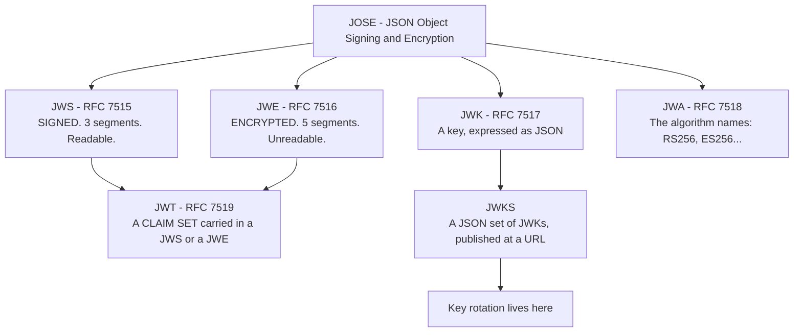
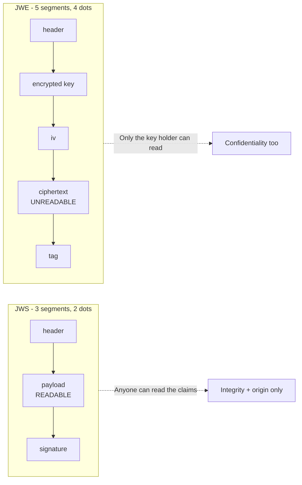
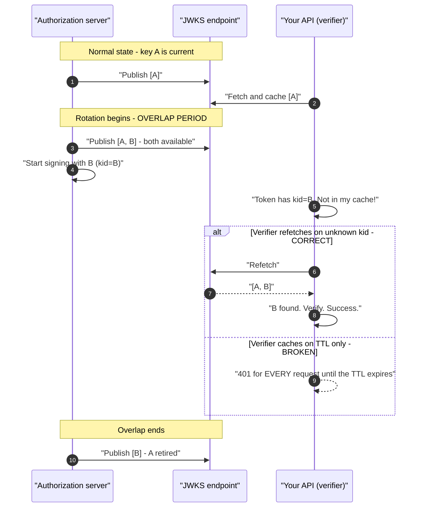
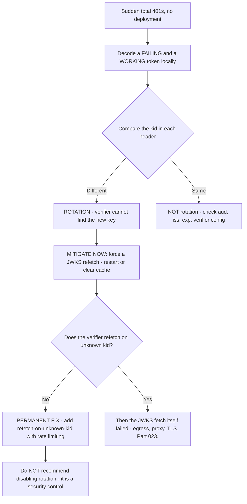
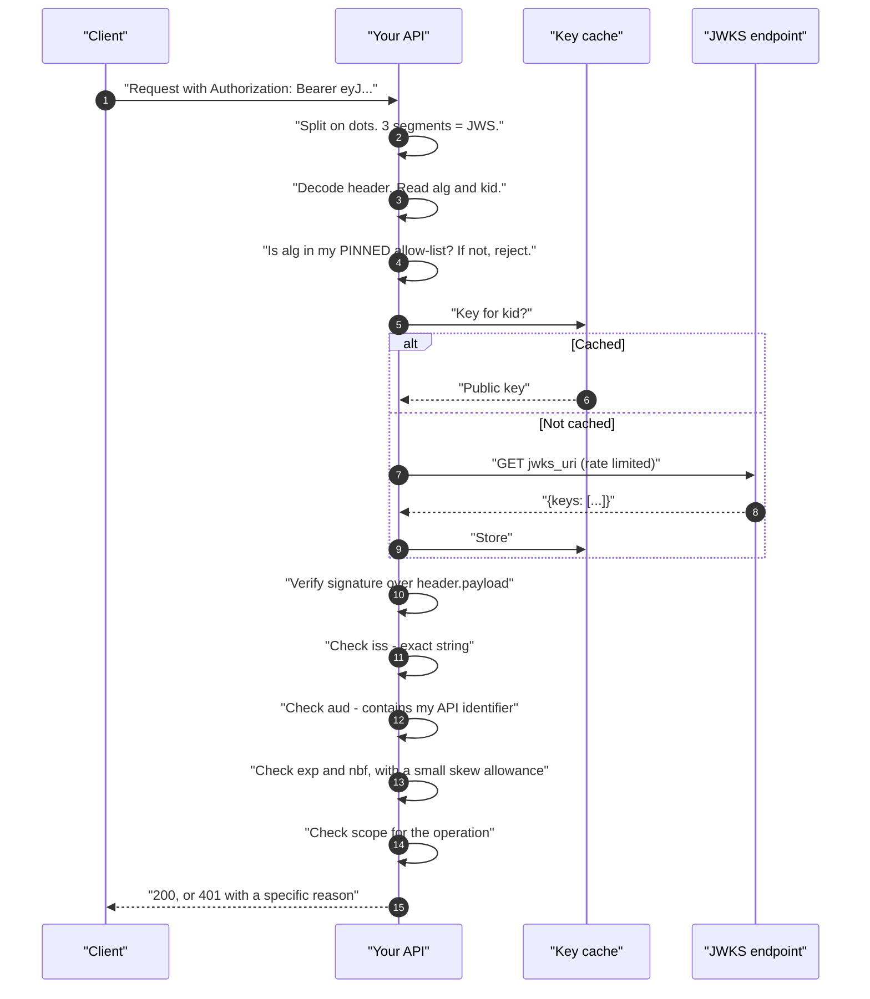
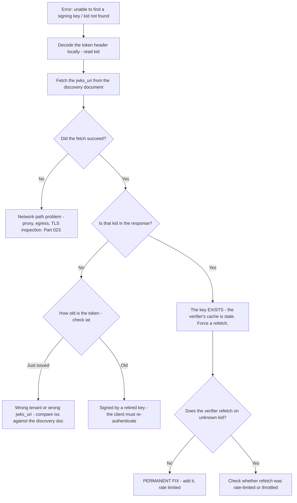

# Part 042 - JWS, JWE, JWK, JWKS, and Key Rotation

> Section goal: Learn the family of standards that surround a JWT — how tokens are signed, how they are encrypted, how keys are published, and how rotation works — so that "unable to find a signing key" and "everything started failing at once" become recognisable, one-step diagnoses.

Covers index item **042**. Maps to JD signals: *knowledge of encryption*, *basic security concepts*, *strong analytical and problem-solving skills*, and *experience with troubleshooting web applications*.

---

## 1. Start From Zero: The JOSE Family

JWT is one member of a family of standards collectively called **JOSE** — JSON Object Signing and Encryption.



| Standard | What it is | How you meet it |
|---|---|---|
| **JWS** | A signed structure | Every normal JWT |
| **JWE** | An encrypted structure | Tokens you "can't decode" |
| **JWK** | One key as JSON | Inside a JWKS |
| **JWKS** | A published set of JWKs | `/.well-known/jwks.json` |
| **JWA** | Algorithm identifiers | The `alg` header value |

**JWT is a claim set, not a container format.** It rides inside a JWS almost always, and inside a JWE occasionally. That distinction is what makes "count the dots" work.

> **Analogy.** A letter (the claims), a tamper-evident envelope (JWS), an opaque locked pouch (JWE), a published directory of official seals (JWKS), and a catalogue of seal types (JWA).
>
> **Where it stops:** a physical seal directory is printed once a year. A JWKS changes without notice, and that is the entire subject of §5.

---

## 2. JWS: The Signed Form

Three segments, covered fully in Part 041. Two representations exist:

| Representation | Shape | Where used |
|---|---|---|
| **Compact serialisation** | `header.payload.signature` | **Everywhere in OAuth/OIDC** |
| JSON serialisation | A JSON object with `protected`, `payload`, `signatures[]` | Rare; supports multiple signatures |

You will effectively only ever see compact. The JSON form's ability to carry **multiple signatures** occasionally appears in document-signing contexts, but not in identity flows.

---

## 3. JWE: The Encrypted Form

Five segments, four dots:

```
header . encrypted_key . iv . ciphertext . tag
```



### Why JWE exists, and why you rarely see it

**Why it exists:** sometimes claims are genuinely sensitive and the token passes through parties who should not read them.

**Why it is rare:** it adds key distribution and management burden for a benefit that TLS usually already provides in transit. Most designs instead keep sensitive data *out* of the token (Part 052).

**Why it matters to you:** because a JWE produces a distinctive support pattern.

### 🔍 Plain-English deep-dive: "we can't decode the token" is usually not a bug

A customer reports that a token is corrupted, or that their decoder fails, or that a debugging tool shows nothing. Count the dots.

**Four dots means it is a JWE.** It is encrypted. It is *supposed* to be unreadable to them. Their decoder is behaving correctly.

Three follow-up questions resolve it:

1. **Who is supposed to read this token?** If the answer is "our API," they need the decryption key, which they get from whoever configured encryption. If the answer is "the authorization server" — as with an encrypted ID token they are merely forwarding — they should not be decoding it at all.
2. **Why is encryption enabled?** Often nobody currently on the team knows; it was configured once and inherited. Establishing whether it is still required frequently ends the ticket, because the simplest fix is to turn it off if the claims are not sensitive.
3. **What are they actually trying to learn?** Usually they want `exp` or `sub` for debugging. If encryption is required, the answer is to get that information from tenant logs (Part 107) instead of the token — which is better evidence anyway, because logs are timestamped and correlated.

**The wider lesson:** a fair share of "this is broken" tickets are systems working exactly as designed, meeting an expectation nobody wrote down. Recognising that class quickly, and answering with *why it is correct* rather than *how to work around it*, is a large part of what distinguishes a good support engineer.

**Analogy:** complaining that a sealed diplomatic pouch cannot be opened. It cannot, by design, and the correct response is to establish who holds the key and whether you should be opening it at all. **Where it stops:** a pouch is visibly a pouch. A JWE looks exactly like a JWS until you count the separators, which is why the dot-count habit is worth having.

---

## 4. JWK and JWKS

A **JWK** is a cryptographic key expressed as JSON.

```json
{
  "kty": "RSA",
  "use": "sig",
  "kid": "kXY7...Qw",
  "alg": "RS256",
  "n":   "0vx7agoebGcQ...",
  "e":   "AQAB"
}
```

| Field | Meaning |
|---|---|
| **`kty`** | Key type: `RSA`, `EC`, `oct` (symmetric), `OKP` |
| **`use`** | `sig` (signature) or `enc` (encryption) |
| **`kid`** | Key ID — **matches the `kid` in a token header** |
| **`alg`** | Intended algorithm |
| `n`, `e` | RSA modulus and exponent (public parts) |
| `x`, `y`, `crv` | EC coordinates and curve |
| `x5c` | Certificate chain, if the key travels as a certificate |

A **JWKS** is `{"keys": [ ...JWKs... ]}` published at a stable URL, discoverable via the metadata document (Part 057):

```
https://<tenant>/.well-known/openid-configuration  →  "jwks_uri": "https://<tenant>/.well-known/jwks.json"
```

### Only public keys appear in a JWKS

A JWKS for signing contains **public** keys only. That is the point: publishing them lets anyone verify, while only the issuer can sign (Part 035).

**If a private key component — RSA's `d`, `p`, `q` — ever appears in a published JWKS, that is a critical incident**, not a curiosity. It is worth knowing the field names for exactly that reason.

### 🔍 Plain-English deep-dive: why more than one key is usually good news

Fetch a real tenant's JWKS and you will often see two or three keys. Developers ask which one is "the right one," and the framing of the question is the misunderstanding.

**A JWKS is not "the current key." It is the set of keys whose signatures should still be honoured.** More than one entry usually means one of three healthy things:

| Why several keys | What it indicates |
|---|---|
| **Rotation overlap** | A new key was introduced; the old one is still valid for tokens already issued |
| **Separate `use` values** | One key for `sig`, another for `enc` — check the `use` field |
| **Multiple algorithms** | An RSA key and an EC key offered in parallel during a migration |

**The verifier's job is never to choose.** It reads the `kid` from the token header and takes the matching key. If there is no `kid`, a well-behaved verifier tries each candidate key of the right type — which works, but is slower and gets fragile as the set grows, which is why issuers include `kid`.

**Two practical consequences for support:**

**1. "Which key should we configure?" is the wrong question, and answering it directly is a trap.** If someone is picking a key, they have hardcoded it, and that configuration is an outage scheduled for the next rotation. The right answer redirects: fetch the whole set from `jwks_uri`, select by `kid` at verification time.

**2. Watching the key count is a cheap early warning.** If a customer's tenant shows two keys today and one last week, a rotation is in progress right now — which is worth knowing before the 401s start, and is exactly the sort of proactive note that makes a support engineer valuable rather than merely responsive.

**Analogy:** a hotel that issues new room keycards but leaves yesterday's working until checkout. Asking "which card is the real one" misses the point — the lock accepts a set, and each card identifies itself. **Where it stops:** hotel locks fail open to a master. A verifier fails closed, so a key that is missing from its view is simply a rejected token with no fallback.

---

## 5. Key Rotation

Issuers periodically retire signing keys and introduce new ones. Done correctly it is invisible; done incorrectly it takes down every API at once.



### The two caching strategies

| Strategy | Behavior on an unknown `kid` | Outcome |
|---|---|---|
| **TTL only** | Waits for the cache to expire | **Mass 401s for the whole TTL window** |
| **TTL + refetch on unknown `kid`** | Fetches immediately | Rotation is invisible |

**The correct strategy is the second one, with a rate limit** on refetching — otherwise a token with a garbage `kid` becomes a denial-of-service amplifier against the JWKS endpoint. Reputable libraries do both by default; hand-rolled verification frequently does neither.

### 🔍 Plain-English deep-dive: the mass-401 incident, and how to diagnose it in one question

This is a real, recurring, high-severity pattern. The shape is unmistakable:

- **Sudden.** Everything worked, then nothing did, with no deployment.
- **Total.** Every request to a given API fails, not a percentage.
- **Newly-issued tokens fail; older ones may still work** — which is deeply counter-intuitive and is the giveaway.

**One question separates it from everything else:**

> *"Take a failing token and a working one, decode both locally, and tell me the `kid` from each header."*

- **Different `kid` values** → rotation, confirmed. The verifier cannot find the new key.
- **Same `kid`** → not rotation. Look at `aud`, `iss`, `exp`, or the verifier's configuration.

**If it is rotation, the immediate mitigation is to force a JWKS refetch** — restart the service, clear the cache, or hit whatever refresh mechanism exists. That restores service in minutes.

**The permanent fix is a verifier change**, not an issuer change: refetch on unknown `kid`, with rate limiting. Framing it that way matters, because the customer's instinct is to ask the identity provider to stop rotating — and rotation is a security control that should not be disabled to accommodate a caching bug.



**That right-hand branch matters too.** If the verifier *does* refetch and still fails, the fetch itself is failing — a proxy, an egress rule, a TLS-inspection certificate, or a rate limit. That is a Part 023 investigation, and the tell is that the JWKS URL is unreachable from the verifier's host even though it is reachable from a laptop.

**Analogy:** a bank replacing the seal it uses on official letters, publishing the new one, and keeping both valid for a month. A branch that only re-reads the seal directory quarterly rejects genuine letters — and the fault is the branch's refresh policy, not the bank's rotation. **Where it stops:** a branch clerk can telephone to check. A verifier fails closed and silently, which is why the symptom is total rather than gradual.

---

## 6. Verifying a Token End to End



**Every step in that diagram is a place a real ticket originates**, and the order is not arbitrary: algorithm pinning happens before key lookup, and signature verification happens before any claim is read.

---

## 7. Failure Modes

| Failure mode | What it looks like | Consequence | Correction |
|---|---|---|---|
| **TTL-only JWKS cache** | Mass 401s at rotation | **Outage** | Refetch on unknown `kid`, rate limited |
| **Unlimited refetch** | JWKS hammered by bad `kid`s | Rate limit / DoS | Rate-limit refetches |
| **No JWKS cache at all** | A fetch on every request | Latency, rate limits | Cache with a sensible TTL |
| **Trusting `alg` from the header** | Header dictates verification | **Algorithm confusion; forgery** | Pin expected algorithms |
| **Private key in a published JWKS** | `d`, `p`, `q` present | 🔴 **Critical incident** | Rotate immediately; investigate |
| **Attempting to decode a JWE** | "Corrupted token" | Chasing a non-bug | Count the dots; it is encrypted |
| **Ignoring `kid`** | Trying every key | Works, but slow and fragile | Match on `kid` |
| **Hardcoded key instead of JWKS** | Works until rotation | Guaranteed future outage | Always fetch from `jwks_uri` |
| **JWKS unreachable from the verifier** | Refetch fails | 401s despite correct logic | Egress, proxy, TLS inspection (Part 023) |
| **Recommending rotation be disabled** | Ticket "resolved" | **Security control removed** | Fix the verifier instead |
| **Symmetric key in a distributed system** | `HS256` shared widely | Anyone verifying can forge | Asymmetric (Part 035) |

---

## 8. Troubleshooting Decision Tree: "Unable to Find a Signing Key"



### Worked example

*"At 14:20 every API call started returning 401. We deployed nothing. Some older sessions still work."*

1. **Recognise the shape.** Sudden, total, no deployment, older tokens still working. That last detail is the signature of rotation.
2. **The one question.** Ask for the `kid` from a failing token and a working one, decoded locally.
3. **Answer:** different. Rotation confirmed, without needing anything else.
4. **Mitigate immediately.** Restart the API instances or clear the key cache. Service restored — do this *before* the analysis, and say so in the update.
5. **Confirm.** Fetch the JWKS and show both `kid`s present, so it is visible that the issuer did overlap correctly.
6. **Permanent fix.** Their verifier caches on TTL only. It needs refetch-on-unknown-`kid` with rate limiting.
7. **Handle the inevitable request.** They will ask whether rotation can be disabled. The answer is no, and the reason is worth one sentence: rotation limits the damage of a key compromise, the overlap window was implemented correctly, and the gap is in the verifier's caching. Replacing a security control with a caching bug is a bad trade.
8. **Write it up** (Part 115): timeline, one-line cause, mitigation, permanent fix, and how to test rotation before it happens again.

---

## 9. Lab: Rotation and JWKS

**Purpose.** See a JWKS, match a `kid`, and reproduce the mass-401 pattern in miniature so you can recognise it instantly.

**Prerequisites.** Part 040's JWKS reader. Part 041's tokens. A free Auth0 tenant.

**Steps.**

1. Create `okta-prep/labs/042-jwks/`.
2. **Discovery to JWKS.** Fetch `/.well-known/openid-configuration`, extract `jwks_uri`, fetch it. **Never hardcode the JWKS URL** — this two-step is the habit.
3. **Tabulate the keys.** For each: `kid`, `kty`, `use`, `alg`. Record how many keys are published.
4. **Match a `kid`.** Take a token from Part 041, read its header `kid`, and locate the matching JWK. **This is the core skill.**
5. **Confirm public-only.** Verify no `d`, `p`, or `q` fields are present. Write one line stating what their presence would mean.
6. **Verify manually.** Using a library, verify a real token against the fetched JWKS. Then verify with algorithm pinning set to the wrong algorithm and **record the error**.
7. **Simulate rotation.** Write a tiny verifier that caches the JWKS in memory. Verify a token successfully. Then edit the cached key's `kid` to something else and verify again. **Record the exact "unable to find a signing key" error.**
8. **Fix your own verifier.** Add refetch-on-unknown-`kid`. Repeat step 7 and confirm it now succeeds. **This is the whole permanent fix, demonstrated in about ten lines.**
9. **Add the rate limit.** Add a simple limit — for example, at most one refetch per minute. Fire ten tokens with random `kid`s and confirm only one fetch occurs. **Record why this matters.**
10. **JWE contrast.** Find or construct a five-segment token. Attempt to decode it with your Part 040 script. **Confirm your script's message is clear** rather than a parse error.
11. **Unreachable JWKS.** Point your verifier at a JWKS URL that does not resolve. **Record the failure mode** — and note whether the error makes the network cause obvious or hides it behind a generic message.
12. **Diagnostic script.** Write `kid-check`: given a token and an issuer, it decodes the header, fetches the live JWKS, and prints whether that `kid` is present. **This is a genuinely reusable ticket tool.**
13. **Write the incident summary.** Using §8's worked example as a model, write a one-page RCA for the simulated rotation failure: timeline, cause, mitigation, permanent fix, prevention.
14. **Failure catalog + manifest.** Add every error. Complete `MANIFEST.md`.

**Expected evidence.** A discovery-to-JWKS fetch, a key table, a `kid` match, a public-only confirmation, four recorded errors, a broken-then-fixed verifier, a working rate limit, a JWE contrast, a reusable `kid-check` script, and a one-page RCA.

**Validation rubric.**

| Check | Pass condition |
|---|---|
| JWKS reached via discovery | No hardcoded URL anywhere |
| Key table | Every key with `kid` and `alg` |
| `kid` matched | Correct JWK located from a token header |
| Public-only confirmed | Stated, with the incident implication |
| Rotation failure reproduced | Verbatim error recorded |
| Verifier fixed | Refetch-on-unknown-`kid` demonstrably works |
| Rate limit works | Ten bad `kid`s cause one fetch |
| JWE handled clearly | A helpful message, not a crash |
| `kid-check` script | Works against your live tenant |
| RCA written | Five sections, one page |

**Cleanup and privacy.** Lab tenant and synthetic users only. Decode locally. Strip signatures from anything saved. **Never point this tooling at an employer or customer tenant.** Delete tokens after the lab.

---

## 10. JD Mapping

| Supplied JD signal | How this Part supports it |
|---|---|
| **Knowledge of encryption** | JWS versus JWE, asymmetric key publication, algorithm pinning |
| **Basic security concepts** | Why rotation exists and must not be traded away |
| Strong analytical and problem-solving skills | The one-question rotation diagnosis |
| Experience troubleshooting web applications | Mass-401 incident handling end to end |
| **Ownership from start to resolution** | Mitigate first, then permanent fix, then prevention |
| Promote best practices | Refetch-on-unknown-`kid` with rate limiting, as a recommendation |
| Communicate technical concepts clearly | Explaining why disabling rotation is the wrong fix |

---

## 11. Candidate Honesty Note

- **Claim safety:** *Learned architecture and lab experience.* You have built a verifier and reproduced a rotation failure in a lab; you have not run one in production.
- **The strongest thing you can say:** *"Sudden, total 401s with no deployment, where older tokens still work, is almost always key rotation. One question settles it: decode a failing and a working token and compare the `kid`. Different `kid`s confirm it. Mitigation is forcing a JWKS refetch, which is minutes."*
- **A second point that shows judgement rather than just knowledge:** *"The permanent fix is on the verifier, not the issuer. Customers usually ask whether rotation can be turned off, and the answer is no — rotation limits the blast radius of a key compromise, and the overlap window is normally implemented correctly. Swapping a security control for a caching bug is a bad trade, and it's worth saying that plainly rather than just declining."*
- **A third, and it prevents wasted investigation:** *"A five-segment token is a JWE. It's encrypted, so 'we can't decode it' is the system working. The useful questions become who holds the decryption key, whether encryption is still required at all, and what they were actually trying to learn — which is usually `exp` or `sub`, and is better read from tenant logs anyway."*
- **A fourth:** *"Refetch-on-unknown-`kid` needs a rate limit, or a token with a garbage `kid` turns into an amplifier against the JWKS endpoint."*
- **Do not overstate:** you have not managed key rotation for a production identity platform, and you have not been on call for a rotation incident. Say the mechanism and the diagnosis are clear to you, and the production experience is what the role would add.

---

## 12. Official Source Anchors

Accessed **26 August 2026**.

| Source | What it defines |
|---|---|
| IETF RFC 7515 (JWS) | Compact and JSON serialisations, header parameters |
| IETF RFC 7516 (JWE) | Five-segment structure and encryption process |
| IETF RFC 7517 (JWK) | Key representation, `kty`, `use`, `kid`, and the JWKS set |
| IETF RFC 7518 (JWA) | Algorithm identifiers for signing and encryption |
| IETF RFC 8725 (JWT BCP) | Algorithm pinning and confusion attacks |
| OpenID Connect Discovery | `jwks_uri` publication in the metadata document |
| Auth0 documentation — signing keys and rotation | Tenant rotation behavior and overlap |
| Okta developer documentation — key rotation | Okta's rotation model and verification guidance |

**Revalidate after 26 August 2026:** the RFCs are stable. Recheck vendor documentation for rotation cadence and any changes to default overlap behavior.

---

## ⭐ Likely Interview Questions for This Section

### Q1. "What is a JWKS and why does it exist?"
> *Model answer:* "It's a JSON document containing the issuer's public signing keys, published at a stable URL that you discover from the metadata document's `jwks_uri` — never hardcoded. It exists because signing is asymmetric: the issuer signs with a private key and anyone can verify with the public one, so the public keys need to be discoverable. Each key carries a `kid`, and a token's header carries a `kid` too, so a verifier reads the token's `kid` and picks the matching key. Publishing them is what makes rotation possible without coordinating with every verifier. And it should only ever contain public material — if RSA's `d`, `p`, or `q` appeared in a published JWKS, that's a critical incident, not a curiosity."

### Q2. "Every API call started returning 401 at 14:20. No deployment. Where do you start?"
> *Model answer:* "That shape — sudden, total, no deployment — is key rotation until proven otherwise, especially if some older sessions still work, because that detail is counter-intuitive and very specific. One question settles it: decode a failing token and a working one locally and compare the `kid` in each header. Different `kid`s confirm rotation. Then I'd mitigate before analysing — restart the API or clear the key cache to force a JWKS refetch, which restores service in minutes — and say in the update that mitigation is done and the cause analysis is following. The permanent fix is verifier-side: refetch on an unknown `kid`, rate limited. If they'd already have refetched and it still failed, then the fetch itself is failing and I'm looking at proxy, egress, or TLS inspection instead."

### Q3. "The customer asks you to disable key rotation. What do you say?"
> *Model answer:* "No, with a reason rather than just a refusal. Rotation limits how much damage a compromised signing key can do — without it, one leaked key is valid forever. The overlap window in this case worked exactly as designed: both keys were published simultaneously, which is precisely so verifiers can catch up. The gap is that their verifier caches on a TTL and doesn't refetch when it sees a `kid` it doesn't recognise. So the ask is really 'remove a security control to accommodate a caching bug,' and that's a bad trade. I'd then make the alternative easy: the fix is roughly ten lines, I'd offer to review their verifier configuration, and I'd give them a way to test it before the next rotation so they're not trusting me on it."

### Q4. "What's the difference between JWS and JWE, and how do you tell them apart?"
> *Model answer:* "JWS is signed: three segments, two dots, and the payload is Base64url so anyone can read the claims. It gives you integrity and origin. JWE is encrypted: five segments, four dots — header, encrypted key, IV, ciphertext, and authentication tag — and the claims are genuinely unreadable without the decryption key. Counting the dots tells them apart in a second, which matters because a JWE produces a distinctive ticket: 'the token is corrupted, our decoder fails.' It isn't corrupted, it's encrypted, and their decoder is right. JWE is rare because it adds key distribution burden for a benefit TLS usually already provides in transit — most designs just keep sensitive data out of the token instead."

### Q5. "A customer says they can't decode a token. Walk me through it."
> *Model answer:* "Count the dots first. Four dots means it's a JWE and it's supposed to be unreadable to them — no bug. Then three questions: who is supposed to read this token, because if it's their API they need the decryption key and if they're just forwarding it they shouldn't be decoding it at all; why is encryption enabled, because often nobody currently on the team knows and it was inherited, and establishing that it's no longer needed sometimes ends the ticket; and what are they actually trying to learn, because it's usually `exp` or `sub` for debugging, and tenant logs give them that with timestamps and correlation, which is better evidence than the token anyway. If it's two dots and still won't decode, then it's a Base64url or padding issue and that's a different, simpler answer."

### Q6. "Why does refetching on an unknown `kid` need a rate limit?"
> *Model answer:* "Because otherwise the `kid` field becomes an attacker-controlled trigger for outbound requests. Anyone can send a token with a random `kid` — it doesn't need a valid signature, since the key lookup happens before verification — and each one causes the verifier to fetch the JWKS. Send enough and you either exhaust the issuer's rate limit, which breaks verification for every legitimate token, or you exhaust the verifier's own connection pool. So the pattern is: refetch on unknown `kid`, but at most once per some interval, and don't refetch again for a `kid` you've recently looked up and failed to find. Good libraries do this by default. Hand-rolled verification tends to do neither — either no refetch, which breaks rotation, or unlimited refetch, which is the amplifier."

### Q7. "How does a verifier validate a token, step by step?"
> *Model answer:* "Split on dots and confirm three segments. Decode the header and read `alg` and `kid`. Check `alg` against a pinned allow-list — never trust the header's own claim about how to verify it, because that's the algorithm-confusion attack. Look up the key by `kid`, from cache, refetching from `jwks_uri` if unknown. Verify the signature over the exact `header.payload` string as received. Only then parse claims: `iss` as an exact string match, `aud` containing this API's identifier, `exp` and `nbf` with a small clock-skew allowance, and `scope` for the specific operation. The ordering is deliberate — pinning before lookup, signature before any claim is read. Reading claims from an unverified token and acting on them looks like working code right up until someone forges one."

### Q8. "Where does `jwks_uri` come from?"
> *Model answer:* "From the authorization server's metadata document at `/.well-known/openid-configuration`, or the OAuth equivalent. You fetch that, read `jwks_uri`, and fetch the keys from there. The reason that two-step matters is that hardcoding the JWKS URL — or worse, hardcoding a key — works perfectly until something changes, and then it's an outage with no obvious cause. Discovery means the issuer can move the endpoint or rotate keys and verifiers follow automatically. It's the same principle as copying `iss` from discovery rather than typing it: the trailing-slash mismatches and the stale-endpoint outages both come from someone transcribing a value by hand once and it drifting later."

---

## 🧠 30-Second Memory Hooks

- **JOSE family:** JWS (signed) · JWE (encrypted) · JWK (a key) · JWKS (a key set) · JWA (algorithm names).
- **JWT is a claim set**, carried in a JWS almost always.
- **2 dots = JWS = readable. 4 dots = JWE = encrypted, and that's correct behavior.**
- **JWKS = public keys only.** `d`, `p`, `q` present = **critical incident**.
- **`kid` in the token header ↔ `kid` in the JWKS.** That is the whole lookup.
- **Get `jwks_uri` from discovery. Never hardcode it. Never hardcode a key.**
- **Mass 401s + no deploy + older tokens still work = ROTATION.**
- **The one question:** compare the `kid` of a failing and a working token.
- **Mitigate = force a refetch.** Fix = **refetch on unknown `kid`, rate limited.**
- **Never disable rotation** to fix a verifier caching bug.
- **Pin `alg`.** Never let the token tell the verifier how to verify it.

---

## ✅ Completion Checklist

- [ ] **Knowledge:** I can name all five JOSE standards, describe the JWKS lookup, and explain the rotation overlap.
- [ ] **Lab artifact:** `042-jwks/` contains a discovery-to-JWKS fetch, a key table, a reproduced-then-fixed rotation failure, a working rate limit, `kid-check`, and a one-page RCA.
- [ ] **Spoken:** I can diagnose a mass-401 incident aloud in 60 seconds and decline the disable-rotation request in 30.
- [ ] **Honesty check:** I say "lab experience," not production key management.
- [ ] **Source check:** I have read RFC 7517's JWKS section and RFC 8725's pinning guidance myself.

---

*Next suggested section:* **[Part 043 - JWT Validation Rules and Classic Validation Bugs](Part-043-jwt-validation-rules-and-classic-validation-bugs.md)** — the complete validation checklist, and the specific ways real implementations get it wrong.
