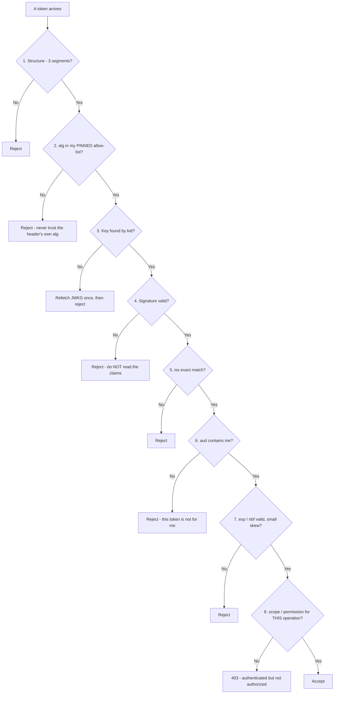
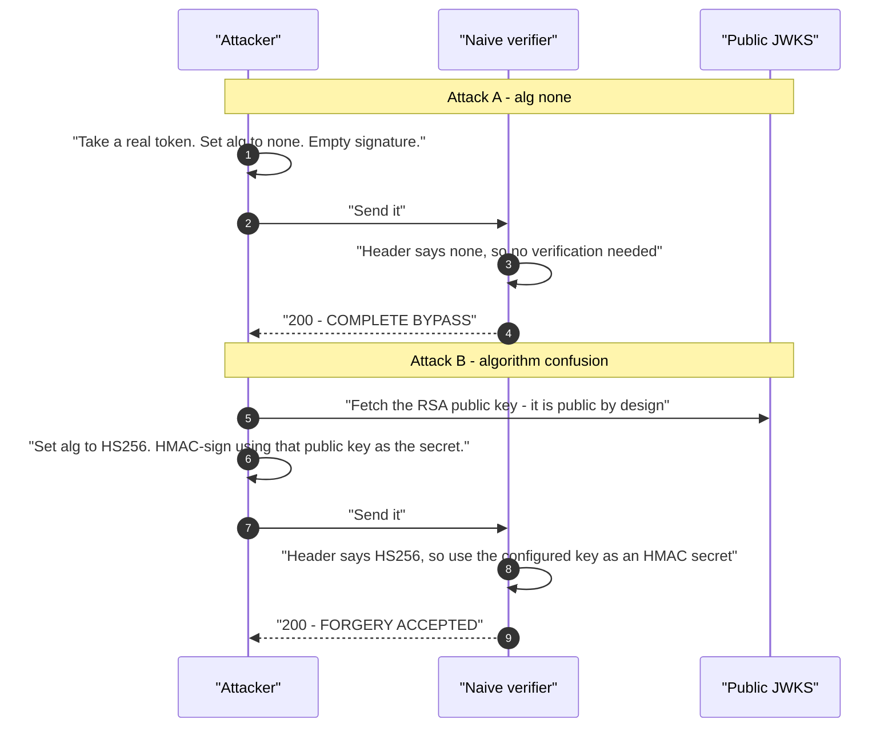
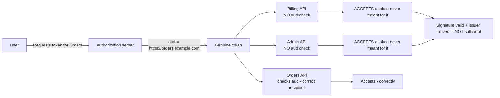
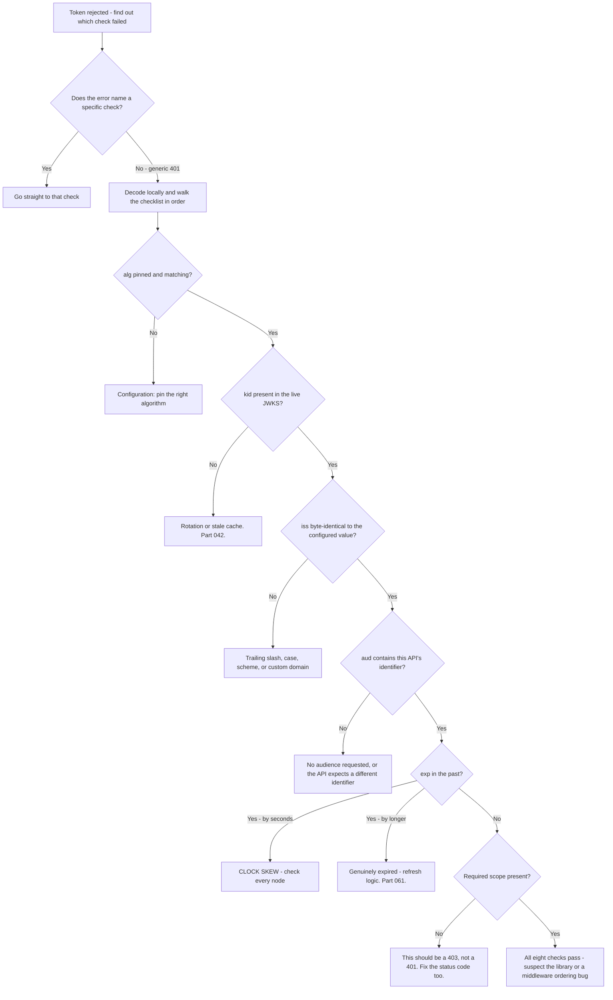

# Part 043 - JWT Validation Rules and Classic Validation Bugs

> Section goal: Turn token validation from a vague notion into a precise, ordered checklist you can recite — and learn the specific ways real implementations get it wrong, because most of them are subtle, they look like working code, and they produce either silent insecurity or confusing 401s.

Covers index item **043**. Maps to JD signals: *basic security concepts*, *knowledge of encryption*, *strong analytical and problem-solving skills*, *experience with troubleshooting web applications*, and *promote best practices*.

---

## 1. Start From Zero: Validation Is a Checklist, Not a Function Call

The most dangerous sentence in identity engineering is *"we validate the token"* — because that usually means one thing was checked and six were not.



**Eight checks, in that order.** Skipping any of 2–7 is a security defect. Skipping 8 is an authorization gap. Reordering them — particularly reading claims before verifying the signature — is the worst mistake of all.

> **Analogy.** A border officer checking a passport: is it a passport at all, are its security features of a recognised type, is it verifiably genuine, was it issued by a country we recognise, is it valid today, and does the visa cover this purpose of travel. Six things, in order, and the officer who checks only the photograph is not doing the job.
>
> **Where it stops:** an officer notices oddities a checklist would miss. Software notices only what it was told to check, which is why the checklist has to be complete rather than merely reasonable.

---

## 2. The Checks in Detail

| # | Check | Rule | Failure code |
|---|---|---|---|
| 1 | **Structure** | Exactly 3 segments for a JWS | 401 |
| 2 | **Algorithm** | `alg` ∈ pinned allow-list. **Never** `none` | 401 |
| 3 | **Key** | Key found by `kid` from `jwks_uri` | 401 |
| 4 | **Signature** | Valid over `header.payload` as received | 401 |
| 5 | **Issuer** | `iss` **exact string** match | 401 |
| 6 | **Audience** | `aud` contains this API's identifier | 401 |
| 7 | **Time** | `exp` future, `nbf` past, skew ≤ ~60s | 401 |
| 8 | **Authorization** | Required `scope`/permission present | **403** |

### The 401 versus 403 distinction

This matters more than it seems, both technically and in support:

- **401 Unauthorized** — I do not know who you are, or I cannot trust this token. *Re-authenticate.*
- **403 Forbidden** — I know who you are; you may not do this. *Re-authenticating will not help.*

**An API that returns 401 for a missing scope sends the client into an infinite login loop.** The client re-authenticates, gets a token that still lacks the scope, retries, fails, and repeats. That is a real, recurring, extremely frustrating ticket, and the cause is a one-line status-code decision.

---

## 3. Classic Bug 1: Trusting the Header's `alg`

The token declares how it was signed. A naive verifier obeys.



**Attack B is the elegant one.** The RSA public key is published deliberately — it is meant to be public. But if the verifier treats it as an HMAC shared secret because the token asked it to, then anyone who can read the JWKS can forge tokens. The security of the whole system inverts.

### The fix, in one line

> **Pin the expected algorithms in the verifier's configuration and reject anything else — before looking up a key.**

```
verify(token, key, { algorithms: ["RS256"] })   ✅
verify(token, key)                              ❌ (in libraries that default to the header)
```

**Check your library's default.** Modern well-maintained libraries require an explicit algorithm list. Older ones, and hand-rolled code, do not. That check takes two minutes and belongs in every code review of a verifier.

---

## 4. Classic Bug 2: Not Checking `aud`

The most common validation gap in practice — and unlike Bug 1 it usually produces *support tickets* rather than breaches, which is why you will meet it constantly.

### 🔍 Plain-English deep-dive: why a missing `aud` check is token replay

Consider an organisation with three APIs — Orders, Billing, and Admin — all trusting the same issuer.

A user legitimately obtains an access token for Orders. If Billing verifies the signature and `iss` but **not** `aud`, then the Orders token is accepted by Billing. The user, or anything that captures that token, now reaches an API they were never granted.

**Nothing was forged.** The token is genuine, correctly signed, unexpired, from a trusted issuer. The gap is that the verifier never asked *"was this meant for me?"*



**The support-facing half of this bug is the mirror image**, and it is far more common than the security half: a customer who *does* check `aud` correctly, receiving a token whose `aud` is the tenant's own UserInfo endpoint because no `audience` parameter was sent on the authorization request.

So `aud` produces two opposite tickets from the same root concept:

| Symptom | Cause | Fix |
|---|---|---|
| "Our token works on APIs it shouldn't" | Verifier does not check `aud` | Add the check |
| "Our API rejects a valid Okta token" | No `audience` parameter requested | Add `audience` to the authorization request |

**Recognising which of the two you have takes one decode.** If `aud` ends in `/userinfo`, it is the second. If `aud` is another API's identifier and it was accepted anyway, it is the first — and that is a security finding worth flagging even though nobody asked.

**Analogy:** a building pass that opens every door because the readers only check that a pass is genuine, never which building it was issued for. The pass is real; the readers are asking an incomplete question. **Where it stops:** a physical pass is visibly branded and a human might notice. A token's audience is invisible unless something checks it, and nothing complains when it does not.

---

## 5. Classic Bug 3: Clock Skew

`exp` and `nbf` compare against the verifier's clock. Clocks drift.

| Symptom | Skew | Cause |
|---|---|---|
| "Token expired" seconds after issue | Verifier clock **ahead** | The verifier thinks the future has arrived |
| "Token not yet valid" (`nbf`) | Verifier clock **behind** | The verifier is in the token's past |
| Intermittent failures across a fleet | One node drifted | Load balancer sends some requests to it |

### The tell

**A token that expires "immediately" or a few seconds after issue is skew, not expiry.** Genuine expiry happens after the configured lifetime — minutes or hours later. Decode `iat` and `exp`, compute the intended lifetime, and compare against how long the token actually survived. A one-hour lifetime that failed after four seconds is a clock problem.

### The correct handling

| Practice | Rule |
|---|---|
| Skew allowance | A small tolerance, typically **30–60 seconds** |
| Excessive allowance | ❌ A 10-minute allowance extends every token's real life by 10 minutes |
| Real fix | **NTP on every node.** Skew tolerance is a shock absorber, not a solution |
| Diagnosis | Compare the verifier's clock to a reference; check *every* node, not one |

**That last row is the practical trap.** In a fleet, one drifted node produces intermittent failures that look random and defeat reproduction attempts. The distinguishing feature is that the same request succeeds on retry — because the load balancer picked a different node.

### 🔍 Plain-English deep-dive: why skew tolerance is a shock absorber, not a solution

There is a tempting shortcut when a customer hits skew failures: raise the tolerance. It works immediately, the tickets stop, and everyone moves on. It is also the wrong answer, and being able to say *why* — briefly, without lecturing — is the difference between closing a ticket and doing the job.

**Every second of skew tolerance is a second of extra token life, for every token.** A ten-minute allowance means a token with a fifteen-minute lifetime is actually accepted for twenty-five minutes. That directly widens the window in which a stolen or stale token still works, which is the exact thing short lifetimes exist to narrow (Part 045).

**And it does not actually fix anything.** The clock is still wrong. It will drift further. The tolerance that works today fails next month, and by then the original diagnosis has been forgotten, so the next engineer raises it again. Skew tolerance masks a measurable, fixable infrastructure fault.

| | Raise the tolerance | Fix the clock |
|---|---|---|
| Time to relief | Immediate | Minutes |
| Fixes the cause | ❌ | ✅ |
| Security cost | Every token lives longer | None |
| Recurs | ✅ Guaranteed | ❌ |
| Detectable next time | ❌ It has been masked | ✅ A health check catches it |

**The support move is to offer both, in order.** Acknowledge that they may need the tolerance bumped briefly to stop the bleeding, be specific that it is temporary, and pair it with the real fix and a way to prevent recurrence:

> *"Bump the tolerance to 120 seconds if you need immediate relief, but treat that as a stopgap — instance 3's clock is 90 seconds fast, and tolerance just hides that. Enforce NTP across the fleet, and consider a health check that compares node time to a reference and fails the node out if it drifts more than 30 seconds. That turns this from a recurring mystery into something that pages you before customers notice."*

That answer respects the urgency, names the real cause, and leaves them better off than before the incident — which is what "ownership from start to resolution" actually looks like in practice.

**Analogy:** widening a door frame because the door has warped. The door still opens, and the problem is genuinely gone today. It also warps further, and now the frame is wrong too. **Where it stops:** a warped door is visible. A drifted clock is invisible until it crosses whatever threshold someone configured, which is why the health check matters more than the fix.

---

## 6. Classic Bug 4: Issuer Mismatch

`iss` must match **exactly, as a string**.

| Configured | Token contains | Result |
|---|---|---|
| `https://tenant.us.auth0.com` | `https://tenant.us.auth0.com/` | ❌ **Fails** — trailing slash |
| `https://TENANT.us.auth0.com/` | `https://tenant.us.auth0.com/` | ❌ Fails — case |
| `http://...` | `https://...` | ❌ Fails — scheme |
| `https://custom.example.com/` | `https://tenant.us.auth0.com/` | ❌ Fails — custom domain mismatch |

**The rule that prevents all four rows:** copy `iss` from the discovery document, programmatically where possible, and never type it.

### The custom-domain case

That fourth row is worth its own note. When a tenant enables a custom domain (Part 097), tokens obtained through the custom domain carry the **custom domain** as `iss`, while tokens obtained through the canonical domain carry the canonical one. An application that switches between them — a mobile app using one and a web app using the other, or a staging environment that was never updated — produces issuer mismatches that look like a configuration error and are really a *which-endpoint-did-you-call* question.

---

## 7. Classic Bug 5: Reading Claims Before Verifying

```
// ❌ CATASTROPHIC
const payload = JSON.parse(base64urlDecode(token.split('.')[1]));
if (payload.role === 'admin') { grantAdmin(); }
```

This code works perfectly in testing. It also accepts a token anyone can construct in a text editor, because **no signature was ever checked.**

### 🔍 Plain-English deep-dive: how this bug survives code review

It looks reasonable, and that is the whole problem. Four things conspire:

**1. It works.** Every test passes. Every legitimate token has the right claims. Nothing is visibly wrong, ever, until it is exploited.

**2. The word "decode" sounds safe.** Decoding is a benign-sounding operation. In Part 034's terms, decoding is not verification — it is the opposite, in the sense that it proceeds without any check at all.

**3. Debugging code becomes production code.** Someone adds a decode to log a claim during an incident. It ships. Later, someone else sees a decoded payload conveniently available and uses it for a decision. Neither person made an obviously bad choice.

**4. Frameworks hide the boundary.** A middleware verifies the token and attaches the claims to the request object. Elsewhere in the codebase, someone decodes the raw token again — perhaps because the middleware ran on a different route. Both patterns exist in the same repository and look alike.

**How to catch it in review:** any decode of a token that is not immediately followed by a signature verification is suspect. In practice the safe rule is that **application code should never decode a token at all** — it should read claims from the verified object the verification library returned.

**How to catch it in support:** if a customer describes a "role" or "permission" claim driving behavior, ask where the check happens and whether it uses the verified claims or a decode. It is a reasonable question to ask while troubleshooting, and it surfaces a serious bug without accusing anyone.

**Analogy:** reading the name printed on a cheque and handing over the money. The name is right there and it is easy to read, but nothing about reading it establishes that the cheque is good. **Where it stops:** a cheque bounces later and the loss is recoverable. A forged token grants access that may never be noticed at all.

---

## 8. Failure Modes

| Failure mode | What it looks like | Consequence | Correction |
|---|---|---|---|
| **Trusting header `alg`** | Verify with no allow-list | 🔴 **`none` bypass / algorithm confusion** | Pin algorithms explicitly |
| **No `aud` check** | Signature and `iss` only | 🔴 **Cross-API token replay** | Check `aud` on every request |
| **No `audience` requested** | Token for `/userinfo` | 401 from the customer's API | Add `audience` to the request |
| **Claims read before verification** | Decode then decide | 🔴 **Forged tokens accepted** | Verify first; use the verified object |
| **`iss` typed by hand** | Trailing slash, case, scheme | Every token rejected | Copy from discovery |
| **Custom-domain mismatch** | Two `iss` values in one system | Confusing intermittent failures | Align on one domain per environment |
| **No skew allowance** | "Expired" seconds after issue | Flaky failures | 30–60s tolerance **plus NTP** |
| **Huge skew allowance** | 10 minutes | Tokens live 10 minutes past `exp` | Keep it small |
| **One drifted node** | Intermittent, unreproducible | Wasted investigation | Check *every* node's clock |
| **401 for a missing scope** | Client re-authenticates forever | **Infinite login loop** | Return **403** |
| **`exp` not checked at all** | Library default off | 🔴 Tokens valid forever | Verify the library's defaults |
| **Accepting any `iss` from discovery** | Auto-trusting a supplied issuer | 🔴 Attacker-controlled issuer | Trust a **fixed** issuer list |

---

## 9. Troubleshooting Decision Tree: Validation Failed



### Worked example

*"Login works. The API rejects the token about half the time. Retrying usually succeeds."*

1. **"About half the time, and retry works" is the whole clue.** Intermittent plus retry-succeeds means the request is reaching different backends with different state — not a token problem, a **fleet** problem.
2. **Rule out the token first anyway**, because it is cheap: decode a failing token. All eight values look correct.
3. **Ask the fleet question.** How many API instances? Behind a load balancer? Answer: four instances.
4. **Ask for the failure to be pinned to an instance.** Whatever correlation ID or instance header they have — or simply hit each instance directly.
5. **Finding:** instance 3 has a clock 90 seconds ahead. Their skew tolerance is 60 seconds. Every token routed there fails until it is 90 seconds old, and none is.
6. **Fix:** NTP on instance 3, and confirm NTP is enforced across the fleet rather than fixed on one machine.
7. **Prevention:** a health check that compares node time against a reference and fails the node out if it drifts. Offer this — it converts a recurring mystery into an automated guardrail, and it is the kind of suggestion customers remember.

---

## 10. Lab: Break Every Check

**Purpose.** Deliberately fail each of the eight checks, record the exact error, and build a symptom-to-check lookup you can use on real tickets.

**Prerequisites.** Parts 040–042 artifacts. A free Auth0 tenant and a test API.

**Steps.**

1. Create `okta-prep/labs/043-validation/`.
2. **Build a correct verifier.** A minimal API endpoint performing all eight checks in order, with a **distinct error message per check**. This is your instrument.
3. **Baseline.** Verify a genuine token. Confirm success.
4. **Break check 1.** Send a two-segment token. Record the error.
5. **Break check 2 — twice.** Send `alg: none` with an empty signature. Then attempt algorithm confusion: HMAC-sign a token using the tenant's RSA public key as the secret. **Confirm your verifier rejects both, and record what an unpinned verifier would have done.**
6. **Break check 3.** Alter the `kid`. Record the error.
7. **Break check 4.** Alter one payload character. Record the error.
8. **Break check 5 — four ways.** Configure the issuer with a missing trailing slash, wrong case, `http` instead of `https`, and a different tenant. **Record all four errors and note whether they are distinguishable.**
9. **Break check 6 — both directions.** First, request a token with no `audience` and observe `aud` pointing at `/userinfo`. Second, **remove the `aud` check from your verifier** and confirm that a token for a different audience is now accepted. **Write one line on why that is a security defect, not a convenience.**
10. **Break check 7 — three ways.** An expired token; a token with `nbf` in the future; and a skew test where you shift your verifier's comparison time by 90 seconds. Record all three.
11. **Break check 8 properly.** Request a token without a required scope. Confirm your verifier returns **403**, not 401. Then temporarily change it to 401 and **describe the client-side loop that produces**.
12. **Library defaults audit.** For the JWT library you used, document: does it require an explicit algorithm list, does it check `exp` by default, does it check `aud` by default, and what is its default skew? **Cite the documentation.** Most engineers have never checked this for their own stack.
13. **Build the lookup table.** `validation-errors.md` mapping every recorded error string to which check failed and the fix. **This is the artifact you would actually use on tickets.**
14. **Failure catalog + manifest.** Complete `MANIFEST.md`.

**Expected evidence.** A working eight-check verifier, at least fourteen recorded failure errors, a demonstrated algorithm-confusion rejection, both `aud` failure directions, a 401-versus-403 demonstration, a documented library-defaults audit, and a symptom-to-check lookup table.

**Validation rubric.**

| Check | Pass condition |
|---|---|
| Verifier implements all eight checks | Distinct message per check |
| `alg: none` rejected | Error recorded |
| Algorithm confusion rejected | Attempt made and rejected |
| Four `iss` variants tested | All recorded; distinguishability noted |
| Both `aud` directions | Wrong-audience acceptance demonstrated and explained |
| Skew reproduced | 90-second shift causes failure |
| 403 for missing scope | Correct code, with the 401 loop described |
| Library defaults documented | Four questions answered with citations |
| Lookup table | Every error mapped to a check and a fix |

**Cleanup and privacy.** Lab tenant only. **The algorithm-confusion test must only ever be run against your own lab verifier** — never against a tenant or service you do not own, including your employer's. Decode locally, strip signatures from saved output, delete tokens afterwards.

---

## 11. JD Mapping

| Supplied JD signal | How this Part supports it |
|---|---|
| **Basic security concepts** | Algorithm pinning, audience checking, verify-before-read |
| Knowledge of encryption | Why publishing a public key is safe only if `alg` is pinned |
| Strong analytical and problem-solving skills | The ordered checklist as a diagnostic instrument |
| Experience troubleshooting web applications | The intermittent-failure fleet investigation |
| **Promote best practices** | Library-defaults audit, 401-versus-403, NTP health checks |
| Exceed expectations on response quality | Offering the clock health check as prevention |
| Communicate technical concepts clearly | Explaining a security defect without accusing anyone |

---

## 12. Candidate Honesty Note

- **Claim safety:** *Learned architecture and lab experience.* You have built a verifier and broken each check deliberately; you have not maintained production token validation.
- **The strongest thing you can say:** *"Validation is eight ordered checks, not a function call: structure, pinned algorithm, key by `kid`, signature, exact `iss`, `aud` containing me, `exp`/`nbf` with small skew, and scope. Skipping any of the middle six is a security defect, and reading claims before verifying the signature is the worst of them — because it looks like working code forever."*
- **A second point that shows real depth:** *"Never let the token tell the verifier how to verify it. If `alg` comes from the header, `none` is a full bypass, and algorithm confusion is worse — the RSA public key is published deliberately, so if a verifier will treat it as an HMAC secret, anyone who can read the JWKS can forge tokens. Pinning the algorithm fixes both."*
- **A third, and this one is pure support craft:** *"Returning 401 for a missing scope puts the client in an infinite login loop — it re-authenticates, gets the same token, fails again. It should be 403. That's a one-line fix for a ticket that otherwise looks like a deep authentication problem."*
- **A fourth, on diagnosis:** *"Intermittent failures that succeed on retry usually aren't token problems at all — they're fleet problems. One node with a drifted clock produces exactly that pattern, and checking every node rather than one is what finds it."*
- **Do not overstate:** you have not performed a security review of a production authorization layer. Say the checklist and the failure modes are thoroughly clear to you, and that applying them at production scale is what the role would add.

---

## 13. Official Source Anchors

Accessed **26 August 2026**.

| Source | What it defines |
|---|---|
| IETF RFC 7519 §7.2 | The normative token-validation steps |
| IETF RFC 8725 (JWT BCP) | Algorithm pinning, `none`, and confusion attacks |
| IETF RFC 9068 | Access-token validation requirements, including `aud` |
| IETF RFC 6750 | Bearer token usage and the `WWW-Authenticate` error responses |
| OpenID Connect Core §3.1.3.7 | ID token validation, including `nonce` and `azp` |
| OWASP — JSON Web Token cheat sheet | The classic bug catalog and mitigations |
| Auth0 documentation — validating access tokens | Vendor-specific `aud` and `iss` requirements |
| Okta developer documentation — validating tokens | Okta's validation checklist |

**Revalidate after 26 August 2026:** the RFCs are stable. Recheck OAuth 2.1 (Part 066) and RFC 8725 for evolving guidance, and your library's changelog for default-behavior changes.

---

## ⭐ Likely Interview Questions for This Section

### Q1. "Walk me through validating a JWT."
> *Model answer:* "Eight checks in order. Structure — three segments. Algorithm — `alg` must be in a pinned allow-list, never taken from the header itself. Key — look it up by `kid` from `jwks_uri`. Signature — verify over `header.payload` exactly as received. Issuer — `iss` as an exact string match. Audience — `aud` must contain this API's identifier. Time — `exp` in the future, `nbf` in the past, with maybe 60 seconds of skew tolerance. And scope — the specific permission for this operation, which should return 403 rather than 401 if missing. The order matters: pinning before key lookup, signature before any claim is read. The failure mode I'd emphasise is that 'we validate the token' usually means one of those eight was checked."

### Q2. "Why is trusting the header's `alg` dangerous?"
> *Model answer:* "Because the token is telling the verifier how to check the token, which is circular. Two attacks follow. `alg: none` means unsigned — strip the signature, set `none`, write whatever claims you like, and a verifier that honours the header accepts it. That's a total bypass. The subtler one is algorithm confusion: the RSA public key is published in JWKS deliberately, because it's meant to be public. But if a token claims `HS256` and the verifier uses its configured key as an HMAC secret, then that public key becomes a signing secret — and anyone who can fetch the JWKS can forge tokens. The security of the system inverts. The fix for both is one line: pin the expected algorithms in the verifier configuration and reject anything else, before you even look up a key."

### Q3. "What happens if you don't check `aud`?"
> *Model answer:* "Cross-API token replay. If an organisation has three APIs trusting the same issuer and one of them only checks the signature and `iss`, then a token legitimately issued for a different API is accepted. Nothing is forged — the token is genuine, correctly signed, unexpired, from a trusted issuer. The verifier simply never asked 'was this meant for me?' The mirror-image ticket is more common though: a customer who *does* check `aud` correctly, receiving a token whose audience is the tenant's own `/userinfo` endpoint because no `audience` parameter was sent on the authorization request. One decode tells you which of the two you have — and if it's the first, I'd flag it as a security finding even though nobody asked about it."

### Q4. "A token expires seconds after being issued. What's happening?"
> *Model answer:* "Clock skew, almost certainly — the verifier's clock is ahead of the issuer's, so it thinks `exp` has already passed. The tell is comparing `iat` and `exp` to compute the intended lifetime: if the token was supposed to live an hour and failed after four seconds, that's not expiry. The handling is a small skew tolerance, 30 to 60 seconds, but that's a shock absorber, not a fix — the real fix is NTP on every node. And 'every node' matters: in a fleet, one drifted machine produces intermittent failures that succeed on retry, which looks random and defeats reproduction because the load balancer picks a different node each time. I'd also push back on large skew allowances, because a ten-minute tolerance extends every token's real lifetime by ten minutes."

### Q5. "Why does 401 versus 403 matter?"
> *Model answer:* "Because they tell the client entirely different things. 401 means 'I don't know who you are or I can't trust this token' — the client should re-authenticate. 403 means 'I know exactly who you are and you're not allowed to do this' — re-authenticating won't help. So an API that returns 401 for a missing scope sends the client into an infinite loop: it re-authenticates, gets a token that still lacks that scope, retries, fails, repeats. From the customer's side that looks like a deep authentication problem, and they'll often report it as 'login is broken.' It's actually a one-line status-code decision. I like this one because the diagnosis sounds much bigger than the fix, which is a satisfying thing to be able to tell someone."

### Q6. "A developer decodes a token and checks `payload.role`. What do you say?"
> *Model answer:* "That decoding isn't verification — anyone can craft that payload in a text editor, so the check is effectively `if (attacker says admin) grantAdmin()`. What makes it dangerous is that it works perfectly: every test passes, every legitimate token has the right claims, and nothing is visibly wrong until it's exploited. It usually gets in because a decode was added for logging during an incident and then someone reused the conveniently-available payload for a decision. The fix is that application code should never decode a token at all — it should read claims from the verified object the verification library returns. In a support context I'd raise it as a question rather than an accusation: 'where does that role check happen, and is it using the verified claims or a decode?' That surfaces it without putting anyone on the defensive."

### Q7. "How would you approach an intermittent 401 that succeeds on retry?"
> *Model answer:* "'Intermittent plus succeeds on retry' is a fleet signal before it's a token signal — it means requests are reaching different backends with different state. I'd still decode a failing token first because it's cheap and rules out the whole token layer, but I'd expect it to look fine. Then: how many instances, behind a load balancer, and can we pin a failure to a specific one — via a correlation ID, an instance header, or hitting each directly. The usual finding is one node with a drifted clock, where every token routed there fails until it's older than the drift. NTP fixes it, but the better outcome is prevention: a health check comparing node time to a reference that fails the node out if it drifts. Offering that turns a recurring mystery into an automated guardrail, and it's the kind of thing customers remember."

### Q8. "How do you know your JWT library validates correctly?"
> *Model answer:* "You check its defaults and you test it, because assuming is how these bugs survive. Four specific questions: does it require an explicit algorithm list or fall back to the header; does it check `exp` by default; does it check `aud` by default, which many libraries don't unless you pass an expected audience; and what's its default clock skew. Those are documented and it takes about ten minutes. Then I'd test the failures rather than the success — send `alg: none`, a wrong `kid`, a tampered payload, an expired token, a wrong audience — and confirm each is rejected with a distinguishable error. Testing only the happy path is exactly how a verifier that skips `aud` passes its whole test suite. And distinguishable errors matter operationally too, because a generic 401 turns every future ticket into a full checklist walk."

---

## 🧠 30-Second Memory Hooks

- **Eight checks, in order:** structure · **pinned `alg`** · key by `kid` · signature · exact `iss` · `aud` · `exp`/`nbf` · scope.
- **Never let the token tell the verifier how to verify it.** Pin `alg`.
- **`alg: none` = total bypass. Algorithm confusion = the public key becomes the signing secret.**
- **No `aud` check = cross-API token replay** with a genuine, unforged token.
- **Two opposite `aud` tickets:** no check (security) · no `audience` requested (401 from their API).
- **Verify FIRST. Read claims SECOND.** Application code should never decode a token.
- **`iss` is an exact string.** Trailing slash · case · scheme · custom domain. **Copy from discovery.**
- **Expired seconds after issue = SKEW, not expiry.** Compare `iat` to `exp`.
- **Skew tolerance 30–60s. NTP is the real fix. Check EVERY node.**
- **Missing scope = 403.** 401 creates an **infinite login loop**.
- **Intermittent + succeeds on retry = a fleet problem**, not a token problem.

---

## ✅ Completion Checklist

- [ ] **Knowledge:** I can recite all eight checks in order and explain both `alg` attacks from memory.
- [ ] **Lab artifact:** `043-validation/` contains an eight-check verifier, fourteen-plus recorded errors, both `aud` directions, a 401-versus-403 demonstration, a library-defaults audit, and a symptom-to-check lookup.
- [ ] **Spoken:** I can walk the checklist in 90 seconds and explain algorithm confusion in 45.
- [ ] **Judgement:** I can raise a decode-without-verify finding as a question rather than an accusation.
- [ ] **Honesty check:** I say "lab experience," not production security review.
- [ ] **Source check:** I have read RFC 7519 §7.2 and the OWASP JWT cheat sheet myself.

---

*Next suggested section:* **[Part 044 - Token Families: ID, Access, Refresh, and Opaque](Part-044-token-families-id-access-refresh-and-opaque.md)** — four token types, four purposes, and the misuse patterns that follow from confusing them.
