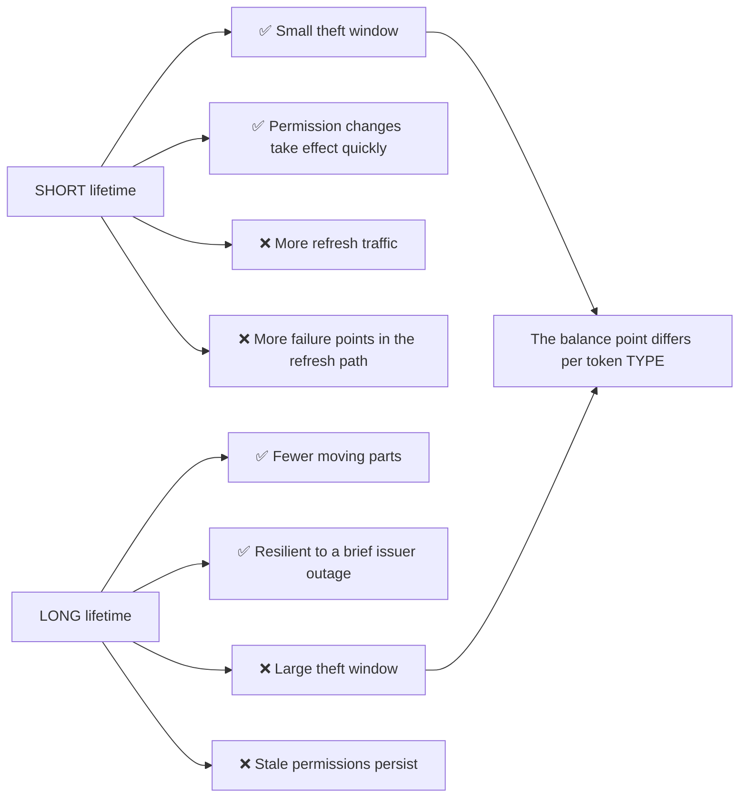
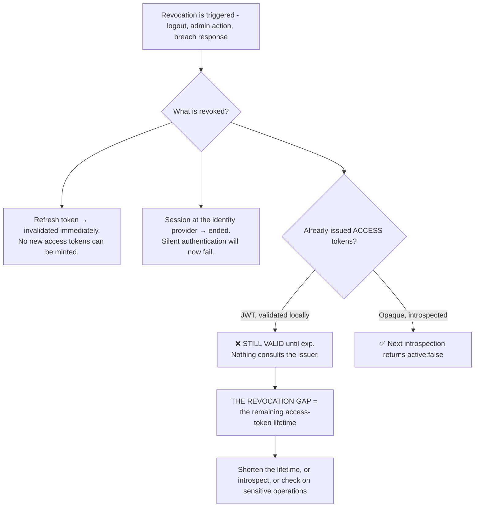
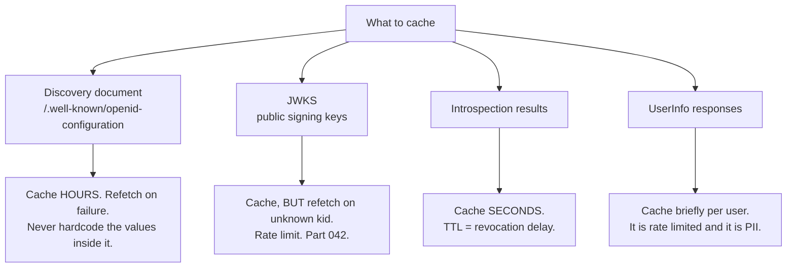
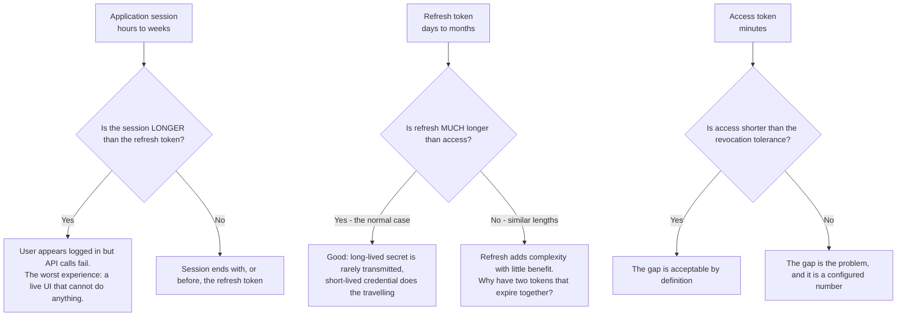
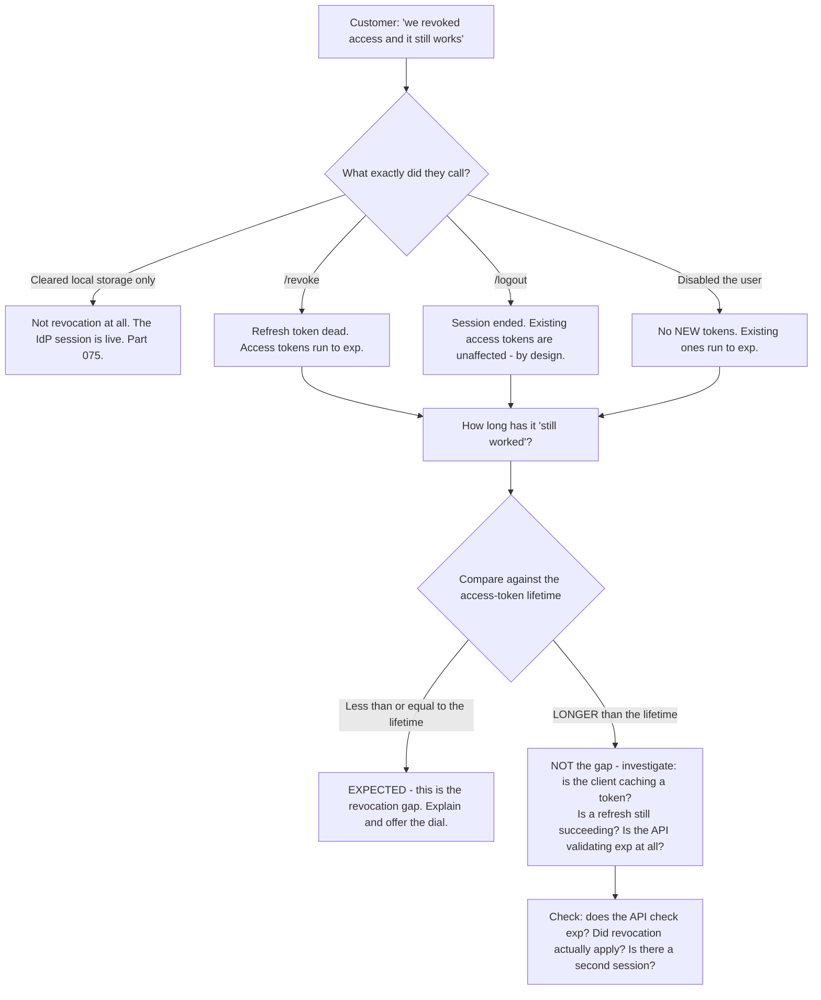

# Part 045 - Token Lifetime, Revocation, Introspection, and Caching

> Section goal: Understand the operational half of tokens — how long they should live, what revocation actually achieves and what it cannot, and how caching decisions determine whether an identity integration is fast, correct, and resilient. This is where token theory meets production reality, and where most of the design conversations in this role happen.

Covers index item **045**. Maps to JD signals: *basic security concepts*, *strong analytical and problem-solving skills*, *experience with troubleshooting web applications*, *communicate technical concepts clearly*, and *promote best practices*.

---

## 1. Start From Zero: Lifetime Is a Trade, Not a Setting

Every token lifetime is a negotiation between two costs.

**There is no universally correct number**, but there are strong defaults, and the ratios matter more than the absolutes.

| Token | Typical lifetime | Why |
|---|---|---|
| **ID token** | 5–60 minutes | Consumed once at login; expiry rarely matters |
| **Access token** | **5–60 minutes** | Short, because it cannot be revoked |
| **Refresh token** | Days to months, often sliding | Long, because it is revocable and rarely transmitted |
| **Session cookie** | Hours to weeks | Governed by the app, independent of tokens |

> **Analogy.** A hotel keycard that expires at checkout versus a signed letter of introduction valid for a year. The keycard is low-risk because it dies soon and the front desk can deactivate it. The letter is powerful and long-lived, which is why you keep it in a safe rather than your pocket.
>
> **Where it stops:** a hotel can deactivate the keycard mid-stay. A JWT access token cannot be deactivated at all, which inverts the intuition — here the *short* life *is* the deactivation mechanism.

---

## 2. What Revocation Actually Does

This is the single most misunderstood area in token operations, and the misunderstanding produces confident, incorrect expectations on both sides of a ticket.

### The revocation gap

> **Revocation gap = how long an already-issued access token remains usable after revocation.**

| Design | Gap |
|---|---|
| JWT, 60-minute lifetime | **Up to 60 minutes** |
| JWT, 5-minute lifetime | Up to 5 minutes |
| Opaque, introspected every request | ~0 |
| Opaque, introspection cached 60s | ~60 seconds |

**The gap equals the access-token lifetime, or the introspection cache TTL — whichever design is in use.** That one sentence answers a large fraction of "we revoked access and it didn't work" tickets.

### 🔍 Plain-English deep-dive: how to have the revocation conversation

A customer says: *"We terminated an employee, revoked their access, and they could still call our API for forty minutes. This is a critical security defect in your product."*

The temptation is to correct the "defect" framing immediately. That is usually the wrong opening, because the underlying concern is legitimate and urgent, and leading with "actually it's working correctly" sounds dismissive regardless of how true it is.

**A better sequence:**

**1. Acknowledge the real concern first.** They are describing a terminated employee retaining access. That is genuinely serious and it deserves to be treated as such before anything else.

**2. Confirm what *did* work.** Their revocation succeeded: the refresh token is dead, the session is ended, and no new tokens can be minted. The person could not have re-authenticated. That bounds the exposure and is reassuring in a concrete way.

**3. Explain the gap without jargon.** The access token they already held is self-contained and signed — the API verifies it locally without asking the identity provider anything, which is why it is fast and scales. The cost of that design is that it cannot be recalled early; it simply expires. Forty minutes matches their configured lifetime.

**4. Give them the dial, with the trade named.** Their access-token lifetime is the gap. Reducing it to five minutes reduces the gap to five minutes, at the cost of more refresh traffic. If they need it closer to zero, opaque tokens with introspection do that, at the cost of a network call per request and coupling their API's availability to the identity provider's.

**5. Offer the pragmatic middle.** Most organisations keep JWTs and short lifetimes, and add an explicit revocation check on genuinely sensitive operations only — deleting data, changing payment details, granting access. That gets near-instant enforcement where it matters without paying the latency cost everywhere.

**6. Address the offboarding process, because it is the actual fix.** Forty minutes of API access after termination is a *process* question as much as a token question. Disabling the account, revoking sessions, and rotating any shared credentials should be one automated step, and it should happen before the person knows they are being terminated. Raising this is more valuable than anything about token lifetimes, and it is the kind of observation that changes how a customer sees the support relationship.

**What makes this answer good is that no step is defensive.** The customer leaves with an accurate model, a specific configuration change, a design option, and a process improvement — and they were never told they were wrong.

**Analogy:** a fire drill revealing that the alarm works but the doors take forty seconds to unlock. The alarm is not defective; the sequence has a gap, and the gap is a number you can change. **Where it stops:** doors can be unlocked manually by a human on site. A JWT has no manual override, which is exactly why the number matters.

---

## 3. The Two Revocation Endpoints

| Endpoint | RFC | What it does |
|---|---|---|
| **`/oauth/revoke`** | RFC 7009 | Invalidates a **refresh token** (and its access tokens, if the server supports it) |
| **`/oauth/introspect`** | RFC 7662 | Asks whether a token is currently `active` |
| **`/v2/logout`** / RP-initiated logout | OIDC RP-Initiated Logout | Ends the **session at the identity provider** (Part 075) |

**These are three different things**, and conflating them produces distinct tickets:

| They did | They expected | Actually happened |
|---|---|---|
| Cleared local storage | User logged out everywhere | IdP session intact — next login is silent, looks like "logout doesn't work" (Part 076) |
| Called `/revoke` | Access tokens died instantly | Refresh token died; access tokens ran to `exp` |
| Called `/logout` | API access stopped | Session ended; existing access tokens still valid |
| All three | Everything stopped | ✅ Correct — plus the revocation gap |

**"Logout doesn't work" is almost always the first row**, and it is worth recognising instantly: the application cleared its own state but never told the identity provider, so the next login finds a live session and completes without a prompt.

---

## 4. Caching: Where Correctness Meets Performance

Four things get cached in an identity integration, and each has a different correct answer.

| What | Cache for | The failure if you get it wrong |
|---|---|---|
| **Discovery** | Hours | Hardcoding instead → outage when an endpoint moves |
| **JWKS** | Hours **+ refetch on unknown `kid`** | TTL-only → **mass 401s at rotation** (Part 042) |
| **Introspection** | Seconds | No cache → latency and rate limits. Long cache → revocation delay |
| **UserInfo** | Briefly, per user | No cache → rate limits, and it is personal data at rest |

### 🔍 Plain-English deep-dive: the cache that becomes the outage

Caching failures in identity share a distinctive shape: **the cache is correct for a long time, then becomes catastrophically wrong at a moment nobody chose.**

Three recurring examples:

**1. Hardcoding instead of caching.** Someone reads the discovery document once, copies `jwks_uri` and `issuer` into configuration, and never fetches it again. This is not a cache — it is a permanent snapshot. It works for years and then fails completely when the issuer changes an endpoint or the tenant moves to a custom domain. **The tell in a code review is a URL that should have come from discovery appearing as a literal.**

**2. Caching failures.** A JWKS fetch fails transiently; the caching layer stores the *error*. Now every verification fails until the negative entry expires, and the original transient problem is long gone. **Never cache a failure for a key lookup** — retry with backoff instead, and keep serving the last known-good key set while retrying.

**3. Caching without a refresh trigger.** The Part 042 rotation case: a TTL-only JWKS cache that has no concept of "I saw a `kid` I don't recognise, I should look again." The cache is *correct* by its own rules and simultaneously causing a total outage.

**The unifying principle:** an identity cache needs **both** a time-based expiry and an event-based invalidation. Time alone is insufficient because the events — rotation, endpoint change, revocation — do not happen on your schedule.

**A fourth pattern worth knowing** is stampede: a cache expires and a hundred concurrent requests all fetch the JWKS simultaneously, hitting a rate limit and failing together. Serving stale-while-revalidate, or letting a single request refresh while others use the previous value, avoids it. **This shows up as a brief total outage exactly at cache-expiry boundaries**, which makes it look periodic and mysterious until someone notices the interval matches the TTL.

**Analogy:** a printed staff directory. Useful, and wrong the moment someone joins. The fix is not to reprint it more often — it is to have a way to look up a name that is not in it. **Where it stops:** a stale directory is an inconvenience. A stale key set is a hard failure with no fallback, because verification has no partial-credit outcome.

---

## 5. Choosing Lifetimes in Practice

| Context | Access token | Refresh token | Reasoning |
|---|---|---|---|
| SPA in a browser | 5–15 min | Rotating, short absolute | Highest exposure — XSS, shared device |
| Native mobile app | 15–60 min | Long, rotating | Secure device storage; offline tolerance matters |
| Server-side web app | 15–60 min | Long | Tokens never reach the browser |
| Machine-to-machine | 15–60 min | **None** | Client credentials re-requests directly (Part 060) |
| High-security operations | 5 min | Short | Small gap, plus a revocation check on the operation |

### The questions that determine the answer

1. **How exposed is the storage?** Browser > mobile > server.
2. **How damaging is a stolen token?** Read-only data versus payment or admin actions.
3. **How quickly must a permission change take effect?** This *is* the lifetime.
4. **How tolerant is the client of refresh failures?** Offline mobile use argues for longer.
5. **What is the refresh path's reliability?** If refresh is fragile (third-party cookies, Part 017), a very short lifetime multiplies a existing problem.

**That last question is the one people skip**, and it is why "shorten the lifetime" occasionally makes things dramatically worse rather than better.

### 🔍 Plain-English deep-dive: the ratio matters more than the numbers

Customers ask for the "right" lifetime. A more useful frame is the **relationship** between the three lifetimes, because that is what determines how the system behaves.

**The failure in the top-right box is the one worth memorising**, because it produces a distinctive and infuriating ticket: an application session that outlives the refresh token. The user is still "logged in" — the UI renders, their name is displayed, navigation works — but every API call fails, because there is no way to obtain a fresh access token and no prompt to re-authenticate. **The application looks healthy and does nothing.**

The correct behavior is for the application to detect a failed refresh and treat it as a logout — clear its session and send the user through authentication again. Many applications instead retry silently, which produces the "spinning forever" symptom.

**A second relationship worth checking** is whether the refresh token's *absolute* lifetime and the application's maximum session age agree. If the app allows a 30-day session and the refresh token has a 7-day absolute cap, then every user hits a hard failure on day 7 regardless of activity — and it will be reported as an intermittent bug because it depends on when each user first logged in.

**The support move:** when someone reports "logged in but nothing works," ask for all three lifetimes before anything else. The mismatch is usually visible immediately, and it converts a vague UI bug into a configuration answer.

**Analogy:** a gym membership card that works at the door but not the lockers, because the locker system's subscription expired first. Nothing is broken; two expiry dates were set independently by people who never compared them. **Where it stops:** a gym member gets an explanation at the desk. An application gives no signal at all, which is why the three numbers have to be compared deliberately.

---

## 6. Failure Modes

| Failure mode | What it looks like | Consequence | Correction |
|---|---|---|---|
| **Expecting instant JWT revocation** | "We revoked it and it still works" | Confusion; a wrong "security defect" claim | Explain the gap; shorten the lifetime |
| **Very long access-token lifetime** | Chosen to avoid refresh complexity | Large theft window; stale permissions | Short access + refresh |
| **Very short lifetime on a fragile refresh path** | Constant re-login | **Worse** than before | Fix refresh first (Part 017, Part 061) |
| **Clearing local storage as "logout"** | Next login is silent | "Logout doesn't work" | Call RP-initiated logout (Part 075) |
| **Confusing revoke with logout** | Wrong endpoint called | Expectation unmet | Three distinct endpoints |
| **Hardcoding discovery values** | Works for years | Outage when an endpoint moves | Fetch discovery; cache it |
| **TTL-only JWKS cache** | Mass 401s at rotation | **Outage** | Refetch on unknown `kid` (Part 042) |
| **Caching a JWKS fetch failure** | All verification fails | Outage outlives the cause | Never cache key-lookup failures |
| **Cache stampede at expiry** | Brief total outage, periodic | Rate limits hit | Stale-while-revalidate |
| **Introspecting uncached every request** | Slow API | Latency and throttling | Short-TTL cache |
| **Introspection cache too long** | Revocation delayed | The reason for opaque tokens is lost | TTL = acceptable gap |
| **Caching UserInfo indefinitely** | Stale profiles; PII at rest | Privacy and correctness | Short per-user cache |
| **Sliding refresh with no absolute limit** | Session never truly ends | Indefinite access | Set an absolute lifetime too |

---

## 7. Troubleshooting Decision Tree: "Revocation Didn't Work"

### Worked example

*"We disabled a user in the dashboard. Two hours later they were still hitting our API."*

1. **Establish the access-token lifetime.** Their tenant: 24 hours. **That single fact reframes the entire ticket.**
2. **Two hours is well inside a 24-hour lifetime.** This is the gap, behaving exactly as configured.
3. **Confirm the revocation worked.** Ask them to attempt a login as that user — it should fail. It does. So no *new* tokens can be issued, and the exposure is bounded and shrinking.
4. **Name the cause without blame.** A 24-hour access-token lifetime means up to 24 hours of residual access after any revocation. That number was probably chosen to reduce refresh traffic, and the consequence was not obvious at the time.
5. **Offer the dial.** Reduce the access-token lifetime — 15 minutes is typical — which reduces the worst case to 15 minutes. Confirm their refresh path is healthy first, because shortening the lifetime on a broken refresh path produces constant re-logins.
6. **Offer the design option.** If they need near-zero, opaque tokens with introspection, or a revocation check on sensitive operations only.
7. **Raise the process point.** Two hours between disabling a user and noticing continued access suggests offboarding is manual. Disable, revoke sessions, and rotate credentials should be one automated action.
8. **Write it up** (Part 115) with the lifetime, the gap, the change, and the verification step — so the next person does not rediscover it.

---

## 8. Lab: Measure the Gap

**Purpose.** Turn revocation from an abstraction into a measured number you have observed yourself, and build the artifacts to explain it.

**Prerequisites.** Parts 040–044 artifacts. A free Auth0 tenant, a test API, and a Node API you control.

**Steps.**

1. Create `okta-prep/labs/045-lifetime/`.
2. **Record the defaults.** Note your tenant's configured lifetimes for ID token, access token, and refresh token. **Screenshot the settings.**
3. **Verify by decoding.** Compute `exp - iat` for each token and confirm it matches the configured value. **Where they differ, find out why** — some settings are per-application or per-API rather than tenant-wide, and discovering that is the point.
4. **Measure the gap — the central experiment.** Obtain an access token. Revoke the refresh token via `/oauth/revoke`. Then call your API **every 30 seconds**, logging success or failure with timestamps, until it fails. **Record the elapsed time.** Compare it to the configured lifetime.
5. **Shorten and re-measure.** Reduce the access-token lifetime to the minimum your tenant allows. Repeat step 4. **Plot both results.** This two-line chart is the single most persuasive artifact for the §2 conversation.
6. **Introspection contrast.** If your tenant supports opaque tokens, repeat with introspection and measure the gap again. Expect near zero. Then add a 60-second introspection cache and measure a third time.
7. **Logout versus revoke.** Perform each separately. After each, test: (a) can the API still be called, (b) does a silent re-login succeed. **Build a 2×2 result table.** This table answers the "logout doesn't work" ticket directly.
8. **The local-storage illusion.** Clear the app's storage without calling logout. Attempt a login. **Confirm it completes with no prompt.** Record it — this is the most common logout misunderstanding, demonstrated.
9. **Refresh rotation.** Use a refresh token twice. Confirm whether the first is invalidated. **Note whether reuse detection revoked the whole family** (Part 061).
10. **Break the cache — three ways.** In your own verifier: (a) hardcode `jwks_uri` and then change the discovery document to point elsewhere; (b) cache a JWKS fetch failure and observe that verification stays broken after the network recovers; (c) expire the cache with concurrent requests and observe the stampede. **Record all three.**
11. **Fix all three.** Fetch discovery, never cache key-lookup failures, and serve stale-while-revalidate. Re-run and confirm.
12. **Sliding versus absolute.** If your tenant supports both, configure a sliding refresh lifetime with an absolute cap and confirm the cap actually terminates the session. **Note what happens with no absolute cap** — indefinite access.
13. **Write the explainer.** `revocation-gap.md` — one page, customer-facing: what revocation does, what it cannot do, the gap formula, and the three options. Include your measured chart.
14. **Failure catalog + manifest.** Complete `MANIFEST.md`.

**Expected evidence.** Configured lifetimes verified by decoding, two measured revocation gaps plotted, an introspection contrast, a logout-versus-revoke 2×2 table, a demonstrated local-storage illusion, refresh rotation behavior determined, three cache failures reproduced and fixed, and a one-page customer explainer with real measurements.

**Validation rubric.**

| Check | Pass condition |
|---|---|
| Lifetimes verified | Decoded values match configuration, discrepancies explained |
| Gap measured | Elapsed time recorded, matches the lifetime |
| Gap re-measured | Shortened lifetime produces a shorter gap, plotted |
| Introspection contrast | Near-zero gap observed; cached gap ≈ TTL |
| Logout versus revoke | 2×2 table complete |
| Local-storage illusion | Silent login after clearing storage, recorded |
| Three cache failures | All reproduced, then fixed and re-verified |
| Absolute cap | Session terminates at the cap |
| Explainer | One page, includes the measured chart |

**Cleanup and privacy.** Lab tenant, synthetic users, localhost only. **Restore original tenant settings afterwards** and note them beforehand. Revoke every refresh token at the end. Delete captured tokens. Never run gap measurements against an employer or customer tenant.

---

## 9. JD Mapping

| Supplied JD signal | How this Part supports it |
|---|---|
| **Basic security concepts** | The revocation gap, storage exposure, absolute session caps |
| Strong analytical and problem-solving skills | Comparing elapsed time against configured lifetime as a diagnosis |
| Experience troubleshooting web applications | Logout, revoke, and cache failures end to end |
| **Communicate technical concepts clearly** | §2's six-step conversation with no defensive step |
| **Promote best practices** | Discovery over hardcoding, event-based invalidation, absolute caps |
| Exceed expectations on response quality | A measured chart instead of an assertion |
| **Ownership from start to resolution** | Raising the offboarding-process point nobody asked about |

---

## 10. Candidate Honesty Note

- **Claim safety:** *Learned architecture and lab experience.* You have measured a revocation gap in a lab; you have not set token policy for a production platform.
- **The strongest thing you can say:** *"The revocation gap equals the access-token lifetime, or the introspection cache TTL. Revoking kills the refresh token and the session, so no new tokens can be minted — but a JWT already issued is verified locally, so nothing consults the issuer and it runs to `exp`. That one sentence answers most 'revocation didn't work' tickets."*
- **A second point, and this is the one that shows judgement rather than knowledge:** *"When someone reports it as a critical security defect, I don't lead with 'it's working correctly' — that's true and it sounds dismissive. I acknowledge that a terminated employee retaining access is serious, confirm what did work so the exposure is bounded, explain the gap plainly, give them the dial with the trade named, and then raise the offboarding process, because two hours of residual access is usually a process gap as much as a token setting."*
- **A third, on caching:** *"Identity caches need both time-based expiry and event-based invalidation. Time alone fails because rotation, endpoint changes and revocation don't happen on your schedule. And never cache a key-lookup failure — the outage then outlives the cause by however long the negative TTL is."*
- **A fourth, which is a useful piece of restraint:** *"'Shorten the lifetime' is the obvious advice and it's occasionally wrong. If the refresh path is fragile — third-party cookie restrictions, a mobile app losing state — shortening the lifetime multiplies an existing problem into constant re-logins. Check that refresh is healthy first."*
- **A fifth:** *"'Logout doesn't work' is usually an app clearing its own storage without calling RP-initiated logout. The IdP session is still live, so the next login completes silently and looks like the logout was ignored."*
- **Do not overstate:** you have not owned token lifetime policy or a revocation architecture in production. Say the trade-offs are clear and you have measured them in a lab, and that production judgement at scale is what the role would add.

---

## 11. Official Source Anchors

Accessed **26 August 2026**.

| Source | What it defines |
|---|---|
| IETF RFC 7009 | Token revocation semantics and which tokens are affected |
| IETF RFC 7662 | Introspection, the `active` field, and caching considerations |
| IETF RFC 6749 §1.5, §10 | Refresh tokens and security considerations on lifetime |
| OAuth 2.0 Security BCP | Lifetime, rotation, and sender-constraining recommendations |
| OpenID Connect RP-Initiated Logout | Ending the session at the identity provider (Part 075) |
| OpenID Connect Discovery | The document that must be fetched rather than hardcoded |
| Auth0 documentation — token lifetimes and refresh rotation | Tenant defaults, sliding and absolute lifetimes |
| Okta developer documentation — session and token lifetime | Okta's lifetime model |

**Revalidate after 26 August 2026:** RFCs are stable. Recheck vendor defaults — these change — and OAuth 2.1 (Part 066) for consolidated lifetime guidance.

---

## ⭐ Likely Interview Questions for This Section

### Q1. "A customer revoked a user's access but they could still call the API. Walk me through your response."
> *Model answer:* "First I'd acknowledge the concern rather than the framing — a terminated employee retaining access is genuinely serious and leading with 'it's working as designed' sounds dismissive even when it's true. Then I'd confirm what did work: the refresh token is dead and the session is ended, so no new tokens can be minted and the exposure is bounded and shrinking. Then explain the gap: a JWT access token is self-contained and verified locally, so nothing consults the issuer and it runs to `exp` — and the duration they saw will match their configured lifetime. Then give them the dial: shortening the access-token lifetime shortens the gap proportionally, opaque tokens with introspection take it near zero at the cost of a call per request, and a middle path is a revocation check on sensitive operations only. Finally I'd raise offboarding as a process — if there were hours between disabling the user and noticing, that's worth automating, and it's usually more valuable than the token setting."

### Q2. "What is the revocation gap?"
> *Model answer:* "How long an already-issued access token stays usable after revocation. For a locally-validated JWT it equals the remaining access-token lifetime, because the API never asks the issuer anything — it verifies the signature and reads `exp`, and revocation is invisible to it. For opaque tokens with introspection it's near zero, or equal to the introspection cache TTL if there is one. So the gap is a number you configure, not an accident, and 'we revoked it and it still worked for forty minutes' is diagnosable in one question: what's your access-token lifetime? If the observed duration is less than or equal to it, that's the gap. If it's *longer*, something else is wrong — the client may be caching a token, refresh may still be succeeding, or the API may not be checking `exp` at all."

### Q3. "How would you advise on access-token lifetime?"
> *Model answer:* "By asking five questions rather than giving a number. How exposed is the storage — a browser is worse than a mobile device, which is worse than a server. How damaging is a stolen token — read-only data or payment changes. How quickly must a permission change take effect, because that *is* the lifetime. How tolerant is the client of refresh failures — offline mobile use argues for longer. And how reliable is the refresh path, which is the one people skip. That last one matters because 'shorten the lifetime' is the obvious advice and it's occasionally wrong: if refresh is already fragile — third-party cookie restrictions in a browser, or a mobile app losing state on restart — shortening the lifetime turns an occasional annoyance into constant re-logins. Fix refresh first, then shorten. Typical answers land at five to fifteen minutes for a SPA and fifteen to sixty elsewhere."

### Q4. "A customer says logout doesn't work. What's your first thought?"
> *Model answer:* "That they're clearing their own application state without telling the identity provider. The app deletes its session or local storage, the user appears logged out, and then the next login completes silently with no prompt — because the IdP session is still live, so silent authentication succeeds immediately. From the user's side that looks exactly like logout being ignored. The fix is RP-initiated logout: redirect to the provider's logout endpoint so the IdP session actually ends. I'd also separate three things that get conflated — clearing local state, revoking a refresh token, and ending the IdP session are three different operations with three different effects, and calling one while expecting all three is the root of most of these tickets. Doing all three plus accepting the revocation gap is the complete answer."

### Q5. "What would you cache in an identity integration, and for how long?"
> *Model answer:* "Four things, four answers. The discovery document for hours — and critically, cache it rather than hardcoding values out of it, because a hardcoded `jwks_uri` or issuer works for years and then fails completely when something moves. JWKS for hours, but with refetch on an unknown `kid`, rate limited, because a TTL-only cache produces mass 401s at rotation. Introspection results for seconds, understanding that the TTL *is* the revocation delay, so it's a dial. And UserInfo briefly per user, because it's rate limited and it's personal data you're now storing. The unifying principle is that identity caches need both time-based expiry and event-based invalidation — time alone is insufficient because rotation, endpoint changes and revocation don't happen on your schedule."

### Q6. "What's the worst caching mistake you can make here?"
> *Model answer:* "Caching a failure. If a JWKS fetch fails transiently and the caching layer stores the error, then every token verification fails until that negative entry expires — and by then the original network blip is long gone, so the outage outlives its cause and the timeline makes no sense to whoever's investigating. Key lookups should retry with backoff and keep serving the last known-good key set while retrying. A close second is the stampede: a cache expires and a hundred concurrent requests all fetch simultaneously, hit a rate limit, and fail together. That one's nasty because it looks periodic — brief total outages at regular intervals — and it stays mysterious until someone notices the interval matches the TTL. Stale-while-revalidate fixes it."

### Q7. "When would you recommend opaque tokens over JWTs?"
> *Model answer:* "When the revocation gap is genuinely unacceptable and they've understood what it costs. Opaque tokens give near-instant revocation because the API introspects on every request — but that's a network call per request, it couples the API's availability to the identity provider's, and it puts the API against introspection rate limits. For most systems, JWTs with a short lifetime are the better trade: the gap is minutes and there's no runtime dependency. Where I'd push toward opaque is high-consequence operations — financial transactions, admin actions, anything where minutes of residual access is a real risk. And there's a middle path worth offering: keep JWTs everywhere, but add an explicit revocation check on just those sensitive operations. That gets near-instant enforcement where it matters without paying latency on every read."

### Q8. "Why does a sliding refresh-token lifetime need an absolute cap?"
> *Model answer:* "Because without one, a session never actually ends. A sliding lifetime extends on each use, so a client that refreshes regularly keeps its refresh token alive indefinitely — and a stolen refresh token being used by an attacker is, by definition, being used regularly. The sliding window that was meant to expire inactive sessions instead guarantees the active malicious one survives forever. An absolute cap sets a hard ceiling regardless of activity, so the user re-authenticates eventually and the credential family genuinely dies. It's the same principle as a maximum session age in a web app: inactivity timeouts protect against abandoned sessions, absolute timeouts protect against long-lived compromise, and you need both because they defend against different things."

---

## 🧠 30-Second Memory Hooks

- **Revocation gap = access-token lifetime** (JWT) **or introspection cache TTL** (opaque).
- Revocation kills the **refresh token + session**. Already-issued **JWTs run to `exp`**.
- **Three different operations:** clear local state · `/revoke` · RP-initiated logout. Do all three.
- **"Logout doesn't work"** = cleared storage, never told the IdP. Next login is silent.
- **Access 5–60 min. Refresh days–months. ID token consumed once.**
- **Shortening the lifetime is wrong if refresh is fragile.** Fix refresh first.
- **Cache four things:** discovery (hours) · JWKS (hours **+ unknown-`kid` refetch**) · introspection (seconds) · UserInfo (briefly).
- **Caches need time expiry AND event invalidation.** Time alone is not enough.
- **Never cache a key-lookup failure.** The outage outlives the cause.
- **Stampede = periodic brief outages at the TTL interval.** Stale-while-revalidate.
- **Sliding refresh needs an ABSOLUTE cap**, or a stolen token lives forever.
- **Don't lead with "working as designed."** Acknowledge, bound, explain, offer the dial.

---

## ✅ Completion Checklist

- [ ] **Knowledge:** I can state the gap formula, the three revocation operations, and the four cache targets from memory.
- [ ] **Lab artifact:** `045-lifetime/` contains two measured and plotted revocation gaps, a logout-versus-revoke 2×2, a demonstrated local-storage illusion, three reproduced-and-fixed cache failures, and a customer explainer with real numbers.
- [ ] **Spoken:** I can deliver the §2 conversation in 90 seconds with no defensive step.
- [ ] **Judgement:** I check refresh-path health before recommending a shorter lifetime, and I raise the offboarding process unprompted.
- [ ] **Honesty check:** I say "measured in a lab," not production token policy.
- [ ] **Source check:** I have read RFC 7009 and RFC 7662's caching notes myself.

---

*Next suggested section:* **[Part 046 - Authentication versus Authorization and the Trust Model](Part-046-authentication-versus-authorization-and-the-trust-model.md)** — Group E begins: the conceptual foundations that everything from Part 056 onwards is built on.
