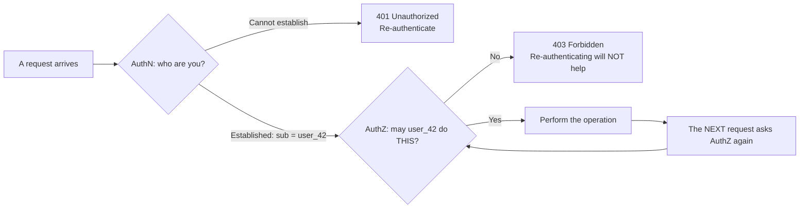
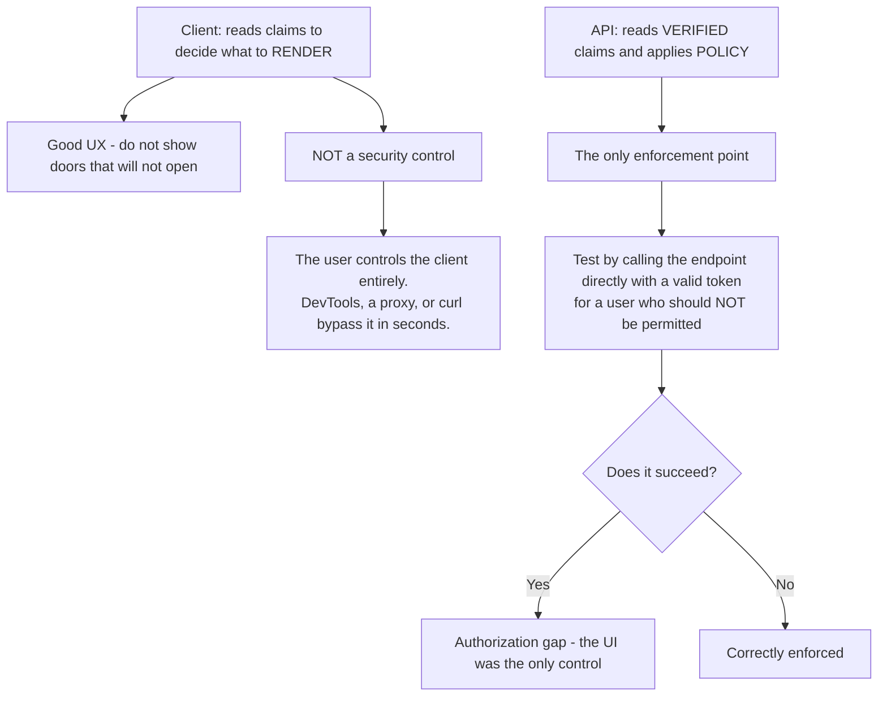
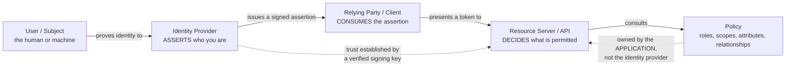
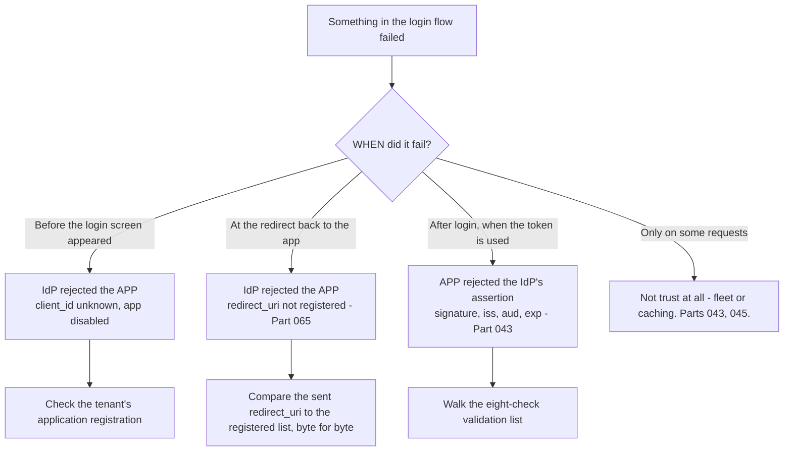
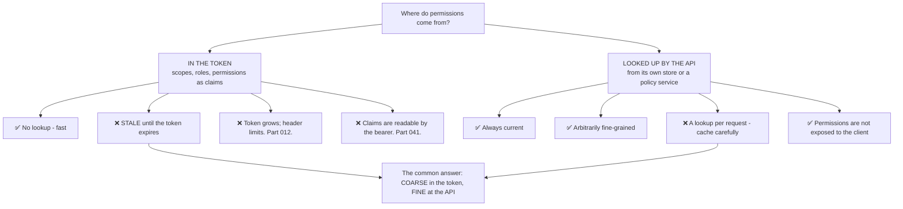
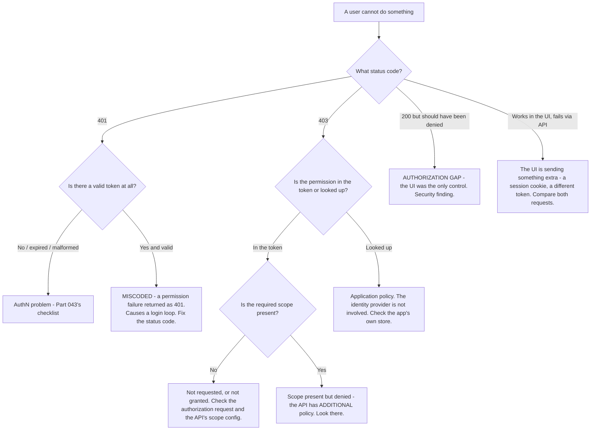

# Part 046 - Authentication versus Authorization and the Trust Model

> Section goal: Establish the conceptual spine that every protocol in Groups F, G and H hangs from — who is asserting what, who is deciding what, and why those must be separate. Almost every identity design mistake is a confusion of these two questions, and being able to name which one is broken is the fastest triage tool you will own.

Covers index item **046**. Maps to JD signals: *knowledge of authentication and authorization*, *basic security concepts*, *strong analytical and problem-solving skills*, and *communicate technical concepts clearly*.

---

## 1. Start From Zero: Two Different Questions

| | Authentication (AuthN) | Authorization (AuthZ) |
|---|---|---|
| Question | **Who are you?** | **What may you do?** |
| Output | An identity | A decision: permit or deny |
| Happens | Once per session | On **every** operation |
| Owned by | The identity provider | **The application or API** |
| Failure code | **401** | **403** |
| Protocol | OIDC, SAML | OAuth 2.0, RBAC/ABAC/ReBAC |
| Evidence | A password, a passkey, an assertion | A policy plus attributes |

**Note the loop.** Authentication happens once and produces a durable identity. Authorization is asked again for every single operation, because the answer can differ per resource, per action, and per moment.

> **Analogy.** Airport security checks *who you are* against your passport. The gate agent checks *whether you may board this flight* against your ticket. Different staff, different evidence, different failure modes — and passing security does not board you.
>
> **Where it stops:** an airport authenticates you once and authorizes you once. A real system re-authorizes constantly, and the answer can change between two clicks — which is why authorization cannot be cached in the client.

---

## 2. Why the Separation Matters

Collapsing the two produces a specific, recognisable class of bug.

| Collapse | What it looks like | Consequence |
|---|---|---|
| **"They logged in, so they can do it"** | AuthN treated as AuthZ | 🔴 Every authenticated user has full access |
| **"The token is valid, so allow it"** | Signature check treated as a decision | 🔴 Any token from the issuer is accepted (Part 043) |
| **"The UI hides the button"** | Client-side AuthZ | 🔴 The API is unprotected |
| **"They're in the admin group"** | Group membership treated as a permission | Coarse, stale, and unauditable |
| **401 for a missing permission** | AuthZ failure reported as AuthN | Infinite login loop (Part 043) |

### 🔍 Plain-English deep-dive: the UI is not a security boundary

Hiding a button is a **usability** decision. It is not a control. Anyone can open DevTools, read the JavaScript, find the endpoint, and call it directly with a valid token (Part 021).

This produces one of the most common findings in a support conversation, and it is worth handling well because the developer is usually not being careless — they are reasoning from a client-side mental model where the UI *is* the application.

**The distinction to make explicit:**

| Layer | Job | Trust |
|---|---|---|
| **UI** | Show what is *likely* permitted | ❌ **None** — attacker-controlled |
| **API** | **Decide and enforce** | ✅ The only real boundary |

**The rule:** *the client decides what to render; the API decides what is permitted.* Both may consult the same claims, but only one of them is a control.

**The test in that diagram is the useful artifact.** "Call the endpoint directly with a token for an unprivileged user" is a single curl command, it takes a minute, and it converts an architectural argument into an observed result. Suggesting it is far more effective than asserting the principle — and if it *does* succeed, the customer discovers it themselves rather than being told.

**Analogy:** removing a door from the floor plan handed to visitors. The door is still there, still unlocked, and anyone who walks the corridor finds it. **Where it stops:** a visitor needs to be inside the building. A web client is *given* the entire floor plan by design — the JavaScript is downloaded to the attacker's machine.

---

## 3. The Trust Model

Every identity system is a set of parties agreeing to believe each other about specific things.

| Party | Standard names | Asserts or decides |
|---|---|---|
| **Subject** | User, principal, `sub` | Nothing — is the topic |
| **Identity Provider (IdP)** | OP (OIDC), IdP (SAML), Authorization Server | **Asserts** identity |
| **Relying Party** | Client, SP (SAML), RP (OIDC) | **Consumes** the assertion |
| **Resource Server** | API, protected resource | **Decides** access |
| **Policy** | RBAC/ABAC/ReBAC engine (Part 051) | Supplies the rule |

### What "trust" concretely means

Trust here is not a feeling. It is **three verifiable facts**:

1. The relying party holds the identity provider's **public key** and verifies signatures against it (Part 042).
2. The relying party knows the identity provider's **exact issuer identifier** and checks `iss` (Part 043).
3. The identity provider knows the relying party's **registered identifiers** — client ID, redirect URIs — and refuses anything else (Part 065).

**Break any one of the three and the trust relationship is broken**, and the symptom is usually a rejection that looks like a configuration typo — because it is one.

### 🔍 Plain-English deep-dive: trust is directional, and both directions can fail

A useful refinement: the trust between an identity provider and an application is **not symmetric**. Each side verifies something different about the other, and the two failures produce completely different symptoms.

| Direction | What is verified | How | Symptom when it fails |
|---|---|---|---|
| **App trusts the IdP** | "This assertion really came from the provider I expect" | Signature against JWKS, `iss` string match | Token rejected — *after* login appears to succeed |
| **IdP trusts the app** | "This request really came from a client I registered" | `client_id`, registered `redirect_uri`, client secret or PKCE | Login rejected — *before* anything is issued |

**The timing difference is the diagnostic.** If the failure happens *before* the user sees a login screen, or immediately on the redirect back, the identity provider is refusing the application — an unregistered redirect URI, a wrong client ID, a disabled application. If the failure happens *after* a successful login, when the token is presented, the application is refusing the provider — a signature, issuer, or audience problem.

**Why this is worth internalising:** a customer reporting "SSO is broken" gives you no layer. Asking *when* it broke — before the login page, at the redirect, or when calling the API — narrows a three-party system to one link, in a single question, before you have looked at any evidence.

**A third direction exists and is easy to forget:** the **user** trusts the identity provider, which is what consent screens and recognisable branding are for (Part 102). A login page on an unexpected domain trains users to enter credentials wherever they are asked, which is the entire mechanism of phishing (Part 055).

**Analogy:** a visa. The country verifies your documents; your government verifies the country is one it recognises; and you verify the embassy is a real embassy before handing over your passport. Three checks, three parties, three different failure modes. **Where it stops:** a person can notice a suspicious embassy. Software verifies only what it was configured to verify, which is why the registration lists matter so much.

---

## 4. Where Authorization Data Comes From

A frequent design question: should permissions live in the token, or be looked up by the API?

| Approach | Good for | Bad for |
|---|---|---|
| **In the token** | Coarse scopes: `read:orders`, `write:orders` | Per-record permissions; anything that changes often |
| **API lookup** | *"May user 42 edit document 91?"* | Anything needing zero-latency |
| **Hybrid** (usual) | Scope gates the endpoint; the API checks the specific object | — |

**The hybrid is the answer to give**, and the sentence that captures it is: *the token says what kind of thing you may do; the API decides whether you may do it to this particular object.* Part 051 develops this properly.

---

## 5. Machine Identity

Not every subject is a person, and this is increasingly the interesting case.

| | Human identity | Machine identity |
|---|---|---|
| Authenticates with | Password, passkey, MFA | A client secret, a certificate, a signed assertion |
| Flow | Authorization Code (Part 058) | **Client Credentials** (Part 060) |
| Has a session | ✅ | ❌ No session, no browser |
| Consent | Meaningful | Not applicable |
| `sub` | A user | The client itself |
| Scale | Thousands | **Millions** — and growing faster |

**Okta's current positioning — "Securing every identity. Human & machine." — makes this explicit**, and the AI-agent case (Part 109) is the sharpest version: an agent acting *on behalf of* a user needs an identity of its own, a delegated authority, and a bounded scope. That is a genuinely current topic and a good thing to have an opinion about.

### 🔍 Plain-English deep-dive: why a service must never use a human's credentials

The shortcut is everywhere: a nightly job needs API access, so someone creates it under their own account, or worse, hardcodes a colleague's credentials. It works immediately and it costs nothing to set up.

It fails in five distinct ways, and being able to list them turns a vague "that's bad practice" into a concrete argument:

| Problem | What happens |
|---|---|
| **Offboarding breaks production** | The person leaves, the account is disabled, and a batch job fails at 02:00 with no obvious link to an HR action taken weeks earlier |
| **Attribution is destroyed** | Audit logs show a human performing thousands of operations. Real activity by that human becomes impossible to distinguish |
| **MFA is incompatible** | A service cannot approve a push notification, so MFA gets **excluded** for that account — weakening a human identity to accommodate a machine |
| **Least privilege is impossible** | The account needs the union of what the human needs and what the service needs. Both get too much |
| **Rotation is a coordination problem** | Changing the password breaks the job, so it never changes |

**The third row is the most damaging and the least noticed.** To make the shortcut work, someone exempts a *human* account from MFA. That exemption outlives the job, outlives the person, and is exactly the account an attacker wants.

**The correct model is a separate machine identity** — client credentials (Part 060) — with its own client ID and secret, its own narrow scope set, its own rotation schedule, and its own audit trail. Setup takes minutes.

**The support-facing version:** when a customer describes a service "logging in as" a user, that is worth raising even when it is not the ticket. The question that opens it without confrontation is *"is that a real person's account, or a service account?"* — and the follow-up, *"what happens to that job when they leave?"*, usually answers itself out loud.

**Analogy:** giving the night cleaner your own house keys and your alarm code rather than issuing a contractor's key. It works, until you move out, or until the alarm log cannot distinguish you from them. **Where it stops:** you would notice a stranger in your house. Nobody notices a batch job using a departed employee's token until it stops — or until it does not.

---

## 6. Failure Modes

| Failure mode | What it looks like | Consequence | Correction |
|---|---|---|---|
| **AuthN treated as AuthZ** | "Logged in, therefore allowed" | 🔴 Every user has full access | Authorize each operation |
| **Client-side enforcement** | UI hides the button | 🔴 API unprotected | Enforce at the API |
| **Valid signature = allow** | No policy applied | 🔴 Any issuer token accepted | Policy after validation |
| **401 for an AuthZ failure** | Wrong status code | Infinite login loop | 403 |
| **403 for an AuthN failure** | Wrong status code | Client never re-authenticates | 401 |
| **Groups used as permissions** | `admin` group implies everything | Coarse, stale, unauditable | Map groups → permissions explicitly |
| **All permissions in the token** | Token grows unboundedly | `431`, proxy rejection | Coarse in token, fine at API |
| **Permissions never re-checked** | Decided once at login | Revocation has no effect | Check per operation |
| **IdP asked to own app policy** | "Can Okta decide this?" | Wrong layer; unmaintainable | Application owns policy |
| **No machine identity model** | A service uses a human's credentials | 🔴 Unattributable; breaks at offboarding | Client credentials (Part 060) |
| **Trust asserted, not verified** | Issuer trusted without key checking | 🔴 Forgery | Verify signature, `iss`, and registration |

---

## 7. Troubleshooting Decision Tree: Permit or Deny

### Worked example

*"Our users can see the Admin page but every action on it returns 403. Okta says they're in the Admins group."*

1. **Separate the two questions immediately.** They can see the page — so authentication succeeded and the UI made a rendering decision. The actions fail — so authorization is denying.
2. **Locate the decision.** Ask where the API's 403 comes from: a scope check, a role claim, or its own database.
3. **Finding:** the UI reads a `groups` claim to render the Admin page. The API checks for a `write:admin` **scope**, which is not in the token.
4. **Name the confusion precisely.** Group membership was treated as a permission. They are related but they are not the same thing: a group is an identity attribute; a permission is an authorization grant. Something has to map one to the other, and nothing does.
5. **Fix — two options.** Either configure the tenant to map the Admins group to the `write:admin` permission so it appears in the token (Part 103), or have the API look up permissions from the group claim itself. The first keeps the API simple; the second keeps the token small.
6. **Note the real issue.** The UI rendered a page the user could not use. That is a UX bug caused by the client and the API consulting *different* sources of truth. The fix is for both to key off the same signal.
7. **Check the opposite direction too.** If any admin action *does* succeed for a non-admin, that is an authorization gap and a security finding — worth one curl command to confirm either way.

---

## 8. Lab: Separate the Two

**Purpose.** Build a small system where the two questions are visibly distinct, then break each independently so the symptoms are unmistakable.

**Prerequisites.** Part 028's Node/Express API, Part 044's tokens, a free Auth0 tenant with a test API.

**Steps.**

1. Create `okta-prep/labs/046-authn-authz/`.
2. **Build two middlewares, deliberately separate.** `authenticate` validates the token (Part 043's eight checks) and attaches verified claims. `authorize(permission)` checks the claims against a required permission. **Never merge them** — the separation is the lesson.
3. **Three endpoints.** `/public` (neither), `/me` (authenticate only), `/admin` (both).
4. **Correct status codes.** No token → 401. Valid token, missing permission → 403. Verify with curl.
5. **Break it one way.** Return 401 for the missing permission. **Then write the client loop it causes**: on 401, re-authenticate and retry. Run it and watch the loop. **Record it.** This is the most memorable demonstration in the lab.
6. **Break it the other way.** Return 403 for a missing token. Observe that the client never re-authenticates and the user is simply stuck.
7. **Build a UI with a hidden button.** A minimal page that hides the Admin button unless a claim is present. **Then bypass it with curl** using a non-admin token. Record whether the API denies.
8. **Then remove the API's check.** Confirm the curl call now succeeds even though the button is hidden. **Screenshot both.** This pair is the artifact that ends the "the UI hides it" conversation.
9. **Restore the check.** Confirm the bypass now fails.
10. **Stale permissions.** Issue a token. Remove the user's permission in the tenant. Call the API with the existing token. **Confirm it still succeeds** until `exp` (Part 045). Then switch that endpoint to an API-side lookup and repeat — **confirm it now denies immediately.** This is the §4 trade, measured.
11. **Group versus permission.** Add a `groups` claim. Have the UI render from `groups` and the API enforce on `permissions`. **Reproduce the §7 worked example** in your own lab.
12. **Machine identity.** Obtain a client-credentials token (Part 060). Note the absence of a user `sub` and of any session. Call `/admin` with it and decide what the correct behavior should be. **Write down your reasoning** — this is a real design question.
13. **Write the explainer.** `authn-vs-authz.md` — one page, customer-facing, with the table, the 401/403 rule, and the "UI decides rendering, API decides permission" sentence.
14. **Failure catalog + manifest.** Complete `MANIFEST.md`.

**Expected evidence.** Two separate middlewares, three endpoints with correct codes, a recorded infinite login loop, a UI-bypass before/after pair, a measured stale-permission contrast, a reproduced group-versus-permission bug, a machine-identity token with written reasoning, and a one-page explainer.

**Validation rubric.**

| Check | Pass condition |
|---|---|
| Middlewares separate | Two functions, never merged |
| Status codes correct | 401 and 403 each verified by curl |
| Login loop reproduced | Recorded, with the client code that causes it |
| UI bypass demonstrated | Both directions, screenshotted |
| Stale permissions measured | Token-based persists; lookup-based denies immediately |
| Group vs permission | Bug reproduced and explained |
| Machine identity | Token obtained; design decision written down |
| Explainer | One page, three key ideas |

**Cleanup and privacy.** Lab tenant, synthetic users, localhost only. **Restore the API's authorization check immediately** after the bypass demonstration — never leave an unprotected endpoint running, even locally. Never run the bypass test against any system you do not own.

---

## 9. JD Mapping

| Supplied JD signal | How this Part supports it |
|---|---|
| **Knowledge of authentication and authorization** | The core distinction, stated precisely and testably |
| **Basic security concepts** | The trust model, and why the UI is not a boundary |
| Strong analytical and problem-solving skills | §7's tree splits any access failure in one question |
| **Communicate technical concepts clearly** | The rendering-versus-permission sentence |
| Promote best practices | Suggesting the curl test instead of asserting the principle |
| Exceed expectations on response quality | Catching the opposite-direction security gap |
| Experience troubleshooting web applications | The UI-works-API-fails comparison |

---

## 10. Candidate Honesty Note

- **Claim safety:** *Learned architecture and lab experience*, with genuine adjacent production experience — Active Directory, Group Policy, and IAM work at Microsoft involved exactly this distinction, even if the protocols differed.
- **The strongest thing you can say:** *"Authentication answers 'who are you' once and produces an identity. Authorization answers 'may you do this' on every single operation, and it belongs to the application, not the identity provider. Most access bugs are one of the two questions being asked in the wrong place — and the status code usually tells you which."*
- **A second point, and it is the most practically useful:** *"The UI decides what to render; the API decides what's permitted. Hiding a button is usability, not a control. Rather than arguing that, I'd suggest a one-minute test: call the endpoint directly with a valid token for a user who shouldn't be allowed. If it succeeds, they've found the gap themselves, which lands much better than being told."*
- **A third, which shows precision:** *"Group membership isn't a permission. A group is an identity attribute; a permission is an authorization grant. Something has to map one to the other, and 'they're in the Admins group so it should work' is usually the missing mapping."*
- **A fourth, tied to your background honestly:** *"I've worked with Active Directory groups and Group Policy, where the same confusion appears — a group grants a policy, but the policy is what actually decides. The protocols here are new to me; the distinction isn't."*
- **Do not overstate:** you have not designed an authorization model for a production application. Say the concept is thoroughly clear and that applying it in customer architectures is what you want to build.

---

## 11. Official Source Anchors

Accessed **26 August 2026**.

| Source | What it defines |
|---|---|
| IETF RFC 6749 (OAuth 2.0) | An **authorization** framework — explicitly not authentication |
| OpenID Connect Core | The **authentication** layer built on OAuth |
| IETF RFC 9110 §15.5.2 and §15.5.4 | The normative meaning of 401 and 403 |
| IETF RFC 6750 | `WWW-Authenticate` challenges and error semantics |
| NIST SP 800-63-3 | Digital identity: identity proofing, authentication, federation |
| OWASP — Broken Access Control | The most common web risk; client-side enforcement |
| Okta — "Securing every identity. Human & machine." | Current positioning covering machine identity |
| Auth0 documentation — RBAC and permissions | How scopes, roles, and permissions relate in practice |

**Revalidate after 26 August 2026:** the concepts are stable. Recheck NIST SP 800-63 revisions and vendor positioning on machine and AI-agent identity, which is moving quickly.

---

## ⭐ Likely Interview Questions for This Section

### Q1. "What's the difference between authentication and authorization?"
> *Model answer:* "Two different questions with different owners. Authentication asks 'who are you' — it happens once per session, it's owned by the identity provider, and it produces an identity. Authorization asks 'may you do this' — it happens on every single operation, it's owned by the application or API, and it produces a permit-or-deny decision. The status codes encode the difference: 401 means I can't establish who you are, so re-authenticate; 403 means I know exactly who you are and you may not do this, so re-authenticating won't help. The reason the distinction matters is that most access bugs are one of the two being asked in the wrong place — and the loop point is important too: authentication is once, authorization is every time, because the answer can change between two clicks."

### Q2. "A developer says the UI hides the admin button so the feature is protected. Respond."
> *Model answer:* "I'd separate rendering from enforcement: the client decides what to show, the API decides what's permitted, and only the second is a control. The client runs on the user's machine — they can open DevTools, read the JavaScript, find the endpoint, and call it with curl in about a minute. But rather than argue the principle, I'd propose the test: take a valid token for a user who shouldn't have access and call the endpoint directly. If it succeeds, they've found the gap themselves, which lands far better than being told. And I'd be careful not to frame it as carelessness — a lot of developers reason from a client-side model where the UI *is* the application, and the distinction genuinely isn't obvious until someone shows you the bypass."

### Q3. "Who owns authorization — the identity provider or the application?"
> *Model answer:* "The application, and the identity provider supplies inputs. The IdP asserts identity and can carry coarse authorization signals — scopes, roles, group memberships — but the decision 'may user 42 edit document 91' depends on application data the IdP doesn't have and shouldn't. The usual shape is hybrid: the token carries coarse scopes that gate which endpoint you may reach, and the API checks the specific object against its own store. The sentence I'd use is 'the token says what kind of thing you may do; the API decides whether you may do it to this particular object.' When a customer asks whether Okta can make a per-record decision, the honest answer is that it's the wrong layer — though fine-grained authorization as a service, which Auth0 offers, is a real middle ground worth mentioning."

### Q4. "What's wrong with putting all permissions in the token?"
> *Model answer:* "Four things, and they compound. The token grows — with enough permissions you hit header size limits and start getting 431s or silent proxy rejections. The permissions go stale, because the claims are a snapshot at issue time, so a revoked permission persists until `exp`. The permissions become readable by anyone holding the token, since a JWT payload is signed but not encrypted, which leaks your authorization model. And it doesn't scale to per-object decisions — you can't enumerate every document a user may edit. The practical answer is coarse in the token, fine at the API. Scopes like `read:orders` gate the endpoint; the API then checks whether this user may read *this* order."

### Q5. "How do you triage 'the user can't do X'?"
> *Model answer:* "Start with the status code, because it splits the problem immediately. 401 with no valid token is an authentication problem and I'd walk the validation checklist. 401 *with* a valid token is miscoded — it's a permission failure wearing the wrong code, and it'll be causing a login loop, so that's two bugs. 403 means authorization, and then the question is where the decision comes from: if it's a scope in the token, check whether it was requested and granted; if the scope is present and it's still denied, the API has additional policy of its own. And there's a fourth case worth watching for — 200 when it should have been denied. Nobody reports that, but if they mention the UI hides something, it's worth one curl to check, because that's an authorization gap rather than a bug."

### Q6. "Is being in a group the same as having a permission?"
> *Model answer:* "No, and conflating them causes a very specific ticket. A group is an identity attribute — a fact about who someone is. A permission is an authorization grant — a statement about what may be done. Something has to map one to the other, and 'they're in the Admins group so it should work' is usually that missing mapping. The classic symptom is a UI that renders an admin page from a `groups` claim while the API enforces on a `permissions` claim, so the page appears and every action returns 403. The fix is either to map the group to permissions so they appear in the token, or to have the API resolve permissions from the group itself — but the real issue is that the client and the API were keying off different sources of truth, which is a UX bug as much as an authorization one."

### Q7. "How does machine identity change the model?"
> *Model answer:* "The authentication half changes completely and the authorization half barely changes at all. There's no user, no browser, no session, and no consent — a service authenticates with a client secret, a certificate, or a signed assertion, using the client credentials flow, and the `sub` is the client itself rather than a person. Authorization works the same way: scopes and policy, evaluated per operation. What's genuinely new is scale and delegation. Machine identities already vastly outnumber human ones, and AI agents make it sharper — an agent acting on behalf of a user needs its own identity, a delegated and bounded authority, and an audit trail that distinguishes 'the user did this' from 'the agent did this for the user.' Okta's current positioning is explicitly 'human and machine,' and I think that's the right framing rather than marketing."

### Q8. "What does 'trust' actually mean between an IdP and an application?"
> *Model answer:* "Three verifiable facts, not a relationship. First, the relying party holds the identity provider's public key and verifies signatures against it — usually by fetching JWKS. Second, the relying party knows the provider's exact issuer identifier and checks `iss` as a string match. Third, the provider knows the relying party's registered identifiers — client ID, redirect URIs — and refuses anything not registered. Break any one and trust is broken, and the symptom is almost always a rejection that looks like a configuration typo, because it is one: a trailing slash in the issuer, an unregistered redirect URI, a stale key cache. I find that framing useful in support because it turns 'trust is broken' into three specific things to check rather than something vague."

---

## 🧠 30-Second Memory Hooks

- **AuthN = who are you? Once. IdP owns it. 401.**
- **AuthZ = may you do this? Every operation. The APP owns it. 403.**
- **401 for a permission failure = infinite login loop.**
- **The UI decides RENDERING. The API decides PERMISSION.** Only one is a control.
- **The one-minute test:** call the endpoint directly with an unprivileged valid token.
- **A group is an attribute. A permission is a grant.** Something must map them.
- **Coarse in the token, fine at the API.**
- **Token permissions are STALE until `exp`** and **readable** by the bearer.
- **Trust = 3 facts:** verify the key · check `iss` · registered client and redirect URI.
- **Machine identity:** no user, no session, no consent — client credentials, same authorization.
- **"Logged in therefore allowed" is the original sin** of access control.

---

## ✅ Completion Checklist

- [ ] **Knowledge:** I can state both questions, both owners, both status codes, and the three facts that constitute trust.
- [ ] **Lab artifact:** `046-authn-authz/` contains separate middlewares, a recorded login loop, a UI-bypass before/after pair, a measured stale-permission contrast, and a one-page explainer.
- [ ] **Spoken:** I can give the distinction in 45 seconds and handle the hidden-button conversation without sounding accusatory.
- [ ] **Judgement:** I propose the curl test rather than asserting the principle.
- [ ] **Honesty check:** I connect this to AD and Group Policy experience honestly, without implying protocol experience I lack.
- [ ] **Source check:** I have read RFC 9110's 401 and 403 definitions and the OWASP Broken Access Control entry myself.

---

*Next suggested section:* **[Part 047 - Sessions, Cookies, and Stateless Tokens Compared](Part-047-sessions-cookies-and-stateless-tokens-compared.md)** — two ways to remember a logged-in user, and the failure modes each one brings.
