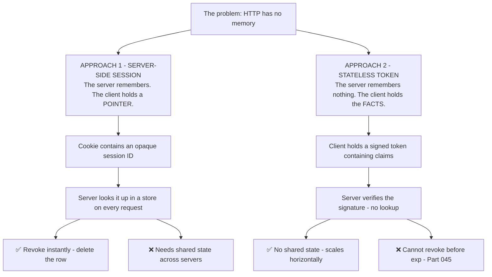
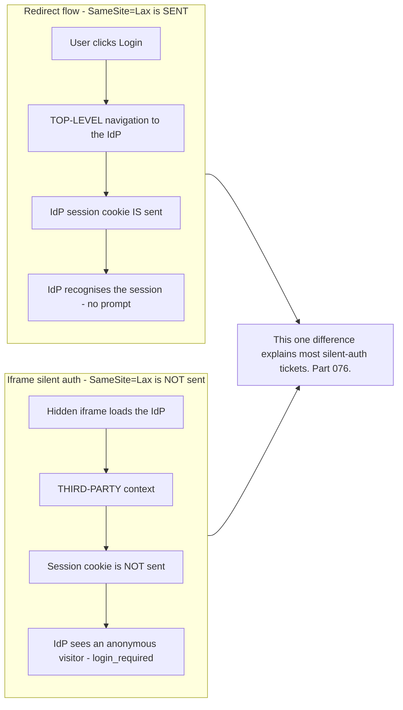
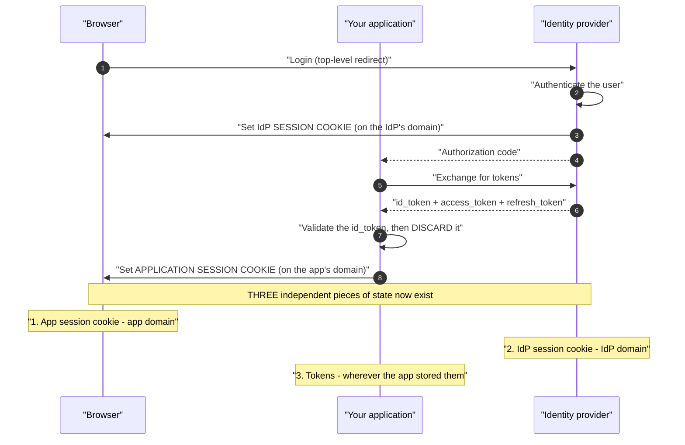
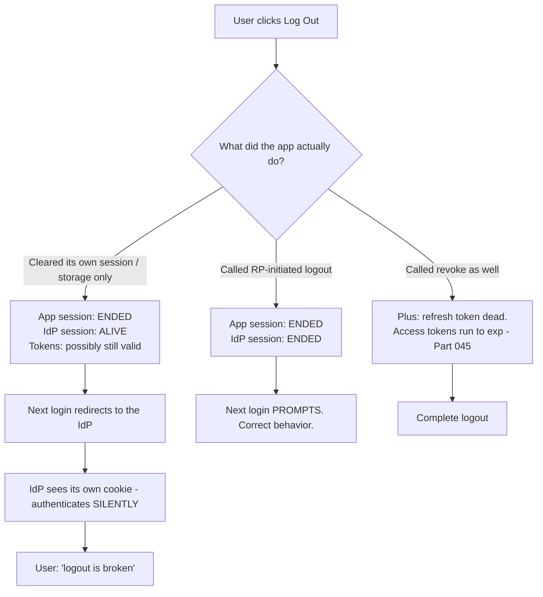
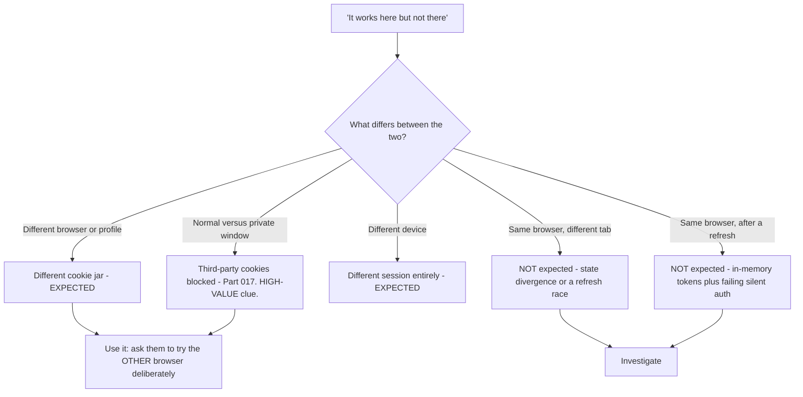
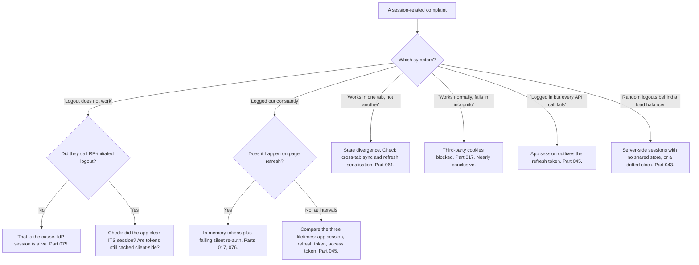

# Part 047 - Sessions, Cookies, and Stateless Tokens Compared

> Section goal: Understand the two fundamentally different ways a system remembers a logged-in user, why modern identity systems run **both at once**, and how the interaction between them produces the confusing symptoms customers actually report — "logout doesn't work", "it logs me out constantly", "it works in one tab but not another".

Covers index item **047**. Maps to JD signals: *knowledge of authentication and authorization*, *knowledge of HTTP*, *experience with troubleshooting web applications*, *strong analytical and problem-solving skills*, and *communicate technical concepts clearly*.

---

## 1. Start From Zero: HTTP Forgets Everything

HTTP is stateless. Every request arrives with no memory of the last one. "Being logged in" is a fiction the application maintains, and there are exactly two ways to maintain it.

| | Server-side session | Stateless token |
|---|---|---|
| Client holds | An opaque **ID** | The **claims** themselves |
| Server holds | The session data | Nothing |
| Per-request cost | A store lookup | Signature verification |
| Revocation | ⚡ Instant | ⏳ Waits for `exp` |
| Horizontal scaling | Needs shared state | Trivial |
| Size on the wire | Tiny | ~33% Base64 overhead |
| Data visible to the client | ❌ None | ✅ **All of it** |
| Cross-domain | Constrained by cookie scope | Works anywhere |

> **Analogy.** A cloakroom ticket versus a laminated badge. The ticket is a meaningless number — the cloakroom knows what it maps to and can refuse it instantly. The badge carries your details and a tamper-proof seal, so anyone can check it without contacting anyone, and nobody can recall it before its printed expiry.
>
> **Where it stops:** a badge can be visually confiscated. A token cannot be taken back at all — every copy remains valid, which is why lifetime is the only control.

---

## 2. Cookies as the Transport

Cookies are how server-side sessions are carried, and their attributes decide almost everything about behavior. Part 014 covered them fully; this is the identity-relevant subset.

| Attribute | Identity consequence |
|---|---|
| **`HttpOnly`** | JavaScript cannot read it → **XSS cannot steal the session** |
| **`Secure`** | HTTPS only → not sent in cleartext |
| **`SameSite=Lax`** | Sent on top-level navigations — **why redirect-based SSO works** |
| **`SameSite=None; Secure`** | Sent cross-site — **required for iframe/silent auth**, and increasingly restricted (Part 017) |
| **`Domain`** | Which hosts receive it — the basis of same-org SSO |
| **`Path`** | Rarely a security boundary; do not rely on it |
| **`Max-Age` / `Expires`** | Session cookie versus persistent |

### The single most important cookie fact in identity

> **`SameSite=Lax` is sent on a top-level redirect. That is precisely why the redirect-based authorization code flow still works, and why iframe-based silent authentication does not.**

---

## 3. Modern Identity Runs Both

This is the point most people miss, and it is the source of the confusing symptoms.

**Three pieces of state, three different domains and lifetimes, three different ways to end.**

| State | Lives on | Ended by |
|---|---|---|
| Application session | Your domain | Your logout |
| **IdP session** | The provider's domain | **RP-initiated logout** (Part 075) |
| Tokens | Wherever the app stored them | Expiry or revocation |

### 🔍 Plain-English deep-dive: why "logout doesn't work" is the most-reported non-bug

The user clicks Log Out. The application clears its session. The user is returned to the login page. They click Log In — **and are immediately back in, with no prompt.**

To the user this is unambiguous: logout was ignored. To the customer reporting it, it is a serious security concern. Both reactions are reasonable.

**What actually happened:** the application ended state 1. States 2 and 3 were untouched. The next login redirected to the identity provider, which found its own session cookie still valid, and completed authentication instantly without asking anything.

**The complete answer requires all three**, and it is worth giving them as a checklist rather than a paragraph:

1. **Clear the application session.**
2. **Call RP-initiated logout** so the provider ends its session too.
3. **Revoke the refresh token**, and accept that already-issued access tokens run to `exp`.

**The nuance that makes this a real design conversation:** ending the IdP session logs the user out of *every* application federated to that provider. Sometimes that is exactly what is wanted — a shared kiosk, a security event. Sometimes it is hostile — logging out of one internal tool should not sign you out of your email. **There is no universally right answer**, which is why the standard separates the two and makes the application choose.

**A further wrinkle worth knowing:** some providers offer a logout that ends the session only for the requesting application versus one that ends the provider session entirely. Knowing which one a customer called explains behavior that otherwise looks random.

**Analogy:** leaving a building through a turnstile but keeping your visitor badge. You are out, and you can walk straight back in. **Where it stops:** a security guard would notice the badge. Nothing in a browser notices a live provider session — it silently makes the next login instant, which is normally a feature.

---

## 4. Where Tokens Get Stored

For browser applications this is a genuine security decision, not a preference.

| Location | XSS-readable | CSRF-vulnerable | Verdict |
|---|---|---|---|
| **`localStorage`** | 🔴 **Yes** | No | Common, and the weakest |
| **`sessionStorage`** | 🔴 Yes | No | Same risk, shorter life |
| **In-memory (a JS variable)** | 🟡 Only while running | No | Good; lost on refresh |
| **Cookie, `HttpOnly` + `Secure` + `SameSite`** | ✅ **No** | Needs CSRF defence | **Strongest**, needs a backend |
| **Backend-for-Frontend (BFF)** | ✅ Tokens never reach the browser | Standard defences | **Best available** |

**The direction of travel is clear:** current OAuth security guidance moves browser applications toward a backend that holds tokens and gives the browser only an `HttpOnly` cookie. The SPA-holds-tokens model that dominated the last decade is increasingly treated as a compromise rather than a target design (Part 066).

### 🔍 Plain-English deep-dive: why `localStorage` keeps winning anyway

Everyone in security says not to. Most SPAs do it. Understanding *why* makes you far more useful than repeating the rule.

| Reason it happens | Reality |
|---|---|
| **The tutorial did it** | Nearly every SPA tutorial uses `localStorage`. It is the path of least resistance |
| **`HttpOnly` cookies need a backend** | A pure static SPA with no server literally cannot use them |
| **It survives refresh** | In-memory storage loses the token on F5, and handling that requires silent re-auth — which third-party cookie restrictions are breaking (Part 017) |
| **The risk feels abstract** | "If you have XSS you have bigger problems" — which is *partly* true and used to dismiss the whole issue |

**The honest counter to that last argument:** XSS with `HttpOnly` cookies lets an attacker *act as* the user while the page is open. XSS with a token in `localStorage` lets them *exfiltrate a credential* and act as the user from their own machine, later, from anywhere — and a refresh token there means persistent access. The difference is between a session-bound attack and a portable, durable one.

**How to advise usefully in support**, in order of practicality:

1. **If they have any backend at all** — a BFF pattern, with `HttpOnly` cookies to the browser.
2. **If they cannot** — in-memory tokens, refresh-token rotation, and short lifetimes so a stolen token is quickly useless.
3. **If they must use `localStorage`** — never a refresh token there, short access-token lifetimes, and a strict CSP (Part 016) as the actual XSS mitigation.

**What makes this good support** is that option 3 exists. Refusing to help someone who cannot implement option 1 just means they implement option 1's absence badly. Meeting them where they are, while being clear about what each step costs, gets a better outcome than being right.

**Analogy:** advising against keeping a spare key under the mat. Correct, and unhelpful to someone with no other option — better to say "not the front mat, and not the key to the safe."

**Where it stops:** a key under a mat requires physical presence. `localStorage` is readable by any script the page loads, including a compromised dependency, which is why supply chain matters here (Part 027).

---

## 5. Multi-Tab and Multi-Device Reality

Two symptoms that look like bugs and are usually state divergence.

| Symptom | Cause |
|---|---|
| "Logged out in one tab, still in another" | Each tab has its own in-memory state; `localStorage` events not handled |
| "Logged in on desktop, not on mobile" | Sessions and tokens are per-browser. Correct |
| "Refreshed and got logged out" | In-memory storage plus a failing silent re-auth (Part 076) |
| "Two tabs both refresh, one breaks" | **Refresh-token rotation race** — one tab uses a token the other already rotated (Part 061) |
| "Works in normal browsing, not incognito" | Third-party cookies blocked; the IdP session is invisible (Part 017) |

**That fourth row is a genuinely subtle one.** With rotation enabled, two tabs refreshing near-simultaneously can produce a reuse-detection trigger, which revokes the entire token family and logs the user out of everything. Well-built SDKs serialise refresh across tabs using a lock; hand-rolled implementations frequently do not.

### 🔍 Plain-English deep-dive: "per-browser" is the answer to half these tickets

A quiet source of confusion is that users think of *being logged in* as a property of themselves. It is actually a property of **a browser profile on a device**.

| The user says | What is actually true |
|---|---|
| "I'm logged in" | *This browser profile* holds a session cookie and tokens |
| "It logged me out on my phone" | The phone is a different browser with different state — correct behavior |
| "My colleague can't see it" | Different person, different session — correct |
| "It works in Chrome but not Edge" | Different cookie jars — correct |
| "It stopped working in a private window" | No shared cookies, and third-party cookies blocked — correct |

**Four of those five are correct behavior**, and recognising that instantly saves a lot of investigation. The support move is not to dismiss them, though — it is to convert the observation into information:

**The most valuable of these is the private-window comparison**, because the customer has already run a controlled experiment without realising it. Two rows in that diagram are genuine bugs; the rest are the model working as designed, and being able to say which is which in one question is what keeps these tickets short.

**The corollary worth stating to customers:** if they want a logout on one device to end sessions everywhere, that is a deliberate feature — back-channel logout or a global session revocation (Part 075) — not something that happens automatically. Users often assume it does.

**Analogy:** a browser profile is a coat with pockets. Your other coat has different pockets. Nothing is lost; you are simply wearing a different coat. **Where it stops:** you know which coat you are wearing. Users genuinely do not distinguish browser profiles, so the explanation has to lead with the observation rather than the mechanism.

---

## 6. Failure Modes

| Failure mode | What it looks like | Consequence | Correction |
|---|---|---|---|
| **Clearing local state as "logout"** | Instant silent re-login | "Logout is broken" | RP-initiated logout too |
| **Ending the IdP session unexpectedly** | Signed out of everything | Angry users | Deliberate choice; explain it |
| **Refresh token in `localStorage`** | XSS-readable | 🔴 Persistent account takeover | In-memory, or a BFF |
| **No `HttpOnly` on a session cookie** | JS-readable | 🔴 XSS steals the session | Always set it |
| **No `Secure`** | Sent over HTTP | 🔴 Interceptable | Always set it |
| **`SameSite=None` without `Secure`** | Rejected by browsers | Cookie silently dropped | Both, together |
| **Expecting iframe auth to send cookies** | Silent auth fails | `login_required` | Third-party context (Part 017) |
| **App session outliving the refresh token** | UI works, API fails | "Logged in but nothing works" (Part 045) | Align lifetimes |
| **Unserialised refresh across tabs** | Random logouts | Reuse detection fires | Cross-tab locking |
| **Server-side session with no shared store** | Works on one node | Random logouts behind a load balancer | Shared session store |
| **Session ID in a URL** | Shareable, logged | 🔴 Session fixation and leakage | Cookies only |
| **No session ID regeneration after login** | Fixed ID across privilege change | 🔴 **Session fixation** | Regenerate on login |

---

## 7. Troubleshooting Decision Tree: Session Symptoms

### Worked example

*"Users are randomly logged out. It's intermittent. We can't reproduce it."*

1. **"Intermittent and unreproducible" needs to be converted into a pattern before anything else.** Ask three questions: does it happen on refresh, at a consistent interval, or with multiple tabs open?
2. **Answer:** multiple tabs, and only sometimes.
3. **Hypothesis immediately narrows** to a refresh race. Two tabs refresh near-simultaneously; rotation is enabled; the second tab presents a refresh token the first has already rotated; reuse detection treats that as theft and revokes the entire family — logging the user out everywhere.
4. **Confirm from the evidence**, not by argument: tenant logs (Part 107) will show a refresh-token reuse event at the exact time of a reported logout. **That timestamp correlation is the proof.**
5. **Explain why it is unreproducible.** It requires two refreshes inside a narrow window, which depends on timing nobody controls. That explanation matters — "we can't reproduce it" has been making them doubt the report.
6. **Fix:** serialise refresh across tabs. Mainstream SDKs do this with a lock; if they have hand-rolled it, that is the change.
7. **Do not suggest disabling rotation.** It is a security control, and the same reasoning as Part 042 applies.
8. **Confirm the fix the same way** — absence of reuse events over a comparable period, rather than absence of reports.

---

## 8. Lab: Three Kinds of State

**Purpose.** Make all three pieces of state visible simultaneously, then break each one and watch what the user sees.

**Prerequisites.** Parts 014, 021, 028, 044, 045 artifacts. A free Auth0 tenant, a SPA, and a small backend.

**Steps.**

1. Create `okta-prep/labs/047-sessions/`.
2. **Build the observatory.** A page showing, live: the application session state, whether an IdP session exists (via a silent-auth probe), and the current tokens with their expiry countdowns. **Seeing all three at once is the whole lab.**
3. **Log in.** Record all three appearing. Capture the cookies in DevTools (Part 021) — note `HttpOnly`, `Secure`, `SameSite`, and `Domain` for each.
4. **Partial logout.** Clear the app session only. **Confirm the observatory still shows a live IdP session.** Then log in again and confirm no prompt. **Screenshot the sequence** — this is the "logout doesn't work" ticket, produced deliberately.
5. **Full logout.** Call RP-initiated logout. Confirm the IdP session disappears and the next login prompts.
6. **Revocation.** Add refresh-token revocation. Confirm all three are now gone, and note that an access token issued a minute ago still works (Part 045).
7. **Storage comparison.** Store a token in `localStorage`, then in memory. For each, run a one-line script in the console simulating XSS: `console.log(localStorage.getItem('token'))`. **Record which one exposes it.**
8. **`HttpOnly` demonstration.** Set a cookie with and without `HttpOnly`. Attempt `document.cookie` on each. **Record the difference.** This two-line demonstration is more persuasive than any explanation.
9. **`SameSite` demonstration.** Set a cookie `SameSite=Lax` and one `SameSite=None; Secure`. Load your app in an iframe from a different origin. **Record which cookies are sent.** This is Part 017's problem, observed directly.
10. **Multi-tab race.** Open two tabs, let both approach token expiry, and force both to refresh simultaneously. **Attempt to trigger reuse detection.** Record what happens and check the tenant log for a reuse event.
11. **Then fix it.** Add a simple cross-tab lock — `localStorage` or `BroadcastChannel` — so only one tab refreshes. Repeat and confirm no reuse event.
12. **Lifetime mismatch.** Deliberately set an app session longer than the refresh-token lifetime. **Reproduce "logged in but nothing works."** Record the user experience precisely, including whether the app gives any signal at all.
13. **Session fixation.** In your backend, log the session ID before and after login. **Confirm it changes.** If it does not, that is the vulnerability — fix it and re-verify.
14. **Write the explainer.** `three-kinds-of-state.md` — a one-page customer-facing note with the three states, the complete-logout checklist, and the storage recommendations in priority order.
15. **Failure catalog + manifest.** Complete `MANIFEST.md`.

**Expected evidence.** A live three-state observatory, a deliberately produced "logout doesn't work" sequence, a complete-logout demonstration, an XSS storage comparison, `HttpOnly` and `SameSite` demonstrations, a triggered-then-fixed multi-tab race with tenant log correlation, a reproduced lifetime mismatch, a session-fixation check, and a one-page explainer.

**Validation rubric.**

| Check | Pass condition |
|---|---|
| Observatory | All three states visible simultaneously |
| Partial vs full logout | Both sequences captured; difference obvious |
| Storage comparison | `localStorage` exposed, in-memory not |
| `HttpOnly` | `document.cookie` blocked, demonstrated |
| `SameSite` | Iframe cookie behavior recorded |
| Multi-tab race | Triggered, correlated to a tenant log event, then fixed |
| Lifetime mismatch | "Logged in but broken" reproduced |
| Session fixation | ID regeneration confirmed |
| Explainer | One page, three states, logout checklist, storage priority |

**Cleanup and privacy.** Lab tenant, synthetic users, localhost only. The XSS simulation is a console command in **your own** page — never run anything resembling it against a site you do not own. Revoke all refresh tokens and clear all storage at the end. Restore tenant settings changed for the lifetime-mismatch step.

---

## 9. JD Mapping

| Supplied JD signal | How this Part supports it |
|---|---|
| **Knowledge of HTTP** | Cookies, attributes, statelessness, and redirect behavior |
| Knowledge of authentication and authorization | Session versus token as two answers to one problem |
| **Experience troubleshooting web applications** | Every symptom in §5 and §7 is a real reported ticket |
| Strong analytical and problem-solving skills | Converting "intermittent" into a testable pattern |
| **Communicate technical concepts clearly** | The three-states model as an explanatory device |
| Promote best practices | Storage guidance in practical priority order |
| Customer-obsessed attitude | Explaining *why* it was unreproducible, not just fixing it |

---

## 10. Candidate Honesty Note

- **Claim safety:** *Learned architecture and lab experience*, with strong genuine transfer — cookie and HTTP debugging with DevTools and HAR is existing production skill.
- **The strongest thing you can say:** *"Modern identity runs three pieces of state at once: the application session on your domain, the identity provider's session on theirs, and the tokens. They have different lifetimes and different ways to end, and almost every confusing session symptom is one of the three being out of step with the others."*
- **A second point, and it is the highest-frequency ticket in this area:** *"'Logout doesn't work' is nearly always the app clearing its own state without calling RP-initiated logout. The IdP session is still live, so the next login completes silently. A complete logout is three things: clear the app session, end the IdP session, revoke the refresh token — and accept that access tokens run to `exp`."*
- **A third, which shows judgement:** *"`localStorage` is the wrong place for tokens and it's also what most SPAs do, because the tutorials use it and a static SPA with no backend literally can't use `HttpOnly` cookies. I'd give advice in practical order — a BFF if they have any backend, in-memory with rotation if not, and if it must be `localStorage`, then never a refresh token there, short lifetimes, and a strict CSP. Refusing to help someone who can't do option one just means they do it badly."*
- **A fourth, on diagnosis:** *"Random logouts with multiple tabs open is usually a refresh race — two tabs rotate the same refresh token, reuse detection fires, and the whole family is revoked. It's unreproducible because it needs two refreshes in a narrow window, and the proof is a reuse event in the tenant log at the exact time of a reported logout."*
- **A fifth, and it is nearly conclusive on its own:** *"Works in normal browsing, fails in incognito, is a third-party cookie problem almost every time."*
- **Do not overstate:** you have not implemented a production session architecture. Say the browser and HTTP debugging is existing skill and the identity-specific state model is learned.

---

## 11. Official Source Anchors

Accessed **26 August 2026**.

| Source | What it defines |
|---|---|
| IETF RFC 6265bis | Cookies, `SameSite`, `HttpOnly`, `Secure`, and third-party behavior |
| OpenID Connect RP-Initiated Logout | Ending the provider session correctly |
| OpenID Connect Session Management, Front-Channel and Back-Channel Logout | The full logout family (Part 075) |
| OAuth 2.0 for Browser-Based Applications (BCP) | Current storage guidance and the BFF pattern |
| OWASP — Session Management cheat sheet | Fixation, regeneration, and cookie attributes |
| MDN — `Set-Cookie` and `SameSite` | Practical browser behavior |
| Auth0 documentation — sessions and logout | Vendor session layers and logout endpoints |
| Okta developer documentation — session management | Okta's session model |

**Revalidate after 26 August 2026:** browser third-party cookie behavior is actively changing — recheck MDN and the browser-based-apps BCP, which is the fastest-moving document here.

---

## ⭐ Likely Interview Questions for This Section

### Q1. "Sessions or tokens — which is better?"
> *Model answer:* "They solve the same problem differently and modern systems use both. A server-side session means the client holds an opaque ID and the server holds the data, so revocation is instant — delete the row — at the cost of shared state across servers. A stateless token means the client holds the claims and the server holds nothing, so it scales trivially, at the cost of no revocation before expiry and the claims being readable by whoever holds it. In practice a typical setup has an application session cookie on your domain, an identity provider session on theirs, and tokens for API calls — all three at once. So the useful question isn't which is better, it's which piece of state a given symptom belongs to, because that's what tells you where to look."

### Q2. "Explain why logout often appears not to work."
> *Model answer:* "Because there are three pieces of state and most applications only end one. The app clears its own session, the user is returned to a login page, they click log in — and they're straight back in with no prompt, because the identity provider's session cookie on *its* domain was never touched. The provider sees a valid session and authenticates silently. To the user that's indistinguishable from logout being ignored, and reporting it as a security concern is entirely reasonable. A complete logout is three steps: clear the app session, call RP-initiated logout so the provider ends its session, and revoke the refresh token — accepting that already-issued access tokens run to `exp`. There's a real design decision inside step two, though: ending the provider session signs the user out of every federated application, which is sometimes exactly right and sometimes hostile."

### Q3. "Where should a SPA store tokens?"
> *Model answer:* "In priority order. Best is not storing them in the browser at all — a backend-for-frontend holds the tokens and gives the browser an `HttpOnly`, `Secure`, `SameSite` cookie. If they have any backend, that's the answer. If they genuinely can't, in-memory with refresh-token rotation and short lifetimes, so a stolen token is quickly useless. And if it has to be `localStorage`, then never a refresh token there, short access-token lifetimes, and a strict CSP as the actual XSS mitigation. The reason I'd give three options rather than one is that most SPAs use `localStorage` — the tutorials do it and a static SPA with no server can't set `HttpOnly` cookies — and refusing to engage with that just means they implement the ideal badly or not at all."

### Q4. "Why is XSS worse with tokens in `localStorage` than with `HttpOnly` cookies?"
> *Model answer:* "Because of what the attacker walks away with. With `HttpOnly` cookies, XSS lets them act as the user while the page is open — bad, but session-bound and it ends when the page closes. With a token in `localStorage`, they exfiltrate a credential: they read it, send it to their own server, and use it from anywhere, later, without the user's browser involved at all. If it's a refresh token, that's persistent access measured in weeks. The difference is between an attack bounded by a session and one that's portable and durable. That's why 'if you have XSS you have bigger problems' is only half true — you do, but the storage choice determines whether the incident ends when the tab closes."

### Q5. "Users report random logouts that you can't reproduce. How do you approach it?"
> *Model answer:* "Convert 'random' into a pattern first, with three questions: does it happen on page refresh, at a consistent interval, or with multiple tabs open. Refresh points at in-memory tokens with failing silent re-authentication. A consistent interval points at a lifetime mismatch — compare the app session, refresh token and access token lifetimes. Multiple tabs points at a refresh race: two tabs rotate the same refresh token, reuse detection reads the second use as theft and revokes the whole family. That last one is genuinely unreproducible on demand because it needs two refreshes inside a narrow window, and the proof isn't reproduction — it's a reuse event in the tenant log at the exact timestamp of a reported logout. I'd also explain *why* it was unreproducible, because 'we can't reproduce it' has usually been making them doubt their own users."

### Q6. "Why does `SameSite` matter so much in identity?"
> *Model answer:* "Because it decides whether the identity provider's session cookie is sent, and that decides whether the user gets prompted. `SameSite=Lax` is sent on top-level navigations, which is exactly what a redirect-based authorization code flow is — so the provider sees its cookie, recognises the session, and doesn't prompt. But it's *not* sent in a third-party context, which is what a hidden iframe is — so iframe-based silent authentication gets an anonymous visitor and returns `login_required`. That single difference explains most silent-auth tickets. `SameSite=None` restores it but requires `Secure` and is increasingly restricted as browsers phase out third-party cookies, which is why the whole industry moved toward refresh-token rotation instead of iframe silent auth."

### Q7. "What's session fixation and how do you prevent it?"
> *Model answer:* "An attacker gets a victim to use a session identifier the attacker already knows — by planting it via a URL parameter, a subdomain-scoped cookie, or a crafted link. The victim then logs in, that same identifier becomes authenticated, and the attacker's copy is now a logged-in session. The fix is one line: regenerate the session identifier at the moment of privilege change, which means immediately after successful login. The old ID becomes worthless. Related habits matter too — never put a session ID in a URL, because URLs end up in logs, history and `Referer` headers, and set `HttpOnly` so script can't plant or read it. It's easy to test for: log the session ID before and after login and confirm it changed."

### Q8. "It works in normal browsing but fails in incognito. What does that tell you?"
> *Model answer:* "Almost certainly third-party cookies, and it's close to conclusive on its own. Incognito blocks them by default, so any flow depending on a cross-site cookie — iframe-based silent authentication, some embedded login patterns, certain session-checking mechanisms — stops working, while the redirect-based flow keeps working because that's a top-level navigation. It's a valuable report because it's a free experiment the customer has already run, and it isolates the layer instantly. I'd confirm by checking whether the failure is specifically silent authentication, and I'd frame the fix forward rather than as a workaround: browsers are removing third-party cookies generally, so the answer is refresh-token rotation or a BFF, not re-enabling something that's going away."

---

## 🧠 30-Second Memory Hooks

- **HTTP forgets.** Two fixes: **server remembers** (session ID) or **client carries the facts** (token).
- **Modern identity runs THREE states:** app session · **IdP session** · tokens.
- **Complete logout = clear app session + RP-initiated logout + revoke.** Access tokens still run to `exp`.
- **"Logout doesn't work"** = only state 1 was ended.
- **`SameSite=Lax` IS sent on top-level redirects** → redirect SSO works.
- **`SameSite=Lax` is NOT sent in an iframe** → silent auth fails. Part 076.
- **`HttpOnly` = XSS cannot read it.** `Secure` = HTTPS only. Set both, always.
- **`localStorage` XSS = credential exfiltration**, not just session hijack.
- **Storage priority:** BFF → in-memory + rotation → `localStorage` with never a refresh token.
- **Random logouts + multiple tabs = refresh race.** Proof = a reuse event in the tenant log.
- **Works normally, fails in incognito = third-party cookies.** Nearly conclusive.
- **Regenerate the session ID on login** or you have session fixation.

---

## ✅ Completion Checklist

- [ ] **Knowledge:** I can name the three states, the complete-logout checklist, and the `SameSite` redirect-versus-iframe difference.
- [ ] **Lab artifact:** `047-sessions/` contains a three-state observatory, a produced "logout doesn't work" sequence, `HttpOnly` and `SameSite` demonstrations, a triggered-then-fixed multi-tab race, and a one-page explainer.
- [ ] **Spoken:** I can explain the three states in 60 seconds and the logout non-bug in 45.
- [ ] **Judgement:** I give storage advice in practical priority order rather than a single ideal.
- [ ] **Honesty check:** I claim browser and HTTP debugging as existing skill, and the identity state model as learned.
- [ ] **Source check:** I have read RFC 6265bis on `SameSite` and the OAuth browser-based-apps BCP myself.

---

*Next suggested section:* **[Part 048 - Federation, SSO, IdP, SP, and Establishing Trust](Part-048-federation-sso-idp-sp-and-establishing-trust.md)** — how organisations that do not share a user database let each other's users in, and what "establishing trust" involves in practice.
