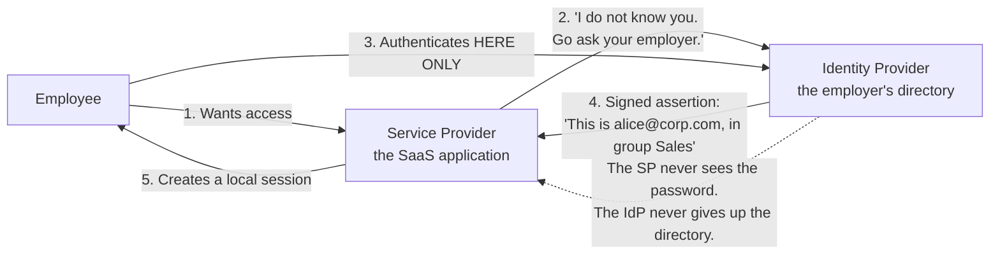
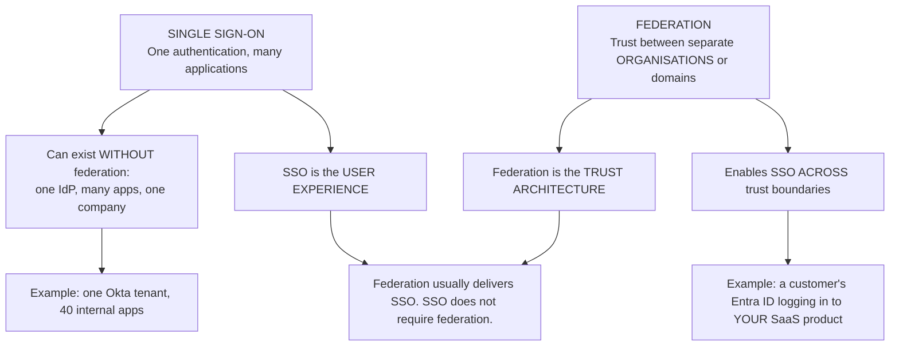
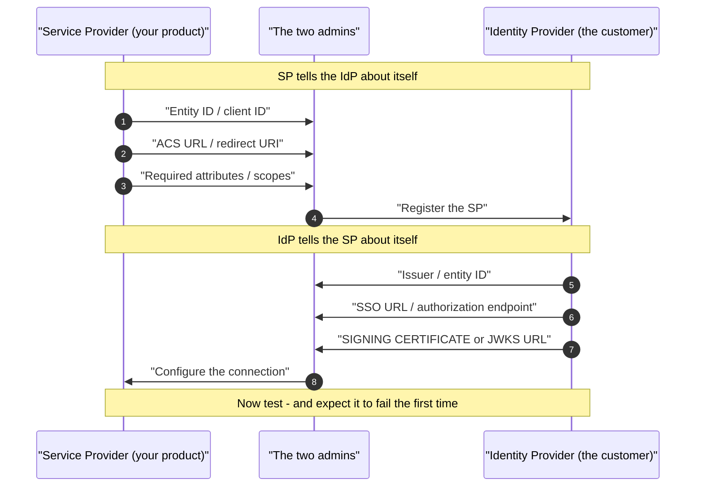
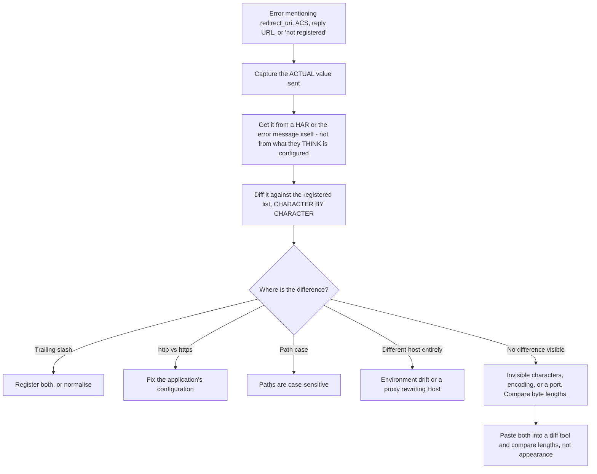
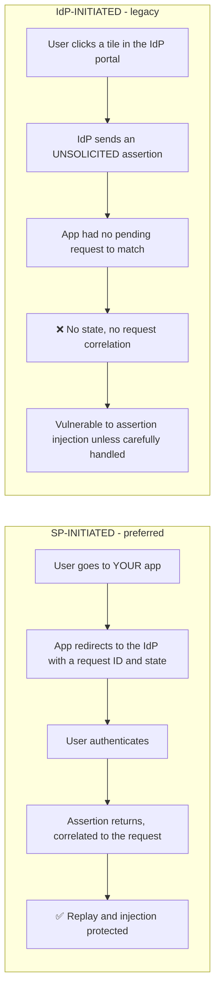
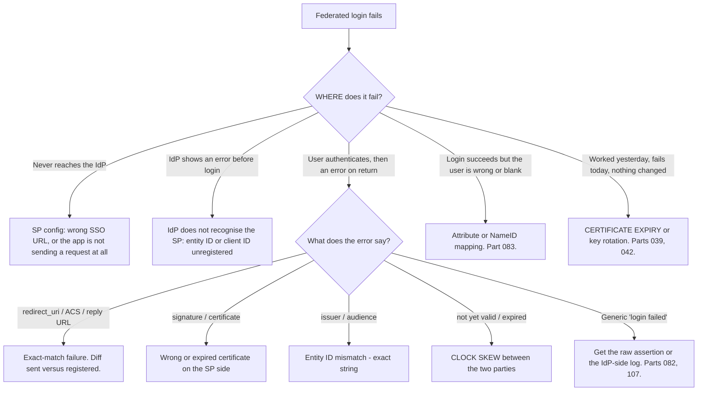

# Part 048 - Federation, SSO, IdP, SP, and Establishing Trust

> Section goal: Understand how two organisations that share no user database let each other's users in — the vocabulary, the trust setup, the difference between SSO and federation, and the configuration steps that go wrong. This is the conceptual model behind every enterprise connection you will support.

Covers index item **048**. Maps to JD signals: *knowledge of authentication and authorization*, *knowledge of SAML/OAuth/OIDC*, *strong analytical and problem-solving skills*, *experience with troubleshooting web applications*, and *communicate technical concepts clearly*.

---

## 1. Start From Zero: The Problem Federation Solves

An organisation buys a SaaS product. Their 5,000 employees need access. Three bad options and one good one:

| Option | Why it fails |
|---|---|
| Create 5,000 accounts in the SaaS product | Duplicate passwords; nothing is disabled when someone leaves |
| Give the SaaS product access to the corporate directory | 🔴 Hands over credentials and the whole directory |
| Ask users to remember another password | Password reuse, reset load, poor security |
| **Federation** | ✅ The SaaS product trusts the employer's identity provider to vouch for each user |

**The single most important property:** the user's password **never leaves the identity provider**. The service provider receives only a signed statement about who the user is.

> **Analogy.** A driving licence at a car rental desk. The rental company does not verify your identity from scratch, does not hold your birth certificate, and does not issue licences. It trusts a government that already did all of that, and checks the licence's security features.
>
> **Where it stops:** a licence is a physical object you carry between unrelated organisations. A federated assertion is generated fresh for one specific service provider, expires in minutes, and is useless anywhere else — which is stronger, and is why replay protection matters (Part 065).

---

## 2. The Vocabulary

The same roles have different names in different protocols, and the inconsistency causes real confusion in tickets.

| Role | SAML | OIDC | OAuth | Plain English |
|---|---|---|---|---|
| Asserts identity | **IdP** (Identity Provider) | **OP** (OpenID Provider) | Authorization Server | *Who vouches* |
| Consumes the assertion | **SP** (Service Provider) | **RP** (Relying Party) | Client | *Who is told* |
| The person | Subject / Principal | End-User / `sub` | Resource Owner | *Who is described* |
| The receiving endpoint | **ACS** (Assertion Consumer Service) | Redirect URI | Redirect URI | *Where it is delivered* |
| The message | **Assertion** | **ID token** | (no identity concept) | *The signed statement* |

**Three of these are worth memorising as pairs:** IdP↔OP, SP↔RP, ACS↔redirect URI. When a customer mixes vocabulary from two protocols in one sentence, translating to a single set is often the fastest way to see what they actually configured.

---

## 3. SSO Versus Federation

These are used interchangeably and are not the same thing.

| | SSO | Federation |
|---|---|---|
| Is | A user experience | A trust architecture |
| Scope | Within one trust domain | **Across** trust domains |
| Requires | One identity provider | An agreement between two parties |
| Example | 40 internal apps behind one login | Your product accepting a customer's Entra ID |

**Why the distinction matters in support:** *"We want SSO"* from a B2B customer almost always means federation — they want their employees' existing corporate identity to work in your product. Establishing that early changes the whole conversation, because federation requires configuration on **both sides** and SSO within your own tenant does not.

---

## 4. Establishing Trust: What Actually Gets Configured

Trust is not a switch. It is an exchange of specific values, and each one is a place a ticket originates.

| Value | Direction | Ticket it causes when wrong |
|---|---|---|
| **Entity ID / Issuer** | Both | "Issuer mismatch" — exact-string problems (Part 043) |
| **ACS URL / Redirect URI** | SP → IdP | 🔴 The **single most common** federation failure |
| **Signing certificate / JWKS** | IdP → SP | Signature validation fails; **expiry is a time bomb** (Part 039) |
| **Attribute names** | IdP → SP | User created with a blank name or wrong email (Part 083) |
| **NameID format** | Both | Duplicate users, or login mapping to the wrong account |
| **Sign / encrypt requirements** | Both | "Assertion not signed" or "cannot decrypt" |

### 🔍 Plain-English deep-dive: why the ACS URL breaks federation more than anything else

The Assertion Consumer Service URL — or, in OIDC, the redirect URI — is where the identity provider delivers the assertion. It is matched **exactly** and it fails for reasons that all look identical from the outside.

| Cause | Example |
|---|---|
| Trailing slash | `/acs` versus `/acs/` |
| Scheme | `http://` in a config, `https://` in reality |
| Case | Host is case-insensitive; **path is not** |
| Environment drift | Staging URL registered, production URL used |
| Load balancer rewriting | The app builds the URL from `Host`, a proxy changed it |
| Custom domain | Tenant moved to a custom domain; registration did not (Part 097) |
| Port | `:443` explicit in one place, implicit in the other |

**Why exact matching is non-negotiable:** if a service provider accepted approximate matches, an attacker who could register a similar URL — a subdomain, an open redirect, a path they control — would receive assertions meant for the real application. That is a full account takeover, and it is why every specification requires exact comparison (Part 065).

**The support technique that resolves this fastest:** never ask what they configured — ask them to send the **actual error**, which almost always contains the URL that was sent. Then diff it against the registered list. **Comparing what was sent to what is registered is a thirty-second answer; discussing what they intended to configure can take days.**

**The last box matters more than it looks.** Two URLs that look identical but differ in length contain something invisible — a zero-width character pasted from a document, a percent-encoded segment, or trailing whitespace. Comparing lengths finds it instantly when the eye cannot.

**Analogy:** a delivery address that must match the one on file exactly, because packages contain something valuable and the courier will not improvise. "Flat 2, 10 High St" and "10 High Street, Flat 2" describe the same place and neither the courier nor the security model can take that risk. **Where it stops:** a courier can telephone. A federation flow fails silently at the browser with a generic error, which is why the error text is the most valuable artifact.

---

## 5. IdP-Initiated Versus SP-Initiated

Two starting points, and only one of them is safe by default.

| | SP-initiated | IdP-initiated |
|---|---|---|
| Starts at | The application | The provider's portal |
| Request correlation | ✅ `RelayState` / `state` / request ID | ❌ None |
| Deep linking | ✅ Preserved | ❌ Usually lost |
| Security | ✅ Preferred | ⚠️ Requires care |
| OIDC support | Native | **Not supported** — OIDC has no equivalent |

**That last row is a genuinely useful fact.** Customers migrating from SAML to OIDC frequently ask how to keep their portal tiles working. OIDC has no IdP-initiated concept; the standard answer is a tile that links to the application's own login endpoint, which then starts a normal SP-initiated flow. It looks the same to the user and is architecturally correct.

### 🔍 Plain-English deep-dive: what `state` and `RelayState` actually protect against

SP-initiated flows carry a value the application generates before the redirect and checks on the way back — `state` in OAuth/OIDC, `RelayState` in SAML. It looks like bookkeeping. It is a security control, and it does two jobs.

**Job 1 — CSRF protection.** Without it, an attacker can complete an authorization flow with *their own* account and then trick a victim's browser into delivering that result to the victim's session. The victim ends up silently logged in as the attacker — and then saves a document, enters a payment method, or uploads a file into an account the attacker controls. This is **login CSRF**, and it is counter-intuitive because the harm flows from the victim being logged into the *wrong* account rather than the attacker being logged into theirs.

**Job 2 — returning the user where they started.** The application stores the originally requested URL against the `state` value and restores it after login. This is why `state` should be an opaque random key into server-side storage rather than the URL itself: putting a URL directly in `state` creates an open-redirect vector.

| | With `state` | Without |
|---|---|---|
| Response correlates to a request this app made | ✅ | ❌ |
| Login CSRF | Blocked | 🔴 Possible |
| Deep link preserved | ✅ | ❌ Lands on the homepage |
| Unsolicited assertions | Rejected | Accepted |

**Why IdP-initiated cannot have this.** The flow begins at the provider, so the application never generated a value and has nothing to compare against. Every IdP-initiated assertion is, by construction, unsolicited. The mitigations that exist — short assertion lifetimes, one-time-use tracking of assertion IDs, strict audience checking — are all compensating controls for a missing correlation, which is why the specifications prefer SP-initiated.

**In support this shows up two ways.** Someone reports that users always land on the homepage after login rather than the page they clicked — that is `state` not being used to carry the return URL. And someone reports an intermittent "invalid state" error — which is usually a load-balanced application storing `state` in memory on one node and validating it on another, exactly the shared-state problem from Part 047.

**Analogy:** a cloakroom ticket you tear in half, keeping one side. Anyone can present a coat; only the matching half proves it is the coat you handed in. **Where it stops:** a torn ticket is checked by a person who can improvise. `state` is compared exactly, which is why a node that never stored it fails closed rather than asking.

---

## 6. Just-in-Time Provisioning

Federation tells you who a user is. It does not create an account.

| Approach | How | Trade |
|---|---|---|
| **JIT provisioning** | Create the local user on first successful login, from assertion attributes | ✅ Zero admin effort. ❌ No deprovisioning; attribute drift |
| **SCIM provisioning** | The IdP pushes create/update/delete to the SP (Part 094) | ✅ Full lifecycle. ❌ More setup |
| **Manual** | Admin creates accounts in advance | ✅ Full control. ❌ Does not scale |
| **JIT + SCIM** | JIT for creation, SCIM for lifecycle | The common enterprise answer |

**The gap that produces security findings:** JIT alone creates users and never removes them. An employee leaves, the identity provider disables them — and they can no longer log in, which is the important part — but the account and its data persist in the service provider indefinitely, invisible to any offboarding audit. **Raising that is often more valuable than the ticket it came from.**

### 🔍 Plain-English deep-dive: choosing the identifier is the decision you cannot undo

When a federated user arrives, the service provider must decide *which local account this is*. That choice — the matching key — is the most consequential and least considered part of a federation setup, because changing it later means reconciling every existing account.

| Matching key | Problem |
|---|---|
| **Email address** | People change surnames, roles, and domains. A changed email creates a **new account**, orphaning all their data |
| **Username** | Same problem, plus it is often not unique across sources |
| **NameID, transient format** | Deliberately different on every login — creates a new account **every time** |
| **NameID, persistent format** | ✅ Stable and unique per SP. The correct choice |
| **`sub` (OIDC)** | ✅ Stable and opaque — but differs per connection (Part 105) |
| **An immutable directory ID** | ✅ Best when the IdP will send one (Entra's object ID, for example) |

**The failure this produces is distinctive and arrives late.** Everything works perfectly for months. Then one user changes their name after getting married, their email changes at the identity provider, and on their next login they arrive as a brand-new user — empty workspace, no history, no permissions. They report it as data loss. Nothing was lost; a second account was created beside the first.

**And the transient-NameID case is worse and faster:** if a connection is configured with a transient NameID format, *every login* creates a new account. A tenant fills with duplicate users within days, and the symptom — "users lose their settings every time they log in" — sounds like a session bug rather than an identity-matching one.

**The support questions that find it:**

1. *"What does the service provider match on — email, NameID, or something else?"*
2. *"Did anything about this user change at the identity provider recently?"*
3. *"Is there more than one account for this person?"* — which is usually diagnostic on its own.

**The fix once it has happened** is account linking or a merge (Part 105), and it is manual and unpleasant, which is exactly why the identifier decision deserves attention at configuration time rather than after.

**Analogy:** filing patient records by name rather than by patient number. It works until someone marries, and then the same person has two histories and neither is complete. **Where it stops:** a clinician would notice the duplicate. A service provider cheerfully creates the second account and reports success.

---

## 7. Failure Modes

| Failure mode | What it looks like | Consequence | Correction |
|---|---|---|---|
| **ACS/redirect URI mismatch** | "Not registered" / generic error | 🔴 The #1 federation failure | Diff the sent value against the registered list |
| **Certificate expiry** | Worked for a year, then total failure | **Outage** | Monitor expiry; automate rollover (Part 039) |
| **Manually pasted certificate** | Breaks at IdP rollover | Outage | Use metadata URLs, not pasted values |
| **Issuer/entity ID mismatch** | "Unknown issuer" | Nothing works | Exact string; copy from metadata |
| **Attribute name mismatch** | Users created with blank names | Bad data, support load | Agree names explicitly (Part 083) |
| **NameID format mismatch** | Duplicate users on each login | Data mess | Agree a stable, unique NameID |
| **Email as the identifier** | User changes email → new account | Orphaned data | Use an immutable ID |
| **IdP-initiated only** | No deep linking; injection risk | Poor UX, weaker security | Prefer SP-initiated |
| **JIT with no deprovisioning** | Accounts persist after offboarding | 🔴 Audit and data risk | Add SCIM (Part 094) |
| **Clock skew between parties** | Assertion "not yet valid" | Intermittent failures | NTP both sides (Part 043) |
| **Assertion lifetime too short** | Fails on slow networks | Flaky logins | Reasonable validity window |
| **Testing in production first** | Broken login for everyone | Outage | Test with a pilot group |

---

## 8. Troubleshooting Decision Tree: Federation Failure

### Worked example

*"Our customer's employees can't log in via their Entra ID. It worked in testing last month."*

1. **"Worked last month, fails now, nothing changed" is a strong signal.** Something time-based expired or rotated. Certificates are the leading candidate.
2. **Locate the failure point.** Ask where it breaks: before the Microsoft login page, after entering credentials, or on return to the application. Answer: on return.
3. **Get the actual error**, not a description. It mentions signature validation.
4. **Check the certificate.** The connection has a manually pasted signing certificate. Its expiry has passed — or Entra rolled its signing key and the pasted copy is now stale.
5. **Immediate fix:** update the certificate.
6. **The real fix, and this is the valuable part:** replace the pasted certificate with the identity provider's **metadata URL**, so key rollover is picked up automatically. A pasted certificate is an outage with a known date and no alarm attached.
7. **Prevention:** ask whether any other connections use pasted certificates. There are usually several, all with different expiry dates, and none monitored. **Offering to help audit that is the difference between fixing a ticket and fixing the problem.**
8. **Write it up** (Part 115) with the expiry date, the fix, and the metadata-URL recommendation so the next occurrence is prevented rather than repeated.

---

## 9. Lab: Federate Two Systems

**Purpose.** Configure a real federation end to end, break each configuration value deliberately, and record the distinct error each one produces.

**Prerequisites.** Parts 040–047 artifacts. A free Auth0 tenant, plus a second identity source — a free Entra ID tenant, a second Auth0 tenant, or a local SAML IdP.

**Steps.**

1. Create `okta-prep/labs/048-federation/`.
2. **Draw it first.** Before configuring anything, diagram the two parties, which values flow in each direction, and which side owns each. **Doing this from memory is the exercise.**
3. **Configure an enterprise connection** from your primary tenant to the second identity source (Part 101).
4. **Record every value exchanged** in a table: name, direction, where it came from, where it was pasted.
5. **Successful login.** Complete an SP-initiated federated login with a synthetic user. **Capture the full HAR** (Part 021).
6. **Trace the flow in the HAR.** Identify each redirect, the authentication request, and the assertion or token returned. Annotate it.
7. **Break the ACS/redirect URI.** Add a trailing slash on one side. **Record the exact error.** Note whether it names the mismatch or is generic.
8. **Break the issuer/entity ID.** Change one character. Record the error.
9. **Break the certificate.** Replace the signing certificate with a different valid one. Record the error. **Note how different it is from the previous two** — these three errors are the majority of federation tickets.
10. **Break an attribute mapping.** Change an expected attribute name. Log in and observe: does it fail, or does it silently create a user with missing data? **The silent case is the dangerous one.**
11. **Break the clock.** Shift your local time by five minutes and retry. Record the error.
12. **IdP-initiated contrast.** If your setup supports it, trigger an IdP-initiated login. Compare the flow to SP-initiated in the HAR. **Note the absent state parameter.**
13. **JIT provisioning.** Log in with a new synthetic user. Confirm the account is created automatically. Then **disable the user at the identity provider** and confirm: they cannot log in, but the account still exists at the service provider. **This is the deprovisioning gap, demonstrated.**
14. **Metadata versus pasted.** If supported, configure the connection using a metadata URL instead. **Write one paragraph on why this prevents the certificate time bomb.**
15. **Build the error lookup.** `federation-errors.md` mapping every recorded error to its cause and fix.
16. **Failure catalog + manifest.** Complete `MANIFEST.md`.

**Expected evidence.** A hand-drawn trust diagram, a configuration value table, a successful federated login with an annotated HAR, five deliberately broken configurations with distinct errors recorded, a demonstrated silent attribute failure, an IdP-initiated contrast, a demonstrated JIT deprovisioning gap, a metadata-URL comparison, and an error lookup table.

**Validation rubric.**

| Check | Pass condition |
|---|---|
| Trust diagram | Drawn from memory before configuring |
| Value table | Every exchanged value, with direction and owner |
| Successful login | HAR captured and annotated |
| Five breakages | Distinct errors recorded verbatim |
| Silent attribute failure | Observed and flagged as dangerous |
| IdP-initiated contrast | Missing state noted |
| JIT gap | Disabled user, account persists — demonstrated |
| Metadata comparison | Written rationale |
| Error lookup | Every error mapped to cause and fix |

**Cleanup and privacy.** Free tiers and synthetic users only. **Never configure a federation against your employer's tenant or any customer's directory.** Delete both connections at the end, revoke tokens, and restore your system clock. Redact tenant identifiers from any saved HAR.

---

## 10. JD Mapping

| Supplied JD signal | How this Part supports it |
|---|---|
| **Knowledge of SAML/OAuth/OIDC** | The shared trust model beneath all three |
| Knowledge of authentication and authorization | Federation as delegated authentication |
| Strong analytical and problem-solving skills | §8's "where does it fail" split |
| **Experience troubleshooting web applications** | HAR-based flow tracing across two parties |
| **Communicate technical concepts clearly** | Translating mixed protocol vocabulary |
| Promote best practices | Metadata URLs over pasted certificates; SP-initiated over IdP-initiated |
| Exceed expectations on response quality | Offering the pasted-certificate audit unprompted |
| Collaborate across teams | Federation always involves two administrators |

---

## 11. Candidate Honesty Note

- **Claim safety:** *Learned architecture and lab experience*, with genuine adjacent background — Active Directory and Entra ID work touched the identity-provider side.
- **The strongest thing you can say:** *"Federation means the service provider trusts the identity provider to vouch for a user, and the user's password never leaves the identity provider. Establishing that trust is an exchange of specific values in both directions — entity IDs, ACS URLs, signing certificates, attribute names — and almost every federation ticket is one of those values not matching exactly."*
- **A second point, and it is the fastest technique in this Part:** *"For a redirect URI or ACS mismatch I never ask what they configured — I ask for the actual error, which usually contains the value that was sent, and diff it against the registered list character by character. If they look identical, I compare lengths, because invisible characters and encoding differences are common. That's a thirty-second answer; discussing what they meant to configure can take days."*
- **A third, which is a real prevention win:** *"A manually pasted signing certificate is an outage with a known date and no alarm attached. The fix is a metadata URL so rollover is picked up automatically — and when I find one pasted certificate, I'd ask whether there are others, because there usually are and none of them are monitored."*
- **A fourth, on a gap nobody reports:** *"JIT provisioning creates accounts and never removes them. When someone leaves, the identity provider disables them so they can't log in — which is the important part — but the account and its data persist at the service provider, invisible to an offboarding audit. That's worth raising even when it isn't the ticket."*
- **A fifth, and it comes up constantly in migrations:** *"OIDC has no IdP-initiated concept. Customers moving from SAML ask how to keep their portal tiles working, and the answer is a tile linking to the application's own login endpoint, which starts a normal SP-initiated flow. Same experience, architecturally correct."*
- **Do not overstate:** you have not configured production federations for customers. Say you understand the trust model and the failure catalog, and have built federations in a lab.

---

## 12. Official Source Anchors

Accessed **26 August 2026**.

| Source | What it defines |
|---|---|
| OASIS SAML 2.0 Core and Profiles | Assertions, SP-initiated and IdP-initiated SSO, entity IDs |
| OASIS SAML 2.0 Metadata | Metadata documents and automated certificate rollover |
| OpenID Connect Core | The OIDC federation model and RP registration |
| IETF RFC 6749 §3.1.2 | Redirect URI registration and exact matching |
| IETF RFC 9700 / OAuth Security BCP | Redirect URI matching and injection defences |
| IETF RFC 7644 (SCIM) | Provisioning and deprovisioning (Part 094) |
| Auth0 documentation — enterprise connections | Configuring federation in practice (Part 101) |
| Okta developer documentation — identity providers | Okta's federation model |
| Microsoft Entra ID documentation — SAML and OIDC apps | The enterprise IdP side you will meet most often |

**Revalidate after 26 August 2026:** SAML is stable. Recheck vendor connection configuration UIs and Entra ID guidance, which change more often than the standards.

---

## ⭐ Likely Interview Questions for This Section

### Q1. "Explain federation to a non-technical person."
> *Model answer:* "It's a driving licence at a car rental desk. The rental company doesn't verify your identity from scratch and doesn't issue licences — it trusts a government that already did that, and it checks the licence's security features. Federation is the same: our product doesn't hold your company's passwords, it asks your company's identity system to vouch for you, and it checks the signature on the answer. The key property is that your password never leaves your employer — we receive a signed statement saying 'this is Alice, she's in Sales', and nothing else. That's better for the customer, because they keep control and offboarding works, and better for us, because we're not storing credentials we don't need."

### Q2. "What's the difference between SSO and federation?"
> *Model answer:* "SSO is a user experience — authenticate once, reach many applications. Federation is a trust architecture — an agreement between separate organisations or domains. You can have SSO without federation: one company, one identity provider, forty internal apps. And federation is what lets SSO cross a boundary, like a customer's Entra ID logging into our product. The reason it matters in support is that a B2B customer saying 'we want SSO' almost always means federation — they want their employees' existing corporate identity to work in our product. Establishing that early changes the conversation, because federation needs configuration on both sides and involves a second administrator, and SSO within our own tenant doesn't."

### Q3. "What's the most common federation failure?"
> *Model answer:* "The ACS URL or redirect URI not matching exactly. It's matched character for character, and it fails for reasons that all look identical from outside — a trailing slash, `http` versus `https`, path case, a staging URL registered while production is in use, a load balancer rewriting the `Host` header, or a tenant that moved to a custom domain while the registration didn't. Exact matching isn't pedantry: if approximate matches were accepted, an attacker who could register a similar URL would receive assertions meant for the real application, which is full account takeover. My technique is to ask for the actual error rather than what they configured, because the error usually contains the value that was sent — then diff it against the registered list. If they look identical, I compare lengths, because zero-width characters and encoding differences hide in plain sight."

### Q4. "SSO worked for a year and stopped overnight with no changes. What do you check?"
> *Model answer:* "A certificate expiry or a key rotation, almost certainly — 'worked for a long time, failed suddenly, nothing changed' is the signature of something time-based. I'd locate the failure point first: before the identity provider's login page, after entering credentials, or on return to the application. If it's on return with a signature error, that's the signing certificate. The immediate fix is updating it, but the valuable fix is replacing the pasted certificate with the provider's metadata URL, so rollover is picked up automatically — a manually pasted certificate is an outage with a known date and no alarm attached. And I'd ask whether other connections were configured the same way, because there are usually several, with different expiry dates, none monitored."

### Q5. "SP-initiated or IdP-initiated — which and why?"
> *Model answer:* "SP-initiated, essentially always. The user starts at the application, which sends an authentication request carrying a request ID and state, so when the assertion comes back it's correlated to a request the application actually made. That gives replay and injection protection, and it preserves deep links — a user clicking a link to a specific page lands there after login rather than on the homepage. IdP-initiated means the provider sends an unsolicited assertion with nothing to correlate against, so it needs careful handling to avoid assertion injection, and the deep link is usually lost. It's worth knowing that OIDC has no IdP-initiated concept at all, so customers migrating from SAML ask how to keep their portal tiles working — and the answer is a tile that links to the application's own login endpoint, which starts a normal SP-initiated flow. Same experience for the user, architecturally correct."

### Q6. "What's JIT provisioning and what's wrong with it?"
> *Model answer:* "Just-in-time provisioning creates the local account on first successful federated login, using attributes from the assertion. It's excellent for onboarding — zero admin effort, users appear as they arrive. The gap is the other end: JIT creates and never removes. When an employee leaves, the identity provider disables them so they can't log in, which is genuinely the important part, but the account and its data persist at the service provider indefinitely and are invisible to an offboarding audit. The complete answer is JIT for creation plus SCIM for lifecycle, so deactivation propagates. I'd raise this even when it isn't the ticket, because customers usually assume disabling at the IdP removed the account everywhere, and that assumption is worth correcting before an auditor does it for them."

### Q7. "A user logs in successfully but appears with a blank name. Where do you look?"
> *Model answer:* "Attribute mapping. The assertion arrived and validated — that's why login succeeded — but the attribute the service provider expected isn't the one the identity provider sent. Attribute names are notoriously inconsistent: `email` versus `emailaddress` versus the full schema URI, `givenName` versus `firstName`. I'd get the raw assertion, decode it locally, and list the attribute names actually present, then compare against what the connection is configured to read. What makes this one important is that it fails *silently* — the user is created with missing data rather than being rejected, so it's discovered weeks later as bad data rather than as a login failure. And it's worth checking whether the NameID is stable too, because a NameID that changes creates a new account on every login."

### Q8. "How would you explain to a customer that federation needs work on their side too?"
> *Model answer:* "By framing it as an exchange rather than a request, because 'we need things from you' can sound like we're offloading work. I'd say federation is a trust relationship between two systems, so each side has to know specific things about the other: we tell them our entity ID, our ACS URL, and the attributes we need; they tell us their issuer, their SSO endpoint, and their signing certificate or metadata URL. Then I'd make it concrete and easy — send the exact values they need from us, a short list of what we need from them with an example of each, and offer to walk through their configuration screen with them. Most federation delays aren't technical, they're two administrators waiting on each other, so being specific about who does what and offering a shared call usually compresses days into an hour."

---

## 🧠 30-Second Memory Hooks

- **Federation = the SP trusts the IdP to vouch. The password NEVER leaves the IdP.**
- **SSO = user experience. Federation = trust architecture.** B2B "SSO" usually means federation.
- **Vocabulary pairs:** IdP↔OP · SP↔RP · ACS↔redirect URI · assertion↔ID token.
- **Trust = exchanged values:** entity ID · ACS URL · **signing certificate** · attribute names · NameID format.
- **#1 failure: ACS/redirect URI exact-match.** Ask for the **error**, not the config. Diff it. Compare **lengths**.
- **"Worked a year, died overnight" = certificate expiry or key rotation.**
- **Metadata URL > pasted certificate.** A pasted certificate is a scheduled outage with no alarm.
- **SP-initiated > IdP-initiated.** State, correlation, deep links.
- **OIDC has NO IdP-initiated.** Portal tile → the app's own login endpoint.
- **JIT creates and never removes.** Add SCIM for deprovisioning.
- **Blank name after successful login = attribute mapping**, and it fails **silently**.

---

## ✅ Completion Checklist

- [ ] **Knowledge:** I can draw the trust exchange from memory and name the six values and the ticket each causes.
- [ ] **Lab artifact:** `048-federation/` contains a working federation, an annotated HAR, five distinct broken-configuration errors, a demonstrated JIT gap, and an error lookup table.
- [ ] **Spoken:** I can explain federation to a non-technical person in 45 seconds and diagnose the ACS mismatch in 30.
- [ ] **Technique:** I ask for the error text, not the configuration, and I compare lengths when values look identical.
- [ ] **Honesty check:** I claim lab federations and adjacent AD/Entra background, not production customer federations.
- [ ] **Source check:** I have read the SAML 2.0 Profiles SSO section and RFC 6749 §3.1.2 myself.

---

*Next suggested section:* **[Part 049 - MFA, Factors, Assurance Levels, and Step-Up](Part-049-mfa-factors-assurance-levels-and-step-up.md)** — what a second factor actually proves, which factors resist which attacks, and how to require more assurance only when it matters.
