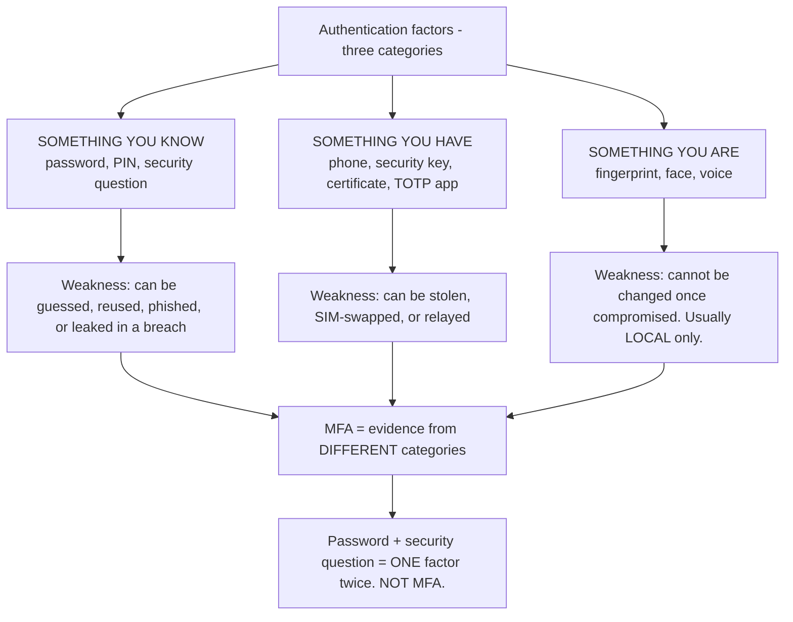
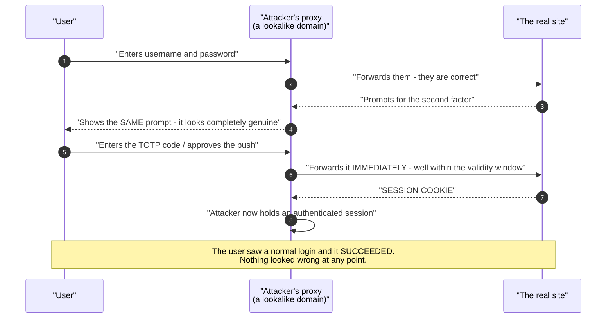
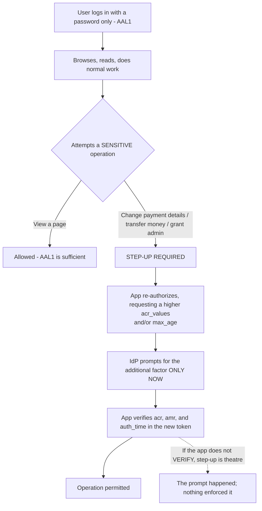
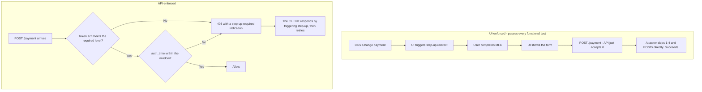
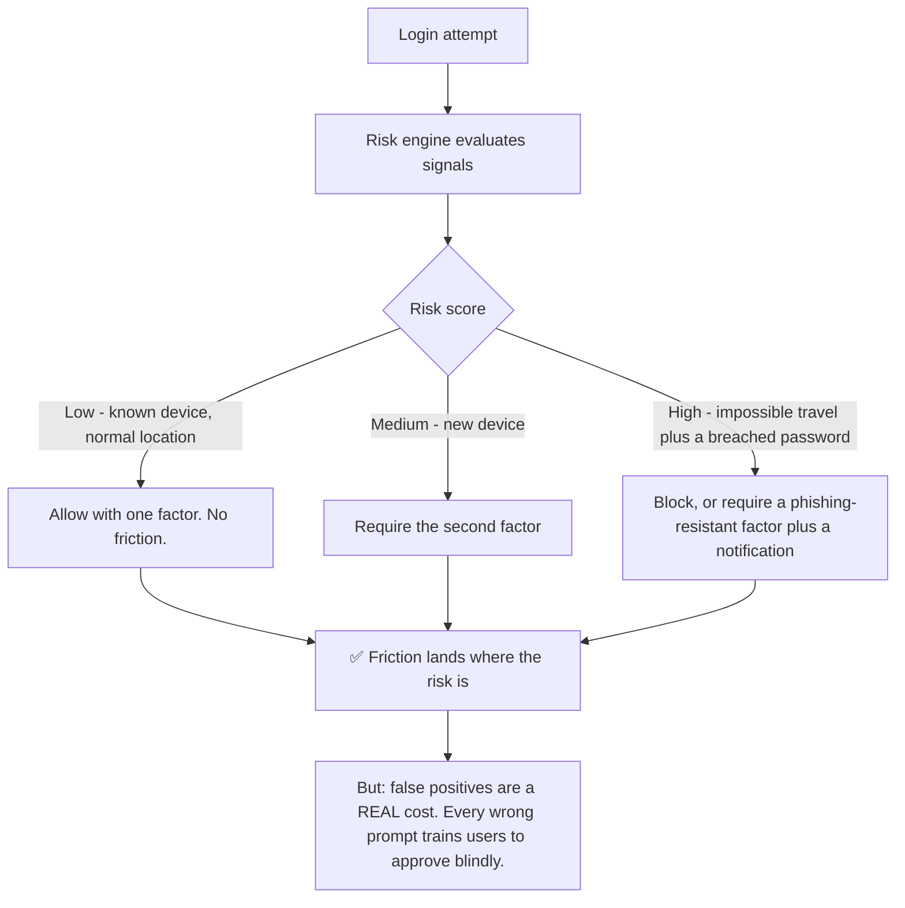
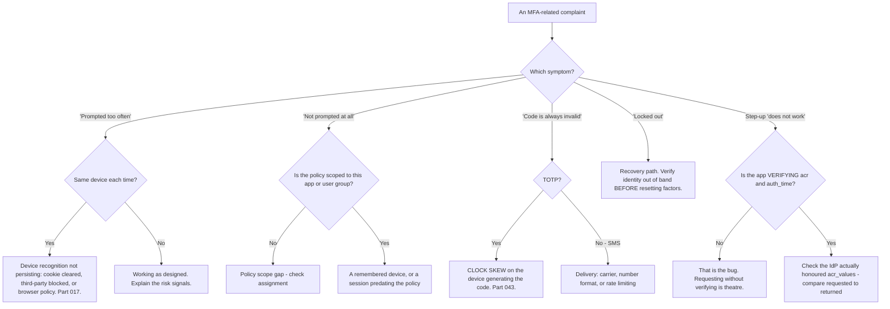

# Part 049 - MFA, Factors, Assurance Levels, and Step-Up

> Section goal: Understand what a second factor actually proves, why some factors stop phishing and others do not, and how to require more assurance only at the moments that justify the friction. This is one of the most frequently discussed topics in customer conversations, and one where confident, accurate advice is genuinely valuable.

Covers index item **049**. Maps to JD signals: *knowledge of authentication and authorization*, *basic security concepts*, *communicate technical concepts clearly*, *strong analytical and problem-solving skills*, and *promote best practices*.

---

## 1. Start From Zero: What a Factor Is

A **factor** is a category of evidence. Multi-factor authentication means evidence from **two or more different categories**.

**The classic mistake in that bottom box:** a password and a security question are both *something you know*. Requiring both is two hurdles in one category, and both are compromised by the same attack — a breach or a well-researched attacker.

> **Analogy.** A bank asking for your card *and* your PIN. Different categories: the card can be stolen but not guessed, the PIN can be guessed but not physically taken. An attacker needs two unrelated successes.
>
> **Where it stops:** a card and PIN are used together in person. Online, both factors travel through the same browser to the same page — which is precisely why phishing defeats most MFA, and why the *type* of second factor matters far more than the fact of having one.

---

## 2. The Factor Ladder

Not all second factors are equal. This ranking is the most useful thing in this Part.

| Factor | Category | Phishing-resistant | Notes |
|---|---|---|---|
| **SMS one-time code** | Have | ❌ **No** | SIM swap, SS7 interception, and trivially relayed |
| **Email one-time code** | Have | ❌ No | Only as strong as the email account |
| **Voice call** | Have | ❌ No | Same weaknesses as SMS |
| **TOTP app** (Authenticator) | Have | ❌ No | Better than SMS — no carrier — but **relayable** |
| **Push notification** | Have | ❌ No | Vulnerable to **MFA fatigue** (Part 055) |
| **Push + number matching** | Have | ⚠️ Partial | Defeats fatigue, not real-time relay |
| **Security key / passkey (FIDO2)** | Have (+are) | ✅ **Yes** | **Origin-bound** — this is the property that matters |
| **Client certificate / mTLS** | Have | ✅ Yes | Strong; heavier to deploy (Part 038) |

### 🔍 Plain-English deep-dive: why only origin binding stops phishing

Every non-phishing-resistant factor shares one flaw: **the user can be persuaded to hand it to the wrong website.**

The modern attack is not a static fake page. It is a **real-time relay** — a proxy that sits between the user and the genuine site:

**Every code-based or approval-based factor falls to this**, because the user is simply relaying a value, and a value can be forwarded. The time window does not help: the attacker forwards it within seconds.

**What FIDO2 does differently — and it is a single mechanism, not a bundle of hardening:**

The authenticator **cryptographically signs the origin** it is talking to. The browser tells the authenticator "this is `login.example.com`", and the signature covers that. If the user is actually on `login-example.com`, the authenticator produces a signature bound to *that* origin — which the real site rejects, because it does not match.

| | Code-based factor | FIDO2 / passkey |
|---|---|---|
| What the user provides | A **value** that can be forwarded | A **signature bound to the origin** |
| If the site is fake | The value works on the real site | The signature is **useless** on the real site |
| Requires the user to notice the domain | ✅ Yes — and they will not | ❌ **No** |
| Defeats real-time relay | ❌ | ✅ |

**The last row of that table is the point worth making to customers.** Phishing resistance is not achieved by training users to check URLs. Attackers use convincing domains, valid certificates, and pixel-perfect pages; expecting users to spot the difference under time pressure has failed consistently for twenty years. **FIDO2 removes the user's judgement from the loop entirely** — the browser and the authenticator handle origin checking, and they cannot be socially engineered.

**The honest caveat:** phishing-resistant does not mean invulnerable. Account recovery is frequently the weak point — if a lost passkey can be replaced by answering an SMS code, the whole chain is only as strong as the SMS (Part 054). **Attackers go to recovery precisely because it is where the phishing-resistant factor is bypassed by design.**

**Analogy:** a lock that only turns in one specific doorframe. Copying the key is pointless because the copy will not fit any other frame. **Where it stops:** a physical lock can be forced. Here the failure mode moves to the locksmith who issues replacement keys — which is exactly why recovery deserves as much design attention as authentication.

---

## 3. Assurance Levels

Not every operation needs the same confidence. Standards formalise this.

| Level | NIST SP 800-63B term | Meaning | Typical requirement |
|---|---|---|---|
| Low | **AAL1** | Some confidence | Single factor |
| Medium | **AAL2** | High confidence | Two factors, replay-resistant |
| High | **AAL3** | Very high confidence | **Hardware-based, phishing-resistant** |

In OIDC this is carried by two claims (Part 071):

| Claim | Meaning | Example |
|---|---|---|
| **`acr`** | Authentication Context Class Reference — *which level* | `urn:mace:incommon:iap:silver` |
| **`amr`** | Authentication Methods References — *which methods* | `["pwd", "otp"]`, `["pwd", "hwk"]` |
| **`auth_time`** | When the user actually authenticated | Unix seconds |

**These three claims are how an application asks for and verifies stronger authentication**, and they are the mechanism behind everything in §4.

### 🔍 Plain-English deep-dive: `acr` is a promise the two parties must agree on

There is a trap in `acr` that catches almost everyone the first time: **the specification does not define what the values mean.** It defines the claim, not the vocabulary.

That means:

| | Reality |
|---|---|
| `acr` values | Whatever the identity provider chooses to publish |
| Common across vendors | ❌ No — Okta, Auth0, Entra ID and Ping all use different strings |
| Portable between providers | ❌ An application hardcoding one provider's value breaks on migration |
| Discoverable | ✅ Usually listed in the provider's metadata as `acr_values_supported` |

**So `acr` is a shared vocabulary two parties agree on, not a universal scale.** `amr` is better standardised — RFC 8176 defines values like `pwd`, `otp`, `mfa`, `hwk`, `swk`, `face` — but providers still vary in which they emit.

**The practical consequences for support are concrete:**

**1. "Step-up isn't working" is often a value mismatch.** The application requests an `acr_values` string the provider does not recognise. Many providers respond by *ignoring* the parameter rather than erroring — so the flow completes, no extra factor is prompted, and the returned `acr` simply is not what was asked for. If the application also fails to verify, nothing surfaces at all.

**2. Always compare requested versus returned.** The single fastest check: what `acr_values` was sent in the authorization request, and what `acr` came back in the token? A HAR gives you the first, a local decode gives you the second, and the comparison usually ends the ticket.

**3. `amr` is the better evidence.** If `acr` is ambiguous, `amr` lists what actually happened — `["pwd"]` versus `["pwd","otp"]` versus `["pwd","hwk"]`. When a customer insists MFA occurred and the token says `["pwd"]`, that is dispositive.

**4. Migration breaks it.** An application hardcoding one provider's `acr` string will silently stop enforcing step-up after a migration, because the new provider ignores the unknown value. **That is a security regression with no error message**, and it is worth flagging whenever a migration is mentioned.

**Analogy:** two organisations agreeing that "Level 3 clearance" means something specific. The phrase is meaningless to a third organisation, which will nod politely and carry on. **Where it stops:** a person would ask what Level 3 means. An authorization server usually just ignores a parameter it does not understand, which is why silent non-enforcement is the characteristic failure.

---

## 4. Step-Up Authentication

Requiring more assurance for specific operations, rather than for every login.

### The two mechanisms

| Parameter | Asks for | Use |
|---|---|---|
| **`acr_values`** | A specific assurance level | "Authenticate with MFA" |
| **`max_age`** | Recency | "Authenticate again if it has been more than 5 minutes" |
| **`prompt=login`** | A forced re-authentication | Blunt; use with care |

**The critical implementation point is in that dashed arrow:** the application must **verify** `acr`, `amr`, and `auth_time` in the returned token. Requesting a higher level and not checking the result means the prompt is decorative — an identity provider may return a token without honouring the request, and if nothing checks, the sensitive operation proceeds anyway.

### Where step-up belongs

| Operation | Level |
|---|---|
| Read public data | AAL1 |
| Read personal data | AAL1–2 |
| Change a password or email | **Step up** |
| Add or remove an MFA factor | **Step up — always** |
| Financial transaction | Step up |
| Grant or change permissions | Step up |
| Delete an account or data | Step up |

**The second row from the bottom of that list is the one people forget**, and it is the most important: if adding or removing an authentication factor does not itself require strong authentication, an attacker with a hijacked session simply enrols their own factor and locks the real user out (Part 055).

### 🔍 Plain-English deep-dive: step-up belongs at the API, not at the button

This is Part 046's principle in its highest-stakes form, and it produces a defect that passes every functional test.

The natural implementation is: user clicks "Change payment details" → the UI triggers a step-up redirect → the user completes MFA → the UI shows the form → the form submits to the API. Every step works. A tester following the UI sees correct behavior.

**The gap is that the API never learned any of this happened.**

**The correct shape inverts the control flow.** The API decides that step-up is needed and says so; the client reacts. That way the requirement is enforced regardless of which client is calling — the web UI, a mobile app, a script, or an attacker's curl.

**The `auth_time` window deserves its own emphasis.** Checking `acr` alone means a step-up performed at 9am satisfies a payment change at 5pm, because the token still carries the elevated `acr`. A window of a few minutes is what makes step-up mean "just now" rather than "at some point today."

**How to spot it in a support conversation without asking for code:** *"When the payment endpoint is called directly — not through your UI — what does it check?"* If the answer describes the UI flow rather than a token check, that is the finding. And **naming the pattern** — the UI prompted, the API did not enforce — is more useful than fixing the single instance, because the customer will find the others themselves.

**Analogy:** a nightclub where the bouncer checks IDs at the street door but the bar serves anyone who walks up. The check happened; it just is not where the drinks are. **Where it stops:** a bar has one entrance you can watch. An API has as many entrances as there are clients, which is why the check has to live at the API rather than at any door in front of it.

---

## 5. Adaptive and Risk-Based MFA

Instead of always or never, prompt when signals suggest risk.

| Signal | Raises risk when |
|---|---|
| **Impossible travel** | Two logins geographically incompatible in the elapsed time |
| **New device or browser** | No prior fingerprint |
| **Unusual time** | Outside the user's normal pattern |
| **Suspicious IP** | Known proxy, hosting range, or threat-intelligence hit |
| **Failed attempts** | Preceded by password guessing |
| **Breached credential** | Password matches a known breach corpus (Part 054) |

**That caveat box is the part usually left out of the sales pitch.** Adaptive MFA reduces friction on average and creates *unpredictable* friction, and unpredictable prompts are precisely what makes MFA fatigue attacks work. A user who is prompted for reasons they cannot anticipate stops evaluating prompts and starts approving them reflexively.

**The support-relevant version:** when a customer reports "users are being prompted too often," the answer is rarely to disable adaptive MFA. It is usually device recognition not persisting — because the cookie or fingerprint that identifies a known device is being cleared, blocked as a third-party cookie (Part 017), or invalidated by a corporate browser policy.

---

## 6. Failure Modes

| Failure mode | What it looks like | Consequence | Correction |
|---|---|---|---|
| **Password + security question** | "We have MFA" | 🔴 One category twice | Use a different category |
| **SMS as the only second factor** | Widely deployed | 🔴 SIM swap, relay | Move to TOTP minimum, FIDO2 ideally |
| **Push without number matching** | Approve/deny prompt | 🔴 **MFA fatigue** (Part 055) | Number matching or FIDO2 |
| **MFA at login only** | Never re-verified | Session hijack bypasses it entirely | Step up on sensitive operations |
| **Step-up requested, not verified** | `acr_values` sent, result ignored | 🔴 **Security theatre** | Verify `acr`, `amr`, `auth_time` |
| **No step-up on factor enrolment** | Attacker adds their own factor | 🔴 **Persistent takeover** | Always step up here |
| **Weak recovery path** | Passkey recoverable via SMS | 🔴 Downgrades the strongest factor | Match recovery strength to the factor |
| **One factor enrolled** | Device lost | Total lockout, high support cost | Encourage two |
| **Adaptive MFA with poor device recognition** | Constant prompts | Users approve reflexively | Fix device persistence first |
| **MFA on every action** | Maximum friction | Users disable it or leave | Risk-based or step-up |
| **Blocking without explanation** | "Something went wrong" | Support volume, abandonment | Explain what is needed |
| **No admin visibility into enrolment** | Cannot see who has what | Cannot assess exposure | Report on factor coverage |

---

## 7. Troubleshooting Decision Tree: MFA Problems

### Worked example

*"We enabled step-up MFA for payment changes. Users get prompted, but our security team says it can be bypassed."*

1. **"Prompted but bypassable" is a specific and revealing combination.** The prompt is happening, so the request is being made correctly. Therefore the gap is on the verification side.
2. **Ask the decisive question:** after the step-up, does the application check `acr`, `amr`, and `auth_time` in the returned token before allowing the operation?
3. **Answer:** no. It triggers the redirect, the user completes MFA, and on return the application simply proceeds.
4. **Explain the bypass concretely**, because abstract descriptions do not land: an attacker with a hijacked session calls the payment-change endpoint directly, never triggering the redirect at all. The prompt is in the UI path; the enforcement should be at the API.
5. **Fix:** the API must require a token whose `acr` meets the required level and whose `auth_time` is within an acceptable window — typically a few minutes. Without the `auth_time` check, a step-up performed hours ago still counts.
6. **Note the pattern.** This is Part 046's principle again: the UI prompted, the API did not enforce. **Naming the pattern helps them find the other instances themselves**, which is more valuable than fixing this one.
7. **Check the enrolment path too.** Ask whether adding or removing an MFA factor requires step-up. If not, that is a larger finding than the one reported.

---

## 8. Lab: Factors and Step-Up

**Purpose.** Enrol multiple factor types, experience the differences, and build a working — then deliberately broken — step-up implementation.

**Prerequisites.** Parts 044–048 artifacts. A free Auth0 tenant, a test application, and a phone with an authenticator app. A hardware key or platform authenticator (Windows Hello, Touch ID) if available.

**Steps.**

1. Create `okta-prep/labs/049-mfa/`.
2. **Enrol every available factor** on a synthetic user: TOTP, push if available, and a passkey via WebAuthn (Part 050). **Record the enrolment flow for each** — the differences are instructive.
3. **Log in with each**, capturing a HAR. **Decode the resulting token and record `amr` and `acr` for each factor.** Build a factor-to-claims table. This table is the mechanism behind step-up.
4. **Compare `auth_time`.** Confirm it reflects the actual authentication moment, and that it does **not** change when a token is refreshed. **This is why `auth_time` is the right recency check.**
5. **TOTP skew.** Shift your phone's clock by two minutes and attempt a TOTP login. **Record the failure.** This is the "code is always invalid" ticket.
6. **Build step-up — correctly.** A `/payment` endpoint that requires `acr` at your MFA level and `auth_time` within five minutes. Verify it works.
7. **Break it the realistic way.** Remove the verification but keep the redirect. Then **call the endpoint directly with a non-stepped-up token.** Confirm it succeeds. **This is the §7 worked example, reproduced in your own lab** — and the most valuable artifact here.
8. **Restore verification.** Confirm the direct call now fails.
9. **`max_age` contrast.** Implement step-up using `max_age` instead of `acr_values`. Note what each achieves and where they differ.
10. **Enrolment protection.** Configure factor enrolment to require step-up. **Then remove that protection and demonstrate the attack**: with a valid session, enrol a new factor without any additional verification. Restore it.
11. **Device recognition.** Log in twice from the same browser and note whether the second prompts. Then clear cookies and repeat. **Then try in a private window.** Record all three — this is the "prompted too often" diagnosis.
12. **Adaptive signals.** If your tenant offers risk-based policies, enable them and log in via a VPN exit in another country. Record whether risk was raised and what the tenant log shows (Part 107).
13. **Recovery path audit.** Document exactly how your synthetic user could recover from losing every factor. **Identify the weakest link in that chain and write one sentence on what it means for the strongest factor.**
14. **Write the explainer.** `factor-ladder.md` — a one-page customer-facing note with the factor ranking, why origin binding matters, and where step-up belongs.
15. **Failure catalog + manifest.** Complete `MANIFEST.md`.

**Expected evidence.** Multiple factors enrolled, a factor-to-`amr` claim table, an `auth_time` behavior note, a reproduced TOTP skew failure, a working then broken then fixed step-up implementation, a demonstrated enrolment attack, a three-way device-recognition comparison, a recovery-path audit naming the weakest link, and a one-page explainer.

**Validation rubric.**

| Check | Pass condition |
|---|---|
| Multiple factors enrolled | At least TOTP plus one other |
| `amr` table | Each factor mapped to its claim values |
| `auth_time` behavior | Confirmed stable across refresh |
| TOTP skew | Failure reproduced |
| Step-up correct | Verifies `acr` **and** `auth_time` |
| Step-up broken | Direct API call succeeds — demonstrated |
| Enrolment attack | Factor added with no step-up — demonstrated and fixed |
| Device recognition | Three scenarios compared |
| Recovery audit | Weakest link identified in writing |
| Explainer | One page, ladder plus step-up guidance |

**Cleanup and privacy.** Lab tenant, synthetic users only. **Never test MFA bypass techniques against any system you do not own**, including your employer's. Restore your phone's clock. Delete enrolled factors and revoke sessions at the end. Do not photograph or store TOTP secrets or QR codes.

---

## 9. JD Mapping

| Supplied JD signal | How this Part supports it |
|---|---|
| **Knowledge of authentication and authorization** | Factors, assurance levels, `acr`/`amr`/`auth_time` |
| **Basic security concepts** | Phishing resistance, relay attacks, recovery as the weak link |
| **Communicate technical concepts clearly** | The factor ladder as a customer-facing artifact |
| Strong analytical and problem-solving skills | "Prompted but bypassable" resolved in one question |
| **Promote best practices** | Step-up on factor enrolment; verify, do not just request |
| Exceed expectations on response quality | Naming the pattern so they find other instances |
| Customer-obsessed attitude | Fixing device recognition rather than disabling security |

---

## 10. Candidate Honesty Note

- **Claim safety:** *Learned architecture and lab experience.* You have used MFA as a user and administrator and understand the mechanisms; you have not designed an MFA policy for a production customer base.
- **The strongest thing you can say:** *"The factor type matters more than having a second factor. SMS, TOTP and push are all relayable — a real-time proxy forwards the code within seconds and the user sees a completely normal, successful login. FIDO2 is different because the authenticator signs the origin, so a signature produced on a lookalike domain is useless on the real one. That removes the user's judgement from the loop, which matters because expecting people to spot a convincing lookalike domain has failed for twenty years."*
- **A second point, and it is the most common real defect:** *"Requesting step-up without verifying it is theatre. The application redirects, the user completes MFA, and then the code just proceeds — so an attacker with a hijacked session calls the endpoint directly and never triggers the redirect. The API has to check `acr` and `auth_time`, and `auth_time` matters because otherwise a step-up from three hours ago still counts."*
- **A third, which people consistently miss:** *"Adding or removing an MFA factor should itself require step-up. If it doesn't, an attacker with a session enrols their own factor and locks the real user out — and that's persistent, because they now hold a legitimate second factor."*
- **A fourth, on the limits of the strongest factor:** *"Phishing-resistant doesn't mean invulnerable. If a lost passkey can be recovered with an SMS code, the chain is as strong as SMS. Attackers go to recovery precisely because that's where the strong factor is bypassed by design."*
- **A fifth, on a common request:** *"'Users are prompted too often' is usually device recognition not persisting — the cookie is being cleared, blocked as a third-party cookie, or wiped by a corporate browser policy. The fix is device persistence, not weakening the policy."*
- **Do not overstate:** you have not run an MFA rollout or handled its support volume. Say the mechanisms and trade-offs are clear and the deployment experience is what the role would add.

---

## 11. Official Source Anchors

Accessed **26 August 2026**.

| Source | What it defines |
|---|---|
| NIST SP 800-63B | AAL1/2/3, factor definitions, and phishing-resistance requirements |
| W3C Web Authentication (WebAuthn) | Origin binding and the ceremony (Part 050) |
| FIDO Alliance — FIDO2 and passkeys | Authenticator model and attestation |
| OpenID Connect Core §2, §3.1.2.1 | `acr`, `amr`, `auth_time`, `acr_values`, `max_age` |
| IETF RFC 8176 | Authentication Method Reference values used in `amr` |
| IETF RFC 6238 | TOTP, and its time-window sensitivity |
| CISA and NCSC guidance on phishing-resistant MFA | Current public-sector recommendations |
| Auth0 documentation — MFA and adaptive MFA | Vendor factor support and policy configuration |
| Okta documentation — authenticators and assurance | Okta's factor and policy model |

**Revalidate after 26 August 2026:** this area moves. Recheck NIST SP 800-63 revisions, passkey platform support, and vendor factor availability, all of which change materially year to year.

---

## ⭐ Likely Interview Questions for This Section

### Q1. "Is SMS-based MFA good enough?"
> *Model answer:* "It's much better than nothing and it's the weakest option available. Two problems: SIM swap, where an attacker convinces a carrier to move the number, and relay — a real-time proxy shows the user a genuine-looking login, forwards their credentials, forwards the SMS code within seconds, and captures the resulting session. The user sees a completely normal, successful login. That relay problem applies to TOTP and push as well, so it's not really about SMS specifically — it's that any factor where the user provides a *value* can have that value forwarded. My advice depends on where they are: if they're on SMS only, TOTP is a cheap improvement that removes carrier risk; if they're serious about phishing, FIDO2 or passkeys, because that's the only category that actually stops relay."

### Q2. "Why is FIDO2 phishing-resistant when TOTP isn't?"
> *Model answer:* "Because of origin binding, and it's one mechanism rather than a bundle of hardening. The browser tells the authenticator which origin it's talking to, and the signature the authenticator produces covers that origin. So if the user is on `login-example.com` instead of `login.example.com`, the signature is bound to the wrong origin and the real site rejects it — the attacker gets something cryptographically useless. With TOTP the user just types six digits, and digits can be forwarded to anywhere within the validity window. The important consequence is that FIDO2 removes the user's judgement from the loop. Phishing resistance isn't achieved by training people to check URLs; attackers use convincing domains with valid certificates, and expecting users to spot the difference under time pressure has failed consistently for twenty years."

### Q3. "What's step-up authentication and how is it implemented?"
> *Model answer:* "Requiring higher assurance for specific operations rather than for every login. The user works normally with whatever they authenticated with, and when they hit something sensitive — changing payment details, granting admin, transferring money — the application re-authorizes requesting a higher `acr_values`, or a `max_age` if recency is what matters. The identity provider prompts for the extra factor and returns a token, and then the crucial part: the application must **verify** `acr`, `amr`, and `auth_time` in that token before allowing the operation. Requesting without verifying is theatre — an attacker with a hijacked session calls the endpoint directly and never triggers the redirect at all. And `auth_time` matters specifically, because without it a step-up from three hours ago still satisfies the check."

### Q4. "Where should step-up be required?"
> *Model answer:* "Anything that changes security state or moves value: password and email changes, financial transactions, granting or changing permissions, deleting an account or data. And the one people consistently forget — adding or removing an MFA factor. If enrolling a factor doesn't itself require step-up, an attacker with a hijacked session enrols their own authenticator and now has legitimate, persistent access, plus they can remove the real user's factors and lock them out. That's the single highest-value place to require it, because it's the operation that determines whether everything else can be bypassed. What I'd avoid is step-up on ordinary reads — friction everywhere trains people to approve reflexively, which is exactly what makes fatigue attacks work."

### Q5. "A customer says users are being prompted for MFA too often. What do you check?"
> *Model answer:* "First whether it's the same device each time, because that splits the problem. If it's different devices or locations, it's probably working as designed and the answer is explaining the risk signals. If it's the same device repeatedly, device recognition isn't persisting — and the causes are usually a cookie being cleared, being blocked as a third-party cookie, or a corporate browser policy wiping storage on close. That's the fix, rather than weakening the policy. I'd be careful not to jump to 'reduce the MFA requirement,' because unpredictable prompts are exactly what trains users to approve blindly, and that's the precondition for a fatigue attack. So the goal is making the friction *predictable* — prompt when there's a real signal, and don't prompt on a device you've already recognised."

### Q6. "What's MFA fatigue and how do you defend against it?"
> *Model answer:* "The attacker has valid credentials — from a breach or phishing — and repeatedly triggers push notifications until the user approves one, out of confusion, irritation, or because it arrives at 3am and they want it to stop. It works because approving is a single tap with no context about what's being approved. The main defence is number matching: the login screen displays a number the user must type into their authenticator, so approval requires actually looking at the session rather than reflexively tapping. Additional signals help — showing the location and application requesting access, and rate-limiting repeated prompts. But the real answer is FIDO2, where there's nothing to approve at all. And it's worth noting the precondition: fatigue attacks require the attacker to already have the password, so credential hygiene and breached-password detection are upstream defences."

### Q7. "How do you think about account recovery when the user has a passkey?"
> *Model answer:* "As the place where the phishing-resistant factor gets bypassed by design, so it deserves as much attention as authentication itself. If a lost passkey can be replaced by answering an SMS code, the whole chain is as strong as SMS, and attackers go straight there — it's cheaper than attacking the passkey. The principle is that recovery strength should match factor strength: a second enrolled passkey on a different device, backup codes stored offline, or a verified out-of-band process for high-value accounts. Practically I'd encourage enrolling two authenticators at signup, because that turns the common case — a lost or replaced phone — into a self-service action rather than a recovery event. It's also the cheapest thing a customer can do to reduce support volume, which usually gets attention when the security argument alone doesn't."

### Q8. "A customer wants adaptive MFA. What would you tell them?"
> *Model answer:* "That it's a good idea with a cost that's usually left out of the pitch. The benefit is real: friction lands where risk is, so most logins are frictionless and unusual ones get challenged — new device, impossible travel, a breached password, a suspicious IP. The cost is that friction becomes *unpredictable*, and unpredictable prompts are precisely what trains users to approve without thinking, which is the precondition for fatigue attacks. So I'd advise two things. Get device recognition solid first, because false positives from failing to recognise a known device are the main source of unnecessary prompts. And tell users *why* they're being challenged — 'we didn't recognise this device' turns an annoying prompt into a comprehensible one, and a user who understands the prompt is a user who might decline a fraudulent one."

---

## 🧠 30-Second Memory Hooks

- **Three categories:** know · have · are. **Two from the SAME category is not MFA.**
- **Factor ladder:** SMS < email < TOTP < push < push+number-matching < **FIDO2/passkey**.
- **Only FIDO2 is phishing-resistant**, because the authenticator **signs the origin**.
- **Codes can be RELAYED.** A proxy forwards them in seconds. The user sees a normal login.
- **Phishing resistance is not user training.** It removes user judgement from the loop.
- **AAL1 / AAL2 / AAL3** — NIST SP 800-63B.
- **`acr` = level · `amr` = methods · `auth_time` = when.** These carry step-up.
- **`acr_values` = ask for a level. `max_age` = ask for recency.**
- **Requesting step-up without VERIFYING it is theatre.** Check `acr` **and** `auth_time`.
- **Always step up on FACTOR ENROLMENT** — otherwise: persistent takeover.
- **Recovery is the weak link.** Passkey recoverable via SMS = as strong as SMS.
- **"Prompted too often" = device recognition not persisting.** Fix that, don't weaken policy.

---

## ✅ Completion Checklist

- [ ] **Knowledge:** I can rank the factors, explain origin binding in 30 seconds, and name the three step-up claims.
- [ ] **Lab artifact:** `049-mfa/` contains an `amr` claim table, a reproduced TOTP skew failure, a working-broken-fixed step-up, a demonstrated enrolment attack, and a recovery-path audit.
- [ ] **Spoken:** I can explain why TOTP is relayable and FIDO2 is not, without jargon.
- [ ] **Judgement:** I fix device recognition rather than recommending weaker policy.
- [ ] **Honesty check:** I say "lab and user experience," not production MFA rollout.
- [ ] **Source check:** I have read NIST SP 800-63B's AAL definitions and the WebAuthn origin-binding section myself.

---

*Next suggested section:* **[Part 050 - Passwordless, WebAuthn, FIDO2, and Passkeys](Part-050-passwordless-webauthn-fido2-and-passkeys.md)** — the mechanism behind the strongest factor, and what happens when the password disappears entirely.
