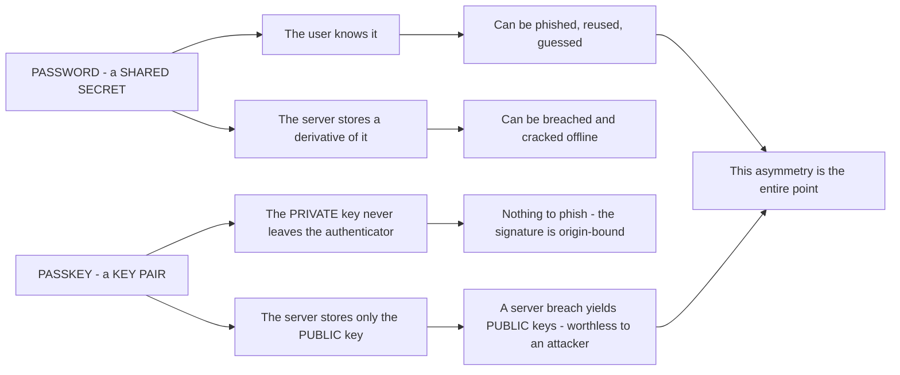
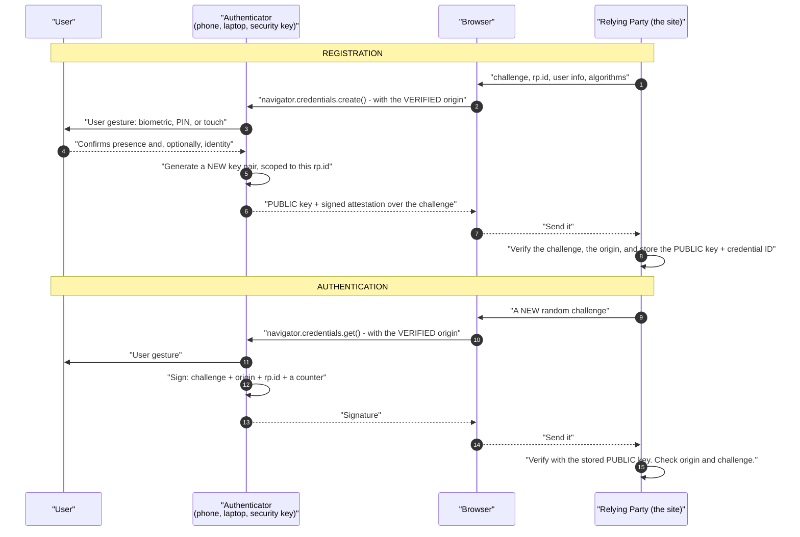
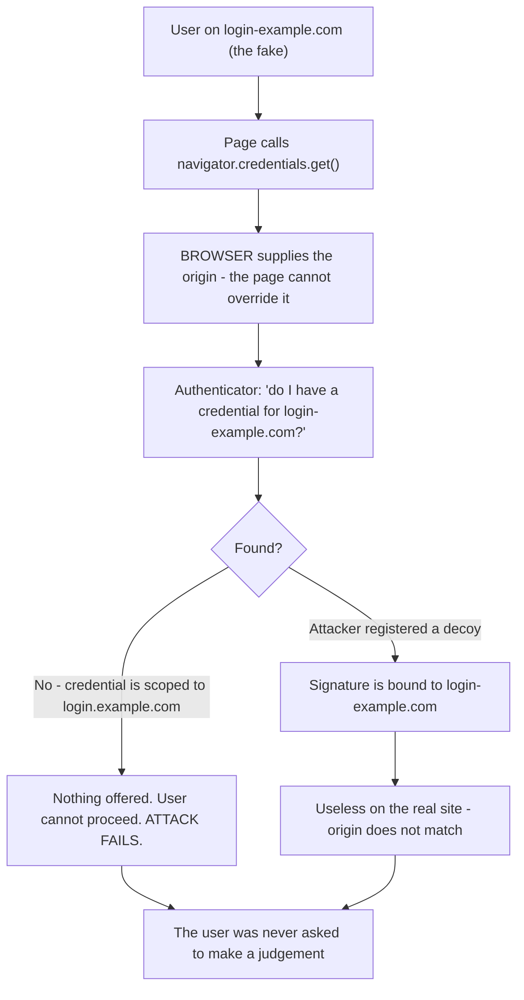
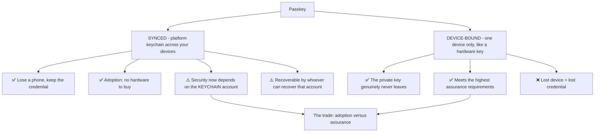
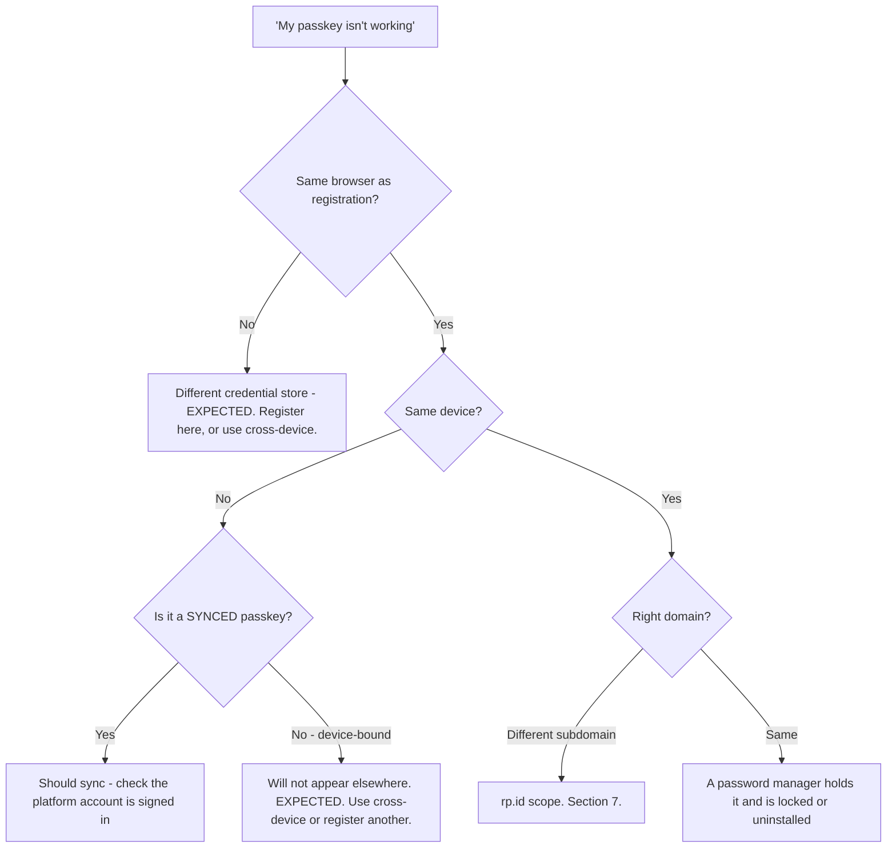
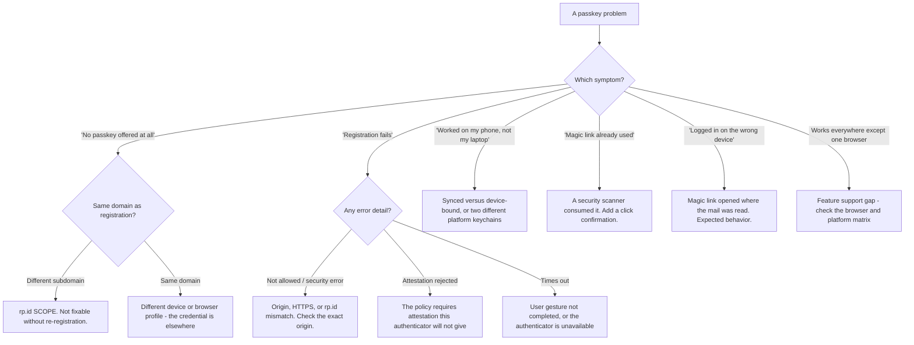

# Part 050 - Passwordless, WebAuthn, FIDO2, and Passkeys

> Section goal: Understand the mechanism behind the strongest authentication available today — what actually happens during a WebAuthn ceremony, why passkeys changed adoption, and the specific operational problems they create. This is the most actively evolving area in identity, and being current on it is a visible differentiator.

Covers index item **050**. Maps to JD signals: *knowledge of authentication and authorization*, *knowledge of encryption*, *basic security concepts*, *communicate technical concepts clearly*, and *promote best practices*.

---

## 1. Start From Zero: Why Remove the Password

Passwords fail in ways no amount of policy fixes.

| Password problem | Why policy cannot fix it |
|---|---|
| **Reuse** | Users have hundreds of accounts; memory is finite |
| **Phishable** | A password is a value; values can be handed over |
| **Breachable** | The server stores something derived from it (Part 036) |
| **Guessable** | Complexity rules produce predictable patterns |
| **Support cost** | Resets are consistently among the highest-volume tickets |

**The structural insight:** a password is a **shared secret** — both parties hold something that can be stolen from either. A passkey is a **key pair** — the server holds only a public key, so breaching the server yields nothing usable.

> **Analogy.** A password is a copy of your house key held at the estate agent's office. A passkey is a lock that only your key turns, where the agent holds a photograph of the keyhole — useful for verifying, useless for entry.
>
> **Where it stops:** you can rekey a lock. If a private key is extracted from a compromised device you revoke the credential registration server-side, which is closer to cancelling a card than to changing a lock.

---

## 2. The WebAuthn Ceremony

Two ceremonies: **registration** (creating a credential) and **authentication** (using it).

### The four properties that make this strong

| Property | What it prevents |
|---|---|
| **The private key never leaves the authenticator** | Server breach yields nothing; the key cannot be exfiltrated by script |
| **The signature covers the origin** | 🔴 **Phishing** — a signature for a lookalike domain is useless on the real one |
| **A fresh random challenge each time** | **Replay** — a captured signature cannot be reused |
| **A user gesture is required** | Silent use by malware on the device |

### 🔍 Plain-English deep-dive: the browser is the trusted party, and that changes everything

The subtlety that makes WebAuthn work is *who* tells the authenticator which origin it is talking to.

**Not the page.** The JavaScript on the page cannot lie about its own origin — it does not supply it. **The browser** determines the origin from the address bar and passes it to the authenticator through an API the page cannot intercept.

**This is why phishing fails**, and the reasoning is worth being able to reconstruct rather than memorise:

1. The user is on `login-example.com` — a convincing lookalike.
2. The page calls `navigator.credentials.get()`.
3. The **browser** tells the authenticator the origin is `login-example.com`.
4. The authenticator looks for a credential scoped to that `rp.id`. **There is none** — the user's credential is scoped to `login.example.com`.
5. Either nothing is offered at all, or a signature is produced bound to the wrong origin.
6. The real site rejects it.

**The attacker cannot fix this from their page**, because the origin comes from the browser, not from anything they control.

**Compare with the alternative.** With a TOTP code, step 4 is "the user types six digits", and the user has no way to know the page is fake. The security depended on human vigilance. Here it depends on a string comparison performed by software that cannot be persuaded.

**The related fact worth knowing:** `rp.id` is a **domain**, and it may be the registrable domain or a subdomain. A credential registered for `example.com` works across `app.example.com` and `login.example.com`; one registered for `login.example.com` does **not** work on `app.example.com`. **Getting this wrong at registration time produces "my passkey doesn't work on the other subdomain"** — and it is not fixable after the fact without re-registration.

**Analogy:** a doorman who tells the key which building it is standing in, rather than trusting the visitor's description. **Where it stops:** a doorman can be deceived by a convincing uniform. The browser derives the origin from the connection itself, which is why the certificate and HTTPS requirements underneath are load-bearing (Part 038).

---

## 3. Passkeys: What Changed

WebAuthn existed for years with limited adoption. **Passkeys** changed that by fixing the practical problems.

| | Traditional FIDO2 credential | Passkey |
|---|---|---|
| Stored on | One hardware key or one device | **Synced** via a platform keychain |
| If the device is lost | ❌ Credential gone | ✅ Available on other signed-in devices |
| Cross-device use | Needs the physical key | **QR + Bluetooth proximity** |
| Setup cost | Buy hardware | Already on the phone or laptop |
| Called | Single-device credential | **Multi-device credential** |

**The trade is real and worth stating honestly to customers:** a synced passkey is only as strong as the platform account that syncs it. For most consumer applications that is an excellent trade — vastly better than passwords, with no hardware. For the highest-assurance requirements, device-bound credentials remain the answer, and `authenticatorAttachment` plus attestation let a relying party distinguish them.

---

## 4. Passwordless Is Not One Thing

"Passwordless" covers several mechanisms with very different security properties.

| Mechanism | Phishing-resistant | Notes |
|---|---|---|
| **Passkey / WebAuthn** | ✅ **Yes** | The strong answer |
| **Magic link by email** | ❌ No | As strong as the email account; links leak via forwarding and scanners |
| **Email or SMS one-time code** | ❌ No | Relayable, exactly as in Part 049 |
| **Push approval** | ❌ No | Fatigue-vulnerable |
| **Certificate-based** | ✅ Yes | Strong, heavier to deploy |

**"We went passwordless" tells you nothing about security by itself.** The follow-up question — *which mechanism?* — is what determines whether it is stronger or weaker than what they had.

### 🔍 Plain-English deep-dive: magic links are a usability feature, not a security upgrade

Magic links are popular because they remove password friction entirely. They are frequently presented as a security improvement. They are usually neutral or a slight downgrade, and understanding why makes you useful in that conversation.

| Issue | Detail |
|---|---|
| **Security equals the email account** | Anyone with mailbox access logs in. The account is now only as strong as the email provider and its MFA |
| **Links leak** | Forwarded threads, shared mailboxes, and support tickets containing a full email |
| **Scanners consume them** | Corporate link-protection products fetch every URL, sometimes consuming a single-use link before the user clicks |
| **Not phishing-resistant** | An attacker triggers a magic link to the victim's address and relays it, or phishes the link itself |
| **Delivery is a dependency** | Spam filtering and delivery delay become login failures |
| **Cross-device friction** | Requested on a laptop, arrives on a phone, opens in a different browser with no session |

**That third row is a genuinely common and confusing ticket:** users report that the link says "already used" the first time they click it. A security appliance fetched it milliseconds after delivery. The fix is either a click-confirmation step or excluding the domain from link rewriting — and knowing that this is the cause saves a long investigation into session handling.

**The last row explains a symptom that looks like a bug and is not:** requesting a link on a desktop and opening it on a phone starts the session on the phone, not the desktop. Users describe it as "it logged in on the wrong device."

**How to advise well:** if a customer is moving from passwords to magic links, be clear that it is a **usability** change — genuinely valuable, and often the right choice — but not a security upgrade, and the email account becomes the single point of failure. If they want a security upgrade, passkeys are the answer, and magic links can remain as a fallback.

**Analogy:** replacing a house key with a note left in your mailbox saying the door is open. More convenient, and now your mailbox is your front door. **Where it stops:** a mailbox is physical and local. An email account can be accessed from anywhere by anyone who has ever phished it, which makes the dependency far broader.

---

## 5. Operational Realities

Passkeys create new support categories.

| Situation | What happens | Handling |
|---|---|---|
| **Lost the only device** | Synced passkey survives; device-bound does not | Encourage **two** credentials at registration |
| **New phone** | Synced passkey follows the keychain | Usually seamless |
| **Switching platforms** | Apple ↔ Google keychains do not sync to each other | Register a passkey on the new platform |
| **Shared computer** | Passkey may be offered to the wrong person | Discourage registration on shared machines |
| **Corporate device policy** | Platform authenticator may be disabled | Hardware key, or a fallback |
| **Browser support gaps** | Older or embedded browsers | Feature-detect and fall back gracefully |
| **User confusion** | "Where is my passkey stored?" | Clear naming and management UI |

**The single highest-value recommendation:** encourage users to register **more than one** credential during onboarding. It converts the most common failure — a lost or replaced device — from a recovery event into a non-event, and recovery is where the whole security model is weakest (Part 049).

### 🔍 Plain-English deep-dive: "where is my passkey?" is a real support problem

Passwords had one virtue: users knew where they were — in their head, or in a password manager they chose. A passkey lives somewhere the user did not consciously pick, and that produces a support category with no technical fault at all.

A single user might have credentials in four places without knowing it:

| Location | How it got there |
|---|---|
| The platform keychain | Registered on a Mac, synced through iCloud |
| A third-party password manager | It offered to save the passkey and the user accepted |
| The browser's own store | A different browser with its own credential store |
| A hardware key in a drawer | Registered once during an onboarding session |

**The symptoms this produces all look like bugs and are not:**

- *"It offered a passkey yesterday and not today"* — a different browser, so a different credential store.
- *"I have a passkey but it says I don't"* — it is in a manager that is not currently unlocked or installed.
- *"I deleted it and it came back"* — deleted from one store, still present in a synced one.
- *"It's asking me to create another one"* — the site does not see a credential for this device and offers registration.

**What actually reduces this volume**, and it is mostly product work rather than support work:

1. **A management screen that lists registered credentials** with a recognisable name, the device, and the date — so users can see what exists.
2. **Letting users name credentials** at registration: "work laptop", "personal phone".
3. **Showing where a credential lives** where the platform exposes it.
4. **Cross-device authentication** — the QR-and-Bluetooth flow — so a passkey on a phone can log you in on any computer without registering again.

**That fourth one resolves most of these tickets in practice** and is frequently not enabled, because it is an extra configuration step during rollout.

**Analogy:** house keys that automatically copy themselves to every keyring you own, except the ones from a different manufacturer. Excellent, until you are at a door with the wrong keyring and no way to see which keys exist. **Where it stops:** you can look at a keyring. Credential stores are largely invisible, which is why a management UI is not a nicety — it is the thing that makes the system explicable to its users.

---

## 6. Failure Modes

| Failure mode | What it looks like | Consequence | Correction |
|---|---|---|---|
| **Wrong `rp.id` scope** | Works on one subdomain only | Confusing partial failure | Set `rp.id` to the registrable domain |
| **Only one credential registered** | Device lost | Lockout, high support cost | Encourage two at onboarding |
| **Weak recovery path** | Passkey recoverable via SMS | 🔴 Downgrades the strongest factor | Match recovery to factor strength |
| **Password fallback always available** | "Use password instead" link | 🔴 Phishing resistance nullified | Remove or step-up-protect the fallback |
| **Magic links called a security upgrade** | Misplaced confidence | Email becomes the single point of failure | Be clear it is usability |
| **Link consumed by a scanner** | "Already used" on first click | Support volume | Click confirmation, or exclude from rewriting |
| **No feature detection** | Unsupported browser | Blank screen, no fallback | Detect and degrade gracefully |
| **Attestation required unnecessarily** | Blocks legitimate authenticators | Users cannot register | Only require it if genuinely needed |
| **Not checking the signature counter** | Cloned authenticator undetected | Missed signal | Check where the authenticator provides one |
| **Registration on a shared device** | Passkey offered to others | Account exposure | Discourage; detect shared contexts |
| **Assuming passkey means device-bound** | Assurance overestimated | Compliance mismatch | Check `authenticatorAttachment` |

---

## 7. Troubleshooting Decision Tree: Passkey Problems

### Worked example

*"We rolled out passkeys. Some users say the passkey prompt never appears on our app subdomain, but it works on the main site."*

1. **"Works on one subdomain, not another" points at `rp.id` immediately.** No other cause produces exactly that pattern.
2. **Confirm.** Ask what `rp.id` was set to at registration. Answer: `login.example.com`, because that is where the login page lives.
3. **Explain the scope rule.** A credential scoped to `login.example.com` is offered only on that host. To work across `app.example.com` and `www.example.com`, `rp.id` must be the registrable domain — `example.com`.
4. **Deliver the hard part clearly.** Existing credentials **cannot be rescoped**. Users who registered under the narrow scope must register again under the correct one. That is unwelcome and there is no way to soften it into something else.
5. **Make the migration humane.** Change `rp.id` for new registrations, keep the old scope working on the login host so existing users are not locked out, and prompt them to add a new passkey the next time they authenticate. Nobody is forced through a break.
6. **Prevent the recurrence.** Their staging environment is on a different domain, so this was not visible before production. Suggest matching the domain structure in staging.
7. **Add the general recommendation** while you are there: encourage two credentials per user at onboarding, which reduces both this migration's friction and the ongoing lost-device volume.

---

## 8. Lab: Register and Use a Passkey

**Purpose.** Perform both ceremonies, observe the actual data, and reproduce the scope failure that causes most passkey tickets.

**Prerequisites.** Parts 038, 040, 049 artifacts. A free Auth0 tenant, a browser with WebAuthn support, and a platform authenticator (Windows Hello, Touch ID) or a hardware key.

**Steps.**

1. Create `okta-prep/labs/050-passkeys/`.
2. **Enable passwordless / passkey login** on your lab tenant. Register a passkey for a synthetic user.
3. **Capture the registration ceremony.** In DevTools, record the options the relying party sent: `challenge`, `rp.id`, `user`, `pubKeyCredParams`, `authenticatorSelection`. **Save it.**
4. **Capture the authentication ceremony.** Record the challenge and the assertion returned. **Note that the challenge differs every time** — this is replay protection, observed.
5. **Decode the response.** Locally (Part 040), inspect `clientDataJSON`. **Confirm the origin is present inside the signed data.** This is the phishing-resistance mechanism, seen directly, and it is the most valuable observation in the lab.
6. **Check the token.** Decode the resulting ID token and record `amr`. Compare it to Part 049's table for password and TOTP logins.
7. **The scope experiment.** If you can serve two subdomains locally, register with `rp.id` set to the narrow host, then attempt authentication from the other subdomain. **Confirm no credential is offered.** Then re-register with the registrable domain and confirm it works on both.
8. **The origin experiment — safely.** Serve the same page from `localhost` and from `127.0.0.1`. Register on one and attempt to authenticate on the other. **Record the failure.** These are different origins, which demonstrates origin binding without any deceptive setup.
9. **Two credentials.** Register a second passkey on a different device or authenticator. Confirm either works. **Then simulate losing the first** by removing it, and confirm the second still authenticates. This is the lost-device recommendation, proven.
10. **Attestation.** If your tenant allows it, require attestation and attempt registration. Record whether your authenticator provides it and what happens if not.
11. **Fallback audit.** Check whether a password fallback link remains on the login page. **Write one sentence on what that means for phishing resistance** — because an always-available password fallback nullifies the whole benefit.
12. **Magic link contrast.** Enable email magic-link login. Request one and **inspect the email's raw source** for the link. Note that anyone with mailbox access can use it. If you have access to a link-scanning environment, observe whether the link is pre-fetched.
13. **Recovery audit.** Document how your synthetic user recovers from losing all passkeys. **Identify the weakest step** and write what it implies.
14. **Write the explainer.** `passkeys-explained.md` — one page, customer-facing: how the ceremony works, why it resists phishing, synced versus device-bound, and the two-credential recommendation.
15. **Failure catalog + manifest.** Complete `MANIFEST.md`.

**Expected evidence.** Both ceremonies captured, a decoded `clientDataJSON` showing the origin inside signed data, changing challenges observed, an `amr` comparison across three factor types, a reproduced `rp.id` scope failure and fix, an origin-binding demonstration, a two-credential resilience test, a fallback audit, a magic-link contrast, a recovery audit, and a one-page explainer.

**Validation rubric.**

| Check | Pass condition |
|---|---|
| Both ceremonies captured | Options and responses saved |
| Origin in signed data | Located in `clientDataJSON` and understood |
| Challenge freshness | Different value each authentication |
| `amr` comparison | Passkey versus password versus TOTP |
| `rp.id` scope | Failure reproduced, then fixed |
| Origin binding | `localhost` versus `127.0.0.1` failure recorded |
| Two credentials | Second works after removing the first |
| Fallback audit | Written implication |
| Magic-link contrast | Raw link inspected, dependency understood |
| Explainer | One page, four topics |

**Cleanup and privacy.** Lab tenant, synthetic users only. **Never register a passkey for a lab on a shared or work-managed device** without checking policy. Delete all lab passkeys from your platform keychain at the end — they persist in the OS credential manager after the tenant is gone. Never attempt origin-spoofing beyond the `localhost`/`127.0.0.1` comparison, which is a legitimate local test.

---

## 9. JD Mapping

| Supplied JD signal | How this Part supports it |
|---|---|
| **Knowledge of encryption** | Key pairs, signatures, and challenge-response applied concretely |
| Knowledge of authentication and authorization | The strongest authentication mechanism, understood mechanically |
| **Basic security concepts** | Origin binding, replay protection, and where the model weakens |
| **Communicate technical concepts clearly** | Explaining phishing resistance without cryptography jargon |
| Promote best practices | Two credentials at onboarding; scope `rp.id` correctly |
| Exceed expectations on response quality | Delivering unwelcome migration news with a humane plan |
| Strong analytical and problem-solving skills | Subdomain symptom → `rp.id` in one step |

---

## 10. Candidate Honesty Note

- **Claim safety:** *Learned architecture and lab experience.* You have used passkeys and understand the ceremony; you have not supported a passkey rollout at scale.
- **The strongest thing you can say:** *"WebAuthn is phishing-resistant because the *browser* tells the authenticator which origin it's talking to — the page can't supply or override it. So on a lookalike domain either no credential is offered, or the signature is bound to the wrong origin and the real site rejects it. The user is never asked to make a judgement, which is the whole point: expecting people to spot a convincing lookalike has failed for twenty years."*
- **A second point, and it is the highest-frequency passkey ticket:** *"'Works on one subdomain, not another' is `rp.id` scope, essentially always. A credential registered for `login.example.com` isn't offered on `app.example.com`. And credentials can't be rescoped — affected users have to re-register — so the honest answer includes a migration plan rather than a fix."*
- **A third, on being current:** *"Passkeys are synced multi-device credentials, and that's what changed adoption — no hardware to buy, and losing a phone doesn't lose the credential. The trade is that a synced passkey is only as strong as the platform account syncing it. For consumer applications that's an excellent trade; for the highest assurance you want device-bound credentials, and `authenticatorAttachment` plus attestation is how you tell them apart."*
- **A fourth, and it is a useful corrective:** *"'We went passwordless' says nothing about security until you ask which mechanism. Magic links are a genuine usability improvement and roughly neutral on security — the account becomes as strong as the email account. Worth being clear about that rather than letting it be counted as a security upgrade."*
- **A fifth, practical:** *"Two credentials at onboarding is the highest-value single recommendation. It turns the most common failure — a lost or replaced device — from a recovery event into a non-event, and recovery is where the whole model is weakest."*
- **Do not overstate:** you have not supported a large passkey deployment or its edge cases across platforms. Say the mechanism is clear and the deployment experience is what you want to build.

---

## 11. Official Source Anchors

Accessed **26 August 2026**.

| Source | What it defines |
|---|---|
| W3C Web Authentication (WebAuthn) Level 3 | Both ceremonies, `rp.id` scoping, `clientDataJSON`, origin binding |
| FIDO Alliance — CTAP2 | The authenticator protocol beneath WebAuthn |
| FIDO Alliance — passkeys guidance | Synced versus device-bound credentials |
| NIST SP 800-63B | Where passkeys sit against AAL2 and AAL3 |
| IETF RFC 8176 | `amr` values including `hwk` and `swk` |
| MDN — Web Authentication API | Practical browser behavior and feature detection |
| passkeys.dev | Cross-platform support matrix and current guidance |
| Auth0 documentation — passkeys and passwordless | Vendor configuration and fallback behavior |
| Okta documentation — FastPass and phishing-resistant authenticators | Okta's passwordless model |

**Revalidate after 26 August 2026:** this is the fastest-moving topic in the guide. Recheck the WebAuthn level, platform support, and vendor passkey features before any interview.

---

## ⭐ Likely Interview Questions for This Section

### Q1. "Explain how a passkey works, simply."
> *Model answer:* "When you register, your device generates a key pair for that specific website. The private key stays on the device and never leaves it; the website stores only the public key. To log in, the site sends a random challenge, your device asks you for a fingerprint or PIN, and it signs the challenge along with the website's origin. The site verifies that signature with the public key it stored. Three things follow. A breach of the site yields only public keys, which are useless. The challenge is different every time, so a captured signature can't be replayed. And because the signature covers the origin — which the *browser* supplies, not the page — a signature produced on a lookalike domain is worthless on the real one. That last part is why it resists phishing."

### Q2. "Why can't phishing defeat WebAuthn?"
> *Model answer:* "Because the origin comes from the browser, not from the page, and the page has no way to override it. If a user is on a lookalike domain, the browser tells the authenticator that's the origin, the authenticator looks for a credential scoped to it, and there isn't one — so nothing is offered and the user simply can't proceed. Even if the attacker got a credential registered for their own domain, the resulting signature is bound to their origin and the real site rejects it. Compare that with TOTP, where the equivalent step is 'the user types six digits' and the user has no way to know the page is fake. The security moved from human vigilance to a string comparison performed by software that can't be socially engineered — which matters, because convincing lookalikes with valid certificates have been beating trained users for twenty years."

### Q3. "What's the difference between a passkey and a security key?"
> *Model answer:* "Mostly whether the credential syncs. A traditional FIDO2 credential on a hardware key is device-bound — the private key genuinely never leaves that piece of hardware, which gives the highest assurance, but losing it loses the credential. A passkey is typically a multi-device credential synced through a platform keychain like iCloud or Google Password Manager, so it follows you to a new phone and survives a lost device. That's what changed adoption: no hardware to buy and no catastrophic loss scenario. The trade is that a synced passkey is only as strong as the account syncing it — whoever can recover that platform account can recover the passkey. For consumer applications that's an excellent trade. For the highest assurance you want device-bound, and `authenticatorAttachment` plus attestation is how a relying party distinguishes them."

### Q4. "A user says their passkey works on the main site but not the app subdomain."
> *Model answer:* "That's `rp.id` scope, and it's essentially the only thing that produces exactly that pattern. A passkey is scoped to a domain at registration time. If it was registered with `rp.id` set to `login.example.com`, it's only offered on that host — `app.example.com` sees no credential at all. To work across subdomains it needs to be registered against the registrable domain, `example.com`. The unwelcome part is that existing credentials can't be rescoped, so affected users have to register again. I'd deliver that plainly rather than dressing it up, but with a humane migration: change `rp.id` for new registrations, keep the old scope working so nobody is locked out, and prompt users to add a new passkey the next time they log in. I'd also ask about their staging domain, because this usually isn't visible before production."

### Q5. "Are magic links passwordless in a good way?"
> *Model answer:* "They're passwordless in a genuine usability way and roughly neutral on security, and I'd want a customer to hear that clearly rather than count it as a security upgrade. The account becomes exactly as strong as the email account — anyone with mailbox access can log in — so you've moved the security boundary rather than raised it. They're also not phishing-resistant, links leak through forwarded threads and shared mailboxes, and corporate link scanners routinely pre-fetch them, which produces the confusing 'already used' error on first click. There's also a cross-device wrinkle: request on a laptop, open on a phone, and the session starts on the phone, which users report as logging in on the wrong device. If they want a real security upgrade it's passkeys, and magic links can stay as a fallback."

### Q6. "What's the biggest operational problem with passkeys?"
> *Model answer:* "Recovery, and it's the same weakness as with any strong factor. If losing a device means losing access, you need a recovery path — and if that path is an SMS code, the whole chain is as strong as SMS and you've undone the benefit, because attackers will simply go to recovery. The highest-value mitigation is encouraging users to register two credentials at onboarding, on different devices. That turns the most common failure — a lost or replaced phone — from a recovery event into a non-event, and it's also the cheapest thing a customer can do to reduce support volume, which often gets attention when the security argument alone doesn't. Beyond that, cross-platform switching is a real friction point, because Apple and Google keychains don't sync to each other, so a user moving platforms needs to register a new passkey."

### Q7. "A customer has passkeys but keeps a 'use password instead' link. Comment."
> *Model answer:* "That link nullifies the phishing resistance for anyone who can be persuaded to click it — which, in a well-built phishing page, is most people. An attacker's fake login page simply doesn't offer the passkey option and presents the password form instead, and the user takes the path that works. So the strongest factor is only as strong as the weakest always-available alternative. I'd understand why it's there, though: it's a safety net during rollout and it prevents lockouts. So rather than 'remove it,' I'd suggest a path — keep it during rollout, then restrict it to accounts with no passkey registered, then protect it behind a step-up or an out-of-band verification for accounts that do have one. That gets to the same place without a support incident, which makes it much more likely to actually happen."

### Q8. "How would you explain the security benefit to a non-technical stakeholder?"
> *Model answer:* "I'd frame it as removing the two things that actually cause breaches. First, there's no shared secret — the site stores only a public key, so if the site is breached, attackers get something that's useless to them. Compare that with passwords, where a breach gives attackers something they can crack offline and try everywhere else, because people reuse passwords. Second, it can't be phished — the credential only works on the real site, and that's enforced by the browser rather than by the user noticing something is wrong. So the two biggest sources of account takeover, credential reuse after a breach and phishing, are both structurally removed rather than mitigated. I'd add the honest caveat that recovery is where it can still go wrong, so 'how does someone get back in after losing their phone' is the question worth their attention."

---

## 🧠 30-Second Memory Hooks

- **Password = shared secret. Passkey = key pair.** The server stores only the **public** key.
- **Two ceremonies:** registration (create) · authentication (sign a fresh challenge).
- **The BROWSER supplies the origin.** The page cannot lie about it. **That is phishing resistance.**
- **Signature covers: challenge + origin + `rp.id` + counter.**
- **Fresh challenge every time = replay protection.**
- **`rp.id` is a DOMAIN.** Register at the **registrable domain** for cross-subdomain use.
- **"Works on one subdomain, not another" = `rp.id` scope.** Not rescopable — re-register.
- **Passkey = synced multi-device.** Only as strong as the **platform account**.
- **Device-bound = highest assurance.** Check `authenticatorAttachment`.
- **"Passwordless" is not one thing.** Magic links = **usability**, not a security upgrade.
- **A magic link "already used" on first click = a security scanner pre-fetched it.**
- **An always-available password fallback nullifies phishing resistance.**
- **Register TWO credentials at onboarding.** Recovery is the weak link.

---

## ✅ Completion Checklist

- [ ] **Knowledge:** I can describe both ceremonies, explain origin binding in 30 seconds, and state the `rp.id` scope rule.
- [ ] **Lab artifact:** `050-passkeys/` contains both ceremonies captured, a decoded `clientDataJSON` showing the origin, a reproduced `rp.id` scope failure, a two-credential resilience test, and a one-page explainer.
- [ ] **Spoken:** I can explain the security benefit to a non-technical stakeholder in 60 seconds.
- [ ] **Judgement:** I give the password-fallback advice as a staged path, not a demand.
- [ ] **Honesty check:** I say "lab and personal use," not production passkey rollout.
- [ ] **Source check:** I have read the WebAuthn origin-validation section and passkeys.dev's current support matrix myself.

---

*Next suggested section:* **[Part 051 - Authorization Models: RBAC, ABAC, ReBAC, and Policy Engines](Part-051-authorization-models-rbac-abac-rebac-and-policy-engines.md)** — the four ways to decide what someone may do, and how to choose between them.
