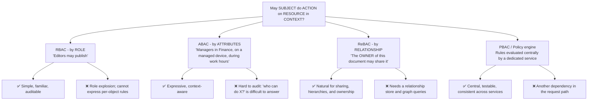
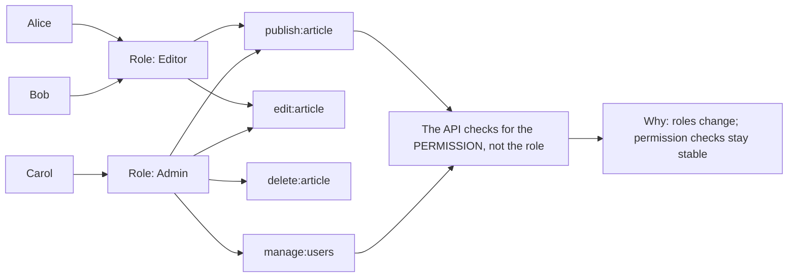
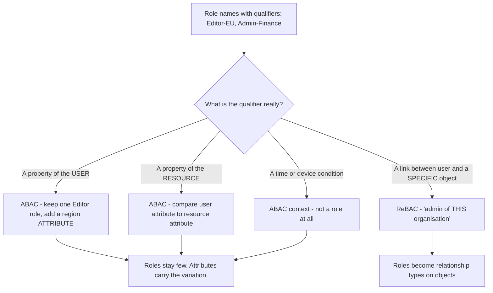
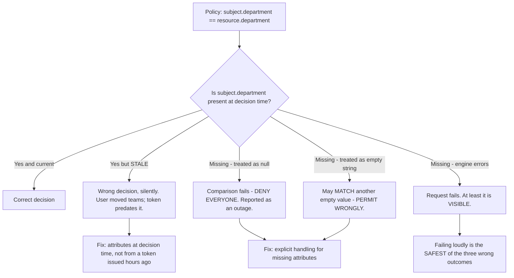
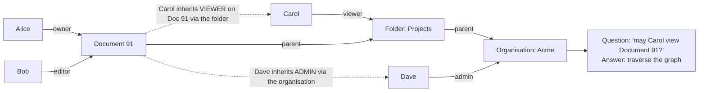
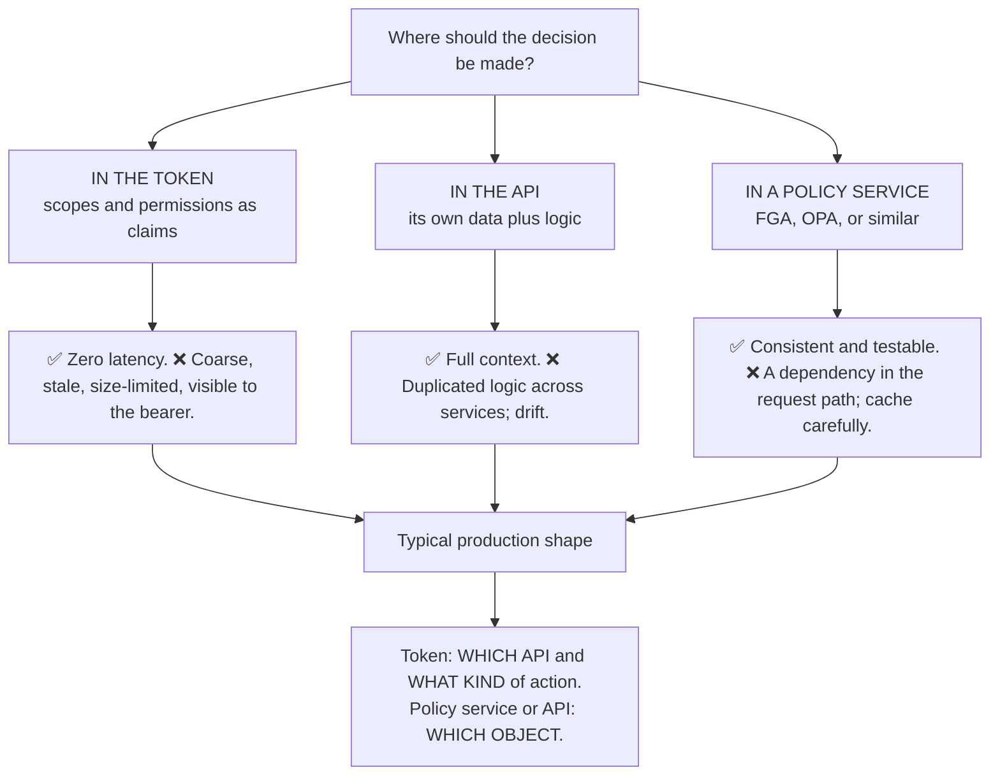
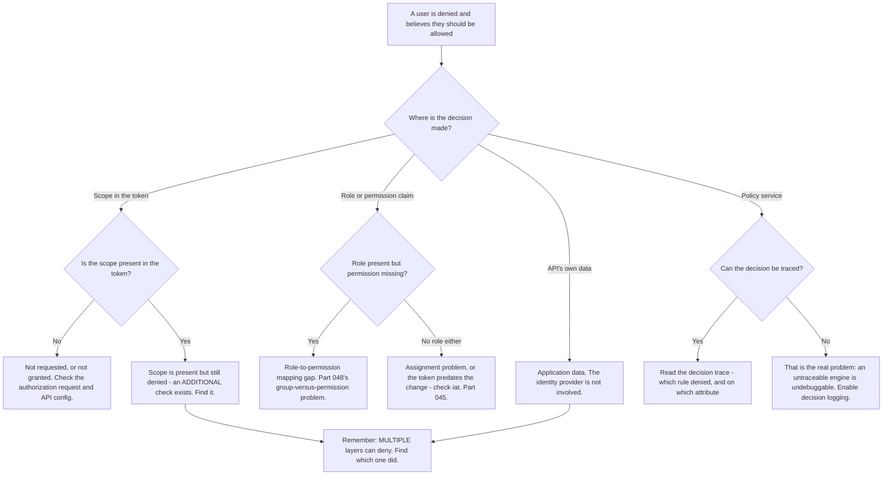

# Part 051 - Authorization Models: RBAC, ABAC, ReBAC, and Policy Engines

> Section goal: Learn the four ways systems decide what a user may do, when each is the right choice, and why almost every real system ends up combining them. This is the topic where "identity" stops being about login and starts being about the product's actual permission model — and it is where Auth0's Fine-Grained Authorization sits.

Covers index item **051**. Maps to JD signals: *knowledge of authentication and authorization*, *strong analytical and problem-solving skills*, *communicate technical concepts clearly*, *promote best practices*, and *experience with troubleshooting web applications*.

---

## 1. Start From Zero: Every Model Answers One Question

> **May *subject* perform *action* on *resource*, in *context*?**

Every authorization model is a different way of storing and evaluating the answer.



| Model | Decides by | Natural fit |
|---|---|---|
| **RBAC** | What role you hold | Internal tools, admin consoles |
| **ABAC** | Attributes of subject, resource, and context | Compliance, conditional access |
| **ReBAC** | Your relationship to the specific object | Documents, folders, teams, sharing |
| **PBAC** | Centrally evaluated policy | Many services needing one consistent answer |

> **Analogy.** RBAC is a job title on a badge. ABAC is a rule about who may enter which room, when, and from where. ReBAC is "you may enter *this* office because it is *your* office." PBAC is a rulebook held by one authority everyone consults.
>
> **Where it stops:** a badge is checked by a human who can apply judgement. Software applies exactly the rules given, which is why the model has to be able to *express* the intended rule — and role explosion is what happens when it cannot.

---

## 2. RBAC in Depth

The most widely deployed model, and the one most customers start with.



**The design rule in that last box matters more than it looks.** Code that checks `if (role === 'Admin')` breaks the moment a new role needs the same capability, and it produces sprawling role checks scattered through a codebase. Code that checks `if (has('delete:article'))` survives every role reorganisation — you change the role-to-permission mapping in one place.

### 🔍 Plain-English deep-dive: role explosion, and how to recognise it early

RBAC degrades in a predictable way, and recognising the trajectory is more useful than knowing the definition.

It starts clean: `Admin`, `Editor`, `Viewer`. Then reality arrives:

| Requirement | What gets created |
|---|---|
| "Editors in the EU shouldn't see US data" | `Editor-EU`, `Editor-US` |
| "Contractors are editors but can't publish" | `Editor-Contractor` |
| "The finance team needs a read-only export" | `Viewer-Finance-Export` |
| "Region leads manage their own region" | `Admin-EU`, `Admin-US`, `Admin-APAC` |

Within two years there are 200 roles, most held by one person, and nobody can answer *"what does `Editor-Contractor-EU-ReadOnly` actually grant?"*

**The diagnostic signs, in rough order of appearance:**

1. **Role names contain conjunctions** — a region, a department, or a qualifier in the name.
2. **Roles outnumber meaningful job functions.**
3. **Most roles have exactly one member.**
4. **Nobody removes roles**, because nobody is confident what would break.
5. **New requirements produce new roles rather than new mappings.**

**What the explosion is actually telling you:** the requirements are **attribute-based** or **relationship-based**, and they are being forced into a role-shaped container. `Editor-EU` is really "an Editor whose region attribute is EU." `Admin-EU` is really "an Admin of the EU organisation" — a *relationship*.



**The support-facing version:** when a customer describes a permission problem and their role list is enormous, the ticket in front of you is usually a symptom. Saying so is useful — but only alongside a practical next step, because "your authorization model is wrong" is not actionable. **The practical step is to ask what the qualifiers in their role names mean**, and to show that one or two of them are attributes rather than roles. That is a small, concrete change that demonstrates the direction without requiring a rewrite.

**Analogy:** printing a separate uniform for every combination of job, floor, and shift, instead of a uniform plus a badge that says which floor and shift. The wardrobe grows factorially and nobody can tell the uniforms apart. **Where it stops:** you can look at a person and infer context. Software has only what is encoded, which is why the qualifiers end up in the name.

---

## 3. ABAC in Depth

Decisions from **attributes** of the subject, resource, action, and environment.

```
PERMIT if
  subject.department == resource.department
  AND subject.clearance >= resource.classification
  AND environment.time within business_hours
  AND subject.device.managed == true
```

| Attribute source | Examples |
|---|---|
| **Subject** | Department, clearance, employment type, region |
| **Resource** | Owner, classification, department, sensitivity |
| **Action** | Read, write, delete, export |
| **Environment** | Time, IP, device posture, network, risk score |

| Strengths | Weaknesses |
|---|---|
| Expresses conditions roles cannot | **"Who can access X?" is hard to answer** |
| Context-aware — device, location, risk | Requires reliable, current attributes |
| Fewer permission objects to manage | Debugging a denial is harder |
| Policy changes without touching assignments | Policy can become opaque |

**That first weakness is the practical one.** With RBAC you list the role's members. With ABAC you must *evaluate the policy against every subject* to answer a question auditors ask constantly. Good policy engines provide this as a feature; hand-rolled ABAC usually does not, and that gap surfaces during the customer's first compliance audit.

### 🔍 Plain-English deep-dive: ABAC is only as good as its attributes

The policy language gets the attention. The **attribute pipeline** is what actually breaks, and it breaks quietly.

Every attribute in a policy has three properties that determine whether the decision is correct:

| Property | Question | Failure when wrong |
|---|---|---|
| **Source of truth** | Where does `department` really come from? | Two systems disagree; the decision depends on which one was asked |
| **Freshness** | When was it last updated? | A user who moved teams last month is still evaluated as their old department |
| **Availability** | What if it is missing at decision time? | The policy silently evaluates to deny — or worse, to permit |

**That third row is the one that produces incidents.** A policy comparing `subject.clearance >= resource.classification` behaves unpredictably when `clearance` is absent. Depending on the engine and the comparison, a missing attribute may be treated as null, as zero, or as an error — and the three outcomes are *deny everyone*, *permit everyone*, and *fail the request*. **The policy looks identical in all three cases.**



**The staleness problem connects directly to Part 045.** If attributes travel in the token, they are a snapshot from issue time. A user who changed department at 10:00 is still evaluated as their old department until their token expires. If that matters — and for access control it usually does — attributes must be resolved at decision time rather than read from claims.

**The three questions worth asking a customer whose ABAC policy is misbehaving:**

1. *"Where does that attribute come from, and is it in the token or looked up?"*
2. *"When was it last updated for this specific user?"*
3. *"What does your policy do when the attribute is missing entirely?"*

The third one is often never been considered, and asking it has a habit of finding the bug before anyone looks at the policy logic.

**Analogy:** a rule that admits anyone whose badge says "Engineering". It works until someone's badge is being reprinted — and then the door either refuses everyone, admits everyone whose badge is also blank, or jams. **Where it stops:** a guard would notice a missing badge and ask. A policy engine compares whatever it was given, including nothing.

---

## 4. ReBAC and Fine-Grained Authorization

Decisions from the **relationship between a subject and a specific object**. This is what document-sharing products need, and it is where Auth0's **Fine-Grained Authorization** (Part 109) sits.



**The defining capability is inheritance through a graph.** Carol was never granted anything on Document 91; you have `viewer` on the folder, and the document's parent is that folder. The answer is computed by traversal.

| Concept | Meaning |
|---|---|
| **Relationship tuple** | `(user:carol, viewer, folder:projects)` |
| **Type definition** | The schema: which relations exist and how they inherit |
| **Check** | *"May X do Y on Z?"* → a boolean |
| **List objects** | *"Which documents may X view?"* — needed for UI listings |
| **List users** | *"Who may view Z?"* — needed for sharing UIs and audits |

### 🔍 Plain-English deep-dive: why "list what I can see" is the hard part

Most authorization discussions focus on the **check**: may this user do this thing? That is the easy question — one traversal, cached, fast.

The hard question is the **inverse**: *show me every document this user can see.* And it is unavoidable, because it is what every list page, search result, and dashboard needs.

**Why it is hard:**

| Approach | Problem |
|---|---|
| Fetch all objects, check each | 🔴 A million documents means a million checks |
| Filter in the database | The database does not know the permission graph |
| Precompute per user | Explodes with users × objects, and goes stale on every change |
| Ask the authorization service to list | ✅ What purpose-built engines provide — and it has limits |

**The symptom in production is not an error — it is slowness**, and the shape is distinctive: the page loads acceptably for a user with ten documents and times out for the user with ten thousand. **The report is "the dashboard is slow for some users," which sounds like a database problem and is not.**

**The practical patterns:**

1. **Use the engine's list-objects API** rather than checking one by one — it is designed for this.
2. **Paginate first, then check** — resolve permissions for one page of results, not the whole set.
3. **Denormalise carefully** where the graph is shallow and stable, accepting the staleness cost.
4. **Design the model so common queries are shallow.** Deep inheritance chains are expensive to invert.

**The diagnostic question when a customer reports slow permission-filtered pages:** *"Are you checking permissions per item after fetching, or asking for the list of permitted objects up front?"* The first answer explains the latency immediately.

**Analogy:** asking "may I enter this room?" is one question to a doorman. Asking "which of the ten thousand rooms may I enter?" means the doorman walks the whole building. **Where it stops:** a doorman could keep a list. Permission graphs change constantly, so any precomputed list is stale the moment someone shares a document.

---

## 5. Where the Decision Lives



| Layer | Answers | Example |
|---|---|---|
| **Scope in the token** | Which API, what kind of action | `write:documents` |
| **API or policy service** | Which specific object | "May Alice edit document 91?" |

**Both layers are required.** The scope prevents a token intended for another API from reaching this one at all (Part 043). The object check prevents a legitimately-scoped user from touching another tenant's data — which is the failure that becomes a public incident.

---

## 6. Failure Modes

| Failure mode | What it looks like | Consequence | Correction |
|---|---|---|---|
| **Checking roles, not permissions** | `if (role === 'Admin')` | Brittle; sprawls | Check permissions |
| **Role explosion** | 200 roles, one member each | Unmaintainable, unauditable | Move qualifiers to attributes |
| **Scope only, no object check** | `write:documents` grants all documents | 🔴 **Cross-tenant data access** | Always check the specific object |
| **All permissions in the token** | Token grows unboundedly | `431`; stale claims | Coarse in token, fine at API |
| **ABAC with no "who can access X?"** | Cannot answer an audit | Compliance failure | Choose an engine that supports it |
| **Stale attributes** | Department changed last month | Wrong decisions | Fresh attributes at decision time |
| **Per-item checks on list pages** | Slow for high-volume users | Timeouts | List-objects API; paginate first |
| **Deep inheritance chains** | Expensive inverse queries | Latency | Design for shallow common queries |
| **Policy service with no cache** | Latency per request | Slow API | Cache with a short TTL |
| **Policy service as a hard dependency** | It goes down | 🔴 Total outage | Decide fail-open or fail-closed deliberately |
| **Client-side enforcement** | UI hides the option | 🔴 Unprotected API (Part 046) | Enforce server-side |
| **No deny-by-default** | Missing rule means allow | 🔴 Silent over-permission | Default deny, always |

---

## 7. Troubleshooting Decision Tree: Authorization Denial



### Worked example

*"A user has the Editor role but can't edit document 91. Other Editors can edit other documents."*

1. **"Other Editors can edit other documents" is the key detail.** The role works. The problem is object-specific — that is a ReBAC symptom, not an RBAC one.
2. **Separate the layers.** Is the denial from a scope check, a role check, or an object check? Answer: the object check.
3. **Ask the model question.** What relationship does the object check require? Answer: `editor` on the document, or on a folder that contains it.
4. **Check the relationship.** The user has the Editor **role** globally but no **relationship** to document 91.
5. **Name the distinction precisely.** A role says what kind of thing you may do; a relationship says which objects you may do it to. Having the Editor role does not grant edit access to every document — and that is correct behavior, not a bug.
6. **Establish what they intended.** If Editors *should* be able to edit everything, the model is wrong — that is RBAC, not ReBAC, and the object check should not be there. If Editors should only edit documents shared with them, the fix is granting the relationship.
7. **The likely answer is the second**, and then the real ticket becomes: why does the sharing flow not create the relationship? That is where the actual bug is.
8. **Note the general lesson** for their team: when both a role and a relationship gate an action, the denial message should say **which one** failed. An undifferentiated "access denied" turns every one of these into an investigation.

---

## 8. Lab: Four Models, One Application

**Purpose.** Implement the same authorization requirement four ways, and feel where each breaks.

**Prerequisites.** Parts 043, 044, 046 artifacts. A Node API, a free Auth0 tenant with RBAC enabled.

**Steps.**

1. Create `okta-prep/labs/051-authz/`.
2. **Define one scenario** and use it throughout: a document system with users, folders, documents, and organisations. Write down five requirements in plain English, including at least one per-object rule and one contextual rule.
3. **RBAC.** Enable RBAC in your tenant, define `Viewer`, `Editor`, `Admin`, map them to permissions, and enforce in the API. **Check permissions, never roles.**
4. **Verify the token.** Decode it and confirm the `permissions` claim. Record how the token grows as permissions are added — **record the character count at 3, 10, and 30 permissions.**
5. **Force role explosion.** Add the requirement "Editors in the EU may not touch US documents" using only RBAC. **Count the roles you now need.** Write one paragraph on where this goes at scale.
6. **ABAC.** Re-implement the same requirement with a `region` attribute on both user and document, and a single comparison. **Contrast the role count with step 5.**
7. **Answer the audit question.** With your ABAC implementation, answer "who can access document 91?" **Record how hard it was.** This is the weakness, experienced rather than read about.
8. **ReBAC.** Implement relationship tuples — `(user, relation, object)` — with folder inheritance. Implement `check`. Confirm that a user with `viewer` on a folder can view a document inside it **without any direct grant**.
9. **Implement list-objects.** Write "which documents may this user view?" naively — fetch all and check each. **Then seed 10,000 documents and measure.** Record the time.
10. **Then paginate.** Resolve permissions for one page only and measure again. **Record both numbers.** This contrast is the §4 lesson, measured.
11. **Deny by default.** Remove one rule and confirm the result is denial, not permission. **If it is permission, that is the bug** — fix it and re-verify.
12. **Layered enforcement.** Confirm both layers work: a token without the scope is rejected at the scope check, and a token *with* the scope but no relationship is rejected at the object check. **Confirm the two denials are distinguishable in the response.**
13. **Cross-tenant test.** With a valid, correctly-scoped token for organisation A, attempt to read a document in organisation B. **Confirm denial.** This is the failure that becomes a public incident, so verify it explicitly.
14. **Decision trace.** Add logging that records, for each denial, which check failed and why. **Then use it to debug a deliberately misconfigured rule.**
15. **Write the comparison.** `model-comparison.md` — one page: the four models, when each fits, and the signs a customer has outgrown RBAC.
16. **Failure catalog + manifest.** Complete `MANIFEST.md`.

**Expected evidence.** Four working implementations of one scenario, a token-growth measurement, a counted role explosion, an ABAC audit-question attempt, working ReBAC inheritance, two measured list-objects timings, a deny-by-default verification, distinguishable layered denials, a cross-tenant denial test, a decision trace used in anger, and a one-page comparison.

**Validation rubric.**

| Check | Pass condition |
|---|---|
| RBAC | Permissions checked, not roles |
| Token growth | Measured at three sizes |
| Role explosion | Counted, with written analysis |
| ABAC | Same rule, one comparison |
| Audit question | Attempted; difficulty recorded |
| ReBAC inheritance | Folder grant reaches the document |
| List-objects | Naive and paginated both measured |
| Deny by default | Verified |
| Layered denials | Distinguishable in the response |
| Cross-tenant | Explicitly denied |
| Decision trace | Used to find a real misconfiguration |

**Cleanup and privacy.** Lab tenant, synthetic data, localhost only. **Never model a real customer's or employer's permission structure**, even as an example — use generic entities. Delete roles, permissions, and relationship data at the end. Revoke tokens.

---

## 9. JD Mapping

| Supplied JD signal | How this Part supports it |
|---|---|
| **Knowledge of authentication and authorization** | The four models and their trade-offs, concretely |
| Strong analytical and problem-solving skills | §7's "which layer denied" split |
| **Communicate technical concepts clearly** | Role-versus-relationship explained without jargon |
| **Promote best practices** | Deny by default; check permissions not roles; distinguishable denials |
| Experience troubleshooting web applications | The slow-list-page diagnosis |
| Exceed expectations on response quality | Finding the real bug behind the reported one |
| Knowledge of Okta's products | Fine-Grained Authorization positioned correctly (Part 109) |

---

## 10. Candidate Honesty Note

- **Claim safety:** *Learned architecture and lab experience.* You have implemented these models in a lab; you have not designed a production authorization system.
- **The strongest thing you can say:** *"RBAC decides by role, ABAC by attributes, ReBAC by your relationship to a specific object, and a policy engine centralises evaluation. Most real systems layer them: a scope in the token says which API and what kind of action, and the API or a policy service decides which specific object."*
- **A second point, and it is the most diagnostic:** *"Role explosion is a symptom, not a problem in itself. When role names contain qualifiers — `Editor-EU`, `Admin-Finance` — those qualifiers are usually attributes or relationships being forced into a role-shaped container. Asking what the qualifier means is a small, concrete step that shows the direction without demanding a rewrite."*
- **A third, which is a genuinely non-obvious engineering point:** *"The hard question isn't 'may this user do this' — that's one fast check. It's the inverse: 'show me everything this user can see,' which every list page needs. Done naively it's a check per item, and the symptom is a dashboard that's fine for a user with ten documents and times out for one with ten thousand. That gets reported as a database problem."*
- **A fourth, on debuggability:** *"When several layers can deny, the denial message should say which one did. An undifferentiated 'access denied' turns every one of these into an investigation, and enabling decision tracing is often the highest-value thing a customer can change."*
- **A fifth, tied honestly to your background:** *"I've worked with Active Directory groups and Group Policy, which is RBAC with some ABAC-like conditions. The role-explosion pattern is very familiar from that world — it's the same failure with different names."*
- **Do not overstate:** you have not run Fine-Grained Authorization or a policy engine in production. Say the models and their failure modes are clear, and the production experience is what the role would add.

---

## 11. Official Source Anchors

Accessed **26 August 2026**.

| Source | What it defines |
|---|---|
| NIST — Role-Based Access Control model | The formal RBAC definition |
| NIST SP 800-162 | Attribute-Based Access Control guidance |
| Google Zanzibar paper | The relationship-based model most ReBAC systems derive from |
| OpenFGA documentation | Type definitions, tuples, check, and list-objects |
| Auth0 Fine-Grained Authorization documentation | The FGA product surface (Part 109) |
| Auth0 documentation — RBAC, roles, and permissions | Tenant RBAC, the `permissions` claim, and API scopes |
| Okta documentation — custom authorization servers and scopes | Scope and claim configuration |
| OWASP — Broken Access Control | Deny by default and the common failures |
| Open Policy Agent documentation | Policy-as-code and decision logging |

**Revalidate after 26 August 2026:** the models are stable. Recheck OpenFGA and Auth0 FGA documentation, which are actively developing.

---

## ⭐ Likely Interview Questions for This Section

### Q1. "Explain RBAC, ABAC, and ReBAC."
> *Model answer:* "Three ways to answer 'may this subject do this action on this resource.' RBAC decides by role — Editors may publish. It's simple, familiar, and auditable, and it can't express per-object rules. ABAC decides by attributes of the subject, resource, action and environment — managers in Finance, on a managed device, during business hours. It's expressive but harder to audit, because 'who can access X' means evaluating the policy against every subject. ReBAC decides by your relationship to a specific object — the owner of this document may share it — and it handles inheritance, so viewer on a folder reaches the documents inside. Most real systems layer them: a scope in the token says which API and what kind of action, and an object check decides which specific thing. Both layers matter, because the scope stops cross-API misuse and the object check stops cross-tenant access."

### Q2. "What is role explosion and what does it tell you?"
> *Model answer:* "It's when a clean set of roles grows into hundreds through combinations — `Editor-EU`, `Editor-Contractor`, `Admin-Finance-ReadOnly`. The signs are qualifiers appearing in role names, roles outnumbering real job functions, most roles having one member, and nobody removing any because nobody knows what would break. What it's telling you is that the requirements are attribute-based or relationship-based and are being forced into a role-shaped container. `Editor-EU` is really an Editor whose region attribute is EU. `Admin-Finance` is really an admin *of* the Finance organisation, which is a relationship. In support I'd raise it carefully, because 'your authorization model is wrong' isn't actionable — the useful move is asking what one of the qualifiers means and showing it's an attribute, which is a small concrete change rather than a rewrite."

### Q3. "What's the hardest part of implementing fine-grained authorization?"
> *Model answer:* "The inverse query. 'May this user view this document' is one fast check. 'Show me every document this user can view' is what every list page, search result and dashboard needs, and it's genuinely hard — you can't fetch everything and check each item at scale, and the database doesn't know the permission graph. The production symptom isn't an error, it's latency with a distinctive shape: fine for a user with ten documents, times out for the user with ten thousand. It gets reported as 'the dashboard is slow for some users,' which sounds like a database problem. The patterns are to use the engine's list-objects API rather than per-item checks, paginate first and resolve permissions for one page, and design the model so common queries are shallow — deep inheritance chains are expensive to invert."

### Q4. "Should permissions go in the token?"
> *Model answer:* "Coarse ones yes, fine-grained ones no. A scope like `write:documents` in the token is ideal — it says which API this token is for and what kind of action it permits, and it's checked with no lookup. But it can't say which documents, and pushing that in creates four problems: the token grows past header limits, the claims go stale until expiry, they're readable by whoever holds the token so you're publishing your authorization model, and you can't enumerate every object anyway. So the shape is: the token says what kind of thing you may do, the API or a policy service says whether you may do it to this particular object. And both layers have to actually run — a scope check alone means anyone with `write:documents` can write to *any* document, which is how cross-tenant data access happens."

### Q5. "A user has the Editor role but can't edit one specific document. Where do you look?"
> *Model answer:* "The detail that matters is whether other Editors can edit other documents. If they can, the role is working and the problem is object-specific — that's a relationship check, not a role check. So the question becomes: what relationship does the object check require, and does this user have it? Usually they have the Editor role globally but no relationship to that document. Then I'd establish intent, because the fix depends on it: if Editors should be able to edit everything, the object check shouldn't be there and the model is wrong; if Editors should only edit documents shared with them, then the relationship is missing and the real question is why the sharing flow didn't create it. That's usually where the actual bug is — the reported symptom is downstream of it."

### Q6. "How do you make authorization debuggable?"
> *Model answer:* "Make denials specific and traceable. If several layers can deny — a scope check, a role check, an object check, a contextual rule — then an undifferentiated 'access denied' turns every one of these into an investigation for both the customer and me. The response should indicate which check failed, at least at a level that doesn't leak information: 'insufficient scope' versus 'no access to this resource' versus 'blocked by policy.' Beyond that, decision logging on the policy engine — recording which rule fired and on which attribute — is often the single highest-value change a customer can make, because it converts 'it denies and we don't know why' into a line in a log. I'd also test deny-by-default explicitly: remove a rule and confirm the answer becomes denial rather than permission, because a missing rule silently granting access is the worst failure in this area."

### Q7. "Where does Auth0's Fine-Grained Authorization fit?"
> *Model answer:* "It's a relationship-based authorization service — the ReBAC model, derived from the ideas in Google's Zanzibar paper. You define a type schema saying which relations exist and how they inherit, write relationship tuples like `(user:carol, viewer, folder:projects)`, and then ask `check` questions or `list-objects` questions. It fits the case that scopes and roles genuinely can't cover: per-object permissions, sharing, folder and organisation hierarchies, and inheritance. The way I'd position it to a customer is that it complements rather than replaces what they have — the token still carries the scope that says which API and what kind of action, and FGA answers which specific objects. It's also the right answer to the role-explosion conversation, because 'admin of *this* organisation' is a relationship, and expressing it as a role is what generates hundreds of them."

### Q8. "What's the most dangerous authorization mistake?"
> *Model answer:* "Not defaulting to deny — a missing rule granting access rather than refusing it. It's dangerous because it fails silently and in the direction of over-permission: nobody reports being able to do something they shouldn't, so it's discovered in an audit or an incident rather than a ticket. A close second, and much more common in practice, is checking the scope but not the object. A token with `write:documents` is legitimately scoped, so the API accepts it — and then writes to whichever document ID was in the request, including another tenant's. That's the failure that becomes a public incident, and it's why I'd explicitly test it: take a valid, correctly-scoped token for one organisation and try to read another organisation's object. If that succeeds, nothing else about the authorization model matters much."

---

## 🧠 30-Second Memory Hooks

- **One question:** may **SUBJECT** do **ACTION** on **RESOURCE** in **CONTEXT**?
- **RBAC** = role · **ABAC** = attributes · **ReBAC** = relationship to a specific object · **PBAC** = central policy.
- **Check PERMISSIONS, not roles.** Roles change; permission checks survive.
- **Role explosion = qualifiers in role names.** Those qualifiers are **attributes or relationships**.
- **ABAC's weakness: "who can access X?"** is hard — and auditors always ask.
- **ReBAC's power: inheritance.** Viewer on a folder reaches the documents inside.
- **The hard query is the INVERSE:** "list everything I can see." Every list page needs it.
- **Symptom: fine with 10 items, times out with 10,000.** Reported as a database problem.
- **Token = which API + what KIND of action. Object check = WHICH object.** Both required.
- **Scope without an object check = cross-tenant access.** Test it explicitly.
- **DENY BY DEFAULT.** A missing rule must refuse, never allow.
- **Make denials distinguishable**, or every one becomes an investigation.

---

## ✅ Completion Checklist

- [ ] **Knowledge:** I can define all four models, name role explosion's diagnostic signs, and explain why list-objects is hard.
- [ ] **Lab artifact:** `051-authz/` contains four implementations of one scenario, measured token growth, a counted role explosion, two list-objects timings, a cross-tenant denial test, and a one-page comparison.
- [ ] **Spoken:** I can explain the three models in 60 seconds and the role-versus-relationship distinction in 30.
- [ ] **Judgement:** I raise role explosion with a concrete next step, not as a verdict.
- [ ] **Honesty check:** I connect this to AD groups and Group Policy honestly, without claiming production authorization design.
- [ ] **Source check:** I have read NIST SP 800-162's ABAC definition and the OpenFGA modelling documentation myself.

---

*Next suggested section:* **[Part 052 - Scopes, Claims, Consent, and Least Privilege](Part-052-scopes-claims-consent-and-least-privilege.md)** — how permissions are requested, what users are asked to agree to, and how to keep tokens small and safe.
