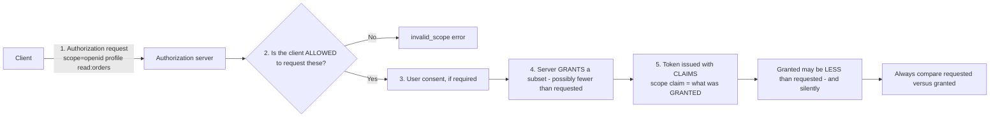
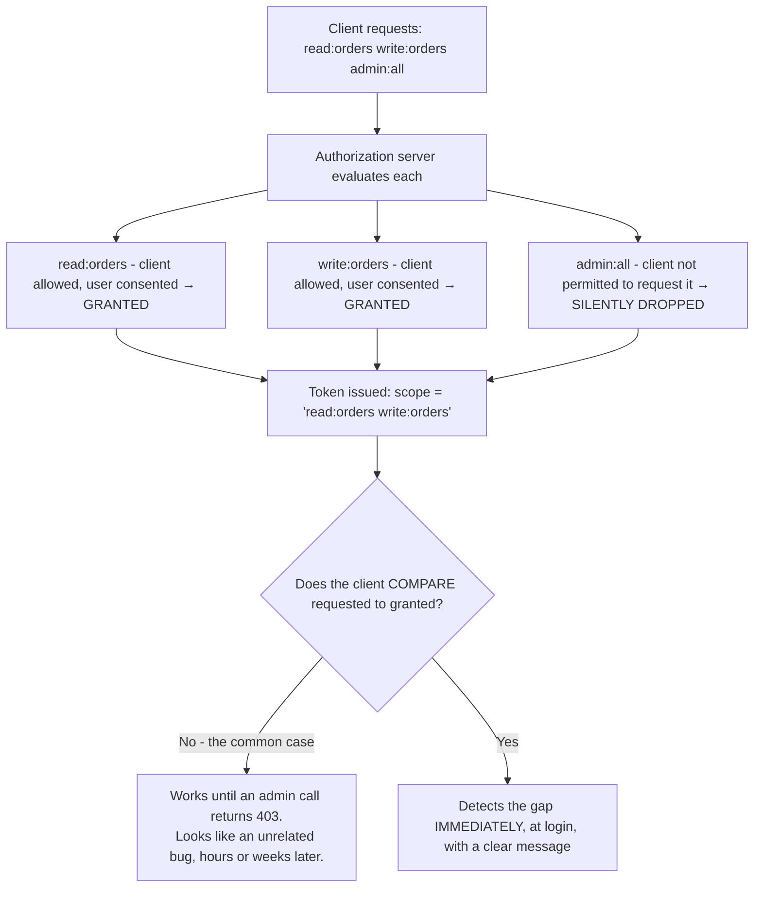
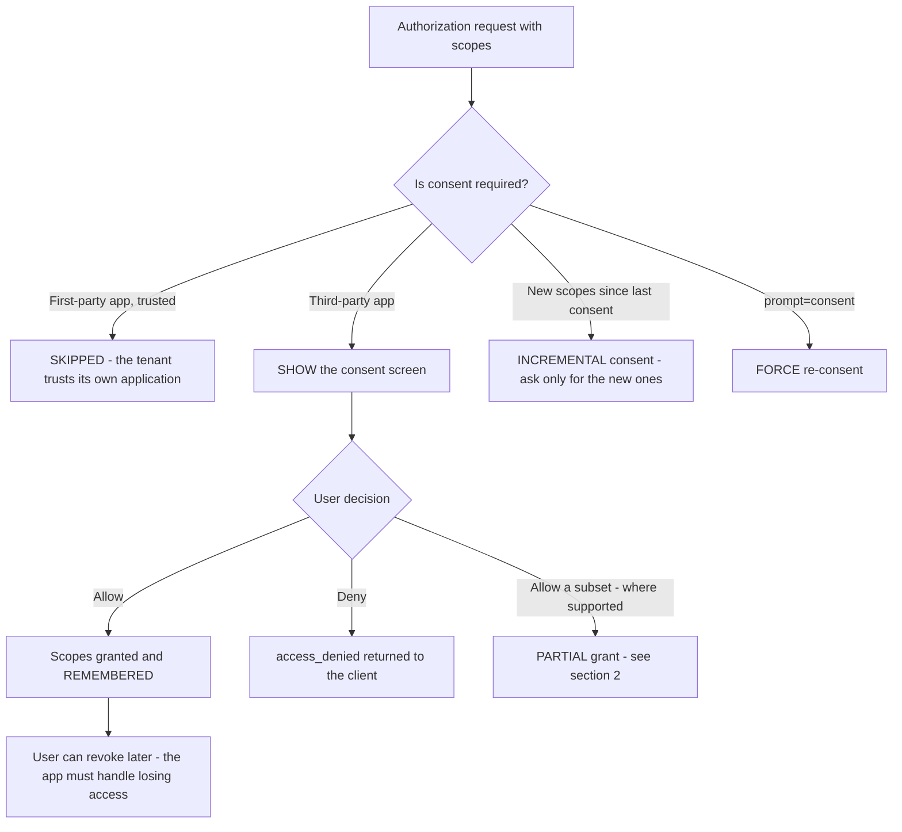
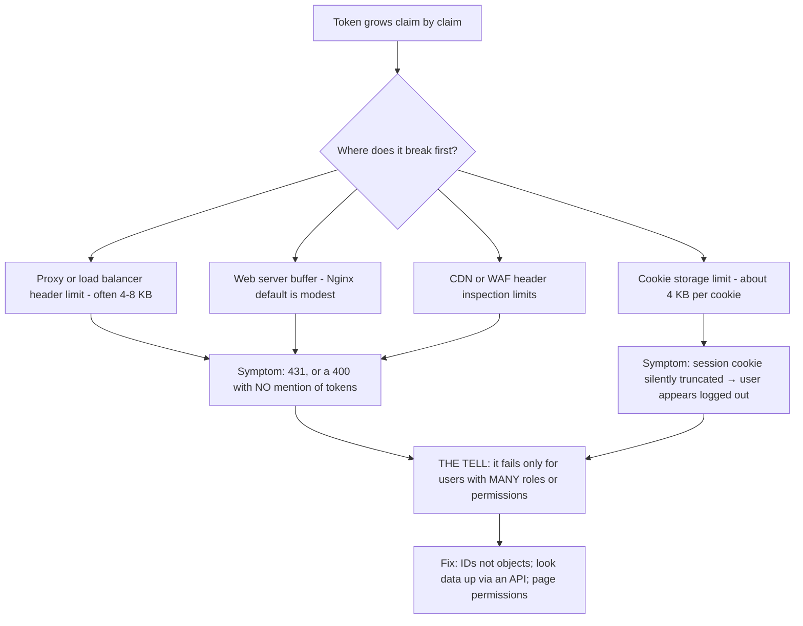
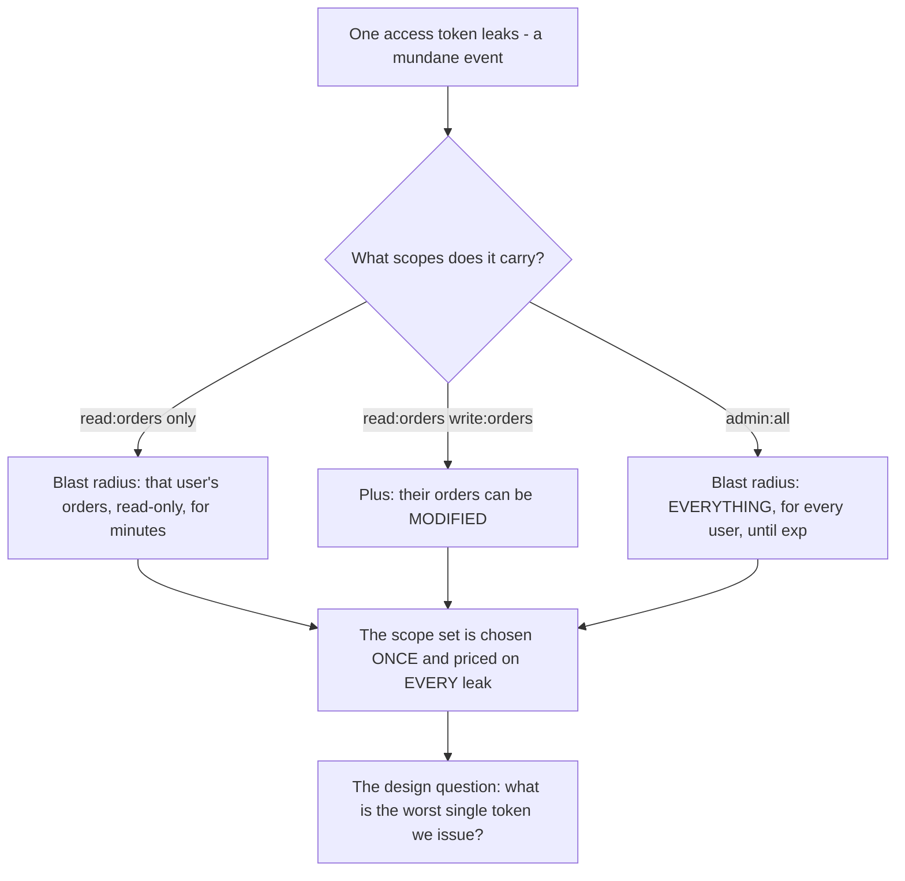
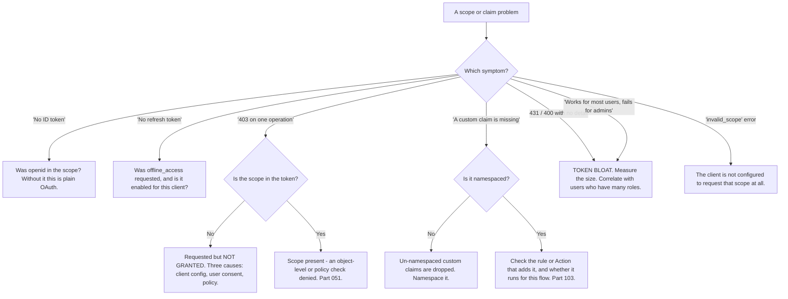

# Part 052 - Scopes, Claims, Consent, and Least Privilege

> Section goal: Understand how an application asks for permission, what the user is actually agreeing to, what ends up inside a token, and how to keep all of it minimal. This Part turns "we need more scopes" into a design conversation and gives you the vocabulary to run it.

Covers index item **052**. Maps to JD signals: *knowledge of authentication and authorization*, *basic security concepts*, *communicate technical concepts clearly*, *promote best practices*, and *strong analytical and problem-solving skills*.

---

## 1. Start From Zero: Scopes Versus Claims

Two words used interchangeably and meaning different things.

| | Scope | Claim |
|---|---|---|
| Is | A **request** for access | A **statement** in a token |
| Direction | Client → authorization server | Authorization server → consumer |
| Example | `read:orders`, `profile` | `"email": "a@b.com"`, `"scope": "read:orders"` |
| Decided by | The client asks; the server grants | The server decides what to include |
| Analogy | What you **ask** for | What you were **given** |

**The most important fact in this diagram is the bottom row:** *requested* and *granted* are different things, and the difference is frequently silent. An application that assumes it received everything it asked for will fail later, in a way that looks unrelated.

> **Analogy.** A scope is the list you hand to a librarian. A claim is what is actually stamped on the card you get back. Asking for access to the rare-books room does not mean it was granted.
>
> **Where it stops:** a librarian tells you what was refused. An authorization server often just issues a token with fewer scopes and no explanation, which is why the comparison has to be made by the client.

---

## 2. Scope Design

Scopes are a **coarse** authorization vocabulary. Designing them well is mostly about restraint.

| Principle | Good | Bad |
|---|---|---|
| **Action-oriented** | `read:orders`, `write:orders` | `orders` (what may I do?) |
| **Granular enough to be useful** | `read:profile`, `read:billing` | `read:everything` |
| **Not per-object** | `read:orders` | `read:order:12345` ← belongs in ReBAC (Part 051) |
| **Stable** | Rename rarely; it breaks clients | Frequent renaming |
| **Few** | Tens | Hundreds — they will not fit in a token |
| **Meaningful to a user** | "View your orders" | `svc_ord_r_v2` |

### The standard OIDC scopes

| Scope | Grants |
|---|---|
| **`openid`** | **Required** for OIDC. Without it there is no ID token — this is a plain OAuth request |
| `profile` | `name`, `family_name`, `picture`, `locale`, `updated_at`, etc. |
| `email` | `email`, `email_verified` |
| `address` | `address` |
| `phone` | `phone_number`, `phone_number_verified` |
| **`offline_access`** | A **refresh token** |

**Two of these cause recurring tickets.** Omitting `openid` produces "we're not getting an ID token" — because without it, this is not an OIDC request at all. Omitting `offline_access` produces "we're not getting a refresh token", which then surfaces later as unexpected re-logins.

### 🔍 Plain-English deep-dive: requested is not granted, and the gap is silent

An application requests `read:orders write:orders admin:all`. The token comes back with `scope: "read:orders write:orders"`. **No error. No warning.** The `admin:all` scope was simply not granted — because the client is not permitted to request it, the user declined it, or the policy did not allow it.

The application proceeds happily until an admin operation returns 403, at which point the failure appears to be an authorization bug in a completely different part of the system.

**Why the standard permits silent narrowing:** the specification explicitly allows the server to grant fewer scopes than requested, and requires the response to include the granted `scope` **only when it differs** from the request. So the information is available — the application just has to look.

**The three causes, and they need different fixes:**

| Cause | Fix |
|---|---|
| The client is not configured to request that scope | Tenant configuration |
| The user declined it at consent | Product decision — is it optional? |
| Policy or RBAC did not grant it to this user | Authorization configuration |

**The recommendation worth making every time:** after obtaining a token, compare the granted `scope` claim against what was requested, and fail loudly — or at least log clearly — when they differ. **It converts a mysterious 403 hours later into an explicit message at login**, and it takes about five lines.

**Analogy:** ordering four items and receiving three, with no note. You do not notice until you need the fourth, and by then you are debugging why the recipe failed rather than checking the delivery. **Where it stops:** a delivery has a receipt you can compare. Here the receipt is inside the token, which is why decoding it at login is worth doing.

---

## 3. Consent

The moment a user is asked to approve what an application may do on their behalf.

| Situation | Behavior |
|---|---|
| **First-party application** | Consent usually skipped — the organisation trusts its own app |
| **Third-party application** | Consent required — the user is authorising a stranger |
| **Incremental consent** | Ask for new scopes only when first needed, not all at signup |
| **`prompt=consent`** | Force the screen again |
| **Revocation** | The user can withdraw later; the application must handle it |

**Why consent screens matter beyond compliance:** a consent screen listing twelve permissions for a note-taking app is where users abandon signup. Requesting less is a **conversion** improvement as well as a security one, and framing it that way to a product owner is far more persuasive than framing it as least privilege.

---

## 4. Custom Claims

Adding your own data to a token — and the constraints that come with it.

| Rule | Reason |
|---|---|
| **Namespace them** | Auth0 requires a URI-like namespace for non-standard claims: `https://myapp.example.com/roles`. Prevents collisions with standard claims |
| **Keep them small** | Tokens travel in headers on every request (Part 012) |
| **Never put secrets in them** | The payload is signed, not encrypted (Part 041) |
| **Never put PII you do not need** | It is readable and it is stored wherever the token is stored |
| **Prefer IDs to objects** | `"org_id": "org_123"` not the whole organisation record |
| **Do not put per-object permissions in them** | That is ReBAC (Part 051) |

### 🔍 Plain-English deep-dive: the token bloat spiral

Token bloat follows a recognisable trajectory, and every step is individually defensible.

**Step 1.** A developer needs the user's role in the UI. Adding a `roles` claim avoids an API call. Reasonable.

**Step 2.** Then the organisation name, to display in the header. Also reasonable.

**Step 3.** Then a feature-flags object, so the UI does not flicker. Then the full permission list. Then a preferences object.

**Step 4.** The token is now 6 KB and things start failing in ways that do not mention tokens at all:

| Symptom | Cause |
|---|---|
| `431 Request Header Fields Too Large` | The header exceeds the server's limit |
| Silent failures behind a proxy | Some proxies **truncate** rather than error |
| Nginx/Apache 400s with no detail | Default header buffers exceeded |
| Failures only for *some* users | Users with more roles have bigger tokens |
| Works in dev, fails in production | Different proxy configuration |

**That tell is the diagnostic.** When a failure correlates with *which user* rather than which endpoint or which time, and the affected users are the ones with the most roles or group memberships, token size is the first thing to measure. **Administrators are usually affected first**, because they have the most of everything — which is also why it reaches the customer's own team before their users, and why it is often reported as "the admin console is broken."

**The correct pattern:** the token carries **identity and coarse authorization**. Everything else comes from an API call the application makes once and caches. That call costs one round trip at startup and removes an entire class of infrastructure failure.

**Analogy:** carrying your entire filing cabinet to every meeting instead of a business card and a phone. **Where it stops:** you would notice the weight. A token grows invisibly until something in the middle of the network quietly refuses it.

---

## 5. Least Privilege in Practice

| Principle | Application |
|---|---|
| **Request only what is needed now** | Incremental consent over an everything-at-signup screen |
| **Separate read from write** | `read:orders` and `write:orders`, never `orders` |
| **Scope per API** | Do not create one shared scope across several APIs |
| **Time-bound elevation** | Step up for sensitive operations rather than holding admin scope (Part 049) |
| **Review periodically** | Scopes accumulate; nothing removes them automatically |
| **Machine clients get less** | A service usually needs a narrow set, not a user's whole scope |

**The practical question that exposes over-scoping**, and it works because it is specific: *"which endpoint needs `admin:all`?"* If the answer is one administrative operation used rarely, that is an argument for a separate client or step-up, not for every token carrying admin rights.

### 🔍 Plain-English deep-dive: scopes are a blast-radius decision

Least privilege is usually argued as a principle, which is why it usually loses. Argued as **blast radius** — what can the holder of one leaked token actually do — it becomes a concrete risk assessment people engage with.

A token leaks in entirely mundane ways, with no attacker skill involved:

| Leak path | How common |
|---|---|
| Pasted into a ticket or chat | Constant (Part 040) |
| Logged by an application or a proxy | Common — header logging is on by default in places |
| In a URL, therefore in access logs and `Referer` | Common (Part 044) |
| Read from `localStorage` via XSS or a compromised dependency | Real (Part 047) |
| Captured on a shared or compromised device | Real |

**The scope set decides what each of those events costs.**

**The framing that lands with a product owner or an engineer**, because it is answerable rather than aspirational:

> *"What's the most powerful token this system issues, and what happens if exactly one of them ends up in a support ticket?"*

**Two structural moves shrink the answer**, and both are cheap:

1. **A separate client for administrative operations.** Ordinary user sessions never carry admin scope at all, so the everyday token — the one that actually leaks — is harmless. The powerful token exists only during a deliberate administrative session.
2. **Step-up instead of standing privilege** (Part 049). The scope is granted for minutes at the moment of the operation, not held continuously. Combined with a short lifetime, a leaked admin token is usually already dead.

**And the honest counterweight:** both add friction and code. If a customer pushes back, the useful response is not to insist — it is to establish what the worst token *currently* is, so the decision is made with the number in view rather than by default. **A team that has consciously accepted the risk is in a much better position than one that never calculated it.**

**Analogy:** issuing every employee a master key because occasionally someone needs the server room. Nothing is wrong until one key is lost, and then everything is. **Where it stops:** a lost physical key is noticed and locks can be changed. A leaked token is usually never noticed, and there is nothing to change — which is why the scope set, not the response plan, is where the decision has to be made.

---

## 6. Failure Modes

| Failure mode | What it looks like | Consequence | Correction |
|---|---|---|---|
| **Not comparing requested to granted** | Silent partial grant | 403 later, looks unrelated | Compare at login; fail loudly |
| **Missing `openid`** | No ID token | "OIDC isn't working" | It is a plain OAuth request without it |
| **Missing `offline_access`** | No refresh token | Unexpected re-logins later | Request it when needed |
| **Over-scoping** | `admin:all` on every token | 🔴 Blast radius of a stolen token | Least privilege; step up |
| **Scope per object** | `read:order:12345` | Unbounded scope count | ReBAC (Part 051) |
| **Token bloat** | 6 KB tokens | `431`, silent truncation | IDs not objects; API lookup |
| **PII in custom claims** | Readable by the bearer | Privacy exposure | Minimise; never secrets |
| **Un-namespaced custom claims** | Rejected or ignored | Claims missing | Namespace them |
| **Consent screen with 12 permissions** | Users abandon | Lost conversion | Incremental consent |
| **Not handling revoked consent** | App assumes access persists | Sudden failures | Handle `access_denied` gracefully |
| **Renaming a scope** | Existing clients break | Outage | Add new, deprecate slowly |
| **Client-side scope checks** | UI decides from `scope` | 🔴 Decoration only (Part 046) | The API enforces |

---

## 7. Troubleshooting Decision Tree: Scope and Claim Problems

### Worked example

*"Our app works for regular users but admins get a 400 from our load balancer. No error detail."*

1. **"Works for most, fails for admins" plus a *load balancer* error is nearly conclusive.** Admins have the most roles and permissions, therefore the largest tokens.
2. **Confirm by measuring, not by theory.** Ask for the character length of a regular user's token and an admin's. Answer: 1.2 KB and 7.8 KB.
3. **Locate the limit.** Their load balancer's header buffer is 8 KB total — and the token is not the only header. It fits sometimes and not others, which explains the intermittency they had not mentioned.
4. **Immediate relief:** raise the header buffer limit. Say clearly that this is a stopgap, because the token will keep growing.
5. **The real fix:** examine what is in the token. Typically a full permissions array, a feature-flags object, and a preferences blob — none of which needs to be there.
6. **Replace with the pattern:** the token carries identity and coarse authorization; everything else is fetched once from an API and cached client-side. One round trip at startup, and an entire class of infrastructure failure disappears.
7. **Prevent the recurrence:** suggest a token-size assertion in their test suite that fails the build above a threshold. **This is the kind of small, concrete prevention that customers actually adopt** — it costs nothing and it catches the next claim before production does.
8. **Note the general principle** so the lesson transfers: a failure that correlates with *which user* rather than which endpoint usually means something in the request scales with the user's data.

---

## 8. Lab: Scopes, Consent, and Bloat

**Purpose.** Observe the request-versus-grant gap, drive a token into the failure zone deliberately, and build the checks that catch both.

**Prerequisites.** Parts 043, 044, 051 artifacts. A free Auth0 tenant with an API and RBAC, plus a Node API behind a proxy.

**Steps.**

1. Create `okta-prep/labs/052-scopes/`.
2. **Design a scope set** for your document scenario: `read:documents`, `write:documents`, `delete:documents`, `manage:users`. **Write a one-line user-facing description for each** — if you cannot, the scope is badly named.
3. **Standard scopes.** Request a login *without* `openid`. **Record what you get and do not get.** Then add it and compare. Repeat for `offline_access` and the refresh token.
4. **The grant gap.** Configure your client to be permitted only a subset of your scopes. Request all of them. **Decode the token and record the `scope` claim.** Confirm no error was raised.
5. **Build the comparison check.** Five lines that compare requested against granted at login and log or fail on a difference. **Confirm it catches step 4 immediately.**
6. **Consent.** Configure a third-party-style client and trigger consent. **Screenshot the screen.** Note how the scope descriptions you wrote in step 2 appear to the user — badly named scopes are visible here.
7. **Deny consent.** Record the exact error returned to the client and **write how your application should handle it** — this is a UX decision, not just an error path.
8. **Incremental consent.** Request a subset first, then request an additional scope later. **Confirm only the new scope is presented.**
9. **Custom claims.** Add a namespaced custom claim via an Action (Part 103). Confirm it appears. **Then add an un-namespaced one** and confirm it does not.
10. **Bloat, deliberately.** Add claims until the token exceeds 8 KB — a large permissions array works. **Measure the size at each step.**
11. **Break something real.** Put your API behind a proxy with a default header buffer. Send the large token. **Record the exact error and note whether it mentions tokens at all.** (It will not.)
12. **Cookie limit.** Store a large token in a cookie and observe truncation at the ~4 KB boundary. **Record the symptom** — this looks like a random logout.
13. **Fix it.** Replace the bulky claims with IDs plus a single API lookup. Measure the new token size and confirm the proxy error is gone.
14. **Add prevention.** Write a test that fails if the token exceeds a threshold. **Run it against both the bloated and fixed versions.**
15. **Write the guidance.** `scope-and-claim-guidance.md` — one page: scope naming rules, what belongs in a token, what does not, and the requested-versus-granted check.
16. **Failure catalog + manifest.** Complete `MANIFEST.md`.

**Expected evidence.** A designed scope set with user-facing descriptions, `openid` and `offline_access` contrasts, a demonstrated silent grant gap, a working comparison check, a consent screenshot, a denial-handling plan, an incremental-consent demonstration, a namespaced-versus-not contrast, measured token growth, a reproduced proxy failure and cookie truncation, a fix with measurement, a token-size test, and one-page guidance.

**Validation rubric.**

| Check | Pass condition |
|---|---|
| Scope set | Every scope has a user-facing description |
| `openid` contrast | ID token absent then present |
| Grant gap | Silent partial grant demonstrated |
| Comparison check | Catches the gap at login |
| Consent | Screenshot; denial handling written |
| Incremental consent | Only new scopes presented |
| Namespacing | Un-namespaced claim confirmed dropped |
| Bloat | Size measured at each step |
| Proxy failure | Reproduced; error text recorded |
| Cookie truncation | Observed at the boundary |
| Fix | Size reduced; failure resolved |
| Prevention | Test fails on the bloated token |

**Cleanup and privacy.** Lab tenant, synthetic users only. **Use fictional claim data** — never real personal data, even your own, since claims end up in logs and saved tokens. Delete custom Actions and scopes at the end. Revoke tokens and clear cookies.

---

## 9. JD Mapping

| Supplied JD signal | How this Part supports it |
|---|---|
| **Knowledge of authentication and authorization** | Scopes, claims, consent, and the grant model |
| **Basic security concepts** | Least privilege, PII minimisation, blast radius |
| **Communicate technical concepts clearly** | Framing least privilege as a conversion improvement |
| **Promote best practices** | The requested-versus-granted check; token-size testing |
| Strong analytical and problem-solving skills | "Fails only for admins" → token size |
| Experience troubleshooting web applications | Proxy and cookie limits in practice |
| Exceed expectations on response quality | Offering a build-time guardrail, not just a fix |

---

## 10. Candidate Honesty Note

- **Claim safety:** *Learned architecture and lab experience.*
- **The strongest thing you can say:** *"A scope is what the client asks for; a claim is what the server actually put in the token. They're routinely different, and the difference is silent — the spec lets the server grant fewer scopes than requested. So an application that assumes it got everything fails later with a 403 that looks unrelated. Comparing granted against requested at login is about five lines and turns a mysterious failure into a clear message."*
- **A second point, and it is a genuinely satisfying diagnosis:** *"'Works for most users, fails for admins' with a load balancer error is token bloat. Admins have the most roles, so the biggest tokens, so they hit the header limit first. And the error usually doesn't mention tokens at all — it's a 431 or a bare 400 from a proxy. The tell is that the failure correlates with *which user* rather than which endpoint."*
- **A third, on the fix rather than the diagnosis:** *"Raising the header buffer is relief, not a fix, because the token keeps growing. The token should carry identity and coarse authorization; everything else — feature flags, preferences, full permission lists — comes from one API call at startup. And I'd suggest a token-size assertion in their test suite, because that's the kind of small guardrail people actually adopt."*
- **A fourth, which changes who agrees with you:** *"Least privilege is easier to sell as a conversion improvement than as a security principle. A consent screen with twelve permissions on a note-taking app is where users abandon signup. Product owners respond to that framing when they don't respond to blast radius."*
- **A fifth, small but high-frequency:** *"'We're not getting an ID token' is almost always a missing `openid` scope — without it, it isn't an OIDC request at all. Same shape for `offline_access` and refresh tokens."*
- **Do not overstate:** you have not designed a scope taxonomy for a production API. Say the principles and failure modes are clear and the design experience is what the role would build.

---

## 11. Official Source Anchors

Accessed **26 August 2026**.

| Source | What it defines |
|---|---|
| IETF RFC 6749 §3.3 | Access token scope, and the server's right to grant less |
| IETF RFC 6749 §4.1.2, §5.1 | When the `scope` parameter must be returned |
| OpenID Connect Core §5.4 | Standard scopes and the claims each returns |
| OpenID Connect Core §5.5 | Requesting individual claims via the `claims` parameter |
| IETF RFC 9068 | The `scope` claim in JWT access tokens |
| OAuth 2.0 Security BCP | Least privilege and scope-related recommendations |
| Auth0 documentation — scopes, custom claims, and namespacing | The namespacing requirement and Actions |
| Okta developer documentation — scopes and claims | Okta's authorization server configuration |
| IETF RFC 9110 §15.5.15 | `431 Request Header Fields Too Large` |

**Revalidate after 26 August 2026:** the RFCs are stable. Recheck vendor documentation on custom claim namespacing and token size limits.

---

## ⭐ Likely Interview Questions for This Section

### Q1. "What's the difference between a scope and a claim?"
> *Model answer:* "A scope is a request — the client asks for `read:orders` in the authorization request. A claim is a statement in the resulting token — including a `scope` claim listing what was actually granted. The distinction matters because those two are often different: the spec explicitly lets the authorization server grant fewer scopes than were requested, and it only has to tell you when they differ. So a client can ask for three scopes, get two, receive no error, and fail later with a 403 that looks like an unrelated authorization bug. My standard recommendation is to compare the granted `scope` claim against what was requested at login and log or fail loudly on a difference. It's about five lines and it converts a mysterious later failure into an explicit message at the moment it happens."

### Q2. "A customer says they aren't getting an ID token. What's your first question?"
> *Model answer:* "Whether `openid` is in the scope parameter. Without it, the request isn't an OIDC request at all — it's plain OAuth, which has no concept of an ID token, so the authorization server is behaving correctly by not issuing one. It's a very high-frequency ticket because the scope name looks like boilerplate and gets dropped when people hand-build a request or copy one from an OAuth example. The same shape applies to refresh tokens: 'we're not getting a refresh token' is usually a missing `offline_access` scope, or that scope not being enabled for the client. Both are one-line fixes, and both present as something much bigger — the refresh-token one usually shows up later as unexpected re-logins rather than as a missing token."

### Q3. "How would you design a scope set?"
> *Model answer:* "Action-oriented, granular enough to be useful, few enough to fit in a token, and meaningful to a human. So `read:orders` and `write:orders` rather than just `orders`, because a scope that doesn't say what you may do isn't answering the question. I'd separate read from write always, keep them per-API rather than shared, and avoid anything per-object — `read:order:12345` is unbounded and belongs in a relationship model instead. The test I like is writing a one-line user-facing description for each: 'View your orders.' If you can't write that sentence, the scope is badly named, and it'll look terrible on a consent screen. And I'd treat renames as breaking changes — add new, deprecate slowly, because existing clients are requesting the old name."

### Q4. "What goes in a token and what doesn't?"
> *Model answer:* "Identity and coarse authorization go in — `sub`, `iss`, `aud`, `exp`, scopes, maybe a small set of roles or an organisation ID. Everything else comes from an API call. What doesn't belong: full permission lists, feature-flag objects, preference blobs, or any object where an ID would do. Three reasons. Size — tokens travel in headers on every request and there are limits in proxies, web servers and cookies. Staleness — claims are a snapshot at issue time, so anything that changes is wrong until the token expires. And visibility — a JWT payload is signed, not encrypted, so anything in it is readable by whoever holds the token, which means no secrets and no unnecessary personal data. The pattern is IDs in the token, data behind an API call you make once and cache."

### Q5. "An app works for most users but fails for admins. Where do you start?"
> *Model answer:* "Token size, because a failure correlating with *which user* rather than which endpoint usually means something in the request scales with that user's data — and admins have the most roles, permissions and group memberships. I'd ask for the character length of a normal user's token and an admin's, which is a thirty-second measurement. If there's a big gap, then I'd look at where the limit is: proxy or load balancer header buffers, web server defaults, or the roughly 4 KB cookie limit if it's stored there. The confusing part is that the error usually doesn't mention tokens — it's a bare 400 from a proxy, or a 431, or with a cookie it's silent truncation that presents as a random logout. Raising the buffer is relief; the fix is taking the bulky claims out and looking that data up instead."

### Q6. "How do you think about consent screens?"
> *Model answer:* "As a product surface, not just a compliance requirement. The screen is where a user decides whether your application looks trustworthy, and a note-taking app asking for twelve permissions is where people abandon signup. So I'd argue for incremental consent — request the minimum at signup and ask for additional scopes at the moment they're first needed, when the reason is obvious. That's better security and better conversion, and framing it as conversion is what actually persuades a product owner. The scope descriptions matter here too, because that's what the user reads — `svc_ord_r_v2` on a consent screen tells them nothing and looks alarming. And the application has to handle denial properly: `access_denied` isn't an error state to log, it's a user decision that needs a sensible next screen."

### Q7. "A custom claim isn't appearing in the token. What do you check?"
> *Model answer:* "Namespacing first. Auth0 requires non-standard claims to use a URI-like namespace — `https://myapp.example.com/roles` — and un-namespaced custom claims are silently dropped rather than rejected, so there's no error to go on. That's the most common cause and it's a thirty-second check. If it is namespaced, then whether the Action or rule that adds it actually ran for this flow — Actions are trigger-specific, so one that adds a claim on login won't run on a client-credentials exchange or a refresh. And whether it's being added to the right token, because adding it to the ID token and then looking for it in the access token is a common mix-up. The namespacing rule exists to prevent collisions with standard claims, which is worth explaining rather than just stating, because otherwise it feels arbitrary."

### Q8. "How do you push back on 'we need admin scope on every token'?"
> *Model answer:* "With a specific question rather than a principle: which endpoint actually needs it? If the honest answer is one administrative operation used occasionally, then every token carrying admin rights means every stolen or leaked token is an admin token — the blast radius is set by the rarest operation. The alternatives are a separate client for administrative work with its own narrow scope set, or step-up authentication at the point the operation happens, which is better anyway because it re-verifies the human. I'd avoid making it abstract; 'least privilege' as a phrase doesn't move anyone. 'If one of these tokens leaks, what can the holder do?' does. And if they genuinely need it broadly, that's worth knowing too — it usually means the scope is doing work a relationship model should be doing."

---

## 🧠 30-Second Memory Hooks

- **Scope = what you ASK for. Claim = what you were GIVEN.**
- **Granted may be LESS than requested — SILENTLY.** Compare them at login.
- **No `openid` = no ID token.** It is plain OAuth without it.
- **No `offline_access` = no refresh token.** Surfaces later as re-logins.
- **Scopes: action-oriented, per-API, few, human-readable.** Never per-object.
- **If you cannot write "View your orders" for a scope, it is badly named.**
- **Token = identity + coarse authorization.** Everything else = **an API call**.
- **Token bloat breaks at:** proxy headers · server buffers · **~4 KB cookies**.
- **"Fails only for admins" = token size.** The error will not mention tokens.
- **Custom claims must be NAMESPACED** or they are silently dropped.
- **Least privilege sells better as CONVERSION** than as security.
- **"Which endpoint actually needs `admin:all`?"** is the question that ends over-scoping.

---

## ✅ Completion Checklist

- [ ] **Knowledge:** I can distinguish scopes from claims, name the six standard OIDC scopes, and list what does not belong in a token.
- [ ] **Lab artifact:** `052-scopes/` contains a demonstrated silent grant gap, a working comparison check, measured token growth, a reproduced proxy failure and fix, a token-size test, and one-page guidance.
- [ ] **Spoken:** I can diagnose "fails only for admins" in 30 seconds and argue least privilege in conversion terms.
- [ ] **Judgement:** I offer a build-time guardrail alongside the fix.
- [ ] **Honesty check:** I say "lab experience," not production scope design.
- [ ] **Source check:** I have read RFC 6749 §3.3 and OIDC Core §5.4 myself.

---

*Next suggested section:* **[Part 053 - Identity Lifecycle: Signup, Verification, Provisioning, Deprovisioning](Part-053-identity-lifecycle-signup-verification-provisioning-deprovisioning.md)** — everything that happens to an identity before its first login and after its last.
