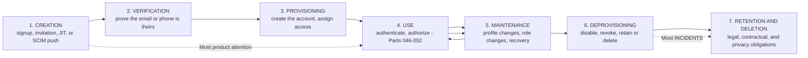
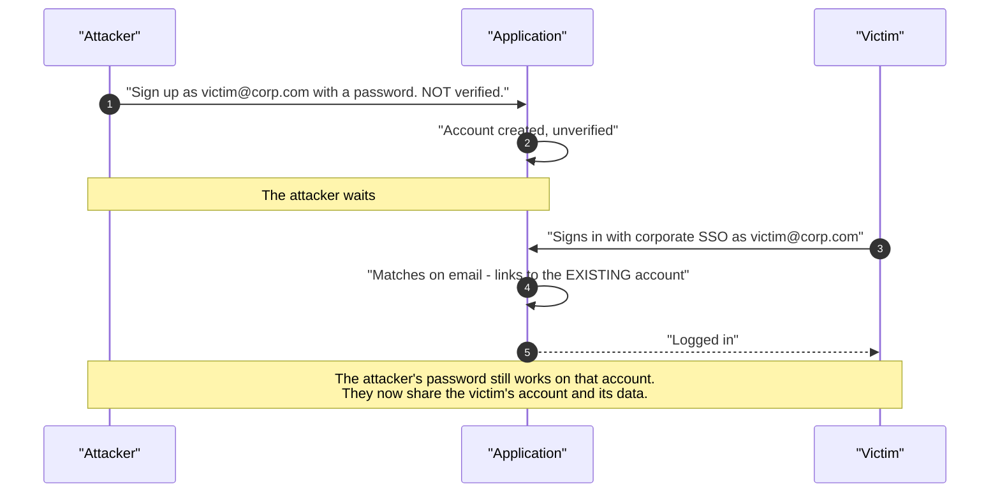
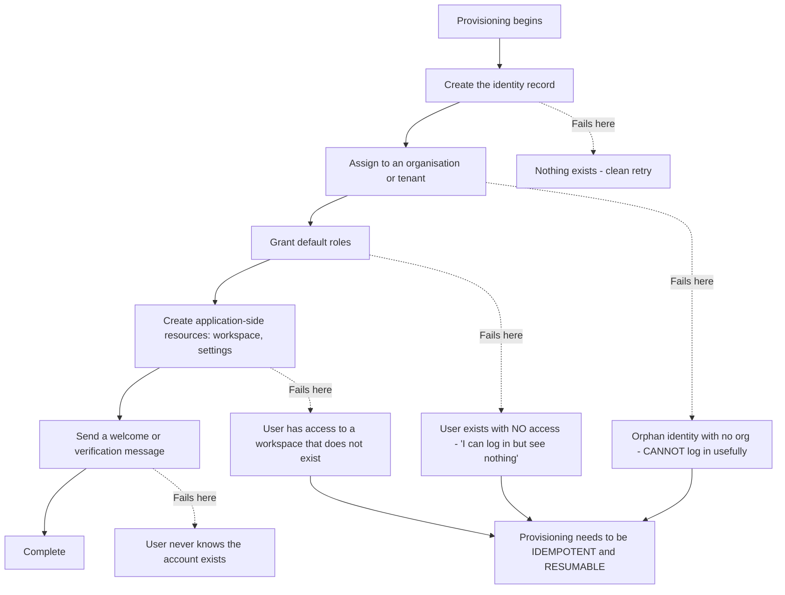
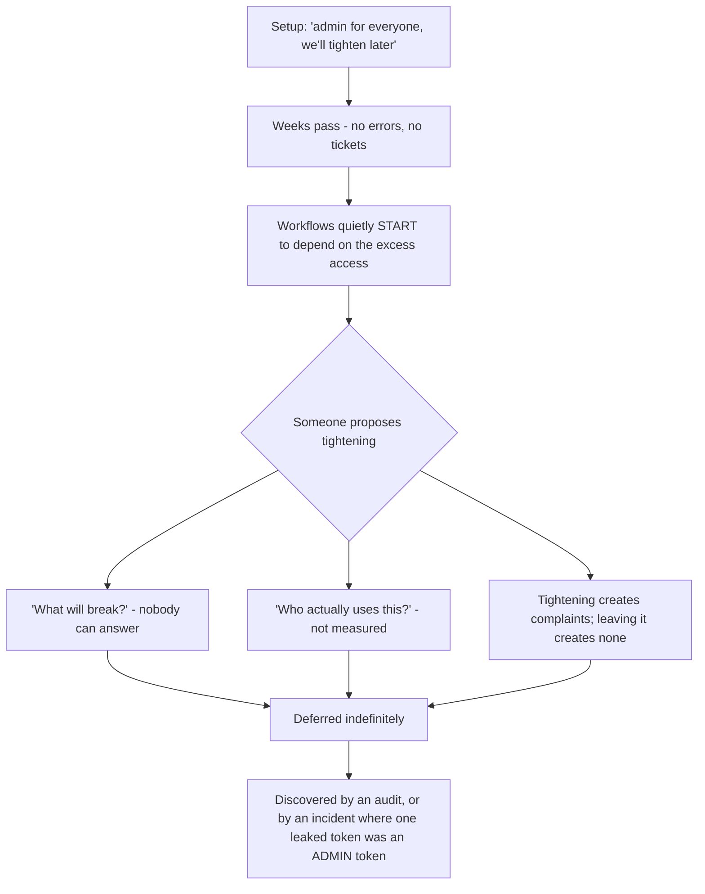
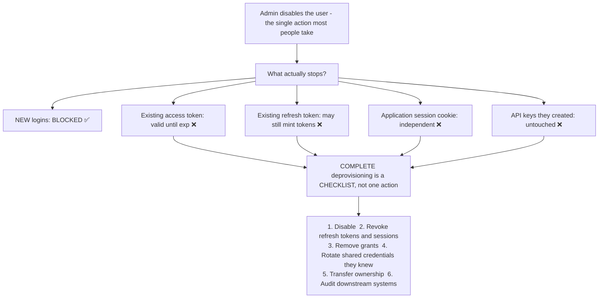
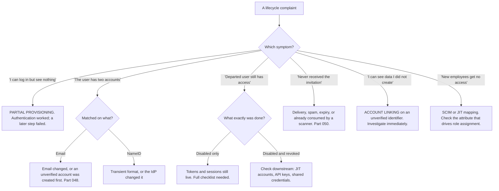

# Part 053 - Identity Lifecycle: Signup, Verification, Provisioning, Deprovisioning

> Section goal: Follow an identity from the moment it is created to the moment it should cease to exist, and learn where each stage fails. Most identity products focus on authentication; most identity *incidents* come from the stages before and after it.

Covers index item **053**. Maps to JD signals: *knowledge of authentication and authorization*, *basic security concepts*, *strong analytical and problem-solving skills*, *experience with troubleshooting web applications*, and *communicate technical concepts clearly*.

---

## 1. Start From Zero: The Whole Journey

**The asymmetry in those dashed lines is the theme of this Part.** Onboarding gets designed carefully because it is visible and it affects conversion. Offboarding is an afterthought, and it is where audits fail, data lingers, and former employees retain access.

> **Analogy.** A building with an elaborate reception process and no procedure for collecting passes when people leave. Every visitor is logged in beautifully; nobody knows how many passes are still in circulation.
>
> **Where it stops:** a building can do an annual pass audit and physically collect them. Digital identities span many systems that were never told about each other, which is why the gap compounds silently.

---

## 2. Creation: Four Ways In

| Path | How | Typical context |
|---|---|---|
| **Self-service signup** | The user registers themselves | B2C |
| **Invitation** | An admin invites; the user completes it | B2B, teams |
| **JIT provisioning** | Created on first federated login (Part 048) | Enterprise SSO |
| **SCIM push** | The IdP creates the account in advance (Part 094) | Enterprise lifecycle |

Each has a distinct failure profile:

| Path | Characteristic failure |
|---|---|
| Self-service | 🔴 Bots, fake accounts, disposable domains |
| Invitation | Invitations forwarded, expired, or reused |
| JIT | **Creates but never removes** — the deprovisioning gap |
| SCIM | Attribute mapping errors propagate at scale, silently |

---

## 3. Verification

Proving an identifier belongs to the person claiming it.

| Verifying | Method | Weakness |
|---|---|---|
| **Email** | A link or code sent to it | Only proves mailbox access at that moment |
| **Phone** | SMS or voice code | SIM swap; number recycling |
| **Identity document** | Third-party verification | Cost; friction; privacy |
| **Payment instrument** | A small charge | Proves payment access, not identity |

### 🔍 Plain-English deep-dive: what an unverified email actually costs

Skipping email verification is tempting — it improves signup conversion measurably. The costs are less visible and mostly arrive later.

| Cost | Detail |
|---|---|
| **Account takeover by pre-registration** | An attacker registers with **someone else's** email. When the real owner later signs in via SSO, they may be linked into the attacker's account |
| **Password reset to nowhere** | The address is a typo. The user is locked out with no recovery path, and support cannot verify who they are |
| **Communications fail silently** | Receipts, alerts, and security notifications bounce. **Security alerts not arriving is the serious one** |
| **Deliverability damage** | Sending to invalid addresses harms your sending reputation, which degrades delivery for everyone |
| **Support burden** | "I never got the email" tickets, where the address was wrong from the start |

**The first row deserves the most attention because it is a real attack**, not just data hygiene:

**The defence is exactly two rules:**

1. **Never link accounts on an unverified email.** Verification status must be part of the matching decision, not just a flag.
2. **Never allow a password credential to persist on an account claimed via a verified federated identity** without explicit re-verification by the owner.

**And the practical support signal:** when a customer reports "a user has two accounts" or "a user can see data they didn't create," account linking on unverified identifiers is a leading candidate. It is worth asking about early because the alternatives are much harder to investigate.

**Analogy:** allowing someone to register a mailing address before proving they live there, and then forwarding the real resident's post to them. **Where it stops:** a postal service can require proof of residence. Email verification is the equivalent — which is why skipping it is not a small convenience trade.

---

## 4. Provisioning

Creating the account and granting the right access.

| Concern | Question |
|---|---|
| **Where does the record live?** | Identity provider, application, or both |
| **Which attributes are needed?** | Minimum viable — every extra field is data to protect |
| **What access by default?** | 🔴 Least privilege, always — never "admin until we sort it out" |
| **Which tenant or organisation?** | Critical in B2B (Part 104) |
| **What if it fails halfway?** | Partial provisioning is a real and messy state |

**Those partial states are the ones that generate confusing tickets**, because the user can authenticate perfectly — the failure is downstream of login and therefore does not look like an identity problem at all. *"I can log in but the app is empty"* is the classic phrasing, and it means provisioning stopped at step 3 or 4.

### 🔍 Plain-English deep-dive: "we'll tighten permissions later" never happens

The default access granted at provisioning is one of the most consequential decisions in a system, and it is almost always made casually — during setup, under time pressure, by someone who intends to revisit it.

The reasoning is always the same and always sounds sensible: *"give everyone admin for now so nothing blocks the rollout, and we'll tighten it once we understand who needs what."*

**Why it does not get tightened:**

| Reason | Detail |
|---|---|
| **Nobody knows what will break** | Removing a permission risks breaking someone's workflow, and nobody can enumerate who relies on what |
| **There is no forcing function** | Over-permission causes no errors and generates no tickets. It is invisible |
| **The people who set it moved on** | The context for the original decision is gone |
| **Tightening produces complaints; leaving it produces none** | The incentives point one way |
| **It becomes load-bearing** | Workflows quietly grow to depend on the excess access |

**The asymmetry is the whole problem:** granting too much is silent, and removing it is noisy. So the system drifts in one direction only.

**What actually works, and it costs almost nothing at setup time:**

1. **Start minimal.** Under-permission is self-correcting — the user hits a wall and asks, and you learn exactly what is needed from a real request rather than a guess.
2. **Make elevation easy and temporary.** If getting more access takes five minutes and expires, nobody needs standing privilege.
3. **Instrument permission use.** If you can see which permissions are actually exercised, tightening becomes a data question instead of a risk.
4. **Put a date on it at the moment of the decision.** "Admin for the first two weeks, reviewed on the 14th" is a commitment; "we'll tighten later" is not.

**The support-facing version:** when a customer's permission model is uniformly generous and they mention it was temporary, the useful contribution is not to point out the risk — they know. It is to offer the *mechanism* that makes tightening safe: instrumenting which permissions are actually used. **That converts an uncomfortable conversation into a tractable task.**

**Analogy:** giving every new employee a master key on day one because their real access has not been decided yet. Two years later everyone has one, nobody remembers why, and taking them back would cause an uproar. **Where it stops:** a physical key can be counted and collected. Permission grants accumulate across systems with no central register, which is why the drift is invisible until an audit.

---

## 5. Deprovisioning

The stage that gets least attention and causes most audit findings.

| Action | Effect | When |
|---|---|---|
| **Disable** | Cannot authenticate; data preserved | Immediately on departure |
| **Revoke sessions and tokens** | Existing access ends | **Immediately** — disabling alone leaves live tokens (Part 045) |
| **Remove access grants** | Roles and permissions withdrawn | Immediately |
| **Transfer ownership** | Their documents and resources reassigned | Before deletion |
| **Delete** | Record removed | After the retention period |

### 🔍 Plain-English deep-dive: disabling is not revoking, and the gap is measured in tokens

The most common deprovisioning mistake is assuming a single action does everything.

**Disabling a user prevents *new* authentications.** It does not:

| Not affected by disabling | Consequence |
|---|---|
| Existing access tokens | Valid until `exp` — up to hours (Part 045) |
| Existing refresh tokens | May continue minting new access tokens |
| Existing application sessions | The app's own cookie is independent |
| Existing IdP sessions | Silent re-authentication may still succeed |
| API keys or machine credentials they created | Entirely separate objects |
| Access granted through group membership elsewhere | Only removed where the group was the grant |

**Item 4 is consistently forgotten and is often the largest exposure.** A departing engineer knew the database password, the API key in the shared vault, and the service account credentials. None of those are attached to their identity, so disabling their account changes nothing about them. **Rotating what they knew is deprovisioning too**, and nobody's identity system will remind you.

**Item 6 matters because federation and SCIM are one-directional.** A user disabled at the identity provider cannot log in to federated applications — good — but any application using JIT provisioning still holds their account and data (Part 048). If an auditor asks "show me that this person has no access anywhere," the identity provider's answer is incomplete.

**The support-facing version:** when a customer reports that a departed user still has access, the useful first question is *"what exactly did you do to remove them?"* Nine times out of ten the answer is "we disabled the account," and the gap follows directly from that.

**Analogy:** cancelling someone's building pass but not asking for the office keys they cut, changing the alarm code they memorised, or telling the other buildings. **Where it stops:** a building would eventually notice. Digital access leaves no trace of use, so nothing surfaces until it is exploited or audited.

---

## 6. Failure Modes

| Failure mode | What it looks like | Consequence | Correction |
|---|---|---|---|
| **No email verification** | Faster signup | 🔴 Pre-registration takeover; lost recovery | Verify before linking or granting |
| **Linking on an unverified email** | Accounts merge silently | 🔴 **Account takeover** | Verification status in the matching decision |
| **Matching on a mutable identifier** | Email changes → new account | Orphaned data (Part 048) | Immutable ID |
| **Partial provisioning** | "I can log in but see nothing" | Confusing tickets | Idempotent, resumable provisioning |
| **Default admin access** | "We'll tighten it later" | 🔴 Over-privileged users forever | Least privilege from creation |
| **Disable treated as complete** | Tokens still valid | 🔴 Residual access | Full deprovisioning checklist |
| **Shared credentials not rotated** | They knew the vault password | 🔴 **Often the biggest exposure** | Rotate what they knew |
| **JIT with no deprovisioning** | Accounts persist downstream | 🔴 Audit failure | SCIM (Part 094) |
| **No ownership transfer** | Documents lost with the account | Data loss | Transfer before deletion |
| **Deleting immediately** | Retention obligations breached | Legal exposure | Retain, then delete |
| **Never deleting** | Data kept indefinitely | Privacy breach | Defined retention policy |
| **Invitation links long-lived** | Forwarded or leaked | Unauthorised access | Short expiry, single use |
| **No re-verification on email change** | Change to an address you do not own | 🔴 Takeover vector | Verify the new address |

---

## 7. Troubleshooting Decision Tree: Lifecycle Problems

### Worked example

*"A user says they can see another person's documents. They both work at the same customer."*

1. **Treat this as urgent.** Cross-user data visibility is a potential data-exposure incident, and the response should reflect that from the first message.
2. **Establish the scope immediately.** Is it one pair of users or a pattern? A pattern suggests a tenant-isolation bug (Part 051); a single pair suggests account linking.
3. **Answer:** one pair, and they share an email domain but not an address.
4. **Ask how each account was created.** One signed up directly with a password; the other arrived via their company's SSO.
5. **Check the linking configuration.** Accounts are being linked on email — and one of the two emails was never verified.
6. **The likely sequence:** the first account was created with an email the person did not control, or the matching is normalising addresses in a way that collides — a plus-addressed alias, a case difference, or a domain alias.
7. **Immediate containment:** unlink the accounts and revoke sessions on both. Then determine what was accessed and over what period — that is the part the customer needs for their own obligations.
8. **The fix:** verification status must be part of the linking decision. An unverified identifier must never be sufficient to match an existing account.
9. **Then widen it, because this rarely affects one pair:** how many other accounts were linked on unverified identifiers? That query is the difference between resolving a ticket and resolving the exposure.

---

## 8. Lab: The Whole Lifecycle

**Purpose.** Walk one synthetic identity through every stage, break each stage, and build the deprovisioning checklist you would give a customer.

**Prerequisites.** Parts 044–052 artifacts. A free Auth0 tenant with a database connection, an enterprise connection from Part 048, and a test application.

**Steps.**

1. Create `okta-prep/labs/053-lifecycle/`.
2. **Map it first.** Draw the seven stages and, for each, note which system owns it in your lab. **Do this before configuring anything.**
3. **Create four ways.** Produce one synthetic user by each path: self-service signup, invitation, JIT via your enterprise connection, and a Management API create standing in for SCIM. **Record what differs in each resulting user record.**
4. **Verification.** For the signup user, complete email verification and record the `email_verified` claim before and after. **Confirm it appears in the token.**
5. **Reproduce the linking risk — safely.** Create an unverified account with an address, then federate in with the same address from your second identity source. **Record whether they link.** If they do, that is the §3 attack path, demonstrated in your own tenant.
6. **Then fix it.** Configure linking to require verification, and confirm the behavior changes.
7. **Partial provisioning.** Write a provisioning routine with four steps and make step 3 fail deliberately. Log in as that user. **Record exactly what the user experiences** — this is the "I can log in but see nothing" ticket.
8. **Make it resumable.** Add idempotency so re-running completes the missing steps without duplicating the earlier ones. Verify by re-running twice.
9. **Invitation handling.** Create an invitation and record its expiry and single-use behavior. **Attempt to use it twice.** Record the error.
10. **Deprovisioning — the incomplete version.** Disable a user, then immediately: call the API with their existing access token, attempt a refresh, and check whether their app session still works. **Record all three results.** This is the §5 gap, measured.
11. **Deprovisioning — the complete version.** Now revoke sessions and refresh tokens and repeat all three tests. Record the differences and **note how long the access token remained valid** (Part 045).
12. **The downstream gap.** Confirm that the JIT-created account still exists at the service provider after the user is disabled at the identity provider. **Screenshot it** — this is the audit finding.
13. **Build the checklist.** `deprovisioning-checklist.md` — the six steps from §5, with the specific action for each in your lab, including credential rotation and downstream audit.
14. **Retention.** Write a short retention position: what is kept, for how long, and what deletion means. **Note which parts are legal rather than technical decisions.**
15. **Failure catalog + manifest.** Complete `MANIFEST.md`.

**Expected evidence.** A seven-stage map, four users created four ways with a comparison, a verification claim contrast, a demonstrated-then-fixed linking risk, a reproduced partial-provisioning experience, an idempotent provisioning routine, invitation reuse behavior, an incomplete-versus-complete deprovisioning comparison with timings, a screenshotted downstream account, a deprovisioning checklist, and a retention position.

**Validation rubric.**

| Check | Pass condition |
|---|---|
| Seven-stage map | Drawn before configuring |
| Four creation paths | All four, differences recorded |
| Verification | `email_verified` observed changing |
| Linking risk | Demonstrated, then prevented |
| Partial provisioning | User experience recorded verbatim |
| Idempotency | Re-run completes without duplication |
| Invitation | Reuse blocked, error recorded |
| Deprovisioning | Both versions tested, timings recorded |
| Downstream gap | Persisting account evidenced |
| Checklist | Six steps, lab-specific actions |

**Cleanup and privacy.** Lab tenant, entirely synthetic users. **Use addresses on a domain you control or a disposable test service** — never a colleague's or a real person's address, since the linking experiment specifically involves claiming an address. Delete all users, connections, and invitations at the end. Never run linking experiments against a production tenant.

---

## 9. JD Mapping

| Supplied JD signal | How this Part supports it |
|---|---|
| **Basic security concepts** | Pre-registration takeover, residual access, credential rotation |
| Knowledge of authentication and authorization | Provisioning, grants, and the identity record |
| **Strong analytical and problem-solving skills** | "I can log in but see nothing" → partial provisioning |
| Experience troubleshooting web applications | Invitation, verification, and session behavior |
| **Communicate technical concepts clearly** | The disable-versus-revoke distinction |
| Promote best practices | A deprovisioning checklist customers can adopt |
| **Ownership from start to resolution** | Widening a single linking case to the whole exposure |
| Customer-obsessed attitude | Treating cross-user visibility with appropriate urgency |

---

## 10. Candidate Honesty Note

- **Claim safety:** *Learned architecture and lab experience*, with genuine adjacent production exposure — enterprise support work involves offboarding and access questions constantly.
- **The strongest thing you can say:** *"Disabling a user is not deprovisioning. It blocks new logins, and it leaves existing access tokens valid until they expire, refresh tokens possibly still minting, the application's own session cookie untouched, and any API keys they created entirely separate. Complete deprovisioning is a checklist: disable, revoke sessions and refresh tokens, remove grants, rotate credentials they knew, transfer ownership, and audit downstream systems."*
- **A second point that is genuinely often the biggest gap:** *"Rotating what a departing person knew is deprovisioning too. A departing engineer knew the database password and the shared vault keys, and none of those are attached to their identity — so disabling their account changes nothing about them. No identity system will remind you of that."*
- **A third, on a real attack:** *"Never link accounts on an unverified email. An attacker can register with someone else's address, wait, and when the real owner signs in via SSO they get linked into the attacker's account. Verification status has to be part of the matching decision, not just a flag on the record."*
- **A fourth, diagnostic:** *"'I can log in but the app is empty' is partial provisioning — authentication succeeded and a later step failed, so it doesn't look like an identity problem at all. Provisioning needs to be idempotent and resumable, or you get users stuck in a half-created state with no way forward."*
- **A fifth, on scope of response:** *"If one pair of accounts was wrongly linked, I'd want to know how many others were, because the configuration that allowed it applies to everyone. Resolving the ticket and resolving the exposure are different jobs."*
- **Do not overstate:** you have not designed a lifecycle architecture. Say the stages and failure modes are clear, and that your production experience is on the support side of access questions rather than the design side.

---

## 11. Official Source Anchors

Accessed **26 August 2026**.

| Source | What it defines |
|---|---|
| IETF RFC 7644 (SCIM Protocol) | Provisioning and deprovisioning operations (Part 094) |
| IETF RFC 7643 (SCIM Core Schema) | User and group resource schemas |
| NIST SP 800-63A | Identity proofing and enrolment |
| OpenID Connect Core §5.1 | `email_verified` and `phone_number_verified` semantics |
| IETF RFC 7009 | Token revocation as part of deprovisioning |
| OWASP — Authentication cheat sheet | Registration, verification, and account enumeration |
| Auth0 documentation — user management, account linking, verification | Vendor behavior for linking and verification |
| Okta documentation — lifecycle management | Okta's lifecycle states and automation |
| GDPR Articles 5 and 17 | Storage limitation and erasure — the retention constraints |

**Revalidate after 26 August 2026:** the technical standards are stable. Retention and privacy obligations are jurisdiction-specific and change — treat them as legal input, not a technical decision.

---

## ⭐ Likely Interview Questions for This Section

### Q1. "A customer says a departed employee still has access. Walk me through it."
> *Model answer:* "First question: what exactly did they do to remove them? Nine times out of ten the answer is 'we disabled the account,' and the gap follows directly. Disabling blocks new authentications; it doesn't invalidate an access token already issued, which stays valid until `exp`, it may not stop a refresh token from minting new ones, the application's own session cookie is independent, and any API keys or service credentials that person created are separate objects entirely. So I'd establish the timeline — how long ago, and what's their access-token lifetime — and then walk the complete checklist: disable, revoke refresh tokens and sessions, remove grants, rotate anything they knew, transfer ownership of their resources, and audit downstream systems for JIT-created accounts. And I'd flag credential rotation specifically, because it's usually the biggest exposure and no identity system will remind you of it."

### Q2. "Why does email verification matter?"
> *Model answer:* "Mostly because of one specific attack. Without it, an attacker can register with someone else's email address and just wait. When the real owner later signs in through corporate SSO with that address, if the system matches on email they get linked into the attacker's existing account — and the attacker's password still works. They now share the victim's account and everything in it. The defence is two rules: never link accounts on an unverified identifier, and never let a password credential persist on an account that's been claimed via a verified federated identity without the owner re-verifying. Beyond that attack there are the mundane costs — a typo means a locked-out user with no recovery path, security alerts bouncing silently, and sender-reputation damage — but the takeover path is why I'd treat it as a security control rather than data hygiene."

### Q3. "A user says 'I can log in but the app is empty.' What's happening?"
> *Model answer:* "Partial provisioning, almost certainly. Authentication worked perfectly, which is why it doesn't look like an identity problem — the failure is downstream. Provisioning is usually several steps: create the identity, assign it to an organisation, grant default roles, create application-side resources like a workspace, and send a welcome message. If it fails partway, you get a user who authenticates fine and lands somewhere useless. The specific symptom tells you roughly where: no organisation means they can't do anything at all; no roles means they see the app but every action is denied; no workspace means they have access to something that doesn't exist. The fix is making provisioning idempotent and resumable so it can be re-run to completion, rather than leaving users stuck in a half-created state that needs manual repair."

### Q4. "What's the difference between disabling and deleting a user?"
> *Model answer:* "Disabling blocks authentication and preserves everything — the record, their data, their audit history, and the ability to reverse it. Deleting removes the record, which breaks referential integrity with anything that pointed at it and destroys audit trail. In practice you almost always disable first and delete later, if at all, because of three things: retention obligations that may require keeping records for a defined period, ownership — their documents and resources need reassigning before the account goes — and reversibility, since people come back and mistakes happen. What I'd flag is that neither one is a complete deprovisioning: disabling leaves live tokens, and deleting doesn't revoke them either. The token revocation is a separate action and it's the one that determines how long residual access lasts."

### Q5. "How would you design signup for a B2B SaaS product?"
> *Model answer:* "I'd start by asking whether self-service signup is even right, because in B2B the account usually belongs to an organisation rather than an individual, and letting anyone create one produces orphaned tenants. The typical shape is invitation-based: an admin invites, the invitation is single-use and short-lived, and accepting it places the person in the right organisation with a default role. Then enterprise customers move to SSO with JIT provisioning, and larger ones to SCIM so lifecycle is pushed from their directory. The decisions I'd want explicit are: what identifier we match on — an immutable one, never email — whether verification is required before any access, what the default role is, which should be minimal, and what happens on domain-based auto-join, because 'anyone with an @acme.com address joins the Acme tenant' is convenient and is also how someone joins a tenant they shouldn't be in."

### Q6. "Two users can see each other's data. How do you respond?"
> *Model answer:* "Treat it as a potential data-exposure incident from the first message, because that's what it might be. First establish scope: is it one pair of users or a pattern? A pattern points at tenant isolation — a missing object-level check, which is the Part 051 failure — and that's much more serious. A single pair usually points at account linking. Then I'd ask how each account was created, because the classic sequence is one direct signup and one federated login matching on an email that was never verified. Containment first: unlink and revoke sessions on both, then determine what was accessed and over what period, because the customer needs that for their own obligations. Then the fix — verification status must be part of the matching decision. And then widen it, because whatever configuration allowed this applies to every account, so the real question is how many others were linked the same way."

### Q7. "What's the most-missed step in offboarding?"
> *Model answer:* "Rotating credentials the person knew, rather than credentials attached to their identity. A departing engineer knew the database password, the API keys in the shared vault, and the service account credentials — and none of those are linked to their user record, so disabling their account does nothing about any of them. It's missed because identity systems make the identity-attached parts easy and visible, and there's no prompt for the rest. A close second is downstream systems: federation and JIT are one-directional, so a user disabled at the identity provider can't log in anywhere, but any application that JIT-provisioned them still holds the account and its data. If an auditor asks 'prove this person has no access anywhere,' the identity provider's answer is genuinely incomplete, and that surprises people."

### Q8. "How do you balance signup friction against security?"
> *Model answer:* "By separating what must happen before access from what can happen after. Email verification before granting access or linking accounts is non-negotiable for me, because the pre-registration takeover path is real and it's not a hygiene issue. But a lot of other friction is negotiable and can be deferred: full profile completion, MFA enrolment, and identity proofing can happen at first meaningful use rather than at signup — which is the same incremental principle as consent. I'd also point out that some friction is genuinely protective for the user, not just the business, and can be framed that way in the UI: 'we've sent a code to confirm this is your address' reads as care rather than obstruction. The framing matters, because the conversation is usually with a product owner who is measured on conversion, and 'this reduces support tickets and account-recovery volume' lands better than 'this is more secure.'"

---

## 🧠 30-Second Memory Hooks

- **Seven stages:** create · **verify** · provision · use · maintain · **deprovision** · retain/delete.
- **Onboarding gets designed. Offboarding causes the incidents.**
- **Four ways in:** signup · invitation · **JIT** · SCIM. JIT **creates and never removes**.
- **NEVER link accounts on an unverified identifier.** Pre-registration takeover is real.
- **Match on an IMMUTABLE ID**, never email.
- **"I can log in but see nothing" = PARTIAL PROVISIONING.** Make it idempotent and resumable.
- **Least privilege from creation.** "Admin until we sort it out" never gets sorted out.
- **DISABLE ≠ DEPROVISION.** Tokens, sessions, app cookies, and API keys all survive it.
- **Six-step checklist:** disable · **revoke** · remove grants · **rotate what they knew** · transfer ownership · audit downstream.
- **Rotating what they knew is the most-missed step** and often the biggest exposure.
- **Federation is one-directional.** Disabled at the IdP ≠ removed at the SP.
- **One wrongly-linked pair means the configuration applies to everyone.** Widen it.

---

## ✅ Completion Checklist

- [ ] **Knowledge:** I can name the seven stages, the four creation paths, and the six deprovisioning steps unaided.
- [ ] **Lab artifact:** `053-lifecycle/` contains four creation paths compared, a demonstrated-then-fixed linking risk, a reproduced partial-provisioning experience, an incomplete-versus-complete deprovisioning comparison, and a checklist.
- [ ] **Spoken:** I can explain disable-versus-deprovision in 45 seconds and the pre-registration attack in 30.
- [ ] **Judgement:** I widen a single linking case to the whole exposure without being asked.
- [ ] **Honesty check:** I claim support-side access experience, not lifecycle architecture design.
- [ ] **Source check:** I have read OIDC Core §5.1 on `email_verified` and the SCIM protocol overview myself.

---

*Next suggested section:* **[Part 054 - Account Protection: Credential Stuffing, Bots, Breached Passwords](Part-054-account-protection-credential-stuffing-bots-breached-passwords.md)** — the automated attacks every consumer-facing login endpoint receives, and the layered defences against them.
