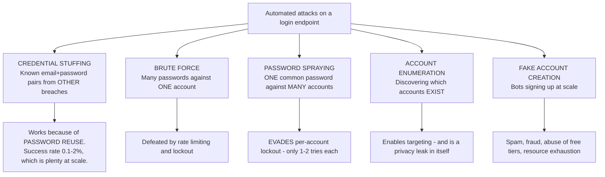
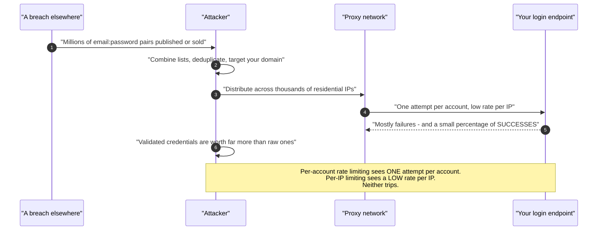
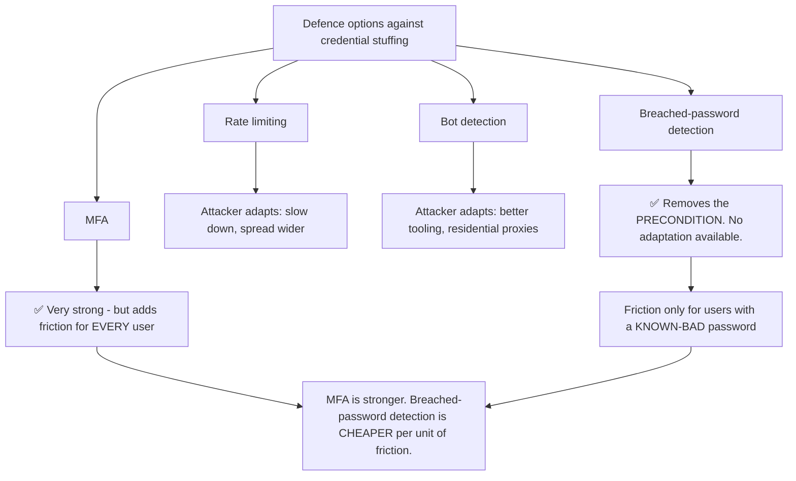
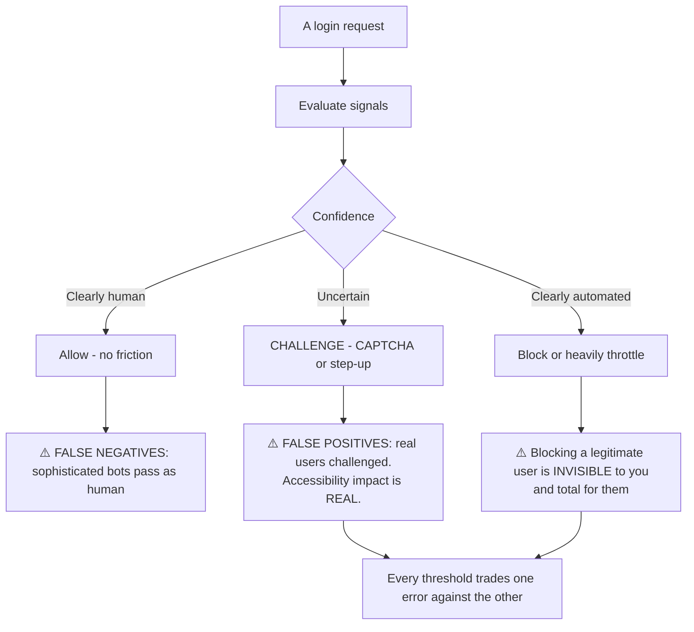
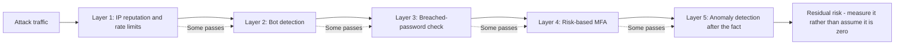
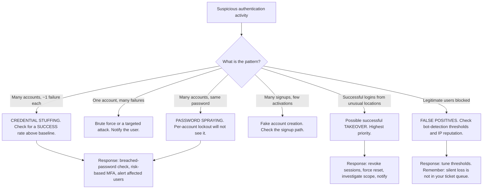

# Part 054 - Account Protection: Credential Stuffing, Bots, Breached Passwords

> Section goal: Understand the automated attacks that hit every consumer-facing login endpoint continuously, why they succeed, and how layered defences work — including the trade-offs that make each defence imperfect. This is a large part of what a CIAM platform actually sells, so having a real opinion here is directly relevant.

Covers index item **054**. Maps to JD signals: *basic security concepts*, *knowledge of authentication and authorization*, *strong analytical and problem-solving skills*, *communicate technical concepts clearly*, and *promote best practices*.

---

## 1. Start From Zero: The Attacks Are Automated and Constant

Any login endpoint on the public internet receives automated attack traffic. Not occasionally — continuously.

| Attack | Shape | Why it works |
|---|---|---|
| **Credential stuffing** | Many accounts, **one** attempt each, using real breached pairs | Password reuse. 0.1–2% success at millions of attempts |
| **Brute force** | One account, many passwords | Weak passwords — largely solved by lockout |
| **Password spraying** | Many accounts, one common password | **Evades per-account lockout entirely** |
| **Enumeration** | Probing which accounts exist | Different responses for existing vs non-existing |
| **Fake accounts** | Automated signup | Free-tier abuse, spam, fraud staging |

> **Analogy.** Credential stuffing is trying stolen keys from one building on the doors of every other building in the city, on the assumption that people cut duplicates. Most fail. Enough succeed.
>
> **Where it stops:** a physical attacker is limited by walking speed. An automated one tries millions of doors an hour from thousands of addresses, which is why per-account defences alone do not work.

---

## 2. Credential Stuffing in Depth

The dominant attack, and the one most worth understanding properly.

**Why traditional defences miss it, stated precisely:**

| Defence | Why it fails here |
|---|---|
| Per-account lockout | Only one attempt per account — nothing to lock |
| Per-IP rate limiting | Traffic is spread across thousands of residential IPs |
| CAPTCHA on failure | Most attempts *are* the first attempt |
| Password complexity | The passwords are **correct** — they came from a real breach |

**The last row is the essential point.** Credential stuffing is not guessing. The credentials are valid somewhere. Strengthening your own password policy does nothing about a password the user already reused on a site that was breached two years ago.

### 🔍 Plain-English deep-dive: why breached-password detection is the highest-leverage defence

If you can only add one control, this is the one, and the reasoning is worth being able to give.

**What it does:** at signup, at password change, and at login, check the password against a corpus of credentials known to have appeared in breaches. If it matches, refuse it or force a change.

**Why it targets the root cause rather than the symptom:** every other defence tries to detect the *attack pattern* — rate, distribution, behaviour — and attackers adapt those. Breached-password detection removes the **precondition**: if the password is not in the breach corpus, the stuffing attempt cannot succeed regardless of how well it is distributed.

**The k-anonymity mechanism, which is what makes this deployable:** you do not send the password anywhere. The standard approach hashes the password, sends the **first five characters of the hash**, and receives back all hashes sharing that prefix. The comparison happens locally. The service never learns the password or which specific hash you were checking.

**Being able to explain that matters in support**, because the first objection is always *"we're not sending our users' passwords to a third party"* — and the answer is that you are not, and here is the mechanism. That converts an objection into a design detail.

**The honest limits:**

| Limit | Detail |
|---|---|
| Only covers **known** breaches | A password from an unpublished breach is invisible |
| No help against **targeted** attacks | Guessing one specific person's password is a different problem |
| Creates a friction moment | The rejection message needs care — "this password appeared in a data breach" is alarming without explanation |
| Corpus freshness matters | An old corpus misses recent breaches |

**The wording of that rejection is a genuine product decision.** Users often assume *your* service was breached. Something like *"This password has appeared in a public data breach elsewhere, so it isn't safe to use here"* is accurate, non-alarming, and educational — and it is the sort of detail that distinguishes a thoughtful implementation.

**Analogy:** rather than watching every door for suspicious behaviour, checking whether the key someone is using is one of the millions known to have been copied. **Where it stops:** a locksmith could check every key ever cut. The breach corpus only contains what has been published, which is why this is a strong layer and not a complete answer.

---

## 3. Account Enumeration

Discovering which accounts exist — often dismissed, and it is the reconnaissance that makes everything else efficient.

| Leak point | The tell |
|---|---|
| **Login** | "Wrong password" versus "No such user" |
| **Signup** | "That email is already registered" |
| **Password reset** | "We sent an email" versus "No account found" |
| **Timing** | A real account takes longer — the password is actually hashed |
| **Response size** | Subtle differences in the response body |

**The tension is real and should be acknowledged:** the *usable* messages are the ones that leak. "That email is already registered" is genuinely helpful; so is "no account found" on a reset. Removing them costs usability.

**The standard resolution:**

| Surface | Approach |
|---|---|
| Login | One generic message for both cases |
| Password reset | Always say "if an account exists, we've sent an email" |
| Signup | Send an email to the address rather than revealing status in the response |
| Timing | Perform equivalent work in both branches |

**That last row is the one implementations miss.** If a non-existent account returns in 5 ms and a real one in 200 ms because a password hash was computed, the messages being identical does not matter. Enumeration by timing is straightforward to automate.

### 🔍 Plain-English deep-dive: how much enumeration protection is worth the usability cost

Enumeration defences are frequently applied uniformly, and that is usually the wrong call. The right amount depends entirely on **what knowing an account exists actually reveals**.

| Service | What "this person has an account" discloses | Protection warranted |
|---|---|---|
| A dating site | Relationship status, orientation | 🔴 **Maximum** |
| A health or addiction service | A medical condition | 🔴 **Maximum** |
| A job board | Actively job-hunting — employment risk | 🔴 High |
| A retail store | Very little | 🟡 Moderate |
| An internal corporate tool | Everyone in the company has one | 🟢 Low — the directory is already known |

**The trade is genuine on both sides.** "That email is already registered" is legitimately helpful — without it, a user who forgot they signed up hits a confusing failure. "No account found" on a reset stops someone waiting for an email that will never arrive. Removing those messages costs real usability and generates real support tickets.

**The resolution that keeps both:** move the disclosure into the **email channel** rather than the HTTP response.

| Situation | Response says | Email says |
|---|---|---|
| Signup, address already registered | "Check your email to continue" | "You already have an account — here's a sign-in link" |
| Reset, no such account | "If an account exists, we've sent instructions" | *(nothing sent)* |
| Reset, account exists | "If an account exists, we've sent instructions" | The reset link |

**The user gets the helpful information; an enumerating attacker gets nothing**, because they do not control the mailbox. This is a genuinely good pattern and it is worth being able to describe, because it dissolves an argument that otherwise stalls between security and product.

**The honest caveat:** it does not survive an attacker who *does* control the address — but at that point they are the account owner for practical purposes, and enumeration is no longer the concern.

**And the internal-tool row deserves emphasis** because it prevents wasted effort. Hardening enumeration on a corporate application where the entire employee directory is already discoverable is friction with no benefit. **Knowing when *not* to apply a control is as useful as knowing how.**

**Analogy:** a doctor's receptionist who will not confirm whether someone is a patient, versus a hardware shop that will happily say you have a loyalty card. Same behavior, wildly different appropriateness. **Where it stops:** a receptionist applies judgement per caller. Software applies one rule to everyone, which is why the rule has to be chosen against the actual disclosure risk.

---

## 4. Bot Detection

Distinguishing automated traffic from humans.

| Signal | What it detects |
|---|---|
| **Request rate and pattern** | Non-human timing and regularity |
| **Browser fingerprint** | Headless browsers, automation frameworks |
| **Behavioural** | Mouse movement, typing cadence, focus events |
| **IP reputation** | Hosting ranges, known proxies, prior abuse |
| **CAPTCHA** | Explicit challenge |
| **Proof of work** | Computational cost per attempt |

**The point of that diagram is the asymmetry of the errors.** A false negative is one attacker attempt among millions. A false positive is a real customer who cannot log in, will not necessarily contact support, and may simply leave. **Bot detection tuned purely to minimise false negatives produces silent, unmeasured customer loss** — and the customers most affected are often those using assistive technology, older browsers, or privacy tooling.

### 🔍 Plain-English deep-dive: "legitimate users are being blocked" is a data problem, not an argument

This conversation happens constantly and usually goes badly, because both sides are reasoning from anecdote. Security points at blocked attacks; product points at a complaining customer; neither has a number.

**The reframe that makes it tractable:** false positives are **measurable**, and most teams have simply never measured them.

| Measurement | What it reveals |
|---|---|
| Challenge rate by **browser** | An outlier browser is a fingerprinting gap, not a bot population |
| Challenge rate by **region** | A spike in one country usually means IP reputation, not attackers |
| Challenge rate by **device class** | Older devices failing behavioural checks |
| **Challenge-to-completion** rate | Users who were challenged and gave up — the closest thing to a lost-customer count |
| Challenge rate for **already-authenticated** users | These are almost certainly legitimate. Any challenge here is a false positive |

**That last row is the sharpest instrument available**, and it is usually free to compute. A user with an established session and a login history is overwhelmingly likely to be real. If they are being challenged at a meaningful rate, the threshold is wrong — and that is a fact rather than an opinion.

**The support conversation this enables:**

> *"Before changing the threshold, can we look at the challenge rate for users who already have an established session and a login history? Those are almost certainly legitimate, so anything above a very low rate there is a false positive we can count. That gives us a number to trade against the attacks being blocked, instead of one complaining customer against one blocked attack."*

**Why this is good support work:** it does not take a side. It converts an argument neither party can win into a measurement both can act on — and it usually reveals that the threshold can be relaxed for known-good users specifically, without relaxing it for anonymous traffic. **That is a better outcome than either original position.**

**A related point worth raising:** a challenge is not the only response. Allow, challenge, and block are three options, and moving a marginal population from *block* to *challenge* preserves the security intent while giving legitimate users a path through. Blocking should be reserved for high confidence, precisely because it is invisible and total.

**Analogy:** a shop that stops shoplifters and also stops some paying customers at the door. The stopped shoplifters are counted; the customers who left are not, so the policy always looks successful. **Where it stops:** a shop can count footfall against sales. Online, a user who abandons a login leaves almost no trace — which is exactly why the challenge-to-completion rate has to be instrumented deliberately.

---

## 5. Layered Defence

No single control is sufficient. The layers compose.

| Layer | Stops | Cost |
|---|---|---|
| **Breached-password detection** | Credential stuffing at the root | Low friction, targeted |
| **Rate limiting (per account and per IP)** | Brute force, crude automation | Low |
| **Bot detection** | Automated traffic broadly | Medium — false positives |
| **MFA** | Almost everything credential-based | High friction, high value |
| **Adaptive/risk-based** | Concentrates friction on risk | Medium — unpredictability (Part 049) |
| **Anomaly alerting** | Detects what got through | None to the user |
| **Passkeys** | Removes the credential entirely | Migration cost (Part 050) |

**The strategic answer, and it is worth saying plainly:** every layer above is mitigation for a problem passwords create. **Passkeys remove the credential**, so there is nothing to stuff. The layers remain necessary during migration and for accounts that keep passwords — but they are a treatment, and the cure exists (Part 050).

---

## 6. Failure Modes

| Failure mode | What it looks like | Consequence | Correction |
|---|---|---|---|
| **Relying on password complexity** | Strict rules | 🔴 No effect on stuffing — the passwords are correct | Breached-password detection |
| **Per-account lockout only** | Classic control | 🔴 Spraying and stuffing evade it | Add cross-account signals |
| **Per-IP limiting only** | Reasonable-looking | 🔴 Residential proxies evade it | Combine signals |
| **Enumeration via messages** | Helpful errors | Reconnaissance enabled | Generic messages |
| **Enumeration via timing** | Messages fixed, timing not | Still enumerable | Equivalent work both branches |
| **CAPTCHA everywhere** | Blunt | Conversion loss; accessibility harm | Risk-based challenge |
| **Bot detection tuned only for recall** | Few attacks pass | 🔴 **Silent legitimate-user loss** | Measure false positives |
| **No alerting on success anomalies** | Only failures watched | Successful takeover unnoticed | Alert on unusual success patterns |
| **Alarming breach-rejection wording** | "Your password was breached" | Users think *you* were breached | Careful, educational wording |
| **Lockout with no recovery** | Attacker locks out real users | 🔴 **Denial of service on users** | Recovery path; avoid hard lockout |
| **Stale breach corpus** | Checked once at signup | Misses later breaches | Check at login too; refresh the corpus |
| **Treating this as solved by MFA alone** | MFA enabled | Fatigue and relay remain (Part 049) | Layer, and move to passkeys |

---

## 7. Troubleshooting Decision Tree: Attack Symptoms

### Worked example

*"We're seeing a spike in failed logins. Should we be worried?"*

1. **Reframe the question immediately.** Failed logins are constant background noise. **The number that matters is the success rate**, because credential stuffing looks like failures and *is* the successes.
2. **Ask for the shape**, since that identifies the attack: are failures spread across many accounts with roughly one attempt each, or concentrated on a few?
3. **Answer:** spread widely, one attempt per account. **That is credential stuffing, confidently.**
4. **Now the real question.** What is the success rate during the spike compared to baseline? If it is elevated, accounts are being compromised **right now**.
5. **If elevated — immediate actions:** enable or tighten breached-password detection, require MFA for logins matching the risk pattern, and identify successful logins within the attack window for review.
6. **Then the affected users:** force a password reset for accounts that succeeded during the window, revoke their sessions, and notify them. **Say plainly that the password was compromised elsewhere, not here** — otherwise the customer's users assume this service was breached.
7. **Prevention:** breached-password detection at signup, change, **and login**; risk-based MFA; and a longer-term conversation about passkeys.
8. **Set the expectation correctly**, because this is where customers get discouraged: the attack traffic will not stop. It is not targeted at them specifically — every public login endpoint receives it. **The goal is a success rate at baseline, not zero failed logins.**

---

## 8. Lab: Defences in Practice

**Purpose.** Observe attack signatures, enable each defence, and measure both what it stops and what it costs.

**Prerequisites.** Parts 049–053 artifacts. A free Auth0 tenant with attack protection features and a test application.

**Steps.**

1. Create `okta-prep/labs/054-account-protection/`.
2. **Baseline the logs.** Review your tenant's log event types for authentication failures (Part 107). **Build a table of the codes that distinguish wrong password, no such user, blocked, and rate-limited.**
3. **Enumeration audit.** Attempt login with a non-existent account and an existing one with a wrong password. **Compare: the error message, the HTTP status, the response body size, and the response time.** Record all four. Do the same for password reset and signup.
4. **Then quantify the timing leak.** Run each case twenty times and record the mean. **If there is a consistent difference, that is enumeration by timing** — measured, not theorised.
5. **Rate limiting.** Attempt repeated logins against one account and record when limiting engages, what error is returned, and how long it lasts.
6. **Then defeat it, legitimately.** Attempt one login each against twenty different synthetic accounts. **Confirm per-account limiting does not trigger.** This is the spraying and stuffing evasion, demonstrated in your own tenant.
7. **Breached-password detection.** Enable it. Attempt to set a password known to be in public breach corpora — use a famously common one, never a real credential. **Record the exact message the user sees** and assess it: would a user think *this* service was breached?
8. **Rewrite the message.** Draft better wording and note why it is better.
9. **The k-anonymity mechanism.** Read the vendor documentation on how the check is performed. **Write two sentences you could say to a customer worried about sending passwords to a third party.**
10. **Bot detection.** Enable it. Log in normally and confirm no friction. Then attempt an automated login with a scripted HTTP client. **Record whether it is detected and what is returned.**
11. **Measure the cost.** Log in from a private window, a different browser, and — if you can — a VPN exit. **Record whether any of these triggered a challenge.** Each one is a proxy for a legitimate user who would have been challenged.
12. **Risk-based MFA.** Enable it and log in from an unusual location. Record the challenge and **check what the tenant log shows** about why risk was raised.
13. **Anomaly alerting.** Configure or locate alerting for unusual **success** patterns, not just failures. **Write one sentence on why success-rate monitoring matters more than failure counts.**
14. **Write the customer brief.** `account-protection-brief.md` — one page: the five attack types, the layered defences, what each costs, and the "success rate, not failure count" framing.
15. **Failure catalog + manifest.** Complete `MANIFEST.md`.

**Expected evidence.** A log event-code table, a four-dimension enumeration audit with timing measurements, rate-limiting behavior recorded, a demonstrated cross-account evasion, breached-password detection with the original and improved message, a k-anonymity explanation in customer language, bot detection tested both ways, three false-positive proxies recorded, risk-based MFA with log evidence, a success-rate monitoring note, and a one-page brief.

**Validation rubric.**

| Check | Pass condition |
|---|---|
| Event codes | Distinguishing codes tabulated |
| Enumeration audit | Message, status, size, **and timing** compared |
| Timing quantified | Twenty runs each, means recorded |
| Rate limiting | Threshold and behavior recorded |
| Evasion | Cross-account attempts do not trigger it |
| Breached password | Message recorded and improved |
| k-anonymity | Two customer-ready sentences |
| Bot detection | Tested with a script and with a browser |
| False-positive proxies | Three scenarios recorded |
| Success-rate note | Written rationale |

**Cleanup and privacy.** Lab tenant, synthetic users only. **Never test attack techniques against any system you do not own** — including your employer's, a customer's, or any public service. Use only well-known example passwords, never a real credential from any source. Delete synthetic accounts and restore attack-protection settings at the end.

---

## 9. JD Mapping

| Supplied JD signal | How this Part supports it |
|---|---|
| **Basic security concepts** | The five attack types and layered defence |
| Knowledge of authentication and authorization | Where each control sits in the login path |
| **Strong analytical and problem-solving skills** | Attack-shape identification from log patterns |
| **Communicate technical concepts clearly** | k-anonymity in two sentences; the breach-message wording |
| **Promote best practices** | Success-rate monitoring; measuring false positives |
| Exceed expectations on response quality | Setting realistic expectations about attack traffic |
| Customer-obsessed attitude | Treating silent legitimate-user loss as a real cost |

---

## 10. Candidate Honesty Note

- **Claim safety:** *Learned architecture and lab experience.* You have configured these controls in a lab; you have not defended a production login endpoint under attack.
- **The strongest thing you can say:** *"Credential stuffing isn't guessing — the passwords are correct, from a breach somewhere else. That's why password complexity rules do nothing about it, and why per-account lockout doesn't see it: the attacker makes one attempt per account across thousands of residential IPs, so neither per-account nor per-IP limiting trips."*
- **A second point, and it is the highest-leverage advice:** *"Breached-password detection is the one control that removes the precondition rather than trying to detect the pattern. Rate limiting and bot detection can be adapted around; if the password isn't in the breach corpus, the stuffing attempt can't succeed no matter how well distributed it is. And the k-anonymity mechanism means you never send the password — a hash prefix goes out, the comparison happens locally — which is worth being able to explain, because that's always the first objection."*
- **A third, on framing the metric:** *"Failed logins are constant background noise on any public endpoint. The number that matters is the success rate, because credential stuffing looks like failures and *is* the successes. 'We're seeing a spike in failures' is the wrong alarm; 'our success rate is above baseline' is the right one."*
- **A fourth, and it is the cost people skip:** *"Bot detection tuned only to catch attacks produces silent customer loss. A false negative is one attempt among millions; a false positive is a real customer who can't log in, probably doesn't contact support, and may just leave — and it disproportionately affects people using assistive technology, older browsers, or privacy tools. That loss isn't in your ticket queue, so it has to be measured deliberately."*
- **A fifth, on expectation-setting:** *"The attack traffic won't stop and it isn't personal — every public login endpoint gets it. The goal is a success rate at baseline, not zero failed logins. Saying that early prevents a lot of discouragement."*
- **A sixth, strategically:** *"All of this is mitigation for a problem passwords create. Passkeys remove the credential, so there's nothing to stuff. The layers matter during migration and for accounts that keep passwords, but it's worth naming the cure alongside the treatment."*
- **Do not overstate:** you have not run incident response for an account-takeover campaign. Say the attack shapes and defences are clear and the incident experience is what the role would add.

---

## 11. Official Source Anchors

Accessed **26 August 2026**.

| Source | What it defines |
|---|---|
| OWASP — Credential Stuffing Prevention cheat sheet | The attack and the layered defences |
| OWASP — Authentication cheat sheet | Enumeration, generic messages, and timing |
| NIST SP 800-63B §5.1.1 | Breached-password checking, and **against** composition rules and forced rotation |
| Have I Been Pwned — Pwned Passwords API | The k-anonymity range-query mechanism |
| Auth0 documentation — Attack Protection | Breached-password detection, brute-force protection, bot detection |
| Okta documentation — ThreatInsight and behaviour detection | Okta's account-protection surface |
| IETF RFC 6749 §10 | OAuth security considerations |
| CISA and NCSC guidance on password policy | Public-sector positions on complexity and rotation |

**Revalidate after 26 August 2026:** attack techniques and vendor features both move. Recheck vendor attack-protection documentation and NIST SP 800-63 revisions before an interview.

---

## ⭐ Likely Interview Questions for This Section

### Q1. "What is credential stuffing and why is it hard to stop?"
> *Model answer:* "Taking email and password pairs from a breach elsewhere and trying them against your service, because people reuse passwords. Success rates are around 0.1 to 2 percent, which is plenty at millions of attempts. It's hard to stop because the traditional defences don't see it: per-account lockout only sees one attempt per account, so there's nothing to lock; per-IP rate limiting sees a low rate because the traffic is spread across thousands of residential proxies; and password complexity rules are irrelevant because the passwords are *correct* — they came from a real breach. It's not guessing. That last point is the one that reframes the conversation, because customers instinctively reach for stronger password policies and those do nothing here."

### Q2. "What's the single most effective defence?"
> *Model answer:* "Breached-password detection, because it removes the precondition rather than trying to detect the pattern. Rate limiting and bot detection are pattern-based, and attackers adapt — slow down, spread wider, better tooling. If the password isn't in the breach corpus, the stuffing attempt can't succeed regardless of how well distributed it is. And the friction is targeted: only users with a known-compromised password are affected, unlike MFA which adds friction for everyone. MFA is stronger in absolute terms; breached-password detection is cheaper per unit of friction, which is why I'd lead with it. The mechanism matters too — you never send the password, just a hash prefix, and the comparison happens locally. That's usually the first objection and it's answerable in one sentence."

### Q3. "A customer reports a spike in failed logins. What do you tell them?"
> *Model answer:* "That failed logins are constant background noise on any public endpoint, and the number that actually matters is the success rate — because credential stuffing looks like failures and *is* the successes. So my first question is about shape: are the failures spread across many accounts with roughly one attempt each, or concentrated on a few? Spread widely means stuffing; concentrated means a targeted attack on one account. Then the real question: what's the success rate during the spike versus baseline? If it's elevated, accounts are being compromised right now and that's an incident — force resets on accounts that succeeded in the window, revoke sessions, notify the users. And I'd set the expectation clearly: the traffic won't stop and it isn't targeted at them specifically. The goal is a success rate at baseline, not zero failures."

### Q4. "What's account enumeration and does it matter?"
> *Model answer:* "Discovering which accounts exist on a service, usually through different responses for existing versus non-existing accounts — 'wrong password' versus 'no such user', or a reset flow saying 'no account found'. It matters for two reasons: it makes every other attack more efficient by letting an attacker target only real accounts, and knowing that a specific person has an account on a particular service is itself a privacy leak — that's meaningful for a dating site, a health service, or a job board. The fixes are generic messages everywhere and 'if an account exists, we've sent an email' on reset. The one implementations miss is timing: if a real account takes 200 milliseconds because a password hash is computed and a fake one returns in 5, identical messages don't help. You have to do equivalent work in both branches."

### Q5. "What's the cost of bot detection?"
> *Model answer:* "False positives, and they're invisible to you, which is what makes them dangerous. A false negative is one attacker attempt among millions — negligible. A false positive is a real customer who can't log in, probably doesn't contact support, and may just leave. And it disproportionately affects people using assistive technology, older browsers, VPNs, or privacy-focused browsers with fingerprinting protection — so it's an accessibility and inclusion problem, not just a conversion one. The failure mode I'd warn about is tuning purely to minimise attacks getting through, because that optimises the error you can measure against the one you can't. So I'd advise measuring the false-positive rate deliberately — challenge rates by browser, by region, by device class — and treating a rising challenge rate for legitimate traffic as a real regression."

### Q6. "How would you explain breached-password detection to a privacy-concerned customer?"
> *Model answer:* "By explaining the mechanism, because the concern is entirely reasonable if you assume the password is being sent somewhere. It isn't. The password is hashed locally, and only the first five characters of that hash go to the service. It returns every hash it knows that starts with those five characters — usually several hundred — and the comparison happens on your side. So the service never learns the password, and it can't even tell which of the hundreds of hashes you were checking. That's called k-anonymity. I'd add that the same technique can be run entirely self-hosted if they'd rather not make an external call at all, which usually settles it. What matters is having the mechanism ready, because 'it's fine, it's secure' doesn't answer the objection and 'here's exactly what leaves your system' does."

### Q7. "Why doesn't per-account lockout stop password spraying?"
> *Model answer:* "Because spraying inverts the shape of the attack. Brute force is many passwords against one account, which lockout is designed for — five failures and it locks. Spraying is one common password against many accounts, so each account sees a single failed attempt and never approaches the threshold. From the account's perspective nothing unusual happened. Detecting it needs cross-account correlation: many accounts failing with the same password, or a burst of single failures across a wide range of accounts in a short window. That's a tenant-level signal, not an account-level one. It's a good illustration of why layered defence isn't just belt-and-braces — the layers see genuinely different things, and a control that's excellent against one attack shape can be completely blind to another."

### Q8. "Where do passkeys fit in this picture?"
> *Model answer:* "They make most of it unnecessary, and I think that's worth saying plainly rather than only presenting the mitigations. Every control we've discussed — breached-password detection, rate limiting, bot detection, risk-based MFA — is treatment for problems that exist because passwords are shared secrets that get reused and breached. A passkey isn't a shared secret: there's nothing to stuff, nothing to spray, and nothing in a breach corpus, because the server only ever held a public key. So the strategic answer to 'how do we stop credential stuffing' is 'stop having credentials.' That said, I wouldn't present it as a reason to skip the other layers — migration takes years, some users will keep passwords, and account recovery is still a soft target. But naming the cure alongside the treatment is more honest than presenting endless mitigation as the only path."

---

## 🧠 30-Second Memory Hooks

- **Five attacks:** stuffing · brute force · **spraying** · enumeration · fake accounts.
- **Stuffing is not guessing.** The passwords are **correct**, from someone else's breach.
- **Password complexity does NOTHING against stuffing.**
- **Per-account lockout misses spraying.** Per-IP limiting misses residential proxies.
- **Breached-password detection removes the PRECONDITION** — no adaptation available.
- **k-anonymity: only a 5-char hash prefix leaves.** Comparison is local.
- **Watch the SUCCESS RATE, not the failure count.**
- **Enumeration leaks via message, status, size, AND TIMING.** Fix all four.
- **Bot detection's cost is SILENT customer loss** — and it hits assistive tech hardest.
- **A false negative is one attempt. A false positive is a lost customer.**
- **Attack traffic never stops and is not personal.** Baseline success rate is the goal.
- **Passkeys remove the credential.** Everything else is treatment.

---

## ✅ Completion Checklist

- [ ] **Knowledge:** I can name the five attacks, explain why lockout misses two of them, and describe k-anonymity in two sentences.
- [ ] **Lab artifact:** `054-account-protection/` contains a timing-quantified enumeration audit, a demonstrated cross-account evasion, an improved breach message, bot detection tested both ways, three false-positive proxies, and a one-page brief.
- [ ] **Spoken:** I can reframe "spike in failed logins" in 30 seconds and answer the privacy objection in 20.
- [ ] **Judgement:** I raise false-positive cost as a real, measurable loss.
- [ ] **Honesty check:** I say "lab configuration," not production incident response.
- [ ] **Source check:** I have read the OWASP Credential Stuffing cheat sheet and NIST SP 800-63B §5.1.1 myself.

---

*Next suggested section:* **[Part 055 - Identity Attacks: Phishing, Token Theft, Session Hijacking, MFA Fatigue](Part-055-identity-attacks-phishing-token-theft-session-hijacking-mfa-fatigue.md)** — the targeted attacks aimed at individuals rather than credential lists, and the defences that actually work against them.
