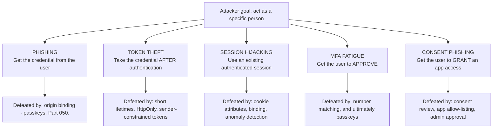
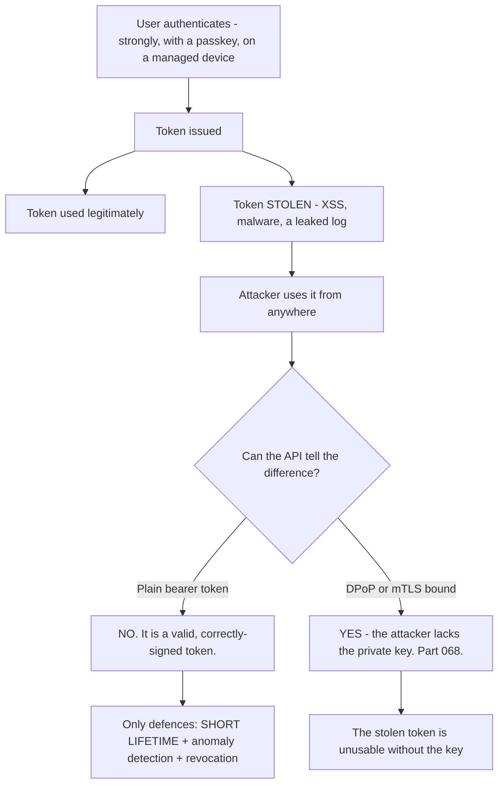
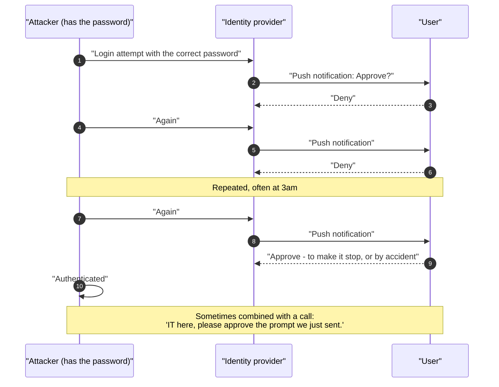
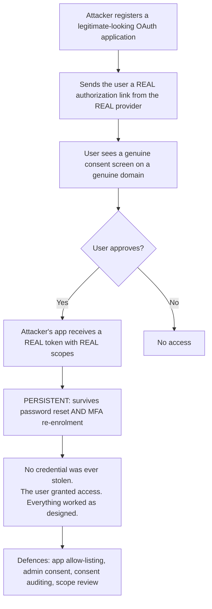
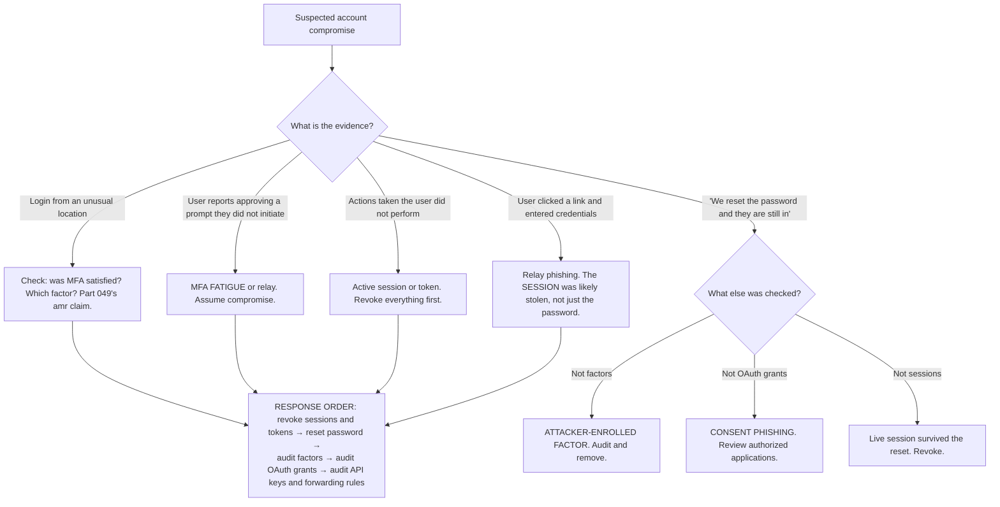

# Part 055 - Identity Attacks: Phishing, Token Theft, Session Hijacking, MFA Fatigue

> Section goal: Understand the attacks aimed at *individual people* rather than credential lists — how each one works, what actually stops it, and how to recognise the traces in logs and evidence. Part 054 covered volume attacks; this Part covers the targeted ones, which are rarer, far more damaging, and where support engineers are often first to see the signal.

Covers index item **055**. Maps to JD signals: *basic security concepts*, *knowledge of authentication and authorization*, *strong analytical and problem-solving skills*, *communicate technical concepts clearly*, and *experience with troubleshooting web applications*.

---

## 1. Start From Zero: The Targeted Attack Landscape

| Attack | Targets | Bypasses MFA? |
|---|---|---|
| **Phishing (real-time relay)** | The credential and the factor | ✅ Yes — for all code-based factors |
| **Token theft** | The token, after authentication | ✅ **Yes — authentication already happened** |
| **Session hijacking** | The session cookie | ✅ Yes |
| **MFA fatigue** | The user's patience | ✅ Yes — the user approves |
| **Consent phishing** | The user's authorization decision | ✅ **Yes — no credential involved at all** |

**The pattern across that column is the point of this Part.** Every one of these bypasses MFA, because none of them attacks the password. They attack the *result* of authentication or the *human* performing it.

> **Analogy.** Volume attacks are trying stolen keys on every door. Targeted attacks are following one person home, borrowing their coat, or persuading them to open the door themselves.
>
> **Where it stops:** a person notices a stranger in their coat. Digital sessions have no such signal — a stolen token behaves identically to a legitimate one, which is why detection has to come from context rather than from the credential.

---

## 2. Phishing and Real-Time Relay

Covered mechanically in Part 049. The essentials:

| Generation | How | Defeated by |
|---|---|---|
| Static fake page | Harvests credentials for later use | MFA |
| **Real-time relay (AitM)** | Proxies the genuine site live, forwards codes, **steals the session cookie** | ✅ **Only origin binding — passkeys** |

**The critical detail people miss:** a relay attack's prize is not the password. It is the **session cookie** issued after successful authentication. The attacker completes a fully legitimate login on the user's behalf and keeps the result. Changing the password afterwards does not invalidate that session (Part 045).

**So incident response for a relay phishing victim is:**

1. **Revoke sessions and refresh tokens** — not just reset the password.
2. Reset the password.
3. **Check for factors enrolled during or after the compromise** — this is the persistence mechanism.
4. Check for new API keys, application authorizations, and mail-forwarding rules.

**Step 3 is the one that gets missed and the one that matters most.** An attacker with a session will enrol their own MFA factor, and then the password reset accomplishes nothing.

### 🔍 Plain-English deep-dive: persistence is the attacker's real objective

Initial access is the part everyone focuses on. From the attacker's perspective it is the *cheap* part — phishing kits are commodity, credential lists are sold in bulk. **What they actually want is access that survives the response.**

That reframing changes what you look for during an investigation:

| Persistence mechanism | Survives a password reset? | Survives MFA re-enrolment? | How it is found |
|---|---|---|---|
| **Attacker-enrolled MFA factor** | ✅ Yes | ❌ No, if *all* factors are removed | Factor list — look for one the user does not recognise |
| **OAuth grant (consent phishing)** | ✅ **Yes** | ✅ **Yes** | Authorized applications list |
| **API key or personal access token** | ✅ **Yes** | ✅ **Yes** | Credential list for that user |
| **Mail-forwarding or inbox rule** | ✅ Yes | ✅ Yes | Mailbox rules — often the quietest of all |
| **Live refresh token** | ⚠️ Sometimes | ⚠️ Sometimes | Session and token list |
| **A second account they created** | ✅ Yes | ✅ Yes | Recent account creations by that user |

**Three of those six survive absolutely everything a standard response does**, which is why "we reset the password" is not a response — it is one step of one.

**The forwarding-rule row deserves attention** because it is genuinely the quietest. An attacker who has read access to a mailbox does not need to keep logging in; a rule that forwards or copies messages gives them ongoing visibility with no authentication events at all, and nothing in the identity system will ever show it.

**The investigative question that finds all of them at once:** *"What changed on this account between the compromise and now?"* Rather than checking each mechanism from a list, look at the account's own change history over the window — factors added, applications authorized, credentials created, rules added, profile fields changed. **Anything the user did not do is a persistence candidate.**

**And the timing detail worth noting:** attackers frequently establish persistence within minutes of initial access, before doing anything else, precisely because they expect to be detected. So the window to examine starts at the *first* suspicious event, not at the point the customer noticed.

**Analogy:** a burglar whose first act is not to take anything but to unlock a back window. Changing the front-door lock afterwards feels decisive and accomplishes nothing. **Where it stops:** a homeowner can walk the perimeter and see an open window. Digital persistence is spread across separate systems with separate interfaces, which is why the change history is more reliable than a checklist.

---

## 3. Token Theft

Stealing a token after authentication has already succeeded.

| Vector | How | Defence |
|---|---|---|
| **XSS reading `localStorage`** | Script exfiltrates the token | `HttpOnly` cookies, BFF, CSP (Part 047) |
| **Malicious dependency** | A compromised npm package reads storage | Supply-chain controls (Part 027) |
| **Malware on the device** | Reads browser storage directly | Device management; sender-constrained tokens |
| **Token in a URL** | Logs, history, `Referer` | Header only (Part 044) |
| **Token in a ticket or chat** | Pasted by a person | Process; local decoding (Part 040) |
| **Insecure transport** | No TLS | HTTPS everywhere |

### 🔍 Plain-English deep-dive: bearer tokens are the structural weakness

> **A bearer token means exactly what it says: whoever bears it may use it.**

There is no binding to a person, a device, or a session. A copied token works identically for the copier. This is why token theft bypasses everything upstream — MFA, passkeys, device checks all happened *before* the token existed.

**The three responses, in order of how much they actually change:**

| Response | Effect |
|---|---|
| **Short lifetimes** | Bounds the damage window. Universally applicable. The default answer |
| **Anomaly detection** | Same token from a new country, a different device fingerprint, an impossible-travel pattern. Detects, does not prevent |
| **Sender-constrained tokens (DPoP, mTLS)** | 🔴→🟢 **Structurally fixes it.** The token is bound to a key the client holds; a copy is useless (Part 068) |

**Why sender-constraining is not yet universal:** it requires client-side key management and server support, so adoption trails. But it is the direction of travel, and knowing that distinguishes someone who has read the current guidance from someone working from a five-year-old model.

**The support-relevant framing:** when a customer asks "how do we stop token theft," the honest answer has two halves. **Prevent the theft** — `HttpOnly` cookies or a BFF, CSP, dependency hygiene, never tokens in URLs or tickets. **Bound the damage** — short lifetimes, rotation, anomaly detection, and sender-constraining if their stack supports it. **Neither half alone is sufficient**, and saying so is more useful than presenting one as the answer.

**Analogy:** a cinema ticket. It does not carry your name, so anyone holding it gets in, and the usher cannot tell. **Where it stops:** a cinema ticket admits you once. A token admits its bearer repeatedly until it expires, which is why the expiry is doing all the work.

---

## 4. Session Hijacking

Taking over an existing authenticated session.

| Vector | Defence |
|---|---|
| **Cookie theft via XSS** | `HttpOnly` (Part 047) |
| **Cookie theft via network** | `Secure` + HTTPS |
| **Session fixation** | Regenerate the session ID on login |
| **CSRF** | `SameSite`, anti-CSRF tokens |
| **Predictable session IDs** | Cryptographically random identifiers |
| **Session not bound to context** | Bind to device or IP range — carefully |

**That last row carries a caution worth stating.** Binding a session to an IP address breaks mobile users constantly — they move between cellular and Wi-Fi, and carrier NAT changes their apparent address. Binding to a coarser signal, such as an ASN or a device fingerprint, is usually the workable compromise. **"Bind the session to the IP" is advice that sounds strong and generates enormous support volume.**

### 🔍 Plain-English deep-dive: a hijacked session is indistinguishable, so detection must come from context

The uncomfortable property of a stolen session or token is that **there is nothing wrong with it**. It is a valid session identifier or a correctly-signed token, presented over TLS, to an endpoint that accepts exactly that. Every check passes because every check is designed to pass for a legitimate holder.

So detection cannot come from the credential. It has to come from **what surrounds** the credential:

| Signal | What a change suggests | False-positive risk |
|---|---|---|
| **Source IP / ASN change mid-session** | Possible transfer | 🔴 High — mobile networks change constantly |
| **User-agent change mid-session** | Strong signal — browsers do not change identity | 🟢 Low |
| **Impossible travel** | Two locations incompatible in the elapsed time | 🟡 Moderate — VPNs |
| **Device fingerprint change** | Different machine | 🟡 Moderate — updates alter fingerprints |
| **Behavioural change** | Different pace, different endpoints | 🟡 Moderate |
| **Concurrent use from two locations** | ✅ **Strong** — one session, two places at once | 🟢 Low |

**The two low-risk rows are the ones worth implementing first**, and they are frequently skipped in favour of IP binding, which is the highest-false-positive option on the list.

**A user-agent change mid-session is particularly good value:** a browser does not change what it claims to be partway through a session. It is cheap to log, cheap to compare, and it fires almost exclusively on genuine transfers — a cookie copied into a different client.

**Concurrent use from two locations is the strongest single signal available** and needs no fingerprinting or behavioural modelling. One session identifier being used from two places within a short window is either a stolen session or a shared account, and both are worth knowing about.

**What to do on detection is a separate decision**, and it should not default to termination:

| Response | When |
|---|---|
| Log and alert only | Moderate confidence; avoid disrupting real users |
| Require step-up (Part 049) | Good middle ground — an attacker cannot satisfy it, a real user can |
| Terminate the session | High confidence only |

**Step-up is the underused option.** It resolves the ambiguity by asking the one question an attacker cannot answer, without punishing a legitimate user who simply changed networks.

**Analogy:** a valid ticket being used at two turnstiles on opposite sides of the stadium within a minute. Nothing is wrong with the ticket; the *pattern* is impossible. **Where it stops:** a stadium can physically compare two people. Online you can only compare context, which is why the low-false-positive signals matter more than the sophisticated ones.

---

## 5. MFA Fatigue and Consent Phishing

Two attacks where the **user performs the harmful action**.

### MFA fatigue

| Defence | Effect |
|---|---|
| **Number matching** | ✅ Approval requires reading the screen — defeats reflexive tapping |
| **Context in the prompt** | Location and application shown — enables an informed refusal |
| **Rate limiting prompts** | Caps the barrage |
| **Alerting on repeated denials** | Turns the user's refusals into a security signal |
| **Passkeys** | ✅ **Nothing to approve** |

**The fourth row is underused and very cheap.** A user denying five prompts in ten minutes is telling you an attack is in progress. Most systems record it and act on none of it.

### Consent phishing

**Consent phishing is the most under-appreciated attack in this list**, and it is worth understanding well:

- **No credential is stolen.** The password is never involved.
- **MFA does not help.** The user authenticated legitimately.
- **Passkeys do not help.** The user was on the real domain.
- **It is persistent.** A password reset does not revoke an OAuth grant.
- **Everything worked exactly as designed.** There is no bug to fix.

**The defences are organisational rather than cryptographic:** restricting which third-party applications may request access, requiring administrator consent for sensitive scopes, auditing existing grants periodically, and making consent screens clear enough that a user can actually evaluate them (Part 052).

**And it explains a support pattern:** *"we reset their password and enabled MFA and the attacker still has access"* — because the attacker has an OAuth grant, not a credential. **Reviewing authorized applications belongs in every takeover response.**

---

## 6. Failure Modes

| Failure mode | What it looks like | Consequence | Correction |
|---|---|---|---|
| **Password reset as the whole response** | Standard reaction | 🔴 Session, tokens, grants and attacker factors all survive | Full response checklist |
| **Not checking enrolled factors** | Reset done, "resolved" | 🔴 **Attacker keeps persistent access** | Audit factors after any compromise |
| **Not reviewing OAuth grants** | Focus on credentials | 🔴 Consent-phishing access persists | Review authorized applications |
| **Trusting MFA to stop phishing** | Code-based factors | 🔴 Real-time relay defeats it | Passkeys |
| **Push without number matching** | Approve/deny only | 🔴 Fatigue attacks | Number matching |
| **Ignoring repeated denials** | Logged, not acted on | Missed live attack signal | Alert on denial bursts |
| **Tokens in `localStorage`** | Common SPA pattern | 🔴 XSS = credential exfiltration | `HttpOnly`, BFF (Part 047) |
| **Long access-token lifetimes** | Fewer refreshes | Large theft window | Short lifetimes |
| **Session bound to IP** | Sounds strong | Mobile users broken constantly | Coarser binding |
| **No anomaly detection on success** | Only failures watched | Takeover unnoticed | Alert on unusual successes |
| **Blaming the user** | "They approved it" | Under-reporting; worse outcomes | Design for the human |
| **No way to report suspicion** | User notices, cannot act | Lost early warning | An obvious reporting path |

---

## 7. Troubleshooting Decision Tree: Suspected Compromise

### Worked example

*"A user was phished. We reset their password and forced MFA re-enrolment. Two days later the attacker was still reading their data."*

1. **Establish what "still reading their data" means.** New logins, or API access with no login? Answer: API access, with no login events.
2. **That distinction is the diagnosis.** No login means no credential is being used — so the password reset was always irrelevant to this access path.
3. **Two candidates: a live refresh token, or an OAuth grant.** Two days exceeds most refresh-token idle windows, so an OAuth grant is more likely.
4. **Check authorized applications** for that user. There is an application authorized during the phishing window, with broad read scopes.
5. **Explain it clearly, and remove the blame**, because the customer's instinct will be that the user did something careless: the attacker did not steal a credential. They sent the user a **genuine** authorization link from the **genuine** provider, the user saw a real consent screen on a real domain, and approved it. Everything worked as designed — the user granted access, and grants survive password resets and MFA changes.
6. **Immediate action:** revoke the grant, revoke all sessions and tokens, and check for other users who authorized the same application. **That last check is essential** — consent phishing is rarely aimed at one person.
7. **Prevention:** restrict which third-party applications may request access, require administrator consent for sensitive scopes, and audit grants periodically.
8. **Update their response runbook.** Reviewing OAuth grants and enrolled factors must be standard steps, not things remembered during an incident. **Offering to help write that runbook is the highest-value part of this ticket.**

---

## 8. Lab: Recognise and Respond

**Purpose.** Produce the log signatures of each attack safely, and build a compromise-response runbook you could hand to a customer.

**Prerequisites.** Parts 044–054 artifacts. A free Auth0 tenant with logging, a test application, and multiple synthetic users.

**Steps.**

1. Create `okta-prep/labs/055-attacks/`.
2. **Build the log reference.** For each event your tenant emits — successful login, failed login, MFA challenge, MFA denial, token exchange, consent granted, factor enrolled — trigger it deliberately and **record the event code and payload shape** (Part 107). This reference is the foundation for everything else.
3. **Token theft, simulated safely.** Obtain a token in one browser and use it from a completely different client — a curl request from another network if possible. **Confirm the API accepts it.** This is the bearer property, demonstrated. **Record what the logs show** — probably nothing unusual, which is the point.
4. **Then add detection.** Log the IP and user-agent alongside token use and flag a change mid-session. Repeat step 3 and confirm the anomaly is now visible.
5. **Session hijacking.** Copy a session cookie from one browser to another. **Confirm the session transfers.** Then set `HttpOnly` and confirm script cannot read it (Part 047).
6. **MFA denial signal.** Deny five MFA prompts in quick succession. **Find the denial events in the log** and write the query that would detect a burst. **This is a free early-warning signal most tenants ignore.**
7. **Consent grant.** Register a second application in your own tenant, authorize it as a synthetic user with broad scopes, and **find the consent event in the log.**
8. **Then simulate the response.** Reset that user's password and re-enrol MFA. **Confirm the second application still has access.** This is the §5 persistence, demonstrated in your own tenant — and it is the most instructive step in the lab.
9. **Revoke the grant** and confirm access ends.
10. **Attacker-enrolled factor.** With an active session, enrol a new MFA factor without step-up (Part 049). Reset the password. **Confirm the new factor persists.** Then enable step-up on enrolment and confirm the path closes.
11. **Build the runbook.** `compromise-response.md` — the ordered response: revoke sessions and tokens, reset the password, audit enrolled factors, audit OAuth grants, audit API keys and forwarding rules, check for other affected users, notify. **Include the specific tenant action for each step.**
12. **Build the detection queries.** For each attack, write the log query that would surface it: unusual-location success, MFA denial bursts, consent grants to unfamiliar applications, factor enrolment shortly after a password change.
13. **Write the user-facing note.** A short, non-blaming message explaining what happened for a consent-phishing victim. **Non-blaming matters** — users who feel blamed stop reporting.
14. **Failure catalog + manifest.** Complete `MANIFEST.md`.

**Expected evidence.** A tenant log event reference, a demonstrated bearer-token transfer with and without detection, a session-cookie transfer and `HttpOnly` fix, an MFA denial burst with a detection query, a consent grant surviving password reset and MFA re-enrolment, an attacker-factor persistence demonstration and fix, an ordered response runbook, four detection queries, and a non-blaming user notification.

**Validation rubric.**

| Check | Pass condition |
|---|---|
| Log reference | Every relevant event code recorded |
| Bearer demonstration | Token works from a different client |
| Detection added | Anomaly visible after instrumentation |
| Session transfer | Reproduced; `HttpOnly` blocks script access |
| Denial burst | Events found; query written |
| Consent persistence | Grant survives reset **and** MFA re-enrolment |
| Factor persistence | Reproduced, then closed with step-up |
| Runbook | Ordered, with specific tenant actions |
| Detection queries | Four written and tested |
| User notification | Accurate and non-blaming |

**Cleanup and privacy.** Lab tenant, synthetic users, applications you own. **Never perform any of these against a system, account, or tenant you do not own** — including your employer's and any customer's. The "token from another client" step must use your own token and your own API. Revoke all grants, delete the second application, remove enrolled factors, and revoke all sessions at the end.

---

## 9. JD Mapping

| Supplied JD signal | How this Part supports it |
|---|---|
| **Basic security concepts** | The targeted attack landscape and what actually stops each |
| Knowledge of authentication and authorization | Why every one of these bypasses MFA |
| **Strong analytical and problem-solving skills** | "Still in after a reset" → three specific candidates |
| **Communicate technical concepts clearly** | Explaining consent phishing without blaming the user |
| Experience troubleshooting web applications | Cookie, token, and session behavior in evidence |
| **Ownership from start to resolution** | Checking for other affected users; writing the runbook |
| Promote best practices | Response ordering; alerting on denial bursts |

---

## 10. Candidate Honesty Note

- **Claim safety:** *Learned architecture and lab experience.* You have reproduced these patterns safely in a lab; you have not run incident response for a real compromise.
- **The strongest thing you can say:** *"Every one of these bypasses MFA, because none of them attacks the password. Phishing relays steal the session after authentication. Token theft takes the credential the authentication produced. Fatigue gets the user to approve. Consent phishing doesn't involve a credential at all. So 'we have MFA' isn't an answer to any of them."*
- **A second point, and it is the most practically valuable:** *"A password reset is not a compromise response. The order is: revoke sessions and refresh tokens first, then reset the password, then audit enrolled MFA factors, then audit OAuth grants, then API keys and mail-forwarding rules. The two that get missed are factors and grants — an attacker enrols their own factor or holds a consent grant, and both survive a password reset completely."*
- **A third, on the least-understood attack:** *"Consent phishing is the one nobody expects. The attacker sends a genuine authorization link from the genuine provider, the user sees a real consent screen on a real domain, and approves. No credential is stolen, MFA doesn't help, passkeys don't help, and the grant survives every credential change. There's no bug — everything worked as designed. The defences are organisational: app allow-listing, admin consent for sensitive scopes, and periodic grant audits."*
- **A fourth, a cheap win most tenants ignore:** *"Repeated MFA denials are a live attack signal. A user denying five prompts in ten minutes is telling you someone has their password. Most systems log that and alert on none of it."*
- **A fifth, on how to communicate:** *"I'd be careful not to frame consent phishing as user error. The user did something entirely reasonable on a legitimate screen. Blaming them means the next person doesn't report it, and early reports are the most valuable thing you get."*
- **A sixth, on caution:** *"'Bind the session to the IP' sounds strong and breaks mobile users constantly — they move between cellular and Wi-Fi and carrier NAT changes their address. A coarser signal like ASN or device fingerprint is the workable version."*
- **Do not overstate:** you have not led a security incident. Say the attack mechanics and the response ordering are clear, and that live incident experience is what the role would add.

---

## 11. Official Source Anchors

Accessed **26 August 2026**.

| Source | What it defines |
|---|---|
| OWASP — Session Management cheat sheet | Hijacking, fixation, and cookie attributes |
| OWASP — Cross-Site Scripting Prevention | The primary token-theft vector in browsers |
| MITRE ATT&CK — Steal Web Session Cookie, Multi-Factor Authentication Request Generation | Documented adversary techniques |
| OAuth 2.0 Security BCP | Token theft, injection, and mitigations |
| IETF RFC 9449 (DPoP) | Sender-constrained tokens (Part 068) |
| CISA guidance on phishing-resistant MFA | Public-sector position on relay attacks |
| Microsoft and Google security blogs on consent phishing | Documented campaigns and defences |
| Auth0 documentation — attack protection and tenant logs | Detection signals available (Part 107) |
| Okta documentation — ThreatInsight and session management | Okta's detection and response surface |

**Revalidate after 26 August 2026:** attacker techniques evolve continuously. Recheck MITRE ATT&CK and vendor security advisories before an interview.

---

## ⭐ Likely Interview Questions for This Section

### Q1. "Why doesn't MFA stop these attacks?"
> *Model answer:* "Because none of them attacks the password, and MFA protects the authentication moment. A real-time relay phish lets the user authenticate genuinely — including MFA — and steals the session cookie that authentication produced. Token theft takes the credential *after* authentication succeeded, so everything upstream already happened. Fatigue attacks get the user to approve, so MFA is satisfied. And consent phishing doesn't involve a credential at all — the user authenticates legitimately on the real site and grants an application access. So 'we have MFA' isn't an answer to any of them. The things that do help are different per attack: origin binding for phishing, short lifetimes and sender-constrained tokens for theft, number matching for fatigue, and organisational controls for consent."

### Q2. "A customer reset a user's password after a phish, but the attacker still has access. Why?"
> *Model answer:* "Three likely reasons, and I'd narrow them by asking whether there are login events. If the attacker is acting with no logins, no credential is in use, so the password was never relevant to that path. The candidates are: a live session or refresh token that survived the reset — revocation is a separate action from a password change; an MFA factor the attacker enrolled while they had a session, which persists and lets them authenticate legitimately; or an OAuth grant from consent phishing, which survives password resets and MFA changes entirely. The two that get missed are factors and grants. That's why the response order matters: revoke sessions and tokens first, then reset, then audit factors, then audit authorized applications."

### Q3. "Explain consent phishing."
> *Model answer:* "The attacker registers an OAuth application with a plausible name and sends the user a genuine authorization link — a real URL at the real identity provider. The user sees an authentic consent screen on an authentic domain and approves it. The attacker's application receives a real token with real scopes. What makes it distinctive is that nothing was compromised: no credential was stolen, MFA was satisfied because the user authenticated legitimately, passkeys don't help because the domain was genuine, and the grant survives every credential change. There's no bug to fix — the system worked exactly as designed. The defences are organisational: restrict which third-party applications may request access, require administrator consent for sensitive scopes, audit existing grants periodically, and make consent screens clear enough that a user can actually evaluate what they're approving."

### Q4. "What's your compromise response checklist?"
> *Model answer:* "Ordered, because the order matters. Revoke sessions and refresh tokens first — that stops active access immediately, whereas a password reset alone leaves everything running. Then reset the password. Then audit enrolled MFA factors and remove anything the user doesn't recognise, because an attacker with a session enrols their own factor and that's their persistence. Then audit OAuth grants and revoke unfamiliar applications. Then API keys, mail-forwarding rules, and any credentials that person had access to. Then check whether other users show the same signal, because consent phishing and stuffing campaigns are rarely aimed at one person. And then notify — accurately and without blame. I'd also want this written down as a runbook beforehand, because these steps get remembered under pressure only if they were written when nobody was panicking."

### Q5. "What is MFA fatigue and what stops it?"
> *Model answer:* "The attacker has the password and repeatedly triggers push notifications until the user approves one — out of confusion, irritation, or because it's 3am and they want it to stop. Sometimes it's paired with a phone call: 'IT here, please approve the prompt we just sent.' It works because approving is a single tap with no context about what's being approved. Number matching is the main defence — the login screen shows a number the user must type into their authenticator, so approval requires actually looking at the session. Showing the location and application requesting access helps too, because it enables an informed refusal. And there's a cheap signal most tenants ignore: repeated denials. A user denying five prompts in ten minutes is telling you someone has their password. Alerting on that is nearly free and it catches the attack while it's happening."

### Q6. "How would you defend against token theft?"
> *Model answer:* "Two halves, and neither alone is sufficient. Prevent the theft: `HttpOnly` cookies or a backend-for-frontend so tokens never reach JavaScript, a strict CSP as the real XSS mitigation, dependency hygiene because a compromised package reads storage just as easily as injected script, never tokens in URLs, and a habit of never pasting them into tickets or third-party tools. Then bound the damage: short access-token lifetimes, refresh rotation with reuse detection, and anomaly detection on token use — the same token suddenly appearing from a different country or device fingerprint. The structural fix is sender-constrained tokens, DPoP or mTLS binding, where the token is bound to a key the client holds so a copy is useless. That's the direction of travel, though adoption trails because it needs client-side key management and server support."

### Q7. "Why is a bearer token a structural weakness?"
> *Model answer:* "Because it means literally what it says: whoever bears it may use it. There's no binding to a person, a device, or a session, so a copied token is indistinguishable from the original to the API — it's a valid, correctly-signed token, and there's nothing to check. That's why token theft bypasses everything upstream: the passkey, the MFA, the device compliance check all happened before the token existed. The only defences available for a plain bearer token are bounding the window with a short lifetime and detecting anomalies after the fact. Sender-constraining changes that structurally — the client proves possession of a private key on each request, so the token alone is worthless. It's a good illustration that strong authentication and strong *authorization transport* are different problems, and solving the first thoroughly doesn't address the second."

### Q8. "A user says they approved a prompt they didn't initiate. What do you do?"
> *Model answer:* "Treat it as a confirmed compromise, not a possible one. If they approved a prompt they didn't start, someone had their password and now has an authenticated session — that's not ambiguous. So I'd run the full response immediately: revoke sessions and refresh tokens, reset the password, audit enrolled factors for anything they don't recognise, audit OAuth grants, and check API keys and forwarding rules. Then investigate scope — what happened during the window between approval and revocation. And I'd handle the human part carefully: this user did the right thing by reporting it, and they may feel foolish. Thanking them plainly matters, because the alternative is that the next person doesn't report it, and a self-reported approval is one of the earliest and most valuable signals you can get."

---

## 🧠 30-Second Memory Hooks

- **All five bypass MFA**, because none attacks the password.
- **Relay phishing steals the SESSION**, not the password. A reset does not help.
- **Bearer token = whoever holds it may use it.** No binding to person or device.
- **Token theft happens AFTER authentication** — passkeys and MFA are already behind it.
- **Sender-constrained tokens (DPoP/mTLS) fix it structurally.** Part 068.
- **Consent phishing:** real link, real screen, real domain, **no credential stolen**, **survives resets**.
- **"We reset the password and they're still in"** = a live session · **an enrolled factor** · **an OAuth grant**.
- **Response ORDER:** revoke sessions/tokens → reset → **audit factors** → **audit grants** → API keys → other users → notify.
- **Repeated MFA denials = a live attack signal.** Almost nobody alerts on it.
- **Number matching defeats fatigue.** Passkeys remove the prompt entirely.
- **"Bind the session to the IP" breaks mobile users.** Use a coarser signal.
- **Never blame the user.** Blame stops reporting, and reports are the early warning.

---

## ✅ Completion Checklist

- [ ] **Knowledge:** I can explain why each attack bypasses MFA and recite the response order unaided.
- [ ] **Lab artifact:** `055-attacks/` contains a log event reference, a bearer-token transfer demonstration, a consent grant surviving reset and re-enrolment, an attacker-factor persistence test, a response runbook, and four detection queries.
- [ ] **Spoken:** I can explain consent phishing in 60 seconds without blaming the user.
- [ ] **Judgement:** I check for other affected users and offer to help write the runbook.
- [ ] **Honesty check:** I say "lab reproduction," not live incident response.
- [ ] **Source check:** I have read the OWASP Session Management cheat sheet and the OAuth Security BCP's token-theft section myself.

---

*Next suggested section:* **[Part 056 - The Problem OAuth Solves, Its Roles, and Its Vocabulary](Part-056-the-problem-oauth-solves-its-roles-and-its-vocabulary.md)** — Group F begins: OAuth 2.0 from first principles, the largest and most interview-critical group in this guide.
