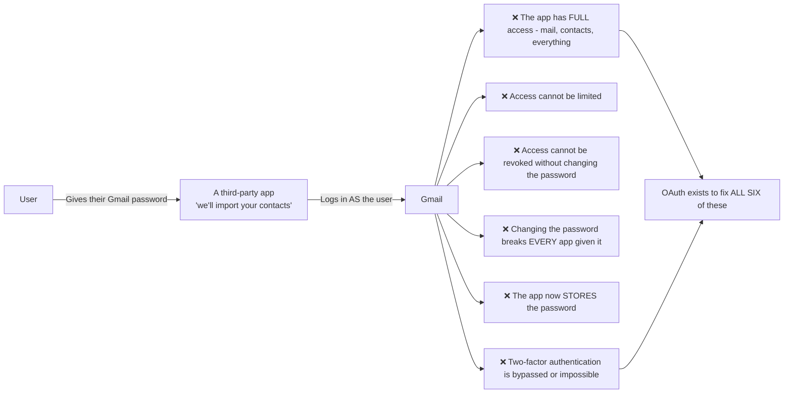
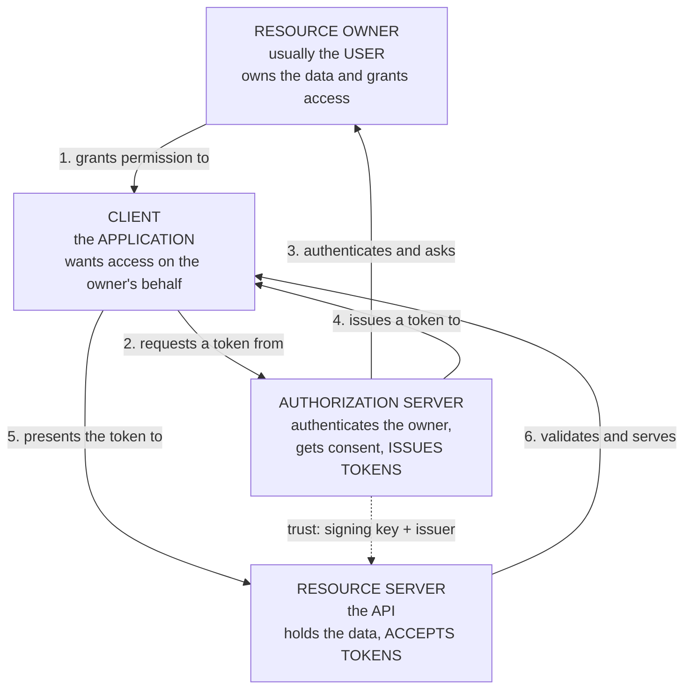
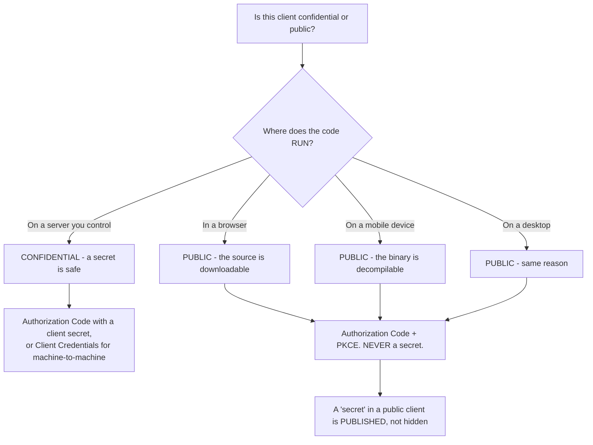
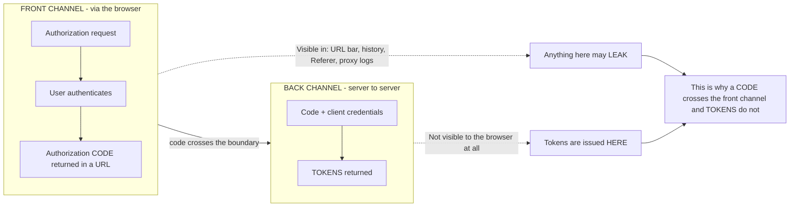
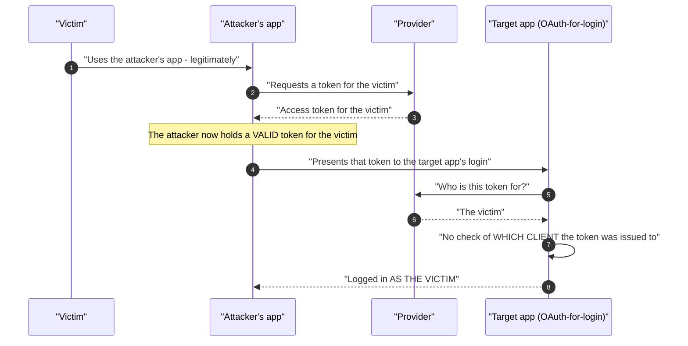
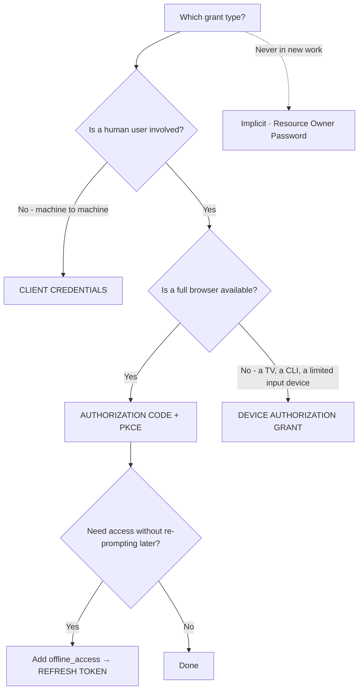
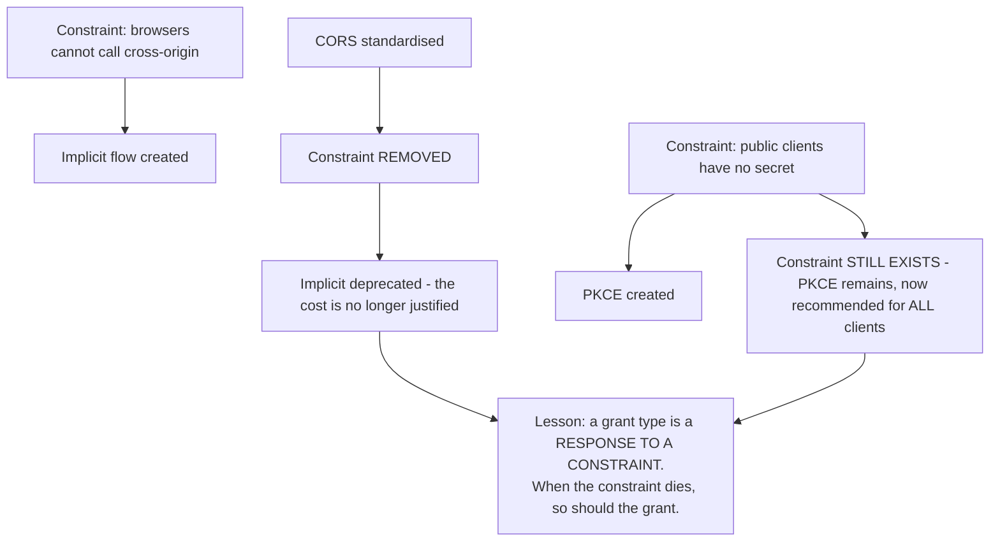
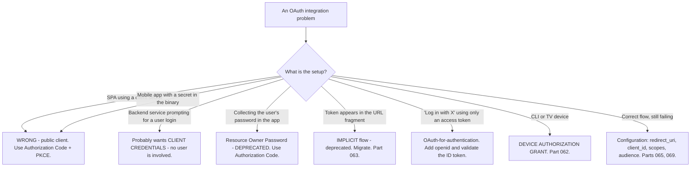

# Part 056 - The Problem OAuth Solves, Its Roles, and Its Vocabulary

> Section goal: Understand what OAuth 2.0 was actually designed for, why the design looks the way it does, and the exact vocabulary you need to hold a precise conversation. Group F is the technical heart of this role — and almost every OAuth misunderstanding traces back to not knowing which problem it solves.

Covers index item **056**. Maps to JD signals: *knowledge of OAuth*, *knowledge of authentication and authorization*, *communicate technical concepts clearly*, *strong analytical and problem-solving skills*, and *basic security concepts*.

---

## 1. Start From Zero: The Password Anti-Pattern

Before OAuth, an application that needed access to your data on another service asked for **your password to that service**.

**OAuth 2.0's one-sentence purpose:**

> **Let an application obtain *limited* access to a resource on a user's behalf, *without* the user giving that application their credentials.**

| Property | Password sharing | OAuth |
|---|---|---|
| Credentials shared | 🔴 Yes | ✅ **No** |
| Scope of access | Everything | **Limited by scopes** |
| Revocable independently | ❌ | ✅ Per application |
| Survives a password change | ❌ Breaks | ✅ Unaffected |
| Works with MFA | ❌ | ✅ |
| Auditable per application | ❌ | ✅ |

> **Analogy.** A hotel valet key. It starts the car and opens the driver's door. It does not open the boot or the glovebox, it can be handed back, and it does not compromise your house key on the same ring.
>
> **Where it stops:** a valet key is a physical object with fixed capabilities. An OAuth grant's capabilities are decided at request time and can be changed or revoked later, which is more flexible — and means the *configuration* is where things go wrong.

---

## 2. The Four Roles

The single most important thing to get right in an OAuth conversation.

| Role | Also called | Is |
|---|---|---|
| **Resource Owner** | The user, the end-user | Whoever can grant access to the data |
| **Client** | The application, the RP | The software wanting access. **Not the browser** |
| **Authorization Server** | AS, IdP, OP, tenant | Issues tokens |
| **Resource Server** | The API, protected resource | Accepts and validates tokens |

### 🔍 Plain-English deep-dive: "client" does not mean what you think

**In OAuth, "client" means the application requesting access.** It does not mean a browser, a front-end, or an end-user device. A server-side backend is a client. A mobile app is a client. A cron job is a client.

**Why this matters practically:** the client type determines which flow is correct and whether a secret can be used, and that determination drives nearly every configuration decision downstream.

| Client type | Can keep a secret? | Examples | Correct flow |
|---|---|---|---|
| **Confidential** | ✅ Yes | Server-side web app, backend service | Authorization Code (+ secret), Client Credentials |
| **Public** | ❌ **No** | SPA, mobile app, desktop app | Authorization Code **+ PKCE** (Part 059) |

**Why a public client cannot keep a secret**, stated concretely: anything shipped to a user's device is readable. A secret in JavaScript is in the page source. A secret in a mobile app is in the binary, which can be decompiled. **It is not "hard to extract" — it is published.**

**The recurring ticket this produces:** a developer building a SPA finds the client-secret field in the tenant configuration, uses it, and it works — because the authorization server accepts it. It also means the secret is in their JavaScript bundle, readable by anyone who opens DevTools. **The correct answer is not "hide it better"; it is that a public client uses PKCE instead of a secret**, and PKCE was designed precisely because no secret is possible.

**A useful diagnostic question:** *"If I opened your app's source or decompiled it, would I find that value?"* If yes, it is not a secret, regardless of what the configuration field is called.

**Analogy:** a "hidden" key under a doormat, printed in a public directory of where people hide their keys. **Where it stops:** a doormat key requires physical presence. A published client secret is retrievable from anywhere by anyone who downloads the app.

---

## 3. The Vocabulary

Precision here prevents most confused conversations.

| Term | Meaning |
|---|---|
| **Grant type** | The method of obtaining a token: `authorization_code`, `client_credentials`, `refresh_token`, `device_code` |
| **Flow** | The sequence of steps for a grant type. Used interchangeably with grant type |
| **Authorization endpoint** | Where the **user** is sent — a browser redirect. Front channel |
| **Token endpoint** | Where the **client** exchanges for tokens — a direct HTTP call. Back channel |
| **Front channel** | Via the browser. Visible in the URL, in history, in logs |
| **Back channel** | Direct server-to-server. Not visible to the browser |
| **Authorization code** | A short-lived, single-use value exchanged for tokens |
| **`state`** | CSRF protection and return-context (Part 048) |
| **`nonce`** | ID token replay protection (Part 065) |
| **PKCE** | Proof Key for Code Exchange — binds the code to the requester (Part 059) |
| **`redirect_uri`** | Where the response is delivered. **Exactly matched** |
| **Consent** | The owner's approval of the requested scopes |

### Front channel versus back channel

**This distinction explains most of OAuth's design.**

**The design follows directly:** the front channel is inherently leaky, so it carries only a short-lived, single-use code that is useless without the back-channel exchange. Tokens — which are long-lived and directly usable — never touch it. Understanding this makes the deprecation of the implicit flow (Part 063) obvious rather than arbitrary.

---

## 4. What OAuth Is Not

Three misconceptions worth correcting precisely.

| Misconception | Reality |
|---|---|
| **"OAuth is for authentication"** | ❌ It is an **authorization** framework. It says nothing about who the user is. **OIDC** adds authentication on top (Part 070) |
| **"OAuth is a protocol"** | ⚠️ It is a **framework** with many options. Two compliant implementations can differ substantially |
| **"OAuth handles the login page"** | ❌ How the authorization server authenticates the user is entirely outside the specification |

### 🔍 Plain-English deep-dive: why using OAuth for login was a real problem

Before OIDC, applications used OAuth for "log in with X", and it was genuinely broken — not stylistically, but in a way that permitted account takeover.

**What OAuth gives you:** an access token. It proves *the client is authorized to call an API*. It proves nothing about **who** the user is, and crucially, nothing about **which client** it was issued to.

**The pattern that failed:** the application obtains an access token, calls the provider's user-info endpoint, receives an ID, and logs the user in as that ID.

**Why that is exploitable — the confused deputy problem:**

**The token was genuine. The user identity was genuine.** The missing check was *audience* — which client the token was issued to (Part 041). The target application accepted a token minted for a completely different client.

**What OIDC added to fix it:**

| Addition | Fixes |
|---|---|
| **ID token** with `aud` = the client ID | The confused-deputy problem — the token is bound to *this* client |
| **`nonce`** | Replay of an ID token obtained elsewhere |
| A **standard** user-info endpoint and claim names | Every provider inventing its own |
| **Discovery** metadata | Hardcoded endpoints |

**The takeaway to carry into every conversation:** *OAuth authorizes; OIDC authenticates.* If a customer says they are "using OAuth for login," the useful question is whether they are requesting the `openid` scope and validating an ID token — because if not, they may have rebuilt this exact vulnerability.

**Analogy:** a delivery driver's authorisation to collect a parcel proves they may collect *that* parcel. It does not prove they are the recipient, and handing them the recipient's house keys because they had a valid collection slip is a different kind of mistake. **Where it stops:** a person would notice the leap. Software makes it silently, because the token verifies successfully.

---

## 5. The Grant Types Map

Part 057 onward covers each. This is the map.

| Grant type | Use when | Part |
|---|---|---|
| **Authorization Code** | A user is present and a browser is available | 058 |
| **+ PKCE** | Always for public clients; recommended for all | 059 |
| **Client Credentials** | No user — machine to machine | 060 |
| **Refresh Token** | Obtaining new tokens without re-prompting | 061 |
| **Device Authorization** | Input-constrained devices — TVs, CLIs | 062 |
| **Implicit** | 🔴 **Deprecated** | 063 |
| **Resource Owner Password** | 🔴 **Deprecated** | 063 |

**Three questions decide it**, and that is genuinely the whole selection process: is there a user, is there a browser, and is long-lived access needed.

### 🔍 Plain-English deep-dive: why there are so many grant types at all

Newcomers reasonably ask why one flow is not enough. The answer is that each grant type exists because a specific **constraint** made the others impossible — and knowing the constraint tells you when the grant is appropriate.

| Grant type | The constraint it answers |
|---|---|
| **Authorization Code** | The user must authenticate **at the authorization server**, not at the client, and tokens must not cross the front channel |
| **PKCE** | A public client has **no secret** to prove it is the party that started the flow |
| **Client Credentials** | There is **no user** — nobody to redirect, authenticate, or ask for consent |
| **Refresh Token** | Access tokens must be short-lived, but users must not be re-prompted every few minutes |
| **Device Authorization** | The device **cannot display a browser or accept text input** |
| Implicit *(deprecated)* | Browsers once could not make cross-origin calls to the token endpoint — **CORS solved this** |
| Resource Owner Password *(deprecated)* | A transitional bridge for applications migrating from password-based login |

**The bottom two rows are the interesting ones**, because they show how a grant type becomes obsolete. Implicit existed for a real reason — before CORS, a browser-based application genuinely could not POST to the token endpoint on another origin, so tokens had to arrive via the redirect. **CORS removed the constraint, and once the constraint was gone the security cost was no longer worth paying** (Part 063).

**Why this framing is useful in support:** when someone is using a deprecated grant, the productive question is *"what constraint led you here?"* rather than *"why are you using that?"* Often the constraint no longer exists — they copied an old tutorial, or migrated a pattern from a system built before CORS. Occasionally the constraint is real and unusual, and then you learn something.

**It also predicts the future**, which is genuinely useful in conversation: sender-constrained tokens (Part 068) exist because bearer tokens have no binding to their holder. That constraint has not been solved, so DPoP and mTLS binding are growing rather than fading.

**Analogy:** tools in a workshop. A hand drill exists because there was no electricity; once there is, keeping it for everyday work is nostalgia rather than engineering. **Where it stops:** an obsolete hand tool is harmless. A deprecated grant type actively leaks tokens, which is why deprecation here is a security position rather than a style preference.

---

## 6. Failure Modes

| Failure mode | What it looks like | Consequence | Correction |
|---|---|---|---|
| **OAuth used for authentication** | Access token → user-info → log in | 🔴 **Confused deputy; account takeover** | Use OIDC; validate an ID token |
| **Client secret in a public client** | Secret in a SPA or mobile binary | 🔴 **Published, not hidden** | PKCE instead |
| **Tokens in the front channel** | Implicit flow | 🔴 Leak via URL, history, `Referer` | Authorization Code |
| **Confusing roles** | "The client is the browser" | Wrong flow chosen | The client is the application |
| **Confusing grant types** | Password grant for a web app | 🔴 Credentials handled by the client | Authorization Code |
| **Treating OAuth as a strict protocol** | Assuming providers match | Portability surprises | Read the provider's metadata |
| **No `state`** | CSRF protection absent | 🔴 Login CSRF (Part 048) | Always send and verify `state` |
| **Loose `redirect_uri` matching** | Wildcards or prefixes | 🔴 Code interception | Exact matching (Part 065) |
| **Reusing an authorization code** | Retried request | Rejected; may revoke the grant | Codes are single-use |
| **Expecting OAuth to define login UX** | "Why can't we style it?" | Misplaced expectation | Branding is a vendor feature (Part 102) |

---

## 7. Troubleshooting Decision Tree: Which Flow Is Wrong?

### Worked example

*"Our React SPA gets a 401 from the token endpoint. We're sending the client ID and secret exactly as documented."*

1. **The word "SPA" plus "secret" is the finding, before looking at the error.** A SPA is a public client; it cannot hold a secret.
2. **Confirm the immediate cause.** Their tenant application is registered as a public client type, so the token endpoint rejects the secret — or expects PKCE and receives none. **The 401 is correct behavior.**
3. **Address the larger issue plainly but without judgement.** If the secret is in their bundle, it is already public. Anyone can open DevTools, find it, and impersonate their application. This is worth saying directly because they may not have realised.
4. **The fix:** Authorization Code with PKCE, no secret. Most SDKs do this by default — which usually means someone deliberately followed a server-side tutorial.
5. **Explain why PKCE replaces the secret**, because otherwise it feels like a downgrade: a secret proves *"I am the registered client"*, and a public client cannot make that claim honestly. PKCE proves *"I am the same party that started this flow"*, which is what actually matters against code interception, and it works without any stored secret.
6. **If the secret has been in a deployed bundle**, recommend rotating it — even though it will no longer be used, it may have been used before.
7. **Give the general rule** so it transfers: *"If I could find that value by reading your source or decompiling your app, it is not a secret."*

---

## 8. Lab: Roles, Channels, and Client Types

**Purpose.** Make the four roles and two channels concrete by observing them, and prove the public-client property to yourself.

**Prerequisites.** Parts 021, 028, 044 artifacts. A free Auth0 tenant, a SPA, and a Node backend.

**Steps.**

1. Create `okta-prep/labs/056-oauth-basics/`.
2. **Map the roles.** For your lab, write down which concrete thing plays each of the four roles. **Do this before configuring anything** — it is harder than it sounds and it is the point.
3. **Register two applications:** one Regular Web Application (confidential) and one Single Page Application (public). **Record what differs in the configuration UI** — particularly whether a secret is issued.
4. **Confidential flow.** Complete an Authorization Code flow with the web app. **Capture a HAR** (Part 021).
5. **Annotate the channels.** In the HAR, mark every request as front channel or back channel. **Identify exactly where the code appears and where the tokens appear.** Confirm tokens never appear in a URL.
6. **Public flow.** Complete an Authorization Code + PKCE flow with the SPA. Capture a HAR and annotate the same way.
7. **Diff the two.** What is present in one and not the other? **Record the PKCE parameters and the absent secret.**
8. **Prove the public-client property.** Build the SPA with a value in the source that looks like a secret. **Then find it in the deployed bundle using only browser DevTools.** Screenshot it. **This is the most persuasive artifact in the lab.**
9. **Attempt the wrong thing.** Send a client secret from the SPA to the token endpoint. **Record the exact error.**
10. **Attempt PKCE from the confidential client.** Record whether it is accepted — it should be, since PKCE is recommended for all client types now (Part 066).
11. **Code reuse.** Capture an authorization code and exchange it twice. **Record the second response** and note whether the grant was revoked.
12. **Front-channel leakage.** Complete a flow and then examine the browser history and any `Referer` headers sent by the callback page. **Record what is visible.**
13. **Vocabulary drill.** Without notes, write definitions for all twelve terms in §3. Check yourself. **Repeat until automatic** — this vocabulary is what interviews test.
14. **Write the explainer.** `oauth-roles.md` — one page with the four roles mapped to concrete examples, the two channels, and the confidential-versus-public rule.
15. **Failure catalog + manifest.** Complete `MANIFEST.md`.

**Expected evidence.** A role map written before configuration, two registered applications with a configuration diff, two annotated HARs, a screenshotted secret extracted from a deployed bundle, a recorded wrong-secret error, code-reuse behavior, front-channel leakage evidence, a completed vocabulary drill, and a one-page explainer.

**Validation rubric.**

| Check | Pass condition |
|---|---|
| Role map | Written before configuring; all four correct |
| Two applications | Configuration differences recorded |
| Channel annotation | Code and token locations identified |
| Flow diff | PKCE parameters and absent secret noted |
| Secret extraction | Found via DevTools and screenshotted |
| Wrong-secret error | Recorded verbatim |
| Code reuse | Second exchange behavior recorded |
| Vocabulary | All twelve terms defined unaided |
| Explainer | One page, roles, channels, client types |

**Cleanup and privacy.** Lab tenant, synthetic users, localhost only. **The "secret" placed in the bundle must be a dummy value**, never a real credential from anywhere. Delete both applications at the end and revoke tokens.

---

## 9. JD Mapping

| Supplied JD signal | How this Part supports it |
|---|---|
| **Knowledge of OAuth** | The purpose, roles, vocabulary, and grant-type map |
| Knowledge of authentication and authorization | The OAuth-versus-OIDC distinction, precisely |
| **Communicate technical concepts clearly** | The valet-key framing; explaining PKCE as a replacement not a downgrade |
| Strong analytical and problem-solving skills | "SPA plus secret" identified before reading the error |
| **Basic security concepts** | Confused deputy; front-channel leakage; public-client reality |
| Promote best practices | The "could I find it in your source?" test |
| Experience troubleshooting web applications | Channel annotation from a HAR |

---

## 10. Candidate Honesty Note

- **Claim safety:** *Learned architecture and lab experience.* Be direct that OAuth is knowledge you have built deliberately for this role.
- **The strongest thing you can say:** *"OAuth exists so an application can get limited access to your data without ever holding your password. That's the whole design goal, and it explains everything else — scoped access, independent revocation, surviving a password change, working with MFA."*
- **A second point, and it is the one that shows you understand rather than memorise:** *"The front-channel/back-channel split explains most of the design. The front channel goes through the browser, so it's visible in URLs, history, `Referer` headers and proxy logs — anything there can leak. So it carries only a short-lived single-use code, and the tokens are issued over the back channel. Once you see that, the deprecation of implicit flow is obvious rather than arbitrary."*
- **A third, which is high-frequency in support:** *"A client secret in a SPA or a mobile app isn't hidden, it's published — it's in the bundle or the decompiled binary. PKCE exists precisely because public clients can't hold a secret. And PKCE isn't a weaker substitute: a secret proves 'I'm the registered client', which a public client can't honestly claim, while PKCE proves 'I'm the same party that started this flow', which is what actually defends against code interception."*
- **A fourth, on the classic distinction:** *"OAuth authorizes; OIDC authenticates. Using a bare access token for login is the confused-deputy problem — the token proves the client may call an API, not who the user is and not which client it was issued to. OIDC's ID token has an `aud` bound to your client ID, which is exactly the missing check."*
- **A fifth, a useful one-line test:** *"If I could find that value by reading your source or decompiling your app, it isn't a secret — regardless of what the configuration field is called."*
- **Do not overstate:** you have not shipped an OAuth integration in production. Say the model is thoroughly clear and you have built the flows in a lab.

---

## 11. Official Source Anchors

Accessed **26 August 2026**.

| Source | What it defines |
|---|---|
| IETF RFC 6749 (The OAuth 2.0 Authorization Framework) | Roles, grant types, endpoints, and the framework nature |
| IETF RFC 6749 §1.1, §2.1 | Role definitions; confidential versus public clients |
| IETF RFC 6750 | Bearer token usage |
| IETF RFC 6819 | OAuth threat model — including confused deputy |
| OAuth 2.0 Security Best Current Practice | Current guidance superseding parts of RFC 6749 |
| OAuth 2.1 draft | The consolidated, hardened profile (Part 066) |
| OpenID Connect Core §1 | The relationship between OIDC and OAuth |
| oauth.net | Accessible reference maintained by the community |
| Auth0 and Okta documentation — application types | Vendor mapping of confidential and public clients |

**Revalidate after 26 August 2026:** RFC 6749 is stable but partly superseded in practice. Check the Security BCP and OAuth 2.1 status, which move.

---

## ⭐ Likely Interview Questions for This Section

### Q1. "What problem does OAuth solve?"
> *Model answer:* "Letting an application get limited access to your data on another service without you giving it your password. Before OAuth, the pattern was handing over your credentials — which meant the app had complete access, you couldn't limit or revoke it independently, changing your password broke every app you'd given it to, the app was now storing your password, and two-factor authentication was bypassed or impossible. OAuth fixes all of that: access is scoped, revocable per application, survives password changes, works with MFA, and is auditable. The valet key analogy is the one I'd use — it starts the car, doesn't open the boot, can be handed back, and doesn't compromise your house key."

### Q2. "What are the four OAuth roles?"
> *Model answer:* "Resource owner — usually the user, whoever can grant access to the data. Client — the application requesting access, and this is the one people get wrong, because 'client' means the application, not the browser or the device. Authorization server — authenticates the owner, gets consent, and issues tokens. Resource server — the API that holds the data and accepts tokens. The client distinction matters practically because client *type* drives everything downstream: a confidential client runs on a server you control and can hold a secret; a public client runs on a user's device, so it can't, and must use PKCE. Choosing that wrong is the root of a lot of tickets."

### Q3. "What's the difference between the front channel and the back channel?"
> *Model answer:* "The front channel goes through the browser — redirects, URL parameters, the address bar. The back channel is a direct server-to-server HTTP call the browser never sees. The distinction drives the whole design, because the front channel is inherently leaky: URLs end up in browser history, in `Referer` headers sent to third-party resources, in proxy and server access logs. So OAuth deliberately sends only a short-lived, single-use authorization code over the front channel — something useless on its own — and the actual tokens are issued over the back channel where the browser can't see them. Once you understand that, the deprecation of the implicit flow follows immediately: it put tokens directly in the front channel, which is exactly what the design was avoiding."

### Q4. "Why can't a SPA use a client secret?"
> *Model answer:* "Because anything shipped to a user's device is readable. A secret in JavaScript is in the downloadable bundle; a secret in a mobile app is in the binary, which can be decompiled. It isn't hard to extract — it's published. The test I'd use is: if I could find that value by reading your source or decompiling your app, it isn't a secret regardless of what the config field is called. So public clients use PKCE instead, and I'd frame that as a replacement rather than a downgrade — a secret proves 'I'm the registered client,' which a public client can't honestly claim, whereas PKCE proves 'I'm the same party that started this flow.' That's the property that actually defends against an intercepted authorization code, which is the real threat."

### Q5. "Why is OAuth not an authentication protocol?"
> *Model answer:* "Because an access token proves that a client is authorized to call an API — it says nothing about who the user is, and crucially nothing about which client it was issued to. The pattern that failed was: get an access token, call the provider's user-info endpoint, get an ID back, log the user in as that ID. That's exploitable, because an attacker running their own app can obtain a valid token for a victim who uses that app, then present it to a target application, which asks 'who is this token for?', gets the victim's identity, and logs them in as the victim. The token and the identity are both genuine — the missing check is audience. OIDC fixes it with an ID token whose `aud` is your client ID, plus a `nonce` for replay, standard claims, and discovery. The short version I'd carry into any conversation is: OAuth authorizes, OIDC authenticates."

### Q6. "How do you choose a grant type?"
> *Model answer:* "Three questions. Is a human user involved? If not, it's client credentials — a machine authenticating as itself. If yes, is a full browser available? If yes, it's authorization code with PKCE, always. If not — a TV, a CLI, a smart device with no keyboard — it's the device authorization grant, where the user completes the flow on their phone. Then a follow-up: does the client need access later without re-prompting? If so, request `offline_access` for a refresh token. That's genuinely the whole selection process. And two grant types never appear in that decision because they're deprecated: implicit, which put tokens in the front channel, and resource owner password, which has the client handling the user's password — the exact thing OAuth was created to avoid."

### Q7. "Is OAuth a protocol or a framework?"
> *Model answer:* "A framework, and the distinction has practical consequences. RFC 6749 leaves a lot open: token format isn't specified, so an access token can be a JWT or opaque; how the authorization server authenticates the user is entirely outside the spec; and many behaviours are optional. So two fully compliant implementations can differ substantially, and code written against one provider may not work against another without changes. That's why discovery metadata matters — you read what a given server actually supports rather than assuming. It's also why OAuth 2.1 exists: it consolidates the RFCs and the security BCP into a tighter profile with the dangerous options removed, which narrows the framework toward something more protocol-like."

### Q8. "A customer says 'we're using OAuth for login.' What do you ask?"
> *Model answer:* "Whether they're requesting the `openid` scope and validating an ID token — because if not, they may have rebuilt the confused-deputy vulnerability. The follow-ups are: what are you using to identify the user, and are you checking the audience of whatever token that is? If the answer is 'we call the user-info endpoint with the access token and log them in as whatever it returns,' that's the broken pattern, and the fix is straightforward: request `openid`, validate the ID token including `aud` against your client ID, and check the `nonce`. I'd frame it as 'OAuth on its own doesn't carry the check you need here' rather than 'you've done it wrong,' because it's an extremely common pattern that predates OIDC being well known, and plenty of tutorials still show it."

---

## 🧠 30-Second Memory Hooks

- **OAuth = limited access WITHOUT sharing credentials.** That is the entire purpose.
- **Four roles:** resource owner (user) · **client (the APP)** · authorization server · resource server (API).
- **"Client" = the application.** Never the browser.
- **Confidential = runs on your server, can hold a secret. Public = runs on a user's device, CANNOT.**
- **A secret in a SPA or mobile app is PUBLISHED, not hidden.**
- **PKCE replaces the secret** — it proves *same party*, not *registered client*.
- **Front channel = via the browser = LEAKY** (URL, history, `Referer`, logs).
- **Back channel = server to server.** Tokens are issued here, never in the front channel.
- **A CODE crosses the front channel. TOKENS do not.** That is the whole design.
- **OAuth AUTHORIZES. OIDC AUTHENTICATES.**
- **OAuth for login = confused deputy** — the missing check is **audience**.
- **Three questions pick the grant:** user? · browser? · long-lived access?
- **OAuth is a FRAMEWORK**, not a protocol. Read the provider's metadata.

---

## ✅ Completion Checklist

- [ ] **Knowledge:** I can name the four roles, define all twelve vocabulary terms unaided, and explain front versus back channel in 30 seconds.
- [ ] **Lab artifact:** `056-oauth-basics/` contains a role map, two annotated HARs, a screenshotted secret extracted from a bundle, code-reuse behavior, and a one-page explainer.
- [ ] **Spoken:** I can explain OAuth's purpose in 45 seconds and the confused-deputy problem in 60.
- [ ] **Judgement:** I explain PKCE as a replacement for a secret, not a downgrade.
- [ ] **Honesty check:** I say "learned deliberately for this role and built in a lab."
- [ ] **Source check:** I have read RFC 6749 §1 and §2.1 myself.

---

*Next suggested section:* **[Part 057 - Authorization Server Metadata, Discovery, and Endpoints](Part-057-authorization-server-metadata-discovery-and-endpoints.md)** — the document that tells you everything a given authorization server supports, and why you should never hardcode an endpoint.
