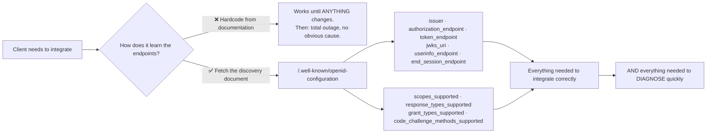
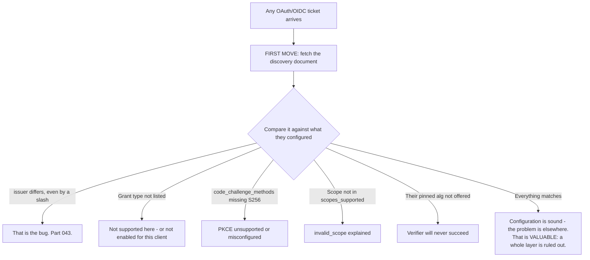
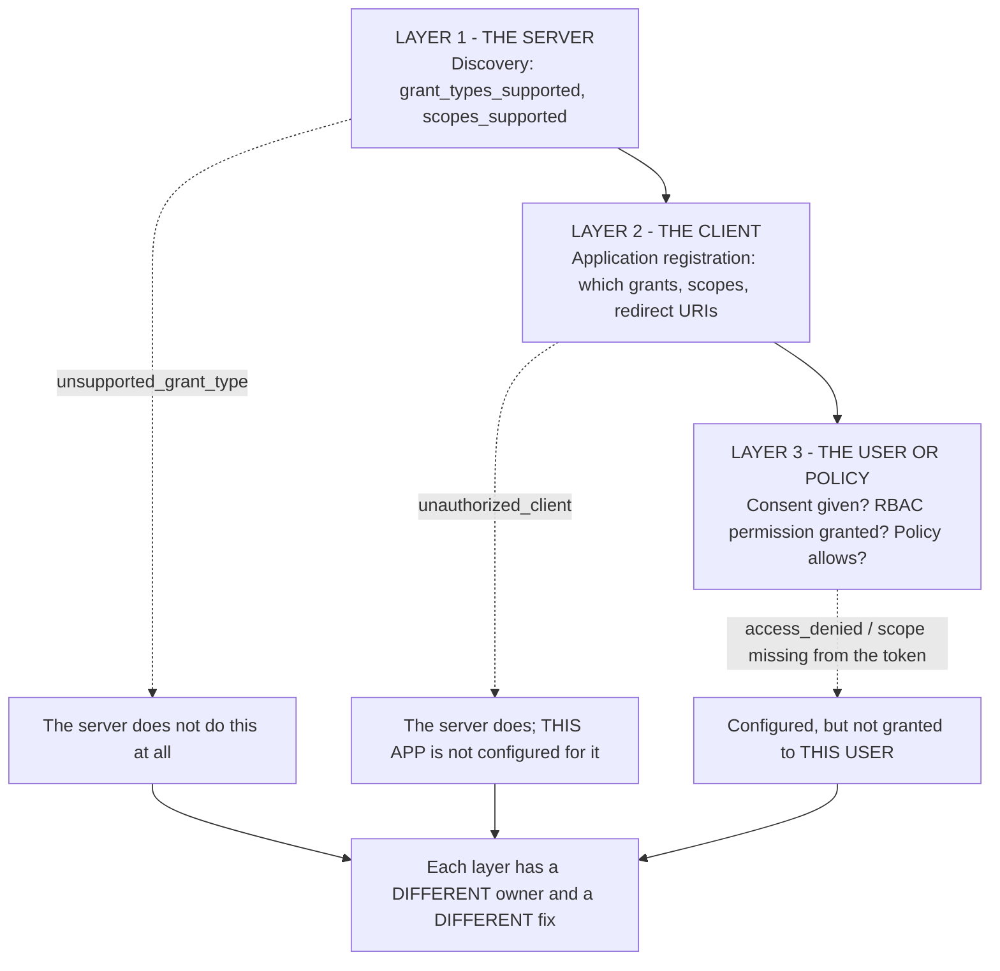
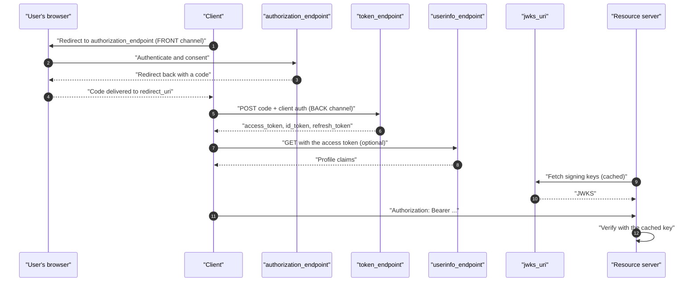
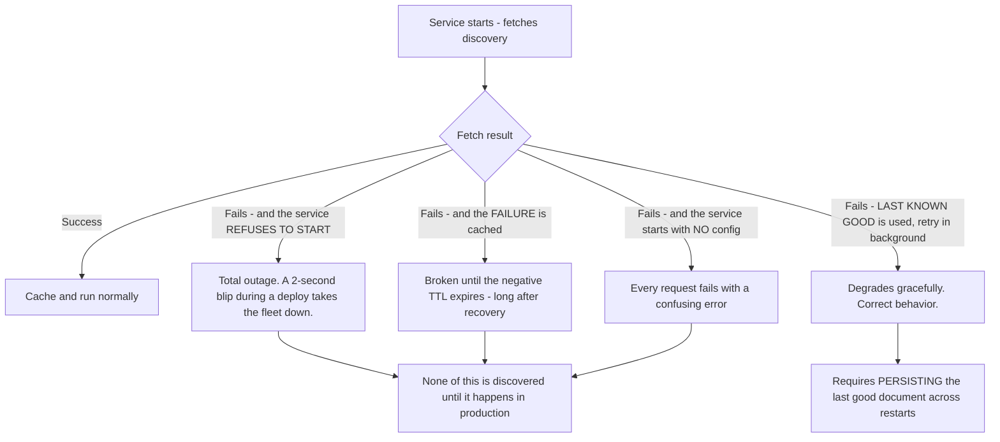
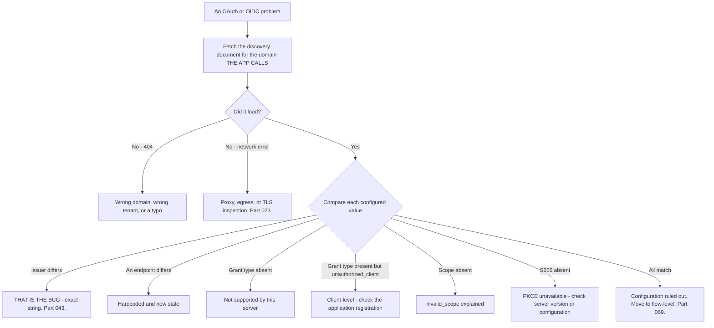

# Part 057 - Authorization Server Metadata, Discovery, and Endpoints

> Section goal: Learn the one document that describes everything a given authorization server supports, why fetching it beats hardcoding every time, and how to read it as a diagnostic instrument. This is the fastest first move on almost any OAuth or OIDC ticket.

Covers index item **057**. Maps to JD signals: *knowledge of OAuth*, *knowledge of OIDC*, *strong analytical and problem-solving skills*, *experience with troubleshooting web applications*, and *promote best practices*.

---

## 1. Start From Zero: The Discovery Document

OAuth is a framework (Part 056), so every authorization server supports a different subset. **Discovery** is how a server publishes what it actually does.



Two standard locations:

| Path | Defined by | Contains |
|---|---|---|
| **`/.well-known/openid-configuration`** | OpenID Connect Discovery | OIDC + OAuth metadata |
| `/.well-known/oauth-authorization-server` | RFC 8414 | OAuth metadata |

**In practice you will use the first almost always**, because most providers publish everything there.

> **Analogy.** A restaurant's published menu, opening hours, and payment methods. You could write down what they served in 2019 and turn up assuming it is unchanged — or you could look at what is published today.
>
> **Where it stops:** a restaurant tells you when something is off. A hardcoded endpoint fails silently and completely, with an error that points nowhere near the cause.

---

## 2. Reading the Document

A representative response, trimmed:

```json
{
  "issuer": "https://tenant.us.auth0.com/",
  "authorization_endpoint": "https://tenant.us.auth0.com/authorize",
  "token_endpoint": "https://tenant.us.auth0.com/oauth/token",
  "userinfo_endpoint": "https://tenant.us.auth0.com/userinfo",
  "jwks_uri": "https://tenant.us.auth0.com/.well-known/jwks.json",
  "end_session_endpoint": "https://tenant.us.auth0.com/oidc/logout",
  "revocation_endpoint": "https://tenant.us.auth0.com/oauth/revoke",
  "device_authorization_endpoint": "https://tenant.us.auth0.com/oauth/device/code",
  "scopes_supported": ["openid", "profile", "email", "offline_access"],
  "response_types_supported": ["code", "token", "id_token", "code id_token"],
  "grant_types_supported": ["authorization_code", "client_credentials", "refresh_token"],
  "code_challenge_methods_supported": ["S256", "plain"],
  "id_token_signing_alg_values_supported": ["RS256", "HS256"],
  "token_endpoint_auth_methods_supported": ["client_secret_basic", "client_secret_post", "private_key_jwt"]
}
```

| Field | Why it matters |
|---|---|
| **`issuer`** | The **exact string** for `iss` validation. **Copy it; never type it** (Part 043) |
| **`authorization_endpoint`** | Where the user is redirected |
| **`token_endpoint`** | Where codes are exchanged |
| **`jwks_uri`** | Where the signing keys live (Part 042) |
| **`userinfo_endpoint`** | Profile claims (Part 073) |
| **`end_session_endpoint`** | RP-initiated logout (Part 075) |
| **`revocation_endpoint`** | Token revocation (Part 045) |
| **`scopes_supported`** | What may be requested |
| **`grant_types_supported`** | Which flows work here |
| **`code_challenge_methods_supported`** | **PKCE support** — `S256` must be present (Part 059) |
| **`token_endpoint_auth_methods_supported`** | How the client authenticates |

### 🔍 Plain-English deep-dive: the discovery document as a diagnostic instrument

Most people treat discovery as configuration. It is also the fastest **diagnostic** available, because it answers questions that would otherwise take a round trip with the customer.

**Six questions it settles immediately:**

| Question | Field |
|---|---|
| Is the issuer what they think, including the trailing slash? | `issuer` |
| Does this server support the grant they are using? | `grant_types_supported` |
| Is PKCE supported, and with `S256`? | `code_challenge_methods_supported` |
| Is the scope they are requesting even valid here? | `scopes_supported` |
| Is the algorithm their verifier pins actually offered? | `id_token_signing_alg_values_supported` |
| Are they calling the right endpoint for logout or revocation? | `end_session_endpoint`, `revocation_endpoint` |



**The last box is underrated.** Ruling out an entire layer in thirty seconds, before asking the customer for anything, is what makes a support engineer feel fast. And it costs one unauthenticated HTTP GET.

**The technique in a ticket:** ask for the tenant domain — not credentials, not configuration screenshots, just the domain. Fetch the discovery document yourself. **You now know more about their authorization server than most of their own team**, before the first reply.

**One caution worth knowing:** a *custom domain* has its own discovery document with a different `issuer` (Part 097). If a customer gives you the canonical domain but their application uses the custom one, the documents differ in exactly the field that matters. **Always confirm which domain their application actually calls.**

**Analogy:** a published specification sheet for a machine before diagnosing a fault. It tells you what the machine can do, and half the reported faults turn out to be requests for things it never did. **Where it stops:** a spec sheet describes capabilities, not configuration. Discovery tells you what the *server* supports, not what a specific *client* is permitted — which is the next question.

---

## 3. Server-Level Versus Client-Level

A crucial distinction that causes confusion.

| Level | Described by | Example |
|---|---|---|
| **Server** | The discovery document | "This server supports `client_credentials`" |
| **Client** | The application's registration | "**This application** is not permitted to use `client_credentials`" |

**Discovery tells you what is possible, not what is permitted for a given client.** So a grant type listed in `grant_types_supported` can still fail with `unauthorized_client` — which means the *server* supports it and the *application* is not configured for it.

**Recognising which of the two you have is a one-step diagnosis**, and the error codes differentiate them (Part 069):

| Error | Level |
|---|---|
| `unsupported_grant_type` | **Server** does not support it |
| `unauthorized_client` | Server supports it; **this client** may not use it |
| `invalid_scope` | Scope unknown, or not permitted for this client |
| `invalid_client` | Client ID unknown, or authentication failed |

### 🔍 Plain-English deep-dive: three layers of "supported", and why customers conflate them

The server-versus-client split is really three layers, and a customer's *"it says it's supported"* can mean any of them.



| Layer | Who fixes it | Where |
|---|---|---|
| **Server** | The vendor, or a plan/feature change | Not usually fixable by the customer |
| **Client** | The customer's tenant administrator | Application registration |
| **User/policy** | An administrator, or the user | RBAC assignment, or the consent screen |

**Why conflating them wastes time:** a customer reports "scopes aren't working." If the scope is missing from `scopes_supported`, no amount of application configuration will help. If it is present but not enabled for the client, a tenant administrator fixes it in a minute. If it is enabled but absent from the issued token, the user was not granted it — a completely different person and a completely different screen.

**The three-question sequence that separates them, in order:**

1. *"Is it in the discovery document?"* — you can answer this yourself, for free.
2. *"Is it enabled for this application?"* — one screenshot of the application's settings.
3. *"Is it in the issued token?"* — one local decode (Part 040).

**Answering all three before proposing anything** is what stops the round-trip cycle where each suggestion addresses the wrong layer. And the sequence is cheap: the first costs nothing, and the other two are single artifacts rather than investigations.

**Analogy:** a restaurant that does not serve a dish · a dish not on tonight's menu · a dish they will not serve *you* because the kitchen has closed for your table. Three identical-sounding refusals with three different people to talk to. **Where it stops:** a waiter would say which one it is. OAuth error codes do too — but only if you read the exact string rather than the customer's summary.

---

## 4. Endpoints in Detail



| Endpoint | Method | Channel | Authenticated |
|---|---|---|---|
| `authorization_endpoint` | GET (redirect) | **Front** | The **user** is |
| `token_endpoint` | POST | **Back** | The **client** is |
| `userinfo_endpoint` | GET/POST | Back | By access token |
| `jwks_uri` | GET | Back | ❌ Public |
| `revocation_endpoint` | POST | Back | The client is |
| `end_session_endpoint` | GET (redirect) | **Front** | Session cookie |
| `introspection_endpoint` | POST | Back | The resource server is |

**Two rows are worth memorising.** The authorization endpoint is the only one the *user* visits, and the token endpoint is where the *client* proves itself. Mixing them up — POSTing to the authorization endpoint, or redirecting a user to the token endpoint — produces baffling errors that make sense the moment the distinction is clear.

---

## 5. Caching Discovery

| Practice | Guidance |
|---|---|
| **Fetch at startup, cache for hours** | ✅ The standard approach |
| **Fetch on every request** | ❌ Unnecessary latency and rate-limit risk |
| **Hardcode the values** | 🔴 **Not caching — a permanent snapshot** |
| **Cache a failure** | 🔴 The outage outlives the cause (Part 045) |
| **Refetch on unexpected failure** | ✅ A cheap recovery path |

**The distinction between caching and hardcoding is the one that matters.** Copying `jwks_uri` and `issuer` into a configuration file feels like the same thing and is not: a cache expires and refreshes; a hardcoded value never does, and it fails completely and silently the day something moves.

### 🔍 Plain-English deep-dive: what happens on the day discovery is unreachable

An under-considered question: if discovery is fetched at startup, what happens when that fetch fails?

The answer determines whether a brief network problem is a blip or an outage, and most implementations have never been tested for it.



**The failure mode nobody anticipates is the first one.** A deployment restarts every instance simultaneously; the provider has a two-second hiccup or a rate limit is briefly hit; no instance starts; the service is fully down for reasons unrelated to the deployment. **The blast radius is set by how many instances restart at once**, which is exactly what a rolling deploy maximises.

**What good looks like:**

| Practice | Effect |
|---|---|
| **Persist the last good document** to disk or a shared cache | Survives restarts even if the provider is unreachable |
| **Start with the persisted copy**, refresh in the background | A provider outage does not become your outage |
| **Never cache the failure** | Recovery is immediate when the network returns |
| **Stagger startup fetches** | Avoids a thundering herd against the provider |
| **Alert on a stale document** | You learn it is stale before it matters |

**The support-facing signal:** if a customer reports a total outage that began at a deployment and resolved without a code change, ask whether their startup path fetches discovery and what it does on failure. **It is a quick question that occasionally explains an entire incident** that otherwise looks like a bad release.

**Analogy:** a shop that will not open unless it can telephone head office for today's prices. One bad phone line and every branch stays shut, despite yesterday's prices being perfectly usable. **Where it stops:** a shopkeeper would improvise. Software does exactly what it was told, which is why the failure path has to be written deliberately rather than left to a default.

---

## 6. Failure Modes

| Failure mode | What it looks like | Consequence | Correction |
|---|---|---|---|
| **Hardcoding endpoints** | Works for years | 🔴 Total outage when one moves | Fetch discovery; cache it |
| **Hardcoding the issuer** | Trailing slash typed by hand | Every token rejected (Part 043) | Copy from `issuer` |
| **Wrong domain's document** | Canonical fetched, custom used | `iss` mismatch | Confirm which domain the app calls |
| **Confusing server and client support** | "It's in `grant_types_supported`" | Misdiagnosis | `unauthorized_client` is client-level |
| **Not checking `code_challenge_methods_supported`** | Assumed PKCE | Silent failure or downgrade | Verify `S256` is offered |
| **Pinning an unoffered algorithm** | Verifier never succeeds | 401 always | Check `id_token_signing_alg_values_supported` |
| **Fetching on every request** | Latency, rate limits | Slow, throttled | Cache for hours |
| **Caching a discovery failure** | Startup blip becomes an outage | Extended downtime | Never cache the failure |
| **POSTing to the authorization endpoint** | Wrong endpoint | Confusing errors | Front channel, redirect only |
| **Redirecting a user to the token endpoint** | Wrong endpoint | Confusing errors | Back channel, client only |
| **Assuming every provider has every endpoint** | Missing `revocation_endpoint` | Feature unavailable | Check before relying on it |

---

## 7. Troubleshooting Decision Tree: Start With Discovery



### Worked example

*"Our integration broke this morning. We changed nothing. Tokens are rejected with 'invalid issuer'."*

1. **Fetch the discovery document** for the domain their application calls. Thirty seconds, no customer input beyond the domain.
2. **Compare `issuer` against their configured value.** They match exactly.
3. **So the premise is wrong somewhere.** Ask which domain their application actually calls — and whether it is the same one they gave you.
4. **Finding:** they enabled a **custom domain** yesterday (Part 097). Their application now calls the custom domain, which issues tokens with the custom domain as `iss`. Their verifier still expects the canonical issuer.
5. **"We changed nothing" was true from their perspective** — the change was made by a different team, in the tenant, and its effect surfaced in a completely different system. Saying that out loud matters, because otherwise it sounds like you are contradicting them.
6. **Fix:** update the verifier's expected issuer, ideally by fetching discovery from the custom domain rather than configuring the string by hand.
7. **Prevention:** they now have two discovery documents with different issuers. Any application still pointed at the canonical domain will break the other way. **Suggest an inventory** — this rarely affects one application.
8. **Reinforce the general practice:** fetching `issuer` from discovery rather than configuring it would have made this a non-event.

---

## 8. Lab: Discovery as a Tool

**Purpose.** Build the habit of leading with discovery, and turn it into a reusable diagnostic script.

**Prerequisites.** Parts 040, 042, 056 artifacts. A free Auth0 tenant, plus at least one other public authorization server for comparison.

**Steps.**

1. Create `okta-prep/labs/057-discovery/`.
2. **Fetch and save** your tenant's `/.well-known/openid-configuration`. Pretty-print it.
3. **Annotate every field.** For each, write one line: what it is for and which Part covers it. **This is the exercise** — the document is small enough to know completely.
4. **Compare providers.** Fetch discovery from at least two other public providers. **Build a comparison table** of `grant_types_supported`, `response_types_supported`, `code_challenge_methods_supported`, and `token_endpoint_auth_methods_supported`. **Record what differs.** This is the framework-not-a-protocol point, evidenced.
5. **Try the OAuth path.** Fetch `/.well-known/oauth-authorization-server` and note whether it exists and how it differs.
6. **Custom domain contrast.** If you can enable a custom domain, fetch both documents and **diff them.** Note that `issuer` differs — this is the §7 worked example in your own tenant.
7. **Build `as-info`.** A script that takes a domain, fetches discovery, and prints a readable summary: issuer, all endpoints, supported grants, PKCE methods, and signing algorithms. **This is a genuinely reusable ticket tool.**
8. **Add a comparison mode.** Extend it to take a configuration file of expected values and report differences. **Test it by deliberately misconfiguring the issuer.**
9. **Server versus client.** Attempt a grant type that is in `grant_types_supported` but not enabled for your application. **Record the exact error** and confirm it is `unauthorized_client` rather than `unsupported_grant_type`.
10. **Then enable it** and confirm success. **Record both errors side by side** — this pair is the §3 distinction.
11. **Invalid scope.** Request a scope not in `scopes_supported`. Record the error.
12. **Algorithm check.** Note the algorithms offered and confirm your Part 043 verifier pins one that is present. **Then pin one that is absent** and record the failure.
13. **Endpoint misuse.** POST to the authorization endpoint and redirect a browser to the token endpoint. **Record both errors** — knowing what they look like saves time later.
14. **Caching behavior.** Add discovery caching to your verifier with a TTL. Then simulate a discovery fetch failure at startup and confirm your code does **not** cache the failure.
15. **Write the practice note.** `discovery-first.md` — one page: why discovery is the first move, the six questions it answers, and the server-versus-client distinction.
16. **Failure catalog + manifest.** Complete `MANIFEST.md`.

**Expected evidence.** A fully annotated discovery document, a three-provider comparison table, an OAuth-path contrast, a custom-domain diff if available, a working `as-info` script with comparison mode, the `unauthorized_client` versus `unsupported_grant_type` pair, an invalid-scope error, an algorithm-mismatch failure, two endpoint-misuse errors, verified caching behavior, and a one-page practice note.

**Validation rubric.**

| Check | Pass condition |
|---|---|
| Annotation | Every field explained in one line |
| Provider comparison | At least three, differences recorded |
| `as-info` script | Works against any domain |
| Comparison mode | Detects a deliberate misconfiguration |
| Server vs client | Both errors recorded side by side |
| Algorithm mismatch | Failure reproduced |
| Endpoint misuse | Both errors recorded |
| Caching | Failure not cached, verified |
| Practice note | One page, six questions, the distinction |

**Cleanup and privacy.** Discovery documents are public — fetching them from public providers is fine. **Do not fetch discovery for an employer or customer tenant** as part of lab work. Delete any custom domain configuration and restore application settings at the end.

---

## 9. JD Mapping

| Supplied JD signal | How this Part supports it |
|---|---|
| **Knowledge of OAuth and OIDC** | The metadata document and every endpoint it names |
| **Strong analytical and problem-solving skills** | Ruling out a whole layer in thirty seconds |
| Experience troubleshooting web applications | Endpoint misuse and configuration drift |
| **Promote best practices** | Discovery over hardcoding; never cache a key-lookup failure |
| Communicate technical concepts clearly | Explaining "you changed nothing" was true |
| Exceed expectations on response quality | Arriving at the first reply already informed |
| Knowledge of Okta's products | Custom domains and their separate issuer (Part 097) |

---

## 10. Candidate Honesty Note

- **Claim safety:** *Learned architecture and lab experience.*
- **The strongest thing you can say:** *"My first move on any OAuth or OIDC ticket is to fetch the discovery document for whatever domain the application actually calls. It takes thirty seconds, needs nothing from the customer but the domain, and it settles six questions: is the issuer what they think including the trailing slash, is the grant type supported, is PKCE offered with `S256`, is the scope valid, is the algorithm their verifier pins actually available, and are they using the right logout and revocation endpoints."*
- **A second point that shows judgement:** *"If everything matches, that's still valuable — I've ruled out the whole configuration layer before the first reply, so I can move straight to flow-level debugging instead of asking for screenshots."*
- **A third, a distinction that prevents misdiagnosis:** *"Discovery says what the *server* supports, not what a specific *client* is permitted. A grant type can be listed and still fail with `unauthorized_client`, which means the application isn't configured for it. `unsupported_grant_type` is server-level; `unauthorized_client` is client-level. That one-word difference is the whole diagnosis."*
- **A fourth, on a real trap:** *"A custom domain has its own discovery document with a different issuer. If a customer gives me the canonical domain but their app calls the custom one, the two documents differ in exactly the field that matters — so I always confirm which domain the application actually calls."*
- **A fifth, on a distinction people miss:** *"Caching discovery and hardcoding values out of it feel the same and aren't. A cache expires and refreshes. A hardcoded issuer or `jwks_uri` never does, and it fails completely and silently the day something moves — usually years later, when nobody remembers configuring it."*
- **Do not overstate:** you have not operated an authorization server. Say discovery is a tool you use fluently in a lab and that it is your standard first move.

---

## 11. Official Source Anchors

Accessed **26 August 2026**.

| Source | What it defines |
|---|---|
| OpenID Connect Discovery 1.0 | `/.well-known/openid-configuration` and every metadata field |
| IETF RFC 8414 | OAuth 2.0 Authorization Server Metadata |
| IETF RFC 7517 | `jwks_uri` and the key set it points to |
| IETF RFC 7009 | `revocation_endpoint` |
| IETF RFC 7662 | `introspection_endpoint` |
| IETF RFC 8628 | `device_authorization_endpoint` (Part 062) |
| OpenID Connect RP-Initiated Logout | `end_session_endpoint` (Part 075) |
| Auth0 documentation — OIDC discovery and custom domains | Vendor endpoints and the custom-domain issuer |
| Okta developer documentation — authorization server metadata | Okta's discovery endpoints, default and custom |

**Revalidate after 26 August 2026:** the specifications are stable. Recheck vendor documentation for newly published metadata fields, which are added over time.

---

## ⭐ Likely Interview Questions for This Section

### Q1. "What's the first thing you do on an OAuth ticket?"
> *Model answer:* "Fetch the discovery document for whatever domain the application actually calls — `/.well-known/openid-configuration`. It takes thirty seconds, it's a public unauthenticated GET, and all I need from the customer is the domain, not credentials or screenshots. It settles six things immediately: whether the issuer is what they think including the trailing slash, whether the grant type they're using is supported, whether PKCE with `S256` is offered, whether the scope they're requesting is valid there, whether the signing algorithm their verifier pins is actually available, and whether they're calling the right logout and revocation endpoints. And if everything matches, that's still useful — I've ruled out the entire configuration layer before replying."

### Q2. "Why is hardcoding endpoints a problem if they never change?"
> *Model answer:* "Because they do change, just rarely — which is the worst kind of failure. A tenant moves to a custom domain, a provider deprecates a path, a region migration alters a hostname. The integration has worked for two or three years, nobody remembers configuring the value, and it fails completely with an error that points nowhere near the cause. The distinction I'd emphasise is between caching and hardcoding, because they feel identical: caching means fetching the document and keeping it for a few hours, so it self-heals. Hardcoding means copying `issuer` and `jwks_uri` into a config file, which is a permanent snapshot that never refreshes. The issuer one is especially nasty, because a hand-typed issuer with a trailing-slash difference rejects every token with 'invalid issuer' and looks like a token problem."

### Q3. "A grant type is listed in `grant_types_supported` but the request fails. Why?"
> *Model answer:* "Because discovery describes what the *server* supports, not what a specific *client* is permitted to do. Those are different levels, and the error codes distinguish them: `unsupported_grant_type` means the server doesn't do it at all; `unauthorized_client` means the server does, but this application isn't configured for it. So if they're getting `unauthorized_client` with the grant listed in discovery, the fix is in the application registration, not the server. It's a good example of why reading the exact error string matters — those two errors describe completely different problems, live in completely different places, and get summarised identically by a customer as 'the grant type doesn't work.'"

### Q4. "What's in a discovery document?"
> *Model answer:* "Three groups. The issuer — the exact string used for `iss` validation, which should always be copied rather than typed. The endpoints — authorization, token, userinfo, JWKS, end-session for logout, revocation, introspection, and device authorization. And the capability lists — supported scopes, response types, grant types, PKCE code-challenge methods, signing algorithms, and client authentication methods. The capability lists are the ones people skip, and they're the most diagnostic: if `S256` isn't in `code_challenge_methods_supported`, PKCE won't work as expected; if the algorithm their verifier pins isn't in `id_token_signing_alg_values_supported`, verification will never succeed no matter what else is right."

### Q5. "A customer says nothing changed but the integration broke. How do you handle that?"
> *Model answer:* "Take it at face value, because it's usually true from their perspective — the change was made by someone else, in another system, and surfaced somewhere unrelated. I'd fetch discovery for the domain their app calls and compare against their configuration. A very common finding is a custom domain enabled by a different team: the tenant now has two discovery documents with different issuers, the application calls the custom one, and the verifier still expects the canonical issuer. So 'we changed nothing' was accurate about *their* code. I'd say that explicitly, because otherwise the correction sounds like a contradiction. And I'd suggest an inventory, because if one application was pointed at the wrong domain there are usually others, failing the opposite way."

### Q6. "Which endpoint does the user visit and which does the client call?"
> *Model answer:* "The user visits the authorization endpoint — that's a front-channel browser redirect, and it's where they authenticate and consent. The client calls the token endpoint directly, server to server, over the back channel, and that's where the client authenticates itself and receives tokens. The end-session endpoint is also front-channel because it needs the browser's session cookie. Everything else — userinfo, JWKS, revocation, introspection — is back channel. Getting this wrong produces confusing errors that make immediate sense once the distinction is clear: POSTing to the authorization endpoint, or redirecting a user's browser to the token endpoint, both fail in ways that don't obviously say 'wrong endpoint.'"

### Q7. "How should discovery be cached?"
> *Model answer:* "Fetch at startup, cache for hours, and refetch on an unexpected failure. What I'd warn against specifically is caching a *failure* — if the fetch fails transiently at startup and the code stores the error, then everything stays broken until that negative entry expires, long after the network blip is over, and the timeline makes no sense to whoever's investigating. Keep serving the last known-good document while retrying. The other anti-pattern is the opposite extreme: fetching on every request, which adds latency and risks rate limits for a document that changes maybe once a year. And the JWKS reference inside it has its own rule — cache it, but refetch on an unknown `kid`, because that's what makes key rotation invisible."

### Q8. "How would you use discovery to compare two providers?"
> *Model answer:* "Fetch both documents and diff the capability lists — `grant_types_supported`, `response_types_supported`, `code_challenge_methods_supported`, `token_endpoint_auth_methods_supported`, and the signing algorithms. That tells you concretely where a migration will need code changes rather than configuration changes. It's also the clearest demonstration that OAuth is a framework rather than a protocol: two fully compliant servers can support genuinely different sets, so code written against one may not work against another. That's directly relevant in support, because 'it worked with our previous provider' is a common opening, and the diff usually shows exactly why in under a minute — a missing grant type, a different client authentication method, or an algorithm that isn't offered."

---

## 🧠 30-Second Memory Hooks

- **`/.well-known/openid-configuration`** — the first move on **every** OAuth/OIDC ticket.
- **Needs only the DOMAIN.** No credentials, no screenshots. Thirty seconds.
- **Six questions answered:** issuer · grant types · **`S256`** · scopes · signing algs · logout/revocation endpoints.
- **COPY `issuer` from discovery. Never type it.** Trailing slashes.
- **Everything matching is still valuable** — a whole layer ruled out.
- **Server level ≠ client level.** `unsupported_grant_type` (server) vs **`unauthorized_client`** (client).
- **A CUSTOM DOMAIN has its own document with a DIFFERENT issuer.** Confirm which domain the app calls.
- **Caching ≠ hardcoding.** A cache refreshes; a snapshot never does.
- **Never cache a discovery failure.** The outage outlives the cause.
- **User visits the AUTHORIZATION endpoint. Client calls the TOKEN endpoint.**
- **Diffing two providers' documents** shows exactly why "it worked with our old provider."

---

## ✅ Completion Checklist

- [ ] **Knowledge:** I can name every discovery field, the six diagnostic questions, and the server-versus-client error pair.
- [ ] **Lab artifact:** `057-discovery/` contains an annotated document, a three-provider comparison, a working `as-info` script with comparison mode, the two grant-type errors side by side, and a practice note.
- [ ] **Spoken:** I can explain the discovery-first habit in 45 seconds and the custom-domain trap in 30.
- [ ] **Judgement:** I confirm which domain the application actually calls before comparing anything.
- [ ] **Honesty check:** I say "lab tooling and standard practice," not production operation.
- [ ] **Source check:** I have read OpenID Connect Discovery §3 and RFC 8414 myself.

---

*Next suggested section:* **[Part 058 - Authorization Code Flow Step by Step](Part-058-authorization-code-flow-step-by-step.md)** — the flow that matters most, walked parameter by parameter, with every failure point named.
