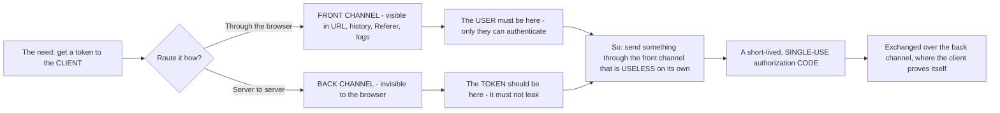
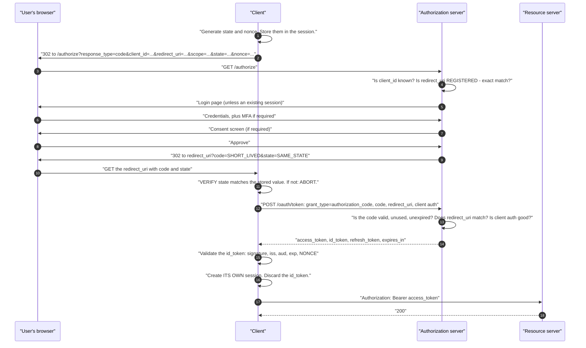
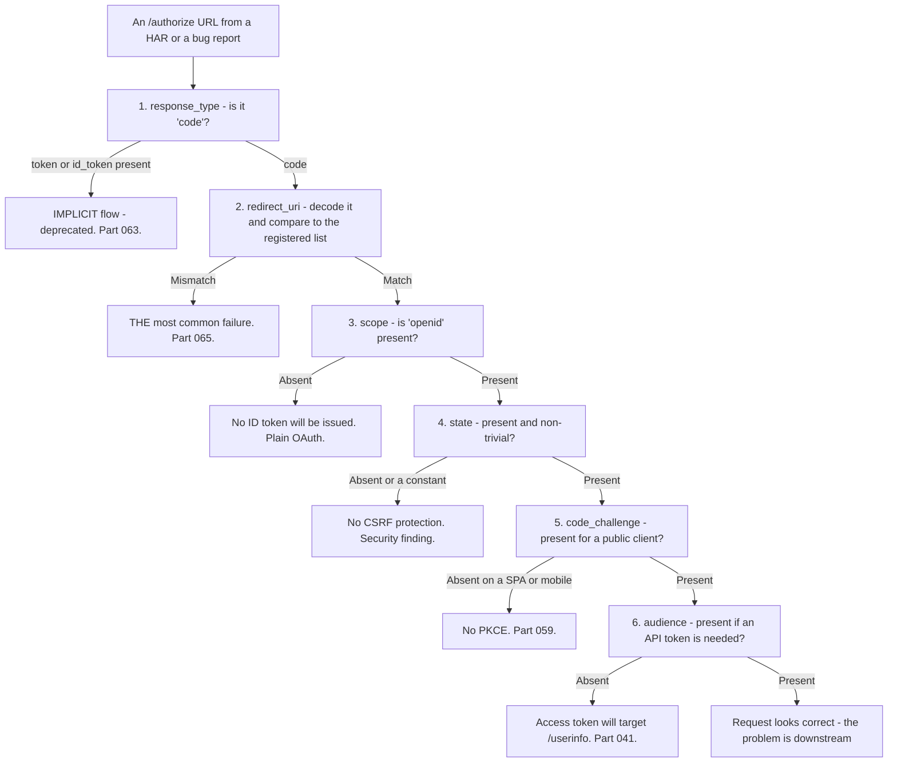
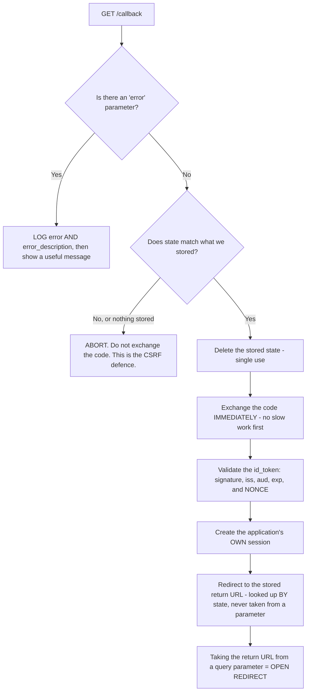
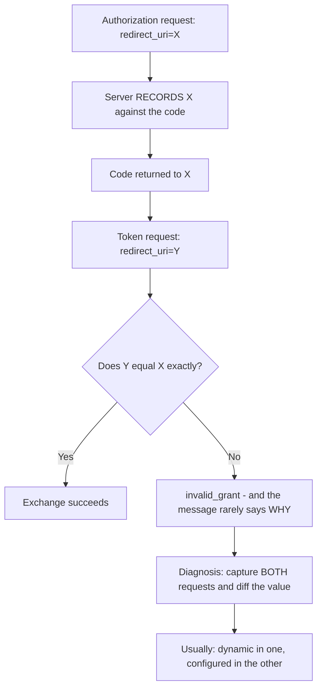
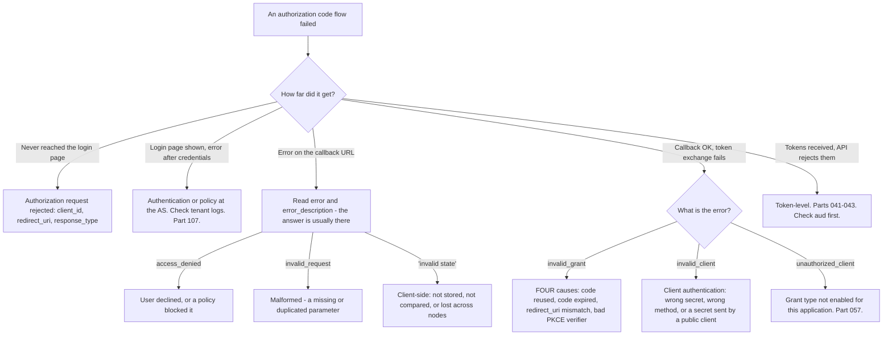

# Part 058 - Authorization Code Flow Step by Step

> Section goal: Walk the flow that matters most, parameter by parameter and request by request, so you can read any authorization code flow in a HAR and name exactly where it broke. This is the single most useful mechanical skill in the role.

Covers index item **058**. Maps to JD signals: *knowledge of OAuth*, *knowledge of OIDC*, *experience with troubleshooting web applications*, *strong analytical and problem-solving skills*, and *knowledge of HTTP*.

---

## 1. Start From Zero: Why a Code At All

The flow's odd shape — a code, then an exchange — follows entirely from Part 056's channel split.



**The code is deliberately a poor prize.** It expires in seconds to a minute, works once, and cannot be exchanged without either a client secret or a PKCE verifier. Anyone who intercepts it usually has nothing.

> **Analogy.** A cloakroom stub handed over in a crowded lobby. Even if someone photographs it, they cannot collect the coat without the matching half you kept.
>
> **Where it stops:** a stub is checked by a person. Here the "matching half" is a client secret or a PKCE verifier, and the check is exact — which is why PKCE exists for clients that have no secret to hold (Part 059).

---

## 2. The Complete Flow



**Every arrow in that diagram is a place a ticket originates.** Learning to locate a customer's failure on this diagram is the core skill of Group F.

---

## 3. The Authorization Request

```
GET https://tenant.us.auth0.com/authorize
  ?response_type=code
  &client_id=abc123
  &redirect_uri=https%3A%2F%2Fapp.example.com%2Fcallback
  &scope=openid%20profile%20email%20read%3Aorders
  &state=xyz789
  &nonce=n0S6WzA2
  &audience=https%3A%2F%2Fapi.example.com
  &code_challenge=E9Melhoa...
  &code_challenge_method=S256
```

| Parameter | Required | Purpose | Failure if wrong |
|---|---|---|---|
| **`response_type=code`** | ✅ | Requests the code flow | `unsupported_response_type` |
| **`client_id`** | ✅ | Which application | `invalid_client` / `unauthorized_client` |
| **`redirect_uri`** | ✅ in practice | Where to return | 🔴 **The #1 failure** (Part 065) |
| **`scope`** | Effectively | What is requested | No ID token without `openid` (Part 052) |
| **`state`** | ✅ Security | CSRF + return context | Login CSRF without it (Part 048) |
| **`nonce`** | ✅ for OIDC | ID token replay protection | Injection risk |
| **`audience`** | Vendor-specific | **Which API the access token is for** | `aud` = `/userinfo` (Part 041) |
| **`code_challenge`** | ✅ Public clients | PKCE (Part 059) | Code interception risk |
| `prompt` | Optional | `none`, `login`, `consent` | Parts 049, 076 |
| `max_age` | Optional | Recency requirement | Part 049 |

### 🔍 Plain-English deep-dive: reading an authorization URL is a complete diagnosis

Most authorization-request failures are visible in the URL itself, before any evidence exchange. **Learning to read one in ten seconds is disproportionately valuable.**

The reading order, and what each reveals:



**Two of those checks catch things nobody reported:**

**A constant `state`.** If every login uses `state=12345`, the parameter is present and provides no protection at all — it cannot distinguish this flow from another. It looks fine in a HAR unless you compare two flows. **Comparing `state` across two captures is a ten-second security check.**

**A missing `audience`.** Nobody reports this at authorization time, because the flow succeeds. It surfaces hours later as a 401 from their API, in a completely different investigation.

**The practical technique:** when a customer sends a HAR, extract the `/authorize` URL, URL-decode every parameter, and lay them out one per line. **Most of the diagnosis is done at that point**, and it costs one command with your Part 040 tooling.

**Analogy:** reading the address, postage, and customs declaration on a parcel before opening it. Most delivery failures are visible on the outside. **Where it stops:** a parcel's label is written by a human who may have made an obvious error. These parameters are generated by code, so the errors are systematic — which is better, because a systematic error is reproducible and fixable once.

---

## 4. The Callback

```
GET https://app.example.com/callback?code=SplxlOBeZQ&state=xyz789
```

**Two checks, both mandatory, both frequently skipped:**

| Check | Why |
|---|---|
| **`state` matches the stored value** | 🔴 Without it: login CSRF (Part 048) |
| **`code` present, not `error`** | The authorization server may return `error` and `error_description` instead |

An error callback looks like:

```
GET /callback?error=access_denied&error_description=User%20did%20not%20consent&state=xyz789
```

**`error_description` is the single most valuable string in OAuth debugging**, and applications routinely discard it — logging "login failed" while the server explained exactly what went wrong. **Ask for it every time.**

### 🔍 Plain-English deep-dive: the callback handler is where security actually lives

The callback route looks like plumbing — receive a code, exchange it, redirect onward. It is in fact the **only** place several security checks can happen, and it is routinely written as if it were plumbing.

Five things a correct callback handler does, in order:

| # | Check | If skipped |
|---|---|---|
| 1 | **Is this an error response?** Read `error` and `error_description` | The exchange fails later with a worse message |
| 2 | **Does `state` match the stored value?** | 🔴 Login CSRF (Part 048) |
| 3 | **Delete the stored `state` after use** | A replayable value |
| 4 | **Exchange the code immediately** | Codes expire in under a minute |
| 5 | **Validate the ID token, including `nonce`** | 🔴 ID token injection (Part 065) |



**Two subtleties in that diagram are worth calling out.**

**Step 4's "immediately".** A handler that writes an audit record, calls a user-lookup service, or renders something before exchanging the code can exceed the code's lifetime under load. The symptom is `invalid_grant` that appears only when the system is busy — which looks like a capacity problem and is a sequencing problem. **Exchange first, do everything else after.**

**The final box.** The return URL must be looked up from server-side storage keyed by `state`, never read from a query parameter. A callback that redirects to `?returnTo=...` without validation is an open redirect, and open redirects are directly useful in the phishing chains from Part 055.

**Why this handler gets written carelessly:** it is generated by a framework or copied from a quickstart, it works on the first try, and nothing about it ever fails visibly. **Every one of the five checks is invisible when present and invisible when absent** — which is precisely why reviewing it is worth doing deliberately.

**Analogy:** the security desk between the lobby and the offices. It looks like a formality, and it is the only point where anyone is actually checked. **Where it stops:** a security desk visibly exists. A callback handler's checks are a few lines that can be deleted without anything appearing to change.

---

## 5. The Token Exchange

```http
POST /oauth/token HTTP/1.1
Host: tenant.us.auth0.com
Content-Type: application/x-www-form-urlencoded
Authorization: Basic <base64(client_id:client_secret)>     ← confidential clients

grant_type=authorization_code
&code=SplxlOBeZQ
&redirect_uri=https%3A%2F%2Fapp.example.com%2Fcallback
&code_verifier=dBjftJeZ4CVP...                              ← public clients (PKCE)
```

| Field | Note |
|---|---|
| **`grant_type`** | `authorization_code` |
| **`code`** | Single-use, short-lived |
| **`redirect_uri`** | **Must match the authorization request exactly** — it is a binding check, not a redirect |
| **Client authentication** | Secret (confidential) or PKCE verifier (public) |

### 🔍 Plain-English deep-dive: why `redirect_uri` appears twice, and why it trips people

Developers reasonably ask why `redirect_uri` is sent to the token endpoint at all — nothing is being redirected. **It is not a redirect instruction. It is a binding check.**

The authorization server recorded which `redirect_uri` was used when the code was issued. At exchange time it compares. If they differ, the exchange fails.

**What that prevents:** an attacker who obtains a code cannot exchange it by supplying a different `redirect_uri` — the code is bound to the original one. It closes a class of code-substitution attack.

**Why it produces confusing tickets:** the value must match **exactly**, and it is easy for it to differ between the two requests without anyone intending it:

| Cause | Detail |
|---|---|
| **Built dynamically** | The authorization request built it from `window.location`; the token request built it from configuration |
| **Encoding differs** | Encoded in one, raw in the other |
| **Trailing slash** | Added or removed by a framework |
| **Proxy rewriting** | The app derives it from a `Host` header a proxy altered |
| **Environment drift** | Different value in one code path than the other |



**`invalid_grant` is the error, and it is unhelpfully generic** — it also covers an expired code, a reused code, and a revoked grant. So the diagnostic sequence is:

1. **Was the code already used?** Retries and double-submits are common.
2. **Has it expired?** Check the time between callback and exchange — a slow server-side step can exceed a 60-second code lifetime.
3. **Does `redirect_uri` match?** Capture both requests and diff the value.
4. **Is the PKCE verifier correct?** For public clients (Part 059).

**Four causes, one error string.** Knowing all four turns `invalid_grant` from a dead end into a four-step checklist.

**Analogy:** a parcel collection where the depot checks that the delivery address on your slip matches the one they have on file. It is not going to be delivered anywhere — it is confirming you are the party the parcel was intended for. **Where it stops:** a depot clerk would tell you which detail mismatched. `invalid_grant` tells you nothing, which is why capturing both requests is the only reliable move.

---

## 6. Failure Modes

| Failure mode | What it looks like | Consequence | Correction |
|---|---|---|---|
| **`redirect_uri` not registered** | Error at `/authorize` | 🔴 #1 failure | Exact registration (Part 065) |
| **`redirect_uri` differs between requests** | `invalid_grant` | Exchange fails | Use one source of truth |
| **Code reused** | `invalid_grant` | May revoke the grant | Single use; guard against retries |
| **Code expired** | `invalid_grant` | Exchange fails | Exchange immediately |
| **No `state`** | Works fine | 🔴 Login CSRF | Always send and verify |
| **Constant `state`** | Looks present | 🔴 No protection | Random per request |
| **`state` not verified** | Sent, ignored | 🔴 No protection | Compare on callback |
| **No `nonce`** | Works fine | 🔴 ID token injection | Send and validate |
| **Missing `openid`** | No ID token | "OIDC isn't working" | Add the scope |
| **Missing `audience`** | 401 from their API later | Confusing, delayed | Add it (Part 041) |
| **`error_description` discarded** | "Login failed" logged | 🔴 The answer thrown away | Log and surface it |
| **Secret in a public client** | Rejected, or published | 🔴 (Part 056) | PKCE |
| **`state` stored in memory, load-balanced** | Intermittent "invalid state" | Flaky logins | Shared session store (Part 047) |

---

## 7. Troubleshooting Decision Tree: Where Did It Break?



### Worked example

*"Login works locally but fails in production with `invalid_grant`. Same code."*

1. **"Works locally, fails in production" plus `invalid_grant` narrows to `redirect_uri` immediately** — the other three causes would fail locally too.
2. **Ask for both requests**, from a production HAR: the `/authorize` URL and the token POST body.
3. **Diff the `redirect_uri` in each.** Authorization: `https://app.example.com/callback`. Token: `http://app.example.com/callback`.
4. **The cause:** their application builds the token-request `redirect_uri` from the incoming request's scheme. Behind a load balancer that terminates TLS, the application sees `http`, while the browser used `https`.
5. **This is why local works.** No proxy locally, so the scheme is consistent in both requests.
6. **Two fixes, and the right one depends on their setup:** honour `X-Forwarded-Proto` so the application reconstructs the external URL correctly, or — better — use a single configured `redirect_uri` value for both requests rather than deriving it.
7. **Recommend the second**, because deriving a security-relevant value from a request header is fragile. One configured constant cannot drift between two code paths.
8. **Note the wider symptom class**, because it recurs: any value derived from `Host` or the scheme behind a proxy — redirect URIs, issuer URLs, callback links in emails — has this failure mode. **Flagging the pattern is worth more than fixing the instance.**

---

## 8. Lab: Walk the Flow

**Purpose.** Perform the flow manually, without an SDK, then break each step and record the error. This is the lab that makes Group F concrete.

**Prerequisites.** Parts 040, 044, 056, 057 artifacts. A free Auth0 tenant with a Regular Web Application and a test API.

**Steps.**

1. Create `okta-prep/labs/058-code-flow/`.
2. **Build the authorization URL by hand.** No SDK. Include all parameters from §3. **Generate `state` and `nonce` randomly and store them.**
3. **Complete the flow in a browser.** Capture the callback URL. **Record the code and confirm `state` matches.**
4. **Exchange manually with curl.** Construct the token POST yourself. **Record the full response** with the token values redacted.
5. **Decode all three tokens locally** (Part 040). Record `aud`, `iss`, `exp`, `scope`, and — for the ID token — **`nonce`, confirming it matches what you sent.**
6. **Capture a full HAR** of an SDK-driven flow and **annotate every request** against the §2 diagram. Confirm you can locate each numbered step.
7. **Break `redirect_uri` at authorization.** Add a trailing slash. **Record the exact error and where it appears** — at the authorization server, before login.
8. **Break `redirect_uri` at exchange only.** Use the correct one at `/authorize` and a different one in the token POST. **Record the error.** Confirm it is `invalid_grant` and note how unhelpful it is.
9. **Reuse a code.** Exchange the same code twice. Record the second response, and **check the tenant log** for whether the grant was revoked (Part 107).
10. **Expire a code.** Wait past its lifetime before exchanging. **Record how long that is** — most people have never measured it.
11. **Omit `state`.** Confirm the flow still succeeds. **Write one line on what that means** — this is the point about security controls that fail silently.
12. **Use a constant `state`.** Run two flows and confirm both succeed with the same value. **Record why this is worthless.**
13. **Omit `openid`.** Confirm no ID token is returned.
14. **Omit `audience`.** Decode the access token and **record that `aud` points at `/userinfo`.** Then call your API with it and record the 401.
15. **Capture `error_description`.** Trigger an error — decline consent — and **record both `error` and `error_description`.** Note how much more useful the second is.
16. **Build `authz-url-parse`.** A script that takes an `/authorize` URL, decodes every parameter, and runs the §3 checklist, flagging: implicit response types, missing `openid`, missing or trivial `state`, missing PKCE, and missing `audience`. **This is a genuinely reusable ticket tool.**
17. **Write the walkthrough.** `code-flow-annotated.md` — the full flow with your own captured values, redacted, and each step explained.
18. **Failure catalog + manifest.** Complete `MANIFEST.md`.

**Expected evidence.** A hand-built authorization URL, a manual curl exchange, three decoded tokens with `nonce` verified, an annotated HAR mapped to the flow diagram, nine deliberately broken steps with exact errors, a measured code lifetime, a working `authz-url-parse` script, and an annotated walkthrough.

**Validation rubric.**

| Check | Pass condition |
|---|---|
| Manual flow | Completed with no SDK |
| `nonce` verified | Matches what was sent |
| HAR annotation | Every step located on the diagram |
| Both `redirect_uri` breaks | Distinct errors, distinct locations |
| Code reuse | Second response and tenant log recorded |
| Code lifetime | Measured |
| `state` omitted and constant | Both succeed; implications written |
| `audience` omitted | `aud` shows `/userinfo`; 401 reproduced |
| `error_description` | Captured and contrasted with `error` |
| `authz-url-parse` | Flags all five conditions |

**Cleanup and privacy.** Lab tenant, synthetic users, localhost or a domain you control. **Redact all token values** from saved artifacts (Part 040). Delete the application and revoke tokens at the end.

---

## 9. JD Mapping

| Supplied JD signal | How this Part supports it |
|---|---|
| **Knowledge of OAuth and OIDC** | The core flow, parameter by parameter |
| **Experience troubleshooting web applications** | HAR annotation against a known flow |
| Strong analytical and problem-solving skills | "How far did it get?" as the primary split |
| **Knowledge of HTTP** | Redirects, form encoding, headers, proxy effects |
| Promote best practices | One source of truth for `redirect_uri`; log `error_description` |
| Exceed expectations on response quality | Flagging the derived-from-`Host` pattern, not just the instance |
| Communicate technical concepts clearly | Explaining `redirect_uri` at the token endpoint as a binding check |

---

## 10. Candidate Honesty Note

- **Claim safety:** *Learned architecture and lab experience.*
- **The strongest thing you can say:** *"I can read an authorization code flow in a HAR and say where it broke. The first question is how far it got — never reached the login page means the authorization request was rejected; error on the callback means read `error_description`; callback fine but exchange failed means one of four things; tokens issued but the API rejects them means it's token-level and I'd check `aud` first."*
- **A second point, and it is the highest-value trick here:** *"Most authorization-request failures are visible in the `/authorize` URL itself. I decode every parameter and lay them out one per line — response type, redirect URI, whether `openid` is there, whether `state` is present and actually random, whether PKCE is there for a public client, and whether `audience` was sent. Two of those catch things nobody reported: a constant `state`, which looks fine until you compare two flows, and a missing `audience`, which succeeds now and produces a 401 hours later."*
- **A third, which turns a dead end into a checklist:** *"`invalid_grant` has four causes — the code was reused, the code expired, `redirect_uri` differs between the authorization request and the token request, or the PKCE verifier is wrong. The error string is identical for all four, so knowing the list is the difference between a checklist and a guess."*
- **A fourth, on a distinction developers ask about:** *"`redirect_uri` at the token endpoint isn't a redirect instruction, it's a binding check — the server recorded which URI the code was issued for and compares. That's why it must match exactly, and why it commonly differs: built dynamically in one request and read from configuration in the other."*
- **A fifth, a genuinely useful diagnosis:** *"'Works locally, fails in production with `invalid_grant`' is almost always a scheme mismatch behind a TLS-terminating proxy — the app sees `http` and the browser used `https`. The fix is one configured value used in both requests rather than deriving it from the incoming request."*
- **A sixth:** *"`error_description` is the most valuable string in OAuth debugging and applications routinely throw it away, logging 'login failed' while the server explained exactly what happened. I ask for it every time."*
- **Do not overstate:** you have not shipped this flow in production. Say you have built it by hand without an SDK and broken every step deliberately.

---

## 11. Official Source Anchors

Accessed **26 August 2026**.

| Source | What it defines |
|---|---|
| IETF RFC 6749 §4.1 | The authorization code grant, both requests and both responses |
| IETF RFC 6749 §4.1.2.1 | Authorization endpoint error codes |
| IETF RFC 6749 §5.2 | Token endpoint error codes, including `invalid_grant` |
| IETF RFC 6749 §10.12 | CSRF and the `state` parameter |
| IETF RFC 7636 | PKCE (Part 059) |
| OpenID Connect Core §3.1 | The OIDC authorization code flow, `nonce`, and ID token validation |
| OAuth 2.0 Security BCP | Current guidance on `redirect_uri`, `state`, and PKCE |
| Auth0 documentation — authorization code flow and the `audience` parameter | Vendor specifics |
| Okta developer documentation — authorization code flow | Okta's implementation |

**Revalidate after 26 August 2026:** RFC 6749 is stable; the Security BCP and OAuth 2.1 tighten requirements. Recheck those and vendor parameter documentation.

---

## ⭐ Likely Interview Questions for This Section

### Q1. "Walk me through the authorization code flow."
> *Model answer:* "The client generates `state` and `nonce`, stores them, and redirects the browser to the authorization endpoint with `response_type=code`, the client ID, the redirect URI, scopes, and those two values — plus PKCE parameters and, on Auth0, an `audience` if an API token is needed. The authorization server checks the client ID and that the redirect URI is registered exactly, authenticates the user, gets consent if needed, and redirects back with a short-lived single-use code and the same `state`. The client verifies `state` matches, then makes a back-channel POST to the token endpoint with the code, the same redirect URI, and either a client secret or a PKCE verifier. It gets back an access token, an ID token, and possibly a refresh token — validates the ID token including the `nonce`, creates its own session, and discards the ID token. The shape exists because the front channel leaks, so only a useless-on-its-own code goes through it."

### Q2. "Why is there a code at all, rather than just returning a token?"
> *Model answer:* "Because the front channel — the browser redirect — is inherently leaky. Anything in a URL ends up in browser history, in `Referer` headers sent to third-party resources on the callback page, and in proxy and server access logs. So OAuth deliberately sends something through it that's a poor prize: a code that expires in under a minute, works exactly once, and can't be exchanged without either a client secret or a PKCE verifier. The actual tokens are issued over the back channel, server to server, where the browser never sees them. That's the whole rationale, and it's also why the implicit flow was deprecated — it put tokens directly into the front channel, which is precisely what the design was avoiding."

### Q3. "What does `invalid_grant` mean?"
> *Model answer:* "It's frustratingly generic — four different causes share it. The code was already used, because codes are single-use and a retry or double-submit consumes one. The code expired, which happens with a slow server-side step between callback and exchange. The `redirect_uri` in the token request doesn't match the one in the authorization request, because the server binds the code to the original URI. Or the PKCE verifier doesn't match the challenge. Knowing the list turns a dead end into a four-step checklist. I'd narrow it with context: 'works locally, fails in production' points at `redirect_uri`, usually a scheme mismatch behind a TLS-terminating proxy. Intermittent points at code reuse from retries. And I'd ask for both requests, because diffing `redirect_uri` between them settles the most common case in seconds."

### Q4. "Why is `redirect_uri` sent to the token endpoint?"
> *Model answer:* "It isn't a redirect instruction — nothing is being redirected at that point. It's a binding check. The authorization server recorded which redirect URI the code was issued for, and it compares at exchange time, so an attacker who obtains a code can't exchange it by supplying a different URI. It trips people because the value has to match exactly and it's easy for it to differ unintentionally: built dynamically from `window.location` in the authorization request and read from configuration in the token request, or encoded in one and raw in the other, or a trailing slash added by a framework, or a proxy rewriting the `Host` header. The robust fix is one configured constant used in both places rather than deriving a security-relevant value from an incoming request."

### Q5. "How do you triage a broken login flow?"
> *Model answer:* "First question: how far did it get? That splits the problem into four. If it never reached the login page, the authorization request was rejected — client ID, redirect URI, or response type. If the login page appeared and it failed after credentials, that's authentication or policy at the authorization server, and I'd go to the tenant logs. If there's an error on the callback URL, I'd read `error` and `error_description`, because the answer is usually right there. If the callback was fine but the token exchange failed, it's one of the four `invalid_grant` causes or a client-authentication problem. And if tokens were issued but the API rejects them, it's token-level and I'd check `aud` first. That single question does more triage than anything else, and it costs one message."

### Q6. "What can you tell from just the `/authorize` URL?"
> *Model answer:* "Most of it, honestly. I'd decode every parameter and check six things in order. Is `response_type` `code`, or does it include `token` or `id_token`, which means implicit and is deprecated. Does the redirect URI match the registered list character for character. Is `openid` in the scope, because without it there's no ID token. Is `state` present and actually random — a constant `state` looks fine in one capture and provides zero protection, so comparing two flows is a ten-second security check. Is there a `code_challenge` for a public client. And is `audience` present, because if it's missing the access token targets the userinfo endpoint and their API will 401 hours later in what looks like an unrelated investigation. Two of those catch problems nobody reported."

### Q7. "A customer's login works locally but fails in production. Where do you look?"
> *Model answer:* "Environment differences that affect a URL, because the code is the same. The most common is a TLS-terminating proxy or load balancer: the browser used `https` but the application sees `http` on the incoming request, so if it derives the redirect URI from that request, the authorization and token requests disagree and you get `invalid_grant`. Locally there's no proxy, so the scheme is consistent. The fix is either honouring `X-Forwarded-Proto` or, better, using one configured redirect URI in both places. And I'd flag the wider pattern rather than just this instance — anything derived from the `Host` header or the scheme behind a proxy has the same failure mode: redirect URIs, issuer URLs, callback links in emails. Fixing the pattern is worth more than fixing the symptom."

### Q8. "What happens if you skip `state`?"
> *Model answer:* "Everything works, which is exactly the problem — it's a security control that fails silently. Without `state` there's nothing correlating the response to a request your application made, so an attacker can complete an authorization flow with their own account and trick a victim's browser into delivering that result to the victim's session. The victim ends up silently logged in as the attacker, and then saves a document or enters a payment method into an account the attacker controls. That's login CSRF, and it's counter-intuitive because the harm comes from the victim being in the *wrong* account. The related trap is a `state` that's present but constant — it satisfies a code review and provides no protection at all. It should be random per request, stored server-side, and compared on the callback. And in a load-balanced app it needs a shared session store, or you get intermittent 'invalid state' errors."

---

## 🧠 30-Second Memory Hooks

- **The code exists because the FRONT CHANNEL LEAKS.** It is deliberately a poor prize.
- **Code = short-lived · single-use · useless without a secret or a PKCE verifier.**
- **Read the `/authorize` URL first.** Six checks: response type · redirect URI · **`openid`** · **`state`** · `code_challenge` · **`audience`**.
- **Constant `state` = no protection.** Compare two flows to spot it.
- **Missing `audience` succeeds now and 401s hours later.**
- **`redirect_uri` at the token endpoint is a BINDING CHECK**, not a redirect.
- **`invalid_grant` = FOUR causes:** reused · expired · **`redirect_uri` mismatch** · bad PKCE verifier.
- **"Works locally, fails in production" = scheme mismatch behind a TLS-terminating proxy.**
- **One configured `redirect_uri`, used in both requests.** Never derive it.
- **`error_description` is the most valuable string in OAuth.** Applications throw it away.
- **Triage question #1: how far did it get?**

---

## ✅ Completion Checklist

- [ ] **Knowledge:** I can draw the full flow from memory and name the four causes of `invalid_grant`.
- [ ] **Lab artifact:** `058-code-flow/` contains a hand-built flow with no SDK, an annotated HAR, nine broken-step errors, a measured code lifetime, and a working `authz-url-parse` script.
- [ ] **Spoken:** I can walk the flow in 90 seconds and triage a failure in 30.
- [ ] **Technique:** I ask "how far did it get?" first, and always ask for `error_description`.
- [ ] **Honesty check:** I say "built by hand in a lab," not shipped in production.
- [ ] **Source check:** I have read RFC 6749 §4.1 and §5.2 myself.

---

*Next suggested section:* **[Part 059 - PKCE From Zero](Part-059-pkce-from-zero.md)** — the mechanism that lets a client with no secret prove it started the flow, and why it is now recommended for everyone.
