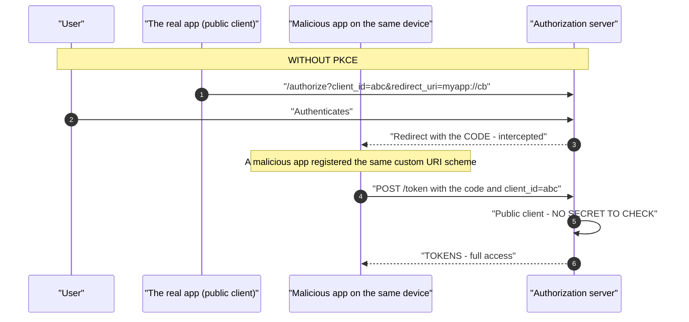
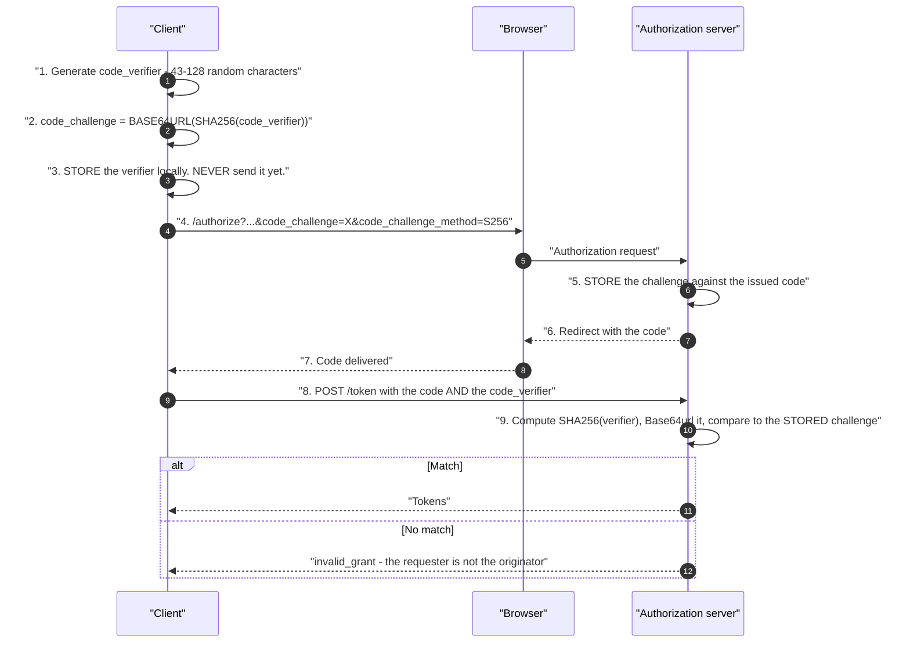
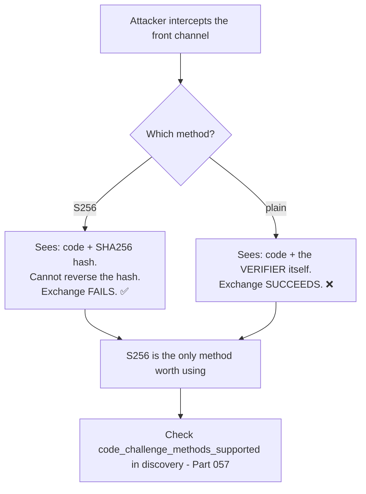
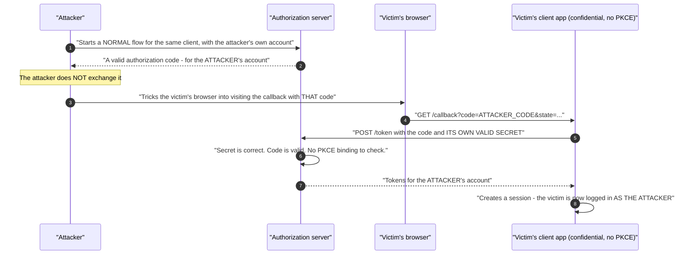
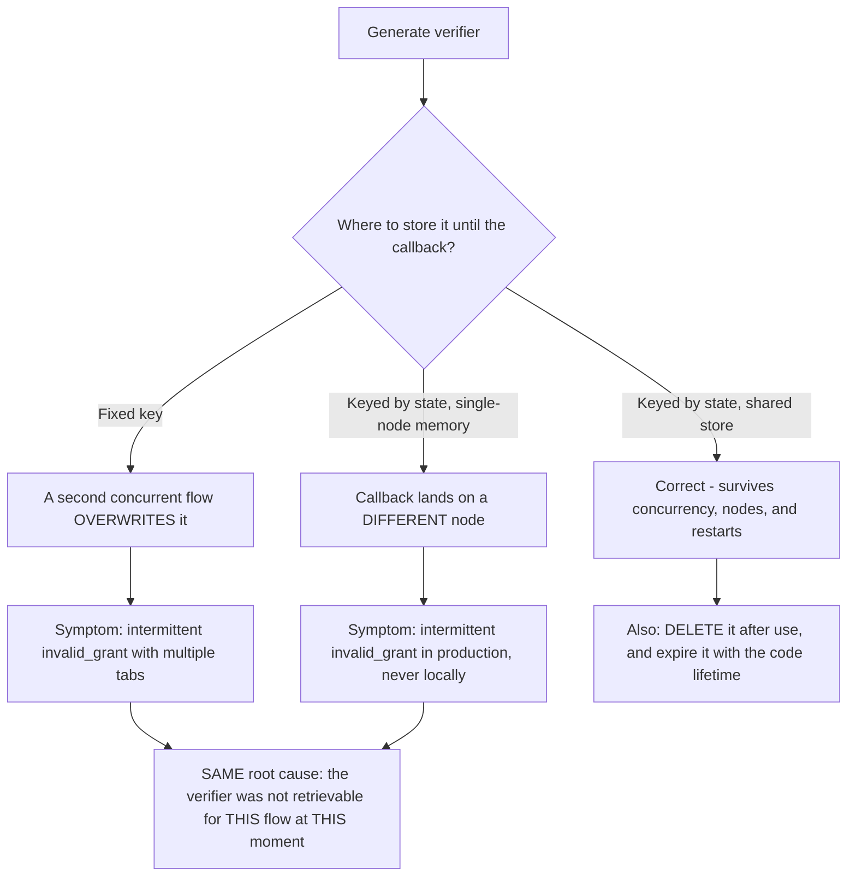
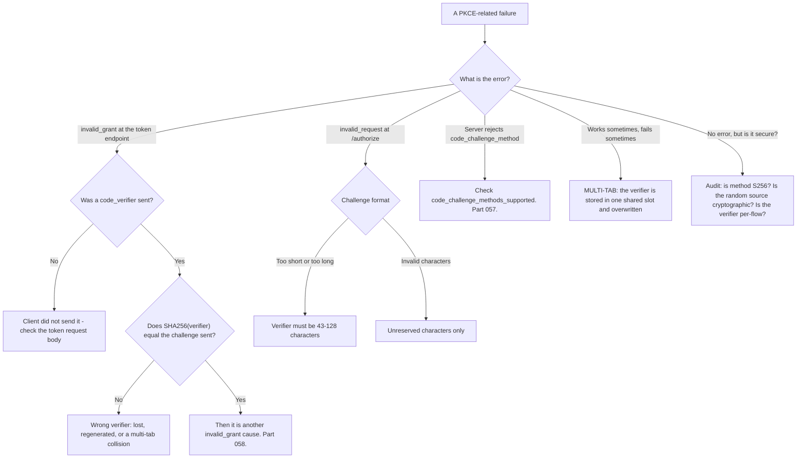

# Part 059 - PKCE From Zero

> Section goal: Understand exactly what PKCE does, the attack it prevents, why it is now recommended for every client including confidential ones, and how to diagnose the small set of ways it fails. PKCE is the single most asked-about OAuth detail in interviews for this kind of role.

Covers index item **059**. Maps to JD signals: *knowledge of OAuth*, *knowledge of encryption*, *basic security concepts*, *strong analytical and problem-solving skills*, and *communicate technical concepts clearly*.

---

## 1. Start From Zero: The Problem PKCE Solves

A confidential client proves itself at the token endpoint with a secret. A public client has no secret (Part 056). So what stops an attacker who intercepts the authorization code from exchanging it?

**The original attack was mobile-specific.** On mobile, a public client's redirect often used a custom URI scheme like `myapp://callback`, and **any application could register the same scheme**. A malicious app registering it received the code. With no secret required, it could exchange the code for tokens.

**Modern variants exist too** — a malicious browser extension, a compromised proxy, a leaked server log containing the callback URL — so the defence is no longer only about mobile.

> **Analogy.** Handing a collection stub to someone in a crowd who claims to be the recipient. Without a way to prove they are the person who handed it in, the stub alone is enough.
>
> **Where it stops:** a cloakroom attendant could ask for a name. Here the authorization server has never met the client before this exchange — so the proof has to be constructed within the flow itself. That is exactly what PKCE does.

---

## 2. How PKCE Works

**Proof Key for Code Exchange (RFC 7636).** The client creates a secret *per flow*, commits to it up front, and reveals it at exchange time.

| Term | Meaning |
|---|---|
| **`code_verifier`** | 43–128 random characters, generated **per flow**, kept locally |
| **`code_challenge`** | `BASE64URL(SHA256(verifier))` — sent in the authorization request |
| **`code_challenge_method`** | `S256` (hashed) or `plain` (the verifier itself) |

### Why it works

**The attacker sees the challenge** — it is in the front channel — and **never sees the verifier**, which only travels on the back channel at exchange time. Since the challenge is a SHA-256 hash, it cannot be reversed (Part 036). An intercepted code is useless without the verifier.

### 🔍 Plain-English deep-dive: `S256` versus `plain`, and why `plain` is nearly pointless

RFC 7636 defines two methods, and the difference matters more than it looks.

| Method | Challenge is | Security |
|---|---|---|
| **`S256`** | `BASE64URL(SHA256(verifier))` | ✅ The challenge reveals nothing |
| **`plain`** | The verifier itself | ❌ **The challenge IS the verifier** |

**With `plain`, the challenge and the verifier are the same value** — and the challenge travels through the front channel. So an attacker who can intercept the code can also intercept the challenge, which *is* the verifier, and complete the exchange. **`plain` provides protection only against an attacker who sees the code and not the authorization request** — a narrow and unreliable assumption, since both usually travel the same path.

**`plain` exists for a narrow historical reason:** devices without a SHA-256 implementation. That is effectively no device today, and the specification itself says clients **must** use `S256` where available.

**Two practical support consequences:**

**1. Check the discovery document.** `code_challenge_methods_supported` should include `S256`. If a server offers only `plain`, PKCE there is close to decorative (Part 057).

**2. Check what the client actually sends.** A client can send `code_challenge_method=plain` — or omit the parameter entirely, which **defaults to `plain`**. That default is the trap: a client sending a challenge with no method looks like it is using PKCE, and is using the weak variant. **In a HAR, the absence of `code_challenge_method` is as important as the presence of `code_challenge`.**

**Analogy:** committing to a sealed envelope containing your answer, versus writing the answer on the outside of the envelope. Only one of those is a commitment. **Where it stops:** an envelope could be steamed open. A SHA-256 hash cannot be reversed at all, which is why the commitment is genuinely binding rather than merely inconvenient.

---

## 3. PKCE for Confidential Clients Too

Originally for public clients. **Current guidance recommends it for all clients**, and the reasoning is worth knowing.

| Threat | Secret alone | Secret + PKCE |
|---|---|---|
| Attacker exchanges an intercepted code | ✅ Blocked — no secret | ✅ Blocked |
| **Code injection** — attacker injects their own code into a victim's flow | ❌ **Not blocked** | ✅ **Blocked** |
| Code leaked via logs or `Referer` | ✅ Blocked | ✅ Blocked |
| Compromised or mis-configured redirect | ⚠️ Partial | ✅ Stronger |

**The second row is the reason.** In an authorization code injection attack, the attacker obtains a code from their *own* legitimate flow and injects it into a victim's callback. Without PKCE, the victim's client exchanges it using its own valid secret — and ends up holding tokens for the **attacker's** account. The user is now logged in as the attacker, which is the Part 048 login-CSRF harm again.

**With PKCE, the injected code fails**, because the verifier the victim's client holds does not match the challenge the attacker's code was bound to.

**This is why OAuth 2.1 makes PKCE mandatory for all clients** (Part 066), and it is a good current-awareness point in an interview: *"PKCE isn't just a workaround for public clients any more."*

### 🔍 Plain-English deep-dive: authorization code injection, step by step

This attack is the reason for the change in guidance, and it is worth being able to walk rather than summarise — because the harm is counter-intuitive.

**The harm flows backwards from the intuition.** The victim is not impersonated — the victim is placed inside the *attacker's* account. Then they upload a document, enter payment details, connect a data source, or type something confidential, and all of it lands somewhere the attacker controls and can read at leisure.

**Why a client secret does not help:** the secret authenticates the *client*, and the client is genuine. Nothing in the exchange asks *"is this the code this client's flow produced?"* — which is exactly the question PKCE adds.

**Why PKCE stops it:** the victim's client holds verifier V from its own flow. The attacker's code is bound to challenge A. `SHA256(V)` does not equal A, so the exchange fails.

**Why `state` alone does not fully stop it:** `state` helps, and in a well-implemented client it blocks the simple version, because the injected response will not carry a `state` the victim's client issued. But there are variants — particularly where a client accepts a callback without a stored `state` — and defence in depth is the point. **`state` is checked by the client; PKCE is checked by the server. Two independent parties, two independent failures required.**

**The support-facing signal:** this is not something a customer will ever report, because there is no error. It surfaces during a security review, or after an incident where a user says *"my documents appeared in someone else's account."* **The preventive advice is simply: enable PKCE on confidential clients too** — it costs nothing and most SDKs support it with a flag.

**Analogy:** slipping your own cloakroom stub into someone's pocket so that when they collect, they collect *your* coat — and then they put their wallet in its pocket. **Where it stops:** a person would notice an unfamiliar coat. A user logged into an unfamiliar-but-plausible account frequently does not, especially in a fresh or empty workspace.

---

## 4. What PKCE Does Not Do

Being precise here separates real understanding from recitation.

| PKCE does **not** | Why |
|---|---|
| Authenticate the client | It proves *same party*, not *registered party*. A confidential client still needs its secret |
| Replace `state` | `state` is CSRF and return-context; PKCE is code binding. **Different jobs — use both** |
| Replace `nonce` | `nonce` binds the **ID token** to the request; PKCE binds the **code** |
| Protect tokens after issuance | Token theft is a separate problem (Part 055) |
| Make a public client confidential | Nothing can |
| Validate the redirect URI | Exact matching is still required (Part 065) |

**The `state`-versus-PKCE confusion is common enough to be worth a sentence:** developers see two random values in the flow and assume one is redundant. They defend different things at different points — `state` is checked by the *client* on the callback; the challenge is checked by the *server* at the token endpoint.

---

## 5. Generating the Verifier Correctly

| Requirement | Detail |
|---|---|
| **Length** | 43–128 characters |
| **Character set** | `A-Z a-z 0-9 - . _ ~` (unreserved) |
| **Randomness** | 🔴 A **cryptographically secure** source — never `Math.random()` |
| **Per flow** | A new verifier for every authorization request |
| **Storage** | Locally, until the exchange; then discard |

**Two failure modes here are silent and serious:**

**A weak random source.** `Math.random()` is not cryptographically secure and its output can be predicted from prior values. A predictable verifier defeats PKCE completely while looking perfectly correct in every capture.

**A reused verifier.** Using the same verifier across flows means an attacker who learns it once can exchange any future intercepted code. Both of these pass every functional test.

### 🔍 Plain-English deep-dive: where the verifier lives is the whole implementation

Generating the verifier is trivial. **Storing it correctly between two requests is where implementations actually fail**, and the storage choice determines which bugs you get.

| Storage | Survives | Fails when |
|---|---|---|
| **A JavaScript variable** | Nothing | Any navigation — including the authorization redirect. Unusable |
| **`sessionStorage`, fixed key** | The redirect | 🔴 **Multi-tab collisions** |
| **`sessionStorage`, keyed by `state`** | The redirect, multiple tabs | ✅ The correct browser answer |
| **A cookie** | The redirect | Size limits, and it is sent to the server unnecessarily |
| **Server memory, fixed key** | Nothing useful | Concurrent users; any restart |
| **Server memory, keyed by `state`** | Concurrent users | 🔴 **Load-balanced nodes; restarts** |
| **Shared server store, keyed by `state`** | Everything | ✅ The correct server answer |

**The two symptoms in that diagram are the same bug wearing different clothes**, and recognising that is genuinely useful: "fails with multiple tabs" and "fails intermittently in production but never locally" both mean the verifier was not retrievable for *this* flow at *this* moment.

**Two lifecycle details that are easy to omit.** Delete the verifier after a successful exchange — one left in browser storage is a value with no purpose, readable by any script that gets injected. And expire it, because an abandoned login otherwise leaves it lingering indefinitely.

**And the reason `state` is the right key** is that it is the only value guaranteed to be unique per flow *and* to come back on the callback. Anything else has to be threaded through separately, which is one more thing to get wrong.

**Analogy:** a single hook by the door for car keys, in a house where several people drive. It works perfectly until two people are out at once. **Where it stops:** a person notices the wrong keys. Code retrieves whatever is under the key it was given and fails a hundred milliseconds later with an error that names none of this.

---

## 6. Failure Modes

| Failure mode | What it looks like | Consequence | Correction |
|---|---|---|---|
| **No PKCE on a public client** | Works fine | 🔴 Code interception | Always use PKCE |
| **`plain` instead of `S256`** | Works fine | 🔴 The challenge *is* the verifier | `S256` always |
| **`code_challenge_method` omitted** | Defaults to `plain` | 🔴 Silently weak | Send it explicitly |
| **Weak random source** | Works fine | 🔴 **Predictable verifier** | Cryptographic randomness |
| **Verifier reused across flows** | Works fine | 🔴 One leak compromises all | New per flow |
| **Verifier lost between requests** | `invalid_grant` | Exchange fails | Store it with the flow state |
| **Verifier stored in a shared location** | Multi-tab collisions | Intermittent failures | Key it to the flow |
| **Challenge sent, verifier not** | `invalid_grant` | Exchange fails | Send both |
| **Verifier outside the allowed length** | `invalid_request` | Rejected | 43–128 characters |
| **Assuming PKCE replaces `state`** | `state` dropped | 🔴 Login CSRF returns | Use both |
| **Server offers only `plain`** | PKCE appears enabled | Weak protection | Check discovery (Part 057) |
| **PKCE on the server, absent on the client** | `invalid_request` | Flow fails | Both sides must agree |

---

## 7. Troubleshooting Decision Tree: PKCE Problems

### Worked example

*"PKCE works, except when users have several tabs open — then login randomly fails with `invalid_grant`."*

1. **"Fails only with multiple tabs" is nearly conclusive.** The verifier is stored in one shared slot.
2. **The mechanism:** tab A starts a flow and stores verifier A in `sessionStorage` under a fixed key. Tab B starts a flow and **overwrites** it with verifier B. Tab A's callback returns and reads verifier B, which does not match tab A's challenge.
3. **Confirm cheaply.** Ask them to open two tabs, start a login in each, complete the *first* one, and observe the failure. **Reproducing it deliberately turns "random" into "deterministic"**, which changes the whole conversation.
4. **The fix:** key the stored verifier by something unique to the flow. `state` is the natural key, since it is already unique per flow and already round-trips — store `{state: {verifier, returnTo}}` and look it up by the `state` returned on the callback.
5. **This also fixes their `state` handling**, if `state` was in one shared slot too — which it usually is, and which produces the same intermittent failure independently.
6. **Note the related case**, because it is the same bug in a different environment: server-side applications storing the verifier in memory behind a load balancer hit this whenever the callback lands on a different node (Part 047). The fix there is a shared session store.
7. **While you are in the code**, check the other two silent PKCE issues: is `code_challenge_method` explicitly `S256`, and is the verifier from a cryptographic random source? **Neither would ever produce a ticket**, and both are worth mentioning.

---

## 8. Lab: PKCE by Hand

**Purpose.** Generate and verify PKCE values yourself so the mechanism is concrete, then reproduce every failure mode.

**Prerequisites.** Parts 040, 057, 058 artifacts. A free Auth0 tenant with a SPA and a Regular Web Application.

**Steps.**

1. Create `okta-prep/labs/059-pkce/`.
2. **Generate a verifier by hand.** Use a cryptographic random source, 43–128 unreserved characters. **Record it.**
3. **Compute the challenge by hand.** SHA-256 the verifier, Base64url-encode the digest (Part 040). **Record it.** Confirm you can do this without a library that hides the steps.
4. **Verify your own arithmetic.** Independently recompute the challenge from the verifier and confirm it matches. **This is the exact check the authorization server performs.**
5. **Run a full flow manually** with your hand-generated values, no SDK (Part 058). Confirm the exchange succeeds.
6. **Break it — wrong verifier.** Exchange with a different verifier. **Record the exact error.**
7. **Break it — no verifier.** Omit it. Record the error and note whether it differs.
8. **Break it — length.** Try a 20-character verifier. Record where it is rejected — at `/authorize` or at the token endpoint.
9. **`plain` contrast.** Run a flow with `code_challenge_method=plain`. **Record that the challenge and verifier are identical** and write one line on what an interceptor gains.
10. **Omit the method.** Send `code_challenge` with no `code_challenge_method`. **Determine which method the server applied** — check the tenant log or test with a `plain`-style challenge. **This is the silent-default trap.**
11. **Check discovery.** Confirm `code_challenge_methods_supported` and record what your tenant offers.
12. **Multi-tab reproduction.** Build a minimal SPA that stores the verifier under a fixed key. Open two tabs, start both flows, complete the first. **Reproduce the failure.**
13. **Fix it** by keying storage on `state`. Repeat and confirm both tabs work.
14. **Confidential client + PKCE.** Run the flow on the Regular Web Application with **both** a client secret and PKCE. Confirm it succeeds — this is the OAuth 2.1 recommendation.
15. **Randomness audit.** Look at your SPA framework's PKCE implementation and **identify which random source it uses.** Write down the answer with a citation.
16. **Write the explainer.** `pkce-explained.md` — one page: the attack, the mechanism, `S256` versus `plain`, and why confidential clients should use it too.
17. **Failure catalog + manifest.** Complete `MANIFEST.md`.

**Expected evidence.** Hand-generated and hand-verified PKCE values, a manual flow with no SDK, four recorded failure errors, a `plain` contrast with written implications, a determined default-method behavior, a discovery check, a reproduced-then-fixed multi-tab failure, a confidential-client-plus-PKCE flow, a cited randomness audit, and a one-page explainer.

**Validation rubric.**

| Check | Pass condition |
|---|---|
| Hand-computed challenge | Independently verified |
| Manual flow | Succeeds with no SDK |
| Four failures | Distinct errors recorded |
| `plain` contrast | Identity of challenge and verifier demonstrated |
| Default method | Determined empirically |
| Multi-tab | Reproduced, then fixed by keying on `state` |
| Confidential + PKCE | Succeeds |
| Randomness audit | Source identified with a citation |
| Explainer | One page, four topics |

**Cleanup and privacy.** Lab tenant, synthetic users, localhost only. **The multi-tab reproduction must use your own application.** Delete both applications and revoke tokens at the end.

---

## 9. JD Mapping

| Supplied JD signal | How this Part supports it |
|---|---|
| **Knowledge of OAuth** | PKCE mechanically, not just by name |
| **Knowledge of encryption** | SHA-256 as a commitment; why it cannot be reversed |
| **Basic security concepts** | Code interception and code injection |
| Strong analytical and problem-solving skills | "Fails with multiple tabs" → shared storage key |
| **Communicate technical concepts clearly** | The sealed-envelope framing |
| Promote best practices | `S256` explicitly; PKCE for confidential clients too |
| Exceed expectations on response quality | Raising the silent randomness and method issues unprompted |

---

## 10. Candidate Honesty Note

- **Claim safety:** *Learned architecture and lab experience.* You have implemented PKCE by hand.
- **The strongest thing you can say:** *"PKCE lets a client with no secret prove it's the same party that started the flow. It generates a random verifier per flow, sends the SHA-256 hash of it — the challenge — in the authorization request, and reveals the verifier at the token endpoint. The attacker sees the challenge in the front channel and never the verifier, and a hash can't be reversed, so an intercepted code is useless."*
- **A second point that shows precision:** *"PKCE doesn't authenticate the client. It proves *same party*, not *registered party* — that's what a secret does, and a confidential client still needs one. It also doesn't replace `state` or `nonce`: `state` is CSRF and return context checked by the client on the callback, `nonce` binds the ID token, and PKCE binds the code and is checked by the server at the token endpoint. Three different jobs at three different points."*
- **A third, on current guidance:** *"PKCE is now recommended for confidential clients too, and OAuth 2.1 makes it mandatory. The reason is authorization code injection — an attacker injects a code from their own flow into a victim's callback, and without PKCE the victim's client exchanges it with its own valid secret and ends up holding tokens for the attacker's account. A secret doesn't stop that; PKCE does."*
- **A fourth, on a silent trap:** *"If `code_challenge_method` is omitted it defaults to `plain`, where the challenge *is* the verifier — so an interceptor who sees the authorization request has everything. A client sending a challenge with no method looks like it's using PKCE and is using the weak variant. In a HAR, the absence of that parameter matters as much as the presence of the challenge."*
- **A fifth, diagnostic:** *"'Fails only with multiple tabs' is a shared storage key — the verifier is stored under one fixed name and the second tab overwrites the first. Keying it on `state` fixes it, and the same bug appears server-side when the verifier is in memory behind a load balancer."*
- **A sixth, two things that never produce a ticket:** *"A verifier from `Math.random()` and a verifier reused across flows both defeat PKCE entirely and pass every functional test. Worth checking while you're in the code."*
- **Do not overstate:** you have not shipped a PKCE implementation in production. Say you have implemented and broken it in a lab.

---

## 11. Official Source Anchors

Accessed **26 August 2026**.

| Source | What it defines |
|---|---|
| IETF RFC 7636 (PKCE) | Verifier, challenge, `S256` and `plain`, and length requirements |
| IETF RFC 7636 §7.2 | Why `S256` must be used where available |
| OAuth 2.0 Security BCP | PKCE for all clients; authorization code injection |
| OAuth 2.1 draft | PKCE mandatory (Part 066) |
| IETF RFC 8252 (OAuth for Native Apps) | The mobile custom-scheme interception threat |
| OpenID Connect Core §3.1 | How PKCE combines with `nonce` |
| Auth0 documentation — authorization code flow with PKCE | Vendor implementation |
| Okta developer documentation — PKCE | Okta's implementation and requirements |

**Revalidate after 26 August 2026:** RFC 7636 is stable. Recheck OAuth 2.1 status, which changes PKCE from recommended to required.

---

## ⭐ Likely Interview Questions for This Section

### Q1. "Explain PKCE."
> *Model answer:* "It lets a client with no secret prove it's the same party that started the flow. Before redirecting, the client generates a random `code_verifier` — 43 to 128 characters from a cryptographic source — and computes a `code_challenge`, which is the Base64url of the SHA-256 hash of it. The challenge goes in the authorization request; the verifier stays local. The server stores the challenge against the code it issues. At the token endpoint the client sends the verifier, the server hashes it and compares to the stored challenge, and only a match yields tokens. It works because the attacker sees the challenge in the front channel but never the verifier, and a SHA-256 hash can't be reversed — so an intercepted code is useless on its own."

### Q2. "What attack does PKCE prevent?"
> *Model answer:* "Originally authorization code interception on mobile. A public client's redirect often used a custom URI scheme like `myapp://callback`, and any app on the device could register the same scheme — so a malicious app received the code, and with no client secret required it could exchange it for tokens. Modern variants are broader: a malicious browser extension, a compromised proxy, a callback URL sitting in a server log. And there's a second attack that matters even for confidential clients — authorization code injection, where an attacker injects a code from their own flow into a victim's callback. The victim's client exchanges it with its own valid secret and ends up holding tokens for the attacker's account. That's why current guidance recommends PKCE for everyone and OAuth 2.1 makes it mandatory."

### Q3. "What's the difference between `S256` and `plain`?"
> *Model answer:* "With `S256` the challenge is the SHA-256 hash of the verifier, so it reveals nothing — an attacker who intercepts the front channel gets a hash they can't reverse. With `plain` the challenge *is* the verifier, so an attacker who sees the authorization request has the verifier and can complete the exchange. `plain` only protects against an attacker who sees the code but not the authorization request, which is a narrow and unreliable assumption since both usually travel the same path. It exists for devices without SHA-256, which is effectively no device today, and the RFC says clients must use `S256` where available. The trap is that if `code_challenge_method` is omitted it defaults to `plain` — so a client sending a challenge with no method looks like it's using PKCE and is using the weak variant."

### Q4. "Does PKCE replace the client secret?"
> *Model answer:* "No, and that's a distinction worth being precise about. A secret proves 'I am the registered client' — an identity claim. PKCE proves 'I am the same party that started this flow' — a continuity claim. Those are different properties. A public client can't honestly make the identity claim at all, because anything shipped to a user's device is readable, so PKCE gives it the property that actually matters against code interception. A confidential client should do both: the secret authenticates it, and PKCE additionally binds the code to this specific flow, which is what defeats code injection. So PKCE is a complement, not a substitute — and current guidance is to use both wherever you can."

### Q5. "Does PKCE replace `state`?"
> *Model answer:* "No — they're different jobs at different points, and developers conflate them because both are random values in the same flow. `state` is CSRF protection and return context: the client generates it, stores it, and *the client* compares it on the callback. If it doesn't match, the response didn't come from a flow this application started, which is what stops login CSRF. PKCE binds the authorization code to the flow, and *the server* checks it at the token endpoint. Dropping `state` because you have PKCE reintroduces login CSRF — an attacker can still cause a victim's browser to deliver a response the victim's application will process. Use both. And in OIDC there's a third, `nonce`, which binds the ID token to the request rather than the code."

### Q6. "PKCE fails only when users have multiple tabs open. Why?"
> *Model answer:* "The verifier is being stored under one fixed key. Tab A starts a flow and writes verifier A to `sessionStorage`; tab B starts a flow and overwrites it with verifier B; tab A's callback comes back, reads verifier B, and it doesn't match tab A's challenge — so `invalid_grant`. The fix is to key the stored verifier by something unique to the flow, and `state` is the natural choice because it's already unique per flow and already round-trips. Store the verifier and the return URL against the `state` value, then look them up by the `state` on the callback. The same bug shows up server-side when the verifier lives in memory behind a load balancer and the callback lands on a different node — same cause, different environment, and the fix there is a shared session store."

### Q7. "What would you check in a PKCE implementation that isn't producing errors?"
> *Model answer:* "Three things that fail silently and pass every functional test. First, is `code_challenge_method` explicitly `S256`? If it's omitted it defaults to `plain`, which is nearly pointless. Second, what random source generates the verifier? `Math.random()` isn't cryptographically secure and its output can be predicted from prior values, which defeats PKCE entirely while looking perfectly correct in every capture. Third, is a new verifier generated per flow, or is one reused? A reused verifier means anyone who learns it once can exchange any future intercepted code. None of those three would ever produce a ticket, which is exactly why they're worth raising when you're already looking at the code for something else."

### Q8. "How would you verify PKCE is actually working?"
> *Model answer:* "Compute it myself and compare. Take the verifier the client generated, SHA-256 it, Base64url-encode the digest, and check it matches the challenge that was sent in the authorization request — that's precisely the comparison the server makes, and doing it by hand once makes the mechanism concrete rather than magical. Then test the negative case, because that's what proves the check is live: exchange a code with a deliberately wrong verifier and confirm you get `invalid_grant`. If a wrong verifier still succeeds, PKCE isn't being enforced. And I'd check the discovery document for `code_challenge_methods_supported`, because if a server only offers `plain`, PKCE there is close to decorative regardless of what the client does."

---

## 🧠 30-Second Memory Hooks

- **PKCE = proof you are the SAME PARTY that started the flow.** Not proof of identity.
- **`code_verifier`** = 43–128 random chars, **per flow**, **cryptographic** source.
- **`code_challenge` = BASE64URL(SHA256(verifier))**.
- **Challenge goes in the FRONT channel. Verifier goes in the BACK channel.**
- **A hash cannot be reversed** → an intercepted code is useless.
- **`plain` = the challenge IS the verifier.** Nearly pointless.
- **Omitting `code_challenge_method` DEFAULTS TO `plain`.** Silent weakness.
- **PKCE ≠ client secret.** Same-party vs registered-party. Use both.
- **PKCE ≠ `state`.** Server checks PKCE at the token endpoint; **client** checks `state` on the callback.
- **Now recommended for CONFIDENTIAL clients too** — stops **code injection**. Mandatory in OAuth 2.1.
- **"Fails with multiple tabs" = one shared storage key.** Key it on `state`.
- **`Math.random()` and a reused verifier both defeat PKCE silently.**

---

## ✅ Completion Checklist

- [ ] **Knowledge:** I can compute a challenge by hand, explain the attack, and state the three things PKCE does not do.
- [ ] **Lab artifact:** `059-pkce/` contains hand-computed values, a manual flow, four failure errors, a `plain` contrast, a reproduced-then-fixed multi-tab failure, and a randomness audit.
- [ ] **Spoken:** I can explain PKCE in 45 seconds and distinguish it from `state` and a client secret in 30.
- [ ] **Judgement:** I raise the method default and the random source unprompted.
- [ ] **Honesty check:** I say "implemented and broken in a lab."
- [ ] **Source check:** I have read RFC 7636 §4 and §7.2 myself.

---

*Next suggested section:* **[Part 060 - Client Credentials and Machine-to-Machine Access](Part-060-client-credentials-and-machine-to-machine-access.md)** — the flow with no user at all, and the operational discipline that machine identity demands.
