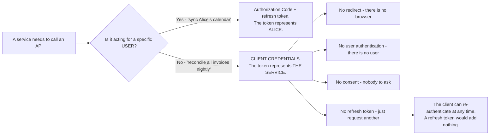
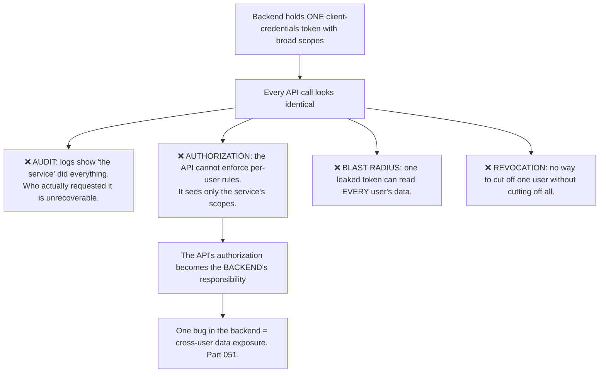
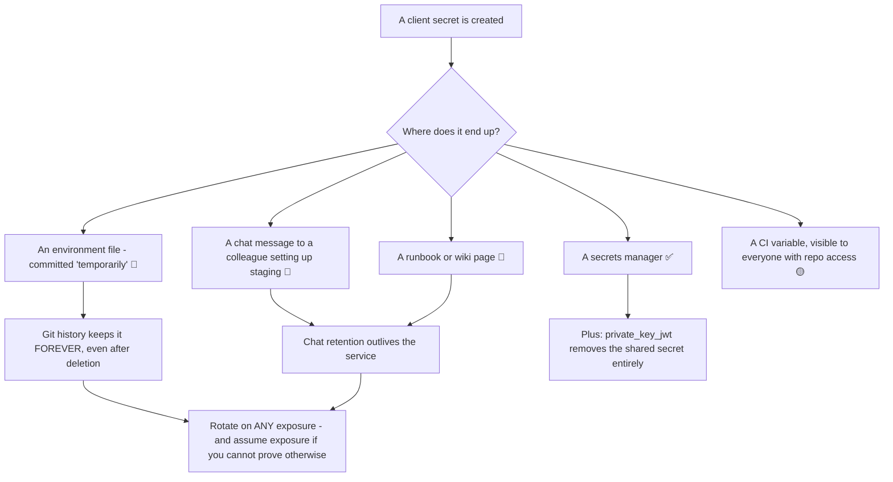
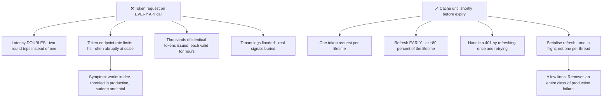
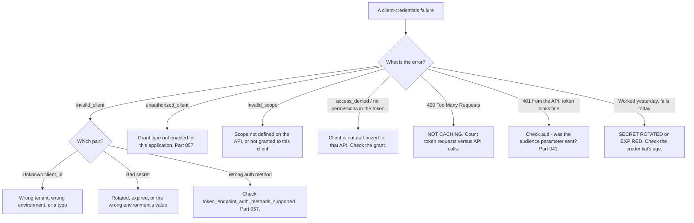

# Part 060 - Client Credentials and Machine-to-Machine Access

> Section goal: Understand the flow with no user at all — when it is correct, when it is being misused, and the operational discipline machine identity demands. Machine identities now vastly outnumber human ones, and this is the flow behind almost all of them.

Covers index item **060**. Maps to JD signals: *knowledge of OAuth*, *basic security concepts*, *knowledge of authentication and authorization*, *strong analytical and problem-solving skills*, and *promote best practices*.

---

## 1. Start From Zero: No User, No Browser, No Consent

Some access is not on anyone's behalf. A nightly batch job, a webhook receiver, a service calling another service — there is no user to redirect, authenticate, or ask.



**The whole flow is one request:**

```http
POST /oauth/token HTTP/1.1
Content-Type: application/x-www-form-urlencoded

grant_type=client_credentials
&client_id=abc123
&client_secret=SECRET
&audience=https://api.example.com
&scope=read:invoices write:invoices
```

```json
{ "access_token": "eyJ...", "token_type": "Bearer", "expires_in": 86400 }
```

**No `sub` for a user.** The `sub` is the client itself — typically `<client_id>@clients` or similar.

> **Analogy.** A contractor's own site pass, issued to the company rather than borrowed from an employee. It opens what the contract covers, it is auditable as the contractor's, and it is cancelled when the contract ends — without touching anyone's personal pass.
>
> **Where it stops:** a contractor pass is checked by a person who can see who is holding it. A client credentials token is a bearer token — anything holding the secret is the service, which is why secret handling is the entire security story here.

---

## 2. When It Is Correct — and When It Is Not

| Scenario | Correct? |
|---|---|
| Nightly data reconciliation | ✅ Yes |
| Service A calling service B | ✅ Yes |
| A webhook receiver calling back | ✅ Yes |
| CI/CD calling a deployment API | ✅ Yes |
| **A backend acting on a specific user's behalf** | ❌ **No** — use the user's token |
| **A mobile app** | ❌ **No** — public client, cannot hold a secret |
| **A SPA** | ❌ **No** — the secret would be published |
| **Avoiding the complexity of user login** | ❌ **No** — this is the dangerous misuse |

### 🔍 Plain-English deep-dive: the misuse that erases every user distinction

The tempting shortcut: rather than implementing user login and passing user tokens between services, a backend uses one client credentials token for **everything** and decides internally which user each request is for.

It works immediately and it destroys four properties at once.



**The second consequence is the serious one.** With a user token, the API can check *"may this user read this record?"* With a service token, the API can only check *"may this service read records?"* — so the entire per-user authorization decision moves into the calling backend. One missing check there, and a user reads another user's data. That is the failure that becomes a public incident.

**The legitimate version of the same architecture** does exist, and knowing it makes the advice constructive rather than obstructive:

| Approach | When |
|---|---|
| **Pass the user's access token through** | The simplest correct answer for service-to-service on a user's behalf |
| **Token exchange (RFC 8693)** | Service A exchanges the user's token for one scoped to service B, preserving the user identity (Part 067) |
| **Client credentials + an explicit user context** | Acceptable **only** when the API is designed for it and the service is genuinely trusted to assert identity |

**The support-facing question that opens this well:** *"When your API logs this request, who does it say made it?"* If the answer is "the service" for every request regardless of which user triggered it, the audit and authorization gaps follow from that single fact — and the customer usually reaches the conclusion themselves.

**Analogy:** a building where one contractor signs in and then admits everyone else through a side door. The log shows one visitor; the building has no idea who is inside. **Where it stops:** a building could count people. An API cannot see past the token it was given, so there is genuinely nothing to reconstruct afterwards.

---

## 3. Client Authentication Methods

The client must prove it is itself. There is more than one way.

| Method | How | Strength |
|---|---|---|
| **`client_secret_basic`** | Secret in the `Authorization: Basic` header | Common |
| **`client_secret_post`** | Secret in the form body | Common; slightly worse for logging |
| **`private_key_jwt`** | Client signs a JWT assertion with its private key | ✅ **Stronger — no shared secret** |
| **`tls_client_auth`** | Mutual TLS certificate (Part 038) | ✅ Strong; heavier |
| `none` | For public clients — not applicable here | n/a |

**`private_key_jwt` is worth understanding**, because it removes the shared secret entirely: the client holds a private key, the authorization server holds only the public key. **A breach of the authorization server's client registry yields nothing usable** — the same asymmetric advantage as passkeys (Part 050).

**Check `token_endpoint_auth_methods_supported` in discovery** (Part 057) to see what a given server offers.

### 🔍 Plain-English deep-dive: a client secret is a password with worse hygiene

It helps to be blunt about what a client secret actually is: **a long password belonging to a service**. Every problem passwords have, it has — plus several of its own.

| Property | A human password | A client secret |
|---|---|---|
| Rotated regularly | Sometimes | 🔴 **Almost never** |
| Stored hashed by the holder | n/a | Stored in **plaintext** wherever the service can read it |
| Protected by MFA | Often | ❌ **Never — impossible** |
| Shared between people | Discouraged | 🔴 **Routinely** — in a wiki, a chat message, a config repo |
| Noticed when leaked | Sometimes | ❌ There is nobody to notice |
| Expires | Often | 🔴 Usually never |



**The git-history point is the one people get wrong.** Deleting a secret from a file and committing the deletion does **not** remove it — it remains in history, retrievable by anyone with repository access, forever. **A secret that has ever been committed must be rotated, not deleted.** Saying that plainly saves customers from a false sense of resolution.

**Why `private_key_jwt` genuinely changes this:** with a private key, there is nothing to share. Nobody can paste it into a chat message usefully, the authorization server never holds anything sensitive, and a leak of the server's registry yields only public keys. It converts a password problem into a key-management problem, which is harder to set up and much harder to get *quietly* wrong.

**The support-facing version:** if a customer mentions a secret was in a repository, in a chat, or in a shared document, the answer is rotation — and the reason is worth one sentence, because "we removed it" feels like a fix and is not.

**Analogy:** a house key you cannot change the lock for, copied and left with several neighbours over the years, with no record of who has one. **Where it stops:** you would eventually change the lock. A client secret that never expires and never rotates simply stays valid, and nothing in the system will ever raise the question.

---

## 4. Operational Discipline

Machine credentials have a lifecycle that nobody is prompted to manage.

| Concern | Practice |
|---|---|
| **Storage** | A secrets manager. **Never** in source control, environment files committed to a repository, or a wiki |
| **Rotation** | Scheduled, with an overlap window so nothing breaks mid-rotation |
| **Scope** | Narrow. A service should hold only what it calls |
| **One identity per service** | Not one shared across five services — otherwise rotation blocks on five teams |
| **Expiry** | Tokens are short-lived; the client re-requests |
| **Caching** | 🔴 **Cache the token.** Requesting one per API call is the most common performance bug here |
| **Monitoring** | Alert on unusual usage — a service's pattern is far more predictable than a human's |
| **Offboarding** | Revoke when the service is decommissioned. Nothing else will |

### 🔍 Plain-English deep-dive: token caching is the mistake everyone makes once

The single most common client-credentials implementation error: **requesting a new token for every API call.**

The code looks clean — get a token, call the API — and it works perfectly in development where the call rate is one per test.



**The failure shape is distinctive:** development is fine, staging is fine, production hits a token-endpoint rate limit at some traffic threshold — and then **everything** fails at once, because no API call can proceed without a token. It looks like a total outage with no deployment, which sends people looking in the wrong place.

**Four rules for a correct implementation:**

1. **Cache the token** in memory, keyed by audience and scope set.
2. **Refresh proactively** at around 80% of the lifetime, so no request ever waits on an expired token.
3. **On a 401, refresh once and retry once.** Not in a loop — a loop turns a configuration error into a self-inflicted denial of service.
4. **Serialise the refresh.** Under load, a hundred threads noticing expiry simultaneously will each request a token. One in flight, others wait.

**Rule 4 is the one people miss**, and it is the same cross-tab serialisation problem as Part 047 in a different setting. The symptom is a burst of token requests at regular intervals matching the token lifetime — **periodic, which makes it look like a scheduled job and not like a bug.**

**The diagnostic question:** *"How many token requests do you make per hour, and how many API calls?"* If those numbers are similar, that is the finding, and it is usually reported as "the API is slow" or "we're being rate limited" rather than as a caching question.

**Analogy:** collecting a fresh day pass from reception before every single meeting, in a building where the pass is valid all day. **Where it stops:** a receptionist would eventually say something. A token endpoint issues them silently until a limit is reached, and then refuses all of them at once.

---

## 5. Failure Modes

| Failure mode | What it looks like | Consequence | Correction |
|---|---|---|---|
| **No token caching** | Token per API call | 🔴 Rate-limited; sudden total failure | Cache; refresh at ~80% |
| **Unserialised refresh** | Burst at intervals | Rate limits | One refresh in flight |
| **Retry loop on 401** | Refresh, fail, repeat | 🔴 Self-inflicted DoS | Refresh once, retry once |
| **Client credentials for user access** | One token for everything | 🔴 **No audit, no per-user authorization** | User tokens or token exchange |
| **Secret in source control** | Convenient | 🔴 **Public if the repo ever is** | Secrets manager |
| **Secret in a mobile or SPA build** | "It's minified" | 🔴 Published (Part 056) | Not a valid use case |
| **One shared identity across services** | Simpler to set up | Rotation blocks on everyone | One per service |
| **Never rotating** | Nothing breaks | Indefinite exposure | Scheduled rotation with overlap |
| **Rotation with no overlap** | Old secret invalidated instantly | **Outage during rotation** | Overlap window |
| **Over-broad scopes** | `admin:all` for a read job | 🔴 Blast radius (Part 052) | Narrow scopes |
| **No decommission step** | Service retired, credential lives on | 🔴 Orphaned valid credential | Revoke at decommission |
| **Expecting a refresh token** | Not issued | Confusion | Just request a new token |
| **Human account used as a service** | Simple | 🔴 Breaks at offboarding; MFA exempted (Part 046) | A real machine identity |

---

## 6. Troubleshooting Decision Tree: Machine-to-Machine Failures



### Worked example

*"Our nightly job started failing with 429s. It's been running for two years unchanged."*

1. **"Unchanged for two years" plus a *new* 429 means something scaled.** The code is the same; the volume is not.
2. **Ask the diagnostic ratio:** how many token requests per run, and how many API calls? Answer: they are equal — one token per call.
3. **That has always been true.** It only started failing when the data volume grew past the rate limit. **This matters to say explicitly**, because "it's been fine for two years" is being used as evidence the code is correct, and it is actually evidence that the code has been on a collision course for two years.
4. **The fix:** cache the token. A client credentials token typically lives for hours; one per run is usually enough.
5. **Add the three companion rules:** refresh at ~80% of the lifetime, refresh once and retry once on a 401 rather than looping, and serialise refresh if the job is concurrent.
6. **Check the token lifetime while you are there.** If it is short and the job runs long, one token per run is not enough and proactive refresh is doing real work.
7. **Look for the same pattern elsewhere.** A team that wrote this once has usually written it in every service. **Offering to check the others is worth more than the fix.**
8. **Suggest a guardrail:** an alert if the token-request rate approaches the limit, so the next growth curve is visible before it is an outage.

---

## 7. Lab: Machine-to-Machine

**Purpose.** Build a correct client-credentials integration, reproduce the caching failure, and practise credential rotation without downtime.

**Prerequisites.** Parts 044, 052, 057, 058 artifacts. A free Auth0 tenant with an API and a Machine-to-Machine application.

**Steps.**

1. Create `okta-prep/labs/060-m2m/`.
2. **Register an M2M application** and authorize it for your test API with two narrow scopes. **Record which scopes you granted and why.**
3. **Obtain a token with curl.** Record the full request and response. **Decode the token** (Part 040) and note `sub`, `aud`, `scope`, `gty`, and the absence of user claims.
4. **Compare to a user token.** Put them side by side and record every difference. **The absent user identity is the point.**
5. **Confirm no refresh token.** Request `offline_access` and record what happens.
6. **Build the naive client.** Request a token per API call. Make 100 calls and **measure total time and token requests.**
7. **Hit the limit.** Increase the rate until you see a 429. **Record the error and the rate at which it appeared.**
8. **Build the cached client.** Cache the token, refresh at 80% of lifetime. Repeat the 100 calls and **measure again.** Record both numbers side by side — this contrast is the artifact.
9. **Add concurrency.** Run 20 concurrent workers with an expired cache. **Count the token requests.** Then serialise the refresh and count again.
10. **Handle 401 correctly.** Force an invalid token and confirm your client refreshes **once** and retries **once**, without looping.
11. **Rotate without downtime.** Create a second client secret if your tenant supports it, deploy the new value, verify, then remove the old one. **Record the sequence and what would have broken with no overlap.**
12. **Omit `audience`.** Request a token without it and record what happens — for client credentials the behavior differs from the user flow, and knowing which is useful.
13. **Over-scope experiment.** Grant the application a broad scope, obtain a token, and **write one paragraph on what a leak of that token would mean** versus the narrow version.
14. **`private_key_jwt`.** If supported, configure it and obtain a token. **Write two sentences on why it is stronger than a shared secret.**
15. **Decommission.** Delete the application and confirm existing tokens stop working — or **measure how long they keep working** (Part 045).
16. **Write the guidance.** `m2m-checklist.md` — one page: when client credentials is correct, the four caching rules, secret handling, rotation with overlap, and decommissioning.
17. **Failure catalog + manifest.** Complete `MANIFEST.md`.

**Expected evidence.** A token decoded and contrasted with a user token, confirmed absence of a refresh token, measured naive-versus-cached performance, a reproduced 429 with its threshold, a concurrency contrast before and after serialisation, correct 401 handling, a zero-downtime rotation sequence, an over-scope analysis, a `private_key_jwt` rationale, decommission behavior measured, and a one-page checklist.

**Validation rubric.**

| Check | Pass condition |
|---|---|
| Token decoded | `sub` is the client; no user claims |
| User-token contrast | Differences tabulated |
| Naive vs cached | Both measured, side by side |
| 429 reproduced | Threshold recorded |
| Concurrency | Token count before and after serialisation |
| 401 handling | One refresh, one retry, no loop |
| Rotation | Zero-downtime sequence documented |
| Over-scope | Written blast-radius analysis |
| Decommission | Post-deletion token behavior measured |

**Cleanup and privacy.** Lab tenant only. **Store the client secret in an environment variable or a local secrets file that is git-ignored** — never in a committed file, even in a lab, because the habit is what carries. Delete the application and revoke tokens at the end. Never point M2M tooling at an employer or customer tenant.

---

## 8. JD Mapping

| Supplied JD signal | How this Part supports it |
|---|---|
| **Knowledge of OAuth** | The no-user grant and its correct application |
| **Basic security concepts** | Secret handling, rotation, blast radius, `private_key_jwt` |
| Knowledge of authentication and authorization | Why a service token cannot carry per-user authorization |
| **Strong analytical and problem-solving skills** | "Unchanged for two years" reframed as a scaling collision |
| **Promote best practices** | The four caching rules; rotation with overlap |
| Exceed expectations on response quality | Checking whether the same pattern exists elsewhere |
| Communicate technical concepts clearly | "Who does your API's log say made this request?" |

---

## 9. Candidate Honesty Note

- **Claim safety:** *Learned architecture and lab experience.*
- **The strongest thing you can say:** *"Client credentials is for when there's no user — a batch job, a service calling a service, CI/CD. There's no redirect, no user authentication, no consent, and no refresh token, because the client can just request another one at any time. The `sub` is the client itself, not a person."*
- **A second point, and it is the misuse that matters:** *"Using one client-credentials token for everything and deciding internally which user each request is for destroys four things: audit, because the log says 'the service' did everything; per-user authorization, because the API can only see the service's scopes; blast radius, because one leaked token reads every user's data; and per-user revocation. The question that opens this conversation well is 'when your API logs this request, who does it say made it?'"*
- **A third, and it is constructive rather than obstructive:** *"There are legitimate versions — pass the user's token through, or use token exchange so service B gets a token that still carries the user identity. Naming those turns 'you're doing it wrong' into 'here are two ways to keep your architecture and fix the gap.'"*
- **A fourth, the most common implementation bug:** *"Requesting a token per API call. It works in development where the call rate is one, and in production it hits the token endpoint's rate limit — and then everything fails at once, because no call can proceed without a token. So it looks like a total outage with no deployment. The fix is four rules: cache it, refresh at about 80% of the lifetime, refresh once and retry once on a 401 rather than looping, and serialise the refresh so a hundred threads don't each request one."*
- **A fifth, a reframe worth having ready:** *"'It's been running unchanged for two years' is often offered as evidence the code is correct. Usually it means the code has been on a collision course for two years and the volume finally reached it."*
- **A sixth:** *"Rotation needs an overlap window. Invalidating the old secret the moment the new one is created turns a routine rotation into an outage, which is why rotations get postponed indefinitely."*
- **Do not overstate:** you have not operated machine identities at scale. Say the flow and its operational discipline are clear and lab-tested.

---

## 10. Official Source Anchors

Accessed **26 August 2026**.

| Source | What it defines |
|---|---|
| IETF RFC 6749 §4.4 | The client credentials grant |
| IETF RFC 6749 §2.3 | Client authentication methods |
| IETF RFC 7523 | JWT client assertions — `private_key_jwt` |
| IETF RFC 8705 | Mutual TLS client authentication |
| IETF RFC 8693 | Token exchange (Part 067) |
| OAuth 2.0 Security BCP | Client authentication and credential handling |
| Auth0 documentation — Machine-to-Machine applications and rate limits | Vendor behavior, lifetimes, and limits |
| Okta developer documentation — client credentials flow | Okta's implementation |
| OWASP — Secrets Management cheat sheet | Storage, rotation, and decommissioning |

**Revalidate after 26 August 2026:** the RFCs are stable. Recheck vendor rate limits and token lifetimes, which change.

---

## ⭐ Likely Interview Questions for This Section

### Q1. "When would you use client credentials?"
> *Model answer:* "When there's no user involved at all — a nightly reconciliation job, one service calling another, a webhook receiver, CI/CD calling a deployment API. The service authenticates as itself with a client ID and a secret, or better a signed JWT assertion, and gets a token representing the service rather than a person. There's no redirect because there's no browser, no user authentication because there's no user, no consent because there's nobody to ask, and no refresh token — which surprises people, but the client can re-authenticate at any time, so a refresh token would add nothing. The `sub` in the resulting token is the client itself, usually something like `<client_id>@clients`, and there are no user claims."

### Q2. "What's wrong with using client credentials for user-facing operations?"
> *Model answer:* "It erases the user from the system. The audit log shows 'the service' did everything, so who actually requested an action is unrecoverable. The API can't enforce per-user authorization, because it only sees the service's scopes — so the entire per-user decision moves into the calling backend, and one missing check there is cross-user data exposure. The blast radius is every user's data if that one token leaks. And you can't revoke access for one user without cutting off all of them. The question I'd ask is 'when your API logs this request, who does it say made it?' — customers usually reach the conclusion themselves from that. Then I'd offer the legitimate alternatives: pass the user's token through, or use token exchange so the downstream service gets a token that still carries the user identity."

### Q3. "A customer's M2M integration is getting rate limited. Where do you look?"
> *Model answer:* "Token caching, almost certainly. The classic bug is requesting a new token for every API call — the code looks clean and it works perfectly in development where the call rate is one per test. I'd ask for the ratio: token requests per hour versus API calls per hour. If those numbers are similar, that's the finding. The failure shape is distinctive too: it works in dev and staging, then production hits the limit at some traffic threshold, and *everything* fails at once because no call can proceed without a token — so it presents as a total outage with no deployment. The fix is four rules: cache the token keyed by audience and scope, refresh proactively at around 80% of its lifetime, on a 401 refresh once and retry once rather than looping, and serialise refresh so a hundred concurrent threads don't each request one."

### Q4. "Why is there no refresh token in this flow?"
> *Model answer:* "Because a refresh token exists to avoid re-prompting a user, and there's no user here. The client holds its own credentials permanently, so when a token expires it just requests another — the same single POST that got the first one. A refresh token would be a second long-lived secret providing exactly the capability the client already has. It's a good illustration of the general principle that each grant type and each token type exists to answer a specific constraint: no user means no re-prompt, so no refresh token. Customers do sometimes request `offline_access` on this flow and are confused when nothing comes back, and that's the explanation."

### Q5. "How should machine credentials be managed?"
> *Model answer:* "One identity per service, never shared — otherwise a rotation blocks on five teams and therefore never happens. Secrets in a secrets manager, never in source control or a committed environment file or a wiki, because those all end up somewhere they shouldn't. Narrow scopes, so a leak is bounded. Scheduled rotation with an overlap window, which is the part people get wrong: if creating the new secret invalidates the old one immediately, rotation is an outage, which is exactly why rotations get postponed indefinitely. Monitoring, which is easier here than for humans because a service's usage pattern is far more predictable — a deviation is genuinely meaningful. And a decommissioning step, because when a service is retired nothing will prompt anyone to revoke its credential and it just sits there, valid."

### Q6. "What's `private_key_jwt` and why prefer it?"
> *Model answer:* "Instead of sending a shared secret, the client signs a short-lived JWT assertion with its private key and sends that to the token endpoint. The authorization server verifies it with the client's public key. The advantage is that there's no shared secret at all — the server holds only public material, so a breach of its client registry yields nothing usable, and the secret never travels over the network on each request. It's the same asymmetric advantage as passkeys: only one party can produce the proof, and the verifier's copy is worthless to an attacker. The cost is key management on the client side, which is why shared secrets are still more common. I'd check `token_endpoint_auth_methods_supported` in the discovery document to see whether a given server offers it."

### Q7. "A job has run unchanged for two years and started failing with 429s. What's happening?"
> *Model answer:* "Something scaled — the code is the same, the volume isn't. Almost certainly it's been requesting a token per API call since day one, and the data volume finally crossed the rate limit. I'd want to say that explicitly, because 'unchanged for two years' is usually offered as evidence the code is correct, when it actually means the code has been on a collision course for two years and today is when it arrived. The fix is caching, plus the companion rules. Then two things beyond the fix: check whether the same pattern exists in their other services, because a team that wrote it once usually wrote it everywhere, and suggest an alert on the token-request rate so the next growth curve is visible before it's an outage."

### Q8. "How do you rotate a client secret without downtime?"
> *Model answer:* "With an overlap window, and the order matters. Create a second secret while the first is still valid — most providers support two concurrently. Deploy the new value to your services and verify they're using it successfully, ideally by watching the token endpoint or your own logs. Only then remove the old one. The failure people hit is that creating a new secret in some systems invalidates the old immediately, so every running service breaks the instant you click the button — and that experience is exactly why rotations get postponed forever. I'd also make it a scheduled, boring, practised operation rather than an emergency one, because a rotation you've never rehearsed is the last thing you want to be attempting during an incident where a credential has actually leaked."

---

## 🧠 30-Second Memory Hooks

- **Client credentials = NO user, NO browser, NO consent, NO refresh token.**
- **One POST.** `grant_type=client_credentials` + client auth + audience + scope.
- **`sub` is the CLIENT**, not a person.
- **Misuse = one service token for all users** → no audit · no per-user authz · huge blast radius · no per-user revocation.
- **"Who does your API's log say made this request?"** — the question that opens it.
- **Legitimate alternatives:** pass the user token through, or **token exchange** (Part 067).
- **THE bug: a token per API call.** Works in dev, throttled in production, **fails totally**.
- **Four caching rules:** cache · refresh at **80%** · **refresh once, retry once** · **serialise**.
- **"Unchanged for two years" usually means "on a collision course for two years."**
- **Rotate with an OVERLAP window**, or rotation is an outage.
- **`private_key_jwt` > shared secret** — the server holds only public material.
- **Decommission = revoke.** Nothing else will.

---

## ✅ Completion Checklist

- [ ] **Knowledge:** I can state when client credentials is correct, the four consequences of misuse, and the four caching rules.
- [ ] **Lab artifact:** `060-m2m/` contains a decoded service token contrasted with a user token, measured naive-versus-cached performance, a reproduced 429, a concurrency contrast, a zero-downtime rotation, and a one-page checklist.
- [ ] **Spoken:** I can diagnose the caching bug in 30 seconds and explain the misuse in 60.
- [ ] **Judgement:** I offer token exchange and token pass-through rather than only objecting.
- [ ] **Honesty check:** I say "lab experience," not operating machine identities at scale.
- [ ] **Source check:** I have read RFC 6749 §4.4 and RFC 7523's assertion format myself.

---

*Next suggested section:* **[Part 061 - Refresh Tokens, Rotation, and Reuse Detection](Part-061-refresh-tokens-rotation-and-reuse-detection.md)** — the long-lived credential, how rotation makes it safe in a browser, and the race conditions that make it fail.
