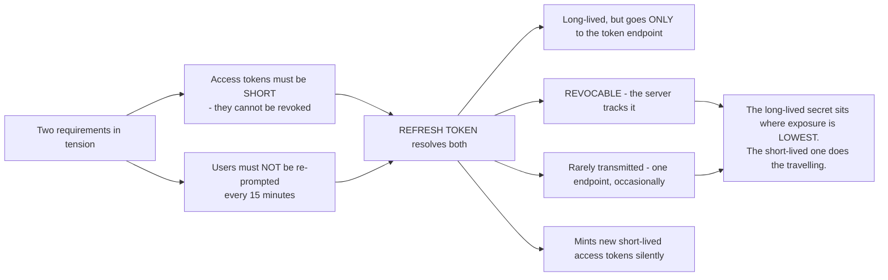
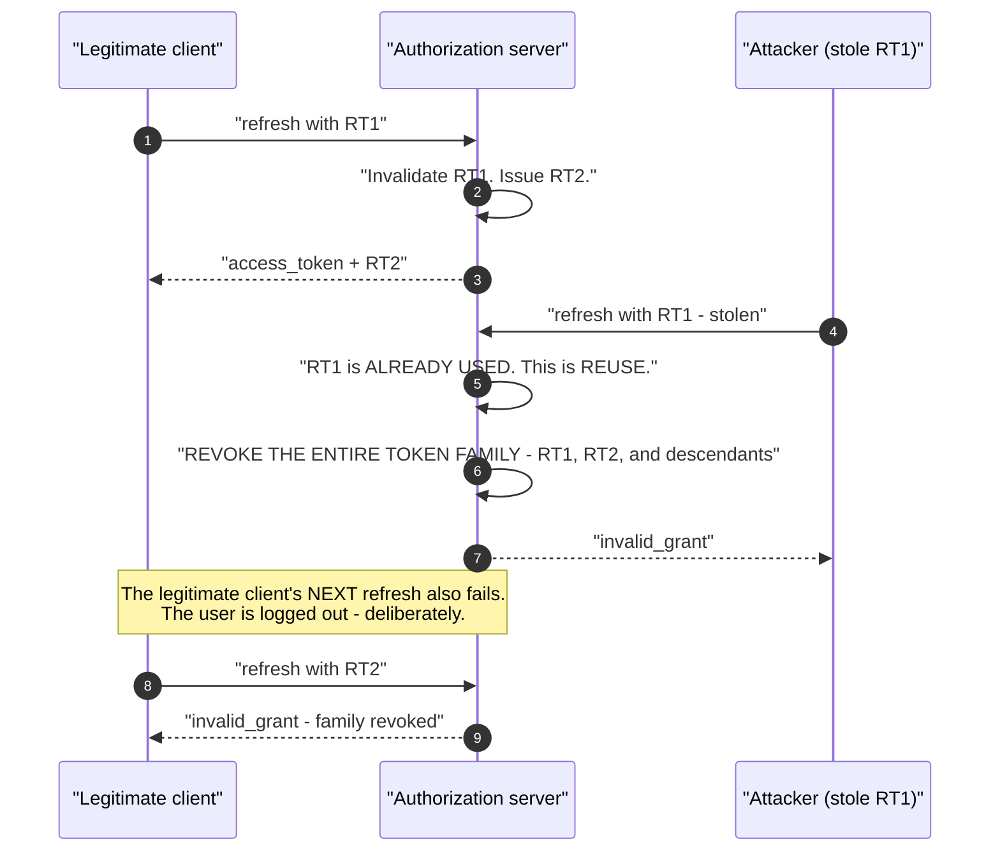
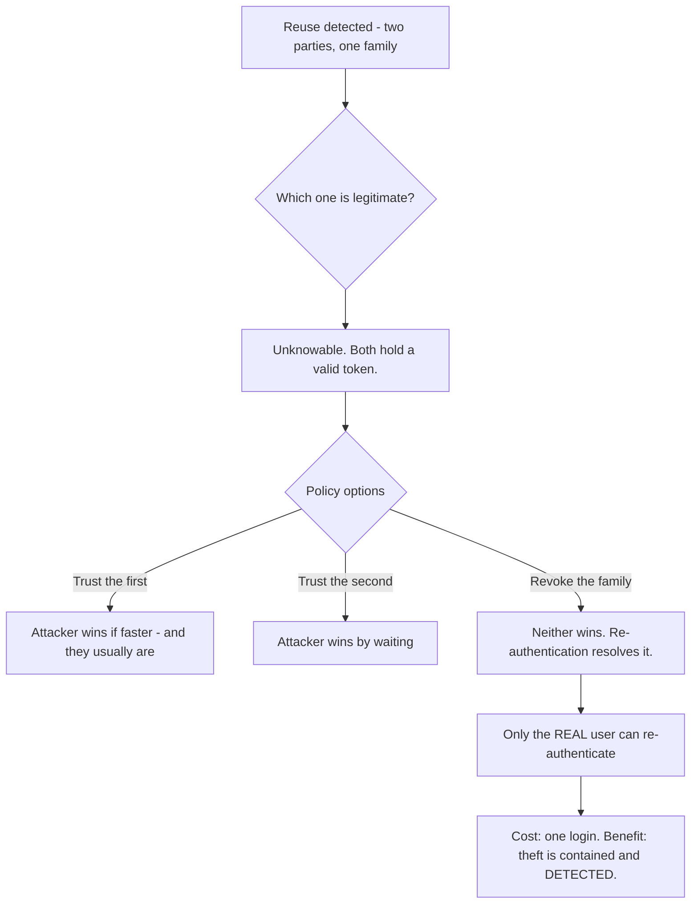
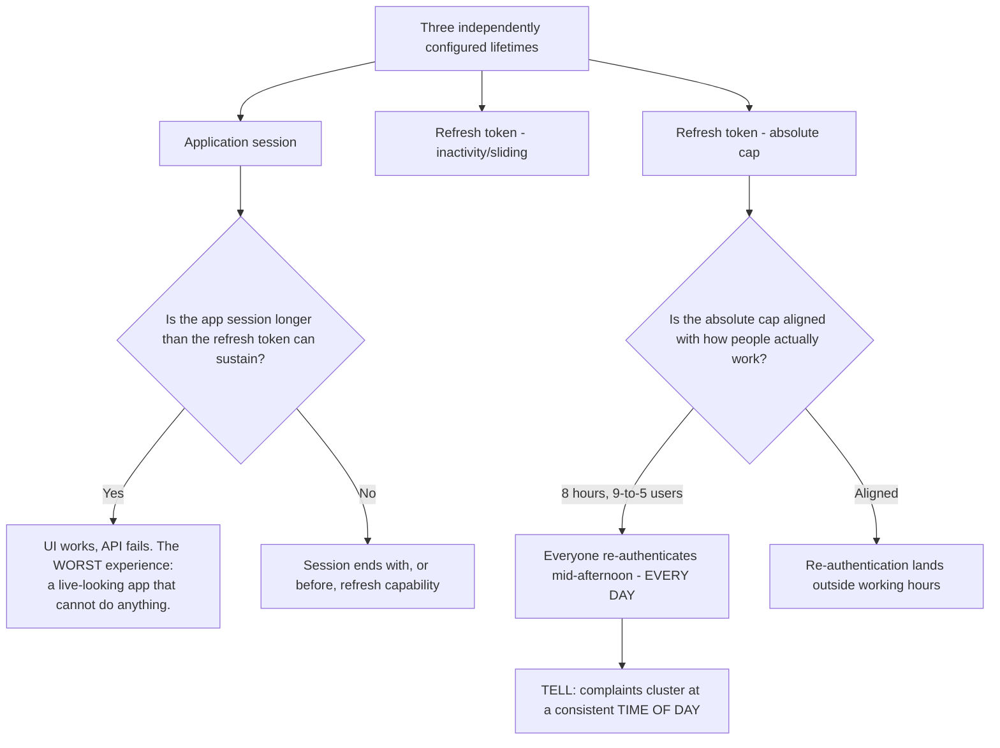
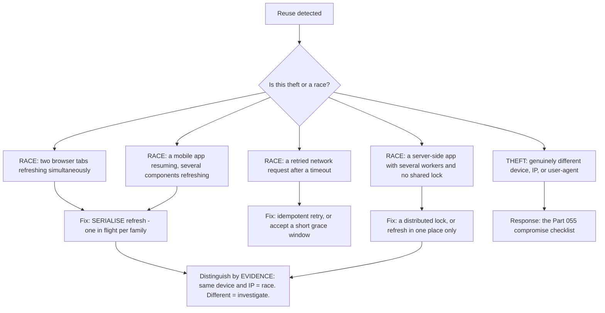
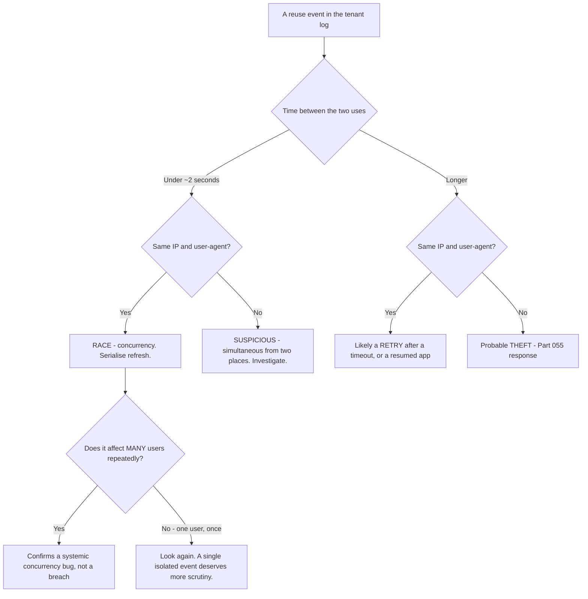
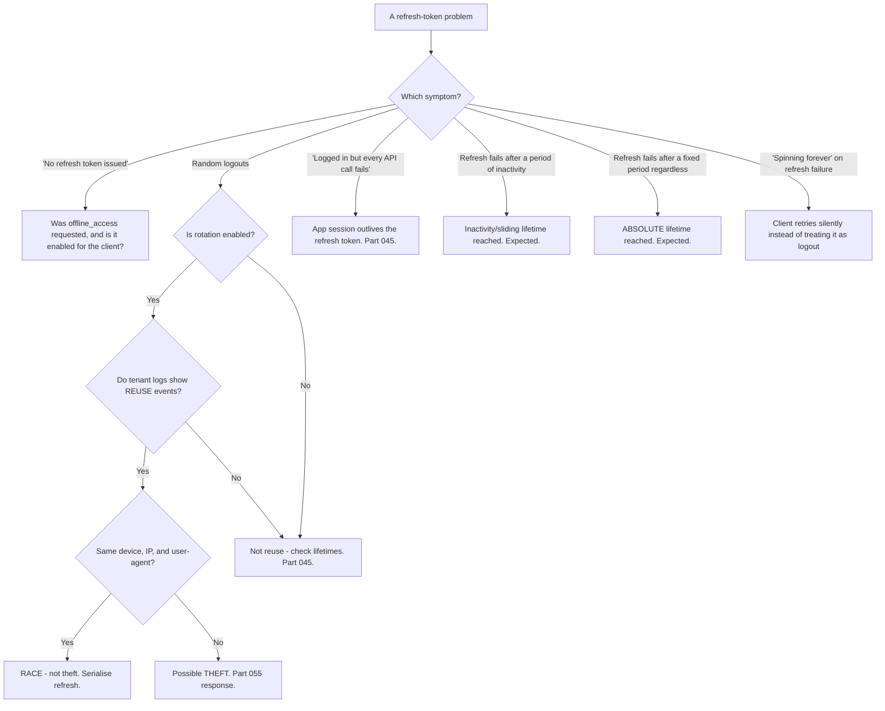

# Part 061 - Refresh Tokens, Rotation, and Reuse Detection

> Section goal: Understand the long-lived credential that keeps users signed in, why rotation makes it safe enough for a browser, and the race conditions that make rotation itself a source of support tickets. This is one of the highest-volume real-world topics in the role.

Covers index item **061**. Maps to JD signals: *knowledge of OAuth*, *basic security concepts*, *experience with troubleshooting web applications*, *strong analytical and problem-solving skills*, and *communicate technical concepts clearly*.

---

## 1. Start From Zero: The Problem Refresh Tokens Solve

Access tokens must be short-lived because they cannot be revoked (Part 045). But users cannot be re-prompted every fifteen minutes.



**The design principle worth stating aloud:** the long-lived credential is deliberately placed where it is transmitted least, and the frequently-transmitted credential is deliberately short-lived. That inversion is the whole idea.

> **Analogy.** A season ticket kept at home versus the daily ticket in your pocket. Losing the daily ticket costs a day; the season ticket is rarely out of the drawer, and it can be cancelled and reissued.
>
> **Where it stops:** a season ticket has your name on it. A refresh token is a bearer credential — which is why rotation exists, to make holding a copy detectably useless.

---

## 2. The Refresh Exchange

```http
POST /oauth/token
Content-Type: application/x-www-form-urlencoded

grant_type=refresh_token
&refresh_token=v1.MRq...
&client_id=abc123
&client_secret=SECRET          ← confidential clients only
&scope=openid profile read:orders   ← optional; may only narrow
```

| Detail | Note |
|---|---|
| **Requires `offline_access`** | The original authorization request must have asked for it (Part 052) |
| **Client authentication** | Secret for confidential clients; nothing extra for public ones |
| **Scope** | May be **narrowed**, never widened |
| **Response** | A new access token, possibly a new ID token, and — with rotation — a **new refresh token** |

**Whether a new refresh token comes back is the single most informative detail** in this response: it tells you immediately whether rotation is enabled.

---

## 3. Rotation and Reuse Detection

Without rotation, a stolen refresh token works for its whole lifetime and nothing ever notices. Rotation makes theft **detectable**.



| Concept | Meaning |
|---|---|
| **Rotation** | Every use returns a new refresh token; the old one is invalidated |
| **Family** | The chain of refresh tokens descending from one authorization |
| **Reuse detection** | A second use of an already-used token signals theft |
| **Family revocation** | On reuse, the **entire family** is invalidated |

### 🔍 Plain-English deep-dive: why reuse detection logs out the innocent party too

Customers find this genuinely objectionable at first: a stolen token causes the *legitimate* user to be logged out. Explaining why turns an apparent bug into an obviously correct design.

**The server cannot tell which party is which.** Both present a valid-looking refresh token from the same family. There is no signal distinguishing the real user from the thief — that is the entire nature of a bearer credential (Part 055).

So there are exactly three possible policies:

| Policy | Consequence |
|---|---|
| Trust the **first** use | The attacker wins if they are faster — and they usually are, since they can act immediately |
| Trust the **second** use | The attacker wins by simply waiting |
| **Revoke both** | Neither wins. The user re-authenticates, which the **attacker cannot do** |

**The third is the only safe choice**, and it has an elegant property: re-authentication is the one thing the legitimate user can do and the attacker cannot. **The inconvenience falls on the user; the exclusion falls on the attacker.**



**How to explain it to a customer in one line:** *"The server can't tell the thief from the user, so it trusts neither and asks the user to prove who they are — which is the one thing the thief can't do."*

**The important operational caveat**, and this is where most real tickets live: **most reuse-detection events are not attacks.** They are races — two tabs, a retried network request, a mobile app resuming — and §5 is about telling those apart. **A customer whose users are being logged out "randomly" is far more likely to have a race than a breach**, and leading with "you may have been compromised" is both alarming and usually wrong.

**Analogy:** two people presenting the same ticket stub at a cloakroom. The attendant cannot know which one handed in the coat, so the correct response is to refuse both and ask for identification — which only the real owner can provide. **Where it stops:** an attendant can look at faces. A token endpoint sees two identical HTTP requests, which is exactly why the policy must be mechanical rather than judgemental.

---

## 4. Storage and Lifetime

| Client type | Refresh token storage | Rotation |
|---|---|---|
| **Server-side web app** | Server-side session store | Recommended |
| **Native mobile** | OS secure storage — Keychain, Keystore | **Required in practice** |
| **SPA** | In memory, or a BFF (Part 047) | 🔴 **Mandatory** |
| **Machine-to-machine** | n/a — no refresh token (Part 060) | n/a |

| Lifetime setting | Meaning |
|---|---|
| **Absolute** | A hard maximum regardless of activity |
| **Sliding / inactivity** | Extends on each use; expires after inactivity |
| **Both together** | ✅ The correct configuration |

**Sliding without an absolute cap means a session never truly ends** (Part 045) — and a stolen token being actively used is, by definition, being used regularly, so the sliding window keeps the *malicious* session alive indefinitely.

### 🔍 Plain-English deep-dive: three lifetimes have to agree, and nobody checks

A refresh token's absolute lifetime, its inactivity lifetime, and the application's own session length are configured by different people at different times, and mismatches produce symptoms that look nothing like a configuration problem.

| Mismatch | What the user experiences | What it is reported as |
|---|---|---|
| App session **longer** than the refresh token | UI renders, name shows, **every API call fails** | "The app is broken" |
| App session **much shorter** | Re-login while the refresh token was still perfectly valid | "It logs me out constantly" |
| Inactivity window **shorter than a typical gap in use** | Logged out over lunch, or overnight | "It never remembers me" |
| Absolute cap **shorter than the business day** | Everyone re-authenticates mid-afternoon | "It happens at the same time each day" |



**The bottom-right box is a genuinely useful diagnostic.** If logout complaints cluster at a particular time of day rather than being spread randomly, that is an absolute lifetime, not a race and not a bug — and it is answered by arithmetic rather than investigation. **Ask when the affected users first logged in, add the absolute lifetime, and see whether the answer is the complaint time.**

**The top-right box is the worst user experience in this whole area**, and worth recognising instantly: an application that looks completely healthy — rendering, navigating, showing the user's name — and fails on every action. The correct client behaviour is to treat a failed refresh as a logout, but many applications retry silently instead, producing an indefinite spinner.

**The three questions that resolve most of these tickets** cost one message: what are the application session length, the refresh token inactivity window, and the refresh token absolute lifetime? **The mismatch is usually visible immediately**, and it converts a vague UI complaint into a configuration answer.

**Analogy:** a gym membership, a locker rental, and a parking permit all bought separately with different end dates. Everything works until the earliest one lapses, and then the failure appears somewhere unrelated to where you bought it. **Where it stops:** you would get three renewal notices. Here nothing notifies anyone, because each system considers its own expiry entirely normal.

---

## 5. Races: The Real-World Problem

Rotation is correct and it creates a genuine class of false positives.



### The grace window

Many providers allow a short **leeway** — a few seconds during which reusing the immediately-previous token returns the *same* new token rather than triggering revocation.

| | Effect |
|---|---|
| **Too short** | Legitimate races trigger revocation; users log out randomly |
| **Too long** | A stolen token has a usable window before detection |
| **Typical** | A few seconds — enough for a network retry, not enough for an attacker to be leisurely |

**The client-side fix is better than tuning the window**, and it is worth saying so: serialising refresh removes the race entirely rather than tolerating it.

### 🔍 Plain-English deep-dive: how to tell a race from a theft, using evidence you already have

This is the judgement call that matters most in this Part, because getting it wrong in either direction is costly: calling a theft a race leaves an attacker in place, and calling a race a theft triggers an unnecessary security incident.

**The two reuse requests are the evidence.** Compare them field by field:

| Field | Race | Theft |
|---|---|---|
| **Source IP** | Identical, or same subnet | Different — often a different country or a hosting range |
| **User-agent** | Identical | Frequently different, or a scripted client |
| **Time between the two uses** | Milliseconds to a couple of seconds | Seconds to hours — no reason for an attacker to be simultaneous |
| **How often it happens** | Repeatedly, for many users | Usually a single user, once |
| **Which users** | Correlates with heavy usage or many tabs | Correlates with nothing — or with a phishing campaign |
| **Device fingerprint** | Same | Different |



**The pattern question at the bottom is the strongest single signal.** A concurrency bug affects many users repeatedly and correlates with how heavily they use the application. A theft is typically one user, once. **If a customer's reuse events span hundreds of users daily, that is a bug; if it is one user on Tuesday, that deserves the full Part 055 response.**

**What to do when it is genuinely ambiguous:** treat it as theft. The cost of the compromise checklist — revoke sessions, reset, audit factors and grants — is a few minutes of user inconvenience. The cost of dismissing a real theft is unbounded. **But say clearly that it is precautionary**, so the customer does not conclude they were definitely breached.

**Analogy:** two identical claim tickets presented at a cloakroom. If they arrive together from the same person's two hands, it is a mix-up. If one arrives an hour later from someone else, it is not. Same evidence, entirely different conclusion. **Where it stops:** an attendant can see both people. You have log fields — which is why knowing exactly which fields to compare is the skill.

---

## 6. Failure Modes

| Failure mode | What it looks like | Consequence | Correction |
|---|---|---|---|
| **No rotation in a browser** | Simple | 🔴 Stolen token usable for its full life | Rotation is mandatory for SPAs |
| **Unserialised refresh** | Random logouts | Users log out "for no reason" | One refresh in flight per family |
| **No cross-tab coordination** | Multi-tab logouts | Same | `BroadcastChannel` or a storage lock |
| **Server workers with no lock** | Intermittent revocations | Same, at scale | Distributed lock |
| **Retry on network timeout** | The first request actually succeeded | Reuse detected | Idempotent retry; grace window |
| **Refresh token in `localStorage`** | Common | 🔴 XSS = persistent access (Part 047) | In memory, or a BFF |
| **Missing `offline_access`** | No refresh token issued | Unexpected re-logins | Request the scope |
| **Sliding lifetime, no absolute cap** | Session never ends | 🔴 A stolen token lives forever | Set both |
| **Ignoring reuse events** | Logged, unmonitored | Missed theft signal | Alert on them |
| **Treating every reuse as a breach** | Alarming the customer | Wasted response; lost trust | Distinguish race from theft |
| **Disabling rotation to stop logouts** | 🔴 Removes the control | Theft undetectable | Fix the race instead |
| **Not handling refresh failure** | Silent retry loop | "Spinning forever" | Treat as logout; re-authenticate |

---

## 7. Troubleshooting Decision Tree: Refresh Problems



### Worked example

*"Users are randomly logged out. Support says it's worse for power users."*

1. **"Worse for power users" is the clue.** Power users keep more tabs open and use the application more actively — both of which increase concurrent refreshes.
2. **Confirm rotation is on**, and check tenant logs for refresh-token reuse events (Part 107).
3. **Correlate timestamps.** Reuse events line up with the reported logouts. **That correlation is the proof**, and it converts "random" into "explained."
4. **Now the critical distinction.** For each reuse event, compare the two requests' IP and user-agent. **Identical** — same device, same browser. This is a race, not theft.
5. **Say that explicitly and early**, because the customer's first assumption on hearing "token reuse detected" will be a breach. Leading with "this is a race, not a compromise" prevents an unnecessary security escalation.
6. **The cause:** their SPA refreshes independently per tab with no coordination. Two tabs hit expiry within the same second; the second presents an already-rotated token; the family is revoked; every tab logs out.
7. **Fix:** serialise refresh across tabs — `BroadcastChannel` or a lock in `localStorage` — so one tab refreshes and the others wait for the result. Most mainstream SDKs do this; hand-rolled implementations usually do not.
8. **Do not disable rotation.** It is the control that would detect an actual theft, and the same reasoning as Part 042 applies.
9. **Verify by absence.** Confirm reuse events stop over a comparable period, rather than waiting for reports to stop.
10. **Add monitoring:** now that races are eliminated, a reuse event genuinely means something — so it becomes a worthwhile alert rather than noise.

---

## 8. Lab: Rotation and Races

**Purpose.** Observe rotation, trigger reuse detection deliberately, and reproduce then fix the race that causes most real tickets.

**Prerequisites.** Parts 044, 045, 047, 058 artifacts. A free Auth0 tenant with a SPA, a Regular Web Application, and a test API.

**Steps.**

1. Create `okta-prep/labs/061-refresh/`.
2. **Request `offline_access`** and confirm a refresh token is issued. **Then omit it** and confirm one is not.
3. **Refresh once.** Record whether a **new refresh token** comes back — that tells you rotation is enabled.
4. **Compare the tokens.** Decode the access tokens before and after (Part 040). Record `iat`, `exp`, `jti`, and confirm `sub` and `scope` are unchanged.
5. **Narrow the scope.** Refresh requesting fewer scopes and confirm it works. Then request **more** and record the error.
6. **Trigger reuse detection.** Use a refresh token, then use the **same** one again. **Record the exact error.**
7. **Check the tenant log** for the reuse event (Part 107). **Record the event code and payload** — you will look for this on real tickets.
8. **Confirm family revocation.** Attempt to use the *new* refresh token after triggering reuse. **Record that it also fails.** This is the whole mechanism, demonstrated.
9. **Measure the grace window.** Reuse a token immediately, then after 1, 5, and 30 seconds. **Determine whether a leeway exists and how long it is.**
10. **Reproduce the multi-tab race.** Build a SPA that refreshes independently per tab. Open three tabs, let them approach expiry, force simultaneous refresh. **Trigger the race and correlate with the tenant log.**
11. **Fix it.** Add cross-tab serialisation with `BroadcastChannel` or a `localStorage` lock. Repeat and confirm no reuse events.
12. **Reproduce the server-side race.** Run two workers of a server-side app sharing a refresh token with no lock. **Trigger the same failure.** Then add a lock and confirm it resolves.
13. **Retry race.** Simulate a network timeout where the request actually succeeded, then retry. **Record whether the grace window absorbs it.**
14. **Lifetimes.** Configure a short absolute lifetime and confirm refresh fails at the cap regardless of activity. Then configure sliding only and **write one line on why that is unsafe.**
15. **Failure handling.** Make refresh fail and observe your client. **Does it treat it as logout, or retry silently forever?** Fix it if it spins.
16. **Write the explainer.** `refresh-rotation.md` — one page: what rotation is, why reuse revokes the family, how to tell a race from theft, and the serialisation fix.
17. **Failure catalog + manifest.** Complete `MANIFEST.md`.

**Expected evidence.** Rotation confirmed, token comparison, scope-narrowing behavior, a triggered reuse event with the tenant log entry, demonstrated family revocation, a measured grace window, a reproduced-then-fixed multi-tab race, a reproduced-then-fixed server-side race, lifetime behavior at both caps, correct failure handling, and a one-page explainer.

**Validation rubric.**

| Check | Pass condition |
|---|---|
| `offline_access` | Contrast recorded |
| Rotation | New refresh token observed |
| Scope narrowing | Works down, fails up |
| Reuse detection | Error and log event recorded |
| Family revocation | Newer token also fails |
| Grace window | Measured empirically |
| Multi-tab race | Reproduced, then eliminated |
| Server-side race | Reproduced, then eliminated |
| Lifetimes | Both caps demonstrated |
| Failure handling | Treated as logout, not a silent loop |

**Cleanup and privacy.** Lab tenant, synthetic users only. **Revoke every refresh token at the end** — they are the longest-lived credential in the lab. Restore tenant lifetime settings. Never trigger reuse detection against a production tenant.

---

## 9. JD Mapping

| Supplied JD signal | How this Part supports it |
|---|---|
| **Knowledge of OAuth** | Refresh grant, rotation, reuse detection, family revocation |
| **Basic security concepts** | Why the long-lived secret sits where exposure is lowest |
| **Experience troubleshooting web applications** | Multi-tab and multi-worker races |
| Strong analytical and problem-solving skills | Distinguishing race from theft by evidence |
| **Communicate technical concepts clearly** | Explaining why the innocent party is logged out |
| Promote best practices | Serialise rather than disable rotation |
| Customer-obsessed attitude | Saying "this is a race, not a breach" before they escalate |

---

## 10. Candidate Honesty Note

- **Claim safety:** *Learned architecture and lab experience.*
- **The strongest thing you can say:** *"A refresh token is the long-lived credential, and the design deliberately puts it where it's transmitted least — only to the token endpoint, occasionally — while the frequently-transmitted access token is short-lived. Rotation makes it safe enough for a browser: every use returns a new one and invalidates the old, so a second use of an already-used token is evidence of theft."*
- **A second point, and it is the explanation customers need:** *"Reuse detection revokes the whole family, which logs out the legitimate user too — and that's correct, not a bug. The server can't tell the thief from the user; both present a valid token. Trusting the first use means the attacker wins by being faster, trusting the second means they win by waiting, so revoking both is the only safe policy. Re-authentication is the one thing the real user can do and the attacker can't."*
- **A third, and this is where the real tickets are:** *"Most reuse events are races, not attacks — two tabs refreshing simultaneously, a retried network request, a mobile app resuming, or server workers with no shared lock. I'd distinguish them by evidence: compare the IP and user-agent of the two requests. Identical means a race. Different device or network means investigate properly."*
- **A fourth, on how to open that conversation:** *"I'd lead with 'this is a race, not a compromise' as soon as the evidence supports it, because the phrase 'token reuse detected' makes customers think breach, and an unnecessary security escalation costs them a lot more than the logouts did."*
- **A fifth, on the fix:** *"Serialise refresh — one in flight per family, with the other tabs or workers waiting for the result. Mainstream SDKs do this; hand-rolled implementations usually don't. And I wouldn't disable rotation to stop the logouts, because that's the control that would catch an actual theft."*
- **A sixth, diagnostic:** *"'Worse for power users' is a good clue — more tabs and more activity means more concurrent refreshes, which is exactly what a race needs."*
- **Do not overstate:** you have not operated this at scale. Say you have triggered reuse detection and both races deliberately in a lab.

---

## 11. Official Source Anchors

Accessed **26 August 2026**.

| Source | What it defines |
|---|---|
| IETF RFC 6749 §1.5, §6 | Refresh tokens and the refresh grant |
| IETF RFC 6749 §10.4 | Refresh token security considerations |
| OAuth 2.0 Security BCP | Rotation, reuse detection, and sender-constraining |
| OAuth 2.0 for Browser-Based Applications | Refresh tokens in SPAs and rotation requirements |
| IETF RFC 7009 | Revocation |
| OpenID Connect Core §12 | Refresh behavior for OIDC and ID token reissue |
| Auth0 documentation — refresh token rotation and reuse detection | Vendor behavior, leeway, and family revocation |
| Okta developer documentation — refresh token rotation | Okta's implementation |

**Revalidate after 26 August 2026:** the RFCs are stable. Recheck vendor rotation defaults and grace-window behavior, which change.

---

## ⭐ Likely Interview Questions for This Section

### Q1. "What is refresh token rotation?"
> *Model answer:* "Every time a refresh token is used, the server issues a new one and invalidates the old. That means a refresh token is single-use, so if a second party presents an already-used token, the server knows a copy exists somewhere it shouldn't — which is reuse detection. The response is to revoke the entire token family: every refresh token descending from that original authorization. Without rotation, a stolen refresh token works for its full lifetime — days or months — and nothing ever notices, because a valid token used from anywhere looks identical. Rotation doesn't prevent theft; it makes theft *detectable* and bounds it, which is the best available property for a bearer credential."

### Q2. "Why does reuse detection log out the legitimate user?"
> *Model answer:* "Because the server genuinely can't tell which party is which — both present a valid token from the same family, and there's no distinguishing signal. That's the nature of a bearer credential. So there are three possible policies: trust the first use, and the attacker wins if they're faster, which they usually are because they can act immediately; trust the second, and they win by waiting; or revoke both, and neither wins. The third is the only safe one, and it has an elegant property — re-authentication is the one thing the real user can do and the attacker can't. So the inconvenience falls on the user and the exclusion falls on the attacker. I'd explain it to a customer as: the server can't tell the thief from you, so it trusts neither and asks you to prove who you are."

### Q3. "Users report random logouts. How do you investigate?"
> *Model answer:* "First, is rotation enabled and do the tenant logs show refresh-token reuse events? If they do, correlate the timestamps against the reported logouts — that correlation converts 'random' into 'explained,' which matters because the customer has probably been doubting their own users. Then the critical distinction: for each reuse event, compare the IP and user-agent of the two requests. Identical means a race, not theft — two tabs, a retried request, a resuming mobile app, or server workers without a lock. Different device or network means investigate as a possible compromise. I'd state 'this is a race, not a breach' as soon as the evidence supports it, because 'token reuse detected' sounds alarming and an unnecessary security escalation costs a lot more than the logouts did."

### Q4. "How do you fix a refresh race?"
> *Model answer:* "Serialise the refresh so only one is in flight per token family. In a browser that means cross-tab coordination — `BroadcastChannel` or a lock in `localStorage` — where one tab performs the refresh and the others wait for the result rather than each doing their own. Server-side it's a distributed lock, or restructuring so refresh happens in one place. Mainstream SDKs handle this; hand-rolled implementations usually don't, which is why 'we built our own token handling' is a useful thing to hear early. There's also a grace window some providers offer, where reusing the immediately-previous token within a few seconds returns the same new token instead of revoking — that absorbs network retries. But serialising is better than tuning the window, because it removes the race rather than tolerating it."

### Q5. "Should a SPA hold a refresh token?"
> *Model answer:* "Ideally no — the better pattern is a backend-for-frontend where tokens never reach the browser and the browser gets an `HttpOnly` cookie. But if a SPA must hold one, then rotation is mandatory, not optional, and it should be in memory rather than `localStorage`. The reason is that XSS with a refresh token in `localStorage` isn't session hijacking, it's credential exfiltration: the attacker reads it, sends it to their own server, and has persistent access from anywhere for weeks. Rotation limits that, because the moment either party refreshes, the other's copy becomes a reuse trigger — so theft is detected quickly rather than running indefinitely. It's a genuine mitigation rather than a fix, which is why I'd still push toward a BFF where there's any backend at all."

### Q6. "A customer wants to disable rotation because of the logouts. What do you say?"
> *Model answer:* "No, with a reason and an alternative — because the ask is understandable and just refusing doesn't help. Rotation is the control that would detect an actual stolen refresh token; without it, a theft runs for the token's whole lifetime and nothing notices. What they're actually experiencing is a race, and the fix is client-side serialisation, which is a small change and eliminates the cause rather than removing the detection. I'd offer to look at their refresh implementation, and if they need immediate relief I'd suggest checking whether their provider's grace window can be extended slightly as a stopgap — explicitly labelled as temporary. Trading a security control for a concurrency bug is the same bad deal as disabling key rotation to fix a caching bug."

### Q7. "Why does a sliding refresh lifetime need an absolute cap?"
> *Model answer:* "Because otherwise a session never actually ends, and the case where that bites is exactly the case you care about. A sliding lifetime extends on each use, so anything refreshing regularly keeps its token alive indefinitely — and a stolen refresh token being actively used by an attacker is, by definition, being used regularly. So the mechanism intended to expire inactive sessions instead guarantees that the active malicious one survives forever. An absolute cap sets a hard ceiling regardless of activity, so the user re-authenticates eventually and the family genuinely dies. You want both: the sliding window handles abandoned sessions, and the absolute cap handles long-lived compromise. They defend against different things."

### Q8. "What happens when a refresh fails and how should a client handle it?"
> *Model answer:* "It should be treated as a logout, not as a transient error. A failed refresh means the family was revoked, the token expired, the absolute lifetime was reached, or the user's session was ended — none of which a retry will fix. The failure mode I'd watch for is a client that retries silently in a loop: the user sees a spinner forever, the application looks hung, and the token endpoint gets hammered. The correct behaviour is to clear the local session and send the user through authentication again, which resolves every one of those causes in one step. It's also worth distinguishing this from the Part 045 lifetime-mismatch symptom — an app session outliving the refresh token gives you a UI that renders perfectly and can't do anything, which is the same underlying situation handled even worse."

---

## 🧠 30-Second Memory Hooks

- **Refresh token = the LONG-lived credential**, transmitted **least** — only to the token endpoint.
- **Requires `offline_access`** in the original request.
- **Rotation = single use.** Every refresh returns a **new** one and kills the old.
- **A new refresh token in the response ⇒ rotation is ON.** Fastest check.
- **Reuse = two parties hold the same token ⇒ revoke the WHOLE FAMILY.**
- **The innocent user is logged out too — and that is CORRECT.** Neither party wins.
- **Only the real user can re-authenticate.** That is the elegance.
- **MOST reuse events are RACES, not theft.**
- **Race vs theft: compare IP and user-agent** of the two requests.
- **"Worse for power users" = more tabs = more concurrent refreshes.**
- **Fix = SERIALISE refresh.** One in flight per family. Never disable rotation.
- **Sliding lifetime needs an ABSOLUTE cap**, or a stolen token lives forever.
- **A failed refresh is a LOGOUT, not a retry.**

---

## ✅ Completion Checklist

- [ ] **Knowledge:** I can explain rotation, family revocation, and the three-policy argument unaided.
- [ ] **Lab artifact:** `061-refresh/` contains a triggered reuse event with its log entry, demonstrated family revocation, a measured grace window, and both races reproduced then fixed.
- [ ] **Spoken:** I can explain why the innocent user is logged out in 45 seconds and distinguish race from theft in 30.
- [ ] **Judgement:** I say "race, not breach" as soon as the evidence supports it, and I refuse to disable rotation.
- [ ] **Honesty check:** I say "triggered deliberately in a lab," not operated at scale.
- [ ] **Source check:** I have read RFC 6749 §6 and the Security BCP's rotation section myself.

---

*Next suggested section:* **[Part 062 - Device Authorization Grant, CIBA, and Constrained Devices](Part-062-device-authorization-grant-ciba-and-constrained-devices.md)** — the flow for televisions, CLIs, and anything without a browser or a keyboard.
