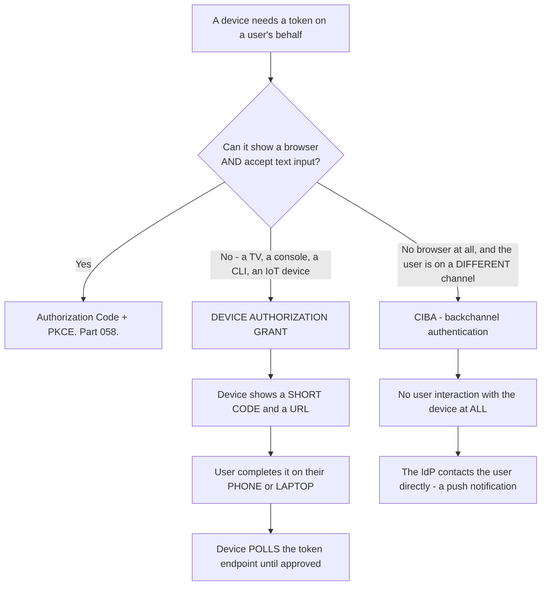
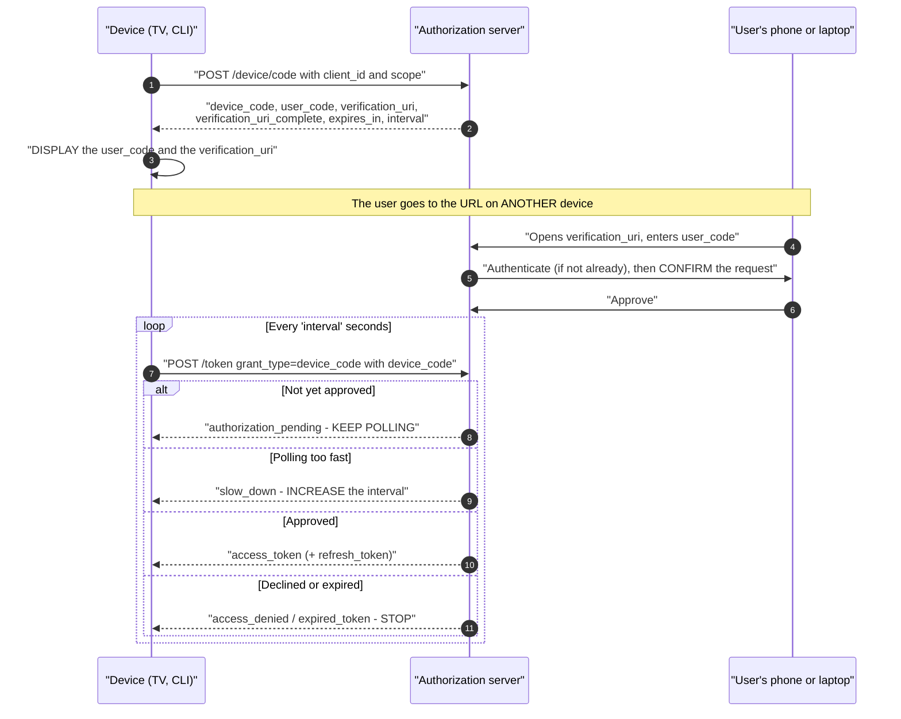
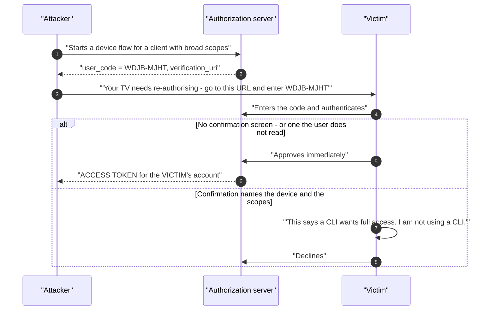
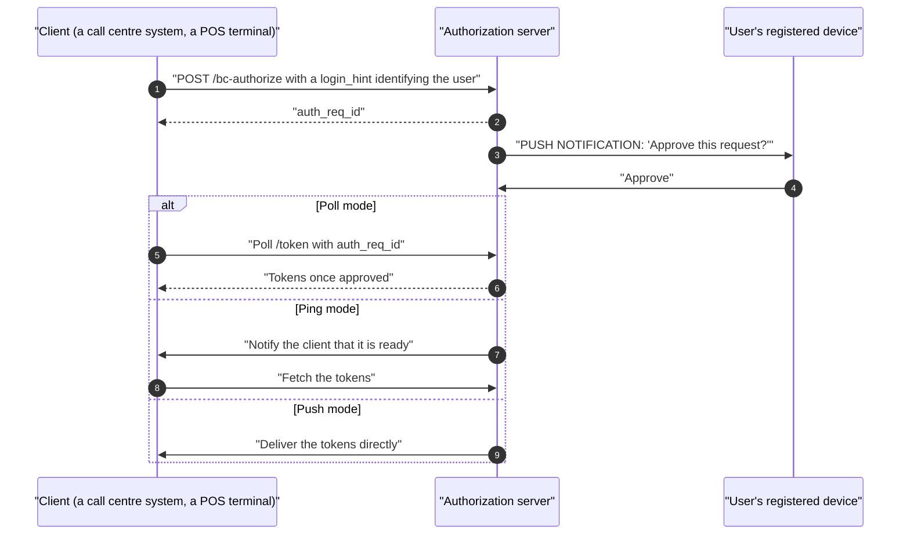
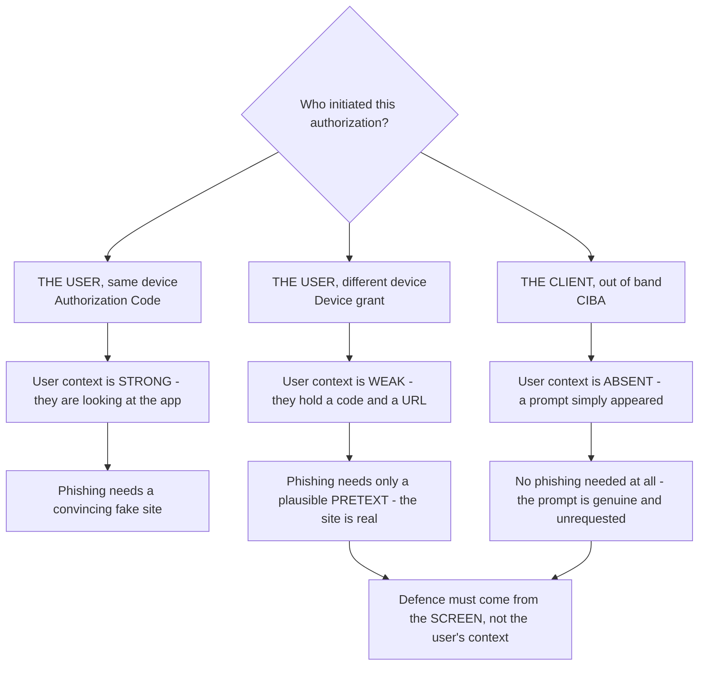
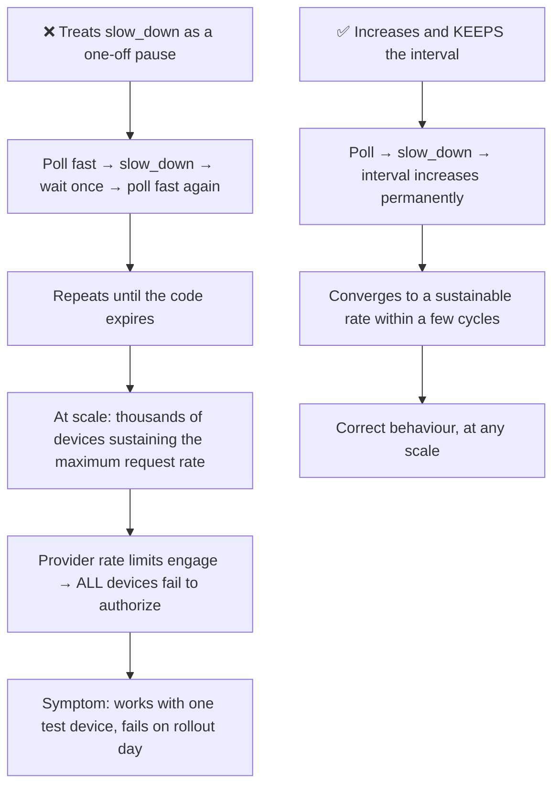
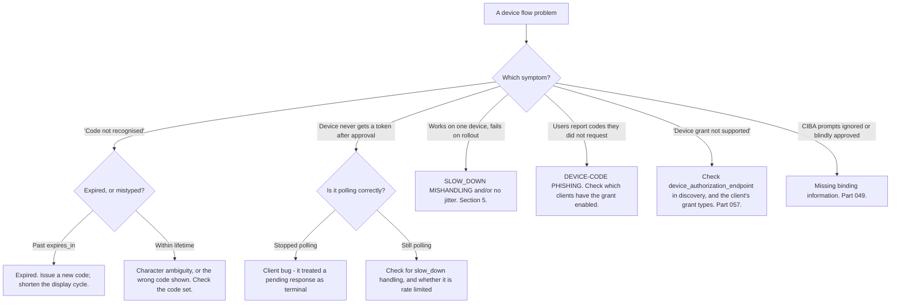

# Part 062 - Device Authorization Grant, CIBA, and Constrained Devices

> Section goal: Understand the flows for devices that cannot show a browser or accept text input — smart TVs, CLIs, IoT devices — plus the backchannel flow used for out-of-band approval. These are lower-volume than the code flow but distinctive, and knowing them well is a visible differentiator.

Covers index item **062**. Maps to JD signals: *knowledge of OAuth*, *strong analytical and problem-solving skills*, *communicate technical concepts clearly*, *experience with troubleshooting web applications*, and *basic security concepts*.

---

## 1. Start From Zero: When There Is No Browser

The authorization code flow assumes the device can display a browser and accept typed input. Many cannot.

**The core insight of the device grant:** move the interactive part to a device the user already has. The constrained device never handles credentials — it only displays a code and waits.

> **Analogy.** A shop terminal that displays a reference number and asks you to complete the payment on your own phone. The terminal never touches your card details; it just watches for confirmation.
>
> **Where it stops:** a shop terminal is physically in front of you, so you know which one you are approving. A device code shown on a screen could have come from anywhere — which is exactly the attack in §4.

---

## 2. The Device Authorization Grant

**RFC 8628.** Two endpoints, one polling loop.

| Value | Purpose |
|---|---|
| **`device_code`** | The device's secret handle. **Never shown to the user** |
| **`user_code`** | Short, human-typeable — e.g. `WDJB-MJHT`. Displayed on the device |
| **`verification_uri`** | Where the user goes |
| **`verification_uri_complete`** | The URI with the code embedded — ideal for a **QR code** |
| **`interval`** | Minimum seconds between polls |
| **`expires_in`** | How long the codes remain valid |

### The four polling responses

| Response | Meaning | Device action |
|---|---|---|
| `authorization_pending` | Not approved yet | **Keep polling** at `interval` |
| `slow_down` | Polling too fast | **Increase the interval**, then continue |
| `access_denied` | User declined | **Stop** |
| `expired_token` | Codes expired | **Stop**; restart the flow |

**Handling `slow_down` correctly is the most common implementation error here**, and §5 covers why.

---

## 3. Designing the User Experience

The device grant is unusually UX-sensitive, because the user is moving between two devices.

| Choice | Guidance |
|---|---|
| **`user_code` format** | Short, unambiguous. Avoid `0`/`O` and `1`/`I`/`l` |
| **Case** | Accept both; display uppercase |
| **Separators** | `WDJB-MJHT` is easier to read and type than `WDJBMJHT` |
| **QR code** | Encode `verification_uri_complete` — removes typing entirely |
| **Show progress** | The device should indicate it is waiting, not appear frozen |
| **Show what is being authorized** | The confirmation screen must name the device and the scopes |
| **Handle expiry visibly** | Display a countdown, and offer a new code on expiry |

### 🔍 Plain-English deep-dive: why the confirmation screen exists

RFC 8628 requires the user to confirm the `user_code` on a screen that also describes what is being authorized — and it is tempting to skip that step, because `verification_uri_complete` and a QR code could make approval a single tap.

**The attack that step prevents:**

**This is device-code phishing**, and it is a real, documented technique. It is attractive to attackers because:

- The link is a **genuine URL** at the **genuine provider** — nothing looks wrong (Part 055).
- **MFA does not help.** The victim authenticates legitimately.
- **Passkeys do not help.** The domain is real.
- The result is a token, not a credential — so it **survives a password reset**.

**It is essentially consent phishing** (Part 055) with a code instead of a link.

**What the confirmation screen must therefore do:**

| Element | Why |
|---|---|
| **Name the client** | "Acme TV App" — the user can check it matches |
| **List the scopes in plain language** | "Read your files" rather than `files:read` |
| **State the device type or location if known** | An unexpected location is a strong signal |
| **Require a deliberate action** | Not a single tap on a pre-filled screen |

**And the defences beyond the screen:** short code lifetimes, rate-limiting device-code requests per client, and — the strongest one — **restricting which clients may use the device grant at all**. A tenant that only enables it for the two applications that genuinely need it removes the attack surface entirely.

**The support-facing signal:** if a customer reports users being asked to enter codes they did not request, that is device-code phishing in progress, and the response is to check which clients have the grant enabled.

**Analogy:** a delivery driver phoning to say "read me the code on your screen." The code is genuine and the system is working; the *request* is fraudulent. **Where it stops:** you would ask what the delivery is. A user tapping approve on a bare code screen has been given nothing to ask about — which is exactly why the screen has to say what is being authorized.

---

## 4. CIBA: Client-Initiated Backchannel Authentication

**The device grant needs the user to notice a code.** CIBA removes even that: the authorization server contacts the user directly.

| | Device grant | CIBA |
|---|---|---|
| User interacts with the device | ✅ Reads a code | ❌ **Not at all** |
| Client must know who the user is | ❌ No | ✅ **Yes** — via `login_hint` |
| Typical use | TVs, CLIs, IoT | Call centres, POS, banking approvals |
| Standardised by | IETF RFC 8628 | OpenID Foundation (CIBA Core) |

**The defining CIBA property:** the client identifies the user *up front* and the authorization server reaches them out of band. The classic example is a call-centre agent triggering an approval that appears on the customer's own phone — so the agent never handles credentials and the customer approves on a device they control.

**The risk to be aware of:** because the user did not initiate anything, CIBA prompts are **fatigue-vulnerable** in exactly the way Part 049 describes. Binding information — showing what is being approved — matters even more here than in the device flow.

### 🔍 Plain-English deep-dive: who initiates, and why that changes the trust question

A useful way to hold all three user-present flows together is by asking **who started it**, because that single fact determines what the user can reasonably verify.

| Flow | Initiated by | What the user knows | What they can verify |
|---|---|---|---|
| **Authorization Code** | The user, on the same device | They just clicked "log in" | Everything — they are looking at the application |
| **Device grant** | The user, on a *different* device | They are setting up a TV, and read a code | Only what the confirmation screen tells them |
| **CIBA** | **The client**, not the user | Possibly nothing — a prompt arrived unbidden | Only what the prompt says |

**The trend down that diagram is the point:** as initiation moves away from the user, the user's own context stops being a defence. In the code flow, a user who is not trying to log in simply is not there. In CIBA, a user who is not doing anything at all can still receive a prompt.

**So the defence has to be built into what is displayed:**

| Flow | What the screen must supply |
|---|---|
| Device grant | Client name · scopes in plain language · device type or location |
| CIBA | All of the above, **plus** what triggered it — "Acme Bank call centre, agent-initiated, for a £500 transfer" |

**CIBA's binding message is doing the most work of any of these**, because it is the *only* thing standing between an unrequested prompt and a reflexive approval — which is precisely the MFA-fatigue mechanism from Part 049 with a higher-value payload.

**The support-facing version:** when a customer designs a CIBA integration, the question worth asking early is *"what will the user see, and could they tell an unexpected prompt from an expected one?"* If the answer is a bare "Approve?" then the design is fatigue-vulnerable before it ships.

**Analogy:** a knock at your own door that you invited, a phone call asking you to read out a code, and an unsolicited approval request appearing on your phone. Your ability to judge drops sharply across the three, so the message itself has to carry more each time. **Where it stops:** a caller can be questioned. A push notification has exactly the words it was given and no more.

---

## 5. Polling Discipline

The device grant is a polling protocol, and polling is easy to get wrong.

| Rule | Detail |
|---|---|
| **Respect `interval`** | It is a minimum, not a suggestion |
| **On `slow_down`, increase the interval** | 🔴 And **keep** the increase — do not reset it |
| **Stop on `access_denied` and `expired_token`** | Terminal states |
| **Stop at `expires_in`** | Do not poll a dead code forever |
| **Add jitter** | Many devices starting together otherwise poll in lockstep |
| **Back off on 5xx** | Do not amplify a provider incident |

### 🔍 Plain-English deep-dive: the `slow_down` bug and why it scales badly

The specification says: on `slow_down`, **increase the polling interval**. A very common implementation reads it as "wait a bit longer this once" and then reverts to the original interval.

**The result is a device that oscillates:** polls too fast, gets `slow_down`, waits, polls too fast again, gets `slow_down` again — indefinitely.

**Why it is nearly invisible during development:** with one device on a desk, the flow completes in seconds and the oscillation never matters. **The failure appears at rollout**, when thousands of devices behave the same way simultaneously — and it presents as "device activation is failing for everyone," which looks like a provider outage.

**The compounding factor is synchronisation.** Devices powered on at the same time — a fleet of terminals opening at 9am, a batch of TVs after a firmware update — poll in lockstep, producing sharp spikes rather than smooth load. **Jitter is not a nicety here; it is what turns a spike into a curve.**

**The diagnostic questions:** *"What does your device do when it receives `slow_down`?"* and *"Do all your devices start their flows at the same time?"* Both are answerable from code, and between them they explain most large-scale device-flow failures.

**Analogy:** being asked to knock less often and knocking at the same rate again after one pause. Eventually the door stops being answered at all. **Where it stops:** a person would adjust after being told once. Code does exactly what it was written to do, forever, on every device simultaneously.

---

## 6. Failure Modes

| Failure mode | What it looks like | Consequence | Correction |
|---|---|---|---|
| **`slow_down` treated as a one-off** | Fine in testing | 🔴 Rate limits at scale | Increase **and keep** the interval |
| **No jitter** | Lockstep polling | Spikes; throttling | Randomise the start offset |
| **Polling past `expires_in`** | Endless requests | Wasted load | Stop at expiry |
| **No confirmation screen detail** | One-tap approval | 🔴 **Device-code phishing** | Name the client and the scopes |
| **Device grant enabled for all clients** | Convenient | 🔴 Wide phishing surface | Enable only where needed |
| **Ambiguous `user_code` characters** | `0` vs `O` | Failed entries; support volume | Restricted character set |
| **No QR option** | Manual typing | Poor UX; more errors | `verification_uri_complete` |
| **Device appears frozen** | No progress indicator | Users power-cycle | Show waiting state |
| **No expiry handling** | Code silently dies | User stuck | Countdown and re-issue |
| **`device_code` displayed to the user** | Confusing and unsafe | Wrong value entered | Only `user_code` is shown |
| **CIBA without binding information** | Bare approval prompt | 🔴 Fatigue-vulnerable | Show what is being approved |
| **Not handling `access_denied`** | Keeps polling | Confusing hang | Terminal state |

---

## 7. Troubleshooting Decision Tree: Device Flow Failures

### Worked example

*"Our TV app worked perfectly in testing. On launch day, most users couldn't activate."*

1. **"Works in testing, fails at scale" is the signature of a polling problem.** One device never reveals it.
2. **Ask the decisive question:** what does the device do when it receives `slow_down`?
3. **Answer:** it waits an extra two seconds, then returns to its original one-second interval.
4. **That is the bug.** Each device sustains the maximum request rate indefinitely, and thousands of them together trip the provider's rate limit — so *all* devices fail, including well-behaved ones.
5. **Second contributing factor:** every device starts polling immediately on app launch, and launch-day traffic is heavily synchronised. **No jitter turns a spike into a wall.**
6. **Fixes, in order of impact:** honour `slow_down` by increasing the interval **permanently**; add random jitter to the initial poll and to each interval; stop polling at `expires_in`; and back off on 5xx rather than retrying immediately.
7. **Explain why testing missed it**, because the customer will ask and it is not a testing failure they should feel bad about: with one device the flow completes in seconds and the oscillation never has time to matter. **The behaviour is only visible in aggregate.**
8. **Suggest the prevention:** a load test with a few hundred simulated devices starting simultaneously would have surfaced it. That is a concrete, cheap recommendation rather than "test more."

---

## 8. Lab: Device Flow End to End

**Purpose.** Implement the device grant by hand, including correct polling, and reproduce the failures that only appear at scale.

**Prerequisites.** Parts 057, 058, 060 artifacts. A free Auth0 tenant with a Native application that has the device grant enabled.

**Steps.**

1. Create `okta-prep/labs/062-device/`.
2. **Confirm support.** Check `device_authorization_endpoint` in the discovery document (Part 057) and that the grant is enabled for your application.
3. **Request a device code with curl.** **Record every field** in the response, including `interval` and `expires_in`.
4. **Complete it manually.** Visit `verification_uri`, enter the `user_code`, approve. **Screenshot the confirmation screen** and note exactly what it tells the user.
5. **Assess that screen critically.** Does it name the client? List scopes in plain language? Show a device or location? **Write one line on whether a user could detect device-code phishing from it.**
6. **Poll by hand.** Before approving, poll the token endpoint and **record `authorization_pending`**. Then approve and poll again to receive tokens.
7. **Trigger `slow_down`.** Poll faster than `interval`. **Record the exact response.**
8. **Build the broken client.** Treat `slow_down` as a one-off pause. Run it and **log the interval over time** — show that it oscillates rather than converging.
9. **Build the correct client.** Increase and keep the interval, add jitter, stop at `expires_in`, and handle all four responses. **Log the interval over time** and show convergence. **Put both graphs side by side** — this contrast is the lab's key artifact.
10. **Simulate scale.** Run 50 concurrent instances of the broken client. **Record whether you hit a rate limit and at what point.** Then run 50 of the correct client and compare.
11. **Decline path.** Start a flow and decline. **Record `access_denied`** and confirm your client stops rather than continuing.
12. **Expiry path.** Start a flow, wait past `expires_in`, then approve. **Record what happens** on both the user side and the polling side.
13. **QR experience.** Generate a QR code from `verification_uri_complete` and complete the flow by scanning. **Compare the experience** to typing the code.
14. **Character set.** Inspect the `user_code` character set your tenant uses and **check for ambiguous characters.** Note whether entry is case-insensitive.
15. **Phishing surface audit.** Check which of your tenant's applications have the device grant enabled. **Write one line on why restricting it is the strongest defence.**
16. **Write the guidance.** `device-flow-guidance.md` — one page: the flow, the four polling responses, correct `slow_down` handling, jitter, and the confirmation-screen requirements.
17. **Failure catalog + manifest.** Complete `MANIFEST.md`.

**Expected evidence.** A recorded device-code response, a manual completion with a screenshotted and critiqued confirmation screen, a hand-polled flow, a triggered `slow_down`, broken and correct clients with interval graphs, a 50-instance scale comparison, decline and expiry paths, a QR comparison, a character-set check, a grant-enablement audit, and one-page guidance.

**Validation rubric.**

| Check | Pass condition |
|---|---|
| Discovery check | Endpoint and grant confirmed |
| Manual completion | Confirmation screen critiqued in writing |
| Hand polling | `authorization_pending` then success |
| `slow_down` | Triggered and recorded |
| Interval graphs | Oscillation versus convergence shown |
| Scale test | Rate limit behavior compared |
| Terminal states | Decline and expiry both handled |
| QR | Completed by scanning |
| Grant audit | Enabled clients listed with a rationale |

**Cleanup and privacy.** Lab tenant, synthetic users only. **The scale test must target your own tenant** and stay within its documented limits — never load-test a provider without authorisation. **Never send a device code to another person**, even as a demonstration. Delete the application and revoke tokens at the end.

---

## 9. JD Mapping

| Supplied JD signal | How this Part supports it |
|---|---|
| **Knowledge of OAuth** | Two less-common but distinctive grants |
| Strong analytical and problem-solving skills | "Works in testing, fails at scale" → polling |
| **Communicate technical concepts clearly** | Explaining why testing could not have caught it |
| Experience troubleshooting web applications | Polling, rate limits, and two-device UX |
| **Basic security concepts** | Device-code phishing and the confirmation screen |
| Promote best practices | Jitter, backoff, and restricting grant enablement |
| Exceed expectations on response quality | Recommending a concrete load test rather than "test more" |

---

## 10. Candidate Honesty Note

- **Claim safety:** *Learned architecture and lab experience.*
- **The strongest thing you can say:** *"The device grant exists because some devices can't show a browser or take typed input. The device displays a short code and a URL, the user completes it on their phone, and the device polls the token endpoint until it's approved. The key property is that the constrained device never handles credentials — it only shows a code and waits."*
- **A second point, and it is the highest-value diagnosis here:** *"'Works in testing, fails at rollout' is almost always `slow_down` handling. The spec says increase the polling interval; a very common bug is treating it as a one-off pause and reverting. One device on a desk completes in seconds so it never matters, but thousands of devices each sustaining the maximum rate trip the provider's rate limit — and then everyone fails, including well-behaved clients. Adding jitter matters too, because devices powered on together poll in lockstep."*
- **A third, on security:** *"Device-code phishing is real: an attacker starts a device flow, sends the victim a genuine URL at the genuine provider with a genuine code, and the victim approves. MFA doesn't help because they authenticate legitimately, passkeys don't help because the domain is real, and the result survives a password reset because it's a token grant. It's consent phishing with a code instead of a link. The confirmation screen naming the client and the scopes is the user-facing defence, and restricting which clients may use the grant at all is the stronger one."*
- **A fourth, on CIBA:** *"CIBA goes further — the user doesn't interact with the device at all. The client identifies the user up front with a `login_hint` and the authorization server reaches them out of band, typically a push notification. It's used for call centres and point-of-sale, where an agent triggers an approval that appears on the customer's own phone. The risk is that because the user didn't initiate anything, the prompts are fatigue-vulnerable — so showing what's being approved matters even more than in the device flow."*
- **A fifth, on communication:** *"I'd be explicit that testing couldn't have caught the polling bug, because it's only visible in aggregate — and then give them something concrete, like a load test with a few hundred simulated devices starting simultaneously, rather than 'test more thoroughly.'"*
- **Do not overstate:** you have not supported a device-flow deployment. Say you have implemented it by hand including the failure modes.

---

## 11. Official Source Anchors

Accessed **26 August 2026**.

| Source | What it defines |
|---|---|
| IETF RFC 8628 | The device authorization grant, all endpoints and polling responses |
| IETF RFC 8628 §3.5 | `slow_down` and polling interval requirements |
| IETF RFC 8628 §5.4 | Security considerations, including code phishing |
| OpenID Connect CIBA Core | Backchannel authentication, poll/ping/push modes |
| OAuth 2.0 Security BCP | Device flow considerations |
| IETF RFC 8252 | Native app guidance (Part 059) |
| Auth0 documentation — device authorization flow | Vendor endpoints, code format, and limits |
| Okta developer documentation — device authorization grant | Okta's implementation |

**Revalidate after 26 August 2026:** RFC 8628 is stable. CIBA adoption and vendor support are still developing — recheck before relying on it.

---

## ⭐ Likely Interview Questions for This Section

### Q1. "How does a smart TV get an access token?"
> *Model answer:* "With the device authorization grant. The TV posts to a device-code endpoint and gets back two codes: a `device_code` it keeps privately, and a short `user_code` it displays along with a verification URL — usually as a QR code too. The user goes to that URL on their phone, enters the code, authenticates, and confirms. Meanwhile the TV polls the token endpoint with its `device_code` at the interval the server specified, receiving `authorization_pending` until the user approves and then getting tokens. The property that makes it work is that the constrained device never handles credentials at all — it only displays a code and waits, so there's no keyboard, no browser, and no password on the TV."

### Q2. "What are the polling responses and how should a client handle them?"
> *Model answer:* "Four. `authorization_pending` means not yet approved, so keep polling at the current interval. `slow_down` means you're polling too fast, so increase the interval — and this is the one people get wrong, because the increase has to be permanent, not a one-off pause. `access_denied` means the user declined, which is terminal, so stop. And `expired_token` means the codes expired, also terminal. Beyond those, a correct client adds jitter so a fleet doesn't poll in lockstep, stops at `expires_in` rather than polling a dead code forever, and backs off on 5xx so it doesn't amplify a provider incident."

### Q3. "A device flow works in testing but fails on launch day. What happened?"
> *Model answer:* "Almost certainly `slow_down` handling, possibly compounded by missing jitter. If the client treats `slow_down` as a one-off pause and then reverts to its original interval, it oscillates — polls too fast, gets told to slow down, waits once, polls too fast again — sustaining the maximum rate indefinitely. With one device on a desk the flow completes in seconds and it never matters. With thousands of devices doing it simultaneously, the provider's rate limit engages and *everyone* fails, including correctly-implemented clients. Launch day makes it worse because traffic is synchronised — everyone opens the app at once. I'd be clear that testing genuinely couldn't have caught this, since it's only visible in aggregate, and recommend a load test with a few hundred simulated devices starting together."

### Q4. "What is device-code phishing?"
> *Model answer:* "An attacker starts a device flow for a client with broad scopes, gets a `user_code`, and sends it to a victim with a plausible pretext — 'your TV needs re-authorising, go to this URL and enter this code.' The URL is genuine, at the genuine provider, and the code is real. If the victim enters it and approves, the attacker's device receives a token for the victim's account. MFA doesn't help because the victim authenticated legitimately; passkeys don't help because the domain is real; and it survives a password reset because it's a token grant rather than a stolen credential. It's essentially consent phishing with a code instead of a link. The user-facing defence is a confirmation screen that names the client and lists the scopes in plain language, and the structural defence is restricting which clients may use the grant at all."

### Q5. "What's CIBA and when would you use it?"
> *Model answer:* "Client-Initiated Backchannel Authentication. Unlike the device grant, the user doesn't interact with the requesting device at all — the client identifies the user up front with a `login_hint` and the authorization server reaches them out of band, typically a push notification to a registered device. There are three modes: poll, ping, and push, depending on how the client learns the result. The canonical use is a call centre — an agent triggers an approval that appears on the customer's own phone, so the agent never handles credentials and the customer approves on a device they control. Point-of-sale and banking approvals are similar. The risk to flag is that because the user didn't initiate anything, the prompts are fatigue-vulnerable in exactly the way push MFA is, so showing what's actually being approved matters even more here."

### Q6. "How would you design the user code?"
> *Model answer:* "For someone reading it off a screen across a room and typing it on a phone. So: short, with a restricted character set that excludes ambiguous characters — no zero and capital O together, no one and capital I and lowercase l. Separators help a lot, `WDJB-MJHT` rather than `WDJBMJHT`, because it chunks for both reading and typing. Accept both cases while displaying uppercase. And offer a QR code encoding `verification_uri_complete`, which removes the typing entirely for anyone with a camera. Beyond the code itself, the device should show that it's waiting rather than appearing frozen — otherwise people power-cycle it — and it should show a countdown and offer a new code when the current one expires, rather than silently dying."

### Q7. "Why does the user have to confirm the code on a separate screen?"
> *Model answer:* "Because that screen is the only place the user can find out what they're actually approving. Without it, the flow is: read a code, type it, tap approve — and the user has no information to evaluate. That's exactly what device-code phishing exploits, since everything else in the flow is genuine. The screen needs to name the client, list the scopes in plain language rather than as raw strings, and ideally show a device type or location, because 'a CLI from another country wants full access' is something a user can act on. It's tempting to skip it, since `verification_uri_complete` plus a QR code could make approval a single tap — but that convenience removes the only checkpoint in the flow."

### Q8. "How is the device grant different from the authorization code flow?"
> *Model answer:* "The interactive part moves to a different device. In the code flow, the same device shows the browser, takes the credentials, receives the redirect, and exchanges the code. In the device flow, the constrained device only displays a code and polls; the browser, credentials and consent all happen on the user's phone or laptop. That means no redirect URI is involved at all, which removes a whole category of failure — and it also means the flow is asynchronous, so it's a polling protocol rather than a request-response one, with all the discipline that implies. And there's no PKCE, because there's no authorization code travelling through a front channel to intercept; the `device_code` goes directly from the server to the device and is never displayed."

---

## 🧠 30-Second Memory Hooks

- **Device grant = no browser, no keyboard.** The device shows a **code**; the user completes it **elsewhere**.
- **Two codes:** `device_code` (**private, never shown**) · `user_code` (**displayed**).
- **`verification_uri_complete` → QR code.** Removes typing.
- **Four poll responses:** `authorization_pending` · **`slow_down`** · `access_denied` · `expired_token`.
- **`slow_down` = INCREASE the interval AND KEEP IT.** Not a one-off pause.
- **"Works in testing, fails at rollout" = `slow_down` mishandling + no jitter.**
- **Add JITTER** — fleets power on together and poll in lockstep.
- **Device-code phishing:** genuine URL, genuine code, fraudulent request. **MFA and passkeys do not help.**
- **The confirmation screen must name the CLIENT and the SCOPES.**
- **Restricting which clients may use the grant is the strongest defence.**
- **CIBA = no device interaction at all.** `login_hint` + out-of-band push. **Fatigue-vulnerable.**
- **No redirect URI and no PKCE** in the device flow.

---

## ✅ Completion Checklist

- [ ] **Knowledge:** I can draw the device flow, name all four polling responses, and explain device-code phishing.
- [ ] **Lab artifact:** `062-device/` contains a hand-polled flow, a critiqued confirmation screen, broken-versus-correct interval graphs, a 50-instance scale comparison, and one-page guidance.
- [ ] **Spoken:** I can explain the flow in 60 seconds and diagnose the rollout failure in 30.
- [ ] **Judgement:** I explain why testing could not have caught it, and recommend a concrete load test.
- [ ] **Honesty check:** I say "implemented by hand in a lab," not supported in production.
- [ ] **Source check:** I have read RFC 8628 §3.5 and §5.4 myself.

---

*Next suggested section:* **[Part 063 - Deprecated Grants: Implicit, Password, and Migration Paths](Part-063-deprecated-grants-implicit-password-and-migration-paths.md)** — why two grants were removed, what to do when a customer is still using them, and how to run the migration conversation.
