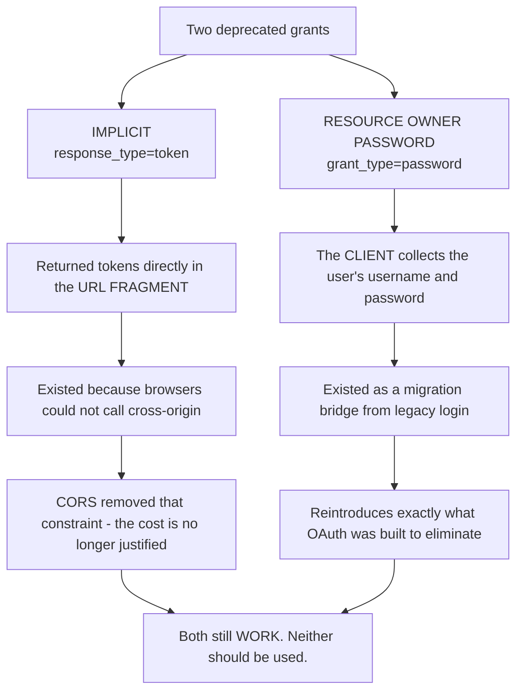
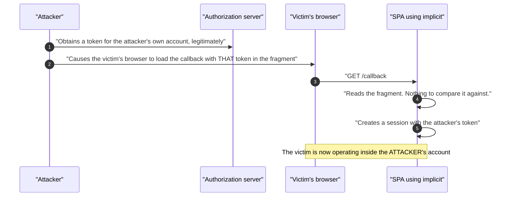
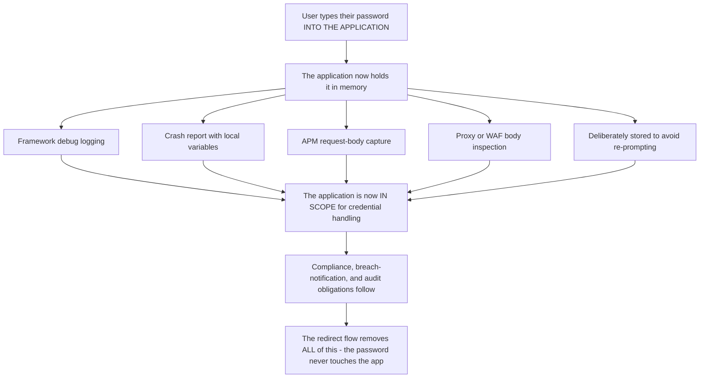
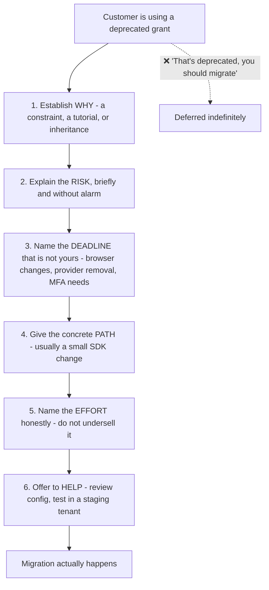
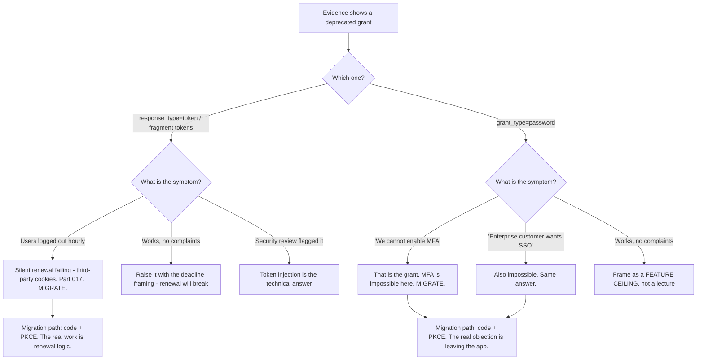

# Part 063 - Deprecated Grants: Implicit, Password, and Migration Paths

> Section goal: Understand precisely why two grant types were removed, recognise them instantly in evidence, and — most importantly — run the migration conversation well. A large share of real support work is helping people move off patterns that still work today.

Covers index item **063**. Maps to JD signals: *knowledge of OAuth*, *basic security concepts*, *communicate technical concepts clearly*, *strong analytical and problem-solving skills*, and *promote best practices*.

---

## 1. Start From Zero: Deprecated, Not Broken

Both grants still function on most providers. That is exactly what makes the conversation difficult — nothing is failing.



**The support framing that matters:** a customer using these is not doing something silly. They followed a tutorial that was correct in 2016, or inherited a system, or hit a constraint that has since gone away (Part 056). **Leading with the history rather than the verdict makes the conversation productive.**

> **Analogy.** A building with no fire doors, built to the code of its time. Nothing is on fire, the building stands, and the code changed for reasons that were learned the hard way.
>
> **Where it stops:** a building inspection forces the issue on a schedule. Nothing forces an OAuth migration, which is why these patterns persist for a decade.

---

## 2. The Implicit Flow

```
GET /authorize?response_type=token&client_id=...&redirect_uri=...
→ 302 https://app.example.com/callback#access_token=eyJ...&token_type=Bearer&expires_in=3600
```

**The token arrives in the URL fragment.** Fragments are not sent to servers, which was the original safety argument — but that is a narrow protection.

| Problem | Detail |
|---|---|
| **Token in the browser history** | Persists after the tab closes |
| **Token exposed to any script on the page** | Including a compromised dependency (Part 027) |
| **Referrer leakage** | Older browsers and some configurations leak fragments |
| **No refresh token** | Implicit never issues one, so silent renewal used hidden iframes — **which third-party cookie removal is breaking** (Part 017) |
| **No client authentication** | Nothing binds the token to the requester |
| **No PKCE** | There is no code to bind (Part 059) |
| **Token injection** | An attacker can supply their own token in the fragment |

### 🔍 Plain-English deep-dive: implicit's real killer was not the URL

The usual criticism is "tokens in the URL," which is true and slightly beside the point. **The decisive problem is that implicit has no way to bind the token to the request that asked for it.**



**Nothing in the flow lets the application ask "is this the token my request produced?"** The authorization code flow has three answers to that question — `state` checked by the client, PKCE checked by the server, and the back-channel exchange itself. Implicit has none. It has `state`, and `state` alone is not enough, because a well-timed injection can carry a `state` the application issued.

**The harm is the familiar one from Parts 048 and 059:** the victim ends up inside the attacker's account and then puts something valuable into it.

**The second decisive problem is operational rather than theoretical**, and it is what actually forces migrations today: **implicit issues no refresh token**, so applications kept sessions alive with hidden-iframe silent authentication. Third-party cookie removal is breaking that mechanism across browsers (Part 017). So implicit applications increasingly cannot renew tokens at all, and the symptom is users being logged out every hour with no explanation.

**That gives you a much better opening than "it's deprecated":**

> *"Two things. Implicit can't bind a token to the request that asked for it, so there's a token-injection path. But the one that's going to bite you on a schedule you don't control is silent renewal — implicit has no refresh token, so it relies on hidden iframes, and browsers are removing the third-party cookies that makes work. Moving to code plus PKCE fixes both, and it's mostly a configuration change in the SDK."*

**That framing works because it is true and it has a deadline attached.** Security arguments about theoretical injection get deferred; "your users will start being logged out hourly and there is nothing you can do about it" does not.

**Analogy:** a lock that also happens to be out of production. You could argue about how pickable it is, but the fact that you cannot get keys cut any more is what actually makes you replace it. **Where it stops:** you would notice the locksmith turning you away. Browser changes arrive quietly in a release note, and the first signal is a support queue.

---

## 3. The Resource Owner Password Grant

```http
POST /oauth/token
grant_type=password
&username=alice@example.com
&password=hunter2
&client_id=...
&scope=...
```

**The client collects the user's password and sends it to the authorization server.** This is the pattern OAuth was created to eliminate (Part 056).

| Problem | Detail |
|---|---|
| **The client handles credentials** | 🔴 The exact anti-pattern OAuth exists to remove |
| **Incompatible with MFA** | There is nowhere to prompt for a second factor |
| **Incompatible with federation** | Cannot redirect to an enterprise IdP |
| **Incompatible with passkeys** | 🔴 No browser ceremony (Part 050) |
| **No consent** | Nothing is shown to the user |
| **Encourages credential storage** | Clients store passwords to avoid re-prompting |
| **Blocks risk-based signals** | No device, browser, or behavioural context |
| **Bypasses account protection** | Attack protection features often cannot apply (Part 054) |

**The row that persuades people is MFA.** A customer using the password grant **cannot enable MFA**, cannot offer passkeys, and cannot support enterprise SSO — so the grant is not just a security concern, it is a **feature ceiling**. Framing it as blocked roadmap rather than as a lecture changes who agrees with you.

### 🔍 Plain-English deep-dive: the password grant quietly makes you a credential holder

There is a consequence of this grant that customers rarely think through until it is pointed out: **using it makes their application a place where passwords exist.**

Even if the application never deliberately stores one, the password passes through it — which means it can appear in places nobody chose:

| Where it can end up | How |
|---|---|
| **Application logs** | A framework logging request bodies at debug level |
| **Crash reports** | A stack trace capturing local variables |
| **APM and tracing tools** | Request payload capture, on by default in some products |
| **Memory dumps** | Anywhere a heap dump is taken |
| **A proxy or WAF log** | Bodies logged for inspection |
| **Deliberate storage** | Clients store the password to avoid re-prompting on every launch |



**The last row of the table is the most common one in practice.** An application using the password grant has no refresh mechanism that feels natural to a developer who has not read the spec, so the obvious way to avoid asking for the password on every launch is to **keep the password**. That decision is made quietly, in a mobile app, by someone solving a UX problem — and now there is a credential store nobody designed.

**The compliance framing is genuinely useful with customers**, because it moves the conversation out of "is this secure enough" and into something with external consequences: an application that handles passwords is in scope for controls, audits, and breach notification obligations that an application which never sees a password simply is not. **Removing the grant removes the application from that scope entirely** — which is a rare case where the secure option is also the cheaper one.

**The one-line version worth having ready:** *"With the redirect flow, the password never touches your application — so it can't be in your logs, your crash reports, your traces, or your memory dumps, and your app stops being a system that handles credentials."*

**Analogy:** a shop that takes card numbers over the phone and writes them on a pad, versus one with a card terminal. The terminal is not just safer — it takes the shop out of the category of businesses that hold card data at all. **Where it stops:** a pad can be shredded. A password that reached an application's logs is in a backup, a log aggregator, and a retention policy nobody is thinking about.

---

## 4. Recognising Them in Evidence

| Signal | Grant |
|---|---|
| `response_type=token` or `response_type=id_token token` in `/authorize` | **Implicit** |
| A token in the URL **fragment** (`#access_token=`) | **Implicit** |
| Hidden iframes pointing at `/authorize` with `prompt=none` | Implicit-era silent renewal |
| `grant_type=password` in a token POST | **Password grant** |
| A login form in the application that POSTs to the token endpoint | **Password grant** |
| The application asking for a username and password **and** talking to an IdP | Password grant |
| No `code_challenge` on a SPA | Missing PKCE — often alongside implicit |

**In a HAR, the fragment is the fastest tell** — but note that fragments are **not sent to servers**, so a server-side log will never show one. If you are looking at server logs rather than a HAR, look for `response_type` in the `/authorize` request instead.

---

## 5. Running the Migration Conversation

This is the genuinely valuable skill in this Part.



| Step | Why it matters |
|---|---|
| **Establish why** | The constraint may still exist. If it does, you need a different answer |
| **Explain the risk briefly** | Enough to justify, not enough to lecture |
| **Name an external deadline** | Their own risk assessment is theirs; a browser change is not |
| **Give the concrete path** | "Change `response_type` and enable PKCE" is actionable; "migrate" is not |
| **Be honest about effort** | Understating it destroys trust the moment they start |
| **Offer help** | A staging test with you present removes most of the perceived risk |

### 🔍 Plain-English deep-dive: what the migrations actually involve

Being specific here is what makes the advice credible. **Both migrations are smaller than customers expect, and both have one genuinely awkward part.**

**Implicit → Authorization Code + PKCE**

| Step | Effort |
|---|---|
| Change `response_type=token` to `code` | Trivial |
| Add PKCE — usually an SDK flag | Small |
| Register the same redirect URI, if not already | Trivial |
| Change the application type in the tenant | Small |
| Handle the code exchange — usually the SDK does it | Small |
| **Replace iframe silent renewal with refresh-token rotation** | **The real work** |

**The last row is where the time goes**, and it is worth naming up front. Applications built around hidden-iframe renewal often have session logic assuming renewal is instantaneous and always succeeds. Refresh tokens fail differently — they can be revoked, they rotate, and a failure means logout (Part 061).

**Password grant → Authorization Code + PKCE**

| Step | Effort |
|---|---|
| Remove the in-app login form | Small — deleting code |
| Redirect to the hosted login page | Small |
| Handle the callback | Small |
| **Accept that login now leaves the application** | **The real objection** |

**The last row is a product conversation, not an engineering one**, and it is the actual blocker. Customers resist because their login form is branded, in-app, and part of a designed experience. The honest answers are:

1. **Hosted login pages are customisable** — branding, custom domains, and in many cases full HTML control (Part 102).
2. **A custom domain removes the visible redirect** to a vendor hostname (Part 097).
3. **The trade buys MFA, passkeys, enterprise SSO, and attack protection** — none of which are available otherwise.
4. **If they truly cannot redirect**, some providers offer an embedded option, but it carries real caveats and should be a last resort.

**Leading with point 3 is what usually moves it**, because it reframes the redirect from a loss into the price of a list of features they already want.

**Analogy:** replacing a fitted kitchen appliance with a standard one. The fitting is the awkward part, not the appliance — and the reason to do it is that spare parts for the old one stopped being made. **Where it stops:** a kitchen works fine unfitted. An authentication flow that cannot do MFA is a growing gap rather than an aesthetic one.

---

## 6. Failure Modes

| Failure mode | What it looks like | Consequence | Correction |
|---|---|---|---|
| **Still using implicit** | Works today | 🔴 Token injection; renewal breaking | Code + PKCE |
| **Iframe silent renewal** | Works in some browsers | 🔴 Breaking as third-party cookies go | Refresh-token rotation |
| **Still using the password grant** | Works today | 🔴 **No MFA, no passkeys, no SSO** | Code + PKCE |
| **Client storing passwords** | Enabled by the password grant | 🔴 Credential store you did not want | Remove the grant |
| **"It's deprecated" as the whole message** | Technically correct | Deferred indefinitely | The six-step conversation |
| **Understating migration effort** | "It's just a config change" | Trust lost mid-migration | Name the awkward part |
| **Ignoring the product objection** | Engineering-only framing | Blocked at the product owner | Address branding directly |
| **Migrating without a staging test** | Straight to production | Outage | Staging tenant first |
| **Leaving the old grant enabled** | Migration "done" | 🔴 Old clients silently continue | Disable it after cutover |
| **No inventory** | One app migrated | Others still on it | Inventory first |

---

## 7. Troubleshooting Decision Tree: Legacy Grant Situations



### Worked example

*"Our SPA logs users out every hour and they have to sign in again. It didn't used to."*

1. **"Didn't used to" plus an hourly cadence points at renewal**, and the hour is almost certainly the access-token lifetime.
2. **Get a HAR.** Look for hidden iframes pointing at `/authorize` with `prompt=none`, and check `response_type`.
3. **Finding:** `response_type=token` — implicit — with iframe silent renewal.
4. **The cause:** the browser has begun blocking third-party cookies, so the iframe request reaches the authorization server without a session cookie, gets `login_required`, and renewal fails (Parts 017, 076).
5. **Explain that it is not their bug.** Nothing in their application changed; a browser default changed. **This matters, because they have probably been searching their own code for weeks.**
6. **Explain that it will get worse**, not better — the direction of travel is one-way across all browsers.
7. **Give the path:** authorization code with PKCE, and refresh-token rotation replacing iframe renewal.
8. **Name the awkward part honestly:** their session logic assumes renewal is instant and always succeeds. Refresh tokens rotate, can be revoked, and a failure means logout — so the renewal path needs real error handling, and multi-tab serialisation (Part 061).
9. **Offer a staging test.** A working flow in a staging tenant is worth more than any explanation.
10. **Ask about other applications.** A team that built one SPA this way usually built three.

---

## 8. Lab: See Why They Were Removed

**Purpose.** Run both deprecated grants in a lab, observe their weaknesses directly, and perform both migrations.

**Prerequisites.** Parts 044, 047, 058, 059, 061 artifacts. A free Auth0 tenant where you can enable legacy grants on a test application.

**Steps.**

1. Create `okta-prep/labs/063-deprecated/`.
2. **Enable implicit** on a test SPA application. Run the flow. **Capture the callback URL** and record the token in the fragment.
3. **Find it in browser history.** Confirm the token is retrievable after the tab is closed. **Screenshot it.**
4. **Read it with script.** From the console, read the fragment. **One line, and it is the whole exposure.**
5. **Confirm no refresh token.** Record that implicit issues none.
6. **Build iframe silent renewal.** Implement `prompt=none` in a hidden iframe and confirm it works with third-party cookies allowed.
7. **Then block third-party cookies** in your browser settings and repeat. **Record the failure and the exact error.** This is the §7 worked example, reproduced.
8. **Migrate to code + PKCE.** Change `response_type`, add PKCE, confirm the flow works, and **confirm no token appears in any URL.**
9. **Replace renewal.** Add `offline_access` and refresh-token rotation. **Confirm renewal works with third-party cookies still blocked** — this is the proof that matters.
10. **Enable the password grant** on a test application. Run it with curl. **Record how simple it is** — that simplicity is why it persists.
11. **Try to enable MFA** for that user and run the password grant again. **Record exactly what happens.** This is the feature-ceiling argument, demonstrated.
12. **Try an enterprise connection** with the password grant. Record the result.
13. **Migrate away.** Replace it with a hosted-login redirect flow. **Confirm MFA now works** on the same user.
14. **Branding.** Apply basic customisation to the hosted login page (Part 102). **Screenshot before and after** — this is what you show a customer worried about their brand.
15. **Disable both legacy grants** on your applications and confirm they now fail. **Record the errors.**
16. **Write the migration guide.** `legacy-grant-migration.md` — one page per grant: why it is deprecated, the external deadline, the concrete steps, the awkward part, and the objection to expect.
17. **Failure catalog + manifest.** Complete `MANIFEST.md`.

**Expected evidence.** An implicit flow with the token found in history and read by script, a working then broken iframe renewal, a completed migration with renewal working under blocked third-party cookies, a password-grant run with a demonstrated MFA failure, a completed migration with MFA working, branding before-and-after screenshots, disabled-grant errors, and a two-page migration guide.

**Validation rubric.**

| Check | Pass condition |
|---|---|
| Implicit token in history | Screenshotted after closing the tab |
| Fragment read by script | Demonstrated |
| Iframe renewal | Works, then fails with third-party cookies blocked |
| Migration | No tokens in URLs; renewal works with cookies blocked |
| Password grant + MFA | Failure recorded verbatim |
| Post-migration MFA | Works on the same user |
| Branding | Before and after captured |
| Disabled grants | Errors recorded |
| Migration guide | Two pages, six elements each |

**Cleanup and privacy.** Lab tenant, synthetic users only. **Enable legacy grants only on a disposable test application**, and disable them at the end — leaving them enabled is exactly the failure mode in §6. Restore browser cookie settings. Delete applications and revoke tokens.

---

## 9. JD Mapping

| Supplied JD signal | How this Part supports it |
|---|---|
| **Knowledge of OAuth** | Why two grants were removed, mechanically |
| **Basic security concepts** | Token injection; credentials in the client |
| **Communicate technical concepts clearly** | The six-step migration conversation |
| Strong analytical and problem-solving skills | Hourly logouts → iframe renewal → third-party cookies |
| **Promote best practices** | Migration with an honest effort estimate |
| Customer-obsessed attitude | "This is not your bug" said explicitly |
| Exceed expectations on response quality | Asking about their other applications |

---

## 10. Candidate Honesty Note

- **Claim safety:** *Learned architecture and lab experience.*
- **The strongest thing you can say:** *"Implicit put tokens directly in the URL fragment, and the decisive problem isn't the URL — it's that there's no way to bind a token to the request that asked for it, so an attacker can inject their own token into a victim's callback and the victim ends up operating inside the attacker's account. The code flow has three answers to that question; implicit has none."*
- **A second point, and it is the one that actually moves migrations:** *"The argument that lands isn't the security one — it's that implicit issues no refresh token, so applications used hidden-iframe silent renewal, and browsers are removing the third-party cookies that makes work. That's a deadline the customer doesn't control. 'Your users will start being logged out hourly and there's nothing you can do about it' gets action where 'it's deprecated' gets deferred."*
- **A third, on the password grant:** *"It's a feature ceiling, not just a security concern. You can't do MFA, because there's nowhere to prompt. You can't do passkeys, because there's no browser ceremony. You can't do enterprise SSO, because you can't redirect to an IdP. Framing it as blocked roadmap rather than as a lecture changes who agrees with you — the product owner starts caring."*
- **A fourth, on how to run the conversation:** *"I'd establish why they're on it first, because they usually followed a tutorial that was correct at the time or hit a constraint that's since gone away. Then the risk briefly, then an external deadline, then the concrete steps, then an honest effort estimate — and I'd name the awkward part rather than saying 'it's just a config change,' because understating it loses trust the moment they start."*
- **A fifth, on what the awkward parts actually are:** *"For implicit, the real work is replacing iframe renewal with refresh-token rotation, because the existing session logic assumes renewal is instant and always succeeds. For the password grant, the real objection is that login now leaves the application — and that's a product conversation about branding, answered with hosted-page customisation and a custom domain."*
- **A sixth:** *"'This isn't your bug — a browser default changed' is worth saying explicitly, because they've usually been searching their own code for weeks."*
- **Do not overstate:** you have not run a customer migration. Say you have run both grants and both migrations in a lab.

---

## 11. Official Source Anchors

Accessed **26 August 2026**.

| Source | What it defines |
|---|---|
| IETF RFC 6749 §4.2 | The implicit grant, as originally specified |
| IETF RFC 6749 §4.3 | The resource owner password credentials grant |
| OAuth 2.0 Security BCP | Explicit guidance against both grants |
| OAuth 2.1 draft | Both removed entirely (Part 066) |
| OAuth 2.0 for Browser-Based Applications | Why implicit fails and what replaces it |
| IETF RFC 7636 | PKCE — the replacement binding mechanism |
| Auth0 documentation — deprecated grants and migration guides | Vendor migration paths |
| Okta developer documentation — implicit flow deprecation | Okta's position and timeline |
| Browser vendor documentation on third-party cookie phasing | The external deadline (Part 017) |

**Revalidate after 26 August 2026:** provider removal timelines and browser cookie changes both move. Recheck vendor deprecation notices and browser release notes before advising on urgency.

---

## ⭐ Likely Interview Questions for This Section

### Q1. "Why was the implicit flow deprecated?"
> *Model answer:* "Two reasons, and the second is the one that matters practically. Technically, it returns tokens directly in the URL fragment with nothing binding the token to the request that asked for it — so an attacker can inject a token from their own account into a victim's callback, and the victim ends up operating inside the attacker's account. The authorization code flow has three defences against that: `state` checked by the client, PKCE checked by the server, and the back-channel exchange itself. Implicit has only `state`, which isn't enough. Operationally, implicit issues no refresh token, so applications used hidden-iframe silent renewal — and browsers are removing the third-party cookies that depends on. So implicit applications increasingly can't renew tokens at all."

### Q2. "What's wrong with the password grant?"
> *Model answer:* "The client collects the user's password, which is precisely the anti-pattern OAuth was created to eliminate. But the argument that actually persuades people is that it's a feature ceiling: you can't do MFA, because there's nowhere in the flow to prompt for a second factor; you can't offer passkeys, because there's no browser ceremony; you can't support enterprise SSO, because you can't redirect to a customer's identity provider; and attack-protection features often can't apply because there's no browser context. So it's not just a security concern — it's a list of things they'll want and can't have. Framing it as blocked roadmap rather than as a lecture usually gets the product owner on side, which is where the decision actually sits."

### Q3. "How do you convince a customer to migrate off a deprecated grant?"
> *Model answer:* "Not by saying it's deprecated, because nothing is failing and that gets deferred indefinitely. I'd establish why they're on it first — usually a tutorial that was correct at the time, an inherited system, or a constraint like pre-CORS browsers that's since gone away. Then explain the risk briefly, without lecturing. Then name a deadline that isn't mine: browsers removing third-party cookies, or a provider removal timeline, or an MFA requirement they already have. Then give concrete steps rather than 'migrate.' Then be honest about the effort, including the awkward part, because understating it destroys trust the moment they start. And then offer to help — a working flow in a staging tenant removes most of the perceived risk."

### Q4. "What does the implicit migration actually involve?"
> *Model answer:* "Most of it is small: change `response_type` from `token` to `code`, enable PKCE which is usually an SDK flag, adjust the application type in the tenant, and let the SDK handle the code exchange. The real work is the last piece — replacing hidden-iframe silent renewal with refresh-token rotation. That's where the time goes, because applications built around iframe renewal usually have session logic assuming renewal is instantaneous and always succeeds. Refresh tokens behave differently: they rotate, they can be revoked, a failure means the user should be logged out rather than retried, and concurrent tabs need serialising or reuse detection fires. I'd name that up front rather than calling the whole thing a config change."

### Q5. "A customer refuses to move off the password grant because they want their own login form. Response?"
> *Model answer:* "I'd take the objection seriously, because it's a real product concern rather than stubbornness — the login form is branded, in-app, and part of a designed experience. Then three things. Hosted login pages are customisable: branding, and in many cases full HTML control. A custom domain removes the visible redirect to a vendor hostname, so users stay on their domain. And the trade buys MFA, passkeys, enterprise SSO, and attack protection — none of which are possible otherwise. I'd lead with that third point, because it reframes the redirect from a loss into the price of features they already want. And I'd show them, rather than describe it: a customised hosted page on a custom domain in a staging tenant usually ends the conversation faster than any explanation."

### Q6. "Users are being logged out hourly from a SPA that used to work. What's your first thought?"
> *Model answer:* "That the hour is the access-token lifetime and renewal has stopped working. I'd get a HAR and look for hidden iframes pointing at `/authorize` with `prompt=none`, and check `response_type`. If it's `token`, that's implicit with iframe silent renewal, and the cause is the browser blocking third-party cookies — so the iframe request arrives without a session cookie, the authorization server sees an anonymous visitor, and returns `login_required`. I'd say explicitly that this isn't their bug: nothing in their code changed, a browser default did. That matters, because they've usually been searching their own codebase for weeks. Then the path is code plus PKCE with refresh-token rotation, and I'd note it will get worse rather than better, since the direction is one-way across all browsers."

### Q7. "How do you spot these grants in evidence?"
> *Model answer:* "For implicit, `response_type=token` or `id_token token` in the `/authorize` request, or a token in the URL fragment after the hash. The fragment is the fastest tell in a HAR — but it's worth knowing fragments aren't sent to servers, so a server-side log will never show one, and there you'd look at `response_type` instead. Hidden iframes hitting `/authorize` with `prompt=none` are the implicit-era renewal signature. For the password grant, `grant_type=password` in a token POST, or an in-app login form that posts credentials somewhere other than the user's identity provider. And a related smell worth checking while you're there: a SPA with no `code_challenge`, which means no PKCE and often sits alongside one of these."

### Q8. "Is there ever a legitimate reason to still use these?"
> *Model answer:* "Very rarely, and I'd want to hear the constraint rather than assume there isn't one. For implicit, essentially no — CORS removed the original reason, and every modern SDK supports code plus PKCE. For the password grant, the arguable cases are a short-lived migration bridge while moving off a legacy system, or a first-party CLI where a browser genuinely isn't available — though the device grant is the better answer there. What I'd want to establish is whether the constraint is real or inherited, because it's usually inherited. And if it genuinely is real and temporary, then the useful contribution is helping them bound it: which users, for how long, with what compensating controls, and what triggers turning it off — rather than either refusing to engage or letting 'temporary' become permanent."

---

## 🧠 30-Second Memory Hooks

- **Both still WORK. Neither should be used.** That is what makes the conversation hard.
- **Implicit:** `response_type=token` → token in the **URL fragment**.
- **Implicit's real flaw: no way to BIND the token to the request** → token injection.
- **Implicit's practical killer: NO refresh token** → iframe silent renewal → **third-party cookies dying**.
- **"Your users will be logged out hourly and you cannot fix it" beats "it's deprecated."**
- **Password grant: the CLIENT collects the password.** The exact thing OAuth removed.
- **Password grant = a FEATURE CEILING:** no MFA · no passkeys · no enterprise SSO · no attack protection.
- **Six-step migration talk:** why · risk · **external deadline** · concrete steps · honest effort · offer help.
- **Implicit migration's real work = replacing iframe renewal with refresh rotation.**
- **Password migration's real objection = login leaves the app.** Answer with branding + custom domain.
- **"This isn't your bug — a browser default changed."** Say it explicitly.
- **Disable the old grant after cutover**, or old clients silently continue.

---

## ✅ Completion Checklist

- [ ] **Knowledge:** I can explain both deprecations mechanically and name the awkward part of each migration.
- [ ] **Lab artifact:** `063-deprecated/` contains an implicit token found in history, iframe renewal working then broken, a completed migration with renewal working under blocked cookies, a demonstrated MFA failure and post-migration success, and a two-page migration guide.
- [ ] **Spoken:** I can run the six-step migration conversation in 90 seconds.
- [ ] **Judgement:** I lead with the external deadline, not the deprecation notice, and I name the effort honestly.
- [ ] **Honesty check:** I say "both grants and both migrations run in a lab," not customer migrations.
- [ ] **Source check:** I have read the Security BCP's sections on both grants myself.

---

*Next suggested section:* **[Part 064 - Audiences, Resource Indicators, and API Authorization](Part-064-audiences-resource-indicators-and-api-authorization.md)** — how a token is addressed to a specific API, and the single most common access-token bug in production.
