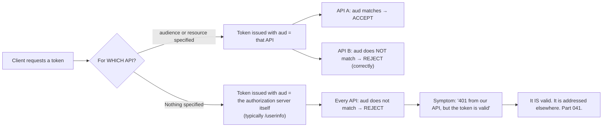
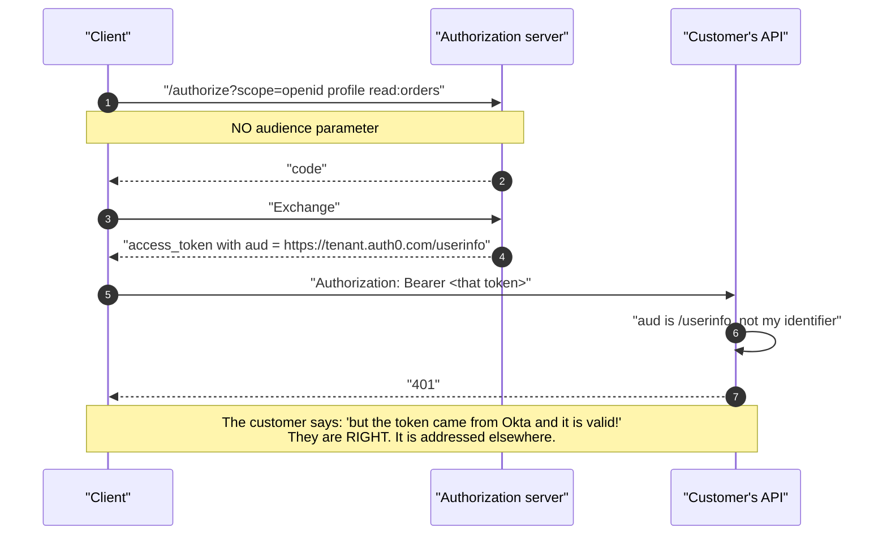
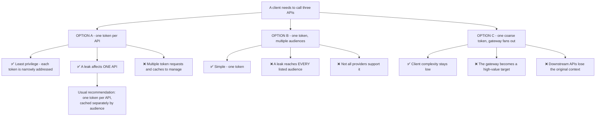
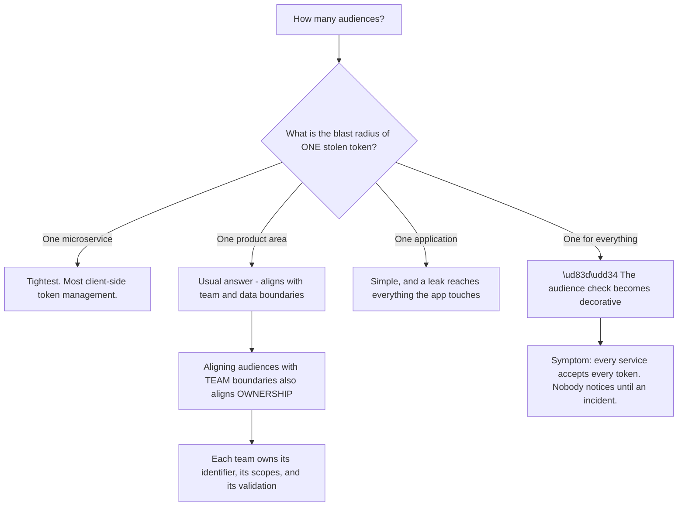
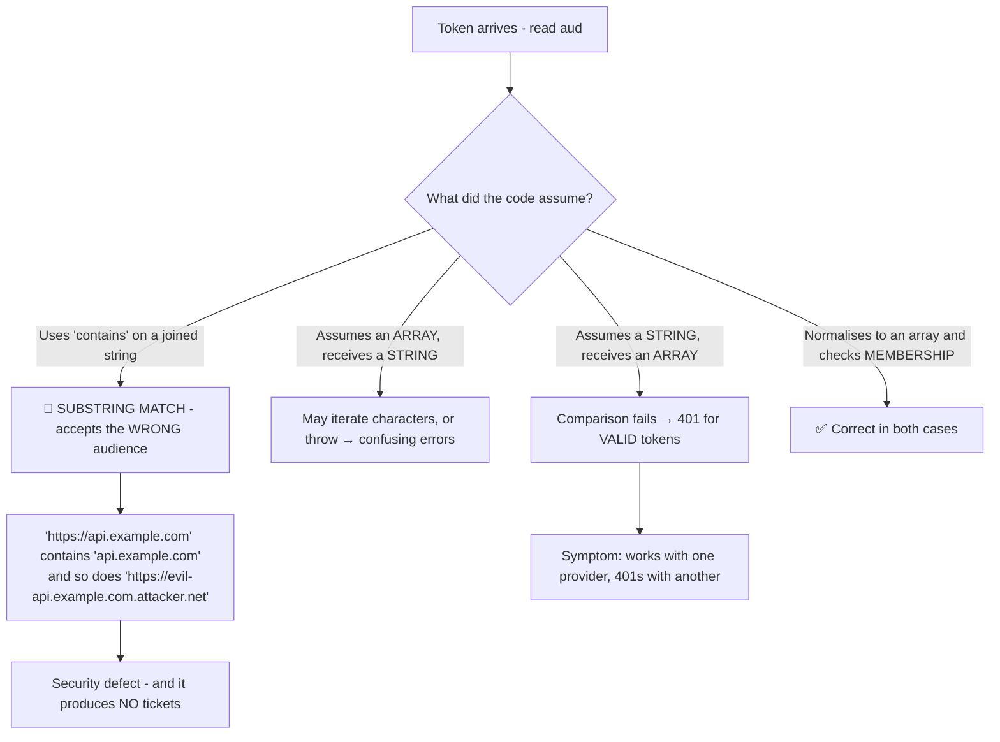
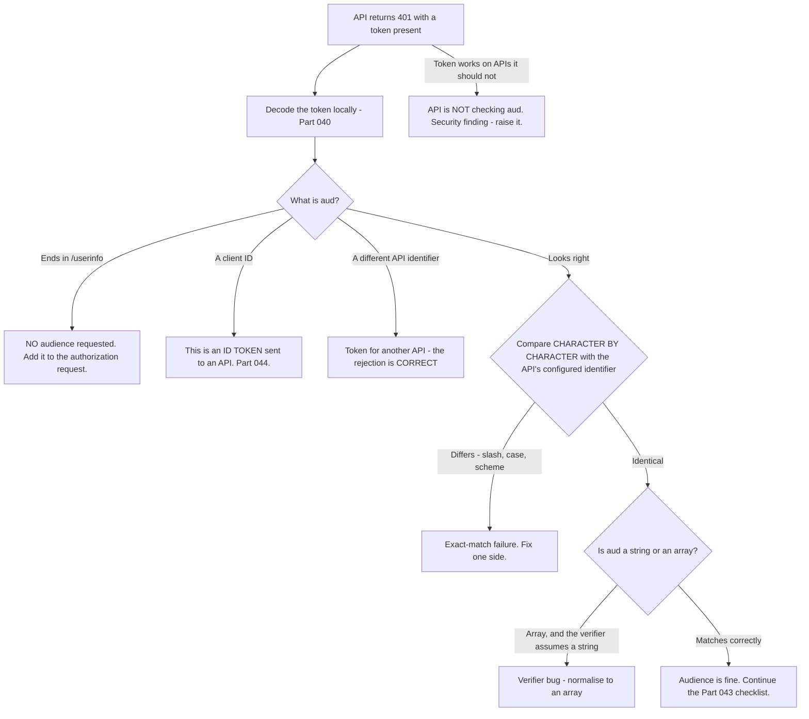

# Part 064 - Audiences, Resource Indicators, and API Authorization

> Section goal: Understand how a token is addressed to a specific API, why the audience is the single most common access-token bug in production, and how multi-API architectures should be designed. This Part converts Part 041's `aud` claim into an architectural skill.

Covers index item **064**. Maps to JD signals: *knowledge of OAuth*, *knowledge of authentication and authorization*, *strong analytical and problem-solving skills*, *experience with troubleshooting web applications*, and *communicate technical concepts clearly*.

---

## 1. Start From Zero: A Token Is Addressed

An access token is not a general-purpose pass. It is addressed to a specific recipient, and the recipient checks.



**Two failure directions, from one concept:**

| Direction | Symptom | Cause |
|---|---|---|
| **Audience not requested** | 401 from the customer's API | No `audience`/`resource` parameter |
| **Audience not checked** | Token works on APIs it should not | The API skips the `aud` check (Part 043) |

> **Analogy.** A letter with a name and address on it. The postal system will carry it anywhere, but the recipient checks the name before opening. Omit the name and it is undeliverable; skip the check and you open other people's post.
>
> **Where it stops:** a letter is one recipient. A token can legitimately carry multiple audiences, which is where the design decisions in §4 come from.

---

## 2. Two Mechanisms

OAuth has two ways to say which API a token is for, and they have different histories.

| | `audience` | `resource` (RFC 8707) |
|---|---|---|
| Standardised | ❌ **Vendor extension** | ✅ **RFC 8707** |
| Used by | Auth0, and others | Increasingly, including Okta |
| Value | An API identifier — often a URI, but opaque | An **absolute URI** for the resource |
| Multiple values | Vendor-dependent | ✅ Multiple `resource` parameters permitted |
| Where sent | Authorization request and token request | Both |

```
# Vendor extension
GET /authorize?...&audience=https://api.example.com

# RFC 8707
GET /authorize?...&resource=https://api.example.com
```

**Both are absent from RFC 6749**, which is why this is a common source of confusion between providers: an integration written for one may simply not send the parameter the other expects, and the result is a token addressed to the wrong place rather than an error.

**Check the discovery document** (Part 057) for `resource_indicators_supported` or vendor documentation to see which applies.

---

## 3. The Most Common Access-Token Bug

Worth stating plainly, because you will meet it repeatedly.



### 🔍 Plain-English deep-dive: why the wrong-audience token is so convincing

This bug is unusually persistent in tickets, and the reason is that **every reasonable check the customer performs says the token is fine.**

| Check they run | Result |
|---|---|
| Did we get a token? | ✅ Yes |
| Does it decode? | ✅ Yes — a well-formed JWT |
| Is the signature valid? | ✅ Yes — genuinely signed by their tenant |
| Is `iss` correct? | ✅ Yes |
| Is it expired? | ✅ No |
| Does it have the right scopes? | ✅ Often yes |
| **Is `aud` the API's identifier?** | ❌ **The one thing they did not check** |

**So the customer's position — "the token is valid" — is completely correct**, and contradicting it is both wrong and unproductive. The precise statement is: *it is a valid token that is not addressed to your API.*

**Why `scope` being right makes it worse:** developers reasonably assume that if the token carries `read:orders`, it is a token for the orders API. Scope and audience are independent — an unaudienced token can still carry scopes, and it will still be rejected.

**The three causes, and they need different fixes:**

| Cause | Fix |
|---|---|
| The `audience` parameter was never sent | Add it to the authorization request |
| It was sent, but does not match the API's configured identifier | Compare both **exactly** — this is a string match |
| It was sent on the token request but not the authorization request | Send it on both, per the provider's requirements |

**The second cause is subtler than it looks.** An API identifier is an **opaque string** that merely *looks* like a URL. `https://api.example.com` and `https://api.example.com/` are different identifiers. It is never resolved or fetched — so a "correct-looking" URL that differs by one character fails exactly as hard as a completely wrong one.

**The diagnosis, in one line:** decode the token and compare `aud` against the API identifier configured in the tenant, character by character. **That is the whole investigation** (Part 040).

**Analogy:** a cheque made out correctly, signed, in date, for the right amount — and payable to a different person. Everything about it is valid. It is simply not yours to bank. **Where it stops:** a bank teller would say which detail is wrong. An API returns 401, which is the same answer it gives for six other problems.

---

## 4. Multi-API Architectures

Real systems have several APIs, and the design question is how many audiences a token should carry.



| Approach | When |
|---|---|
| **One token per API** | ✅ The default recommendation |
| **Multiple audiences in one token** | Where the provider supports it and the APIs are closely related |
| **Gateway pattern** | Where the client genuinely cannot manage several tokens |
| **Token exchange** | Where a service must call downstream on the user's behalf (Part 067) |

**The practical caching consequence:** with one token per API, the client's token cache must be keyed by **audience *and* scope set** — not just by user. Caching by user alone is a real bug that produces "the wrong API's token" behaviour that looks like a race (Part 060).

### 🔍 Plain-English deep-dive: the audience is an architectural boundary, not a parameter

It is tempting to treat `audience` as a configuration value someone forgot. It is better understood as **the line you are drawing around a trust domain** — and choosing it badly has consequences that outlive the ticket.

**The question each audience answers:** *which set of resources should a single stolen token be able to reach?*

| Audience granularity | A stolen token reaches | Suits |
|---|---|---|
| One per **microservice** | One service | High-sensitivity systems; more client complexity |
| One per **product area** | Orders, or billing, or admin | ✅ The usual sweet spot |
| One per **application** | Everything the app can do | Simple; a large blast radius |
| One for the **whole company** | 🔴 Everything | Effectively no boundary at all |



**The bottom-right box is the failure that never generates a ticket.** A single company-wide audience means every service accepts every token, so the `aud` check passes everywhere and provides nothing. It looks like correct implementation — the check exists, it runs, it passes — and the boundary it was supposed to draw does not exist.

**Why aligning audiences with team boundaries works well** is that it puts the identifier, the scopes, and the validation logic under one owner. A team can reason about its own token's blast radius without coordinating. **Cross-cutting audiences produce the opposite: nobody owns them, so nobody narrows them.**

**The support-facing question when a customer is designing this:** *"If one of your access tokens ended up in a support ticket tomorrow, what would you want it to be able to reach?"* That converts an abstract granularity discussion into a concrete risk decision, and it is usually answered quickly.

**Analogy:** deciding how many separate keys a building needs. One master key is convenient and means every lost key is a full compromise; a key per cupboard is safe and nobody carries them all. **Where it stops:** you can see how many keys are on a ring. Nobody can see how many services accept a given token, which is why the decision has to be made deliberately at design time rather than discovered later.

---

## 5. Checking the Audience Correctly

| Rule | Detail |
|---|---|
| **Exact string comparison** | Never a substring or prefix match |
| **Handle arrays** | `aud` may be a string **or** an array — check for membership either way |
| **Check on every request** | Not once at startup |
| **Also check `azp` where present** | The authorized party, when `aud` has multiple values |
| **Never derive it from the request** | A configured constant, not a `Host` header |

### 🔍 Plain-English deep-dive: `aud` as an array, and the bug it hides

The specification allows `aud` to be either a single string or an array of strings. **Verification code that assumes one form breaks on the other**, and it breaks in whichever direction is worse depending on how it was written.



**The third branch is the dangerous one.** A developer whose `aud` is sometimes an array reaches for a "does it contain this string" check, and now the comparison is a substring match. **A substring match on an identifier that looks like a URL is exploitable**, because an attacker-controlled identifier can be constructed to contain the legitimate one.

**The correct implementation is two lines:** normalise `aud` to an array — wrapping a bare string — and test for exact membership.

**Why this surfaces in support:** it is a classic *"works with our old provider, 401s with the new one"* migration report. One provider emits a string, the other an array, and code written against the first fails against the second while looking entirely reasonable.

**The related claim worth knowing:** when `aud` has multiple values, OIDC requires an **`azp`** claim naming the authorized party — the client the token was issued to. A verifier handling multi-audience tokens should check `azp` as well, because otherwise "this token lists my API among several" says nothing about which client obtained it.

**Analogy:** a delivery addressed to several flats in a building. Checking that your flat number appears is right; checking that the label merely *contains* your number is not, because flat 1 appears inside flat 12. **Where it stops:** a person seeing several addresses would ask questions. Code silently accepts whatever its comparison returns.

---

## 6. Failure Modes

| Failure mode | What it looks like | Consequence | Correction |
|---|---|---|---|
| **No `audience` requested** | 401 from their API | 🔴 The #1 access-token bug | Send `audience`/`resource` |
| **Audience mismatch by one character** | Same 401 | Hard to spot | Character-by-character compare |
| **API does not check `aud`** | Tokens work everywhere | 🔴 **Cross-API replay** (Part 043) | Check on every request |
| **Substring `aud` match** | Works, and is exploitable | 🔴 Security defect, no symptoms | Exact membership |
| **Assuming `aud` is always a string** | Works with one provider | 401s after migration | Normalise to an array |
| **Not checking `azp`** | Multi-audience tokens | Weaker binding | Check where present |
| **`aud` derived from the request** | Proxy rewrites `Host` | Intermittent 401s | Configured constant |
| **Token cache keyed by user only** | Wrong API's token used | Confusing failures | Key by audience **and** scope |
| **One token, many audiences** | Simple | 🔴 Larger blast radius | One token per API |
| **Sending `audience` on only one request** | Provider-dependent failure | Token unaudienced | Follow provider requirements |
| **Treating the identifier as a URL** | "It resolves, so it's right" | Identifier is opaque | It is a string, never fetched |

---

## 7. Troubleshooting Decision Tree: Audience Problems



### Worked example

*"We migrated identity providers. Same code. Now our API rejects every token with an audience error."*

1. **"Same code, new provider" points at a response-format difference**, not a configuration one.
2. **Decode a token from each provider** and put the two `aud` claims side by side.
3. **Finding:** the old provider emitted `"aud": "https://api.example.com"` — a string. The new one emits `"aud": ["https://api.example.com"]` — an array with one element.
4. **Their verifier does `if (payload.aud === expected)`.** A single-element array is not equal to a string, so every token fails.
5. **Explain it precisely**, because "your code is wrong" is unhelpful when it worked for years: both forms are valid per the specification, and their code assumed one. The provider change surfaced an assumption that had never been tested.
6. **The fix is two lines:** normalise `aud` to an array, then test exact membership.
7. **Warn against the tempting shortcut**, and this is the valuable part: a developer under time pressure will reach for a `contains` or `includes` check on a joined string, which is a **substring match** and is exploitable — an attacker-controlled identifier can be constructed to contain the legitimate one. **Say this before they write it**, not after.
8. **While in the code, check `azp`.** If the new provider issues multi-audience tokens, `azp` should also be verified.
9. **Ask what else the migration might have surfaced.** A codebase with one untested format assumption usually has others — `iss` trailing slashes and `scope` as string versus array are the common companions.

---

## 8. Lab: Audience in Practice

**Purpose.** Reproduce both audience failure directions, and build a verifier that handles every valid form correctly.

**Prerequisites.** Parts 040–043, 052, 058 artifacts. A free Auth0 tenant with **two** test APIs and a client.

**Steps.**

1. Create `okta-prep/labs/064-audience/`.
2. **Register two APIs** with distinct identifiers. **Record both exactly.**
3. **No audience.** Complete a flow with no `audience` parameter. **Decode the token and record `aud`.** Call API A with it and record the 401.
4. **With audience.** Repeat with `audience` set to API A. **Decode and confirm `aud`.** Call API A and confirm success.
5. **Cross-API.** Call **API B** with API A's token. **Confirm it is rejected** — and note that this rejection is correct behaviour.
6. **Remove the `aud` check** from API B and repeat. **Confirm it now accepts API A's token.** **Write one line on why this is cross-API replay**, then restore the check immediately.
7. **One character off.** Configure API A's expected audience with a trailing slash. **Record the failure** and note how identical the error is to every other 401.
8. **Array versus string.** Craft a valid token where `aud` is an array and one where it is a string. **Test your verifier against both.** Record which fails.
9. **Fix it.** Normalise to an array and test membership. Confirm both now pass.
10. **The dangerous shortcut.** Implement a substring check deliberately. **Then construct an identifier containing the legitimate one** — such as `https://api.example.com.attacker.test` — and confirm it is wrongly accepted. **Record this**, then remove it. This is the lab's most important artifact.
11. **`azp`.** If your provider issues multi-audience tokens, obtain one and **record `azp`.** Add an `azp` check to your verifier.
12. **Token cache keying.** Build a client that caches by user only, request tokens for both APIs, and **demonstrate the wrong token being used.** Then key by audience and scope and confirm it resolves.
13. **`resource` versus `audience`.** Check your provider's discovery document for `resource_indicators_supported` and **record which parameter it expects.**
14. **Scope independence.** Obtain a token with `read:orders` but **no audience**, and confirm the scope is present while `aud` is wrong. **This demonstrates that scope and audience are independent.**
15. **Write the guidance.** `audience-guidance.md` — one page: what `aud` is, the two failure directions, correct checking including arrays, and why substring matching is a defect.
16. **Failure catalog + manifest.** Complete `MANIFEST.md`.

**Expected evidence.** Two API identifiers, an unaudienced token with its 401, a correct token succeeding, a correct cross-API rejection, a demonstrated replay with the check removed, a one-character mismatch, array-versus-string verifier behavior before and after fixing, a demonstrated substring-match exploit, `azp` handling, a cache-keying demonstration, a provider parameter check, and one-page guidance.

**Validation rubric.**

| Check | Pass condition |
|---|---|
| Both APIs registered | Identifiers recorded exactly |
| No-audience token | `aud` shows `/userinfo`; 401 reproduced |
| Cross-API rejection | Correct behaviour confirmed |
| Replay demonstrated | Check removed, token accepted, explained, restored |
| One-character mismatch | Failure recorded |
| Array vs string | Verifier fixed and re-verified |
| Substring exploit | Constructed and demonstrated, then removed |
| Cache keying | Wrong-token behaviour reproduced and fixed |
| Guidance | One page, four topics |

**Cleanup and privacy.** Lab tenant, synthetic data, your own APIs only. **The substring-match exploit must be constructed against your own verifier**, never any real service, and the deliberately weakened checks must be restored immediately after each demonstration. Delete both APIs and revoke tokens at the end.

---

## 9. JD Mapping

| Supplied JD signal | How this Part supports it |
|---|---|
| **Knowledge of OAuth** | Audience, resource indicators, and multi-API design |
| Knowledge of authentication and authorization | Why the audience is an authorization boundary |
| **Strong analytical and problem-solving skills** | One decode resolves the most common access-token bug |
| Experience troubleshooting web applications | Provider-migration format differences |
| **Communicate technical concepts clearly** | "It is valid, and it is addressed elsewhere" |
| Promote best practices | Exact membership; warning against `contains` before it is written |
| Exceed expectations on response quality | Raising the substring risk and the companion assumptions |

---

## 10. Candidate Honesty Note

- **Claim safety:** *Learned architecture and lab experience.*
- **The strongest thing you can say:** *"The audience is how a token is addressed to a specific API, and it's the most common access-token bug. If no `audience` parameter was sent, the token is issued for the authorization server's own userinfo endpoint — so it's genuinely valid, correctly signed, unexpired, often with the right scopes, and their API rejects it. The customer says 'the token is valid' and they're right. The precise statement is that it's a valid token that isn't addressed to their API."*
- **A second point, on why it persists:** *"Every check they run says the token is fine — it decodes, the signature verifies, `iss` is right, it isn't expired, the scopes are there. `aud` is the one thing they didn't check. And having the right scopes makes it worse, because people reasonably assume a token carrying `read:orders` is a token for the orders API. Scope and audience are independent."*
- **A third, and it is a real security point:** *"`aud` can be a string or an array, and code that assumes one breaks on the other. The dangerous fix is a `contains` check on a joined string, because that's a substring match — an attacker-controlled identifier can be constructed to contain the legitimate one. I'd warn against that *before* someone writes it, since they're usually reaching for it under time pressure."*
- **A fourth, diagnostic:** *"'Works with our old provider, 401s with the new one' after a migration is very often exactly this — one emits a string, the other an array. It surfaces an assumption that was never tested rather than a new bug."*
- **A fifth, on architecture:** *"For multiple APIs I'd default to one token per API, cached separately keyed by audience and scope. Caching by user alone is a real bug that produces wrong-API-token behaviour looking like a race. One token with many audiences is simpler and widens the blast radius of a leak."*
- **A sixth:** *"An API identifier is an opaque string that happens to look like a URL. It's never fetched or resolved, so a trailing slash difference fails exactly as hard as a completely wrong value."*
- **Do not overstate:** you have not designed a multi-API authorization architecture in production. Say the model and both failure directions are clear and lab-demonstrated.

---

## 11. Official Source Anchors

Accessed **26 August 2026**.

| Source | What it defines |
|---|---|
| IETF RFC 7519 §4.1.3 | The `aud` claim, and that it may be a string or an array |
| IETF RFC 8707 | Resource indicators — the `resource` parameter |
| IETF RFC 9068 | JWT access tokens: `aud` requirements for resource servers |
| OpenID Connect Core §2 | `azp` and its relationship to multi-value `aud` |
| OAuth 2.0 Security BCP | Audience restriction and token replay across resource servers |
| Auth0 documentation — the `audience` parameter and API identifiers | The vendor extension |
| Okta developer documentation — audience and authorization servers | Okta's model |
| IETF RFC 6749 §3.3 | Scope, and why it is independent of audience |

**Revalidate after 26 August 2026:** the RFCs are stable. Recheck provider support for `resource` versus `audience`, which is still converging.

---

## ⭐ Likely Interview Questions for This Section

### Q1. "What is the `aud` claim and why does it matter?"
> *Model answer:* "It's the token's address — which recipient the token was issued for. An API validates it by checking that its own identifier appears in `aud`, and rejects anything else. It matters because without that check, a token legitimately issued for one API is accepted by another that trusts the same issuer — cross-API replay with a completely genuine, unforged token. And it matters in the other direction too: if the client never requested an audience, the token is issued for the authorization server's own userinfo endpoint, so it's valid and useless for their API. Those two directions are the same concept producing opposite tickets, and one decode tells you which you have."

### Q2. "A customer says their token is valid but their API returns 401."
> *Model answer:* "I'd decode it and look at `aud` first, because that's the most common cause by a wide margin. If it ends in `/userinfo`, no `audience` parameter was sent on the authorization request, so the token was issued for the authorization server itself. The important thing is that their premise is correct — it *is* a valid token, genuinely signed by their tenant, unexpired, often with the right scopes. Contradicting that is both wrong and unproductive. The precise statement is: it's a valid token that isn't addressed to your API. Then the fix is adding the `audience` parameter and confirming it matches the API identifier configured in the tenant character for character, because that identifier is an opaque string — a trailing slash difference fails exactly as hard as a wrong value."

### Q3. "Why doesn't having the right scopes make the token work?"
> *Model answer:* "Because scope and audience are independent. Scope says what kind of action is permitted; audience says which recipient the token is for. An unaudienced token can still carry `read:orders`, and the orders API will still reject it — the scope was granted, but the token wasn't addressed there. It's a genuinely confusing point for developers because the two feel related: if it says `read:orders`, surely it's a token for the orders API. I'd explain it as an envelope: the scope is what's written inside about what you may do, and the audience is the name on the front. Having the right instructions inside doesn't help if it's addressed to someone else."

### Q4. "`aud` can be a string or an array. Why does that cause problems?"
> *Model answer:* "Because verification code usually assumes one form. If it assumes a string and receives a single-element array, the equality check fails and every valid token is rejected — which surfaces as 'works with our old provider, 401s with the new one' after a migration. The dangerous response is the shortcut: a developer under pressure reaches for a `contains` or `includes` check on the joined value, and now it's a substring match. That's exploitable, because an identifier like `https://api.example.com.attacker.test` contains `https://api.example.com`. The correct implementation is two lines — normalise `aud` to an array, wrapping a bare string, then test exact membership. I'd raise the substring risk proactively, because that's the fix people write first."

### Q5. "How would you design token audiences for a system with several APIs?"
> *Model answer:* "One token per API by default. Each token is narrowly addressed, so a leak affects one API rather than all of them, and each API's check is a simple exact match. The cost is that the client manages several tokens, which means the token cache has to be keyed by audience and scope set — not by user, which is a real bug that produces wrong-API-token behaviour looking like a race condition. The alternative of one token listing several audiences is simpler and widens the blast radius, and provider support varies. A gateway that fans out is reasonable when the client genuinely can't manage multiple tokens, but it becomes a high-value target and downstream services lose the original context. And where a service needs to call downstream on a user's behalf, token exchange is the right answer rather than reusing the inbound token."

### Q6. "What's the difference between `audience` and `resource`?"
> *Model answer:* "`audience` is a vendor extension — Auth0 uses it and others have adopted it — while `resource` is standardised in RFC 8707 as resource indicators. Neither is in the original RFC 6749, which is why this is a common source of cross-provider confusion: an integration written for one provider may simply not send the parameter the other expects, and the result is an unaudienced token rather than an error, so it fails later and somewhere else. RFC 8707 also allows multiple `resource` parameters, which gives a standard way to request a token for several resources. Practically I'd check the discovery document for `resource_indicators_supported` and the provider's documentation, rather than assuming — it's a thirty-second check that prevents a confusing failure."

### Q7. "What's `azp` and when do you check it?"
> *Model answer:* "The authorized party — the client the token was actually issued to. OIDC requires it when `aud` has multiple values, and it's useful precisely then: if a token lists several audiences, knowing that yours appears doesn't tell you which client obtained it. So a verifier handling multi-audience tokens should check `azp` against the clients it expects, in addition to checking `aud`. It's a relatively small point, but it comes up when someone is designing a multi-audience architecture and reasoning only about `aud` — the audience check answers 'is this for me', and `azp` answers 'and who asked for it', which is a different question and sometimes the one that matters."

### Q8. "After a provider migration, every token is rejected. Where do you start?"
> *Model answer:* "With a token from each provider, decoded side by side. Same code plus a new provider means a response-format difference rather than a configuration one, and putting the two payloads next to each other usually makes it obvious in seconds. The classic findings are `aud` as a string versus an array, `iss` with or without a trailing slash, and `scope` as a space-delimited string versus an array. All three are places where the specification permits variation and code silently assumed one form. I'd fix the immediate one and then explicitly ask what else the migration might have surfaced, because a codebase with one untested format assumption usually has others — and finding them now is much cheaper than finding them one incident at a time."

---

## 🧠 30-Second Memory Hooks

- **`aud` = the token's ADDRESS.** Which API it is for.
- **Two opposite failures:** audience **not requested** (401 from their API) · audience **not checked** (cross-API replay).
- **No `audience` parameter → `aud` = the authorization server's `/userinfo`.**
- **The customer is RIGHT that the token is valid.** It is addressed elsewhere.
- **Every check they ran passed.** `aud` is the one they did not run.
- **Scope and audience are INDEPENDENT.** Right scopes, wrong address, still 401.
- **The API identifier is an OPAQUE STRING** that looks like a URL. Never fetched.
- **`aud` may be a STRING or an ARRAY.** Normalise, then test **membership**.
- **NEVER use `contains`.** A substring match on a URL-like identifier is **exploitable**.
- **`azp`** = which client got it. Check it with multi-value `aud`.
- **One token per API. Cache by AUDIENCE + SCOPE**, not by user.
- **"Works with the old provider, 401s with the new" = a format assumption**, not a new bug.

---

## ✅ Completion Checklist

- [ ] **Knowledge:** I can state both failure directions, explain array-versus-string handling, and say why `contains` is a defect.
- [ ] **Lab artifact:** `064-audience/` contains both failure directions demonstrated, a substring-match exploit constructed and removed, array-versus-string verifier behavior fixed, and a cache-keying demonstration.
- [ ] **Spoken:** I can diagnose the wrong-audience 401 in 30 seconds without contradicting the customer.
- [ ] **Judgement:** I warn against `contains` before it is written, and I ask what else a migration surfaced.
- [ ] **Honesty check:** I say "lab-demonstrated," not production architecture.
- [ ] **Source check:** I have read RFC 7519 §4.1.3 and RFC 8707 myself.

---

*Next suggested section:* **[Part 065 - Redirect URIs, state, nonce, and CSRF Defenses](Part-065-redirect-uris-state-nonce-and-csrf-defenses.md)** — the three parameters that hold the flow together, and the attacks each one blocks.
