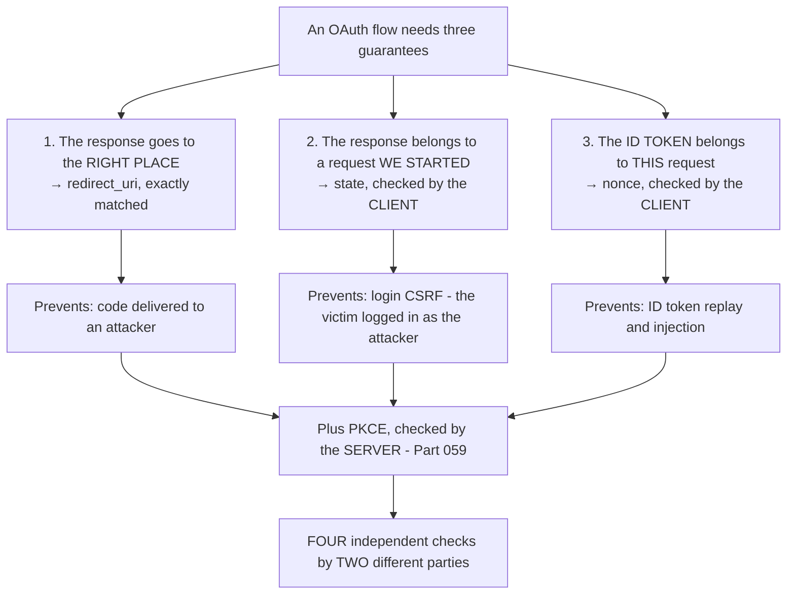
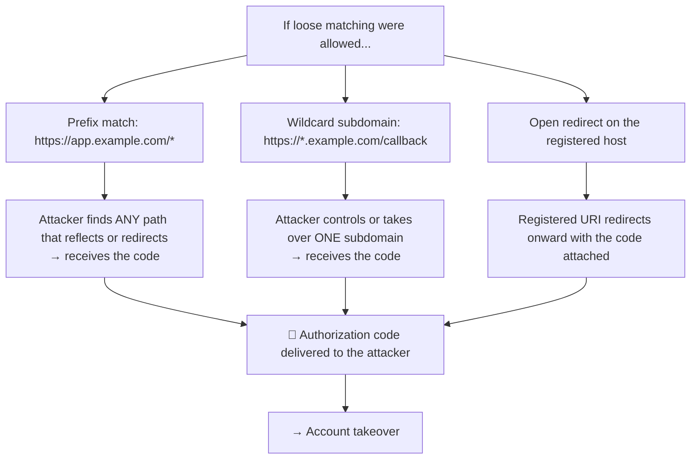
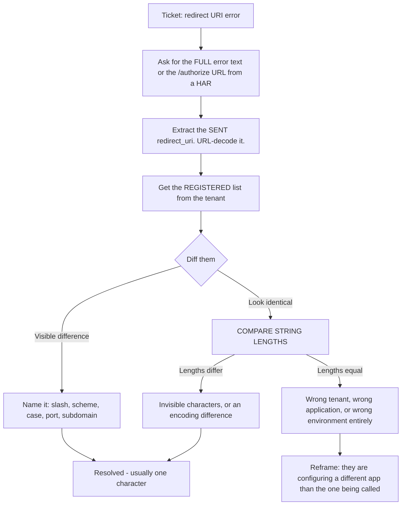
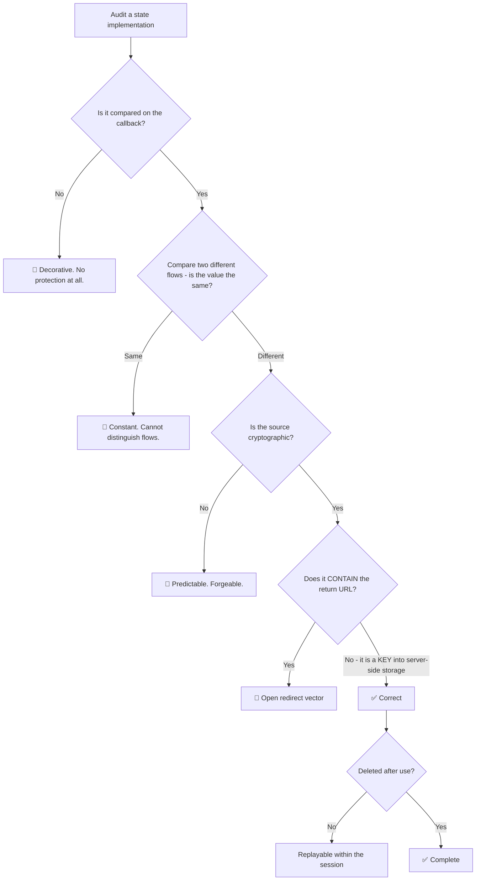
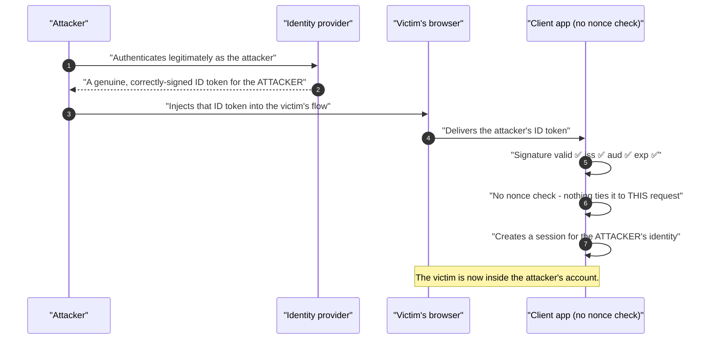
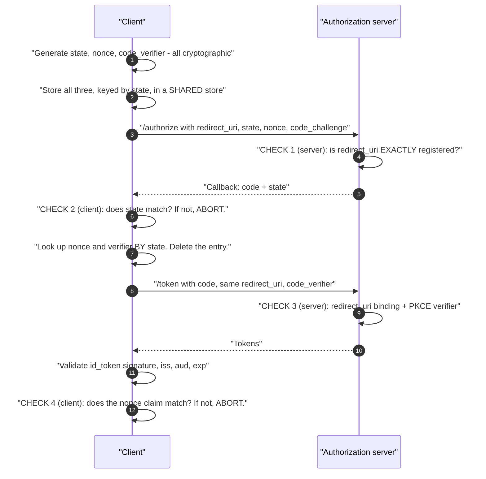
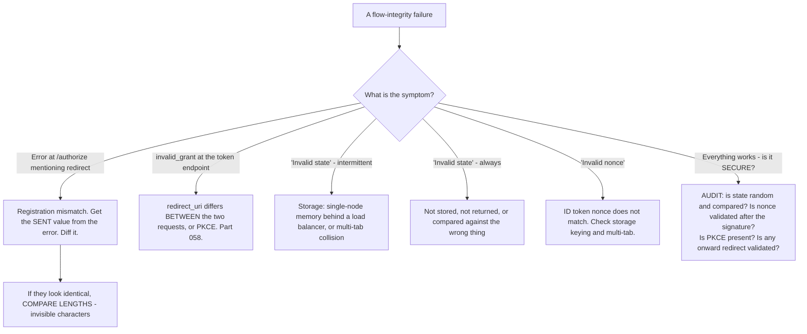

# Part 065 - Redirect URIs, state, nonce, and CSRF Defenses

> Section goal: Master the three parameters that hold an OAuth flow together — where the response is delivered, and the two values that prove it belongs to *this* flow. Redirect URI mismatches are the highest-volume OAuth ticket, and `state`/`nonce` failures are the quietest security defects.

Covers index item **065**. Maps to JD signals: *knowledge of OAuth*, *knowledge of OIDC*, *basic security concepts*, *experience with troubleshooting web applications*, and *strong analytical and problem-solving skills*.

---

## 1. Start From Zero: Three Guarantees



**The design principle:** each check is performed by a different party at a different moment, so no single failure is sufficient. `redirect_uri` is checked by the **server** before issuing; `state` and `nonce` by the **client** on the callback; PKCE by the **server** at the token endpoint.

> **Analogy.** A delivery to a verified address, with a tracking number you generated, containing an item stamped with a reference you specified. Wrong address, wrong tracking number, or wrong stamp — any one fails.
>
> **Where it stops:** a courier can improvise. Every one of these is an exact comparison, which is why "nearly right" fails identically to "completely wrong."

---

## 2. Redirect URIs

**The highest-volume OAuth ticket in existence.**

| Rule | Detail |
|---|---|
| **Registered in advance** | The server only accepts pre-registered values |
| **Exact string match** | Not prefix, not wildcard, not normalised |
| **Sent on both requests** | Authorization *and* token exchange (Part 058) |
| **Must be identical in both** | It is a binding check at the token endpoint |
| **HTTPS in production** | `http://localhost` is generally permitted for development |
| **No fragments** | Prohibited by the specification |

### Why exact matching is non-negotiable



**The open-redirect case is the one that surprises people.** Even with a perfectly registered, exactly-matched redirect URI, if that endpoint contains an open redirect — it forwards to a URL supplied in a parameter — an attacker can have the code delivered to the registered URI and immediately forwarded onward. **The registration was correct; the application leaked it.**

### The mismatch causes

| Cause | Example |
|---|---|
| Trailing slash | `/callback` vs `/callback/` |
| Scheme | `http` vs `https` — often a TLS-terminating proxy (Part 058) |
| Case in the **path** | Host is case-insensitive; **path is not** |
| Port | `:443` explicit vs implicit; `:3000` vs `:3001` |
| Environment drift | Staging registered, production in use |
| Custom domain | Tenant moved; registration did not (Part 097) |
| Encoding | Encoded in one request, raw in the other |
| Invisible characters | Pasted from a document — **compare lengths** (Part 048) |

### 🔍 Plain-English deep-dive: how to resolve a redirect mismatch in thirty seconds

This is the highest-volume OAuth ticket, and it is also one of the fastest to close — provided you ask for the right thing.

**The mistake that makes it slow:** asking what they configured. That produces a screenshot of an admin screen, a description of what they *believe* is registered, and several rounds of "it looks right to me."

**The move that makes it fast:** ask for the **actual error**, because the authorization server almost always includes the value it received.



**The `H` branch is worth knowing about** because it is genuinely confusing when it happens: the sent and registered values are byte-identical, and it still fails — because the application is calling a *different* client ID, a different tenant, or a different environment than the one whose registration is being examined. **The `client_id` in the authorization request settles it immediately**, and it is worth reading at the same time as the redirect URI.

**Two things to ask for in the same message**, so there is one round trip rather than three:

1. The **full error text**, or the `/authorize` URL from a HAR.
2. The **registered list** for the client ID in that URL.

**And one thing worth saying proactively:** if their redirect URI is built dynamically from the incoming request, that is the underlying cause even once this instance is fixed, because it will drift again behind a proxy or in another environment (Part 058). **One configured constant used in both requests is the durable answer.**

**Analogy:** a returned parcel where the depot has written the address they tried on the label. Reading it takes a second; asking the sender to describe the address they meant to write takes a week. **Where it stops:** a depot's note is handwritten and might be wrong. The error string is generated from the actual value received, which is why it is the most reliable artifact in this ticket.

---

## 3. `state`

**Checked by the client, on the callback.** Two jobs.

| Job | Detail |
|---|---|
| **CSRF protection** | Proves the response corresponds to a request this client started |
| **Return context** | A key into server-side storage holding the original destination |

```
1. Client generates a random value, stores it against the session
2. Sends it in the authorization request
3. Server returns it unchanged on the callback
4. Client compares — mismatch or absence means ABORT
5. Client deletes the stored value (single use)
```

### 🔍 Plain-English deep-dive: how `state` is got wrong while looking correct

`state` is present in most implementations and genuinely effective in fewer. Five distinct failures, all of which pass a casual code review:

| Failure | Why it looks fine |
|---|---|
| **Sent but never compared** | The parameter is visibly there in every capture |
| **A constant** | `state=12345` — present, and identical across all flows |
| **Predictable** | Derived from a timestamp or a user ID |
| **Not from a cryptographic source** | `Math.random()` — same defect as PKCE (Part 059) |
| **The return URL placed directly in `state`** | Convenient, and creates an **open redirect** |



**The second box is the check worth remembering**: compare `state` across two captures from the same application. If the value is identical, the protection is absent while appearing present — and a single HAR would never reveal it.

**The fourth box deserves explanation**, because putting the return URL in `state` is a natural design. The problem is that `state` round-trips through the browser and is attacker-influenceable if not validated — so a client that redirects to whatever URL it finds in `state` has an open redirect, which feeds directly back into §2's redirect-URI attacks and into phishing chains (Part 055). **The correct shape is `state` as an opaque random key into server-side storage that holds the return URL.**

**And the load-balancing consequence:** because `state` must be stored between two requests, a server-side application storing it in memory hits the Part 047 problem — the callback lands on a different node and `state` cannot be found. The symptom is intermittent "invalid state" errors that never reproduce locally.

**Analogy:** a numbered ticket you tear in half, keeping one side. Handing out the same number every time, or writing your destination on it and following whatever it says, both defeat the point. **Where it stops:** you would notice two identical tickets. Code compares whatever it was given against whatever it stored, and identical constants match perfectly.

---

## 4. `nonce`

**OIDC-specific. Checked by the client, inside the ID token.**

| Property | Detail |
|---|---|
| Sent in | The authorization request |
| Returned in | The **ID token payload** — not a URL parameter |
| Checked by | The client, after signature validation |
| Prevents | ID token **replay** and **injection** |
| Required | For OIDC implicit and hybrid flows; **strongly recommended always** |

### `state` versus `nonce`

| | `state` | `nonce` |
|---|---|---|
| Travels in | A **URL parameter**, both ways | Request parameter → **inside the ID token** |
| Binds | The **response** to the request | The **ID token** to the request |
| Protects against | Login CSRF | ID token replay/injection |
| Checked | On the callback, before exchange | After the ID token is validated |
| Defined by | OAuth | **OIDC** |

**They are not redundant.** `state` proves the *response* belongs to this flow; `nonce` proves the *ID token* does. An attacker who obtains a legitimately-issued ID token from elsewhere and injects it is stopped by `nonce` and not by `state`.

### 🔍 Plain-English deep-dive: what `nonce` catches that nothing else does

`nonce` is the check most often omitted, because everything works without it and its threat model is less intuitive than CSRF.

**The attack it blocks:**



**Every standard validation passes**, because the token is genuine — it was legitimately issued by the correct provider to the correct client. The only thing wrong is that it was not produced by *this* flow. `nonce` is the only check that asks that question.

**Where this matters most:**

| Situation | Why `nonce` is essential |
|---|---|
| Any flow returning an ID token via the **front channel** | The token is exposed and injectable |
| Hybrid flows | Same |
| Long-lived tokens accepted for login | A replayed token is usable for longer |
| Multi-tab or multi-window flows | Correlation is otherwise ambiguous |

**The implementation rule:** generate `nonce` from a cryptographic source, store it against the flow — **alongside `state`, keyed the same way** — send it, and after validating the ID token's signature, compare the `nonce` claim against the stored value. **The check must happen after signature validation**, because reading a claim from an unverified token is Part 043's worst mistake.

**In support, the tell is a customer whose ID token validation lists everything except `nonce`.** It is worth asking, because the omission is silent and the fix is small.

**Analogy:** a genuine, correctly-signed letter of introduction — for a different meeting. Everything about it is authentic; it simply was not written for this occasion. **Where it stops:** a person would notice the date and the addressee. Code checks only the fields it was told to check.

---

## 5. Putting Them Together



**Four checks, two parties, four different failure modes.** A customer who has all four is genuinely well protected; most have two.

---

## 6. Failure Modes

| Failure mode | What it looks like | Consequence | Correction |
|---|---|---|---|
| **`redirect_uri` not registered** | Error before login | 🔴 Highest-volume ticket | Register exactly |
| **Differs between the two requests** | `invalid_grant` | Exchange fails | One configured value |
| **Wildcard or prefix registration** | Convenient | 🔴 Code delivered to an attacker | Exact values only |
| **Open redirect on the registered URI** | Registration is correct | 🔴 Code forwarded onward | Validate any onward redirect |
| **`state` absent** | Works fine | 🔴 Login CSRF | Always send and compare |
| **`state` constant** | Looks present | 🔴 No protection | Random per flow |
| **`state` not compared** | Present in captures | 🔴 No protection | Compare on the callback |
| **Return URL inside `state`** | Convenient | 🔴 Open redirect | Opaque key into storage |
| **`state` in single-node memory** | Works locally | Intermittent "invalid state" | Shared store (Part 047) |
| **`nonce` absent** | Works fine | 🔴 ID token injection | Send and validate |
| **`nonce` checked before signature** | Appears validated | 🔴 Trusting unverified claims | Signature first |
| **Non-cryptographic randomness** | Works fine | 🔴 Predictable, forgeable | Cryptographic source |
| **Values not deleted after use** | Works fine | Replayable within the session | Single use |

---

## 7. Troubleshooting Decision Tree: Redirect, state, and nonce



### Worked example

*"Intermittent 'invalid state' errors. Works fine locally. Roughly one login in five fails in production."*

1. **"Intermittent, fine locally, a fraction in production" is a state-storage signature.** Local means one process; production means several.
2. **Ask two questions:** how many application instances, and where is `state` stored? Answer: four instances behind a load balancer, `state` in process memory.
3. **The cause:** the authorization request is served by node 1, which stores `state` locally. The callback is routed to node 3, which has never seen it. **One in four succeeding matches four nodes**, which is a satisfying confirmation.
4. **The arithmetic is worth stating** — it turns "intermittent" into "exactly what we would predict", which is far more convincing than a plausible theory.
5. **Fix:** move `state` — and `nonce`, and the PKCE verifier — into a shared store, keyed by `state`. Redis, the database, or a signed cookie all work.
6. **Note the alternative** they may already have: sticky sessions would mask it, but that is fragile — it breaks on scale-in, deployment, or node failure. **A shared store is the real fix.**
7. **Check the companions.** `nonce` and the PKCE verifier are almost certainly stored the same way and failing for the same reason, just less visibly. **Fixing only `state` leaves two silent failures.**
8. **Audit while you are there.** Is `state` cryptographically random and actually compared? Is `nonce` validated after signature verification? Those are two questions that cost nothing and often find something.

---

## 8. Lab: Break the Guarantees

**Purpose.** Reproduce every redirect, `state`, and `nonce` failure, and audit an implementation against all four checks.

**Prerequisites.** Parts 047, 058, 059 artifacts. A free Auth0 tenant with a test application, and a small server-side app you can run as multiple instances.

**Steps.**

1. Create `okta-prep/labs/065-flow-integrity/`.
2. **Register one redirect URI exactly.** Record it character for character.
3. **Break it seven ways.** Trailing slash, `http` vs `https`, path case, an explicit port, a different subdomain, an encoded value, and one with a zero-width character pasted in. **Record every error** and note which are distinguishable.
4. **The length trick.** For the invisible-character case, confirm the two values *look* identical and **differ in length** (Part 048).
5. **Two-request mismatch.** Use the correct URI at `/authorize` and a different one at the token endpoint. **Record the error** and confirm it is `invalid_grant`.
6. **`state` — omit it.** Confirm the flow succeeds. **Write one line on what protection was lost.**
7. **`state` — constant.** Run two flows with the same value. Confirm both succeed. **Capture both HARs and show that a single capture would not reveal it.**
8. **`state` — not compared.** Modify your client to ignore it. Confirm the flow still works. **This is the most common real defect.**
9. **`state` — return URL inside it.** Put a URL in `state` and have your callback redirect to it. **Then supply an external URL and confirm the open redirect.** Record it, then fix by using an opaque key.
10. **`state` — multi-node.** Run two instances behind a simple load balancer with in-memory storage. **Reproduce intermittent "invalid state"** and record the failure rate.
11. **Fix it** with a shared store keyed by `state`, holding `state`, `nonce`, and the verifier together. **Confirm the failure rate goes to zero.**
12. **`nonce` — omit it.** Confirm the flow succeeds and the ID token contains no `nonce`.
13. **`nonce` — injection.** Obtain a valid ID token from one flow and present it to your client's callback handler in a **different** flow. **With no `nonce` check, confirm it is accepted.** Then add the check and confirm it is rejected. **This is the lab's key artifact.**
14. **Ordering.** Deliberately check `nonce` **before** signature validation, then reason in writing about why that is unsafe. Fix the order.
15. **Randomness audit.** Inspect the source of `state`, `nonce`, and the verifier in your implementation. **Confirm all three are cryptographic** and cite where.
16. **Build `flow-audit`.** A checklist script or document covering all four checks, which you could walk through with a customer.
17. **Failure catalog + manifest.** Complete `MANIFEST.md`.

**Expected evidence.** Seven redirect-URI failures with errors, a length-comparison demonstration, a two-request mismatch, four `state` defects reproduced including a demonstrated open redirect, a multi-node failure with a measured rate and a fix, a `nonce` injection accepted then rejected, an ordering analysis, a cited randomness audit, and a reusable audit checklist.

**Validation rubric.**

| Check | Pass condition |
|---|---|
| Seven redirect failures | All recorded; distinguishability noted |
| Length comparison | Invisible character found by length |
| `state` constant | Two HARs; single-capture blindness shown |
| Open redirect | Demonstrated, then fixed |
| Multi-node | Rate measured, then zero after the fix |
| `nonce` injection | Accepted without the check, rejected with it |
| Ordering | Written reasoning; order corrected |
| Randomness | All three sources cited |
| Audit checklist | Covers all four checks |

**Cleanup and privacy.** Lab tenant, synthetic users, applications you own. **The open-redirect and ID-token-injection demonstrations must target only your own local application.** Restore all deliberately weakened checks immediately after recording. Delete the application and revoke tokens at the end.

---

## 9. JD Mapping

| Supplied JD signal | How this Part supports it |
|---|---|
| **Knowledge of OAuth and OIDC** | The four integrity checks and which party performs each |
| **Basic security concepts** | CSRF, injection, open redirect, exact matching |
| **Experience troubleshooting web applications** | Multi-node state storage; intermittent failures |
| Strong analytical and problem-solving skills | One-in-four failure rate matched to four nodes |
| Communicate technical concepts clearly | `state` versus `nonce` explained without hand-waving |
| **Promote best practices** | Auditing the checks that never produce tickets |
| Exceed expectations on response quality | Fixing the two silent companions alongside the reported one |

---

## 10. Candidate Honesty Note

- **Claim safety:** *Learned architecture and lab experience.*
- **The strongest thing you can say:** *"There are four integrity checks and they're performed by two different parties at different moments. The server checks the redirect URI before issuing, and checks PKCE at the token endpoint. The client checks `state` on the callback, and `nonce` inside the ID token after validating its signature. Most implementations have two of the four."*
- **A second point, and it is a genuinely useful test:** *"A constant `state` looks completely correct in a single HAR. Comparing `state` across two captures from the same application is a ten-second check that finds a protection which is present in form and absent in effect."*
- **A third, on the least-implemented check:** *"`nonce` is the one people skip, because everything works without it. It's the only thing that catches a genuine, correctly-signed ID token from a different flow being injected — signature, `iss`, `aud` and `exp` all pass, because the token really was issued by the right provider to the right client. It just wasn't produced by *this* request, and `nonce` is the only check that asks that."*
- **A fourth, diagnostic:** *"Intermittent 'invalid state' that works locally is `state` in single-node memory behind a load balancer. If one in four logins fails and they have four instances, that arithmetic matching is far more convincing than a theory — and `nonce` and the PKCE verifier are almost certainly stored the same way, failing more quietly."*
- **A fifth, on a natural design that is a defect:** *"Putting the return URL directly in `state` is convenient and creates an open redirect, because `state` round-trips through the browser. It should be an opaque random key into server-side storage that holds the return URL."*
- **A sixth, on redirect URIs:** *"Exact matching isn't pedantry — prefix or wildcard registration means an attacker who controls any matching path or subdomain receives the authorization code. And even a perfect registration leaks if that endpoint has an open redirect, because the code arrives correctly and is forwarded onward."*
- **Do not overstate:** you have not audited a production implementation. Say you have broken each guarantee deliberately in a lab.

---

## 11. Official Source Anchors

Accessed **26 August 2026**.

| Source | What it defines |
|---|---|
| IETF RFC 6749 §3.1.2 | Redirect endpoint registration and exact matching |
| IETF RFC 6749 §10.12, §10.15 | CSRF and the `state` parameter; open redirect |
| OpenID Connect Core §3.1.2.1, §15.5.2 | `nonce` generation and validation requirements |
| OAuth 2.0 Security BCP | Exact redirect matching; `state` and `nonce` guidance |
| IETF RFC 9700 | Redirect URI validation and code injection defences |
| IETF RFC 8252 | Native app redirect URIs and custom schemes |
| OWASP — CSRF and Unvalidated Redirects cheat sheets | The general web context |
| Auth0 and Okta documentation — allowed callback URLs | Vendor registration behavior |

**Revalidate after 26 August 2026:** the specifications are stable. Recheck the Security BCP and vendor guidance on wildcard support, which is being tightened.

---

## ⭐ Likely Interview Questions for This Section

### Q1. "Why must redirect URIs be matched exactly?"
> *Model answer:* "Because the authorization code is delivered to whatever URI the server accepts, so anything less than exact matching hands an attacker a way to receive it. With prefix matching, an attacker who finds any path on the registered host that reflects or redirects gets the code. With wildcard subdomains, controlling or taking over any one subdomain is enough. And there's a case that surprises people: even a perfectly registered, exactly-matched URI leaks the code if that endpoint contains an open redirect, because the code arrives correctly and is then forwarded onward with it attached. So exact matching is necessary but not sufficient — the registered endpoint also has to not redirect onward to unvalidated destinations."

### Q2. "What's the difference between `state` and `nonce`?"
> *Model answer:* "Different things bound at different points by different mechanisms. `state` is an OAuth parameter that travels as a URL parameter in both directions; the client generates it, stores it, and compares it on the callback. It binds the *response* to a request this client started, which is what stops login CSRF. `nonce` is an OIDC parameter that goes out as a request parameter and comes back *inside the ID token payload*; the client compares it after validating the token's signature. It binds the *ID token* to this request, which stops a genuine ID token obtained elsewhere from being injected. They're not redundant — an attacker with a legitimately-issued ID token from their own session is stopped by `nonce` and not by `state`."

### Q3. "How can `state` be present and useless?"
> *Model answer:* "Five ways, all of which pass a casual review. It's sent but never compared on the callback, which is the most common. It's a constant, so it's present in every capture and can't distinguish flows. It's predictable — derived from a timestamp or a user ID. It's from a non-cryptographic source like `Math.random()`. Or the return URL is placed directly in it, which is convenient and creates an open redirect, because `state` round-trips through the browser. The check I'd recommend is comparing `state` across two captures from the same application: if it's identical, the protection is present in form and absent in effect, and a single HAR would never show that."

### Q4. "What attack does `nonce` prevent?"
> *Model answer:* "ID token injection. An attacker authenticates legitimately as themselves, gets a genuine correctly-signed ID token, and injects it into a victim's flow. Every standard check passes — the signature is valid, `iss` is right, `aud` is the correct client, it isn't expired — because the token really was issued by the right provider to the right client. The only thing wrong is that it wasn't produced by *this* request, and `nonce` is the only check that asks that question. The result is the victim being logged in as the attacker, which is the same harm as login CSRF: they then put something valuable into an account someone else controls. It matters most anywhere an ID token comes back through the front channel, and the implementation detail is that the check must happen *after* signature validation, never before."

### Q5. "Intermittent 'invalid state' errors in production but not locally. Diagnosis?"
> *Model answer:* "`state` stored in single-node memory behind a load balancer. The authorization request is served by one node, which stores `state` locally; the callback is routed to a different node, which has never seen it. Locally there's one process, so it always works. I'd ask how many instances they run and where `state` is stored, and then check the arithmetic: if one login in four fails and they have four instances, that match is much more convincing than a plausible theory. The fix is a shared store keyed by `state`. And the important follow-through is that `nonce` and the PKCE verifier are almost certainly stored the same way and failing for the same reason, just less visibly — so fixing only `state` leaves two silent failures behind."

### Q6. "A customer wants a wildcard redirect URI for their preview environments. Response?"
> *Model answer:* "I'd take the need seriously, because per-branch preview deployments are a real workflow and registering dozens of URIs by hand is genuinely painful. But wildcards mean an attacker who controls or takes over any matching subdomain receives authorization codes, and preview environments are exactly where subdomain takeover is most likely — they're ephemeral, often left dangling, and rarely monitored. The alternatives I'd offer: a separate tenant or application for preview environments with its own wildcard-free registration, a single stable preview host that routes internally by branch, or automating registration via the management API as part of the deployment pipeline. That last one usually solves it, because the objection is the manual effort rather than the principle."

### Q7. "Walk me through all the integrity checks in a code flow."
> *Model answer:* "Four, by two parties. The server checks that the `redirect_uri` in the authorization request is exactly registered, before it issues anything. The client checks `state` on the callback, before exchanging the code — mismatch or absence means abort. The server checks the PKCE verifier against the stored challenge at the token endpoint, and also that `redirect_uri` matches what the code was issued for. Then the client validates the ID token — signature, `iss`, `aud`, `exp` — and finally compares the `nonce` claim against what it stored. The design property is that they're independent: different parties, different moments, different mechanisms, so no single failure is sufficient. In practice most implementations have the redirect URI and `state`, and are missing `nonce`, PKCE, or both."

### Q8. "How would you audit an OAuth implementation for these?"
> *Model answer:* "Six questions, and none of them produce tickets, which is exactly why they need asking. Is `state` compared on the callback, not just sent? Is it different across two flows — I'd compare two captures rather than trust one. Is it from a cryptographic source? Is the return URL an opaque key into server-side storage rather than the URL itself? Is `nonce` sent and validated, and validated *after* signature verification? And is PKCE present with `S256` explicitly set? I'd also check whether the callback endpoint redirects onward to anything unvalidated, because that turns a correct redirect-URI registration into a code leak. Every one of these is invisible when present and invisible when absent, so an audit is the only way they surface."

---

## 🧠 30-Second Memory Hooks

- **FOUR checks, TWO parties:** `redirect_uri` (**server**) · `state` (**client**) · PKCE (**server**) · `nonce` (**client**).
- **`redirect_uri`: EXACT match, registered, on BOTH requests, identical in both.**
- **Wildcards and prefixes hand codes to attackers.** So does an **open redirect** on a correct URI.
- **Mismatch causes:** trailing slash · scheme · **path case** · port · environment · custom domain · **invisible characters (compare LENGTHS)**.
- **`state` binds the RESPONSE. `nonce` binds the ID TOKEN.** Not redundant.
- **Constant `state` looks perfect in one HAR.** Compare **two** flows.
- **Return URL inside `state` = open redirect.** Use an opaque **key** into storage.
- **`nonce` catches a GENUINE ID token from a DIFFERENT flow.** Everything else passes.
- **Validate `nonce` AFTER the signature.** Never before.
- **Intermittent "invalid state" + fine locally = single-node memory behind a load balancer.**
- **Fix `nonce` and the PKCE verifier at the same time** — same storage, same silent failure.
- **All three values: cryptographic randomness, single use, deleted after.**

---

## ✅ Completion Checklist

- [ ] **Knowledge:** I can name all four checks and which party performs each, and explain `state` versus `nonce` precisely.
- [ ] **Lab artifact:** `065-flow-integrity/` contains seven redirect failures, a demonstrated open redirect, a multi-node failure measured and fixed, an ID-token injection accepted then rejected, and an audit checklist.
- [ ] **Spoken:** I can explain `state` versus `nonce` in 45 seconds and diagnose intermittent invalid-state in 30.
- [ ] **Judgement:** I fix the silent companions alongside the reported failure, and I offer alternatives to wildcards rather than refusing.
- [ ] **Honesty check:** I say "broken deliberately in a lab," not production auditing.
- [ ] **Source check:** I have read RFC 6749 §10.12 and OIDC Core §3.1.2.1 myself.

---

*Next suggested section:* **[Part 066 - OAuth 2.1 and Security Best Current Practice](Part-066-oauth-21-and-security-best-current-practice.md)** — what has changed since RFC 6749, what is now required, and how to talk about it with customers.
