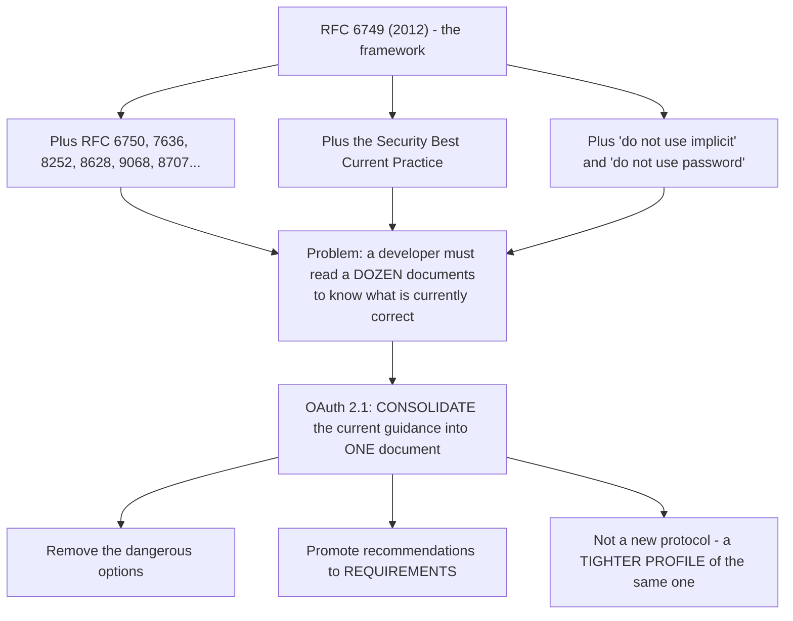
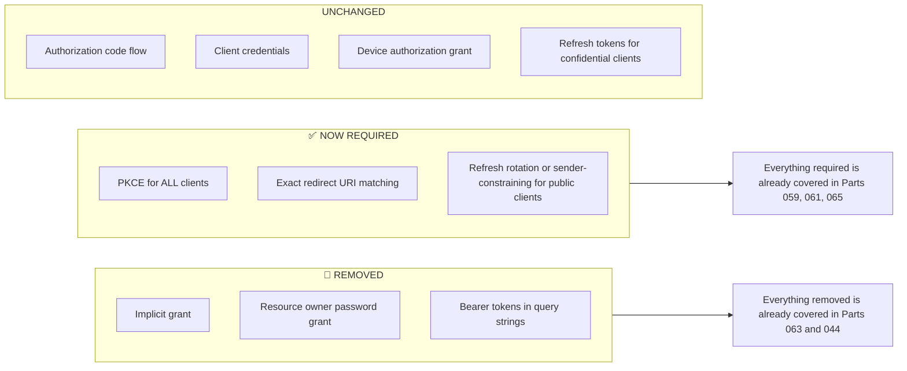
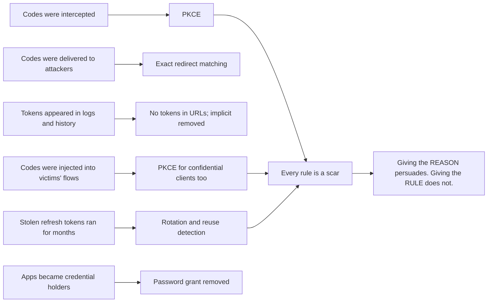
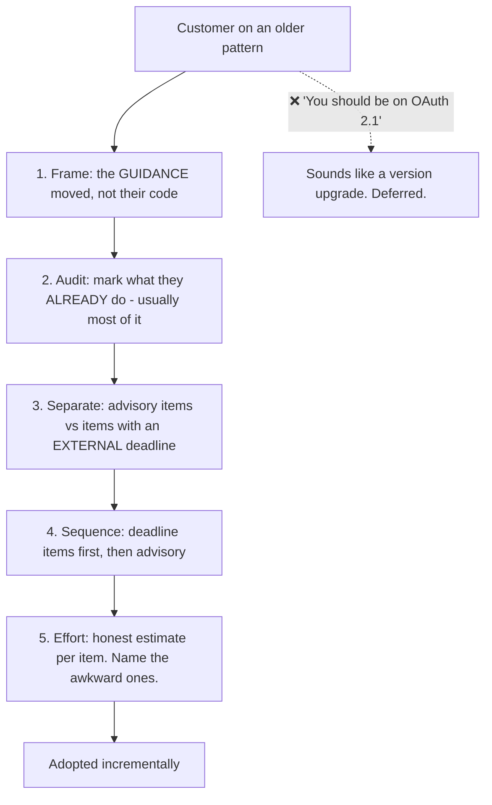
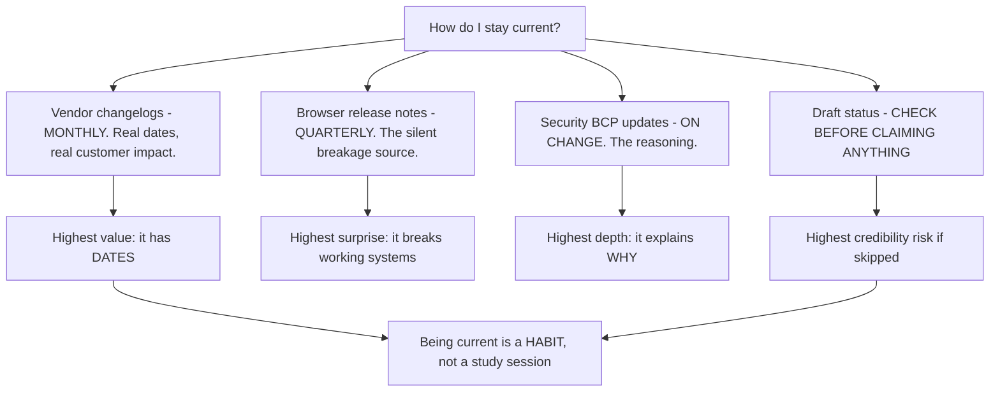
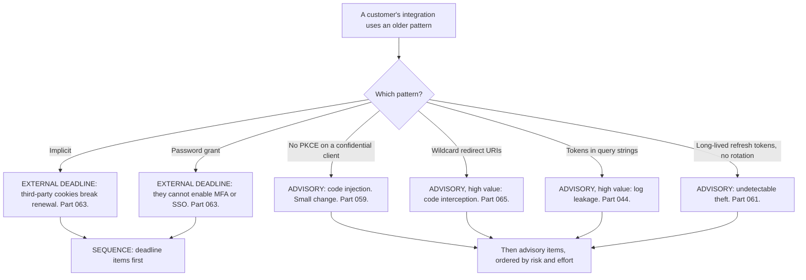

# Part 066 - OAuth 2.1 and Security Best Current Practice

> Section goal: Understand what has changed since RFC 6749, what is now required rather than recommended, and how to talk about it with a customer whose integration was correct when it was built. Being current here is one of the clearest differentiators in an interview for this role.

Covers index item **066**. Maps to JD signals: *knowledge of OAuth*, *basic security concepts*, *promote best practices*, *communicate technical concepts clearly*, and *continuous learning*.

---

## 1. Start From Zero: Why a 2.1 At All

RFC 6749 was published in 2012 as a **framework** with many options. Fifteen years of deployment experience showed that some options were dangerous, some were unnecessary, and the guidance had scattered across a dozen documents.

**The framing that matters:** OAuth 2.1 is **not a new version to migrate to**. It is a description of what a correctly-built OAuth 2.0 integration already looks like today. **A customer who is following current best practice is already doing 2.1** — which is a much more comfortable message than "you need to upgrade."

> **Analogy.** A building code consolidation that gathers fifteen years of amendments into one document and removes the practices that were withdrawn. Nobody's compliant building needs rebuilding; the document just stops requiring fifteen separate readings.
>
> **Where it stops:** a building code is enforced on a date. OAuth 2.1 has no enforcement mechanism at all — which is why the conversation is persuasive rather than mandatory.

---

## 2. What OAuth 2.1 Changes

| Change | RFC 6749 | OAuth 2.1 |
|---|---|---|
| **PKCE** | Optional; public clients only | ✅ **Required for all clients** using the code flow |
| **Implicit grant** | Defined | 🔴 **Removed** |
| **Resource owner password grant** | Defined | 🔴 **Removed** |
| **Redirect URI matching** | Loosely worded | ✅ **Exact string match required** |
| **Bearer tokens in query strings** | Discouraged | 🔴 **Prohibited** |
| **Refresh tokens for public clients** | Ambiguous | ✅ Must be **sender-constrained or rotated** |
| **`state` for CSRF** | Recommended | Largely superseded by PKCE for the code flow; still needed for return context |

**Notice that the third column is large.** The flows that matter most are unchanged, which is why "2.1" overstates the disruption.

### 🔍 Plain-English deep-dive: every removal is a lesson someone learned expensively

The changes look arbitrary until you attach each one to the failure that caused it. **Being able to give the reason rather than the rule is what makes the advice land.**

| Change | The lesson behind it |
|---|---|
| **Implicit removed** | Tokens in the front channel leak into history, `Referer` headers and logs — and nothing binds the token to the request, so injection works (Part 063) |
| **Password grant removed** | The client handling credentials blocks MFA, passkeys and federation entirely, and quietly turns the app into a credential holder (Part 063) |
| **PKCE for all clients** | Code injection defeats a client secret; the secret proves identity, not continuity (Part 059) |
| **Exact redirect matching** | Prefix and wildcard matching delivered authorization codes to attackers (Part 065) |
| **No tokens in query strings** | URLs are logged everywhere by default, with no attacker involved (Part 044) |
| **Rotation for public clients** | An unrotated stolen refresh token runs for its whole lifetime, undetected (Part 061) |

**Why this matters in a support conversation:** "the spec says you must use PKCE" invites the reply *"but our client has a secret."* **"A secret proves you're the registered client; it doesn't prove you're the party that started this flow, and code injection exploits exactly that gap"** answers the objection before it is raised.

**It also helps you judge severity honestly.** Not every item carries the same weight for every customer: a wildcard redirect URI on a preview environment with subdomain takeover risk is urgent; missing PKCE on a confidential server-side client with a well-implemented `state` check is real but lower. **Knowing the underlying failure lets you rank rather than recite.**

**Analogy:** safety rules on a worksite, each traceable to a specific accident. Told as rules they feel like bureaucracy; told with the accident attached they change behaviour. **Where it stops:** worksite accidents are visible and remembered. These failures happened to other companies, quietly, so the reason has to be supplied deliberately.

---

## 3. The Security BCP

The Best Current Practice document (RFC 9700) is where the reasoning lives, and it is worth knowing separately because it moves faster than the 2.1 draft.

| Recommendation | Covered in |
|---|---|
| PKCE for all clients | Part 059 |
| Exact redirect URI matching | Part 065 |
| No tokens in URLs | Part 044 |
| Refresh rotation with reuse detection | Part 061 |
| Sender-constrained tokens where possible | Part 068 |
| Audience-restrict access tokens | Part 064 |
| Do not use implicit or password grants | Part 063 |
| Short access-token lifetimes | Part 045 |

### 🔍 Plain-English deep-dive: how to raise this with a customer without implying they were wrong

The awkwardness of this topic is real: a customer built an integration that was correct, followed the specification, and now the guidance has moved. Handled badly, the message is *"the thing you built is bad."* Handled well, it is *"here is what changed and why."*

**Three framings that work, in rough order of usefulness:**

**1. "The guidance moved, not your code."** Their implementation was correct when built. The specification learned from fifteen years of deployment. **That is the specification working, not the customer failing.**

**2. "Most of it you already do."** Walk the list and mark what they already have. Usually the code flow, exact redirect matching, and short lifetimes are already in place. **Two or three items remain, and a short list is actionable where a wholesale review is not.**

**3. "Here is the one with a deadline."** Some items are advisory; some have external pressure — browser cookie changes affecting implicit renewal, or provider removal timelines. **Separating "should" from "must, by a date you don't control" respects their prioritisation.**

**The phrase to avoid is "upgrade to OAuth 2.1"**, because it sounds like a version migration with a project attached. There is nothing to upgrade to — it is a profile, not a release. **"Adopt the current recommendations, starting with the two that have deadlines"** describes the same work and is a fraction of the perceived cost.

**And the honest caveat worth including:** OAuth 2.1 is still a draft. **Advising urgency on a draft is not credible**, so the pressure should come from the BCP, from browser behaviour, and from provider timelines — all of which are real and dated — rather than from the draft's existence.

**Analogy:** a doctor reviewing long-standing medication. "Everything you're taking was right when prescribed; two of them have newer alternatives, and one is being discontinued next year." That is a plan. "Your prescription is out of date" is an alarm with no action attached. **Where it stops:** a prescription review has an appointment. Nothing schedules an OAuth review, which is why the deadline framing has to supply the urgency.

---

## 4. What Is Still Being Debated

Knowing where the edges are is a genuine current-awareness signal.

| Topic | Status |
|---|---|
| **Sender-constrained tokens by default** | DPoP is standardised (RFC 9449); default-on is not settled (Part 068) |
| **Browser-based application patterns** | The BFF pattern is favoured; SPA token storage guidance is still evolving (Part 047) |
| **`state` versus PKCE for CSRF** | PKCE covers much of it for the code flow; `state` remains for return context |
| **Token exchange adoption** | RFC 8693 is standardised; usage patterns are still maturing (Part 067) |
| **Identity for AI agents** | Genuinely open — delegation, bounded authority, and audit (Part 109) |

**That last row is the one worth having an opinion about.** Okta's current positioning covers human and machine identity explicitly, and Auth0 offers an AI-agent product area — so it is directly relevant, current, and not something most candidates will have thought about.

### 🔍 Plain-English deep-dive: how to stay current without reading every draft

This area moves, and a support engineer who is a year out of date gives advice that sounds confident and is wrong. **But reading every IETF draft is neither realistic nor necessary.**

A proportionate approach, roughly in order of value per unit of effort:

| Source | Cadence | Why |
|---|---|---|
| **The vendor's changelog and deprecation notices** | Monthly | Directly affects customers; has real dates attached |
| **Browser release notes on cookies and storage** | Quarterly | The most common source of "it broke and we changed nothing" |
| **RFC 9700 (Security BCP)** | On update | Where reasoning lives; moves faster than the 2.1 draft |
| **oauth.net summaries** | Quarterly | Accessible digests rather than raw drafts |
| **The OAuth 2.1 draft status** | Before any interview or written recommendation | Being wrong about draft status is worse than silence |
| Raw IETF drafts | Only when a specific question demands it | High effort, low routine value |

**The browser row is the one most people underweight**, and it is where the "we changed nothing and it broke" tickets come from. A third-party cookie default changing in a browser release breaks iframe silent authentication for customers who have made no change at all (Parts 017, 063, 076). **Knowing that before the tickets arrive turns a mystery into a prepared answer.**

**And the last row is worth being disciplined about.** Stating that something is required when it is in a draft is the kind of error that is remembered — in an interview and with a customer. **Checking takes thirty seconds and the cost of not checking is disproportionate.**

**The honest framing for an interview:** *I track vendor changelogs and browser release notes regularly because those have dates and affect customers directly, I read the Security BCP when it updates because that is where the reasoning is, and I check the OAuth 2.1 draft status before I claim anything about it.* That is a credible, sustainable habit rather than a claim to have read everything.

**Analogy:** a doctor who follows clinical guidance updates and drug safety notices rather than reading every journal. The point is knowing what changed and what it means for the people in front of you. **Where it stops:** clinical guidance is pushed to practitioners. Nothing pushes OAuth changes to you, which is why it has to be a deliberate habit.

---

## 5. Failure Modes

| Failure mode | What it looks like | Consequence | Correction |
|---|---|---|---|
| **"Upgrade to OAuth 2.1"** | Sounds like a version migration | Deferred as a project | It is a profile; frame it as recommendations |
| **Advising urgency from a draft** | "The spec requires it" | 🔴 Not credible — it is a draft | Cite the BCP and real deadlines |
| **Treating all items as equal** | A long undifferentiated list | Nothing gets done | Sequence by external deadline |
| **Implying prior work was wrong** | "You shouldn't have done that" | Defensive customer | The guidance moved |
| **Missing what they already do** | Wholesale review proposed | Overstated effort | Audit first, then a short list |
| **Assuming provider support** | Recommending DPoP blindly | Unimplementable advice | Check discovery (Part 057) |
| **Ignoring the BCP** | Only reading RFC 6749 | Outdated advice | The BCP is where reasoning lives |
| **Assuming 2.1 changes everything** | Alarm | Wasted effort | The code flow is unchanged |

---

## 6. Troubleshooting Decision Tree: Modernisation Conversations

### Worked example

*"Our security team read about OAuth 2.1 and wants to know if we're compliant. What do we need to do?"*

1. **Correct the framing first, gently.** OAuth 2.1 is a draft consolidation rather than a version with a compliance bar. "Compliant" is not quite the right frame; "aligned with current recommendations" is.
2. **Audit rather than prescribe.** Ask for their `/authorize` URL and application configuration, and check the seven BCP items in §3 (Part 057, Part 058).
3. **Finding, typical:** they already use the code flow, exact redirect URIs, short access-token lifetimes, and tokens in headers. **Four of seven are already done.**
4. **Lead with that.** *"Most of this you already do"* changes the whole conversation, and it happens to be true.
5. **Three items remain:** no PKCE on their confidential client, no refresh rotation, and one wildcard redirect URI in a preview environment.
6. **Sequence by pressure, not by severity alone.** The wildcard is the highest actual risk and is a configuration change; PKCE is an SDK flag; rotation needs client-side serialisation work (Part 061). **None has a hard external deadline**, so say that too — over-claiming urgency once costs credibility on every future recommendation.
7. **Give effort estimates per item**, and name the awkward one: rotation requires cross-tab serialisation, which is real work.
8. **Offer the artifact they actually need**, since a security team asked: a short written summary they can take back, listing each recommendation, their current state, the gap, and the effort. **That is worth more than the fix**, because it is what closes the internal question.

---

## 7. Lab: Audit Against Current Practice

**Purpose.** Build a reusable audit that checks an integration against current guidance, and produce the summary document a security team would want.

**Prerequisites.** Parts 057–065 artifacts. A free Auth0 tenant with a deliberately old-fashioned test application and a modern one.

**Steps.**

1. Create `okta-prep/labs/066-oauth21/`.
2. **Build the checklist.** From §3, write the eight items, each with: what to check, where to check it, and what "pass" looks like.
3. **Build a deliberately outdated application.** Implicit, wildcard redirect, no PKCE, long-lived non-rotating refresh, and a token passed in a query string. **Record its configuration.**
4. **Build a modern application.** Code + PKCE, exact redirect, rotation, short lifetimes, header-only tokens.
5. **Run the audit against both.** **Record every item's result** for each.
6. **Automate what you can.** Extend Part 058's `authz-url-parse` to flag: implicit response types, missing `code_challenge`, missing or trivial `state`, and missing `audience`. **Run it against both applications.**
7. **Check the server side.** Fetch discovery for your tenant and record which recommendations it can even support: PKCE methods, `resource_indicators_supported`, DPoP if present (Part 068).
8. **Query-string prohibition.** Send a token in a query string, then find it in your server's access log (Part 044). **Screenshot it** — this is the item customers most often dismiss.
9. **Wildcard demonstration.** If your tenant permits a wildcard redirect, register one and **write out concretely how an attacker would exploit it** in your setup. Then remove it.
10. **PKCE on a confidential client.** Add PKCE to your Regular Web Application and confirm it still works. **Time how long the change took** — that number is useful in a customer conversation.
11. **Rotation.** Enable refresh rotation on the modern app and confirm reuse detection fires (Part 061). **Note the client-side work required** to serialise refresh.
12. **Write the customer summary.** `oauth-current-practice.md` — a table with: recommendation, why it exists, current state, gap, effort, and whether there is an external deadline. **This is the deliverable a security team asks for.**
13. **Write the conversation script.** Half a page: how to raise this without implying prior work was wrong, using the three framings from §3.
14. **Failure catalog + manifest.** Complete `MANIFEST.md`.

**Expected evidence.** An eight-item checklist, two contrasting applications, a completed audit of both, an extended automated parser, a server-capability check, a token found in an access log, a written wildcard exploitation path, a timed PKCE change, rotation with reuse detection, a customer-ready summary table, and a conversation script.

**Validation rubric.**

| Check | Pass condition |
|---|---|
| Checklist | Eight items, each with a concrete test |
| Two applications | Deliberate contrast configured |
| Audit | Both applications, every item recorded |
| Automation | Parser flags all four conditions |
| Server capability | Discovery-based, recorded |
| Query-string leak | Found in a log and screenshotted |
| Wildcard | Exploitation path written concretely |
| PKCE change | Timed |
| Summary table | Six columns, customer-ready |
| Conversation script | Uses all three framings |

**Cleanup and privacy.** Lab tenant, synthetic users, your own applications only. **Remove the wildcard redirect and disable legacy grants immediately after recording** — leaving them is the Part 063 failure mode. Delete both applications and revoke tokens at the end.

---

## 8. JD Mapping

| Supplied JD signal | How this Part supports it |
|---|---|
| **Knowledge of OAuth** | Current guidance, not just RFC 6749 |
| **Basic security concepts** | The reasoning behind each requirement |
| **Promote best practices** | An audit and a customer-ready summary |
| **Communicate technical concepts clearly** | Raising modernisation without implying fault |
| Continuous learning | Knowing what is settled and what is still debated |
| Exceed expectations on response quality | Delivering the document the security team actually needed |
| Customer-obsessed attitude | Leading with what they already do right |

---

## 9. Candidate Honesty Note

- **Claim safety:** *Learned architecture and lab experience*, with genuinely current knowledge — which is the point of this Part.
- **The strongest thing you can say:** *"OAuth 2.1 isn't a new protocol or a version to migrate to — it's a consolidation of fifteen years of guidance into one document. It removes implicit and the password grant, requires PKCE for all clients including confidential ones, requires exact redirect URI matching, and prohibits bearer tokens in query strings. The authorization code flow, client credentials, and the device grant are unchanged, which is why 'upgrade to 2.1' overstates it."*
- **A second point, on how to raise it:** *"I'd avoid 'you should upgrade to OAuth 2.1,' because it sounds like a version migration with a project attached. The framing that works is: the guidance moved, not your code; most of this you already do; and here are the one or two items with a deadline you don't control. A short list gets acted on where a wholesale review doesn't."*
- **A third, on credibility:** *"OAuth 2.1 is still a draft, so I wouldn't claim urgency from it. The real pressure comes from the Security BCP, from browser third-party cookie changes breaking implicit renewal, and from provider removal timelines. Over-claiming urgency once costs credibility on every future recommendation."*
- **A fourth, on what a security team actually wants:** *"When a security team asks 'are we compliant', the deliverable isn't a fix — it's a table listing each recommendation, their current state, the gap, the effort, and whether there's an external deadline. That's what closes their internal question, and it's worth more than the code change."*
- **A fifth, on being current:** *"The parts still being debated are worth knowing: whether sender-constrained tokens become default, how browser-based apps should store tokens as third-party cookies disappear, and identity for AI agents — which is genuinely open and is directly relevant given Okta's human-and-machine positioning."*
- **Do not overstate:** you have not advised customers on modernisation. Say you track the current documents deliberately and have audited both patterns in a lab.

---

## 10. Official Source Anchors

Accessed **26 August 2026**.

| Source | What it defines |
|---|---|
| OAuth 2.1 draft (IETF) | The consolidated profile; removals and new requirements |
| IETF RFC 9700 (OAuth 2.0 Security BCP) | The reasoning behind every recommendation |
| IETF RFC 6749 | The original framework, for contrast |
| IETF RFC 7636 | PKCE — now required for all clients |
| IETF RFC 9449 (DPoP) | Sender-constrained tokens (Part 068) |
| OAuth 2.0 for Browser-Based Applications | Current SPA and BFF guidance |
| IETF RFC 8252 | Native app best practice |
| oauth.net — OAuth 2.1 summary | Accessible overview of the changes |
| Auth0 and Okta security guidance | Vendor positions and timelines |

**Revalidate after 26 August 2026:** OAuth 2.1 is a **draft** and the BCP is updated. **Check the current status before any interview** — being wrong about draft status is worse than not mentioning it.

---

## ⭐ Likely Interview Questions for This Section

### Q1. "What is OAuth 2.1?"
> *Model answer:* "A consolidation rather than a new protocol. RFC 6749 was published in 2012 as a framework with many options, and fifteen years of deployment experience showed some were dangerous and some unnecessary — but that guidance ended up scattered across a dozen RFCs and a best-practice document. OAuth 2.1 gathers it into one place: it removes the implicit and password grants, requires PKCE for all clients including confidential ones, requires exact redirect URI matching, and prohibits bearer tokens in query strings. The authorization code flow, client credentials and the device grant are unchanged. So a customer already following current best practice is effectively doing 2.1 already, which is a much more comfortable message than 'you need to upgrade.'"

### Q2. "What changed most significantly?"
> *Model answer:* "PKCE becoming required for all clients, including confidential ones. It was originally a workaround for public clients that can't hold a secret, but it also defends against authorization code injection — where an attacker injects a code from their own flow into a victim's callback, and the victim's client exchanges it with its own valid secret and ends up holding tokens for the attacker's account. A client secret doesn't stop that; PKCE does. The removals matter too — implicit and the password grant — but those were already strongly discouraged, so making it formal changes less in practice. Exact redirect URI matching being explicit is quietly important as well, because loose matching was where a lot of real code-interception attacks lived."

### Q3. "How do you raise modernisation with a customer whose integration works?"
> *Model answer:* "Carefully, because their integration was correct when they built it and the guidance moved — that's the specification working, not them failing, and saying so explicitly changes the tone. Then I'd audit rather than prescribe, because most customers already do four or five of the items, and leading with 'most of this you already do' is both true and disarming. Then separate the items with an external deadline — browser cookie changes breaking implicit renewal, provider removal timelines — from the advisory ones, and sequence accordingly. And I'd avoid the phrase 'upgrade to OAuth 2.1,' because it sounds like a version migration with a project attached, when it's actually two or three specific changes."

### Q4. "Is OAuth 2.1 final?"
> *Model answer:* "No — it's still a draft, and I'd be careful not to claim otherwise, because over-claiming urgency once costs credibility on everything you recommend afterwards. The useful thing is that its content isn't speculative: everything in it comes from documents that are already final, mainly the Security Best Current Practice, plus the PKCE and native-app RFCs. So the guidance is current even though the consolidation isn't published. When I need urgency in a customer conversation I'd source it from real deadlines — browsers removing third-party cookies, a provider's deprecation timeline, a compliance requirement they already have — rather than from the draft existing."

### Q5. "What's in the Security BCP that isn't obvious from RFC 6749?"
> *Model answer:* "The reasoning, mostly, which is why it's worth reading separately. RFC 6749 tells you the mechanics; the BCP tells you which options turned out to be dangerous and why. Specific things: PKCE for all clients rather than just public ones; exact redirect URI matching, because loose matching enabled real attacks; no tokens in URLs, because of logs and `Referer` headers; refresh rotation with reuse detection; audience-restricting access tokens so one token doesn't work everywhere; sender-constrained tokens where supported; and short access-token lifetimes. It also moves faster than the 2.1 draft, so it's the document I'd check for current thinking rather than relying on the consolidation."

### Q6. "What's still unsettled in this space?"
> *Model answer:* "A few things. Whether sender-constrained tokens become the default — DPoP is standardised in RFC 9449, but default-on isn't settled, and adoption needs both client key management and server support. How browser-based applications should hold tokens as third-party cookies disappear: the backend-for-frontend pattern is favoured, but plenty of applications have no backend. Token exchange is standardised but usage patterns are still maturing. And the genuinely open one is identity for AI agents — an agent acting on a user's behalf needs its own identity, delegated and bounded authority, and an audit trail distinguishing 'the user did this' from 'the agent did this for the user.' That's directly relevant given Okta's human-and-machine positioning and Auth0's AI agent product area."

### Q7. "A security team asks whether their integration is 'OAuth 2.1 compliant.' What do you deliver?"
> *Model answer:* "First a gentle correction on framing — 2.1 is a draft consolidation rather than a standard with a compliance bar, so 'aligned with current recommendations' is more accurate. Then the actual deliverable, which isn't a code change: a table listing each recommendation, why it exists, their current state, the gap, the effort, and whether there's an external deadline. That's what closes the internal question they're actually trying to answer, and it lets them prioritise rather than treating it as one undifferentiated block. I'd audit their `/authorize` URL and application configuration to fill it in, and I'd expect to be marking most rows as already done — which is the most useful thing in the document, because it turns an alarming question into a short list."

### Q8. "Why does PKCE now apply to confidential clients?"
> *Model answer:* "Because it defends against something a client secret doesn't. The secret proves 'I'm the registered client,' which is an identity claim. PKCE proves 'I'm the same party that started this flow,' which is a continuity claim, and those are different properties. The attack that needs the second one is authorization code injection: an attacker gets a valid code from their own flow, injects it into a victim's callback, and the victim's client exchanges it using its own perfectly valid secret — ending up with tokens for the attacker's account and the victim operating inside it. The secret was never the missing piece. PKCE stops it because the verifier the victim's client holds doesn't match the challenge the attacker's code was bound to. And practically it's usually a one-line SDK flag, so the cost is close to zero."

---

## 🧠 30-Second Memory Hooks

- **OAuth 2.1 = CONSOLIDATION, not a new protocol.** Nothing to "upgrade to."
- **Removed:** implicit · resource owner password · **tokens in query strings**.
- **Now required:** **PKCE for ALL clients** · exact redirect URI matching · rotation or sender-constraining for public clients.
- **Unchanged:** authorization code · client credentials · device grant.
- **PKCE for confidential clients stops CODE INJECTION** — a secret does not.
- **2.1 is a DRAFT.** Do not claim urgency from it.
- **Urgency comes from: the BCP · browser cookie changes · provider timelines.**
- **Never say "upgrade to OAuth 2.1."** Say "adopt the current recommendations."
- **Three framings:** the guidance moved, not your code · **most of this you already do** · here is the one with a deadline.
- **A security team wants a TABLE**, not a fix: recommendation · state · gap · effort · deadline.
- **Still open:** DPoP by default · SPA storage after third-party cookies · **identity for AI agents**.

---

## ✅ Completion Checklist

- [ ] **Knowledge:** I can list every removal and every new requirement, and say what is unchanged.
- [ ] **Lab artifact:** `066-oauth21/` contains an eight-item checklist, two contrasting applications audited, a token found in a log, a timed PKCE change, and a customer-ready summary table.
- [ ] **Spoken:** I can describe OAuth 2.1 in 45 seconds and run the modernisation conversation in 90.
- [ ] **Judgement:** I do not claim urgency from a draft, and I lead with what the customer already does.
- [ ] **Currency check:** I have verified the OAuth 2.1 draft status **this week**, not from memory.
- [ ] **Source check:** I have read the OAuth 2.1 draft's change list and RFC 9700's summary myself.

---

*Next suggested section:* **[Part 067 - Token Exchange, Delegation, and Impersonation](Part-067-token-exchange-delegation-and-impersonation.md)** — how one service calls another on a user's behalf without reusing the inbound token.
