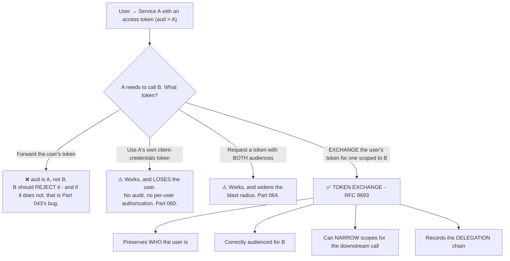
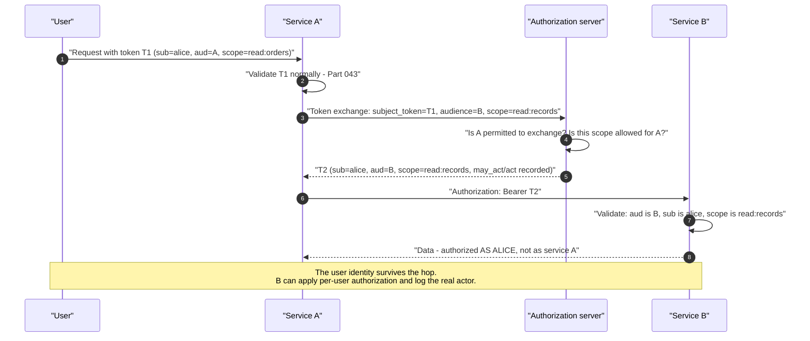
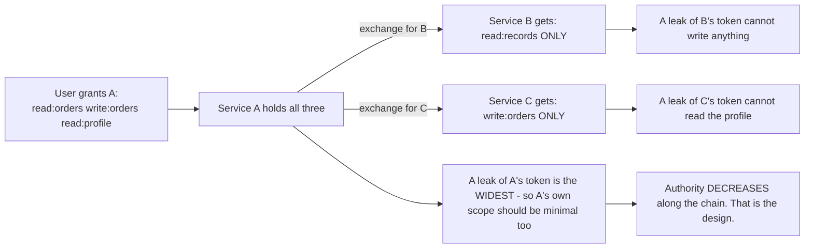
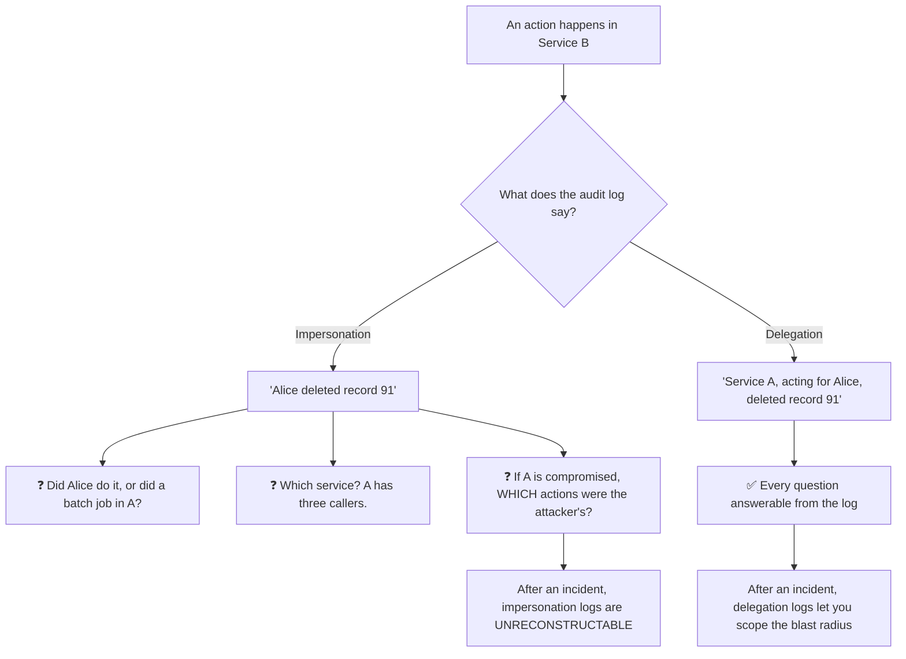
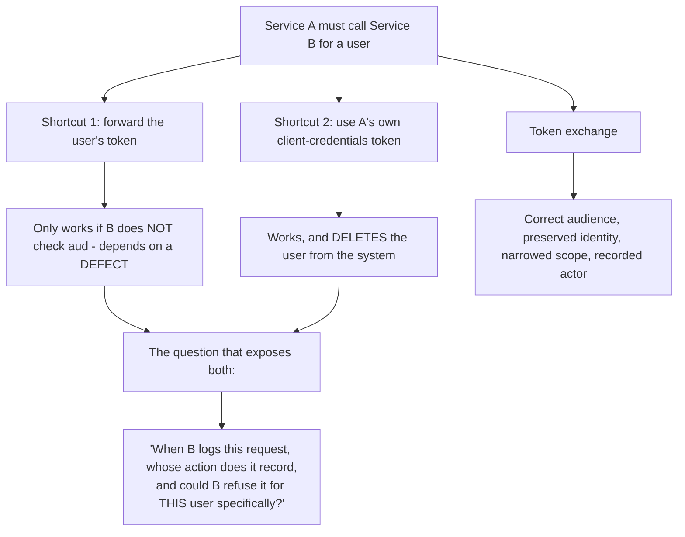
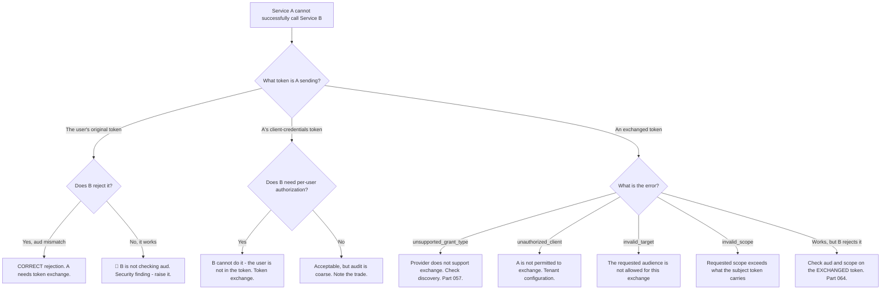

# Part 067 - Token Exchange, Delegation, and Impersonation

> Section goal: Understand how one service calls another on a user's behalf without reusing the inbound token, and the precise difference between delegation and impersonation. This is the correct answer to a design question customers ask constantly, and most answer badly.

Covers index item **067**. Maps to JD signals: *knowledge of OAuth*, *knowledge of authentication and authorization*, *basic security concepts*, *communicate technical concepts clearly*, and *strong analytical and problem-solving skills*.

---

## 1. Start From Zero: The Downstream Problem

A user calls service A. Service A must call service B on their behalf. What token does A send to B?



**The first two options are the ones you will meet in real systems**, and both are wrong in instructive ways: forwarding relies on B not checking `aud`, and client credentials erases the user entirely.

> **Analogy.** A solicitor acting for a client. They do not borrow the client's passport, and they do not pretend the client is absent — they carry a document showing they act *on behalf of* a named person, with defined authority.
>
> **Where it stops:** a letter of authority is read by a human who can judge scope. Token exchange encodes the scope explicitly, which is stricter and requires the downstream service to actually check it.

---

## 2. Token Exchange (RFC 8693)

A grant type where a client presents one token and receives another.

```http
POST /oauth/token
Content-Type: application/x-www-form-urlencoded

grant_type=urn:ietf:params:oauth:grant-type:token-exchange
&subject_token=<the user's access token>
&subject_token_type=urn:ietf:params:oauth:token-type:access_token
&audience=https://service-b.example.com
&scope=read:records
&requested_token_type=urn:ietf:params:oauth:token-type:access_token
```

| Parameter | Meaning |
|---|---|
| **`subject_token`** | The token representing **who the request is for** |
| **`subject_token_type`** | Its type — access token, ID token, SAML assertion, JWT |
| **`actor_token`** | *(Optional)* The token representing **who is acting** |
| **`audience`** / **`resource`** | The downstream service (Part 064) |
| **`scope`** | Usually **narrower** than the original |
| **`requested_token_type`** | What is wanted back |



### 🔍 Plain-English deep-dive: narrowing is the point, not a side effect

It is easy to read token exchange as "re-address the token" and miss that the **scope reduction** is doing as much work as the audience change.

Each hop should carry **less** authority than the one before it:



**Why this matters more than the audience change alone:** a correctly-audienced token with the user's full scope set means service B — possibly external, possibly less trusted — holds everything the user granted anywhere. **The audience stops B from being *reachable* by other services' tokens; the narrowed scope stops B from *doing* more than its job.**

**The three questions that set the scope for each hop:**

1. *What does this specific downstream service actually need to do?*
2. *What is the worst thing its token could do if leaked?*
3. *Would the user recognise that as something they authorised?*

**The third question is a useful check** because it catches scope that was granted upstream for one reason and is being forwarded for another. A user consenting to `read:profile` so an application can show their name has not consented to a downstream analytics service reading it.

**A common mistake worth naming:** exchanging with the *same* scope as the subject token, because it is simpler and nothing fails. **Nothing will ever fail** — which is precisely why it needs to be a deliberate review point rather than something noticed later.

**Analogy:** delegating a task and handing over only the keys and the budget that task needs, rather than your whole keyring. Both let the task get done; only one limits what a mistake or a betrayal can cost. **Where it stops:** you would notice a keyring going missing. A token with excess scope behaves identically to one with correct scope until the day it does not.

---

## 3. Delegation Versus Impersonation

RFC 8693 distinguishes them explicitly, and the distinction has real consequences.

| | **Delegation** | **Impersonation** |
|---|---|---|
| Downstream sees | *"A is acting for Alice"* | *"This is Alice"* |
| Claims | `sub` = Alice, **`act`** = Service A | `sub` = Alice, **no `act`** |
| Audit trail | ✅ Both parties recorded | ❌ The acting party is invisible |
| Downstream can distinguish | ✅ Yes | ❌ No |
| Preferred | ✅ **Yes** | Only where genuinely required |

### 🔍 Plain-English deep-dive: why the `act` claim is worth insisting on

Impersonation is simpler — the downstream service sees a normal user token and needs no new logic. **Delegation costs one extra claim and buys something that cannot be reconstructed later.**



**The third question is the decisive one.** If service A is compromised, an impersonation-based system cannot distinguish actions the attacker performed through A from actions users genuinely performed. **Every action attributed to every user during the exposure window becomes suspect**, and the incident response has no way to narrow it. With `act` recorded, the actions taken via A are identifiable and everything else is provably unaffected.

**The nested case matters too.** `act` can nest — A acting for Alice, then B acting for "A acting for Alice" — producing a full chain. That is exactly what is needed for AI agents (Part 109), where an agent acts for a user and may itself invoke other services. **"An agent did this on behalf of a user" is a fundamentally different audit statement from "a user did this"**, and only delegation can express it.

**When impersonation is legitimate:**

| Case | Why |
|---|---|
| A support tool acting as a user for troubleshooting | Downstream must behave *exactly* as for that user |
| Legacy downstream services that cannot read `act` | No alternative — but log the delegation upstream |
| Migration periods | Temporary, with a plan to move to delegation |

**Even then, the delegation should be recorded somewhere** — if not in the token, then in the calling service's own audit log — so the chain is reconstructable even if the downstream service cannot see it.

**Analogy:** a letter signed "Alice" versus one signed "A. Smith, per pro Alice." Both authorise the same thing; only one lets you work out afterwards who actually signed it. **Where it stops:** a signature is on paper and can be examined later. A token's claims exist only while the token does, so if `act` was not included at issue time, the information is simply gone.

---

## 4. When to Use Token Exchange

| Situation | Answer |
|---|---|
| **Service-to-service on a user's behalf** | ✅ Token exchange |
| Service acting **as itself** | Client credentials (Part 060) |
| Crossing a **trust boundary** with narrowed scopes | ✅ Token exchange |
| Bridging protocols — a SAML assertion into an OAuth token | ✅ Token exchange supports this |
| A simple internal call within one trust domain | Often overkill — a multi-audience token may suffice |
| The downstream service is external | ✅ Token exchange, with narrow scope |

### 🔍 Plain-English deep-dive: the alternative customers actually reach for, and why it is worse

Faced with the downstream problem, most teams choose one of two shortcuts before ever hearing about token exchange. Knowing why each is worse — specifically — is what makes the recommendation land.

**Shortcut 1: forward the user's token unchanged.**

| | Consequence |
|---|---|
| The `aud` is wrong for B | B should reject it |
| If B accepts it anyway | 🔴 B is not checking `aud` — a security defect (Part 043) |
| Scope cannot be narrowed | B receives everything the user granted to A |
| A trust boundary is crossed silently | An external B now holds a token minted for an internal A |

**The insidious part:** this shortcut *appears to work* precisely when B has a security bug. **A team using it has a working system that depends on a defect** — and fixing B's audience check breaks A.

**Shortcut 2: A uses its own client-credentials token.**

| | Consequence |
|---|---|
| The user identity is gone | B cannot apply per-user authorization (Part 060) |
| Audit collapses | Every action is attributed to service A |
| Blast radius | One leaked token reaches every user's data |
| A becomes the authorization authority | One bug in A is cross-user data exposure |



**That question at the bottom is the useful one**, because it makes both shortcuts fail visibly. With shortcut 2 the answer is "service A" and "no." With shortcut 1 the honest answer is "the user, and only because B isn't checking who the token was for."

**The counter-argument to expect:** token exchange is extra complexity, an extra round trip, and not every provider supports it well. **That is fair**, and the proportionate answer is that it matters most when crossing a trust boundary or when per-user authorization downstream is required. For a tightly-coupled internal call within one trust domain, a multi-audience token is a reasonable middle ground (Part 064). **Recommending it universally is as unhelpful as never recommending it.**

**Analogy:** an assistant given either your own house keys or the office master key, versus a written authority naming what they may do for you. The first two work and neither is what you meant. **Where it stops:** you would notice an assistant using your keys. A downstream service has no way to know which of the three it received.

---

## 5. Failure Modes

| Failure mode | What it looks like | Consequence | Correction |
|---|---|---|---|
| **Forwarding the user's token** | Works if B is buggy | 🔴 Depends on B skipping the `aud` check | Token exchange |
| **Client credentials for user calls** | Works cleanly | 🔴 User identity erased (Part 060) | Token exchange |
| **Impersonation where delegation would do** | Simpler downstream | 🔴 Unreconstructable audit after an incident | Include `act` |
| **Not narrowing scope on exchange** | Simpler | Downstream gets more than it needs | Narrow explicitly |
| **Exchange permitted for any client** | Convenient | 🔴 Any client can obtain user-scoped tokens | Restrict who may exchange |
| **No `may_act` restriction** | Unbounded delegation | 🔴 Any actor for any subject | Constrain permitted actors |
| **Downstream ignoring `act`** | Delegation recorded, unused | Audit value lost | Log and check it |
| **Exchange on every request** | Latency | Slow chains | Cache exchanged tokens by audience |
| **Long-lived exchanged tokens** | Fewer exchanges | Wider blast radius | Short lifetimes (Part 045) |
| **Assuming provider support** | Recommending it blindly | Unimplementable | Check discovery (Part 057) |
| **Using it for a simple internal call** | Over-engineering | Complexity with no benefit | Proportionate design |

---

## 6. Troubleshooting Decision Tree: Downstream Call Problems



### Worked example

*"Our API gateway calls three backend services. It uses its own service token. Now our compliance team wants per-user audit trails and we don't know how to add them."*

1. **The requirement is the diagnosis.** Per-user audit is impossible with a client-credentials token, because the user is not in it. This is not a logging gap — it is a token design consequence.
2. **Confirm the current shape.** The gateway validates the user's token, then calls each backend with its own service token. Backends log "gateway" as the actor for everything.
3. **Explain why adding logging will not fix it.** They could pass a user ID in a header — and a header is not authenticated, so a backend cannot trust it and an auditor should not accept it. **This pre-empts the workaround they are about to build.**
4. **The answer:** token exchange at the gateway. For each downstream call, exchange the user's token for one audienced to that backend, with scopes narrowed to what that backend needs.
5. **Argue for delegation over impersonation.** With `act` recorded, the backend logs "gateway, acting for Alice" — which is exactly what compliance asked for, and which survives an incident where the gateway is compromised.
6. **Name the costs honestly:** one extra call per downstream hop, cacheable per user and audience; the backends must validate the new audiences; and provider support must be confirmed first.
7. **Sequence it.** One backend first, prove the audit output satisfies compliance, then roll out. **A migration that proves the outcome early is far more likely to complete.**
8. **Note the side benefit**, because it strengthens the case: each backend now receives only the scopes it needs, so the gateway stops holding a token that can do everything.

---

## 7. Lab: Exchange a Token

**Purpose.** Perform a real token exchange, observe delegation claims, and reproduce the two shortcuts to see exactly what they lose.

**Prerequisites.** Parts 043, 060, 064 artifacts. A free Auth0 tenant with two APIs and a client, plus two small Node services.

**Steps.**

1. Create `okta-prep/labs/067-token-exchange/`.
2. **Check support first.** Look for token exchange in the discovery document and vendor documentation. **Record what your tenant supports** — if it does not, simulate the exchange with a small local authorization server so the mechanics are still learned.
3. **Build the chain.** Service A (validates user tokens) and Service B (validates its own audience). Both implement Part 043's checks.
4. **Shortcut 1.** Have A forward the user's token to B. **Confirm B rejects it** on audience. Record the error.
5. **Then remove B's `aud` check** and confirm forwarding now works. **Write one line on why a working system that depends on a defect is worse than a broken one**, then restore the check.
6. **Shortcut 2.** Have A call B with its own client-credentials token. Confirm it works. **Then attempt per-user authorization in B** and record precisely why it is impossible.
7. **Exchange.** Perform a token exchange: subject token, audience B, narrowed scope. **Decode the resulting token** and record `sub`, `aud`, `scope`, and any `act` claim.
8. **Compare all three tokens** side by side: the user's original, the client-credentials token, and the exchanged token. **This table is the artifact.**
9. **Delegation versus impersonation.** If your provider supports both, obtain one of each. **Record the claim difference.** Then write the two audit log lines each would produce.
10. **Narrow the scope.** Exchange with a scope smaller than the subject token carries and confirm it succeeds. Then request a **wider** scope and record the error.
11. **Restrict the actor.** If your provider supports `may_act` or equivalent, configure it so only A may exchange for B, and confirm another client is refused. **Record the error.**
12. **Caching.** Exchange on every request and measure. Then cache exchanged tokens keyed by user **and** audience and measure again. **Record both** (Part 060).
13. **Audit output.** Make B log the actor from `act` where present. **Produce two log lines** — one from an impersonated call, one from a delegated call — and put them side by side.
14. **Write the guidance.** `delegation-guidance.md` — one page: the three options, what each loses, when exchange is proportionate, and delegation versus impersonation.
15. **Failure catalog + manifest.** Complete `MANIFEST.md`.

**Expected evidence.** A provider support check, a working two-service chain, both shortcuts reproduced with their specific losses recorded, a successful exchange with decoded claims, a three-token comparison table, a delegation-versus-impersonation claim contrast with sample audit lines, scope narrowing and widening behavior, an actor restriction, a caching measurement, and one-page guidance.

**Validation rubric.**

| Check | Pass condition |
|---|---|
| Support check | Recorded before building |
| Shortcut 1 | Rejected correctly; acceptance-on-defect demonstrated and explained |
| Shortcut 2 | Works; per-user authorization shown impossible |
| Exchange | Claims decoded; audience and scope correct |
| Three-token table | All differences recorded |
| Delegation contrast | `act` present/absent; two audit lines written |
| Scope | Narrowing works, widening rejected |
| Actor restriction | Unauthorised client refused |
| Caching | Both measurements recorded |

**Cleanup and privacy.** Lab tenant, synthetic users, your own services only. **Restore B's audience check immediately** after the shortcut-1 demonstration. Delete APIs and applications and revoke tokens at the end.

---

## 8. JD Mapping

| Supplied JD signal | How this Part supports it |
|---|---|
| **Knowledge of OAuth** | RFC 8693 and its relationship to the other grants |
| Knowledge of authentication and authorization | Preserving identity across service hops |
| **Basic security concepts** | Trust boundaries, scope narrowing, audit integrity |
| **Communicate technical concepts clearly** | Explaining why a header-passed user ID is not an answer |
| Strong analytical and problem-solving skills | A compliance requirement diagnosed as a token design issue |
| Promote best practices | Delegation over impersonation; proportionate recommendation |
| Exceed expectations on response quality | Pre-empting the workaround they were about to build |

---

## 9. Candidate Honesty Note

- **Claim safety:** *Learned architecture and lab experience.*
- **The strongest thing you can say:** *"Token exchange solves the downstream problem: service A needs to call service B for a user. Forwarding the user's token is wrong because the audience is A, and if B accepts it that means B isn't checking `aud`. Using A's own client-credentials token works and deletes the user from the system — no per-user authorization, no audit. Exchange gives a token correctly audienced for B, with the user preserved and the scope narrowed."*
- **A second point, and it is the one that shows depth:** *"Delegation versus impersonation matters most after an incident. With impersonation the log says 'Alice deleted record 91.' With delegation it says 'Service A, acting for Alice, deleted record 91.' If A is ever compromised, the impersonation logs are unreconstructable — every action attributed to every user during the window becomes suspect. With `act` recorded you can scope the blast radius precisely."*
- **A third, which is genuinely useful in a design conversation:** *"The question that exposes both shortcuts is 'when B logs this request, whose action does it record, and could B refuse it for this user specifically?' With client credentials the answers are 'service A' and 'no.' With forwarding, the honest answer is 'the user, and only because B isn't checking who the token was for.'"*
- **A fourth, pre-empting a workaround:** *"When someone needs per-user audit downstream, they usually reach for passing a user ID in a header. That isn't authenticated, so the backend can't trust it and an auditor shouldn't accept it. Saying that early stops them building it."*
- **A fifth, on proportion:** *"I wouldn't recommend token exchange universally. It matters most crossing a trust boundary or where the downstream service needs per-user authorization. For a tightly-coupled internal call in one trust domain, a multi-audience token is a reasonable middle ground — recommending exchange everywhere is as unhelpful as never recommending it."*
- **Do not overstate:** you have not implemented token exchange in production. Say you have performed exchanges and both shortcuts in a lab.

---

## 10. Official Source Anchors

Accessed **26 August 2026**.

| Source | What it defines |
|---|---|
| IETF RFC 8693 (Token Exchange) | The grant type, all parameters, `act` and `may_act` |
| IETF RFC 8693 §1.1 | Delegation versus impersonation, defined |
| IETF RFC 8707 | Resource indicators — the target audience (Part 064) |
| IETF RFC 9068 | JWT access token profile, including `act` |
| OAuth 2.0 Security BCP | Trust boundaries and scope narrowing |
| Auth0 documentation — token exchange | Vendor support and configuration |
| Okta developer documentation — token exchange | Okta's implementation |
| OpenID Connect Core | ID tokens as subject tokens |

**Revalidate after 26 August 2026:** RFC 8693 is stable; vendor support and configuration surfaces are still developing. **Check provider support before recommending it.**

---

## ⭐ Likely Interview Questions for This Section

### Q1. "Service A needs to call service B for a user. What token does it use?"
> *Model answer:* "An exchanged token. Forwarding the user's original token is wrong because its audience is A, so B should reject it — and if B accepts it, that means B isn't checking `aud`, which is a security defect I'd want to raise separately. Using A's own client-credentials token works and erases the user: B can't apply per-user authorization because there's no user in the token, and every action is logged as service A. Token exchange gives A a token correctly audienced for B, with the user's identity preserved, the scope narrowed to what B actually needs, and the acting party recorded. That's RFC 8693, and it's specifically designed for this."

### Q2. "What's the difference between delegation and impersonation?"
> *Model answer:* "Whether the downstream service can tell who's acting. With impersonation the token just says `sub` is Alice, so B sees a normal user token and can't distinguish Alice calling directly from service A calling for her. With delegation, RFC 8693 adds an `act` claim naming the acting party, so B sees 'A acting for Alice.' The difference matters most after an incident: if A is compromised, impersonation logs are unreconstructable — every action attributed to every user during the exposure window becomes suspect, and there's no way to narrow it. With `act` recorded, actions taken via A are identifiable. `act` can also nest, which is exactly what you need for AI agents acting for users and calling other services."

### Q3. "Why not just forward the user's token downstream?"
> *Model answer:* "Because its audience is the first service, not the second, so a correctly-implemented downstream service will reject it. The insidious part is what happens when it *doesn't* reject it — that means the downstream service isn't checking `aud`, so the pattern only works because of a security defect. A team using it has a working system that depends on a bug, and fixing the bug breaks them. Beyond that, forwarding means you can't narrow scope: the downstream gets everything the user granted to the upstream service, which may be far more than it needs. And if the downstream is across a trust boundary or external, you've handed out a token minted for an internal service."

### Q4. "A customer needs per-user audit trails in backend services behind a gateway. What do you tell them?"
> *Model answer:* "That it's a token design question rather than a logging one, if the gateway is calling backends with its own client-credentials token — the user simply isn't present, so no amount of logging configuration recovers it. I'd also pre-empt the workaround they're about to build: passing the user ID in a header. That isn't authenticated, so a backend can't trust it and an auditor shouldn't accept it. The answer is token exchange at the gateway — for each downstream call, exchange the user's token for one audienced to that backend with narrowed scope, and use delegation so the backend logs 'gateway, acting for Alice.' I'd sequence it one backend at a time and prove the audit output satisfies compliance early, because a migration that demonstrates the outcome up front is far more likely to finish."

### Q5. "When would impersonation be acceptable?"
> *Model answer:* "When the downstream genuinely must behave exactly as it would for that user and can't handle an `act` claim. A support tool reproducing a user's experience is the clearest case — you want identical behaviour, including any user-specific rules. Legacy downstream services that can't read `act` are another, and migration periods where delegation isn't yet supported everywhere. But even then I'd want the delegation recorded somewhere — if not in the token, then in the calling service's own audit log — so the chain is reconstructable. The thing I'd push back on is choosing impersonation because it's simpler downstream, since that trades a permanent loss of audit fidelity for a small amount of implementation work, and the loss only becomes visible during an incident when it's too late to recover it."

### Q6. "What are the costs of token exchange?"
> *Model answer:* "An extra round trip per downstream hop, which is cacheable by user and audience but adds latency on a cold cache. Each downstream service has to validate a new audience, so there's configuration work. Provider support varies and needs checking in discovery before recommending it. And it's genuine complexity — more moving parts, more failure modes, more to explain. So I wouldn't recommend it universally. It earns its cost when crossing a trust boundary, when the downstream service is external, or when per-user authorization or audit downstream is required. For a tightly-coupled internal call within one trust domain, a multi-audience token is a reasonable middle ground. Recommending exchange everywhere is as unhelpful as never recommending it."

### Q7. "What's `may_act` and why does it matter?"
> *Model answer:* "It constrains who is permitted to act on whose behalf. Without a restriction, any client configured for token exchange could obtain a user-scoped token for any downstream service, which turns exchange into a general-purpose way to get tokens for other people. `may_act` — or the equivalent in a given provider's configuration — says which actors are permitted for which subjects, so service A can exchange for service B and nothing else can. It's the same principle as restricting which clients may use the device grant: the grant itself is fine, and enabling it broadly creates a surface. I'd check it during any design review involving exchange, because it's easy to enable the capability and forget to bound it."

### Q8. "How would you explain this to a developer who thinks it's over-engineering?"
> *Model answer:* "By asking one question rather than arguing: 'when the downstream service logs this request, whose action does it record, and could it refuse the request for this user specifically?' If they're using a service token, the answers are 'the service' and 'no' — and that's usually the moment it lands, because they'd assumed per-user authorization was happening somewhere. If the answers are fine and it's a tightly-coupled internal call in one trust domain, then honestly it might be over-engineering, and I'd say so. What I wouldn't do is push the pattern on principle. The value shows up at trust boundaries and in audit requirements, and if neither applies, a simpler design is the right answer."

---

## 🧠 30-Second Memory Hooks

- **Token exchange (RFC 8693) = A calls B for a user**, without reusing the inbound token.
- **Forwarding the user's token only works if B is NOT checking `aud`** — a system depending on a defect.
- **Client credentials works and DELETES the user** — no per-user authz, no audit.
- **Exchange gives:** correct audience · **preserved `sub`** · narrowed scope · **recorded actor**.
- **Delegation = `act` claim present.** Impersonation = absent.
- **"Alice deleted record 91" vs "Service A, acting for Alice, deleted record 91."**
- **After a compromise, impersonation logs are UNRECONSTRUCTABLE.**
- **`act` NESTS** — exactly what AI agent chains need (Part 109).
- **The exposing question:** *whose action does B log, and can B refuse it for THIS user?*
- **A user ID in a header is NOT authenticated.** Pre-empt that workaround.
- **`may_act` bounds who may act for whom.** Enable the capability, bound it too.
- **Proportionate:** exchange at trust boundaries; a multi-audience token may do internally.

---

## ✅ Completion Checklist

- [ ] **Knowledge:** I can state the three options, what each loses, and the delegation-versus-impersonation distinction.
- [ ] **Lab artifact:** `067-token-exchange/` contains both shortcuts reproduced with their losses, a successful exchange with decoded claims, a three-token comparison, and two contrasting audit lines.
- [ ] **Spoken:** I can answer the downstream question in 45 seconds and explain `act` in 30.
- [ ] **Judgement:** I pre-empt the header workaround and I say when exchange is over-engineering.
- [ ] **Honesty check:** I say "lab experience," not production implementation.
- [ ] **Source check:** I have read RFC 8693 §1.1 and §2.1 myself.

---

*Next suggested section:* **[Part 068 - Sender-Constrained Tokens: DPoP and mTLS Binding](Part-068-sender-constrained-tokens-dpop-and-mtls-binding.md)** — how to make a stolen token useless, and why this is the direction of travel.
