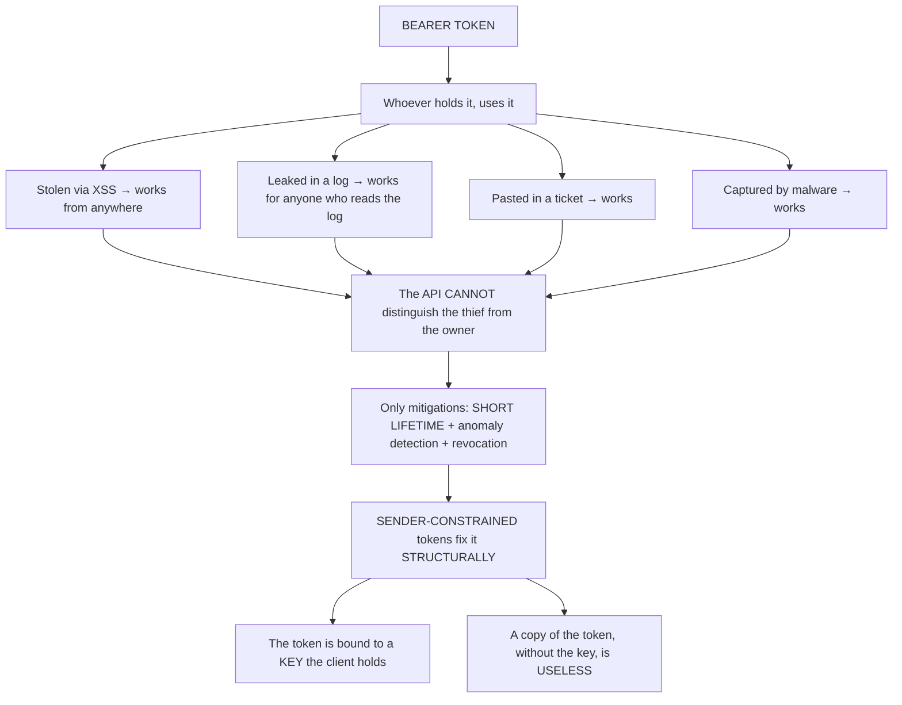
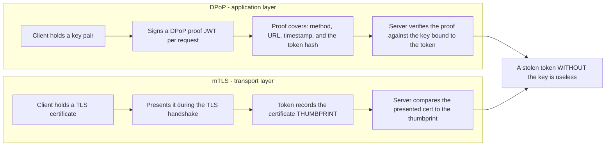
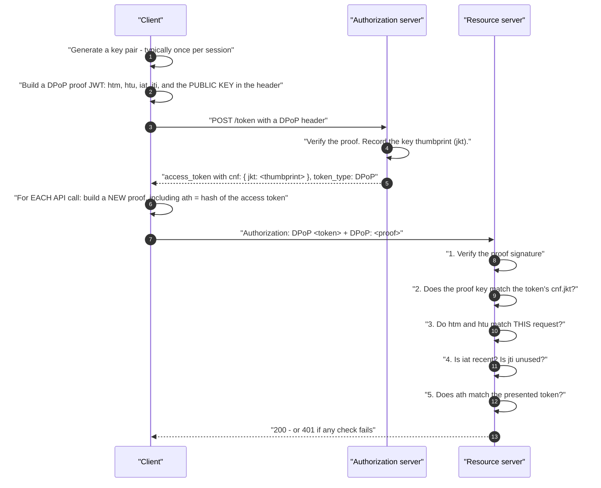
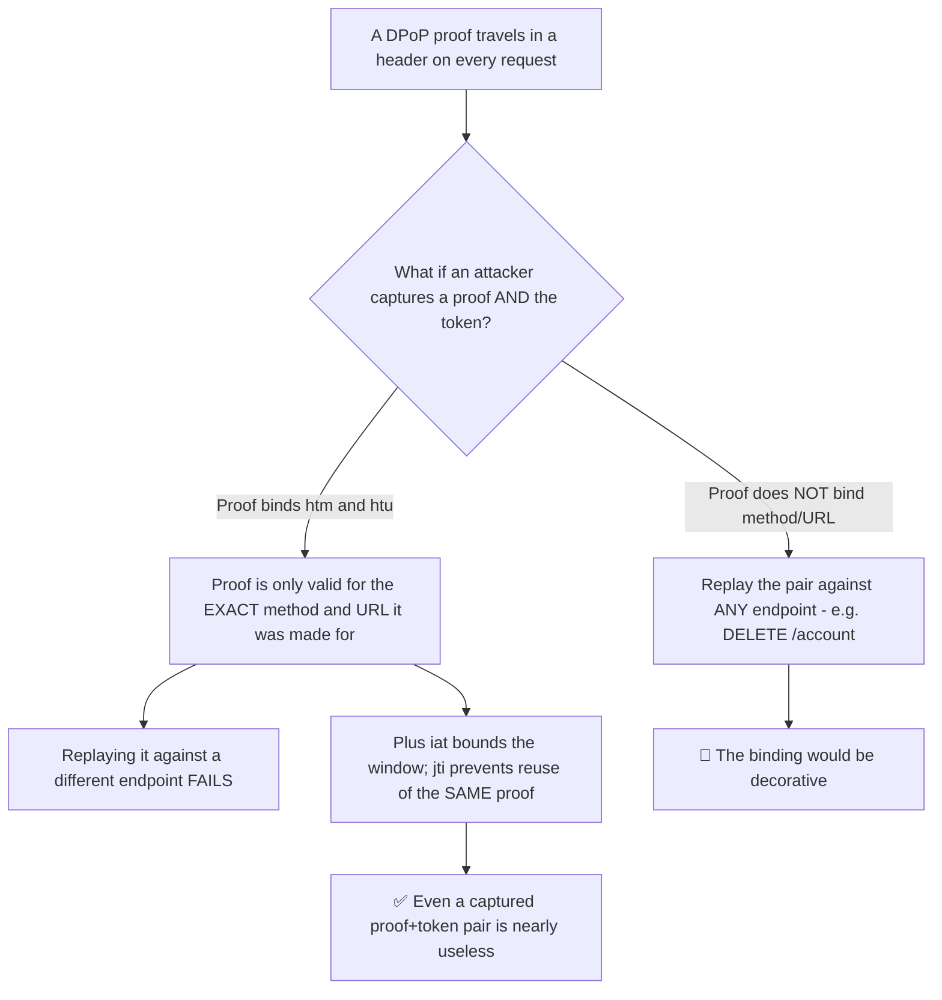
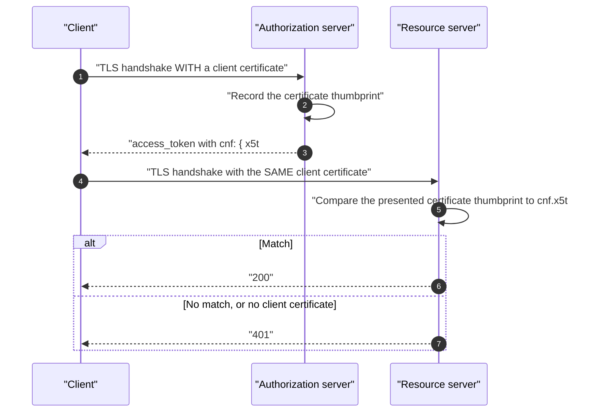
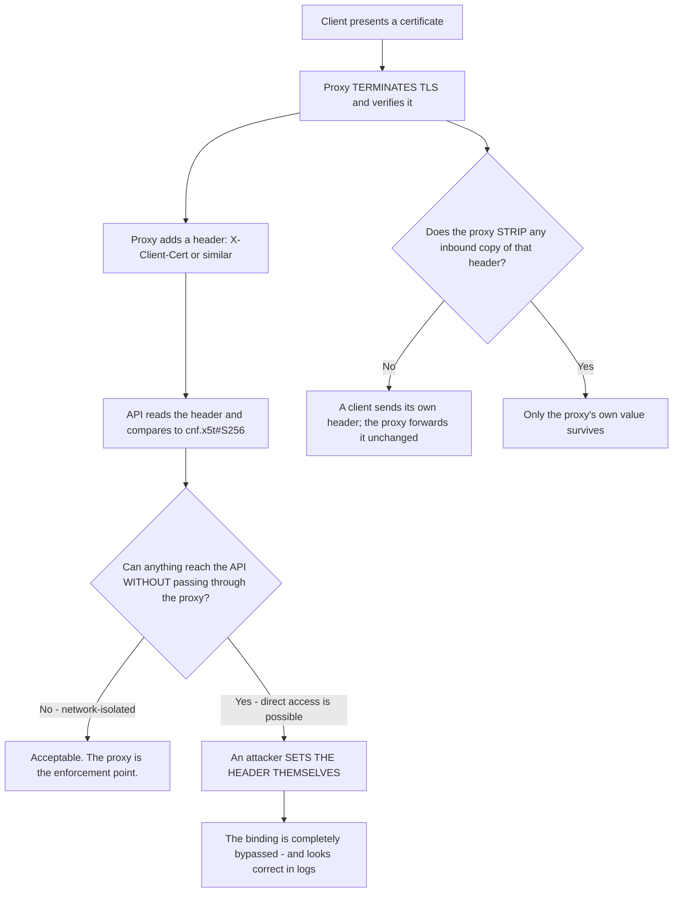
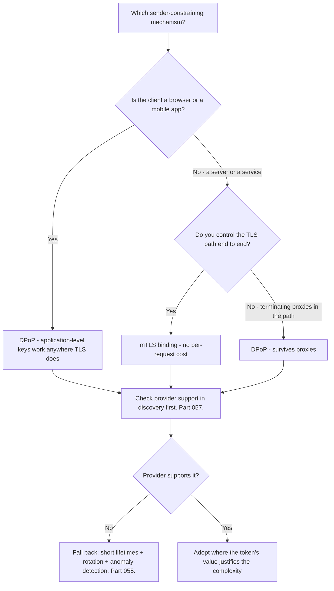
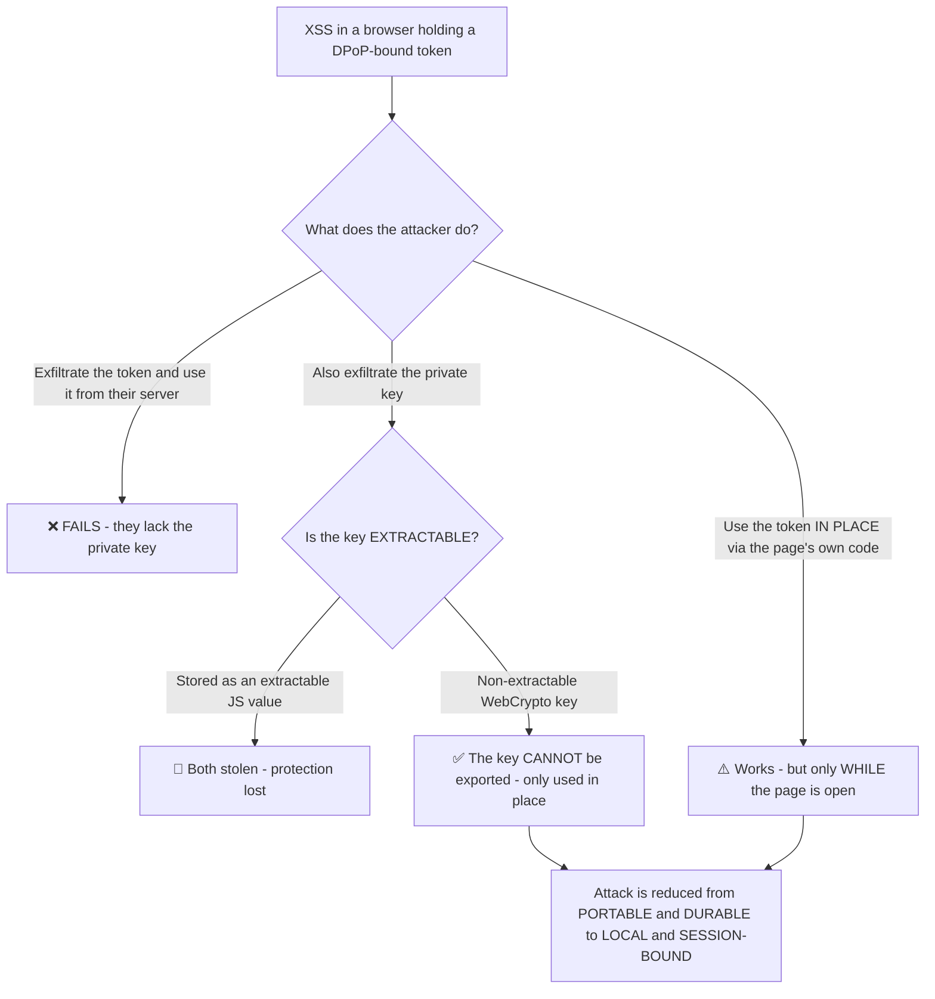
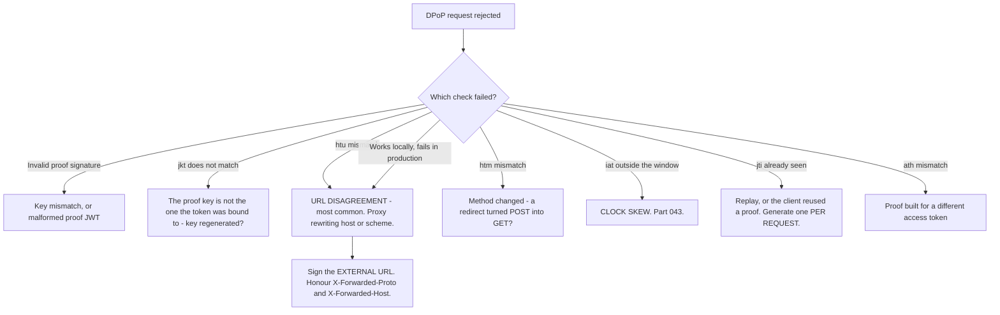

# Part 068 - Sender-Constrained Tokens: DPoP and mTLS Binding

> Section goal: Understand how to make a stolen token useless to whoever stole it — the structural fix for the bearer-token weakness from Part 055 — and why this is the direction the whole ecosystem is moving. Being fluent here signals genuinely current knowledge.

Covers index item **068**. Maps to JD signals: *knowledge of OAuth*, *knowledge of encryption*, *basic security concepts*, *communicate technical concepts clearly*, and *continuous learning*.

---

## 1. Start From Zero: The Bearer Problem

> **A bearer token means whoever bears it may use it.** There is no binding to a person, a device, or a session.

**The insight:** every defence in Part 055 bounds the *damage* of theft. Sender-constraining removes the *value* of theft.

> **Analogy.** A cinema ticket versus a passport-linked boarding pass. Anyone holding the ticket gets in; the boarding pass requires you to also be the person named on it, and the gate checks.
>
> **Where it stops:** a gate agent compares a face to a photograph. Here the check is cryptographic — the holder must prove possession of a private key on every request, which is stricter and requires no human judgement.

---

## 2. The Two Mechanisms

| | **DPoP** (RFC 9449) | **mTLS binding** (RFC 8705) |
|---|---|---|
| Full name | Demonstrating Proof of Possession | Mutual TLS certificate-bound tokens |
| The key is | An **application-level** key pair | A **TLS client certificate** |
| Proof is sent | A **`DPoP` header** — a signed JWT per request | Implicit in the **TLS handshake** |
| Works through proxies | ✅ Yes | ⚠️ Terminating proxies break it |
| Client complexity | Moderate — generate and sign per request | Certificate provisioning and rotation |
| Suits | **Browsers**, mobile, SPAs | Servers, machine-to-machine, high-assurance |
| Adoption | Growing | Established in regulated sectors |

---

## 3. How DPoP Works

| Proof claim | Purpose |
|---|---|
| **`htm`** | HTTP method — binds the proof to this method |
| **`htu`** | HTTP URI — binds the proof to this endpoint |
| **`iat`** | Issued at — bounds replay |
| **`jti`** | Unique ID — one-time use |
| **`ath`** | Hash of the access token — binds the proof to **this** token |
| **`jwk` (header)** | The public key — establishes the binding |

| Token claim | Purpose |
|---|---|
| **`cnf.jkt`** | The **confirmation** claim: the thumbprint of the key this token is bound to |

### 🔍 Plain-English deep-dive: why the proof covers the method and URL

A newcomer's obvious question: if the client signs *something* with its key, why does the proof need to name the HTTP method and URL?

**Because otherwise the proof itself becomes stealable and replayable.**

**So the proof is not "I hold the key" in general — it is "I hold the key, and I am making *this* request, *now*, with *this* token."** Four bindings: method, URL, time, and token hash.

**The `ath` claim is the subtle one.** Without it, a proof made for one access token could be presented alongside a *different* token bound to the same key. Hashing the token into the proof closes that.

**And `jti` plus `iat` handle replay of the whole pair:** a server tracking recently-seen `jti` values within a short acceptance window can reject an exact replay. **That does require server-side state**, which is a genuine implementation cost and one of the reasons adoption is not universal.

**The practical consequence for support:** DPoP failures are almost always one of the five checks, and knowing which five turns an opaque 401 into a short list. The most common in practice is **`htu` mismatch behind a proxy** — the client signs the external URL, the server sees an internal one, and they disagree (Part 058's scheme problem in a new place).

**Analogy:** a signature on a specific cheque for a specific amount on a specific date, rather than a signature on a blank page. The blank signature is worth something to a thief; the completed cheque is not. **Where it stops:** a cheque is a physical artifact you keep. A DPoP proof is generated fresh per request and discarded, which is why capturing one buys so little.

---

## 4. How mTLS Binding Works

Simpler in concept, heavier in operation.

| | Detail |
|---|---|
| **Binding** | `cnf.x5t#S256` — the SHA-256 thumbprint of the client certificate |
| **Proof** | Implicit — presenting the certificate in the handshake *is* the proof |
| **Per-request cost** | None beyond TLS itself |
| **Deployment cost** | 🔴 Certificate issuance, distribution, rotation, and revocation |
| **Proxy problem** | 🔴 A **terminating proxy** ends the client's TLS — the certificate is not visible downstream |

**That last row is the operational obstacle.** Load balancers, CDNs, API gateways, and corporate TLS-inspection proxies all terminate TLS. The certificate must either be passed through as a forwarded header — which requires trusting that header, and therefore trusting the proxy — or TLS must be passed through untouched, which limits what the infrastructure can do (Part 023).

### 🔍 Plain-English deep-dive: the forwarded-certificate header is a trust decision, not a workaround

The standard fix for mTLS behind a terminating proxy is for the proxy to verify the client certificate and pass its details downstream in a header. **That works, and it moves the trust boundary in a way that is easy to get wrong.**

**Two separate failures, both silent.**

**1. The API is reachable directly.** If anything can bypass the proxy — another network path, an internal caller, a misconfigured security group — then setting the header is trivial and the certificate binding is decorative. **This is the same class of mistake as trusting `X-Forwarded-For` for access control.**

**2. The proxy does not strip inbound copies.** A client sends its *own* `X-Client-Cert` header; if the proxy appends rather than replaces, or forwards an existing value, the API may read the attacker's. **Stripping inbound copies of every trusted header is a rule with no exceptions.**

**The two questions to ask whenever a forwarded certificate header is in play:**

1. *Can the API be reached without traversing the proxy?*
2. *Does the proxy unconditionally strip and replace that header?*

**If either answer is unsatisfactory, the mTLS binding is providing no protection at all** — while appearing entirely correct in configuration and in logs, which is what makes it worth checking deliberately.

**This is also a strong practical argument for DPoP** in any environment with proxies: the proof travels in an ordinary header the server verifies cryptographically, so there is no infrastructure component that must be trusted to have done the checking.

**Analogy:** a doorman who checks passes and then writes your name on a slip that the office trusts. Fine, until someone finds a side entrance, or learns they can hand over their own slip. **Where it stops:** an office could ring the doorman. An API reading a header has no way to know whether the proxy produced it.

---

## 5. Choosing Between Them

| Situation | Mechanism |
|---|---|
| SPA or mobile app | **DPoP** |
| Server-to-server, controlled network | **mTLS** |
| Regulated sectors — open banking, financial APIs | mTLS is common; often mandated |
| Anything behind a terminating proxy | **DPoP** |
| Provider does not support either | Short lifetimes and rotation (Part 061) |

---

## 6. What It Does and Does Not Fix

Precision here separates real understanding from enthusiasm.

| Fixes | Does **not** fix |
|---|---|
| ✅ A stolen token used from elsewhere | ❌ Malware on the device — it has the key too |
| ✅ A token leaked in a log | ❌ A compromised client — it holds the key legitimately |
| ✅ A token pasted into a ticket | ❌ Phishing that captures a *session*, not a token |
| ✅ Token replay across services | ❌ Over-scoped tokens (Part 052) |
| ✅ XSS **exfiltrating** the token for later use elsewhere | ⚠️ XSS **using** the token in place, via the client's own key |

### 🔍 Plain-English deep-dive: XSS is the interesting boundary case

The most-asked question about DPoP in a browser: **does it protect against XSS?**

The honest answer is **partly, and the distinction matters.**

**The critical implementation detail is in the middle branch:** storing the DPoP key pair as a **non-extractable WebCrypto key** means script can *use* it to sign but cannot *export* it. So an XSS attacker can make requests while the page is open, and cannot take anything away.

**That is a genuine and significant reduction**, and it is the honest way to describe it:

| | Without sender-constraining | With DPoP + non-extractable key |
|---|---|---|
| Attacker gets | A **portable credential** | **Nothing they can remove** |
| Attack duration | Until the token expires — anywhere | Only while the page is open |
| Attacker location | Their own machine, later | The victim's browser, live |
| Detectability | Hard — it looks like normal use | Easier — confined to a live session |

**So the accurate claim is:** DPoP with a non-extractable key turns XSS from credential theft into session riding. **It does not make XSS acceptable** — a strict CSP is still the actual mitigation (Part 016) — but it removes the worst outcome, which is a refresh token walking out of the building.

**Being precise about this is worth doing**, because overstating DPoP as "solves XSS" is a claim a security-literate customer will correct, and understating it as "doesn't help" misses a real benefit.

**Analogy:** a car key that only works while you are sitting in the driver's seat and cannot be removed from the car. A thief in the car can drive it; they cannot take the key home and come back later. **Where it stops:** a car has doors you can lock. A page's script context is fully available to injected code, which is why the key's non-extractability is doing all the work.

---

## 7. Failure Modes

| Failure mode | What it looks like | Consequence | Correction |
|---|---|---|---|
| **`htu` mismatch behind a proxy** | 401 in production only | Most common DPoP failure | Sign the external URL; honour forwarded headers |
| **Clock skew** | `iat` outside the window | Intermittent 401s | NTP; reasonable acceptance window (Part 043) |
| **`jti` not tracked** | Replay possible | Weakened protection | Track recent `jti` within the window |
| **`jti` tracked forever** | Unbounded state | Memory growth | Bound to the acceptance window |
| **Extractable browser key** | Works fine | 🔴 XSS steals key and token | Non-extractable WebCrypto key |
| **Key regenerated per request** | Works | Binding is useless — the token's `jkt` will not match | One key per session |
| **Key lost on refresh** | Token unusable | Silent lockout | Persist appropriately, or re-authenticate |
| **`ath` omitted** | Proof reusable with another token | Weakened binding | Include it |
| **mTLS behind a terminating proxy** | Certificate invisible | Binding fails | DPoP, or pass-through TLS |
| **Trusting a forwarded certificate header blindly** | Works | 🔴 Header spoofable if the proxy is bypassable | Verify the proxy path |
| **Assuming provider support** | Recommending it blindly | Unimplementable | Check discovery (Part 057) |
| **Claiming it solves XSS** | Overstatement | Credibility loss | It reduces XSS to session riding |

---

## 8. Troubleshooting Decision Tree: DPoP Failures

### Worked example

*"DPoP works in development and every request fails in production with an invalid proof."*

1. **"Works locally, fails in production" with DPoP points at `htu`**, exactly as it points at `redirect_uri` in Part 058 — same underlying cause, different symptom.
2. **Get one proof from each environment**, decoded locally (Part 040), and compare `htu`.
3. **Finding:** development signs `https://localhost:3000/api/orders`; production signs `http://internal-service:8080/api/orders` — because the client builds the URL from the request it received, and the load balancer terminated TLS and rewrote the host.
4. **The server compares against the external URL** the request actually arrived at, so they disagree.
5. **Fix:** the proof must be built from the **external** URL the client is calling — not from anything derived from an incoming request. Where reconstruction is unavoidable, honour `X-Forwarded-Proto` and `X-Forwarded-Host`.
6. **Point out the pattern**, because it recurs: this is the third place the same proxy issue appears — redirect URIs (Part 058), issuer URLs (Part 057), and now DPoP proofs. **Any security-relevant URL derived from an incoming request has this failure mode.**
7. **Check the companions while you are there:** clock skew for `iat`, and whether the key is regenerated per request rather than per session.
8. **Suggest the durable fix:** one configured base URL used everywhere, rather than reconstruction. That closes all three instances at once.

---

## 9. Lab: Sender-Constrained Tokens

**Purpose.** Implement DPoP by hand, prove that a stolen token is useless, and reproduce the failures.

**Prerequisites.** Parts 035, 040, 041, 055 artifacts. A provider with DPoP support, or a small local authorization server you build.

**Steps.**

1. Create `okta-prep/labs/068-dpop/`.
2. **Check support.** Look for DPoP in your provider's discovery document and documentation. **Record the result.** If unsupported, build a minimal local implementation — the mechanics are the lesson.
3. **Generate a key pair** using WebCrypto in a browser context, **non-extractable**. Confirm you cannot export it.
4. **Build a proof JWT by hand**: `htm`, `htu`, `iat`, `jti`, and the public key in the header. **Sign it.** Decode it and confirm every claim.
5. **Obtain a bound token.** Send the proof to the token endpoint. **Decode the resulting token and record `cnf.jkt`.** Confirm it matches your key's thumbprint.
6. **Call an API** with a per-request proof including `ath`. Confirm success.
7. **The theft demonstration.** Copy the access token to a completely different client — curl, or another browser — and call the API **without** a valid proof. **Confirm it is rejected.** **Screenshot both.** This pair is the lab's central artifact.
8. **Contrast with bearer.** Do the same with a plain bearer token and confirm it works from anywhere. **Put the two results side by side.**
9. **Break `htu`.** Sign a proof for a different URL. Record the error.
10. **Break `htm`.** Sign for GET, send POST. Record the error.
11. **Break `iat`.** Shift your clock by five minutes. Record the error and **determine the acceptance window.**
12. **Replay a proof.** Send the same proof twice. **Record whether `jti` tracking rejects the second** — and note that this requires server-side state.
13. **Break `ath`.** Build a proof for one token and present it with another. Record the error.
14. **Regenerate the key per request** and confirm the `jkt` mismatch. **Record why one key per session is required.**
15. **The XSS boundary.** From the browser console, attempt to export the non-extractable key. **Confirm it fails.** Then use it to sign a proof from the console. **Confirm that works.** Write two sentences on exactly what this means for XSS.
16. **Write the explainer.** `sender-constrained.md` — one page: the bearer problem, DPoP versus mTLS, what it fixes and does not, and the honest XSS position.
17. **Failure catalog + manifest.** Complete `MANIFEST.md`.

**Expected evidence.** A non-extractable key pair, a hand-built proof, a bound token with a matching `cnf.jkt`, a demonstrated theft failure contrasted with bearer success, six broken-check errors, a measured acceptance window, a key-regeneration failure, an XSS boundary demonstration, and a one-page explainer.

**Validation rubric.**

| Check | Pass condition |
|---|---|
| Non-extractable key | Export attempt fails |
| Hand-built proof | All five claims present and verified |
| Binding | `cnf.jkt` matches the key thumbprint |
| Theft demonstration | Bound token rejected elsewhere; bearer accepted |
| Six failures | Each error recorded |
| Acceptance window | Measured |
| Key per session | Regeneration failure demonstrated |
| XSS boundary | Export fails, signing succeeds, implications written |
| Explainer | One page, honest XSS position |

**Cleanup and privacy.** Lab tenant and your own services only. **The token-theft demonstration must use your own token against your own API.** Restore your clock. Delete keys and revoke tokens at the end.

---

## 10. JD Mapping

| Supplied JD signal | How this Part supports it |
|---|---|
| **Knowledge of OAuth** | Current proof-of-possession mechanisms |
| **Knowledge of encryption** | Key pairs, signatures, thumbprints applied per request |
| **Basic security concepts** | The structural fix for bearer tokens |
| **Communicate technical concepts clearly** | The honest XSS position, neither over- nor understated |
| Continuous learning | A genuinely current topic with active development |
| Strong analytical and problem-solving skills | Five DPoP checks as a short diagnostic list |
| Promote best practices | Non-extractable keys; one key per session |

---

## 11. Candidate Honesty Note

- **Claim safety:** *Learned architecture and lab experience.* This is a topic where being current matters more than being experienced.
- **The strongest thing you can say:** *"A bearer token means whoever holds it may use it — there's no binding to a person or device, which is why token theft bypasses everything upstream. Sender-constraining fixes that structurally: the token records the thumbprint of a key the client holds, and the client proves possession on every request. A copy of the token without the key is useless."*
- **A second point, on the mechanism:** *"DPoP works at the application layer — the client signs a small proof JWT per request covering the method, the URL, a timestamp, a unique ID, and a hash of the access token. Those bindings matter: without the method and URL, a captured proof could be replayed against any endpoint, so the binding would be decorative. mTLS binding does the same thing at the transport layer using a client certificate, which is simpler per request and much heavier to deploy — and it breaks behind terminating proxies."*
- **A third, and this is the one to get exactly right:** *"On whether DPoP solves XSS — partly, and the distinction matters. If the key is a non-extractable WebCrypto key, an attacker can use it while the page is open but can't export it. So XSS goes from credential theft, where they walk away with something portable and durable, to session riding, which is confined to a live page. It doesn't make XSS acceptable — CSP is still the real mitigation — but it removes the worst outcome. Overstating it as 'solves XSS' is a claim a security-literate customer will correct."*
- **A fourth, diagnostic:** *"'Works locally, fails in production' with DPoP is almost always an `htu` mismatch — the client signs a URL reconstructed from an incoming request and a proxy rewrote the host or scheme. It's the third place the same proxy issue shows up, after redirect URIs and issuer URLs. Any security-relevant URL derived from an incoming request has this failure mode."*
- **A fifth, on positioning:** *"I'd frame it as the direction of travel rather than something to adopt everywhere today. Provider support varies, it needs client-side key management, and `jti` tracking needs server-side state. It earns its complexity where the token's value is high."*
- **Do not overstate:** you have not deployed DPoP in production. Say you have implemented it by hand and demonstrated the theft failure in a lab.

---

## 12. Official Source Anchors

Accessed **26 August 2026**.

| Source | What it defines |
|---|---|
| IETF RFC 9449 (DPoP) | Proof JWT claims, `cnf.jkt`, and all verification steps |
| IETF RFC 8705 | Mutual TLS client authentication and certificate-bound tokens |
| IETF RFC 7800 | The `cnf` confirmation claim |
| OAuth 2.0 Security BCP | Sender-constraining recommendations |
| OAuth 2.0 for Browser-Based Applications | DPoP in browsers and key storage |
| W3C WebCrypto API | Non-extractable keys |
| FAPI (Financial-grade API) profiles | Where mTLS binding is commonly mandated |
| Auth0 and Okta documentation — DPoP support | Vendor availability and configuration |

**Revalidate after 26 August 2026:** DPoP adoption is actively growing. **Recheck provider support before recommending it** — this is the field most likely to have changed.

---

## ⭐ Likely Interview Questions for This Section

### Q1. "What is a sender-constrained token?"
> *Model answer:* "A token bound to a key that the legitimate client holds, so possession of the token alone isn't enough to use it. The token carries a `cnf` confirmation claim recording the key's thumbprint, and the client proves possession on every request. That fixes the fundamental bearer-token weakness — with a plain bearer token, a copy works identically to the original and the API has no way to tell them apart, which is why token theft bypasses MFA, passkeys, and device checks that all happened before the token existed. Sender-constraining doesn't just bound the damage of theft the way short lifetimes do; it removes the value of theft."

### Q2. "How does DPoP work?"
> *Model answer:* "The client generates a key pair, then for every request builds a small proof JWT signed with the private key. The proof carries the HTTP method, the target URL, an issued-at timestamp, a unique ID, and a hash of the access token, with the public key in the JWT header. The authorization server records the key's thumbprint in the token's `cnf.jkt` claim, and the resource server checks five things: the proof signature, that the proof key matches the token's thumbprint, that the method and URL match this request, that the timestamp is recent and the ID unused, and that the token hash matches. The method and URL bindings matter — without them a captured proof could be replayed against any endpoint, so the binding would be decorative."

### Q3. "Does DPoP protect against XSS?"
> *Model answer:* "Partly, and I'd be precise about it because both the overstatement and the understatement are wrong. If the key is stored as a non-extractable WebCrypto key, script can use it to sign but can't export it. So an attacker with XSS can make requests while the page is open, but can't take anything away — they can't exfiltrate a portable credential and use it later from their own machine. That turns XSS from credential theft into session riding: confined to a live page, time-bounded, and more detectable. It's a real and significant reduction, and it doesn't make XSS acceptable — a strict CSP is still the actual mitigation. But it removes the worst outcome, which is a refresh token walking out of the building."

### Q4. "DPoP or mTLS — how do you choose?"
> *Model answer:* "Mostly by where the client runs and what's in the network path. DPoP works at the application layer with keys the client generates, so it works anywhere TLS works — including browsers and mobile apps, and crucially through terminating proxies. mTLS binds to a TLS client certificate, which means no per-request cost since the handshake is the proof, but it requires certificate issuance, distribution and rotation, and it breaks behind any proxy that terminates TLS — load balancers, CDNs, gateways, corporate inspection. So: browsers and mobile, DPoP. Server-to-server where you control the TLS path end to end, mTLS. Regulated sectors like open banking often mandate mTLS. And anywhere with a terminating proxy, DPoP by default."

### Q5. "DPoP works in development and fails in production. What's wrong?"
> *Model answer:* "Almost certainly `htu` — the URL in the proof doesn't match what the server sees. The client is probably building the URL from an incoming request, and a load balancer terminated TLS and rewrote the host, so the client signs `http://internal-service:8080/path` while the server compares against the external `https://api.example.com/path`. The fix is signing the external URL the client is actually calling, rather than anything reconstructed from a request — and where reconstruction is unavoidable, honouring `X-Forwarded-Proto` and `X-Forwarded-Host`. What I'd point out is that this is the third place the same proxy issue appears, after redirect URIs and issuer URLs. Any security-relevant URL derived from an incoming request has this failure mode, so one configured base URL used everywhere closes all three."

### Q6. "What doesn't sender-constraining fix?"
> *Model answer:* "Anything where the attacker has the key legitimately. Malware on the device has both the token and the key, so it's unaffected. A compromised client is the same — it holds the key by design. Phishing that captures a session cookie rather than a token isn't addressed, because the session is a separate credential. And it does nothing about over-scoped tokens: a correctly-bound token that grants far more than it should is still a design problem. It's specifically a fix for *copied* tokens — stolen via a log, a leaked ticket, exfiltration, or replay across services. That's a large and important class, but naming what it doesn't cover is part of recommending it honestly."

### Q7. "Why does the proof include a hash of the access token?"
> *Model answer:* "The `ath` claim, and it closes a gap that's easy to miss. Without it, a proof demonstrates possession of the key for a given method, URL and time — but says nothing about which token it accompanies. So a proof captured alongside one access token could be presented with a *different* token bound to the same key, which might carry different scopes or a different audience. Hashing the token into the proof binds them together. It's part of a pattern in DPoP where each claim closes a specific replay avenue: `htm` and `htu` stop replay against other endpoints, `iat` bounds the time window, `jti` stops reuse of the identical proof, and `ath` stops pairing a valid proof with a different token."

### Q8. "Should customers adopt this now?"
> *Model answer:* "I'd frame it as the direction of travel rather than something to adopt everywhere today. The honest position is that provider support varies, so the first step is checking discovery; it needs client-side key management, which is real work; and `jti` replay tracking needs server-side state with its own operational cost. So it earns its complexity where the token's value is high — financial operations, admin capabilities, anything where a stolen token would be genuinely serious. For a typical read-mostly API, short lifetimes plus refresh rotation plus anomaly detection remains a reasonable position. What I wouldn't do is present it as either universally necessary or as something to ignore — it's the structural fix for a problem every other measure only bounds, and that will matter more over time."

---

## 🧠 30-Second Memory Hooks

- **Bearer = whoever holds it, uses it.** No binding to person or device.
- **Sender-constrained = the token is bound to a KEY the client holds.** A copy is useless.
- **`cnf.jkt`** (DPoP) · **`cnf.x5t#S256`** (mTLS) — the confirmation claim.
- **DPoP = application layer**, a signed proof JWT **per request**. Works through proxies.
- **mTLS = transport layer**, the client certificate. **Breaks behind terminating proxies.**
- **Proof claims:** `htm` · `htu` · `iat` · `jti` · **`ath`** · public key in the header.
- **Each claim closes a replay avenue.** Without `htm`/`htu` the binding is decorative.
- **XSS: partly.** Non-extractable key → **credential theft becomes session riding**.
- **Do NOT claim it "solves XSS."** CSP is still the mitigation.
- **"Works locally, fails in production" = `htu` mismatch behind a proxy.** Third instance of the same pattern.
- **One key per SESSION**, not per request, or `jkt` will never match.
- **Check provider support in discovery** before recommending it.

---

## ✅ Completion Checklist

- [ ] **Knowledge:** I can name all five DPoP verification checks and state precisely what sender-constraining does and does not fix.
- [ ] **Lab artifact:** `068-dpop/` contains a non-extractable key, a hand-built proof, a demonstrated theft failure contrasted with bearer, six broken-check errors, and an XSS boundary demonstration.
- [ ] **Spoken:** I can explain DPoP in 60 seconds and give the honest XSS answer in 45.
- [ ] **Judgement:** I neither overstate the XSS benefit nor recommend adoption universally.
- [ ] **Currency check:** I have verified provider DPoP support **recently**, not from memory.
- [ ] **Source check:** I have read RFC 9449 §4 and §7 myself.

---

*Next suggested section:* **[Part 069 - The OAuth Error Catalog and Systematic Debugging](Part-069-the-oauth-error-catalog-and-systematic-debugging.md)** — every standard error, what actually causes it, and the method that turns any OAuth failure into a short list.
