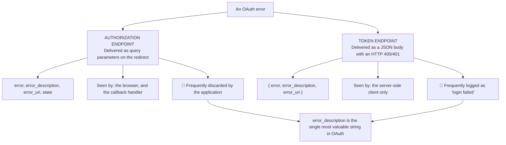
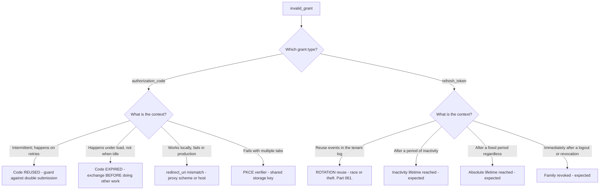
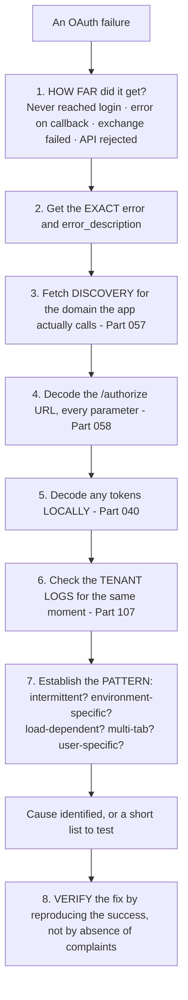
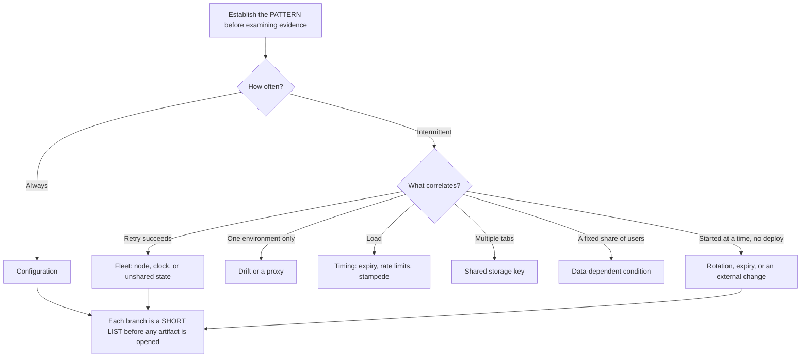
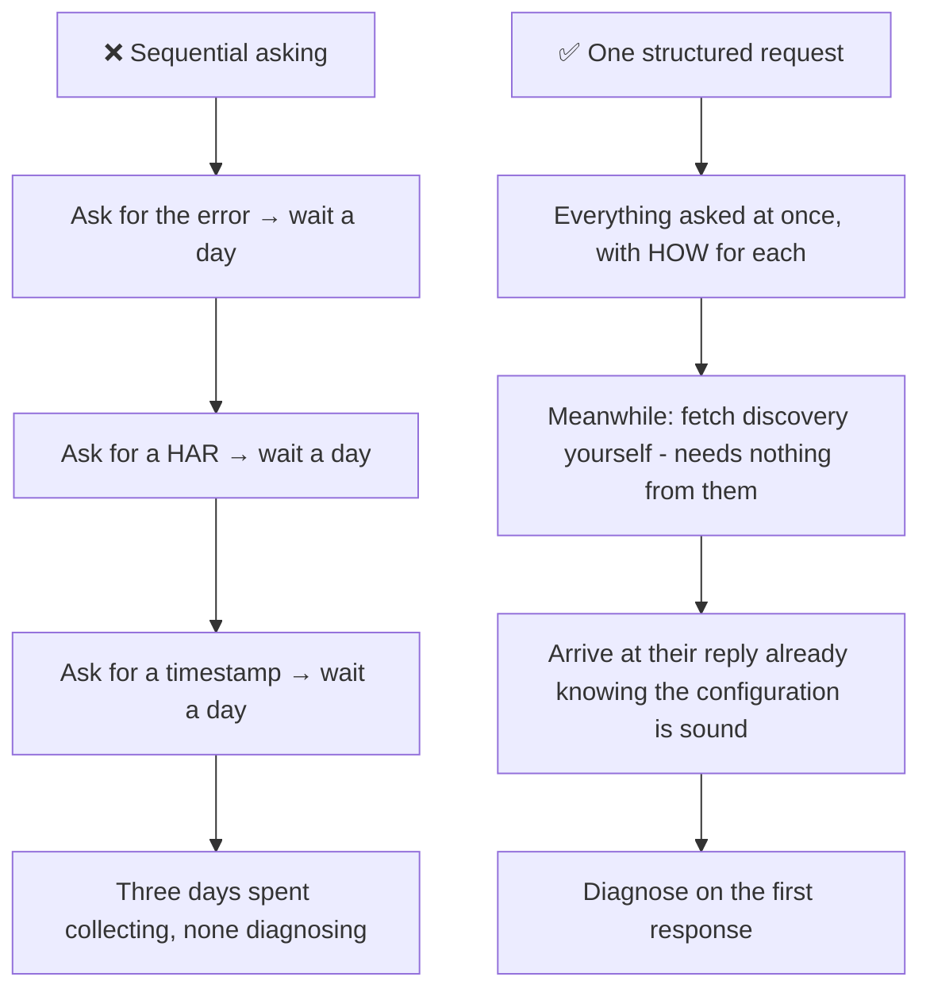
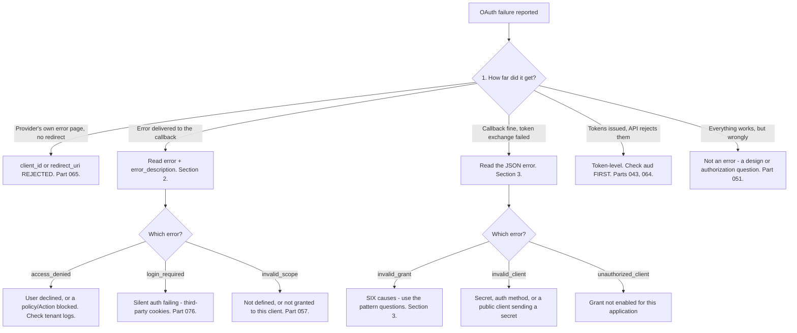

# Part 069 - The OAuth Error Catalog and Systematic Debugging

> Section goal: Turn every standard OAuth error into a short list of concrete causes, and build a repeatable method that resolves an unfamiliar failure without guessing. This Part is the practical capstone of Group F — the one you will use on more tickets than any other.

Covers index item **069**. Maps to JD signals: *knowledge of OAuth*, *strong analytical and problem-solving skills*, *experience with troubleshooting web applications*, *communicate technical concepts clearly*, and *exceed expectations on response quality*.

---

## 1. Start From Zero: Errors Arrive in Two Places

**The recurring theme of this Part:** the authorization server almost always explains what went wrong, and the application almost always throws that explanation away. **Asking for `error_description` is the highest-yield question in OAuth support.**

> **Analogy.** A rejected form returned with a note explaining which field was wrong — and an office that files the note unread and reports "form rejected."
>
> **Where it stops:** a paper note survives filing. `error_description` is usually gone by the time a ticket is raised, which is why the ask has to be specific and early.

---

## 2. Authorization Endpoint Errors

Delivered on the redirect: `?error=...&error_description=...&state=...`

| Error | Means | Common causes |
|---|---|---|
| **`invalid_request`** | Malformed request | Missing or duplicated parameter; bad encoding |
| **`unauthorized_client`** | Client may not use this grant/response type | Grant not enabled for this application (Part 057) |
| **`access_denied`** | User declined, **or policy blocked** | Consent declined; a rule or Action denied; MFA abandoned |
| **`unsupported_response_type`** | Server will not issue this type | Requesting `token` where implicit is disabled (Part 063) |
| **`invalid_scope`** | Scope unknown or not permitted | Typo; not defined on the API; not granted to the client |
| **`server_error`** | Internal failure | Provider issue, or an Action threw (Part 103) |
| **`temporarily_unavailable`** | Overloaded | Retry with backoff |
| **`login_required`** | `prompt=none` with no session | Silent auth failing — third-party cookies (Part 076) |
| **`interaction_required`** | `prompt=none` but interaction is needed | Consent or MFA required |
| **`consent_required`** | `prompt=none` but consent is missing | First use, or new scopes |

**Note that redirect-URI and client-ID errors are *not* in this list.** If the `redirect_uri` is unregistered or the `client_id` is unknown, the server **must not redirect** — it displays an error directly, because redirecting to an unvalidated URI would be the vulnerability itself. **That is a useful diagnostic:** an error shown on the provider's own page, rather than delivered to your callback, means the client or redirect URI was rejected (Part 065).

---

## 3. Token Endpoint Errors

Delivered as JSON with HTTP 400 or 401.

| Error | Means | Common causes |
|---|---|---|
| **`invalid_request`** | Malformed | Missing parameter; wrong content type |
| **`invalid_client`** | Client authentication failed | Wrong secret; wrong auth method; secret sent by a public client |
| **`invalid_grant`** | The grant is not valid | 🔴 **Four causes — see below** |
| **`unauthorized_client`** | Grant type not enabled for this client | Configuration (Part 057) |
| **`unsupported_grant_type`** | Server does not support it | Wrong grant, or deprecated (Part 063) |
| **`invalid_scope`** | Scope invalid or widened | Refresh requesting more than granted (Part 061) |
| **`invalid_target`** | Requested audience not permitted | Token exchange (Part 067) |
| **`invalid_dpop_proof`** | DPoP verification failed | Five sub-causes (Part 068) |

### 🔍 Plain-English deep-dive: `invalid_grant` is six errors wearing one name

`invalid_grant` is by far the most-reported token endpoint error and the least informative. **It covers at least six distinct situations**, and knowing the list converts a dead end into a checklist.

| Cause | Distinguishing signal |
|---|---|
| **Authorization code already used** | A retry, a double-submit, or a page refresh on the callback |
| **Authorization code expired** | Slow work between callback and exchange; codes live under a minute |
| **`redirect_uri` differs between the two requests** | "Works locally, fails in production" — proxy scheme rewriting (Part 058) |
| **PKCE verifier does not match** | Multi-tab, load-balanced storage, or a regenerated verifier (Part 059) |
| **Refresh token already used** | Rotation with reuse detection — check tenant logs (Part 061) |
| **Refresh token revoked or expired** | Session ended, absolute lifetime reached, or family revoked |

**The context questions in that diagram do the work**, and they cost one message: is it intermittent or consistent; does it correlate with retries, load, environment, or multiple tabs; and which grant type is being used. **Those three answers narrow six causes to one almost every time.**

**The one people miss most often is code expiry under load.** A callback handler that writes an audit record, calls a user-lookup service, or renders a page *before* exchanging the code can exceed a sixty-second lifetime when the system is busy. **The symptom is `invalid_grant` that appears only in production at peak** — which looks like a capacity problem and is a sequencing problem (Part 058).

**Analogy:** a rejection slip that says only "invalid" for six different reasons — wrong date, already redeemed, wrong branch, wrong signature, expired, cancelled. The slip is useless; knowing the six possibilities is what makes it tractable. **Where it stops:** a clerk could tell you which. The token endpoint deliberately does not, partly to avoid leaking information — so the list has to live in your head.

---

## 4. The Systematic Method

For any OAuth failure, familiar or not.

| Step | Cost | Yield |
|---|---|---|
| 1. How far did it get | One question | Splits the problem into four |
| 2. Exact error text | One question | Often the whole answer |
| 3. Discovery | 30 seconds, no customer input | Rules out configuration |
| 4. Decode the URL | One command | Six checks at once |
| 5. Decode tokens | One command | `aud`, `iss`, `exp`, `scope` |
| 6. Tenant logs | One lookup | The server's own view |
| 7. Pattern | Three questions | Distinguishes races from bugs |
| 8. Verify | One test | Proof rather than hope |

**Steps 1–3 cost almost nothing and resolve a large share of tickets**, which is why the order matters as much as the content.

### 🔍 Plain-English deep-dive: the pattern questions are worth more than the evidence

Step 7 looks like the least technical step and it is frequently the decisive one, because **the shape of a failure often identifies its cause before any artifact is examined.**

| Pattern | What it points at |
|---|---|
| **Every attempt fails** | Configuration — something is simply wrong |
| **Intermittent, succeeds on retry** | A **fleet** problem: one bad node, clock skew, or unshared state |
| **Fails only in one environment** | Environment drift, or a proxy rewriting a URL |
| **Fails only under load** | A timing problem — code expiry, rate limits, or a cache stampede |
| **Fails only with multiple tabs** | Shared storage keys — `state`, PKCE verifier, or refresh races |
| **Fails for a fixed percentage of users** | A data-dependent condition — a missing profile field, a group, a locale |
| **Started at a specific time with no deployment** | Rotation, expiry, or an **external** change |
| **Clusters at a time of day** | An absolute lifetime, or a scheduled job |

**The value is that these questions cost one message and can be asked immediately** — before a HAR arrives, before logs are pulled, before anyone has looked at anything. By the time the evidence lands, you already have a hypothesis to test rather than a corpus to search.

**The sixth row is the one most often missed.** "About 10% of users" sounds like randomness and is almost never random — it is the proportion sharing some property: a missing profile field, membership of a group, an older client version, a particular locale. **Asking "is there anything the affected users have in common?" frequently produces the answer directly**, because the customer knows their user base better than you do.

**And the seventh row is worth treating as a strong signal rather than a coincidence.** "Nothing changed" is usually true of *their* code, and something changed elsewhere: a key rotated, a certificate expired, a browser default shifted, a provider deprecated something. **Taking it at face value and asking what else runs on a schedule is more productive than doubting them.**

**Analogy:** a doctor asking when the pain occurs, what makes it worse, and whether anything else changed — before ordering any test. The history narrows the tests worth ordering. **Where it stops:** a patient can describe sensations. A customer can only describe what they observed, which is why the questions have to be about observable patterns rather than internal state.

---

## 5. Evidence to Ask For

Asking well is a skill. **Ask for artifacts, not descriptions.**

| Ask for | Not |
|---|---|
| The **full error text**, including `error_description` | "It says login failed" |
| A **HAR** of the failing flow (Part 021) | "Here's a screenshot" |
| The **tenant domain** | Credentials or configuration screenshots |
| The **decoded token header and payload**, signature stripped (Part 040) | The token itself |
| A **timestamp and timezone** for a failing attempt | "This morning" |
| **Whether it is intermittent**, and any pattern | "It's broken" |

### 🔍 Plain-English deep-dive: one message that collects everything

The difference between a two-hour resolution and a two-week one is usually the number of round trips. **A single well-constructed first reply can collect everything needed.**

**A first reply that works**, and it is worth having as a template:

> *"Thanks — to get to this quickly, could you send four things?*
>
> *1. **The full error text**, including `error_description` if your app logs it. If it doesn't, that's fine — it appears in the browser URL on the failing redirect, so a copy of that URL works.*
> *2. **A HAR of one failing attempt**, with credentials and token values redacted — DevTools → Network → Export HAR. If you'd rather not send the whole file, the `/authorize` URL and the token request are the two I need.*
> *3. **A timestamp with timezone** for one failing attempt, so I can line it up with tenant logs.*
> *4. **Whether it's every attempt or intermittent** — and if intermittent, whether it correlates with anything: a particular environment, multiple tabs open, high load, or specific users.*
>
> *Meanwhile I'll check your tenant's configuration from the public discovery document — I just need the domain your application calls."*

**Why each element earns its place:**

| Element | Why |
|---|---|
| **Tells them where to find it** | "Include `error_description`" fails if their app discards it; naming the URL as an alternative does not |
| **Offers a smaller option** | Some organisations cannot send a full HAR; naming the two requests keeps it possible |
| **Says redacted explicitly** | Reduces both risk and hesitation (Part 040) |
| **Timezone** | Log correlation fails silently without it |
| **The pattern question** | Distinguishes a race from a bug before any evidence arrives |
| **What you are doing meanwhile** | Signals momentum and needs nothing from them |

**The last row matters more than it appears.** A customer who knows you are already working while they gather evidence responds faster and escalates less. **It is a small thing that changes the temperature of a ticket.**

**Analogy:** a mechanic who asks when it happens, what it sounds like, and whether it is worse when cold — all in one call — versus one who calls back three times. Same expertise, entirely different experience. **Where it stops:** a mechanic can hear the car. You cannot see the flow at all, which is why the artifacts are not optional.

---

## 6. Failure Modes

| Failure mode | What it looks like | Consequence | Correction |
|---|---|---|---|
| **`error_description` discarded** | "Login failed" logged | 🔴 The answer thrown away | Log and surface it |
| **Guessing before reading the error** | Plausible theories | Wasted cycles | Read the exact string first |
| **Treating `invalid_grant` as one thing** | Dead end | Stalled ticket | Six causes; use context |
| **Sequential evidence requests** | Days of round trips | Slow resolution | One structured request |
| **Asking what they configured** | Screenshots and beliefs | Slow | Ask for the sent value |
| **Not checking discovery** | Assuming configuration | Missed root cause | 30 seconds, no input needed |
| **Ignoring tenant logs** | Client-side view only | Half the picture | Correlate by timestamp |
| **No timezone** | Log correlation fails | Silent dead end | Always ask |
| **Not establishing the pattern** | Race treated as a bug | Wrong fix | Three pattern questions |
| **Verifying by absence of complaints** | "Seems fixed" | Recurrence | Reproduce the success |
| **Accepting a token in a ticket** | Convenient | 🔴 Live credential (Part 040) | Ask for decoded claims |

---

## 7. Troubleshooting Decision Tree: Any OAuth Error

### Worked example

*"Login fails for about 10% of users. No pattern we can see. It's been happening for two weeks."*

1. **Do not theorise.** Run the method.
2. **Step 1 — how far?** Ask. Answer: an error on the callback URL.
3. **Step 2 — exact error.** They do not log `error_description`. **Point them at the browser URL instead** — it is in the redirect. Answer: `error=access_denied&error_description=Rule%20threw%20an%20error`.
4. **That string changes everything.** This is not a user declining; a tenant Action or Rule is throwing (Part 103).
5. **Step 3 — discovery.** Configuration is sound. A layer ruled out with no customer input.
6. **Step 6 — tenant logs.** Correlate by timestamp. The failed logins show an Action error with a stack trace.
7. **Step 7 — pattern.** The Action calls an external API to enrich the profile. It fails for users whose profile lacks a field the Action assumes is present. **10% is the proportion of users missing that field** — which is why no pattern was visible from the outside.
8. **Two fixes, and both are worth giving:** the Action must handle the missing field, and it should fail **open or closed deliberately** rather than by accident. Right now an unhandled exception blocks login, which is a decision nobody made.
9. **Step 8 — verify.** Reproduce a login for an affected user and confirm success, rather than waiting for complaints to stop.
10. **Raise the general point:** any Action calling an external service needs a timeout, error handling, and an explicit decision about what happens on failure. **That prevents the next three incidents**, and it is the part of the answer they will remember.

---

## 8. Lab: Build the Error Catalog

**Purpose.** Produce every standard error deliberately, record its exact text, and build the lookup table and request template you would use on real tickets.

**Prerequisites.** All Group F artifacts. A free Auth0 tenant with several test applications.

**Steps.**

1. Create `okta-prep/labs/069-errors/`.
2. **Trigger every authorization endpoint error** from §2. For each, record the **exact** `error`, `error_description`, HTTP behavior, and **where it appeared** — provider page or callback.
3. **Trigger every token endpoint error** from §3, including all **six** `invalid_grant` causes separately. **Record each exact response body.**
4. **The redirect distinction.** Trigger an unregistered `redirect_uri` and confirm the error appears on the **provider's page**, not your callback. **Record why** — this is a genuinely useful diagnostic.
5. **Build the lookup table.** `oauth-error-catalog.md` — error string, endpoint, likely causes ranked, the distinguishing question for each, and the fix. **This is the artifact you would actually use.**
6. **Test it.** Have someone trigger a failure without telling you which, and **resolve it using only your table.** Record how long it took.
7. **Extend the parser.** Build on Part 058's `authz-url-parse` so it also accepts an error callback URL and prints the decoded `error_description` plus the matching catalog entry.
8. **Discard the description.** Configure an application to log only "login failed." **Then attempt to diagnose a failure from that log alone.** Record how much harder it is — this is the customer's experience.
9. **Tenant log correlation.** Trigger a failure, note the exact timestamp with timezone, and **find the corresponding tenant log entry** (Part 107). Record the event code and payload.
10. **Timezone experiment.** Deliberately correlate using a timestamp with no timezone and **record how it fails.**
11. **Write the request template.** `evidence-request.md` — the §5 message, with the reasoning for each element.
12. **Practise the method.** Take three failures from your Group F failure catalogs, and for each **write the eight-step walk-through**. Time yourself.
13. **Pattern questions.** Write the three pattern questions and, for each answer, which cause it points at. **This is a one-page decision aid.**
14. **Failure catalog + manifest.** Complete `MANIFEST.md`, consolidating every error recorded across Group F.

**Expected evidence.** Every standard error triggered with exact text, all six `invalid_grant` causes separated, the redirect distinction demonstrated, a complete lookup catalog, a timed blind test, an extended parser, a description-discarded contrast, tenant log correlation with and without timezone, an evidence request template, three timed method walk-throughs, and a pattern decision aid.

**Validation rubric.**

| Check | Pass condition |
|---|---|
| Authorization errors | All from §2 triggered and recorded |
| Token errors | All from §3, including six `invalid_grant` causes |
| Redirect distinction | Provider page versus callback demonstrated |
| Lookup catalog | Every error with ranked causes and a distinguishing question |
| Blind test | Resolved using only the catalog; time recorded |
| Description discarded | Difficulty contrast recorded |
| Log correlation | Succeeds with timezone, fails without |
| Request template | Six elements with reasoning |
| Method walk-throughs | Three, timed |

**Cleanup and privacy.** Lab tenant, synthetic users, your own applications. **Redact all token values** from recorded errors. Restore any deliberately broken configuration. Delete applications and revoke tokens at the end.

---

## 9. JD Mapping

| Supplied JD signal | How this Part supports it |
|---|---|
| **Knowledge of OAuth** | Every standard error and its real causes |
| **Strong analytical and problem-solving skills** | An eight-step method that works on unfamiliar failures |
| **Experience troubleshooting web applications** | HAR, logs, timestamps, and pattern establishment |
| **Communicate technical concepts clearly** | An evidence request that collects everything in one message |
| **Exceed expectations on response quality** | Verifying by reproduction; raising the general prevention |
| Ownership from start to resolution | Working the configuration layer before the customer replies |
| Customer-obsessed attitude | Telling them where to find `error_description` rather than blaming its absence |

---

## 10. Candidate Honesty Note

- **Claim safety:** *Learned architecture and lab experience*, with genuinely transferable production skill — systematic evidence-driven troubleshooting is what you already do.
- **The strongest thing you can say:** *"My method is eight steps and the first three cost almost nothing. How far did it get — that splits the problem into four. The exact error and `error_description` — which is often the whole answer. And fetch the discovery document for the domain their app actually calls, which needs nothing from them and rules out the configuration layer before they reply."*
- **A second point, and it is the highest-yield habit:** *"`error_description` is the most valuable string in OAuth and applications routinely discard it, logging 'login failed' while the server explained exactly what happened. When they don't have it, I point them at the browser URL on the failing redirect, because it's in there — that's more useful than telling them their logging is inadequate."*
- **A third, which turns a dead end into a checklist:** *"`invalid_grant` is six errors wearing one name: code reused, code expired, `redirect_uri` mismatch, PKCE verifier mismatch, refresh token reused, or refresh token revoked. Three context questions separate them — is it intermittent, does it correlate with environment, load, or multiple tabs, and which grant type."*
- **A fourth, on evidence collection:** *"I ask for everything in one structured message rather than sequentially, because three round trips is three days. I tell them where to find each thing, offer a smaller alternative to a full HAR, say 'redacted' explicitly, and always ask for a timezone. And I say what I'm doing meanwhile — a customer who knows you're already working responds faster and escalates less."*
- **A fifth, on closing well:** *"I verify by reproducing the success, not by absence of complaints. And where the cause is a class rather than an instance — an Action with no error handling, a URL derived from an incoming request — I raise the class, because that prevents the next three incidents."*
- **Do not overstate:** you have not handled OAuth tickets in production. Say the method is your existing troubleshooting discipline applied to a domain you have learned deliberately.

---

## 11. Official Source Anchors

Accessed **26 August 2026**.

| Source | What it defines |
|---|---|
| IETF RFC 6749 §4.1.2.1 | Authorization endpoint error codes |
| IETF RFC 6749 §5.2 | Token endpoint error codes |
| IETF RFC 6749 §3.1.2.4 | Why invalid redirect URIs must **not** be redirected |
| IETF RFC 6750 §3.1 | Bearer token error responses and `WWW-Authenticate` |
| OpenID Connect Core §3.1.2.6 | OIDC-specific errors: `login_required`, `consent_required`, `interaction_required` |
| IETF RFC 9449 §7 | `invalid_dpop_proof` |
| IETF RFC 8693 §2.2.2 | `invalid_target` |
| Auth0 documentation — error codes and tenant log event codes | Vendor-specific errors and log correlation |
| Okta developer documentation — error codes | Okta's error catalog |

**Revalidate after 26 August 2026:** the RFC error codes are stable. Recheck vendor error catalogs and log event codes, which are extended over time.

---

## ⭐ Likely Interview Questions for This Section

### Q1. "How do you approach an OAuth error you've never seen?"
> *Model answer:* "Eight steps, and the first three cost almost nothing. How far did it get — never reached login, error on the callback, exchange failed, or the API rejected the token. That single question splits the problem into four and it costs one message. Then the exact error and `error_description`, which is frequently the whole answer. Then fetch the discovery document for the domain their application actually calls, which needs nothing from them and rules out the configuration layer before they've replied. After that: decode the `/authorize` URL parameter by parameter, decode any tokens locally, correlate with tenant logs by timestamp, and establish the pattern — intermittent, environment-specific, load-dependent, multi-tab, user-specific. Then verify the fix by reproducing success rather than waiting for complaints to stop."

### Q2. "What does `invalid_grant` mean?"
> *Model answer:* "Six different things sharing one name, which is why it's the most-reported and least useful token endpoint error. For the authorization code grant: the code was already used, the code expired, the `redirect_uri` differs between the authorization request and the token request, or the PKCE verifier doesn't match. For refresh tokens: the token was already used with rotation enabled, or it was revoked or expired. Three context questions separate them — is it intermittent or consistent, does it correlate with environment, load, or multiple tabs, and which grant type. 'Works locally, fails in production' points at `redirect_uri`. 'Fails with multiple tabs' points at PKCE storage. 'Only under load' points at code expiry from slow work before the exchange."

### Q3. "What's the single most useful thing to ask a customer?"
> *Model answer:* "The full error text including `error_description`. It's the most valuable string in OAuth and applications routinely throw it away — logging 'login failed' while the server explained precisely what went wrong. The important refinement is what to do when they don't have it: rather than telling them their logging is inadequate, point them at the browser URL on the failing redirect, because for authorization endpoint errors it's right there in the query string. That's actionable in thirty seconds instead of requiring a code change. And I'd ask for it alongside everything else in one message, because sequential asking turns a two-hour ticket into a two-week one."

### Q4. "How do you request evidence well?"
> *Model answer:* "One structured message rather than three sequential ones, with four things: the full error text and where to find it if their app doesn't log it, a HAR of one failing attempt with a smaller alternative named in case they can't send the whole file, a timestamp with timezone for log correlation, and whether it's every attempt or intermittent with any correlating factor. I say 'redacted' explicitly, both to reduce risk and because it reduces hesitation. And I say what I'm doing meanwhile — checking their configuration from the public discovery document, which needs only the domain. That last part matters more than it looks: a customer who knows you're already working responds faster and escalates less."

### Q5. "An error appears on the provider's page instead of your callback. What does that tell you?"
> *Model answer:* "That the client ID or the redirect URI was rejected — and it's a genuinely useful diagnostic. The specification requires that when a redirect URI is unregistered or the client ID is unknown, the server must *not* redirect, because redirecting to an unvalidated URI would be the vulnerability itself. So the error is displayed directly instead. That means: if the customer describes an error page at the identity provider rather than an error on their own callback, I can rule out everything downstream and go straight to the application registration. Conversely, an error delivered to their callback means the client and redirect URI were both accepted, and the problem is scopes, consent, policy, or authentication."

### Q6. "Login fails for 10% of users with no visible pattern. How do you start?"
> *Model answer:* "By running the method rather than theorising, because 'no pattern' usually means no pattern was looked for from the right angle. How far does it get, then the exact error — and if they don't log `error_description`, the browser URL has it. If it's `access_denied` with a description mentioning a rule or Action, that reframes everything: it isn't users declining, it's tenant-side code throwing. Then tenant logs correlated by timestamp will show the actual exception. A very common shape is an Action calling an external API to enrich the profile, which fails for users missing a field it assumes exists — and the percentage of affected users is just the proportion missing that field, which is invisible from outside. The fix is handling the field, plus deciding deliberately whether that Action should fail open or closed, because right now an unhandled exception is making that decision by accident."

### Q7. "How do you verify a fix?"
> *Model answer:* "By reproducing success, not by absence of complaints. If the failure was intermittent, absence of reports proves very little over a short window — and it's how a partially-fixed issue gets closed and reopened a fortnight later. So: reproduce the original failing scenario and confirm it now succeeds, and where the cause was visible in logs — reuse events, Action errors, rate limiting — confirm those events have stopped over a comparable period rather than a shorter one. And I'd tell the customer what I verified and how, so they can check the same thing themselves later. That's also what makes the write-up useful: the next person gets a reproduction step rather than an assertion that it was fixed."

### Q8. "What separates a good OAuth debugger from an average one?"
> *Model answer:* "Reading the exact error before forming a theory, and asking for artifacts rather than descriptions. Average debugging starts from a plausible hypothesis and looks for evidence supporting it; good debugging starts from what the server actually said. The other differences are habits: knowing that `invalid_grant` is six things rather than one, so you use context to narrow rather than guessing; fetching discovery first because it's free and rules out a whole layer; always getting a timezone, because log correlation fails silently without one; and asking whether it's intermittent early, because that distinguishes a race from a bug before any evidence arrives. And then closing well — verifying by reproduction, and raising the *class* of problem when the cause is a pattern rather than an instance, because that prevents the next three tickets."

---

## 🧠 30-Second Memory Hooks

- **Errors arrive in TWO places:** the callback (query params) · the token endpoint (JSON).
- **`error_description` is the most valuable string in OAuth.** Applications throw it away.
- **No description logged? It is in the BROWSER URL** on the failing redirect.
- **Error on the PROVIDER'S page = `client_id` or `redirect_uri` rejected.** They must not redirect.
- **`invalid_grant` = SIX causes:** code reused · code expired · **`redirect_uri` mismatch** · PKCE verifier · refresh reused · refresh revoked.
- **Three pattern questions:** intermittent? · correlates with environment/load/tabs? · which grant type?
- **Eight-step method.** Steps 1–3 cost almost nothing and solve most tickets.
- **Step 1: HOW FAR DID IT GET?** Splits the problem into four.
- **Discovery needs only the domain.** Rules out configuration before they reply.
- **Ask for ARTIFACTS, not descriptions.** One message, not three.
- **Always ask for a TIMEZONE.** Log correlation fails silently without it.
- **Verify by REPRODUCING SUCCESS**, never by absence of complaints.
- **Raise the CLASS, not just the instance.**

---

## ✅ Completion Checklist

- [ ] **Knowledge:** I can recite the eight-step method, the six `invalid_grant` causes, and the provider-page-versus-callback distinction.
- [ ] **Lab artifact:** `069-errors/` contains every standard error with exact text, all six `invalid_grant` causes separated, a complete lookup catalog, a timed blind test, and an evidence request template.
- [ ] **Spoken:** I can walk the method in 90 seconds and explain `invalid_grant` in 45.
- [ ] **Technique:** I ask for everything in one message, always with a timezone, and I say what I am doing meanwhile.
- [ ] **Honesty check:** I claim systematic troubleshooting as existing production skill and OAuth as deliberately learned.
- [ ] **Source check:** I have read RFC 6749 §4.1.2.1, §5.2 and §3.1.2.4 myself.

---

*Next suggested section:* **[Part 070 - OpenID Connect From Zero: The Identity Layer](Part-070-openid-connect-from-zero-the-identity-layer.md)** — Group G begins: what OIDC adds to OAuth, and why it exists at all.
