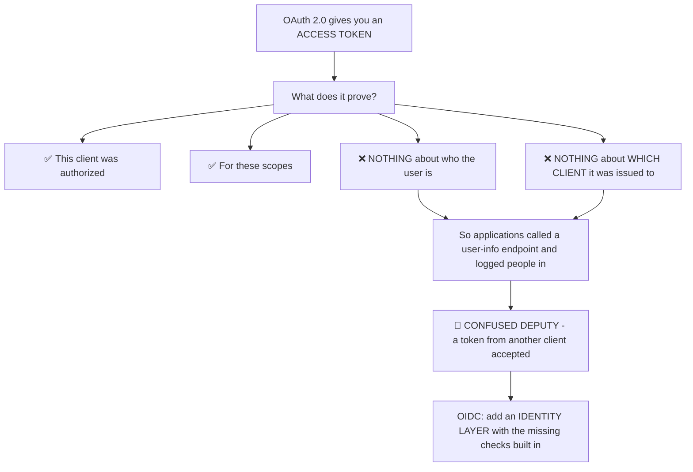
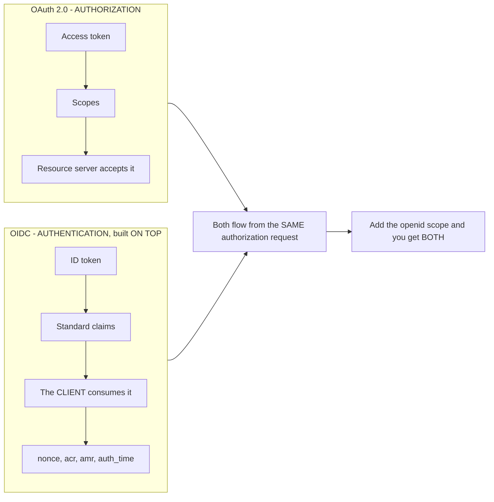
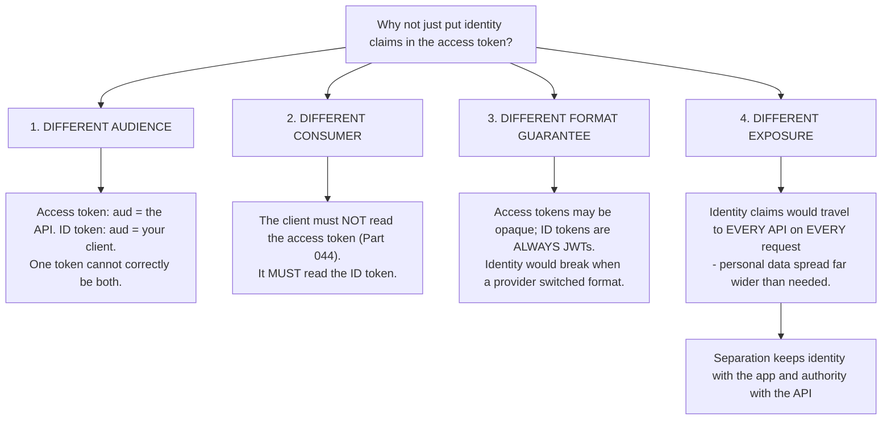
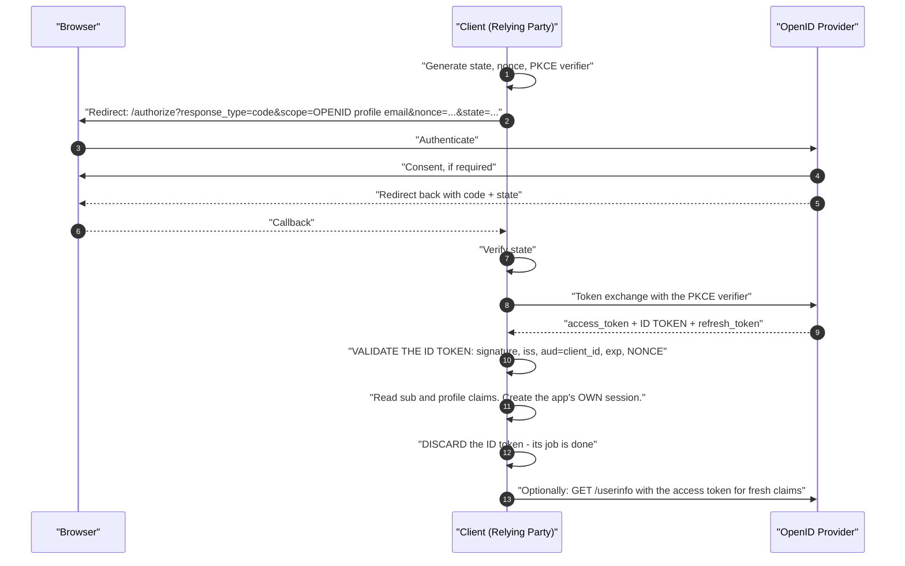
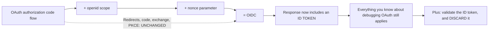
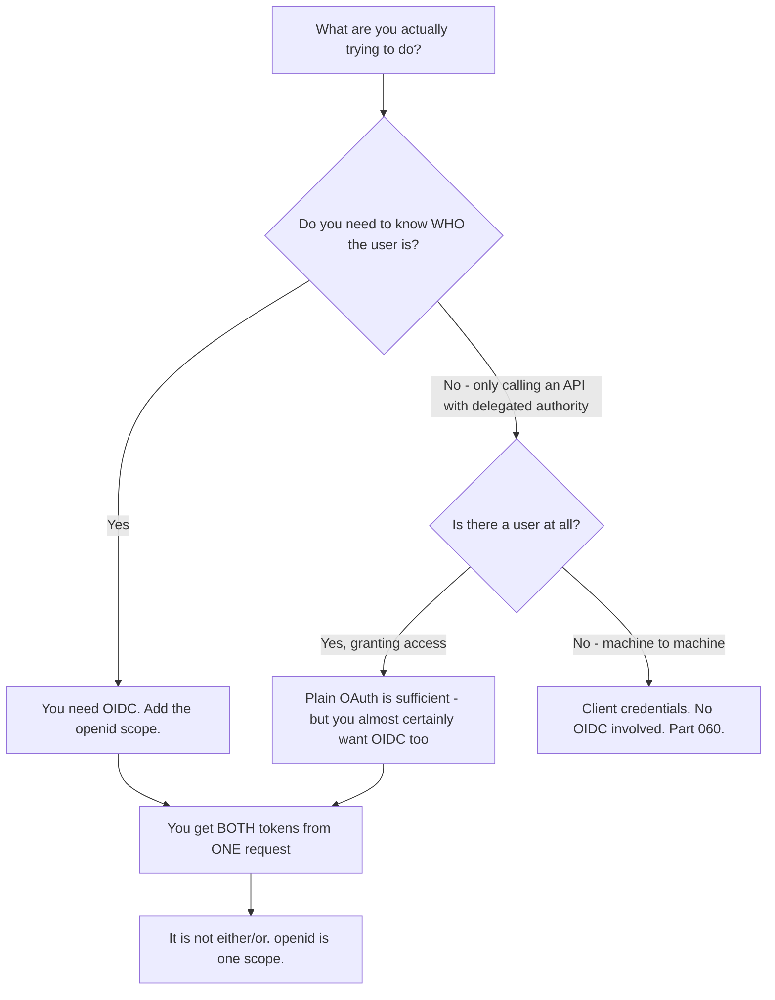
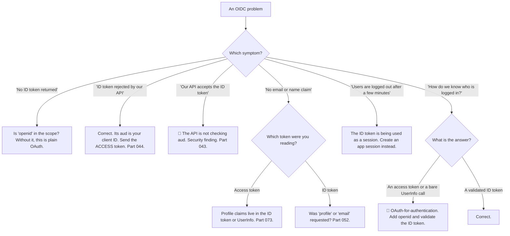

# Part 070 - OpenID Connect From Zero: The Identity Layer

> Section goal: Understand exactly what OIDC adds on top of OAuth, why it had to exist, and how to hold the boundary between the two clearly. Almost every "we're using OAuth for login" conversation resolves here.

Covers index item **070**. Maps to JD signals: *knowledge of OIDC*, *knowledge of OAuth*, *knowledge of authentication and authorization*, *communicate technical concepts clearly*, and *basic security concepts*.

---

## 1. Start From Zero: What OAuth Could Not Do

OAuth 2.0 is an **authorization** framework. It answers *"may this client access this resource?"* — and says nothing about *who the user is* (Part 056).

**OIDC exists because everyone built login on OAuth anyway, and did it inconsistently and insecurely.** Rather than telling people to stop, the standard added the missing pieces and made them interoperable.

> **Analogy.** A parcel courier's authorisation slip proves they may collect a parcel. It is not identification. Enough people used slips as ID that a standard identity card was issued — carrying a name, an expiry, and a statement of *who it was issued to*.
>
> **Where it stops:** an ID card is a general-purpose credential you carry between organisations. An ID token is issued to **one** application, expires in minutes, and is consumed once — which is stronger, and is why it cannot be re-presented elsewhere.

---

## 2. What OIDC Adds

| Addition | Fixes |
|---|---|
| **ID token** — a signed JWT about the user, with `aud` = your client ID | The confused-deputy problem (Part 056) |
| **`nonce`** | ID token replay and injection (Part 065) |
| **Standard claims** — `sub`, `email`, `name`, `picture`… | Every provider inventing its own shapes |
| **Standard scopes** — `openid`, `profile`, `email`, `address`, `phone` | Guessing what to request |
| **UserInfo endpoint** — a standard place for profile data | Provider-specific endpoints (Part 073) |
| **Discovery** — `/.well-known/openid-configuration` | Hardcoded endpoints (Part 057) |
| **Standard logout** — RP-initiated, front-channel, back-channel | No logout story at all (Part 075) |
| **`acr` / `amr` / `auth_time`** | No way to express or verify assurance (Part 049) |

**The single most operationally important fact:** OIDC is triggered by the **`openid` scope**. Without it, the request is plain OAuth and **no ID token is issued** — which is the highest-frequency OIDC ticket in existence (Part 052).

---

## 3. The Two Tokens, Two Audiences, Two Consumers

This is the boundary to hold clearly.

| | ID token | Access token |
|---|---|---|
| Standard | **OIDC** | OAuth |
| Answers | *Who is this user?* | *What may the bearer do?* |
| `aud` | Your **client ID** | The **API identifier** |
| Consumed by | **Your application** | **The API** |
| Format | **Always a JWT** | JWT or opaque |
| Lifetime | Short — consumed once | Short — used repeatedly |
| Sent to an API | 🔴 **Never** | ✅ Always |

### 🔍 Plain-English deep-dive: why OIDC did not just add claims to the access token

A reasonable question: if the access token is already a JWT with claims, why introduce a second token at all?

**Because they have different audiences, and merging them would break both.**

**The fourth reason is the one people find most persuasive.** If a user's email, name, and profile lived in the access token, that personal data would be sent to every API, through every proxy and gateway, and logged wherever headers are logged (Part 052). **Keeping identity in a token the client consumes and discards keeps it out of that path entirely.**

**The third reason is the practical one.** An access token's format is deliberately not a contract — a provider may switch between JWT and opaque, and a client is not supposed to care (Part 044). If login depended on reading it, that switch would break authentication. **The ID token being *always* a JWT is a guarantee applications can rely on.**

**And the first reason is structural.** `aud` names one recipient class. A token whose `aud` is the API is not addressed to the client, and a token whose `aud` is the client is not addressed to the API. **One token cannot honestly be both**, which is why sending an ID token to an API fails and, when it does not fail, indicates a missing audience check (Part 043).

**The support-facing version:** when a developer asks why they need two tokens, the short answer is *"they're addressed to different people."* The longer one is that merging them would put personal data on every API request and make login depend on a format the provider is free to change.

**Analogy:** a passport and a boarding pass. Both concern you, both are issued for the journey, and they go to different people at different desks. Printing your passport details on the boarding pass would spread them across every gate you pass. **Where it stops:** you carry both physically. Here the ID token is consumed once and discarded, which is stronger than carrying it around.

---

## 4. The OIDC Flow

Identical to the authorization code flow (Part 058), with the OIDC additions marked.

**Steps 8 and 9 are the OIDC-specific ones**, and both are routinely skipped: validating the ID token properly (Part 071), and discarding it rather than treating it as a session credential (Part 044).

### 🔍 Plain-English deep-dive: OIDC changed almost nothing about the flow, and that is the point

Compare the diagram above with Part 058's authorization code flow. **The requests, the redirects, the code, and the exchange are identical.** OIDC adds three things to an existing flow rather than defining a new one:

| Addition | Where |
|---|---|
| The **`openid` scope** | In the authorization request |
| A **`nonce` parameter** | In the authorization request, returned inside the ID token |
| An **ID token** in the response | Alongside the access token |

**Why this matters practically, in three ways:**

**1. Your OAuth debugging transfers completely.** Redirect URI mismatches, `invalid_grant`'s six causes, PKCE storage races, `state` handling — all identical (Part 069). **There is no separate OIDC troubleshooting method to learn.**

**2. Adoption is genuinely incremental.** A customer already running the code flow adds one scope and one parameter, then handles a token they were not previously receiving. **That framing removes most of the perceived cost** of "moving to OIDC."

**3. It explains why the broken pattern is so common.** Because OIDC is *only* an extra scope, a flow that omits it does not fail — it succeeds and returns an access token. **The insecure path is the default when someone follows an OAuth tutorial**, which is why plain-OAuth login persists (Part 056).

**The one genuinely new obligation is on the client side**, and it is where implementations fall short: validating the ID token fully (Part 071) and then discarding it. The flow gives you a token; nothing forces you to check it properly.

**The support-facing version:** when a customer worries that adopting OIDC is a project, the honest answer is that the flow they already run is unchanged — they add `openid` and `nonce`, and they add token validation. **The validation is the real work, and it is a well-defined checklist rather than an architecture change.**

**Analogy:** a form that already exists, with one extra box ticked and one extra reference number, producing an additional certificate you now have to check. Same process, one more output, one more obligation. **Where it stops:** a certificate is checked by a person who would notice it missing. Nothing notices an unvalidated ID token, which is why the obligation has to be deliberate.

---

## 5. Roles and Vocabulary

| OIDC term | OAuth equivalent | Plain English |
|---|---|---|
| **OpenID Provider (OP)** | Authorization Server | Who authenticates and issues tokens |
| **Relying Party (RP)** | Client | The application that trusts the OP |
| **End-User** | Resource Owner | The person |
| **ID Token** | *(no equivalent)* | The signed identity statement |
| **UserInfo Endpoint** | *(no equivalent)* | Standard profile claims |
| **Claims** | *(no equivalent)* | Statements about the user |

**In practice, vendors and engineers use OAuth vocabulary for both** — "authorization server" and "client" are far more common than "OP" and "RP." Recognising both matters mainly when reading the specifications or a customer's SAML-influenced description (Part 048).

### 🔍 Plain-English deep-dive: how to answer "should we use OAuth or OIDC?"

Customers ask this constantly, and it is a slightly malformed question — **OIDC is not an alternative to OAuth, it is a layer on it.** But the answer they need is real.

**The framing that resolves it:** *"They're not alternatives. OIDC is one extra scope on the same request, and it gives you an ID token alongside the access token. If you need to know who the user is — which you do, if you're logging them in — you want it."*

**The three cases where the distinction genuinely matters:**

| Case | Answer |
|---|---|
| **Machine to machine** | No user, so no OIDC. Client credentials only (Part 060) |
| **Third-party API access with no login** | Plain OAuth is honest — you do not need the user's identity |
| **Login** | **OIDC, always.** Plain OAuth for login is the confused-deputy bug |

**The dangerous middle case** is an application that logs users in *and* calls APIs, and requests only an access token — then reads identity from the UserInfo endpoint or, worse, from the access token itself. **That is OAuth-for-authentication rebuilt** (Part 056), and it is common because it works.

**The diagnostic question:** *"How do you determine which user is logged in?"* If the answer involves an access token or a UserInfo call without an ID token, that is the finding.

**Analogy:** asking whether to use an engine or a car. The engine is part of the car; the question is what you are trying to do. **Where it stops:** you would not confuse the two in a showroom. Here both produce a working login, and only one carries the audience check that makes it safe.

---

## 6. Failure Modes

| Failure mode | What it looks like | Consequence | Correction |
|---|---|---|---|
| **Missing `openid` scope** | No ID token | 🔴 The #1 OIDC ticket | Add the scope |
| **OAuth used for login** | UserInfo call, no ID token | 🔴 Confused deputy (Part 056) | Request `openid`; validate the ID token |
| **ID token sent to an API** | 401, `aud` mismatch | Nothing works (Part 044) | Send the access token |
| **API accepts an ID token** | It "works" | 🔴 The API is not checking `aud` | Fix the API (Part 043) |
| **ID token kept as a session credential** | Constant re-login, or ignoring `exp` | Poor UX or a security gap | Create an application session, discard it |
| **`nonce` omitted** | Works fine | 🔴 ID token injection (Part 065) | Send and validate |
| **ID token not validated** | Claims read from an unverified token | 🔴 Forgery accepted (Part 043) | Full validation first |
| **Identity read from the access token** | Works until the format changes | Silent breakage (Part 044) | ID token or UserInfo |
| **Expecting profile claims in the access token** | Missing `email` | Broken UI | ID token or UserInfo |
| **Assuming `sub` is an email** | Breaks on format change | Wrong user matched (Part 041) | `sub` is opaque |

---

## 7. Troubleshooting Decision Tree: OIDC Basics

### Worked example

*"We're using OAuth for login. Our security review says it's insecure but we don't understand why — the token comes from a real provider and we verify it."*

1. **Establish precisely what they do.** Ask: how do you determine which user is logged in? Answer: they obtain an access token, call the provider's user-info endpoint with it, and log the user in as whatever ID comes back.
2. **Confirm the missing check.** Ask whether anything verifies **which client** that access token was issued to. Answer: no — and that is the entire vulnerability.
3. **Explain the attack concretely**, because the abstract version does not land: an attacker running their own application can obtain a valid access token for a user of *that* application, present it to this login endpoint, and be logged in as that user. **The token is genuine and the identity is genuine** — the application simply never asked who the token was for.
4. **Name why "we verify it" is not sufficient.** They verify the token is real. They do not verify it was issued *to them*. Those are different questions, and only the second prevents this.
5. **The fix is small:** add the `openid` scope, validate the returned ID token — signature, `iss`, `aud` equal to their client ID, `exp`, and `nonce` — and use `sub` from it as the identity.
6. **Emphasise the `aud` check specifically.** It is the piece that closes the hole; everything else is standard validation.
7. **Reassure honestly.** This pattern was widespread before OIDC was well known and plenty of tutorials still show it. **They followed a common example rather than doing something careless** — and saying so keeps the conversation about the fix.
8. **Suggest checking other applications**, because a team that built one login this way usually built several.

---

## 8. Lab: OAuth Versus OIDC, Side by Side

**Purpose.** Run the same flow with and without OIDC, observe exactly what changes, and reproduce the confused-deputy vulnerability safely.

**Prerequisites.** Parts 041, 044, 052, 057, 058 artifacts. A free Auth0 tenant with **two** applications and a test API.

**Steps.**

1. Create `okta-prep/labs/070-oidc-basics/`.
2. **Plain OAuth flow.** Complete an authorization code flow **without** `openid`. **Record exactly what comes back.** Confirm no ID token.
3. **OIDC flow.** Repeat with `openid profile email`. **Record what comes back.** Decode the ID token locally (Part 040).
4. **Diff the two responses.** Build a table of what is present in each. **This is the whole "what does OIDC add" question, answered by observation.**
5. **Decode both tokens.** Put the ID token and access token side by side: `aud`, `iss`, `exp`, `sub`, `nonce`, `scope`, and any profile claims. **Record every difference.**
6. **Send the ID token to your API.** Record the 401 and the reason.
7. **Remove your API's `aud` check** and send it again. **Confirm it is accepted.** Write one line on why that is a security defect, then restore the check.
8. **Reproduce the confused deputy — safely, within your own tenant.** Register a **second** application. Obtain an access token through application B. Then present that token to a login endpoint you write that follows the broken pattern — user-info call, no audience check. **Confirm it logs you in.** **This is the lab's central artifact.**
9. **Then fix your login endpoint** to require an ID token with `aud` equal to its own client ID. **Confirm application B's token is now rejected.**
10. **`nonce`.** Complete a flow without `nonce` and confirm it succeeds. Then with `nonce`, and **confirm the claim appears in the ID token and matches what you sent.**
11. **Session handling.** Build a client that treats the ID token as a session credential. **Record what happens when it expires** — the user is logged out in minutes. Then create a proper application session and confirm the difference.
12. **Profile claims.** Attempt to read `email` from the access token. Record what is present. Then obtain it from the ID token, and separately from the UserInfo endpoint (Part 073). **Compare all three.**
13. **Scope dependency.** Request `openid` alone, then `openid profile`, then `openid profile email`. **Record which claims appear at each step.**
14. **Write the explainer.** `oauth-vs-oidc.md` — one page: what OIDC adds, the two tokens and their audiences, and why plain OAuth for login is the confused-deputy bug.
15. **Failure catalog + manifest.** Complete `MANIFEST.md`.

**Expected evidence.** Two contrasting flows with a response diff, both tokens decoded side by side, an ID-token-to-API rejection and an unsafe acceptance, a reproduced confused-deputy attack within your own tenant and its fix, `nonce` behavior, a session-handling contrast, a three-way profile claim comparison, a scope-to-claims table, and a one-page explainer.

**Validation rubric.**

| Check | Pass condition |
|---|---|
| Two flows | Presence and absence of the ID token recorded |
| Token comparison | Every claim difference tabulated |
| ID token to API | Rejected; unsafe acceptance demonstrated and restored |
| Confused deputy | Reproduced with two of your own applications, then fixed |
| `nonce` | Claim present and matching |
| Session handling | Expiry behaviour contrasted |
| Profile claims | Three sources compared |
| Scope table | Claims mapped to each scope |
| Explainer | One page, three topics |

**Cleanup and privacy.** Lab tenant, synthetic users, **both applications your own**. The confused-deputy demonstration must use two applications **you registered** — never a third party's client ID. Restore your API's audience check immediately. Delete both applications and revoke tokens at the end.

---

## 9. JD Mapping

| Supplied JD signal | How this Part supports it |
|---|---|
| **Knowledge of OIDC** | What it adds and why, from first principles |
| Knowledge of OAuth | The layer boundary, held precisely |
| Knowledge of authentication and authorization | The clearest instance of the distinction |
| **Communicate technical concepts clearly** | "They're addressed to different people" |
| **Basic security concepts** | Confused deputy, explained concretely |
| Customer-obsessed attitude | Saying they followed a common example, not that they were careless |
| Exceed expectations on response quality | Suggesting a check of their other applications |

---

## 10. Candidate Honesty Note

- **Claim safety:** *Learned architecture and lab experience.*
- **The strongest thing you can say:** *"OAuth authorizes; OIDC authenticates. OIDC exists because everyone built login on OAuth anyway and did it inconsistently and insecurely — so rather than telling people to stop, the standard added the missing pieces: an ID token whose `aud` is your client ID, a `nonce`, standard claims and scopes, a UserInfo endpoint, discovery, and a logout story."*
- **A second point, and it is the highest-frequency ticket:** *"OIDC is triggered by the `openid` scope. Without it the request is plain OAuth and no ID token is issued — so 'we're not getting an ID token' is almost always one missing scope value."*
- **A third, on why there are two tokens:** *"They're addressed to different people. The ID token's `aud` is your client ID and your application consumes it; the access token's `aud` is the API and the API consumes it. Merging them would put personal data on every API request and would make login depend on the access token's format, which providers are free to change."*
- **A fourth, on the vulnerability:** *"Plain OAuth for login is the confused-deputy problem. An attacker running their own application obtains a valid access token for one of its users, presents it to your login endpoint, and gets logged in as that user. The token is genuine and the identity is genuine — the missing check is *which client* it was issued to, and that's exactly what the ID token's `aud` provides."*
- **A fifth, on how to raise it:** *"'We verify the token' is usually true and insufficient. They verify it's real; they don't verify it was issued to them. I'd separate those two questions explicitly, and note that this pattern predates OIDC being well known and is still in plenty of tutorials — so it's a common example followed, not carelessness."*
- **A sixth, practical:** *"The ID token is consumed once. An application that keeps it and re-validates it on every request has adopted the provider's few-minute expiry as its session length, and will either log people out constantly or start ignoring `exp`."*
- **Do not overstate:** you have not implemented OIDC in production. Say the layer boundary is clear and you have reproduced both the correct and broken patterns in a lab.

---

## 11. Official Source Anchors

Accessed **26 August 2026**.

| Source | What it defines |
|---|---|
| OpenID Connect Core 1.0 §1, §2 | Purpose, roles, and the ID token |
| OpenID Connect Core §3.1 | The authorization code flow with OIDC additions |
| OpenID Connect Core §5.4 | Standard scopes and the claims each returns |
| OpenID Connect Discovery 1.0 | The metadata document (Part 057) |
| IETF RFC 6749 | The OAuth framework OIDC builds on |
| IETF RFC 6819 | The threat model including confused deputy |
| openid.net — certification and specifications | Conformance and the current specification set |
| Auth0 and Okta documentation — OIDC overview | Vendor framing and implementation |

**Revalidate after 26 August 2026:** OIDC Core 1.0 is stable. Recheck the OpenID Foundation for errata and newer specifications in the family.

---

## ⭐ Likely Interview Questions for This Section

### Q1. "What's the difference between OAuth and OIDC?"
> *Model answer:* "OAuth is an authorization framework — it answers 'may this client access this resource' and says nothing about who the user is. OIDC is an identity layer built on top of it, triggered by adding the `openid` scope to the same request. It adds an ID token, which is a signed JWT about the user whose `aud` is your client ID; a `nonce` for replay protection; standard claims and scopes so every provider isn't different; a UserInfo endpoint; discovery metadata; and a standard logout story. They're not alternatives — OIDC is one extra scope on the same flow, and you get both tokens back. The short version I'd use with a customer is: OAuth authorizes, OIDC authenticates."

### Q2. "Why does OIDC exist at all?"
> *Model answer:* "Because everyone was building login on OAuth anyway, and doing it inconsistently and insecurely. The pattern was: get an access token, call the provider's user-info endpoint, log the user in as whatever comes back. That's exploitable — it's the confused-deputy problem, because an access token proves a client was authorized but says nothing about which client it was issued to. So an attacker with their own application could obtain a valid token for one of its users and present it to a different application's login. Rather than telling the industry to stop using OAuth for login, the standard added the missing pieces and made them interoperable — most importantly an ID token with an audience bound to the receiving client."

### Q3. "Why two tokens rather than one?"
> *Model answer:* "Because they're addressed to different people. The ID token's `aud` is your client ID and your application consumes it; the access token's `aud` is the API identifier and the API consumes it — one token can't honestly be both. Beyond that: the client isn't supposed to read the access token at all, because its format isn't a contract and a provider can switch between JWT and opaque, so making login depend on it would be fragile. And if identity claims lived in the access token, personal data would travel to every API on every request, through every proxy, and get logged wherever headers are logged. Separation keeps identity with the application and authority with the API."

### Q4. "A customer says they aren't getting an ID token."
> *Model answer:* "First question: is `openid` in the scope parameter? Without it the request isn't OIDC at all — it's plain OAuth, which has no concept of an ID token, so the authorization server is behaving correctly. It's the highest-frequency OIDC ticket because the scope looks like boilerplate and gets dropped when someone hand-builds a request or copies an OAuth example. If `openid` is there and there's still no ID token, I'd check whether the response type and flow support it and look at the exact token response. But nine times out of ten it's one missing scope value, and the fix takes seconds."

### Q5. "How would you explain the confused-deputy problem?"
> *Model answer:* "An application obtains an access token, calls the provider's user-info endpoint, gets back a user ID, and logs that person in. The flaw is that nothing checks *which client* the token was issued to. So an attacker who runs their own application — a legitimate one, registered normally — can obtain a valid access token for one of its users, present that token to the target application's login endpoint, and be logged in as that user. Both the token and the identity are completely genuine; the application just never asked who the token was for. That's why 'we verify the token' is usually true and insufficient: they verify it's real, not that it was issued to them. The ID token's `aud` claim is exactly the missing check."

### Q6. "Should a customer use OAuth or OIDC?"
> *Model answer:* "It's a slightly malformed question, and the useful reframe is that they're not alternatives — OIDC is one extra scope on the same request. The real question is what they're trying to do. If they need to know who the user is, which they do if they're logging someone in, they need OIDC. If it's machine-to-machine with no user, it's client credentials and OIDC doesn't apply. If it's genuinely just delegated API access with no login, plain OAuth is honest. The dangerous middle case is an application that both logs users in and calls APIs, requests only an access token, and derives identity from a UserInfo call — that's OAuth-for-authentication rebuilt. The diagnostic question is 'how do you determine which user is logged in?'"

### Q7. "What should an application do with an ID token after login?"
> *Model answer:* "Validate it, read what it needs, create its own session, and discard it. It's a one-time assertion, not a session credential. An application that keeps it and re-validates on every request has effectively adopted the provider's expiry — typically a few minutes — as its own session length, so it either logs users out constantly or starts ignoring `exp` to avoid that, and both outcomes are bad. The corollary worth mentioning is that once it's discarded, the app has no live source of profile data, so if a user's name changes at the provider the session won't know. The answers are refreshing from UserInfo when it matters, or accepting that the profile is a snapshot from login — which is usually fine, but should be a decision rather than an accident."

### Q8. "What does OIDC add beyond the ID token?"
> *Model answer:* "Quite a lot, and it's easy to miss because the ID token gets the attention. Standard scopes — `openid`, `profile`, `email`, `address`, `phone` — so you know what to ask for. Standard claim names, so `email` means the same thing everywhere. A UserInfo endpoint at a discoverable location for fresh profile data. Discovery metadata, so endpoints and the issuer are fetched rather than hardcoded. A standard logout story: RP-initiated, front-channel and back-channel. And `acr`, `amr` and `auth_time`, which are what make step-up authentication expressible and verifiable. Without those, every provider integration would be bespoke — which is exactly what the world looked like before OIDC, and why migrating between providers used to be a rewrite."

---

## 🧠 30-Second Memory Hooks

- **OAuth AUTHORIZES. OIDC AUTHENTICATES.** OIDC is a **layer**, not an alternative.
- **Triggered by the `openid` scope.** No `openid` → **no ID token** → the #1 OIDC ticket.
- **OIDC exists because everyone used OAuth for login anyway** — insecurely.
- **The missing check was AUDIENCE.** The ID token's `aud` = **your client ID**.
- **Two tokens, two audiences, two consumers.** ID token → **your app**. Access token → **the API**.
- **Never send an ID token to an API.** If an API accepts one, it is not checking `aud`.
- **Why not one token?** Different audience · different consumer · **access token format is not a contract** · identity would travel to every API.
- **OIDC also adds:** standard claims and scopes · **UserInfo** · **discovery** · **logout** · **`acr`/`amr`/`auth_time`**.
- **The ID token is consumed ONCE.** Create your own session and discard it.
- **The diagnostic question:** *"How do you determine which user is logged in?"*
- **"We verify the token" ≠ "we verify it was issued to us."**

---

## ✅ Completion Checklist

- [ ] **Knowledge:** I can list everything OIDC adds and explain why identity is a separate token.
- [ ] **Lab artifact:** `070-oidc-basics/` contains a two-flow diff, both tokens compared, a reproduced-then-fixed confused deputy using two of my own applications, and a one-page explainer.
- [ ] **Spoken:** I can distinguish OAuth from OIDC in 45 seconds and explain confused deputy in 60.
- [ ] **Judgement:** I frame the broken pattern as a common example followed, not carelessness.
- [ ] **Honesty check:** I say "reproduced in a lab," not production implementation.
- [ ] **Source check:** I have read OIDC Core §1 and §2 myself.

---

*Next suggested section:* **[Part 071 - ID Tokens, Standard Claims, and Validation](Part-071-id-tokens-standard-claims-and-validation.md)** — every claim an ID token carries, and the validation steps OIDC requires beyond ordinary JWT checks.
