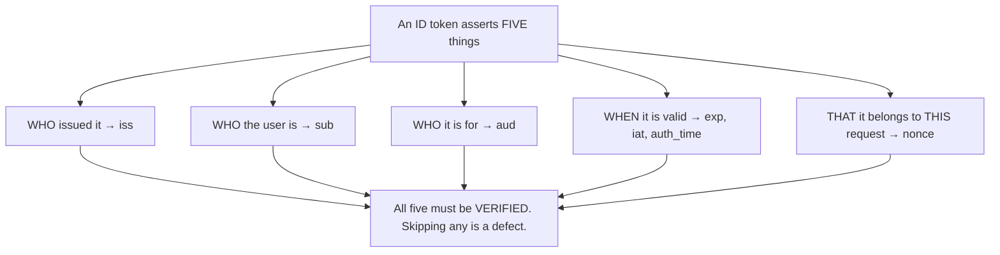
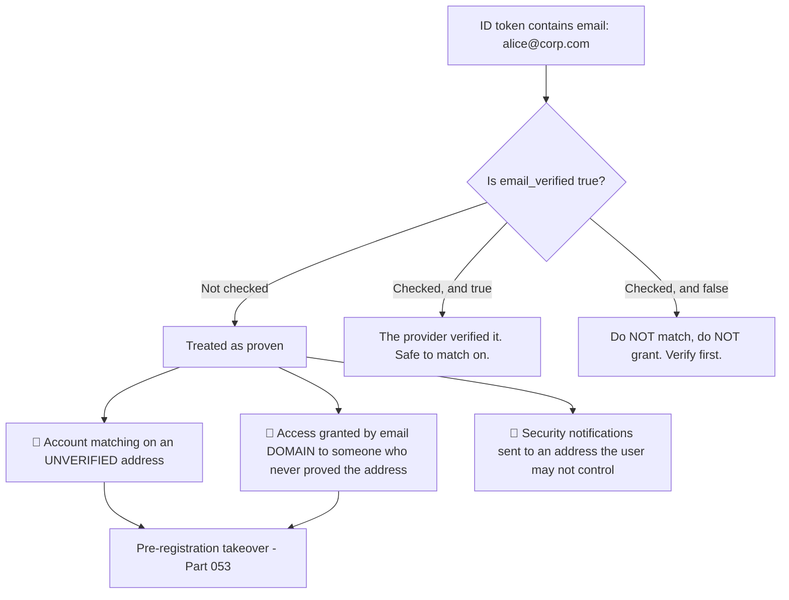
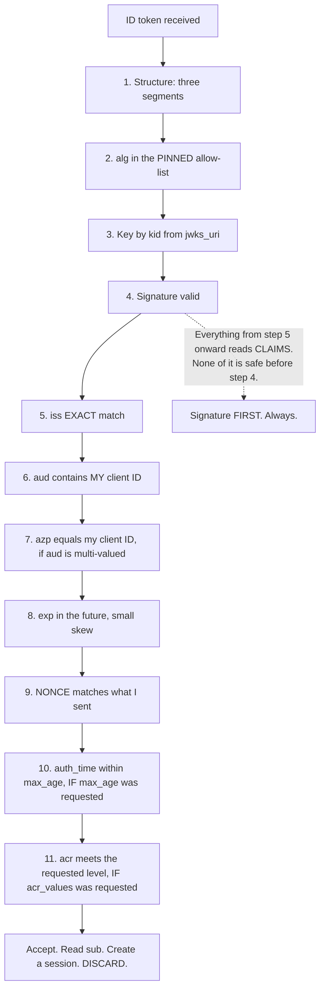
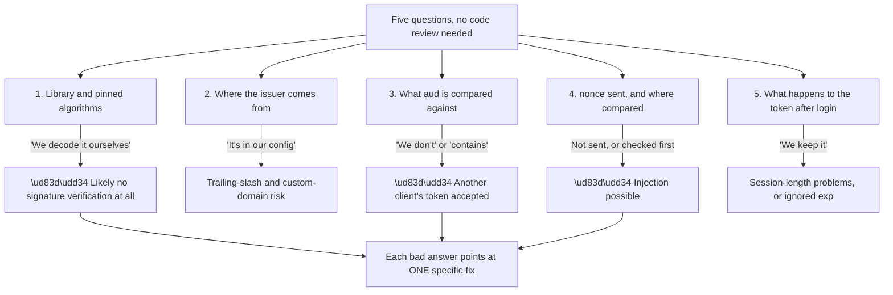
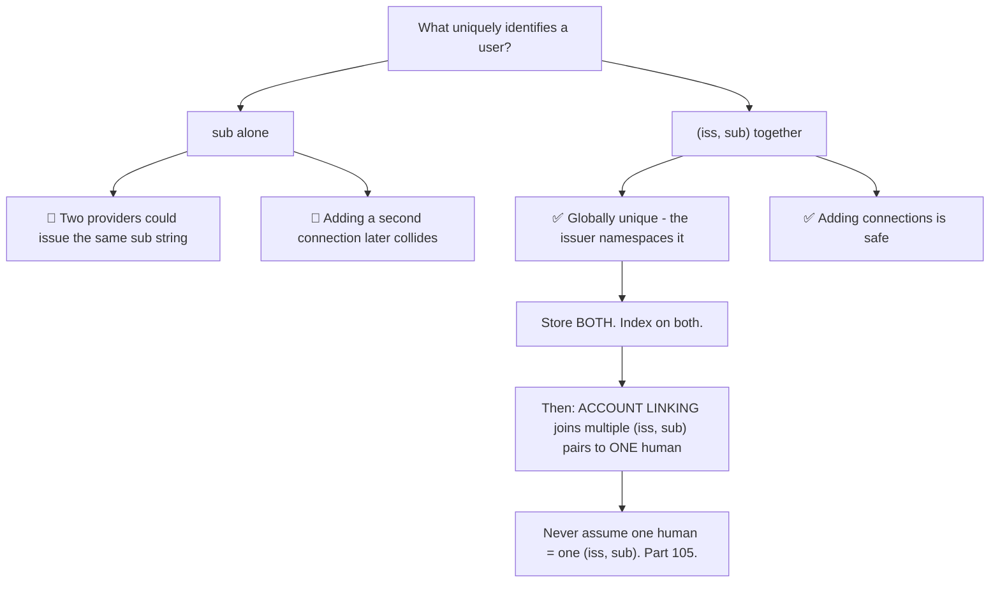
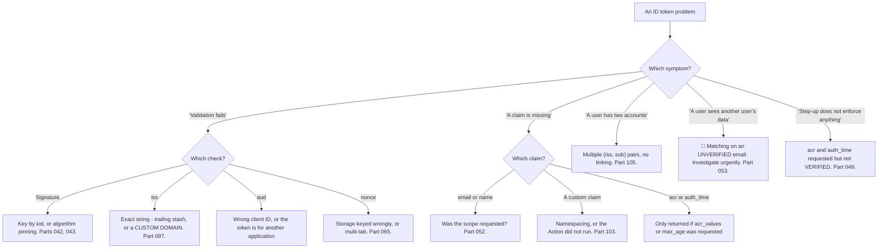

# Part 071 - ID Tokens, Standard Claims, and Validation

> Section goal: Know every claim an ID token carries, what each one is for, and the validation steps OIDC requires *beyond* ordinary JWT checking. This is where Part 043's checklist becomes OIDC-specific, and where most real ID token bugs live.

Covers index item **071**. Maps to JD signals: *knowledge of OIDC*, *basic security concepts*, *strong analytical and problem-solving skills*, *experience with troubleshooting web applications*, and *promote best practices*.

---

## 1. Start From Zero: What an ID Token Is

A signed JWT asserting that **a specific provider authenticated a specific user for a specific client at a specific time**.

```json
{
  "iss": "https://tenant.us.auth0.com/",
  "sub": "auth0|abc123",
  "aud": "YOUR_CLIENT_ID",
  "exp": 1787500800,
  "iat": 1787497200,
  "auth_time": 1787497190,
  "nonce": "n-0S6_WzA2Mj",
  "azp": "YOUR_CLIENT_ID",
  "acr": "urn:mace:incommon:iap:silver",
  "amr": ["pwd", "otp"],
  "email": "user@example.com",
  "email_verified": true,
  "name": "Test User",
  "picture": "https://.../avatar.png",
  "updated_at": "2026-08-20T10:00:00.000Z"
}
```



> **Analogy.** A signed statement from a notary: who they are, whom they identified, whom the statement is for, when the identification took place, and a reference number matching your request. Every element is load-bearing.
>
> **Where it stops:** a notarised document is archival and can be checked later. An ID token is consumed within minutes and discarded (Part 070) — its value is entirely in the moment of validation.

---

## 2. The Required Claims

OIDC Core mandates these.

| Claim | Meaning | Validation rule |
|---|---|---|
| **`iss`** | Issuer | **Exact string** match against the expected issuer |
| **`sub`** | Subject — the stable user ID | Opaque; **never parse it** |
| **`aud`** | Audience | Must contain **your client ID** |
| **`exp`** | Expiry | Must be in the future, small skew allowed |
| **`iat`** | Issued at | Present; may be used for freshness |

| Conditional claim | When required |
|---|---|
| **`nonce`** | If sent in the request — **must match** |
| **`azp`** | When `aud` has multiple values — must be your client ID |
| **`auth_time`** | If `max_age` was requested, or `auth_time` was requested as essential |
| **`acr`** | If `acr_values` was requested |
| **`amr`** | Optional; the methods actually used |

---

## 3. The Standard Profile Claims

Returned according to the scopes requested (Part 052).

| Scope | Claims |
|---|---|
| **`profile`** | `name`, `family_name`, `given_name`, `middle_name`, `nickname`, `preferred_username`, `profile`, `picture`, `website`, `gender`, `birthdate`, `zoneinfo`, `locale`, `updated_at` |
| **`email`** | `email`, `email_verified` |
| **`address`** | `address` (a structured object) |
| **`phone`** | `phone_number`, `phone_number_verified` |

### 🔍 Plain-English deep-dive: the `_verified` claims are the ones that matter

`email` and `phone_number` come with companions — `email_verified` and `phone_number_verified` — and applications routinely read the first and ignore the second.

**That omission is a security decision made by accident** (Part 053).



**Two patterns make this concrete:**

**1. Account linking on email.** If a user arrives from a social provider with `email: alice@corp.com` and `email_verified: false`, matching them to an existing account means anyone who can *claim* that address at that provider takes over the account. **Some social providers allow unverified addresses in profiles**, which is exactly the gap.

**2. Domain-based authorisation.** *"Anyone with an @acme.com email joins the Acme organisation"* is a common B2B convenience. Without checking `email_verified`, it means anyone who can assert an `@acme.com` address at any federated provider joins that organisation (Part 104).

**The rule is short:** *treat `email` as a display value and `email_verified` as the authorisation signal.* If the verified flag is absent or false, the address is a claim rather than a fact.

**And a subtlety worth knowing:** `email_verified` reflects **that provider's** verification, not yours. A federated provider asserting `true` means *they* verified it. Whether you trust that depends on whether you trust that provider — which is a real decision for social connections and usually not one for an enterprise IdP (Part 100).

**The support signal:** when a customer reports a user seeing another user's data, or an unexpected organisation membership, unverified-email matching is a leading candidate and worth asking about early.

**Analogy:** a form where someone writes their address versus one where a utility bill was checked. Both produce an address on a page; only one is evidence. **Where it stops:** a clerk would notice the missing bill. Code reads the address field and never looks for the flag beside it.

---

## 4. The OIDC Validation Steps

Part 043's eight checks, plus the OIDC-specific ones.



| Step | OIDC-specific? |
|---|---|
| 1–6, 8 | Standard JWT (Part 043) |
| **7. `azp`** | ✅ OIDC |
| **9. `nonce`** | ✅ OIDC |
| **10. `auth_time` vs `max_age`** | ✅ OIDC |
| **11. `acr` vs `acr_values`** | ✅ OIDC |

**Steps 9 through 11 are the ones skipped most often**, and each is skipped for the same reason: everything works without them.

### 🔍 Plain-English deep-dive: how to audit validation code without reading all of it

Customers rarely hand over their codebase, and you rarely need it. **Five targeted questions establish whether validation is sound**, and each is answerable in a sentence.

| Question | What a bad answer sounds like |
|---|---|
| **1. Which library validates the token, and what algorithms does it accept?** | "We decode it ourselves" — or no explicit algorithm list |
| **2. Where does the expected issuer come from?** | "It's in our config file" — typed rather than fetched (Part 057) |
| **3. What do you compare `aud` against?** | "We don't" — or a substring check (Part 064) |
| **4. Do you send a `nonce`, and where do you compare it?** | "What's a nonce?" — or compared before signature verification |
| **5. What happens to the ID token after login?** | "We keep it in the session and re-check it" (Part 070) |



**Question 1 is the highest-yield.** "We decode it ourselves" is the single most alarming answer in this area, because decoding is not verification (Part 043) — and it is a natural thing to say for someone who wrote a small helper and never thought of it as a security boundary.

**Question 4 has two failure modes in one**, which is why it is phrased as two parts: not sending `nonce` at all, and comparing it *before* verifying the signature. The second sounds like diligence and is reading claims from an unverified token.

**Why asking beats reading:** these questions are quick, they are not accusatory, and they surface the problem in the customer's own words — which means they arrive at the finding rather than being handed it. **A developer who says "actually, we don't check `aud`" out loud has already accepted the fix.**

**And they work in an interview too.** Being able to say *"here are the five questions I'd ask to establish whether someone's token validation is sound"* demonstrates the checklist without reciting it.

**Analogy:** a building inspector who asks five questions at the door rather than surveying the whole structure. The answers tell them where to look, and often that there is nothing to look for. **Where it stops:** an inspector can walk the building if the answers are unsatisfactory. You may never see the code — which is why the questions have to be sharp enough to stand alone.

---

## 5. `sub`, and Why It Is Harder Than It Looks

`sub` is the stable identifier for the user **at that provider, for that client**.

| Property | Detail |
|---|---|
| **Opaque** | Never parse, never display, never assume a format |
| Stable | For the same user at the same provider |
| **Not globally unique** | Two providers may issue the same string |
| **Not one per human** | A person signing in via email and via Google gets **two** |
| Sometimes **pairwise** | Some providers issue a different `sub` per client, deliberately |

### 🔍 Plain-English deep-dive: `sub` plus `iss` is the identifier, not `sub` alone

The mistake is treating `sub` as a primary key. **The correct key is the pair `(iss, sub)`.**



**Why this bites later rather than immediately:** a system with one connection works perfectly with `sub` alone. The collision risk appears when a **second** connection is added — a social provider, an enterprise IdP — which is usually months later and by a different engineer. **The migration then requires backfilling an issuer onto every existing record**, which is exactly the kind of change nobody wants to make in a live system.

**The related and more visible problem is that one human legitimately has several identities.** Alice signing in with a password, with Google, and through her employer's SSO produces three distinct `(iss, sub)` pairs. Without account linking she has three accounts and three sets of data — which surfaces as *"I signed in and all my stuff is gone"* (Part 105).

**Three rules that avoid all of this:**

1. **Store `(iss, sub)`, index on both.**
2. **Never parse or display `sub`.** Auth0 formats like `google-oauth2|1234` encode the connection, and that format is not a contract.
3. **Design for account linking from the start**, even with one connection — a user table with a separate identity table is far easier than retrofitting one.

**The support-facing tell:** *"a user has two accounts"* or *"my data disappeared after signing in"* almost always means multiple `(iss, sub)` pairs with no linking, and it is worth asking how they signed in **this** time versus last time.

**Analogy:** a customer number that is unique within one branch. Fine until the company merges with another and two customers share a number. **Where it stops:** a merger is an announced event. Adding a second identity connection is a routine feature ticket, and nobody realises it changed the uniqueness assumption.

---

## 6. Failure Modes

| Failure mode | What it looks like | Consequence | Correction |
|---|---|---|---|
| **`nonce` not validated** | Works fine | 🔴 ID token injection (Part 065) | Validate after the signature |
| **Claims read before signature check** | Works fine | 🔴 Forged tokens accepted | Signature first, always |
| **`aud` not checked** | Works fine | 🔴 Another client's token accepted | Must contain your client ID |
| **`azp` ignored with multi-value `aud`** | Weaker binding | Wrong client's token | Check `azp` |
| **`email_verified` ignored** | Works fine | 🔴 Takeover via unverified email (Part 053) | Treat it as the authorisation signal |
| **`sub` used alone as a key** | Works with one connection | Collides when a second is added | Key on `(iss, sub)` |
| **`sub` parsed or displayed** | Works until the format changes | Breakage; poor UX | Opaque |
| **Assuming one human = one `sub`** | Duplicate accounts | "My data disappeared" | Account linking (Part 105) |
| **`auth_time` not checked with `max_age`** | Step-up appears to work | 🔴 Stale authentication accepted (Part 049) | Check it |
| **`acr` not checked with `acr_values`** | Step-up is theatre | 🔴 Requested level not enforced | Compare requested to returned |
| **ID token used as a session** | Re-login every few minutes | Poor UX or ignored `exp` | Application session (Part 070) |
| **Expecting all profile claims** | `email` missing | Broken UI | Claims follow scopes (Part 052) |

---

## 7. Troubleshooting Decision Tree: ID Token Problems



### Worked example

*"Some users report that after signing in, their workspace is empty — but if they sign in a different way, everything is there."*

1. **"Different way, different data" is the diagnosis** — the sign-in method is producing a different identity.
2. **Ask how each sign-in was performed.** Answer: once with a password, once with "Continue with Google."
3. **Confirm from the tokens.** Have them decode both ID tokens locally (Part 040) and compare `sub` and `iss`. **They differ.**
4. **Explain it plainly, and correct the fear first:** nothing was lost. The two sign-in methods produced two distinct identities, so the application created two accounts, and each has its own workspace.
5. **Establish whether the emails match**, and critically whether `email_verified` is true on both. If it is, linking is safe; if not, **linking would be a takeover vector** (Part 053) and must not be done automatically.
6. **The fix has two halves.** Short term: link the affected accounts, verifying identity out of band first. Long term: implement account linking properly — match on `(iss, sub)`, and link additional identities to a single user record with verification (Part 105).
7. **Check the data model while there.** If they key on `sub` alone, adding another connection will collide. **Keying on `(iss, sub)` now is far cheaper than backfilling later.**
8. **Suggest a product change**, because this recurs: showing the user *which* method they used last time, or offering to link at the point of a second sign-in, prevents the ticket entirely.

---

## 8. Lab: Validate an ID Token Properly

**Purpose.** Implement all eleven checks, break each one, and confirm the OIDC-specific ones are enforced.

**Prerequisites.** Parts 040–043, 049, 052, 070 artifacts. A free Auth0 tenant with two connections — database and a social provider.

**Steps.**

1. Create `okta-prep/labs/071-id-tokens/`.
2. **Obtain and decode an ID token.** Record every claim present and map each to §2 and §3.
3. **Build an eleven-check validator** with a **distinct error message per check**.
4. **Baseline.** Validate a genuine token successfully.
5. **Break checks 1–8** as in Part 043 and confirm each is caught.
6. **Break check 9 — `nonce`.** Present a token whose `nonce` does not match the stored value. **Record the error.** Then remove the check and confirm the token is accepted — **write one line on what that permits** (Part 065).
7. **Break check 7 — `azp`.** If your provider issues multi-audience tokens, obtain one and test `azp` handling.
8. **Check 10 — `auth_time`.** Authenticate, wait, then re-authorize with `max_age=60`. **Record whether re-authentication was forced and whether `auth_time` updated.**
9. **Check 11 — `acr`.** Request `acr_values` for MFA and **compare the requested value to the returned `acr`.** Record whether the provider honoured it, and note what an unrecognised value does (Part 049).
10. **Scope-to-claims map.** Request `openid`, then add `profile`, then `email`, then `phone`. **Record exactly which claims appear at each step.**
11. **`email_verified`.** Obtain a token from a connection where the email is unverified. **Record both claims.** Then write the account-matching rule you would implement.
12. **Two identities, one human.** Sign in as the same person via both connections. **Record both `(iss, sub)` pairs** and confirm they differ.
13. **Reproduce the empty-workspace ticket.** Build a minimal app keyed on `sub` alone, sign in both ways, and **confirm two accounts are created.** Then key on `(iss, sub)` and confirm the same thing happens — **making the point that the key does not solve linking**, it only prevents collisions.
14. **Add linking.** Implement a user record with multiple identities, link them with verification, and confirm one workspace.
15. **`sub` format.** Record the `sub` format from each connection. **Write one line on why parsing it is unsafe.**
16. **Write the validation guide.** `id-token-validation.md` — the eleven checks in order, which are OIDC-specific, and the `(iss, sub)` and `email_verified` rules.
17. **Failure catalog + manifest.** Complete `MANIFEST.md`.

**Expected evidence.** A fully mapped ID token, an eleven-check validator, eleven recorded failures, `nonce` enforcement demonstrated both ways, `max_age` and `acr` behaviour recorded, a scope-to-claims table, an unverified-email token with a written matching rule, two `(iss, sub)` pairs for one human, a reproduced-then-fixed duplicate-account scenario, and a validation guide.

**Validation rubric.**

| Check | Pass condition |
|---|---|
| Claim mapping | Every claim identified and categorised |
| Eleven checks | Distinct message per check |
| `nonce` | Enforced; absence demonstrated and explained |
| `auth_time` / `max_age` | Behaviour recorded |
| `acr` | Requested versus returned compared |
| Scope-to-claims | Table complete |
| `email_verified` | Unverified case captured; rule written |
| `(iss, sub)` | Two pairs for one human |
| Duplicate accounts | Reproduced, then resolved by linking |
| Guide | Eleven checks plus both rules |

**Cleanup and privacy.** Lab tenant, synthetic users, **an email domain you control**. Decode locally and strip signatures from saved output (Part 040). Delete users, connections and applications at the end.

---

## 9. JD Mapping

| Supplied JD signal | How this Part supports it |
|---|---|
| **Knowledge of OIDC** | Every claim and every required validation step |
| **Basic security concepts** | `nonce`, `aud`, `azp`, and unverified-email matching |
| Strong analytical and problem-solving skills | "Different sign-in, different data" resolved in one comparison |
| Experience troubleshooting web applications | Duplicate accounts and missing claims |
| **Promote best practices** | `(iss, sub)` keying and `email_verified` as the authorisation signal |
| Communicate technical concepts clearly | Correcting the "my data is gone" fear first |
| Exceed expectations on response quality | Suggesting the product change that prevents recurrence |

---

## 10. Candidate Honesty Note

- **Claim safety:** *Learned architecture and lab experience.*
- **The strongest thing you can say:** *"ID token validation is Part 043's JWT checks plus four OIDC-specific ones: `azp` when the audience is multi-valued, `nonce` matching what you sent, `auth_time` against `max_age` if you requested it, and `acr` against `acr_values` if you requested that. Those four are the ones skipped most often, and all four are skipped for the same reason — everything works without them."*
- **A second point, and it is a real security finding:** *"`email_verified` is the claim applications read past. Treat `email` as a display value and `email_verified` as the authorisation signal. Matching accounts or granting domain-based access on an unverified address means anyone who can *claim* that address at any federated provider takes over the account or joins the organisation."*
- **A third, on identity keys:** *"The identifier is `(iss, sub)`, not `sub` alone. With one connection `sub` works perfectly, and the collision appears when a second connection is added months later by someone else — and then you're backfilling an issuer onto every existing record in a live system."*
- **A fourth, diagnostic:** *"'I signed in and all my data is gone' is almost always two `(iss, sub)` pairs with no account linking. Nothing was lost — signing in a different way produced a different identity and therefore a different account. Correcting the fear before explaining the mechanism matters, because they think they've lost data."*
- **A fifth, on `sub` itself:** *"It's opaque. Auth0 formats like `google-oauth2|1234` encode the connection, but that format isn't a contract, so parsing or displaying it breaks later. And one human legitimately has several — password, Google, corporate SSO — which is a linking problem, not a bug."*
- **A sixth:** *"`auth_time` matters specifically for step-up: checking `acr` alone means an elevated authentication from three hours ago still satisfies the check."*
- **Do not overstate:** you have not run OIDC validation in production. Say you have implemented all eleven checks and broken each in a lab.

---

## 11. Official Source Anchors

Accessed **26 August 2026**.

| Source | What it defines |
|---|---|
| OpenID Connect Core §2 | ID token claims, including `azp`, `auth_time`, `acr`, `amr` |
| OpenID Connect Core §3.1.3.7 | The normative ID token validation steps |
| OpenID Connect Core §5.1 | Standard claims and the `_verified` companions |
| OpenID Connect Core §5.4 | Scope-to-claim mapping |
| OpenID Connect Core §5.5 | Requesting individual claims |
| IETF RFC 7519 | The underlying JWT rules (Part 041) |
| IETF RFC 8176 | `amr` values |
| Auth0 documentation — ID tokens, `sub` format, account linking | Vendor specifics (Part 105) |
| Okta developer documentation — ID token claims | Okta's claim set |

**Revalidate after 26 August 2026:** OIDC Core is stable. Recheck vendor `sub` formats and default claim behaviour.

---

## ⭐ Likely Interview Questions for This Section

### Q1. "How do you validate an ID token?"
> *Model answer:* "The standard JWT checks first — three segments, algorithm pinned to an allow-list, key looked up by `kid` from JWKS, signature verified, `iss` as an exact string match, `aud` containing my client ID, and `exp` in the future with a small skew allowance. Then four OIDC-specific ones: `azp` equal to my client ID if `aud` is multi-valued; `nonce` matching what I sent; `auth_time` within `max_age` if I requested `max_age`; and `acr` meeting the level if I requested `acr_values`. The ordering matters — everything from `iss` onward reads claims, and none of that is safe before the signature check. And those last four are the ones most often skipped, all for the same reason: everything works without them."

### Q2. "Why does `email_verified` matter?"
> *Model answer:* "Because `email` on its own is a claim, not a fact, and applications read it as if it were proven. Two patterns make it concrete. Account linking: if someone arrives from a social provider with an email that isn't verified and you match them to an existing account, then anyone who can claim that address at that provider takes over the account. And domain-based authorisation — 'anyone with an @acme.com address joins the Acme organisation' — means anyone who can assert that address anywhere joins it. The rule I'd use is: treat `email` as a display value and `email_verified` as the authorisation signal. There's a subtlety too — the flag reflects *that provider's* verification, so trusting it depends on whether you trust the provider, which is a real decision for social connections."

### Q3. "What is `sub` and how should it be used?"
> *Model answer:* "The stable identifier for the user at that provider — opaque, and never to be parsed or displayed. The key point is that the identifier is really the pair `(iss, sub)`, not `sub` alone, because two providers could issue the same string. With one connection `sub` works perfectly, which is why this bites later: the collision risk arrives when a second connection is added, usually months on, and then you're backfilling an issuer onto every existing record in a live system. The other thing people get wrong is assuming one human means one `sub` — someone signing in with a password, with Google, and through corporate SSO produces three distinct pairs, which is an account-linking design question rather than a bug."

### Q4. "A user says their data disappeared after signing in. What's happening?"
> *Model answer:* "Almost certainly they signed in a different way and got a different identity. I'd ask how they signed in this time versus last time — password versus a social button versus corporate SSO — and have them decode both ID tokens locally to compare `iss` and `sub`. If those differ, that's it: two identities, two accounts, two workspaces. The first thing I'd say is that nothing was lost, because they believe they've lost data and that fear needs correcting before any explanation lands. Then the fix: link the accounts, but only after verifying identity out of band and checking `email_verified` on both, because linking on an unverified address is itself a takeover vector. And longer term, proper account linking with `(iss, sub)` as the key."

### Q5. "What's `azp` and when do you check it?"
> *Model answer:* "The authorized party — the client the token was actually issued to. OIDC requires it when `aud` has multiple values, and that's precisely when it's needed: if a token lists several audiences, knowing yours appears doesn't tell you which client requested it. So a relying party handling multi-audience ID tokens should check `azp` equals its own client ID as well as checking `aud`. It's a small addition and it's frequently omitted because single-audience tokens are the common case and nothing fails. I'd treat it as part of the validation checklist rather than an optional extra — it's one comparison, and its absence only matters in exactly the scenario where it would have caught something."

### Q6. "Why check `auth_time` and not just `acr`?"
> *Model answer:* "Because `acr` says what level of authentication happened, and `auth_time` says when. Checking `acr` alone means an elevated authentication performed at nine in the morning still satisfies a step-up check at five in the afternoon, since the token still carries the elevated `acr`. For step-up to mean 'just now' rather than 'at some point today', you need `auth_time` within a short window — typically a few minutes. It's also worth noting that `auth_time` reflects the actual authentication moment and doesn't change when a token is refreshed, which is exactly what makes it the right recency signal rather than `iat`."

### Q7. "Which validation steps get skipped most, and why?"
> *Model answer:* "The four OIDC-specific ones — `nonce`, `azp`, `auth_time`, and `acr` — and they're all skipped for the same reason: everything works without them. There's no error, no failing test, no customer complaint. `nonce` is the most consequential omission, because it's the only check that catches a genuine, correctly-signed ID token from a *different* flow being injected — signature, `iss`, `aud` and `exp` all pass, because the token really was issued by the right provider to the right client. `acr` and `auth_time` being skipped turns step-up into theatre: the prompt happens and nothing enforces the result. When I'm looking at someone's validation code, those four are what I'd check for specifically, because their absence is invisible."

### Q8. "How do profile claims relate to scopes?"
> *Model answer:* "Directly — the claims you get are determined by the scopes you request. `profile` gives name, picture, locale, `updated_at` and several others; `email` gives `email` and `email_verified`; `address` and `phone` similarly. So 'the email claim is missing' is usually 'the email scope wasn't requested' rather than a provider problem. There's a second question underneath it though, which is whether the claims should be in the ID token at all or fetched from UserInfo — the ID token is a snapshot from login and can grow large, whereas UserInfo is fresh and keeps the token small. For a name displayed in a header, the ID token is fine; for anything that changes or is sensitive, UserInfo is the better source."

---

## 🧠 30-Second Memory Hooks

- **An ID token asserts:** who issued · who the user is · **who it is for** · when · **that it belongs to THIS request**.
- **Required:** `iss` · `sub` · `aud` · `exp` · `iat`. **Conditional:** `nonce` · `azp` · `auth_time` · `acr`.
- **ELEVEN checks.** The four OIDC-specific ones: **`azp` · `nonce` · `auth_time` · `acr`**.
- **All four are skipped for the same reason: everything works without them.**
- **Signature FIRST.** Every claim check after it.
- **`email` is a DISPLAY value. `email_verified` is the AUTHORISATION signal.**
- **Matching on an unverified email = pre-registration takeover.**
- **The identifier is `(iss, sub)`, not `sub`.** Collisions appear when a **second** connection is added.
- **`sub` is OPAQUE.** Never parse it. Never display it.
- **One human ≠ one `sub`.** Password + Google + SSO = three identities.
- **"My data disappeared" = two `(iss, sub)` pairs, no linking.** Correct the fear first.
- **`acr` without `auth_time` = step-up from this morning still counts.**

---

## ✅ Completion Checklist

- [ ] **Knowledge:** I can list all eleven checks, name the four OIDC-specific ones, and state the `(iss, sub)` and `email_verified` rules.
- [ ] **Lab artifact:** `071-id-tokens/` contains an eleven-check validator, eleven recorded failures, a scope-to-claims table, two `(iss, sub)` pairs for one human, and a reproduced-then-fixed duplicate-account scenario.
- [ ] **Spoken:** I can explain the validation steps in 60 seconds and the duplicate-account diagnosis in 45.
- [ ] **Judgement:** I correct the "my data is gone" fear before explaining, and I refuse to link on unverified email.
- [ ] **Honesty check:** I say "implemented and broken in a lab."
- [ ] **Source check:** I have read OIDC Core §3.1.3.7 and §5.1 myself.

---

*Next suggested section:* **[Part 072 - OIDC Flows, response_type, and response_mode](Part-072-oidc-flows-response-type-and-response-mode.md)** — the flow variants, what each returns where, and which are still appropriate.
