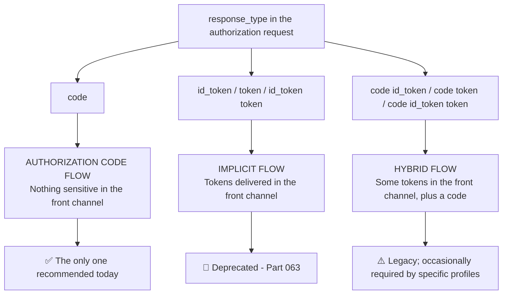
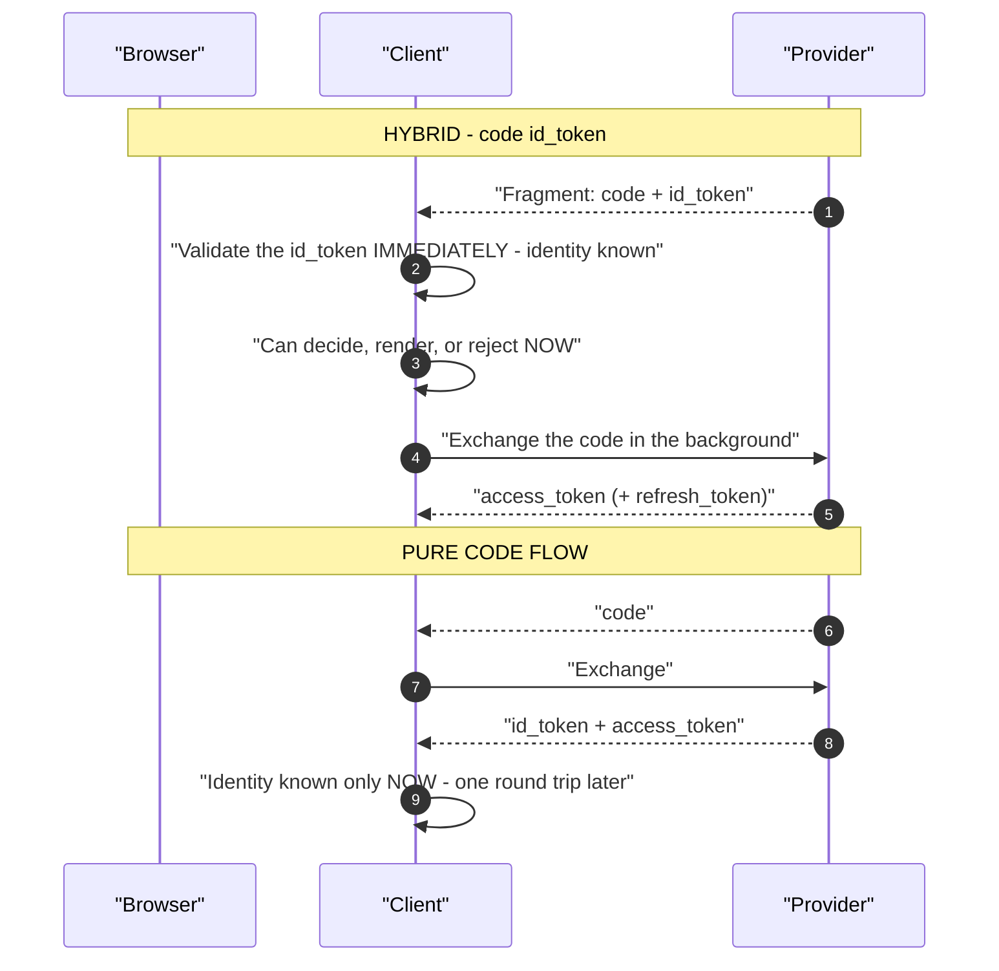
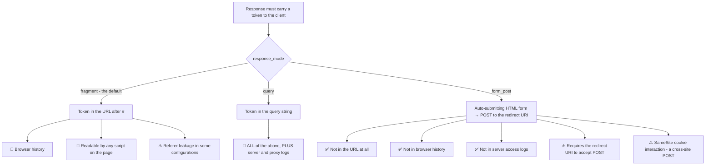
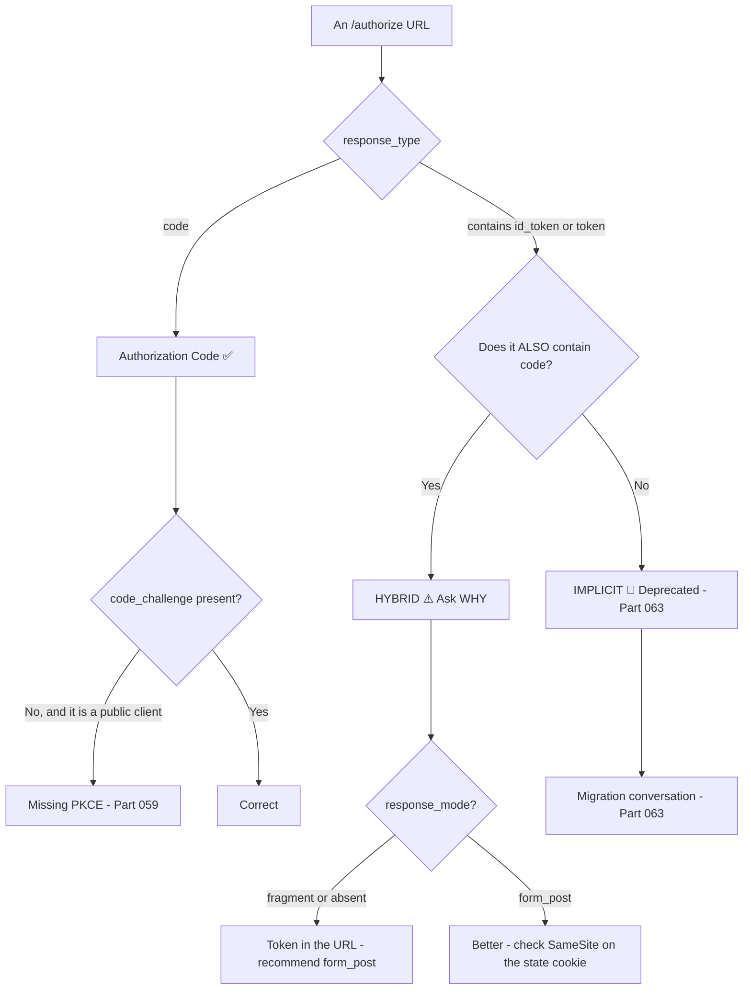
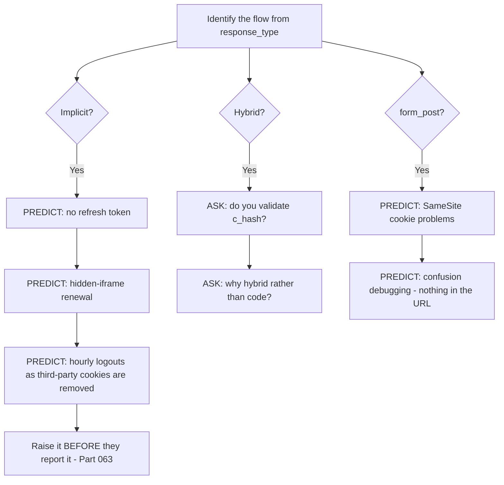
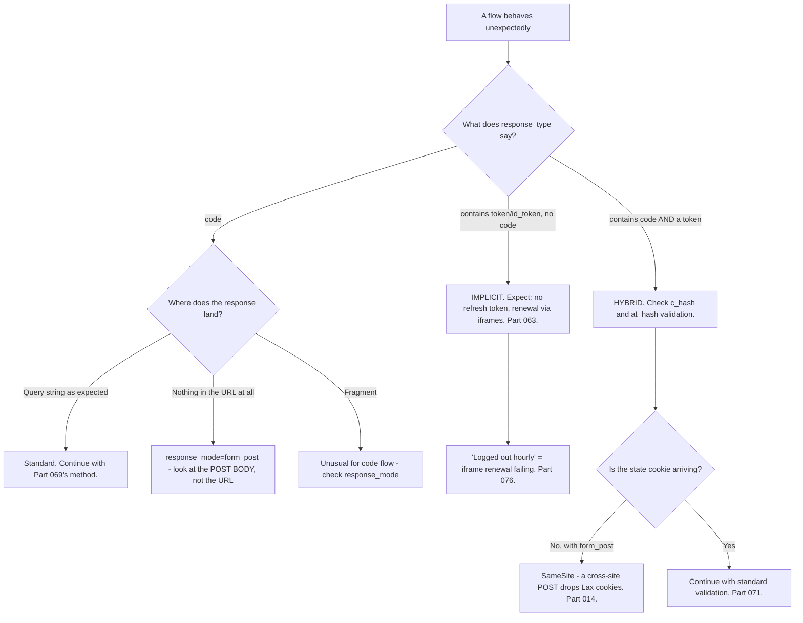

# Part 072 - OIDC Flows, response_type, and response_mode

> Section goal: Understand every flow variant OIDC defines, what each returns and where, and which are still appropriate. `response_type` is the parameter that determines the entire shape of a flow, and reading it correctly is a five-second diagnosis.

Covers index item **072**. Maps to JD signals: *knowledge of OIDC*, *knowledge of OAuth*, *basic security concepts*, *strong analytical and problem-solving skills*, and *experience with troubleshooting web applications*.

---

## 1. Start From Zero: `response_type` Decides Everything

| `response_type` | Flow | Returns via the front channel |
|---|---|---|
| **`code`** | Authorization Code | A code only |
| `id_token` | Implicit (OIDC) | An ID token |
| `token` | Implicit (OAuth) | An access token |
| `id_token token` | Implicit | Both tokens |
| `code id_token` | Hybrid | A code **and** an ID token |
| `code token` | Hybrid | A code **and** an access token |
| `code id_token token` | Hybrid | A code and both tokens |

**The reading rule:** anything containing `token` or `id_token` puts a **token in the front channel**. Only `code` alone does not.

> **Analogy.** Choosing whether to send a collection slip, the goods themselves, or both through the post. The slip is worthless if intercepted; the goods are not.
>
> **Where it stops:** goods can be insured and traced. A token in a URL is copied silently, and nothing records that it happened.

---

## 2. The Three Flows

### Authorization Code (`response_type=code`)

Covered fully in Part 058. **The only recommended flow.**

| Property | Detail |
|---|---|
| Front channel carries | A short-lived, single-use code |
| Tokens issued via | The back channel |
| PKCE | ✅ Required (Part 059) |
| Suits | Everything — SPAs, mobile, server-side |

### Implicit (`response_type=id_token` / `token` / `id_token token`)

Deprecated (Part 063). Tokens arrive in the **URL fragment**.

| Property | Detail |
|---|---|
| Front channel carries | **Tokens** |
| Token endpoint | Not used |
| Refresh token | ❌ Never issued |
| PKCE | ❌ Not applicable — there is no code |
| Status | 🔴 Removed in OAuth 2.1 (Part 066) |

### Hybrid (`response_type=code id_token`, etc.)

A code **plus** at least one token in the front channel.

| Property | Detail |
|---|---|
| Front channel carries | A code, plus an ID token and/or access token |
| Purpose | The client can validate identity **before** the exchange completes |
| Used by | Some enterprise and financial profiles |
| Status | ⚠️ Legacy; the code flow is preferred |

### 🔍 Plain-English deep-dive: why hybrid existed, and why it mostly does not need to now

Hybrid solves a real problem, and understanding it prevents both dismissing it and over-recommending it.

**The problem it addressed:** in the pure code flow, the client learns nothing about the user until the back-channel exchange completes. For an application wanting to make a decision — render something, choose a redirect, reject an unauthorised user — that round trip is dead time.

**`code id_token` returns an ID token immediately** alongside the code, so the client can validate identity in the front channel and proceed while the exchange happens.

**Why the justification has weakened:**

| Original reason | Current position |
|---|---|
| Avoid a round trip before knowing the user | A single back-channel call is fast; the saving is small |
| Front-channel ID token enables early decisions | Rarely worth putting a token in a URL |
| Some profiles mandated it | ✅ **Still true** — certain financial and enterprise profiles require `code id_token` |

**The cost is unchanged and real:** an ID token in the URL fragment appears in browser history, is readable by any script on the page, and can leak via `Referer` in some configurations — all of Part 063's implicit problems, applied to the identity token.

**And there is a specific mitigation hybrid brings that is worth knowing:** the ID token returned in a hybrid flow can carry a **`c_hash`** claim — a hash of the authorization code — so the client can verify that the code and the ID token came from the same response. Similarly **`at_hash`** binds an access token. **Those exist precisely because putting things in the front channel creates a binding problem that the code flow does not have.**

**The practical position:** if a customer is on hybrid because a profile requires it, that is legitimate and they should be validating `c_hash`. If they are on it because a tutorial used it, the code flow with PKCE is simpler and safer.

**The diagnostic question:** *"What made you choose `code id_token` rather than `code`?"* — a specific compliance profile is a good answer; anything else usually means it was copied.

**Analogy:** being handed both a receipt and a sample at the counter so you can check the goods before collection. Useful in a trade that requires it, and it means the sample is now out in the open. **Where it stops:** a sample is a small part of the order. An ID token in the front channel is the whole identity assertion.

---

## 3. `response_mode`

Where the response is delivered.

| `response_mode` | Delivery | Notes |
|---|---|---|
| **`query`** | `?code=...` | Default for `response_type=code` |
| **`fragment`** | `#access_token=...` | Default when tokens are returned. **Not sent to servers** |
| **`form_post`** | An auto-submitting HTML form POSTing to the redirect URI | ✅ **Keeps values out of the URL** |
| `web_message` | `postMessage` to a parent window | Used by some SDKs for silent auth |

### 🔍 Plain-English deep-dive: `form_post` is the underused option

When a flow must return a token or an ID token via the front channel — a hybrid flow required by a profile, for example — `response_mode=form_post` removes most of the URL-exposure problem.

**The gain is substantial and the costs are specific:**

| Cost | Detail |
|---|---|
| The redirect URI must accept **POST** | A route change, usually small |
| **`SameSite` interaction** | A cross-site POST does **not** carry `SameSite=Lax` cookies (Part 014) — so any state cookie the callback needs must be `SameSite=None; Secure` or stored differently |
| Slightly more complex to debug | The response is a form body rather than a visible URL |

**That middle row is the one that catches people**, and it produces a distinctive symptom: the flow works, the POST arrives, and the callback cannot find its `state` — because the cookie holding it was not sent on a cross-site POST. **The fix is either `SameSite=None; Secure` on that specific cookie, or keying state through a mechanism that does not depend on it.**

**Where `form_post` is genuinely valuable:**

| Situation | Why |
|---|---|
| A hybrid flow mandated by a profile | Keeps the front-channel token out of the URL |
| Any flow returning an ID token in the front channel | Same |
| Environments with aggressive URL logging | Removes the exposure entirely |
| Long responses | Avoids URL length limits |

**And where it is not needed:** a pure code flow returning only a code. A code is already short-lived and single-use, so the URL exposure is bounded — `form_post` adds complexity for little gain.

**The support-facing version:** if a customer must use hybrid, recommending `form_post` alongside it is a concrete improvement that costs them one route change — and it is the kind of specific, proportionate suggestion that distinguishes useful advice from general principles.

**Analogy:** handing something over in an envelope rather than holding it up at the counter. The transaction is identical; the exposure is not. **Where it stops:** an envelope needs someone to open it. A `form_post` needs the receiving route to accept POST and to still have its cookies — which is where the `SameSite` wrinkle comes in.

---

## 4. Reading a Flow From Its Parameters

**Three parameters give you the whole shape:** `response_type` (which flow), `response_mode` (where it lands), and `code_challenge` (whether PKCE is present).

### 🔍 Plain-English deep-dive: what each flow implies about everything else

Once you have identified the flow, a set of consequences follows automatically. **Knowing them means you can predict a customer's other problems before they report them** — which is one of the most useful things a support engineer can do.

| If the flow is… | Then you can expect… |
|---|---|
| **Code + PKCE** | Refresh tokens available · no front-channel exposure · standard debugging applies |
| **Implicit** | **No refresh token** · iframe silent renewal · **third-party cookie breakage** · tokens in history |
| **Hybrid** | `c_hash`/`at_hash` obligations · front-channel exposure · possibly `form_post` and its cookie caveat |
| **`form_post` anywhere** | Cross-site POST · **`SameSite` cookie issues** · nothing visible in the URL when debugging |

**The implicit branch is the highest-value prediction.** A customer on implicit who has not yet reported logout problems will, and saying so early — *"before you hit it, this flow has no refresh token and relies on a mechanism browsers are removing"* — converts a future incident into a planned migration.

**The hybrid branch is the highest-value question.** Asking whether they validate `c_hash` frequently reveals that they do not, and that is a real finding they will not have looked for.

**And the `form_post` branch saves time on the ticket in front of you**, because a customer debugging a `form_post` flow by staring at the URL will report "nothing comes back" — which is true and misleading.

**Why this is worth practising:** most support is reactive, and this is a small, cheap way to be proactive. **One glance at `response_type` gives you three things to raise that nobody asked about**, and each is genuinely useful rather than speculative.

**Analogy:** a mechanic recognising a model with a known weakness and checking it while the car is already on the ramp. Same visit, more value. **Where it stops:** a mechanic can see the whole car. You see one authorization URL — which is why knowing what each flow *implies* is doing so much work.

---

## 5. Failure Modes

| Failure mode | What it looks like | Consequence | Correction |
|---|---|---|---|
| **Implicit still in use** | Tokens in the fragment | 🔴 Deprecated; renewal breaking | Migrate (Part 063) |
| **Hybrid copied from a tutorial** | `code id_token` with no reason | Unnecessary front-channel exposure | Use `code` |
| **Hybrid without `c_hash` validation** | Works | 🔴 Code and ID token not bound | Validate `c_hash` |
| **`at_hash` not validated** | Works | Access token not bound to the ID token | Validate it |
| **Fragment mode with tokens** | Default behaviour | URL exposure | `form_post` |
| **`form_post` without `SameSite=None`** | POST arrives, state missing | Confusing failure | Fix the cookie or the storage |
| **Redirect URI does not accept POST** | `form_post` fails | 405 or a blank page | Add the route |
| **`response_type=token` on a SPA** | "It works" | 🔴 Implicit; no refresh token | Code + PKCE |
| **Assuming `response_mode` is configurable everywhere** | Provider ignores it | Unexpected delivery | Check discovery (Part 057) |
| **Debugging `form_post` as if it were a redirect** | Nothing in the URL | Wasted time | It is a POST body |

---

## 6. Troubleshooting Decision Tree: Flow Shape Problems

### Worked example

*"We use `form_post` and the callback gets the response, but it says 'invalid state' every time."*

1. **The response arriving means `form_post` is working.** The failure is after delivery, so it is not a flow-shape problem.
2. **"Invalid state" with `form_post` specifically** points at cookies, because that combination is distinctive.
3. **Confirm the mechanism.** `form_post` delivers via a **cross-site POST** from the provider's domain to theirs. A cookie with `SameSite=Lax` is **not** sent on a cross-site POST — only on top-level GET navigations (Part 014).
4. **So the state cookie is absent**, the callback cannot find the stored value, and validation fails correctly.
5. **Two fixes, and the choice depends on their setup:** set `SameSite=None; Secure` on that specific cookie, or store `state` server-side keyed by something that survives — noting that the whole point of `state` is that it round-trips, so the cookie approach is usually simpler.
6. **Recommend the narrower change.** `SameSite=None` on *one* short-lived flow cookie, not on the session cookie — scoping it that tightly limits the CSRF exposure the attribute reintroduces.
7. **Explain why it worked in development.** Same-site there, cross-site in production — the same environment-difference pattern as Part 058's scheme mismatch.
8. **Note the direction of travel** honestly: third-party cookie restrictions are tightening (Part 017), so a design depending on `SameSite=None` deserves review. If they are on hybrid only because it was copied, moving to the code flow removes the need for `form_post` entirely.

---

## 7. Lab: Every Flow Shape

**Purpose.** Run each flow variant, observe exactly what lands where, and reproduce the `form_post` cookie problem.

**Prerequisites.** Parts 014, 021, 058, 063, 070 artifacts. A free Auth0 tenant with a test application permitting multiple response types.

**Steps.**

1. Create `okta-prep/labs/072-flows/`.
2. **Check what is supported.** Read `response_types_supported` and `response_modes_supported` from discovery (Part 057). **Record both.**
3. **Run `response_type=code`.** Capture a HAR. **Record where the code appears.**
4. **Run `response_type=id_token`.** Capture a HAR. **Record where the ID token appears** and confirm the token endpoint was never called.
5. **Run `response_type=id_token token`.** Record both tokens' location.
6. **Run `response_type=code id_token`** — hybrid. **Record what arrives in the fragment and what comes from the exchange.**
7. **Find `c_hash`.** Decode the hybrid ID token and locate `c_hash`. **Then compute it yourself** from the code (Part 040) and confirm it matches. **This is the binding, verified by hand.**
8. **Find `at_hash`** similarly and verify it against the access token.
9. **Break the binding.** Present a hybrid ID token alongside a **different** code. **Confirm whether your client detects it** — if it does not validate `c_hash`, it will not.
10. **`response_mode=form_post`.** Run a hybrid flow with it. **Capture the HAR and confirm nothing appears in the URL.** Find the values in the POST body.
11. **Reproduce the cookie failure.** Set your state cookie to `SameSite=Lax` and run `form_post` cross-site. **Confirm the cookie is not sent** and record the resulting error.
12. **Fix it** with `SameSite=None; Secure` on that cookie only. Confirm it works, and **note what you did not change** — the session cookie.
13. **Browser history contrast.** After a fragment-mode flow and a `form_post` flow, **check browser history for each.** Screenshot the difference.
14. **Build the flow reader.** Extend Part 058's parser to report: which flow, whether a token is in the front channel, `response_mode`, and whether PKCE is present.
15. **Write the guidance.** `flow-shapes.md` — one page: the three flows, what each returns where, when hybrid is legitimate, and the `form_post` cookie caveat.
16. **Failure catalog + manifest.** Complete `MANIFEST.md`.

**Expected evidence.** A supported-types record, four flows captured with delivery locations, a hand-verified `c_hash` and `at_hash`, a broken-binding test, a `form_post` flow with values found in the body, a reproduced-then-fixed `SameSite` failure, a browser history contrast, an extended flow reader, and one-page guidance.

**Validation rubric.**

| Check | Pass condition |
|---|---|
| Supported types | Recorded from discovery |
| Four flows | Delivery location recorded for each |
| `c_hash` | Computed by hand and matched |
| `at_hash` | Verified |
| Binding break | Detection behaviour recorded |
| `form_post` | Nothing in the URL; values in the body |
| `SameSite` failure | Reproduced, then fixed narrowly |
| History contrast | Screenshotted |
| Flow reader | Reports all four properties |

**Cleanup and privacy.** Lab tenant, synthetic users, localhost or a domain you control. **Disable implicit and hybrid response types on the application at the end** — leaving them enabled is the Part 063 failure mode. Clear browser history from the fragment-mode runs. Revoke tokens.

---

## 8. JD Mapping

| Supplied JD signal | How this Part supports it |
|---|---|
| **Knowledge of OIDC** | Every flow variant and its response shape |
| Knowledge of OAuth | The shared `response_type` mechanism |
| **Basic security concepts** | Front-channel exposure; `c_hash` binding |
| Strong analytical and problem-solving skills | Three parameters give the whole flow shape |
| **Experience troubleshooting web applications** | `form_post` and `SameSite` interaction |
| Promote best practices | Recommending `form_post` where hybrid is mandated |
| Communicate technical concepts clearly | Explaining why it worked in development |

---

## 9. Candidate Honesty Note

- **Claim safety:** *Learned architecture and lab experience.*
- **The strongest thing you can say:** *"`response_type` determines the entire flow shape, and the reading rule is simple: anything containing `token` or `id_token` puts a token in the front channel. Only `code` alone doesn't. Three parameters give you the whole picture — `response_type` for which flow, `response_mode` for where it lands, and `code_challenge` for whether PKCE is present."*
- **A second point, on hybrid:** *"Hybrid solved a real problem — the client learns nothing about the user until the back-channel exchange completes, so `code id_token` returns identity immediately. That justification has weakened because a single back-channel call is fast, but some financial and enterprise profiles still mandate it. So the question I'd ask is 'what made you choose `code id_token` rather than `code`?' A specific compliance profile is a good answer; anything else usually means it was copied."*
- **A third, and it is a genuine detail:** *"Hybrid ID tokens carry `c_hash` — a hash of the authorization code — so the client can verify that the code and the ID token came from the same response. That exists precisely because putting things in the front channel creates a binding problem the code flow doesn't have. A customer on hybrid who isn't validating `c_hash` has the exposure without the mitigation."*
- **A fourth, a proportionate recommendation:** *"If someone must use hybrid, `response_mode=form_post` keeps the token out of the URL entirely — no browser history, no server logs. It costs one route change to accept POST. That's a concrete improvement rather than a general principle."*
- **A fifth, diagnostic:** *"'`form_post` works but state is always invalid' is a `SameSite` problem — it's a cross-site POST, so a `Lax` cookie isn't sent. The fix is `SameSite=None; Secure` on that one short-lived flow cookie, not on the session cookie, so the CSRF exposure stays scoped."*
- **A sixth, on debugging:** *"With `form_post` there's nothing in the URL, so people debug it as if it were a redirect and find nothing. The values are in the POST body."*
- **Do not overstate:** you have not supported hybrid deployments. Say you have run every response type and verified the hash bindings by hand in a lab.

---

## 10. Official Source Anchors

Accessed **26 August 2026**.

| Source | What it defines |
|---|---|
| OpenID Connect Core §3.1, §3.2, §3.3 | Code, implicit, and hybrid flows |
| OpenID Connect Core §3.3.2.11 | `c_hash` computation and validation |
| OpenID Connect Core §3.2.2.9 | `at_hash` computation and validation |
| OAuth 2.0 Multiple Response Type Encoding Practices | The `response_type` value space |
| OAuth 2.0 Form Post Response Mode | `response_mode=form_post` |
| IETF RFC 6265bis | `SameSite` and cross-site POST behaviour (Part 014) |
| OAuth 2.0 Security BCP | Front-channel exposure and flow recommendations |
| Auth0 and Okta documentation — supported response types | Vendor support |

**Revalidate after 26 August 2026:** the specifications are stable. Recheck vendor support for hybrid and `form_post`, and browser `SameSite` behaviour.

---

## ⭐ Likely Interview Questions for This Section

### Q1. "What does `response_type` control?"
> *Model answer:* "The entire shape of the flow — which flow it is, and what comes back through the front channel. `code` alone is the authorization code flow, where only a short-lived single-use code travels through the browser. Anything containing `token` or `id_token` without a code is implicit, which puts actual tokens in the URL fragment and is deprecated. Anything containing a code *and* a token is hybrid. The reading rule is that simple: if `response_type` contains `token` or `id_token`, a token is going through the front channel. Together with `response_mode` for where it lands and `code_challenge` for whether PKCE is present, three parameters tell you the whole shape of a flow in about five seconds."

### Q2. "When is the hybrid flow appropriate?"
> *Model answer:* "When a specific profile mandates it — some financial and enterprise conformance profiles require `code id_token`. The original justification was that in a pure code flow the client learns nothing about the user until the back-channel exchange completes, so returning an ID token immediately lets it validate identity and make decisions without waiting. That's weakened, because one back-channel call is fast and the saving rarely justifies putting an identity token in a URL. So my question would be what made them choose it — a named compliance profile is a good answer, and anything else usually means it was copied from an example. If they are on it legitimately, the follow-up is whether they validate `c_hash`, because that's the mitigation the flow comes with."

### Q3. "What is `c_hash`?"
> *Model answer:* "A claim in a hybrid-flow ID token containing a hash of the authorization code, so the client can verify that the code and the ID token arrived in the same response and belong together. It exists because the hybrid flow creates a binding problem that the pure code flow doesn't have — with both a code and an ID token in the front channel, an attacker could potentially substitute one. `at_hash` does the same for an access token returned in the front channel. The practical point for support is that a customer using hybrid without validating `c_hash` has taken on the exposure of front-channel delivery without the mitigation designed for it, and validating it is a small addition."

### Q4. "What's `response_mode=form_post` and when would you recommend it?"
> *Model answer:* "It delivers the authorization response as an auto-submitting HTML form that POSTs to the redirect URI, rather than putting values in the URL. That means nothing in the browser address bar, nothing in browser history, and nothing in server access logs — which matters whenever a token or ID token must travel through the front channel. I'd recommend it specifically to anyone stuck on hybrid because a profile requires it: it costs one route change to accept POST and removes most of the URL exposure. For a pure code flow returning only a code I wouldn't bother, because a code is already short-lived and single-use, so it's complexity for little gain."

### Q5. "A customer uses `form_post` and gets 'invalid state' every time. Why?"
> *Model answer:* "`SameSite`. `form_post` delivers via a cross-site POST from the provider's domain to theirs, and a cookie with `SameSite=Lax` isn't sent on a cross-site POST — only on top-level GET navigations. So the cookie holding `state` never arrives, the callback can't find the stored value, and validation fails correctly. The fix is `SameSite=None; Secure` on that specific short-lived flow cookie — and I'd be explicit about scoping it to that cookie rather than the session cookie, so the CSRF exposure the attribute reintroduces stays narrow. It also explains why it worked in development, where everything was same-site. And I'd note the direction of travel: third-party cookie restrictions are tightening, so a design depending on `SameSite=None` deserves review."

### Q6. "How do you spot which flow an application is using?"
> *Model answer:* "Read the `/authorize` URL. `response_type=code` is the code flow. `response_type=id_token` or `token` or `id_token token` is implicit — deprecated, and I'd expect the associated symptoms: no refresh token and renewal via hidden iframes that third-party cookie changes are breaking. Anything with both a code and a token is hybrid. Then `response_mode` tells me where the response lands, and if it's `form_post` I need to look at the POST body rather than the URL — which trips people up, because they debug it as a redirect and find nothing. And `code_challenge` tells me whether PKCE is in play. I've extended my URL parser to report all four, because it's the first thing I want from any HAR."

### Q7. "Why is a token in the URL fragment a problem if fragments aren't sent to servers?"
> *Model answer:* "Because 'not sent to servers' is a narrower protection than it sounds. The fragment is still in the browser's address bar and therefore in history, which persists after the tab closes. It's readable by any script running on the page, including a compromised dependency. And in some browser and configuration combinations it can leak via `Referer`. So the server-log exposure is avoided and the client-side exposure is complete — which is the more relevant one for a browser application, since XSS is the realistic threat. It's a good illustration of why the implicit flow's original safety argument didn't survive scrutiny: the fragment protects against one leak path while leaving the others open."

### Q8. "Should anyone still be using implicit?"
> *Model answer:* "No, and the argument that actually moves people isn't the deprecation. Implicit issues no refresh token, so applications kept sessions alive with hidden-iframe silent authentication — and browsers are removing the third-party cookies that depends on. So implicit applications increasingly can't renew tokens at all, and the symptom is users being logged out hourly with nothing the customer can change. That's a deadline they don't control, which is far more persuasive than 'the spec says not to.' The migration to code plus PKCE is mostly small — change `response_type`, add PKCE, adjust the application type — and the real work is replacing iframe renewal with refresh-token rotation, which I'd name up front rather than calling it a config change."

---

## 🧠 30-Second Memory Hooks

- **`response_type` decides the flow.** Contains `token` or `id_token` → **a token in the front channel**.
- **`code` alone = authorization code flow.** The only one recommended.
- **`id_token` / `token` / `id_token token` = IMPLICIT.** Deprecated.
- **`code` + a token = HYBRID.** Legitimate only when a **profile mandates it**.
- **Hybrid ID tokens carry `c_hash`** (binds the code) and **`at_hash`** (binds the access token). **Validate them.**
- **Three parameters give the whole shape:** `response_type` · `response_mode` · `code_challenge`.
- **`response_mode`:** `query` · `fragment` · **`form_post`** · `web_message`.
- **`form_post` keeps tokens OUT of the URL** — no history, no server logs. Costs one POST route.
- **`form_post` + `SameSite=Lax` = "invalid state" every time.** A cross-site POST drops `Lax` cookies.
- **Fix narrowly:** `SameSite=None; Secure` on that **one flow cookie**, not the session cookie.
- **Debugging `form_post`? Look at the POST BODY, not the URL.**
- **Fragments are not sent to servers — and are in history and readable by script.**

---

## ✅ Completion Checklist

- [ ] **Knowledge:** I can read any `response_type`, name the three flows, and explain `c_hash`.
- [ ] **Lab artifact:** `072-flows/` contains four flows captured, a hand-verified `c_hash`, a `form_post` run with values in the body, a reproduced-then-fixed `SameSite` failure, and an extended flow reader.
- [ ] **Spoken:** I can read a flow from its parameters in 30 seconds and explain the `form_post` cookie problem in 45.
- [ ] **Judgement:** I ask *why* hybrid was chosen before recommending against it, and I scope the `SameSite` change narrowly.
- [ ] **Honesty check:** I say "every response type run in a lab."
- [ ] **Source check:** I have read OIDC Core §3.3 and the Form Post Response Mode specification myself.

---

*Next suggested section:* **[Part 073 - UserInfo, Scopes, and Claim Mapping](Part-073-userinfo-scopes-and-claim-mapping.md)** — where profile data actually comes from, and how to choose between the ID token and a live lookup.
