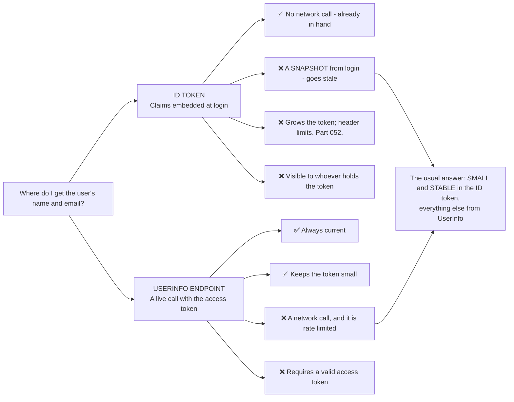
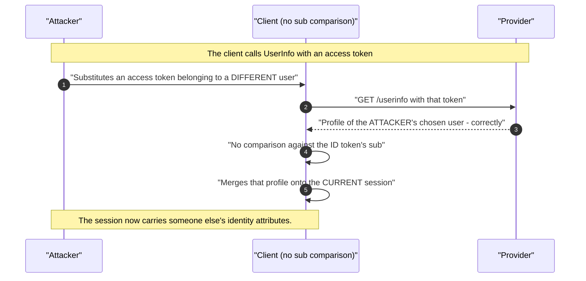
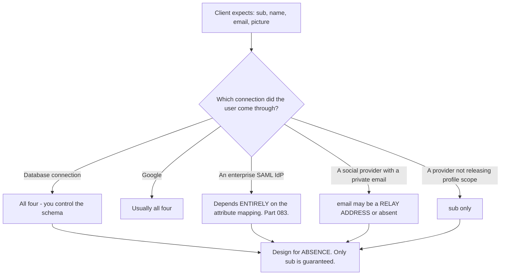
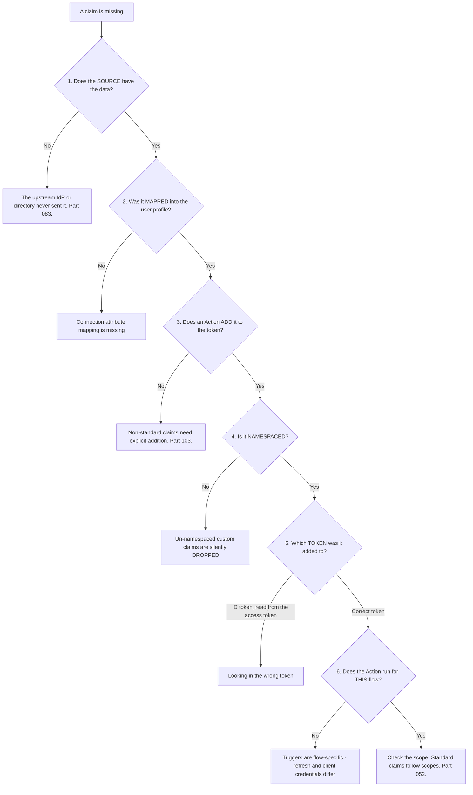
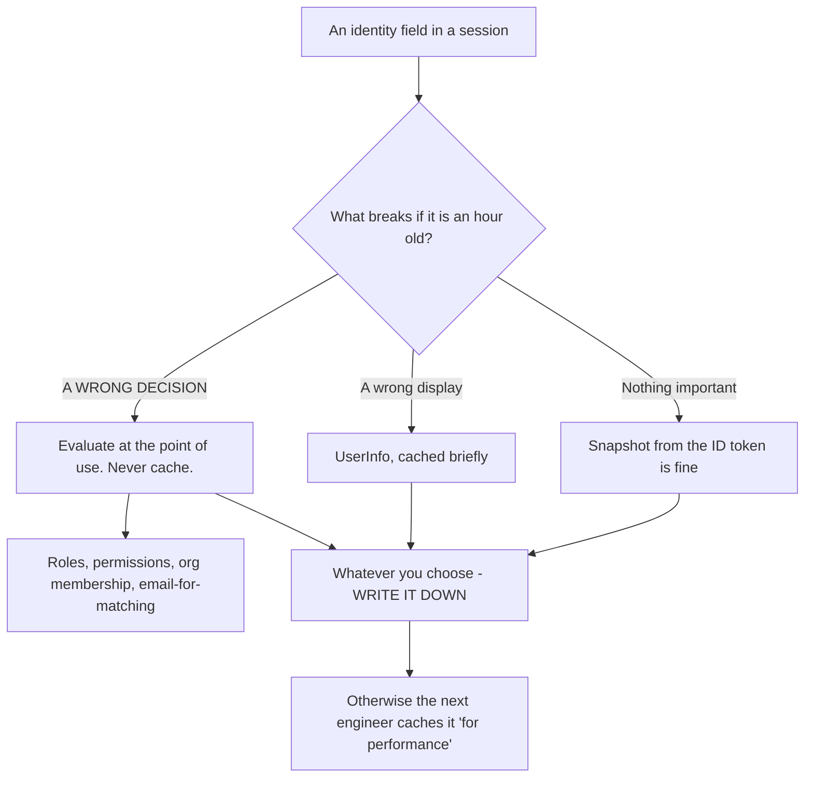
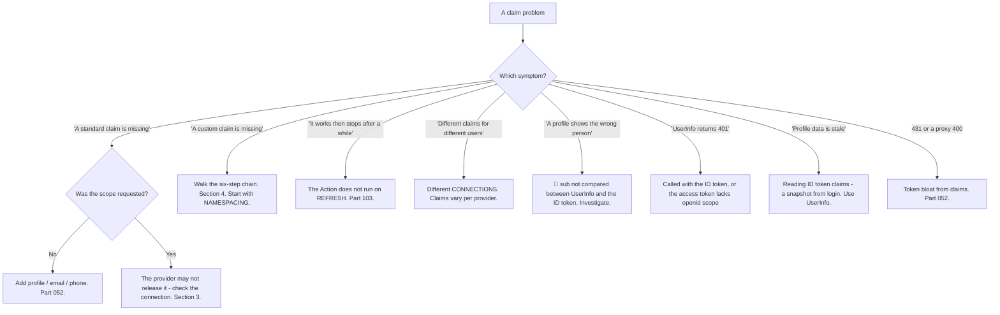

# Part 073 - UserInfo, Scopes, and Claim Mapping

> Section goal: Understand where profile data actually comes from, how to choose between the ID token and a live lookup, and how claims get shaped, renamed, and lost between systems. Missing or wrong claims are a steady, high-volume ticket category.

Covers index item **073**. Maps to JD signals: *knowledge of OIDC*, *strong analytical and problem-solving skills*, *experience with troubleshooting web applications*, *communicate technical concepts clearly*, and *basic security concepts*.

---

## 1. Start From Zero: Two Sources of Profile Data



| Need | Source |
|---|---|
| `sub` — the identity | **ID token**, always |
| A display name for the header | ID token — a stale name is harmless |
| Email for account matching | ID token, **with `email_verified`** (Part 071) |
| Anything that changes often | **UserInfo** |
| Anything large or sensitive | **UserInfo**, or an application API |
| Group or role membership | Usually a custom claim or an API — not standard OIDC |

> **Analogy.** A membership card printed with your name versus a phone call to the office. The card is instant and reflects the day it was printed; the call is current and costs a moment.
>
> **Where it stops:** you can see a card is old. A stale claim in a session looks identical to a fresh one, which is why the choice has to be deliberate.

---

## 2. The UserInfo Endpoint

```http
GET /userinfo HTTP/1.1
Host: tenant.us.auth0.com
Authorization: Bearer <access token>
```

```json
{ "sub": "auth0|abc123", "name": "Test User", "email": "user@example.com", "email_verified": true }
```

| Property | Detail |
|---|---|
| Location | `userinfo_endpoint` from discovery (Part 057) |
| Authentication | The **access token** — not the ID token |
| Requires | The `openid` scope on the original request |
| Returns | Claims for the scopes that were granted |
| **`sub` is mandatory** | And **must** be compared against the ID token's `sub` |
| Rate limited | ✅ Yes — cache briefly per user |

### 🔍 Plain-English deep-dive: the `sub` comparison nobody makes

OIDC Core requires that the `sub` returned by UserInfo be compared against the `sub` in the ID token, and **implementations almost never do it.**

**The attack it prevents:**



**Why it is easy to miss:** UserInfo behaves perfectly. It returns the profile for whichever token it was given, which is exactly correct. **The error is entirely on the client side** — assuming that the profile it receives corresponds to the user it just authenticated.

**The check is one line:** `if (userinfo.sub !== idToken.sub) reject`.

**Where this becomes exploitable in practice** is anywhere access tokens and ID tokens can become mismatched: a client that caches tokens badly, a multi-tab race, token substitution through an XSS or a compromised dependency, or a backend that pools access tokens across sessions. **None of those is exotic**, and each one turns a missing comparison into a real identity mix-up.

**The related discipline** is deciding *which* source wins when claims differ. If the ID token says one email and UserInfo says another — which is legitimate, because UserInfo is fresher — the application needs a stated rule rather than whichever assignment ran last.

**The support-facing tell:** a customer reporting that a user's profile occasionally shows someone else's name or email. **That is not a provider bug** and it is worth asking directly whether they compare `sub`.

**Analogy:** phoning the office to confirm a member's details and not checking that the answer is about the person standing in front of you. The office answered correctly; the question was ambiguous. **Where it stops:** a person would notice a wildly different name. An application merging fields notices nothing.

---

## 3. Claims Are Not Guaranteed

A recurring source of tickets: **OIDC does not require a provider to return any particular optional claim.**

| Reality | Consequence |
|---|---|
| Only `sub` is guaranteed | Everything else may be absent |
| `email` may be missing entirely | Some social providers do not release it |
| `name` may be missing or be a username | Display logic must degrade |
| `email_verified` may be absent | Absent is **not** the same as `true` (Part 071) |
| Claims vary **per connection** | The same user via two connections gives different claims |
| Providers may return **extra** claims | Do not assume the documented set is exhaustive |



**The design rule:** treat every claim except `sub` as optional, and decide what the application does when each is missing. **An application that renders a blank name is better than one that throws.**

---

## 4. Custom Claims and Mapping

Getting non-standard data — roles, organisation, tenant — into a token.

| Mechanism | Where |
|---|---|
| **Actions / Rules / Hooks** | Add claims at token issuance (Part 103) |
| **Namespacing** | Auth0 requires a URI-like namespace for non-standard claims (Part 052) |
| **SAML attribute mapping** | Enterprise connections map assertion attributes to claims (Part 083) |
| **Scopes to claims** | Standard scopes release standard claims (Part 052) |
| **UserInfo enrichment** | Some providers allow custom claims in the UserInfo response |

### 🔍 Plain-English deep-dive: where a claim gets lost, in order

"The claim isn't there" is a common ticket with a fixed set of possible causes. **Walking them in order resolves it quickly**, and the order matters because each step depends on the previous one.



**Six steps, and each has a distinct fix.** The value is that they are checkable in order and most tickets stop at step 4 or 5.

**Step 4 is the most common by a wide margin.** Un-namespaced custom claims are dropped **silently** — no error, no warning, nothing in a log. A developer adds `roles` to a token, sees nothing, and concludes the Action did not run. **Asking "is it namespaced?" resolves it in seconds** and the namespacing rule is worth explaining rather than just stating: it exists so custom claims cannot collide with standard OIDC claim names.

**Step 6 catches a subtler case.** Actions are trigger-specific. An Action adding a claim on login does **not** run on a refresh-token exchange or a client-credentials request — so the claim is present on first login and absent after a silent refresh. **The symptom is "it works, then stops working after a while,"** which sounds like expiry and is not.

**Step 1 is the one that requires a different conversation.** If an enterprise IdP simply is not sending an attribute, no amount of configuration on the receiving side creates it — and that means going back to the customer's identity team (Part 083). **Establishing this early prevents days of configuration changes on the wrong side.**

**The question that starts the whole walk:** *"Show me the raw assertion or the decoded token — what attributes are actually present?"* That answers steps 1 and 2 together.

**Analogy:** a missing item in a delivery. Was it in stock, was it picked, was it packed, was it labelled correctly, was it put on the right van, and did that van run today. Six checks, in order, each cheap. **Where it stops:** a warehouse has a paper trail at each step. Here several steps fail silently, which is why the order has to be walked rather than guessed.

---

## 5. Caching and Freshness

| Data | Cache for |
|---|---|
| ID token claims | The life of the session — they are a snapshot by design |
| UserInfo response | **Briefly**, per user — it is rate limited and it is personal data |
| Roles and permissions | ⚠️ Carefully — stale authorisation is a security issue (Part 046) |

**Two cautions worth stating:**

**Caching UserInfo means storing personal data.** Wherever that cache lives is now in scope for privacy obligations (Part 006). A short TTL limits both staleness and exposure.

**Never cache authorisation data as if it were profile data.** A cached role that has been revoked is a live over-permission. Authorisation should be evaluated per request (Part 051).

### 🔍 Plain-English deep-dive: "stale" is a design decision, not an accident

Every piece of identity data an application holds has an implicit freshness contract, and almost nobody states it. **Making it explicit turns a class of confusing bugs into a documented choice.**

Three questions per field:

1. **How stale can this be before it is wrong?**
2. **What happens if it is stale?**
3. **What refreshes it, and when?**

| Field | Acceptable staleness | If stale | Refresh trigger |
|---|---|---|---|
| Display name | Days | A slightly wrong greeting | Next login, or on demand |
| Avatar | Days | An old picture | Next login |
| Email (for display) | Hours | Wrong address shown | Next login |
| **Email (for matching)** | 🔴 **Zero** | **Wrong account matched** | Must be verified at use |
| **Roles / permissions** | 🔴 **Seconds** | **Over-permission after revocation** | Per request |
| Organisation membership | Minutes | Wrong tenant context | Per session, or per request |
| Locale / preferences | Days | Minor UX oddity | Next login |



**The bottom box is the point.** A field with no stated freshness contract will eventually be cached by someone optimising a slow page, and if that field was authorisation-adjacent, a performance improvement has silently become a security regression. **Nothing in a code review flags it**, because caching a value that is already in a session object looks entirely reasonable.

**The row that produces real incidents is roles.** A customer revokes an admin role and reports that the user still has admin access. It is not the Part 045 token gap — it is a role cached in the application's session, refreshed only at login. **The distinguishing question is whether a *fresh* login restores correct behaviour:** if yes, it is a cache; if no, it is the token.

**And the email row is worth separating explicitly**, because the same field has two contracts depending on use. Displaying a stale email is harmless; *matching* on one is Part 053's takeover path. **Same data, entirely different tolerance.**

**The support-facing version:** when something "still shows the old value," ask what refreshes that field and when. **Most applications cannot answer**, and the inability to answer is itself the finding.

**Analogy:** a printed staff directory. Fine for finding someone's desk, disastrous for deciding who may enter the server room. Same data, two contracts, and only one of them tolerates being a week old. **Where it stops:** a directory is visibly dated. A field in a session object carries no timestamp at all unless someone put one there.

---

## 6. Failure Modes

| Failure mode | What it looks like | Consequence | Correction |
|---|---|---|---|
| **`sub` not compared** | Works fine | 🔴 Identity mix-up under token mismatch | One-line comparison |
| **Assuming claims are guaranteed** | Works with one connection | Breaks on another | Only `sub` is guaranteed |
| **Un-namespaced custom claim** | Silently dropped | "The Action didn't run" | Namespace it |
| **Action not running for the flow** | Works, then stops | Confusing intermittency | Triggers are flow-specific |
| **Reading a claim from the wrong token** | Missing | Wasted investigation | Check which token it was added to |
| **`email_verified` absent treated as true** | Works fine | 🔴 Takeover vector (Part 071) | Absent ≠ true |
| **UserInfo called on every request** | Slow; rate limited | Latency, throttling | Cache briefly |
| **UserInfo cached indefinitely** | Stale profiles; PII at rest | Privacy and correctness | Short TTL |
| **Roles cached as profile data** | Revocation has no effect | 🔴 Over-permission | Evaluate per request |
| **Calling UserInfo with the ID token** | 401 | Wrong credential | Use the access token |
| **All claims pushed into the token** | Token bloat | `431`, proxy failures (Part 052) | UserInfo or an API |
| **No degradation on missing claims** | Exception on a null name | Broken login | Design for absence |

---

## 7. Troubleshooting Decision Tree: Claim Problems



### Worked example

*"Our app shows the user's role in the header. It works when they log in, then after about an hour the role disappears and the UI breaks."*

1. **"Works, then stops after about an hour" strongly suggests a token refresh**, and an hour is a typical access-token lifetime.
2. **Confirm the mechanism.** Ask whether their SDK refreshes tokens silently. It does.
3. **Ask where the role comes from.** A custom claim added by an Action on login.
4. **That is the diagnosis.** Actions are trigger-specific — the login Action does **not** run on a refresh-token exchange, so the refreshed token has no role claim.
5. **Confirm cheaply.** Have them decode the token before and after refresh (Part 040) and compare. The claim is present then absent.
6. **Three fixes, and the right one depends on their needs:** add the claim in the refresh trigger as well; move the role to a UserInfo or application API call so the token is not the source; or fetch it once at login and hold it in the application session.
7. **Recommend the second in most cases.** Roles are authorisation-adjacent, and a claim baked into a token is a snapshot that stays stale until expiry (Part 045). **A lookup is both fresher and keeps the token small.**
8. **Note the UI issue separately**, because it is a distinct bug: the header broke rather than degrading. **An application should render a missing claim gracefully**, and that would have turned an outage into a cosmetic issue.
9. **Ask whether the role also gates behaviour.** If the UI is *deciding* from that claim rather than just displaying it, that is Part 046's client-side enforcement problem and a larger finding.

---

## 8. Lab: Claims End to End

**Purpose.** Trace claims from source to token, reproduce each way they get lost, and measure the ID-token-versus-UserInfo trade.

**Prerequisites.** Parts 040, 052, 057, 071 artifacts. A free Auth0 tenant with a database connection and a social connection.

**Steps.**

1. Create `okta-prep/labs/073-claims/`.
2. **Scope-to-claims map.** Request `openid`, then add `profile`, `email`, `phone` in turn. **Record exactly which claims appear at each step**, in both the ID token and UserInfo.
3. **Two connections.** Sign in as equivalent users through both connections. **Compare the claim sets** and record every difference. **This is §3, demonstrated.**
4. **UserInfo basics.** Call `/userinfo` with the access token and record the response. Then call it with the **ID token** and record the 401.
5. **The `sub` comparison.** Compare the `sub` from UserInfo against the ID token's. **Then write the one-line check** and add it to your Part 071 validator.
6. **Custom claim — the full chain.** Add a namespaced custom claim via an Action. Confirm it appears. **Record where you added it and which token it lands in.**
7. **Break it at namespacing.** Add an un-namespaced claim. **Confirm it is silently dropped** — no error anywhere. Record that absence of error.
8. **Break it at the trigger.** Confirm the login Action's claim is **absent after a refresh**. **This is the §7 worked example, reproduced.**
9. **Fix it** by adding the claim in the refresh trigger, and confirm.
10. **Break it at the token.** Add a claim to the ID token and look for it in the access token. Record the confusion.
11. **Freshness contrast.** Change a user's name in the tenant. **Without re-logging-in**, read the name from the ID token and from UserInfo. **Record that one is stale and one is current.**
12. **Rate limits.** Call UserInfo in a loop and **record when throttling begins.** Then add a short per-user cache and confirm.
13. **Missing-claim degradation.** Build a page that renders `name`. Sign in as a user with no `name` claim. **Record whether it degrades or throws.** Fix it to degrade.
14. **Token bloat.** Add several claims and measure the token size at each step (Part 052). **Record where it would break.**
15. **Write the guidance.** `claims-guidance.md` — one page: the two sources and when to use each, the six-step loss chain, and the design-for-absence rule.
16. **Failure catalog + manifest.** Complete `MANIFEST.md`.

**Expected evidence.** A scope-to-claims map for both sources, a two-connection comparison, UserInfo behaviour with both token types, a `sub` comparison added to the validator, a full custom-claim chain, three break-and-fix demonstrations, a freshness contrast, measured rate limiting, a degradation fix, token-size measurements, and one-page guidance.

**Validation rubric.**

| Check | Pass condition |
|---|---|
| Scope-to-claims | Both sources mapped |
| Two connections | Differences recorded |
| UserInfo auth | Access token works, ID token 401s |
| `sub` comparison | Implemented in the validator |
| Namespacing | Silent drop demonstrated |
| Refresh trigger | Claim absent after refresh, then fixed |
| Freshness | Stale versus current recorded |
| Rate limiting | Threshold measured; cache added |
| Degradation | Missing claim renders gracefully |

**Cleanup and privacy.** Lab tenant, synthetic users, **fictional profile data**. UserInfo responses contain personal data — **do not save them beyond the lab**, and redact any that are recorded. Delete Actions, users and connections at the end.

---

## 9. JD Mapping

| Supplied JD signal | How this Part supports it |
|---|---|
| **Knowledge of OIDC** | UserInfo, standard claims, and the required `sub` comparison |
| **Strong analytical and problem-solving skills** | A six-step chain that locates any missing claim |
| Experience troubleshooting web applications | Refresh-trigger intermittency and UI degradation |
| **Communicate technical concepts clearly** | Explaining why a claim vanishes after an hour |
| **Basic security concepts** | `sub` comparison; not caching authorisation as profile data |
| Promote best practices | Design for absence; short UserInfo caching |
| Exceed expectations on response quality | Flagging the separate UI-degradation bug |

---

## 10. Candidate Honesty Note

- **Claim safety:** *Learned architecture and lab experience.*
- **The strongest thing you can say:** *"Profile data has two sources: claims embedded in the ID token at login, which are a snapshot and go stale, and the UserInfo endpoint, which is current and costs a call. The usual answer is small and stable data in the token — `sub`, a display name — and everything else from UserInfo, because the token grows and travels on every request."*
- **A second point, and it is a genuine security detail people miss:** *"OIDC requires comparing the `sub` returned by UserInfo against the ID token's `sub`, and almost nobody does it. UserInfo behaves perfectly — it returns the profile for whichever token it was given — so if tokens ever get mismatched through a cache bug, a tab race, or substitution, the client merges someone else's profile onto the session. It's a one-line check."*
- **A third, on missing claims:** *"Only `sub` is guaranteed. Everything else is optional and varies by connection, so an application should design for absence — a blank name is better than an exception. 'It works with Google and breaks with the enterprise connection' is a claim-availability problem, not a bug."*
- **A fourth, and it resolves the most common ticket in seconds:** *"A missing custom claim has six possible causes, checkable in order, and most stop at namespacing. Un-namespaced custom claims are dropped silently — no error, nothing in a log — so the developer concludes the Action didn't run. Asking 'is it namespaced?' first saves a lot of time."*
- **A fifth, diagnostic:** *"'It works, then stops after about an hour' is a refresh problem. Actions are trigger-specific, so a login Action doesn't run on a refresh-token exchange and the refreshed token loses the claim. Decoding the token before and after refresh proves it in one step."*
- **A sixth, on a separate finding worth raising:** *"If the UI *broke* rather than degrading when a claim vanished, that's a distinct bug — and if the UI is *deciding* from that claim rather than displaying it, that's client-side enforcement, which is a bigger issue than the missing claim."*
- **Do not overstate:** you have not built claim pipelines in production. Say you have traced claims end to end and reproduced each loss point in a lab.

---

## 11. Official Source Anchors

Accessed **26 August 2026**.

| Source | What it defines |
|---|---|
| OpenID Connect Core §5.3 | The UserInfo endpoint and the required `sub` comparison |
| OpenID Connect Core §5.1 | Standard claims and their meanings |
| OpenID Connect Core §5.4 | Scope-to-claim mapping |
| OpenID Connect Core §5.5 | Requesting individual claims via the `claims` parameter |
| OpenID Connect Discovery | `userinfo_endpoint` and `claims_supported` |
| Auth0 documentation — Actions, custom claims, namespacing | The namespacing requirement and triggers (Part 103) |
| Okta developer documentation — claims and token customisation | Okta's claim configuration |
| OASIS SAML attribute profiles | Where enterprise attributes originate (Part 083) |

**Revalidate after 26 August 2026:** OIDC Core is stable. Recheck vendor Action triggers and namespacing rules, and provider claim availability, which changes.

---

## ⭐ Likely Interview Questions for This Section

### Q1. "ID token claims or UserInfo — how do you choose?"
> *Model answer:* "By freshness, size, and sensitivity. ID token claims are a snapshot from login: no network call, and they go stale until the next login or refresh. UserInfo is a live call, so it's current, keeps the token small, and costs a round trip and a rate-limited request. So small stable things go in the token — `sub`, a display name for the header, where a slightly stale value is harmless. Anything that changes, anything large, and anything sensitive comes from UserInfo or an application API, because claims in a token travel to every API on every request and are readable by whoever holds it. The failure I'd warn against specifically is putting roles or permissions in the token and caching them, because stale authorisation is a security issue rather than a cosmetic one."

### Q2. "What's the `sub` comparison and why does it matter?"
> *Model answer:* "OIDC Core requires that the `sub` returned by UserInfo be compared against the `sub` in the ID token, and it's a check almost nobody implements. It matters because UserInfo behaves perfectly — it returns the profile for whichever access token it's given, which is correct. The error is on the client side: assuming the profile corresponds to the user just authenticated. So if the tokens ever become mismatched — a caching bug, a multi-tab race, token substitution through XSS, or a backend pooling tokens across sessions — the client merges another user's profile onto the session. None of those is exotic. The fix is one line comparing the two values, and the tell in support is a customer reporting that a profile occasionally shows someone else's name."

### Q3. "A customer says a claim is missing. How do you approach it?"
> *Model answer:* "Six steps in order, and most stop at step four. Does the source actually have the data — if an enterprise IdP isn't sending an attribute, no configuration on the receiving side creates it, and establishing that early avoids days of changes on the wrong side. Was it mapped into the user profile. Does an Action add it to the token. Is it namespaced — that's the most common cause, because un-namespaced custom claims are dropped silently with no error anywhere, so the developer concludes the Action didn't run. Which token was it added to, because looking for an ID token claim in the access token is easy to do. And does the Action run for this flow, since triggers are flow-specific. The question that starts it is: show me the decoded token or the raw assertion, and what's actually present."

### Q4. "A claim works at login and disappears an hour later. Why?"
> *Model answer:* "Almost certainly a token refresh, and an hour is a typical access-token lifetime. Actions are trigger-specific — an Action that adds a claim on login doesn't run on a refresh-token exchange — so the refreshed token comes back without it. The symptom sounds like expiry and isn't. I'd confirm by having them decode the token before and after a refresh and compare, which proves it in one step. Then three options: add the claim in the refresh trigger too, move the data to a UserInfo or API call so the token isn't the source, or fetch it once at login and hold it in the application session. I'd usually recommend the second, because a claim baked into a token is a snapshot that stays stale until expiry anyway."

### Q5. "Which claims are guaranteed?"
> *Model answer:* "Only `sub`. Everything else is optional and varies by provider and connection — some social providers don't release an email at all, or release a private relay address; an enterprise SAML connection returns whatever the attribute mapping produces; and `name` might be a username rather than a display name. So an application should treat every claim except `sub` as optional and decide what happens when each is absent. Rendering a blank name is better than throwing. The practical version in support is that 'it works with Google and breaks with the customer's enterprise connection' is usually claim availability rather than a bug, and the fix is either an attribute mapping on their side or graceful degradation on the application's."

### Q6. "How should UserInfo be cached?"
> *Model answer:* "Briefly, per user, and with two cautions. It's rate limited, so calling it on every request will eventually throttle and the symptom is a slow or failing application under load. But the response is personal data, so wherever that cache lives is now in scope for privacy obligations — which argues for a short TTL on both grounds. The more important caution is not to cache authorisation data the same way: if roles or permissions come through UserInfo and get cached like profile fields, a revoked role stays live until the cache expires, and that's an over-permission rather than a stale display name. Authorisation should be evaluated per request against a current source."

### Q7. "Why does Auth0 require namespaced custom claims?"
> *Model answer:* "To prevent collisions with standard OIDC claim names. If any application could add a claim called `email` or `sub` or `roles`, a consumer couldn't tell a standard claim from a custom one, and a provider adding a new standard claim later would clash with existing custom ones. Namespacing with a URI-like prefix makes custom claims unambiguously yours. The practical problem is that un-namespaced claims are dropped *silently* — no error, no warning — so the developer sees nothing and assumes their Action didn't execute. I'd explain the reason rather than just stating the rule, because otherwise it feels arbitrary and people work around it rather than following it."

### Q8. "A user's profile shows the wrong person's name. Where do you look?"
> *Model answer:* "The `sub` comparison first, because that's the specific failure this describes. If the client calls UserInfo and merges the result without checking that the returned `sub` matches the ID token's, then any situation where the access token doesn't correspond to the authenticated session produces exactly this. I'd ask directly whether they compare those two values — usually the answer is that they didn't know they should. Then I'd look for how the mismatch arose: a token cache keyed by something too coarse, a multi-tab race, or a backend pooling tokens. And I'd treat it seriously, because a profile mix-up is a symptom of an identity mix-up, and whatever caused the tokens to cross may be affecting more than display names."

---

## 🧠 30-Second Memory Hooks

- **Two sources:** ID token claims (**a snapshot**, free) · **UserInfo** (**current**, a rate-limited call).
- **Small and stable in the token. Everything else from UserInfo.**
- **UserInfo uses the ACCESS token**, not the ID token.
- **COMPARE `sub` from UserInfo against the ID token's `sub`.** Required by the spec; almost nobody does it.
- **Only `sub` is guaranteed.** Design for absence — degrade, never throw.
- **Claims vary PER CONNECTION.** "Works with Google, breaks with SAML" is claim availability.
- **Missing claim = six steps:** source · mapping · Action · **NAMESPACING** · which token · **trigger**.
- **Un-namespaced custom claims are dropped SILENTLY.** No error anywhere.
- **"Works, then stops after an hour" = the Action does not run on REFRESH.**
- **Cache UserInfo BRIEFLY** — it is rate limited **and** it is personal data.
- **Never cache authorisation like profile data.** A stale role is an over-permission.
- **A missing claim that BREAKS the UI is a second, separate bug.**

---

## ✅ Completion Checklist

- [ ] **Knowledge:** I can state the two sources and their trade, recite the six-step loss chain, and explain the `sub` comparison.
- [ ] **Lab artifact:** `073-claims/` contains a scope-to-claims map for both sources, a two-connection comparison, three break-and-fix demonstrations, a freshness contrast, and one-page guidance.
- [ ] **Spoken:** I can walk the six-step chain in 45 seconds and diagnose the disappearing-claim ticket in 30.
- [ ] **Judgement:** I raise the UI-degradation bug separately, and I check whether the UI decides from the claim.
- [ ] **Honesty check:** I say "traced end to end in a lab."
- [ ] **Source check:** I have read OIDC Core §5.3's `sub` requirement and §5.4 myself.

---

*Next suggested section:* **[Part 074 - Discovery, Dynamic Client Registration, and Conformance](Part-074-discovery-dynamic-client-registration-and-conformance.md)** — automated integration setup, and what certification actually guarantees.
