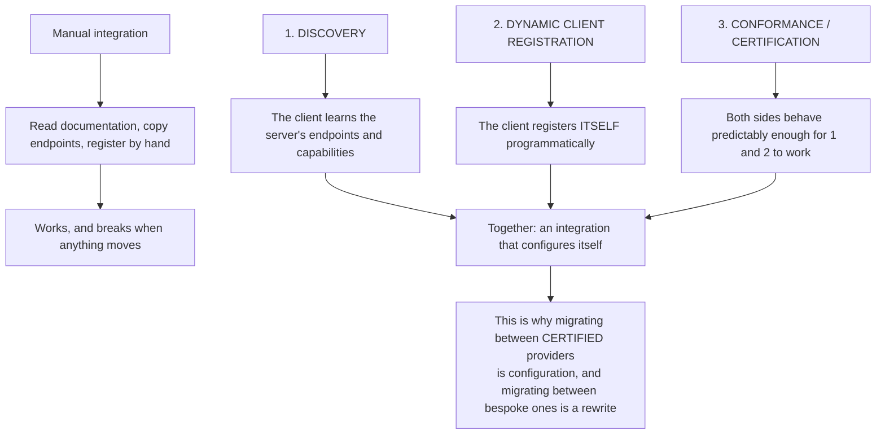
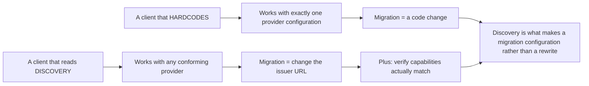
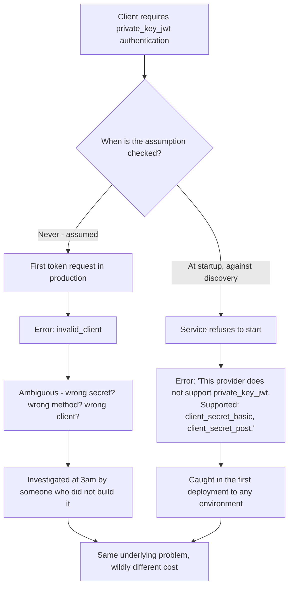
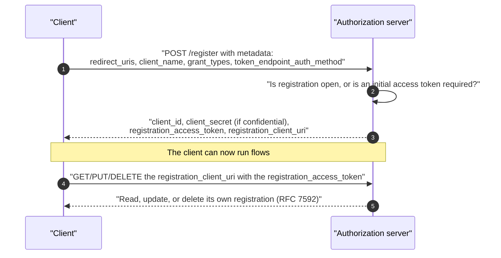
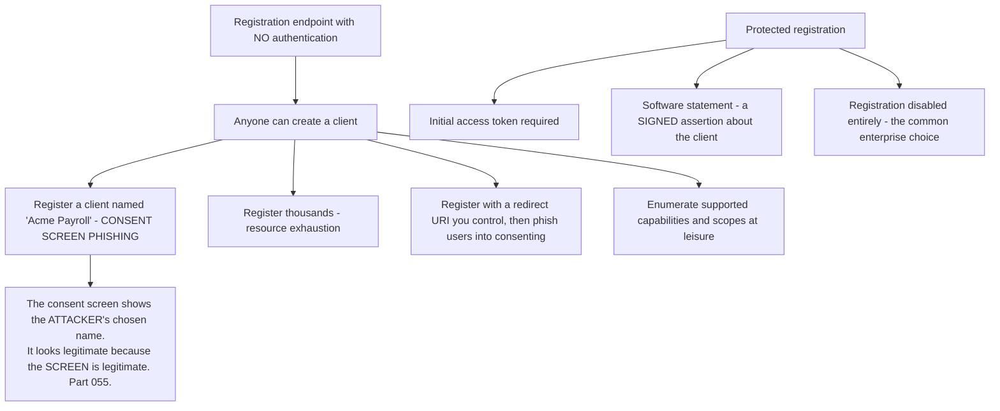
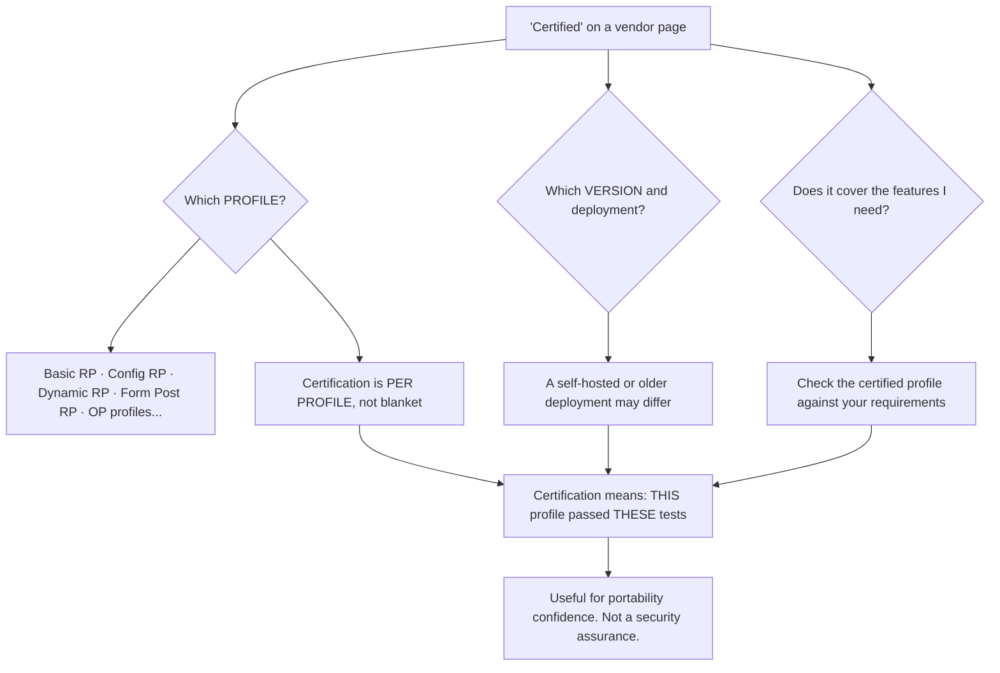
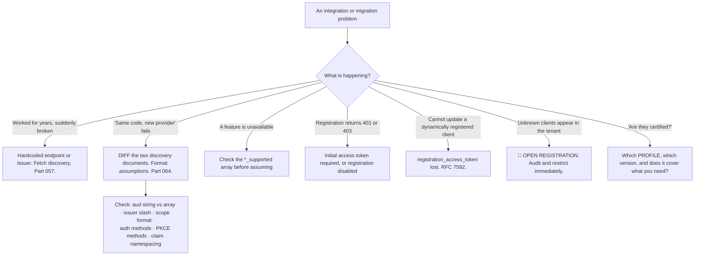

# Part 074 - Discovery, Dynamic Client Registration, and Conformance

> Section goal: Understand the automation layer of OIDC — how integrations configure themselves, how clients can register programmatically, and what "certified" actually guarantees. This is the Part that explains why some provider migrations are trivial and others are rewrites.

Covers index item **074**. Maps to JD signals: *knowledge of OIDC*, *promote best practices*, *strong analytical and problem-solving skills*, *communicate technical concepts clearly*, and *continuous learning*.

---

## 1. Start From Zero: Three Layers of Automation

| Layer | Answers |
|---|---|
| **Discovery** | *Where are this server's endpoints and what does it support?* (Part 057) |
| **Dynamic Client Registration** | *How does a client get a client ID without a human?* |
| **Conformance** | *Can I rely on standard behaviour at all?* |

> **Analogy.** A published catalogue, a self-service account signup, and an industry standard that makes both mean the same thing everywhere. Any one alone is useful; together they remove the human from routine integration.
>
> **Where it stops:** a catalogue is read by a person who can interpret ambiguity. Software cannot, which is why conformance — the guarantee that a field means what it says — is what makes the other two safe.

---

## 2. Discovery Recap and What It Enables

Covered mechanically in Part 057. The point here is what it makes **possible**.

| Capability | Enabled by |
|---|---|
| Endpoints fetched, not hardcoded | `authorization_endpoint`, `token_endpoint`, `jwks_uri`… |
| Correct issuer for validation | `issuer` |
| Key rotation without coordination | `jwks_uri` |
| Feature detection before use | `*_supported` arrays |
| **Provider portability** | The client reads capabilities rather than assuming |

**The capability arrays are the underused part.** `grant_types_supported`, `code_challenge_methods_supported`, `id_token_signing_alg_values_supported`, `response_modes_supported` — a client can **check before assuming**, and fail with a clear message at startup rather than an obscure one in production.

### 🔍 Plain-English deep-dive: fail at startup, not at 3am

There is a general principle here worth naming, because it applies well beyond OIDC: **move failures to the earliest, cheapest, most informative point.**

A client that assumes a capability fails at the worst possible moment and with the worst possible message.

**Four capabilities worth checking at startup**, because each produces a confusing runtime failure when absent:

| Capability | Runtime symptom if assumed |
|---|---|
| `token_endpoint_auth_methods_supported` | `invalid_client` — ambiguous with several other causes (Part 069) |
| `code_challenge_methods_supported` | PKCE silently absent or downgraded to `plain` (Part 059) |
| `id_token_signing_alg_values_supported` | Verification never succeeds — looks like a key problem (Part 043) |
| `grant_types_supported` | `unsupported_grant_type`, or `unauthorized_client` if it is client-level (Part 057) |

**Why this matters more in identity than elsewhere:** these failures are *ambiguous*. `invalid_client` has three plausible causes; a verification failure looks like a key rotation problem; a missing PKCE method produces no error at all. **A startup check replaces an ambiguous symptom with an unambiguous statement**, and it costs a few lines.

**The support-facing version:** when someone reports one of those ambiguous errors after a provider change, asking *"does the provider's discovery document list the method you're using?"* frequently ends the ticket in one message — and it is a check you can run yourself.

**The wider habit worth carrying:** any assumption a system makes about an external service is worth asserting at startup rather than discovering at runtime. **Configuration validated at boot is the cheapest possible failure**, and it is diagnosed by whoever is deploying rather than whoever is on call.

**Analogy:** checking that a hire car takes the fuel you intend to put in, before driving off, rather than at a pump two hundred miles away. Same discovery, entirely different cost. **Where it stops:** a fuel cap is labelled and visible. A provider's capabilities are only visible if you go and read them, which is precisely why the check has to be written.

---

## 3. Dynamic Client Registration

**RFC 7591** (registration) and **RFC 7592** (management). A client registers itself and receives credentials.

| Field | Purpose |
|---|---|
| **`redirect_uris`** | Registered exactly (Part 065) |
| `client_name` | Display name on consent screens |
| `grant_types`, `response_types` | What the client will use |
| `token_endpoint_auth_method` | How it will authenticate (Part 060) |
| **`registration_access_token`** | Credential for managing this registration |
| **`registration_client_uri`** | Where to manage it |

### 🔍 Plain-English deep-dive: open registration is a real risk, and the mitigation is standard

Dynamic registration sounds convenient and is genuinely dangerous if left open.

**The first attack is the important one**, and it is consent phishing (Part 055) with a self-service front door. An attacker registers a client with a plausible `client_name`, sends a genuine authorization link, and the user sees a real consent screen at the real provider naming an application that sounds legitimate. **Nothing looks wrong because nothing *is* wrong** — the provider is faithfully displaying a name the attacker chose.

**Three standard mitigations, in increasing strength:**

| Mitigation | Effect |
|---|---|
| **Initial access token** | Registration requires a credential — turns open registration into invited registration |
| **Software statement** | A **signed** JWT asserting client metadata, issued by a trusted party — the provider verifies rather than trusts |
| **Disabled** | ✅ The common choice for enterprise tenants where clients are few and long-lived |

**When dynamic registration genuinely earns its place:**

| Case | Why |
|---|---|
| A platform onboarding many third-party apps | Manual registration does not scale |
| Federated ecosystems — health, finance, education | Software statements make trust verifiable |
| Per-installation clients | Each deployment needs its own credentials |
| Automated preview environments | An alternative to wildcard redirect URIs (Part 065) |

**That last row is a genuinely useful answer** to the customer who wants wildcard redirect URIs: rather than loosening matching, register a client per preview deployment via the API and delete it afterwards. **Same convenience, no security trade.**

**The support-facing question:** if a customer's tenant has open registration, ask whether they need it. **Most do not** — it is enabled by default in some configurations and never reviewed, which is exactly the profile of a risk nobody owns.

**Analogy:** a visitor pass machine in an unattended lobby that prints whatever name you type. The machine works perfectly and the pass is genuine, which is precisely the problem. **Where it stops:** a receptionist would ask who you are here to see. A registration endpoint has no equivalent unless one was configured.

---

## 4. Conformance and Certification

The OpenID Foundation runs a **self-certification** programme with published test suites.

| Certification asserts | Certification does **not** assert |
|---|---|
| ✅ The implementation passed a defined test profile | ❌ That it is secure overall |
| ✅ Standard behaviours work as specified | ❌ That every optional feature is present |
| ✅ Interoperability for the certified profile | ❌ That non-certified deployments behave the same |
| ✅ A published, checkable claim | ❌ Anything about the customer's own configuration |

### 🔍 Plain-English deep-dive: what certification buys you in a real conversation

Customers see "OpenID Certified" and read it as a quality badge. **It is more specific and more useful than that**, and being precise helps in two common conversations.

**Conversation 1: "Is this provider secure?"**

Certification does not answer that. It says a defined set of protocol behaviours matched the specification in a test run. **A certified provider can still be misconfigured by its customer**, which is where the overwhelming majority of real problems live. The honest framing: *"Certification tells you the protocol works as specified. It tells you nothing about how your tenant is configured, which is where the actual risk usually is."*

**Conversation 2: "How hard is it to migrate to or from this provider?"**

Here certification is genuinely informative, and this is where it earns attention:

| Both sides certified for the same profiles | Migration is mostly configuration |
| One side bespoke | Expect code changes wherever assumptions differ |
| Neither certified | Expect surprises in exactly the places that were never tested |

**The concrete differences that bite during a migration** — and these are the ones to check regardless of certification:

| Difference | Impact |
|---|---|
| `aud` as a string versus an array | Verifier rejects everything (Part 064) |
| Issuer with or without a trailing slash | Every token rejected (Part 043) |
| `scope` as a string versus an array | Parsing breaks |
| Supported `token_endpoint_auth_method` | Client authentication fails (Part 060) |
| Supported `code_challenge_methods` | PKCE unavailable or downgraded (Part 059) |
| Custom claim namespacing rules | Claims silently dropped (Part 073) |

**The practical move before any migration:** fetch both providers' discovery documents and **diff the capability arrays** (Part 057). That takes minutes and predicts most of the work.

**And the honest caveat about self-certification:** the programme is self-administered — vendors run the tests and publish results. That is not a criticism, since the tests are public and results are checkable, but it means certification is *evidence*, not an audit. **Saying so plainly is more credible than presenting it as a guarantee.**

**Analogy:** a component certified to fit a standard socket. Genuinely useful — you know it will connect — and it says nothing about whether the device is any good, or whether you wired the socket correctly. **Where it stops:** a physical fitting either connects or does not. Protocol conformance covers a defined test profile, so the useful question is always *which* profile.

---

## 5. Failure Modes

| Failure mode | What it looks like | Consequence | Correction |
|---|---|---|---|
| **Hardcoding instead of discovery** | Works for years | 🔴 Outage when anything moves (Part 057) | Fetch and cache |
| **Not checking capability arrays** | Assumed support | Obscure production failure | Feature-detect at startup |
| **Open dynamic registration** | Convenient | 🔴 **Consent-screen phishing** | Initial access token, or disable |
| **Registration enabled and unreviewed** | Nobody knows it is on | Unowned risk | Audit it |
| **Losing the `registration_access_token`** | Cannot manage the client | Orphaned registrations | Store it with the credentials |
| **Treating certification as security assurance** | Misplaced confidence | Wrong expectations | It covers a test profile |
| **Assuming certification covers everything** | Feature missing | Migration surprise | Check the specific profile |
| **Migrating without diffing discovery** | "Same code, new provider" | Format assumptions break (Part 064) | Diff the capability arrays first |
| **Registering redirect URIs loosely via DCR** | Automated wildcards | 🔴 Same risk as manual wildcards | Exact values, per environment |
| **No cleanup of dynamic registrations** | Registrations accumulate | Sprawl; orphaned credentials | Delete via RFC 7592 |

---

## 6. Troubleshooting Decision Tree: Automation Problems

### Worked example

*"We're evaluating moving from our current provider to a new one. How much work is it?"*

1. **Do not estimate from vendor documentation.** Fetch **both** discovery documents — this costs minutes and needs nothing from anyone.
2. **Diff the capability arrays.** `grant_types_supported`, `response_types_supported`, `code_challenge_methods_supported`, `token_endpoint_auth_methods_supported`, `id_token_signing_alg_values_supported`, `response_modes_supported`.
3. **Findings, typical of a real comparison:** the new provider does not support one client authentication method they currently use, and it offers an additional signing algorithm they do not need.
4. **Then check the format assumptions**, which discovery does not reveal: obtain a token from each and compare `aud` as string versus array, the issuer's trailing slash, and `scope` format. **This is where the actual code changes hide** (Part 064).
5. **Then check the non-standard surface**, which is where the real cost usually is: custom claim namespacing rules, Action or Rule equivalents (Part 103), organisation and multi-tenancy models (Part 104), and log formats (Part 107). **None of that is standardised**, so none of it transfers.
6. **Give a shaped answer, not a number.** Something like: *"The protocol layer is configuration — endpoints and issuer come from discovery. Expect small code changes for token format assumptions. The real work is your extensibility and tenant model, because that isn't standardised."*
7. **Name the check they can run themselves**, because it makes the estimate credible and repeatable: decode one token from each provider and compare the claim shapes.
8. **Mention certification honestly.** If both are certified for the profiles they use, the protocol layer should behave the same — and that is *evidence* rather than a guarantee, because certification is self-administered against public tests.

---

## 7. Lab: Automation and Portability

**Purpose.** Use discovery for feature detection, try dynamic registration, and perform a realistic portability comparison.

**Prerequisites.** Parts 057, 064, 070–073 artifacts. A free Auth0 tenant, plus a second provider — another free tenant, a public test provider, or a local OIDC server.

**Steps.**

1. Create `okta-prep/labs/074-automation/`.
2. **Feature detection.** Extend your Part 057 `as-info` script to check a **required capability list** against a provider's discovery document and report pass/fail per item. **Run it against both providers.**
3. **Fail at startup deliberately.** Make a client refuse to start when a required capability is absent, with a clear message. **Record that message** and contrast it with the obscure runtime failure it replaces.
4. **Dynamic registration.** If your provider supports it, register a client via `POST /register`. **Record the full response**, including `registration_access_token` and `registration_client_uri`.
5. **Manage it.** Read, update, and delete the registration via RFC 7592. **Record each response.**
6. **Lose the token.** Discard the `registration_access_token` and attempt an update. **Record the failure** and note the operational implication.
7. **Registration protection.** Determine whether your tenant's registration endpoint requires an initial access token. **Record the behaviour with and without one.**
8. **Consent-screen naming.** Register a client with a deliberately plausible `client_name` **in your own tenant**, and trigger its consent screen. **Screenshot it.** Write one line on why open registration makes this a phishing vector.
9. **Then delete it** and confirm removal.
10. **The portability diff.** Fetch both providers' discovery documents and **build a full comparison table** of every `*_supported` array. Record every difference.
11. **Token format diff.** Obtain an ID token and an access token from each. **Compare claim shapes**: `aud` type, issuer format, `scope` type, and any provider-specific claims. **This is the table that predicts code changes.**
12. **Write a migration estimate.** Using steps 10 and 11, write a one-page assessment: what is configuration, what is small code change, and what is genuinely non-standard.
13. **Certification check.** Look up both providers on the OpenID Foundation certification listing. **Record which profiles each is certified for** and whether those cover what you use.
14. **Write the guidance.** `automation-and-portability.md` — one page: what discovery enables, when dynamic registration is appropriate and how to protect it, and what certification does and does not tell you.
15. **Failure catalog + manifest.** Complete `MANIFEST.md`.

**Expected evidence.** A feature-detection script run against two providers, a startup failure with a clear message, a full dynamic registration lifecycle, a lost-token failure, registration protection behaviour, a consent-screen naming demonstration, a full capability diff, a token format diff, a one-page migration estimate, a certification lookup, and one-page guidance.

**Validation rubric.**

| Check | Pass condition |
|---|---|
| Feature detection | Pass/fail per capability, both providers |
| Startup failure | Clear message recorded and contrasted |
| Registration lifecycle | Create, read, update, delete all recorded |
| Lost token | Failure and implication recorded |
| Consent naming | Screenshotted in your own tenant, then deleted |
| Capability diff | Every array compared |
| Token format diff | Claim shapes compared |
| Migration estimate | Three categories, one page |
| Certification | Profiles recorded for both |

**Cleanup and privacy.** Lab tenants only. **The consent-screen naming demonstration must use a tenant you own** and the client must be deleted immediately afterwards — never register a misleadingly-named client anywhere else. Delete all dynamically registered clients at the end.

---

## 8. JD Mapping

| Supplied JD signal | How this Part supports it |
|---|---|
| **Knowledge of OIDC** | Discovery, DCR, and the conformance programme |
| **Promote best practices** | Feature detection; protecting registration; per-environment clients over wildcards |
| Strong analytical and problem-solving skills | Predicting migration cost from two documents |
| **Communicate technical concepts clearly** | What certification does and does not assert |
| Continuous learning | Knowing where standardisation ends |
| Exceed expectations on response quality | A shaped migration answer rather than a guessed number |
| Basic security concepts | Open registration as a consent-phishing vector |

---

## 9. Candidate Honesty Note

- **Claim safety:** *Learned architecture and lab experience.*
- **The strongest thing you can say:** *"Discovery, dynamic client registration, and conformance are the automation layer. Discovery is why a migration between conforming providers is configuration rather than a rewrite — the client reads endpoints, the issuer, and capability arrays instead of assuming them."*
- **A second point, and it is genuinely useful advice:** *"The `*_supported` arrays are the underused part. A client can feature-detect at startup and fail with a clear message, instead of failing obscurely in production when it turns out the provider doesn't offer an algorithm or a client authentication method."*
- **A third, on a real risk:** *"Open dynamic registration is consent-screen phishing with a self-service front door. An attacker registers a client with a plausible name, sends a genuine authorization link, and the user sees a real consent screen at the real provider naming something that sounds legitimate. Nothing looks wrong because nothing is wrong — the provider is faithfully displaying a name the attacker chose. The mitigations are an initial access token, a signed software statement, or disabling it, which is the right answer for most enterprise tenants."*
- **A fourth, and it is a good answer to a common request:** *"Dynamic registration is a better answer than wildcard redirect URIs for preview environments — register a client per deployment via the API and delete it afterwards. Same convenience, no loosening of exact matching."*
- **A fifth, on certification:** *"It says a defined profile passed defined tests. It doesn't say the provider is secure, and it says nothing about the customer's own configuration, which is where most real problems are. Where it genuinely helps is predicting migration effort. And it's self-certification against public tests — evidence rather than an audit, and saying that plainly is more credible than presenting it as a guarantee."*
- **A sixth, practical:** *"Before estimating a migration I'd fetch both discovery documents and diff the capability arrays, then compare a token from each for `aud` type, issuer format and `scope` shape. That takes minutes and predicts most of the work — and the biggest cost is usually the non-standardised part: extensibility, tenant model, and logs."*
- **Do not overstate:** you have not run a provider migration. Say you have compared providers and exercised registration in a lab.

---

## 10. Official Source Anchors

Accessed **26 August 2026**.

| Source | What it defines |
|---|---|
| OpenID Connect Discovery 1.0 | Metadata document and all capability fields |
| IETF RFC 8414 | OAuth authorization server metadata |
| IETF RFC 7591 | Dynamic Client Registration |
| IETF RFC 7592 | Dynamic Client Registration Management |
| IETF RFC 7591 §5 | Registration security considerations, including software statements |
| OpenID Foundation certification programme | Profiles, test suites, and the published listing |
| OpenID Connect Core §2 | Client metadata fields used in registration |
| Auth0 and Okta documentation — dynamic registration | Vendor support and protection options |

**Revalidate after 26 August 2026:** the RFCs are stable. Recheck the certification listing and vendor DCR support, both of which change.

---

## ⭐ Likely Interview Questions for This Section

### Q1. "What does discovery actually enable beyond convenience?"
> *Model answer:* "Portability, mainly. A client that reads endpoints, the issuer, and capability arrays from discovery works against any conforming provider, so a migration becomes changing an issuer URL rather than a code change. It also enables feature detection, which is the underused part — a client can check `code_challenge_methods_supported` or `token_endpoint_auth_methods_supported` at startup and fail with a clear message, rather than failing obscurely in production when it turns out a method isn't offered. And it makes key rotation invisible, because `jwks_uri` is fetched rather than configured. The alternative — hardcoding — works for years and then breaks completely when something moves, usually long after anyone remembers configuring it."

### Q2. "What is dynamic client registration and when is it appropriate?"
> *Model answer:* "A client registers itself programmatically by POSTing its metadata — redirect URIs, name, grant types, authentication method — and receives a client ID, a secret if it's confidential, and a registration access token for managing that registration later. It earns its place where manual registration doesn't scale: a platform onboarding many third-party applications, federated ecosystems in health or finance where software statements make trust verifiable, per-installation clients, and automated preview environments. That last one is genuinely useful, because it's a better answer than wildcard redirect URIs — register a client per preview deployment and delete it afterwards, keeping exact matching intact."

### Q3. "What's the risk of open dynamic registration?"
> *Model answer:* "Consent-screen phishing with a self-service front door. An attacker registers a client with a plausible name like 'Acme Payroll', sends a user a genuine authorization link at the genuine provider, and the user sees a real consent screen naming an application that sounds legitimate. Nothing looks wrong because nothing is wrong — the provider is faithfully displaying a name the attacker supplied. Beyond that, open registration allows resource exhaustion and capability enumeration. The mitigations are standard: require an initial access token, require a signed software statement so the provider verifies rather than trusts the metadata, or disable registration entirely, which is the right answer for most enterprise tenants. The support question is whether they need it on — usually it's a default nobody reviewed."

### Q4. "What does OpenID certification tell you?"
> *Model answer:* "That an implementation passed a defined test profile against the specification. It's genuinely useful for interoperability confidence and for predicting migration effort — if both providers are certified for the profiles you use, the protocol layer should behave the same. What it doesn't tell you is whether the provider is secure overall, whether every optional feature is present, or anything at all about the customer's own configuration, which is where the overwhelming majority of real problems live. It's also self-certification: vendors run public tests and publish results. That's not a criticism, since the tests and results are checkable, but it makes certification evidence rather than an audit, and I'd say that plainly rather than presenting it as a guarantee."

### Q5. "How would you estimate the effort of migrating providers?"
> *Model answer:* "Three layers, and I'd measure rather than guess. First, fetch both discovery documents and diff every `*_supported` array — that shows immediately whether a grant type, authentication method, PKCE method or signing algorithm they rely on is missing. Second, obtain a token from each and compare claim shapes: `aud` as a string or an array, the issuer's trailing slash, `scope` as a string or array. That's where the actual code changes hide, and discovery doesn't reveal it. Third — and usually the largest cost — the non-standardised surface: extensibility like Actions or Rules, the organisation and multi-tenancy model, and log formats. None of that transfers. So the shaped answer is: protocol is configuration, token formats are small code changes, and the tenant model is the real work."

### Q6. "A client works with one provider and fails with another. Where do you look?"
> *Model answer:* "Format assumptions, almost always, because the code is the same and the protocol is the same. The classic three: `aud` as a string versus an array, which makes an equality check reject every token; the issuer with or without a trailing slash, which fails an exact string comparison; and `scope` as a space-delimited string versus an array. All three are places where the specification permits variation and the code silently assumed one form. I'd diff a decoded token from each provider side by side, which usually makes it obvious in seconds. And then I'd ask explicitly what else the migration might have surfaced, because a codebase with one untested format assumption generally has others, and finding them now is cheaper than one incident at a time."

### Q7. "Why does a client need to feature-detect?"
> *Model answer:* "Because OAuth and OIDC are frameworks with optional parts, so two conforming providers can support genuinely different sets. A client assuming `S256` PKCE support, or a particular client authentication method, or a signing algorithm, will fail — and the failure usually surfaces at runtime with an unhelpful error rather than at configuration time with a useful one. Checking the `*_supported` arrays at startup and refusing to start with a clear message turns 'invalid_client in production at 3am' into 'this provider does not support private_key_jwt, which this client requires.' It's a small amount of code and it moves the failure to the earliest, cheapest point — which is the general principle worth applying beyond this specific case."

### Q8. "A customer wants wildcard redirect URIs for preview environments. What do you suggest?"
> *Model answer:* "Dynamic client registration, if their provider supports it. The objection to wildcards is that an attacker who controls or takes over any matching subdomain receives authorization codes — and preview environments are exactly where subdomain takeover is most likely, since they're ephemeral, often left dangling, and rarely monitored. But the customer's need is real: registering dozens of URIs by hand is genuinely painful. So rather than refusing, I'd suggest registering a client per preview deployment through the management or registration API as part of the pipeline, with an exact redirect URI, and deleting it when the environment is torn down. Same convenience, exact matching preserved, and it solves the cleanup problem too — which manual registration never does."

---

## 🧠 30-Second Memory Hooks

- **Three automation layers:** **discovery** (where and what) · **dynamic registration** (self-service clients) · **conformance** (predictable behaviour).
- **Discovery is why migration is CONFIGURATION, not a rewrite.**
- **The `*_supported` arrays are for FEATURE DETECTION.** Fail at startup with a clear message.
- **DCR = RFC 7591** (register) · **RFC 7592** (manage). Keep the **`registration_access_token`**.
- **Open registration = CONSENT-SCREEN PHISHING** with a self-service front door.
- **Mitigations:** initial access token · **signed software statement** · disable it.
- **DCR beats WILDCARD redirect URIs** for preview environments.
- **Certification = a defined PROFILE passed defined TESTS.** Not a security assurance.
- **Self-certification against public tests = EVIDENCE, not an audit.**
- **Before a migration: diff the discovery documents, then diff a token from each.**
- **The real migration cost is the NON-STANDARD part** — extensibility, tenant model, logs.

---

## ✅ Completion Checklist

- [ ] **Knowledge:** I can explain all three layers, the open-registration risk, and what certification does and does not assert.
- [ ] **Lab artifact:** `074-automation/` contains feature detection across two providers, a full DCR lifecycle, a consent-naming demonstration, a capability and token-format diff, and a one-page migration estimate.
- [ ] **Spoken:** I can give a shaped migration answer in 60 seconds and the certification caveat in 30.
- [ ] **Judgement:** I offer DCR instead of wildcards, and I describe certification as evidence rather than a guarantee.
- [ ] **Honesty check:** I say "compared providers in a lab," not run a migration.
- [ ] **Source check:** I have read RFC 7591 §5 and the OpenID certification profile list myself.

---

*Next suggested section:* **[Part 075 - Session Management and Logout: RP-Initiated, Front-Channel, Back-Channel](Part-075-session-management-and-logout-rp-initiated-front-channel-back-channel.md)** — the full logout family, and why "logout doesn't work" is the most-reported non-bug in identity.
