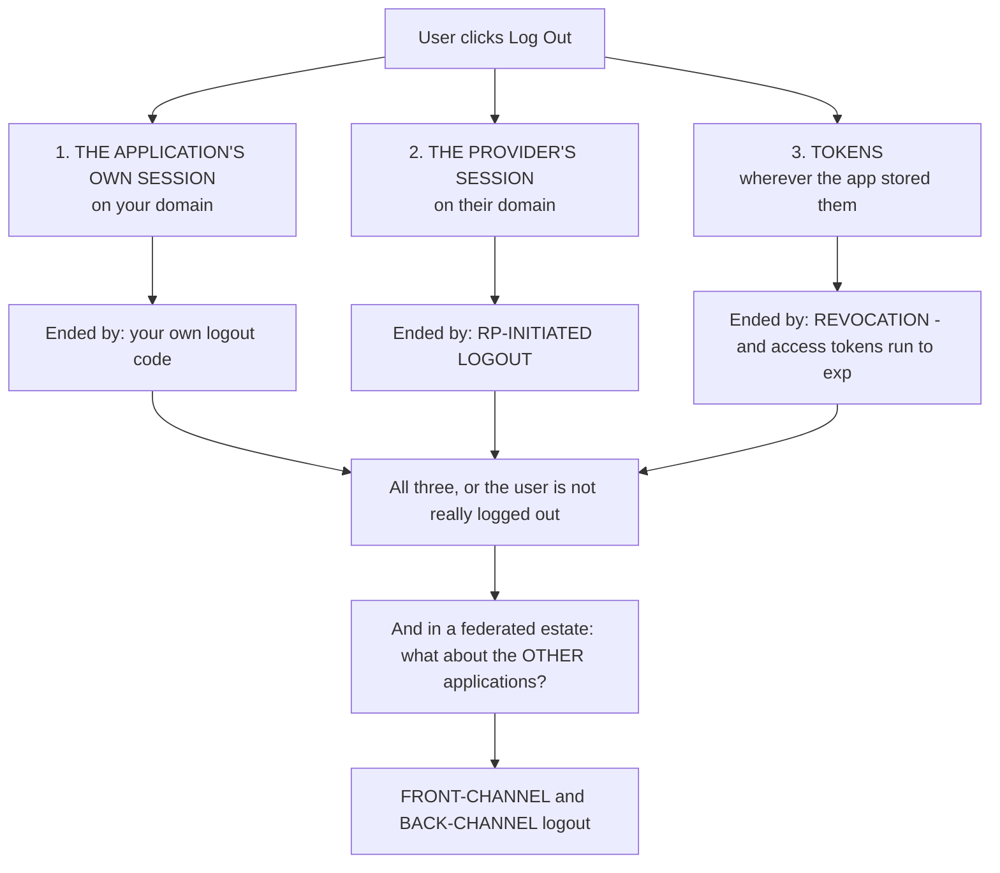
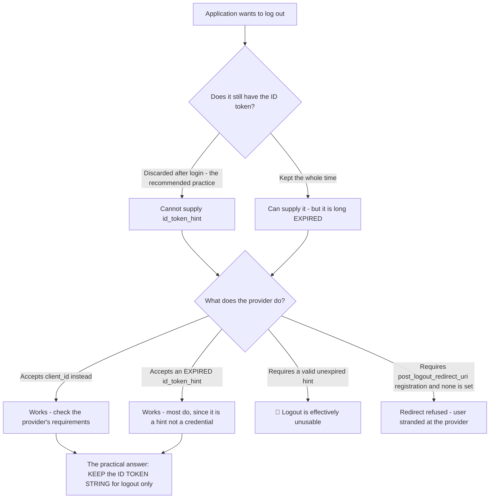
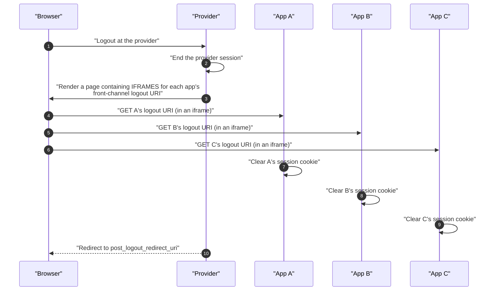
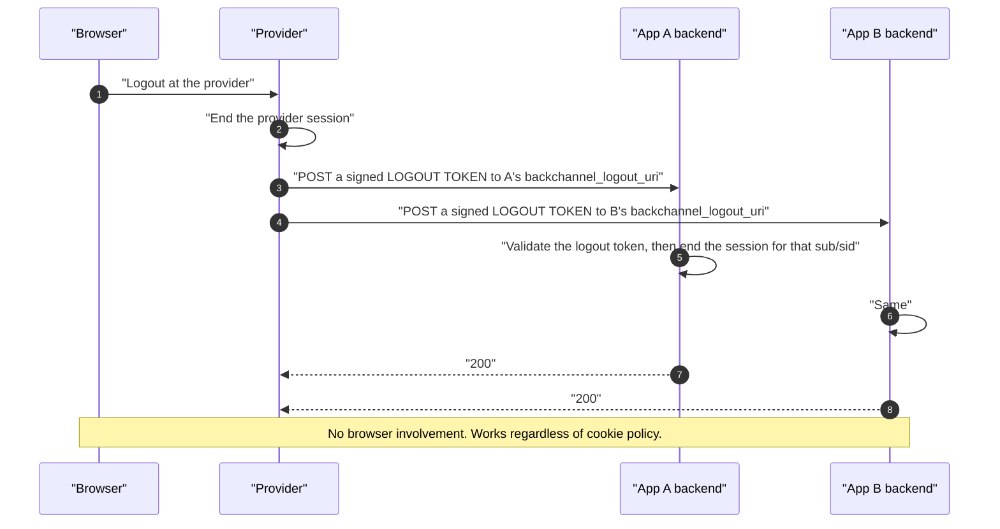
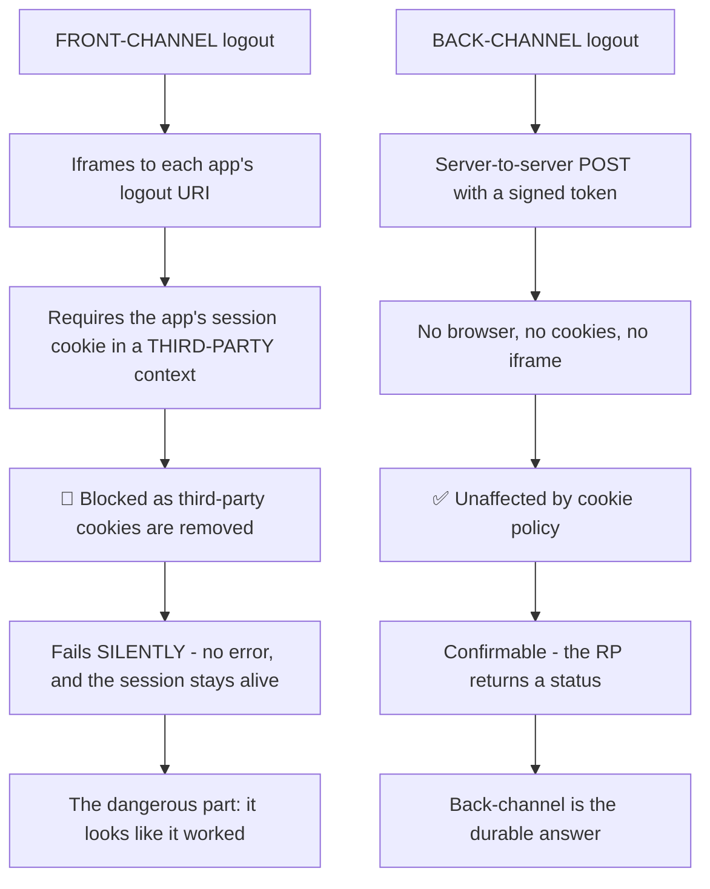
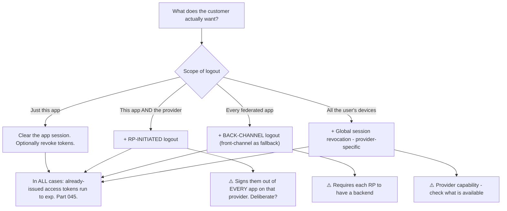
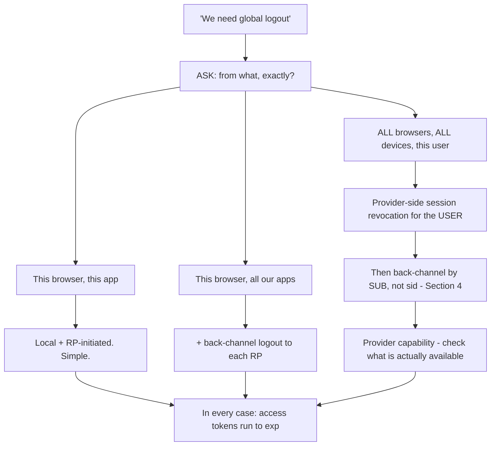
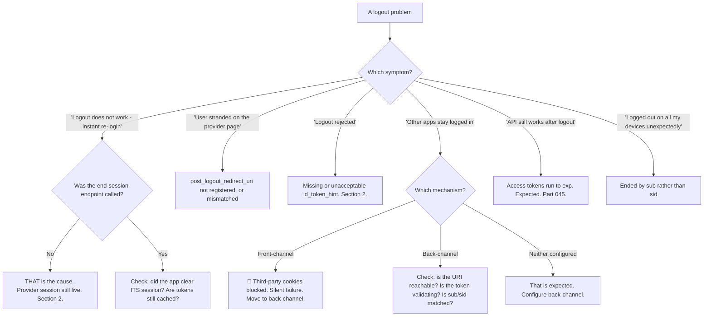

# Part 075 - Session Management and Logout: RP-Initiated, Front-Channel, Back-Channel

> Section goal: Master the complete logout family — what each mechanism does, which one a customer actually needs, and why "logout doesn't work" is the most-reported non-bug in identity. Part 047 introduced the three pieces of state; this Part covers the standards for ending them.

Covers index item **075**. Maps to JD signals: *knowledge of OIDC*, *experience with troubleshooting web applications*, *communicate technical concepts clearly*, *strong analytical and problem-solving skills*, and *basic security concepts*.

---

## 1. Start From Zero: Logout Is Not One Action

Part 047 established that a logged-in user has three pieces of state. Logout must address each.



**Four mechanisms, four different jobs:**

| Mechanism | Ends |
|---|---|
| **Your logout code** | Your application's session |
| **RP-Initiated Logout** | The **provider's** session |
| **Token revocation** (Part 045) | Refresh tokens; access tokens run to `exp` |
| **Front-channel / Back-channel Logout** | **Other applications'** sessions |

> **Analogy.** Leaving a building: closing your office door, signing out at reception, cancelling your visitor pass, and telling the other buildings on the shared pass that you have left. Four actions, four scopes.
>
> **Where it stops:** a receptionist can see you leave. Nothing in a browser observes a logout, which is why each mechanism must be invoked explicitly.

---

## 2. RP-Initiated Logout

The application redirects the user to the provider's `end_session_endpoint` (Part 057).

```
GET https://tenant.us.auth0.com/oidc/logout
  ?id_token_hint=<the ID token>
  &post_logout_redirect_uri=https%3A%2F%2Fapp.example.com%2Fbye
  &state=xyz789
```

| Parameter | Purpose |
|---|---|
| **`id_token_hint`** | Identifies the session and the client. Often **required** |
| **`post_logout_redirect_uri`** | Where to send the user afterwards — **must be registered** |
| **`state`** | Round-tripped, as in Part 065 |
| `logout_hint` | Optional hint about which session |
| `client_id` | Sometimes used instead of `id_token_hint` |

### 🔍 Plain-English deep-dive: the `id_token_hint` problem nobody anticipates

RP-initiated logout typically requires `id_token_hint` — and Part 070 said to **discard** the ID token after login. **Those two pieces of correct advice collide.**



**The resolution most implementations use, and it is sound:** keep the **raw ID token string** in the application's session purely as a logout hint, while still creating and relying on your own session for everything else.

**Why that is not a contradiction with Part 070:**

| Part 070 says | This says |
|---|---|
| Do not use the ID token **as a session credential** | Keep the **string** as a logout hint |
| Do not re-validate it per request | It is never validated again |
| Do not adopt its expiry as your session length | Its expiry is irrelevant to a hint |

**The distinction is between using it as a credential and storing it as an opaque handle.** Most providers accept an expired hint precisely because it identifies rather than authorises.

**The second failure in that diagram is more visible and more annoying:** `post_logout_redirect_uri` must be **registered**, exactly as redirect URIs are (Part 065). If it is not, the provider ends the session and then **refuses to redirect**, leaving the user on a provider-branded page with no way back. **The user experience is "I logged out and ended up somewhere strange"**, and the fix is one registration entry.

**The third thing to check is what a customer actually wants**, because it is a genuine design question: ending the provider session logs the user out of **every** application federated to it. Sometimes that is exactly right; sometimes signing out of one internal tool should not sign you out of email. **The standard separates these deliberately, and the application has to choose** (Part 047).

**The support-facing sequence:** *"Are you calling the end-session endpoint? Do you still have the ID token to pass as a hint? Is your post-logout URL registered? And do you actually want to end their session everywhere, or just here?"* **Four questions, and they cover the whole surface.**

**Analogy:** handing back a visitor badge requires having kept the badge, and the exit route has to be one reception is willing to point you at. Discarding the badge at the lobby and expecting a smooth exit does not work. **Where it stops:** a receptionist would let you leave regardless. A provider follows its rules exactly, which is why the registration entry matters.

---

## 3. Front-Channel Logout

Ending **other applications'** sessions, via the browser.



| Property | Detail |
|---|---|
| Mechanism | Hidden **iframes** to each RP's logout URI |
| Requires | The user's browser to be present |
| Reliability | ⚠️ **Best-effort** — no confirmation |
| 🔴 **Third-party cookies** | The iframe is a cross-site context — **the same problem as silent auth** (Part 017) |
| Status | Increasingly unreliable as browsers restrict third-party cookies |

**Front-channel logout is failing the same way iframe silent authentication is failing**, and for exactly the same reason: it depends on cookies being sent in a third-party context. **This is the single most important current fact about it.**

---

## 4. Back-Channel Logout

Ending other applications' sessions **server to server**.



| Property | Detail |
|---|---|
| Mechanism | Direct **HTTP POST** from provider to each RP |
| Payload | A signed **logout token** — a JWT |
| Browser needed | ❌ **No** |
| Reliability | ✅ Confirmable — the RP returns a status |
| Third-party cookies | ✅ **Unaffected** |
| Requirement | The RP must have a **reachable backend** and track sessions by `sub`/`sid` |

### The logout token

| Claim | Purpose |
|---|---|
| `iss`, `aud`, `iat`, `jti` | Standard validation |
| **`sub`** and/or **`sid`** | **Which** session to end |
| **`events`** | Must contain `http://schemas.openid.net/event/backchannel-logout` |
| **No `nonce`** | 🔴 Its presence means it is an **ID token**, not a logout token — reject it |

**That last row is a required check**, and it exists to stop an ID token being replayed as a logout token.

### 🔍 Plain-English deep-dive: why back-channel is the answer and front-channel is legacy

Front-channel logout was the natural design when browsers freely sent cookies in iframes. **That assumption is being removed**, and it takes front-channel logout with it.



**The silent failure is what makes front-channel dangerous rather than merely outdated.** The provider renders the iframes, the browser loads them, the requests arrive without cookies, each application sees an anonymous request and cannot identify a session to end — and **returns 200**. The provider redirects the user, everything looks successful, and **the other applications' sessions are still live.**

**In a security-driven logout — a shared computer, a suspected compromise, an administrator forcing sign-out — that is a real failure, silently reported as a success.**

**What back-channel requires in exchange:**

| Requirement | Implication |
|---|---|
| A **reachable backend** | A pure static SPA with no server cannot receive the POST |
| **Session tracking by `sub` or `sid`** | The RP must be able to find the session to end |
| **Logout token validation** | Signature, `iss`, `aud`, `events`, and **no `nonce`** |
| Idempotency | The same logout may be delivered more than once |

**The `sid` detail is worth understanding.** A `sub` identifies the *user*, so ending by `sub` logs out **all** of that user's sessions in that application — including one on another device. `sid` identifies a **specific** session, so ending by `sid` logs out only that one. **Which is correct depends on intent**, and a customer implementing back-channel logout should decide deliberately rather than by whichever claim they read first.

**The practical recommendation for a customer with several applications:** back-channel where each has a backend; front-channel only as a fallback, understanding it is best-effort and degrading; and **explicit acceptance that access tokens already issued remain valid until expiry** regardless of which mechanism is used (Part 045).

**Analogy:** telephoning each building to say someone has left, versus posting a note through a door that may be sealed. The call is confirmed; the note may never be read, and you cannot tell. **Where it stops:** an unread note eventually falls on a mat and someone finds it. A blocked iframe request leaves no trace at all.

---

## 5. Choosing the Right Logout



**The bottom node is the sentence to have ready**, because it applies to every option and it is the one customers do not expect.

### 🔍 Plain-English deep-dive: "log me out everywhere" is four different requests

When a customer asks for "global logout," they mean one of four things, and the implementations are entirely different. **Establishing which one before designing anything saves a rebuild.**

| What they say | What they mean | What it needs |
|---|---|---|
| "Log out of this app" | End this application's session | Local logout |
| "Log out properly" | End the provider session too | + RP-initiated logout |
| "Log out of all our apps" | End sibling applications' sessions | + **back-channel logout** |
| "Log me out on all my devices" | End **every** session for this user, everywhere | + **global session revocation** |



**The fourth row is the one that trips designs up**, because it is not a browser operation at all. Ending sessions on *other devices* means revoking sessions server-side at the provider, then propagating that to each application — and back-channel logout must then end by **`sub`** rather than `sid`, since the whole point is to affect sessions the user is not currently using.

**Two things worth establishing early, because they shape the answer:**

**1. Is this routine or a security event?** A user clicking "sign out" on a laptop usually does *not* want their phone signed out — that is hostile. A user reporting a stolen device absolutely does. **The same feature with two different scopes, and the interface should distinguish them** rather than picking one silently.

**2. What is the acceptable delay?** Back-channel delivery is fast but asynchronous, and access tokens already issued survive to expiry regardless (Part 045). **If the requirement is "immediately, everywhere," the honest answer involves short token lifetimes**, not a different logout mechanism.

**The question that opens this well:** *"When someone clicks this, what should happen to their session on their phone?"* It is concrete, answerable without technical knowledge, and it separates the four cases immediately.

**Analogy:** "cancel my card" can mean this transaction, this card, every card on the account, or every card the person holds anywhere. Same phrase, four operations, and getting it wrong in either direction causes real problems. **Where it stops:** a bank asks which one. Software implements whatever was specified, and "global logout" specifies nothing.

---

## 6. Failure Modes

| Failure mode | What it looks like | Consequence | Correction |
|---|---|---|---|
| **Clearing local state only** | Instant silent re-login | 🔴 "Logout doesn't work" | Call the end-session endpoint |
| **`id_token_hint` discarded** | Logout rejected | Cannot log out | Keep the raw string for logout |
| **`post_logout_redirect_uri` unregistered** | Session ends, no redirect | User stranded at the provider | Register it exactly |
| **Front-channel logout relied upon** | Appears to work | 🔴 **Silent failure** — sessions stay alive | Back-channel |
| **Logout token not validated** | Anyone can POST a logout | 🔴 Denial of service on sessions | Full validation |
| **`nonce` present, not rejected** | ID token accepted as a logout token | 🔴 Replay | Reject if `nonce` is present |
| **Ending by `sub` when `sid` was meant** | All devices logged out | Surprising behaviour | Decide deliberately |
| **Not idempotent** | Duplicate delivery errors | Noisy failures | Handle repeats |
| **Expecting instant token invalidation** | Access tokens still work | Confusion | They run to `exp` (Part 045) |
| **Ending the provider session unexpectedly** | Signed out of everything | Angry users | Explicit design choice |
| **No backend for back-channel** | Cannot receive the POST | Mechanism unavailable | Front-channel, with its caveats |

---

## 7. Troubleshooting Decision Tree: Logout Problems



### Worked example

*"We configured front-channel logout across our four applications. Users log out of the main app and the others stay logged in — but only for some users."*

1. **"Only for some users" with front-channel logout is nearly diagnostic.** Front-channel depends on third-party cookies, and browser defaults differ.
2. **Confirm by browser.** Ask which browsers the affected users are on. **The pattern will follow browser cookie policy**, not anything about the users.
3. **Explain the mechanism.** Front-channel logout renders hidden iframes to each application's logout URI. The browser loads them, but blocks the cookies — so each application sees an anonymous request, cannot identify a session, and returns 200 anyway.
4. **Emphasise the silent part**, because it changes how they should feel about it: the provider believes logout succeeded, the user believes logout succeeded, and the sessions are live. **For a security-driven logout that is a failure reported as a success.**
5. **Say clearly that this is not their bug.** They configured it correctly; the mechanism's foundation is being removed.
6. **The fix:** back-channel logout, which is server-to-server and unaffected by cookie policy. Each application needs a `backchannel_logout_uri`, logout token validation, and session tracking by `sub` or `sid`.
7. **Name the constraint honestly.** Any application without a backend cannot receive the POST. If one of their four is a static SPA, that one needs a different approach — typically a short session plus a check against the provider.
8. **Make them decide `sub` versus `sid`.** Ending by `sub` logs the user out of that application on **every device**; `sid` ends only this session. **They should choose rather than discover it later.**
9. **Set the remaining expectation:** already-issued access tokens still run to `exp`. If that window matters, shorten the lifetime (Part 045).

---

## 8. Lab: All Four Logout Mechanisms

**Purpose.** Implement each mechanism, observe what each does and does not end, and reproduce the front-channel silent failure.

**Prerequisites.** Parts 014, 017, 045, 047, 057 artifacts. A free Auth0 tenant with **three** applications, at least two with backends.

**Steps.**

1. Create `okta-prep/labs/075-logout/`.
2. **Rebuild the observatory** from Part 047: live display of the application session, the provider session, and token state.
3. **Local logout only.** Clear the app session. **Confirm the provider session survives** and the next login is silent. **Screenshot the sequence.**
4. **RP-initiated logout.** Call the `end_session_endpoint` with `id_token_hint` and a registered `post_logout_redirect_uri`. **Confirm the provider session ends** and the next login prompts.
5. **Break the hint.** Omit `id_token_hint`. **Record whether your provider accepts it, requires `client_id` instead, or rejects the request.**
6. **Expired hint.** Use an ID token that has long expired. **Record whether it is accepted** — this determines whether keeping the string is a viable strategy.
7. **Break the redirect.** Use an unregistered `post_logout_redirect_uri`. **Record exactly what the user sees** — this is the "stranded" ticket.
8. **Front-channel logout.** Configure it for all three applications. Log in to all three, then log out of one. **Confirm the others end.**
9. **Then block third-party cookies** and repeat. **Confirm the others stay logged in and that everything reports success.** **This is the lab's central artifact** — screenshot the false success.
10. **Back-channel logout.** Configure `backchannel_logout_uri` on the two applications with backends. **Capture the logout token** the provider POSTs and decode it locally (Part 040).
11. **Validate the token.** Check `iss`, `aud`, `events`, and confirm **no `nonce`**. Then deliberately send an **ID token** to the endpoint and **confirm your handler rejects it** because `nonce` is present.
12. **`sub` versus `sid`.** Log the same user in on two browsers. End by `sub`, and confirm both sessions end. Then repeat ending by `sid` and confirm only one ends. **Record both.**
13. **Idempotency.** Deliver the same logout token twice. **Confirm the second is handled cleanly.**
14. **Token survival.** After every logout variant, call an API with an access token issued beforehand. **Record how long it keeps working** (Part 045).
15. **Write the guidance.** `logout-guidance.md` — one page: the four mechanisms, what each ends, the front-channel caveat, and the `sub`-versus-`sid` decision.
16. **Failure catalog + manifest.** Complete `MANIFEST.md`.

**Expected evidence.** A three-state observatory, a local-only logout sequence, RP-initiated logout working, hint and redirect failures recorded, front-channel working then silently failing with cookies blocked, a decoded logout token, an ID-token rejection, a `sub`-versus-`sid` contrast, idempotency confirmed, measured token survival, and one-page guidance.

**Validation rubric.**

| Check | Pass condition |
|---|---|
| Observatory | All three states visible |
| Local-only logout | Silent re-login demonstrated |
| RP-initiated | Provider session ends; next login prompts |
| Hint behaviour | Missing and expired both recorded |
| Unregistered redirect | User experience recorded |
| Front-channel | Works, then **silently** fails — false success captured |
| Logout token | Decoded and fully validated |
| ID token rejected | `nonce` check demonstrated |
| `sub` vs `sid` | Both behaviours recorded |
| Token survival | Duration measured |

**Cleanup and privacy.** Lab tenant, synthetic users, applications you own. Restore browser cookie settings. Delete all three applications and revoke tokens at the end.

---

## 9. JD Mapping

| Supplied JD signal | How this Part supports it |
|---|---|
| **Knowledge of OIDC** | All four logout mechanisms and their specifications |
| **Experience troubleshooting web applications** | Iframes, cookies, and silent failure |
| **Communicate technical concepts clearly** | "This isn't your bug — the mechanism's foundation is being removed" |
| Strong analytical and problem-solving skills | "Only some users" mapped to browser cookie policy |
| **Basic security concepts** | Silent logout failure as a security issue |
| Promote best practices | Back-channel over front-channel; deliberate `sub`/`sid` choice |
| Exceed expectations on response quality | Setting the access-token expectation before it is asked |

---

## 10. Candidate Honesty Note

- **Claim safety:** *Learned architecture and lab experience.*
- **The strongest thing you can say:** *"Logout is four mechanisms with four scopes: your own logout code ends your session; RP-initiated logout ends the provider's session; revocation kills refresh tokens; and front- or back-channel logout ends *other* applications' sessions. 'Logout doesn't work' is almost always only the first one being done."*
- **A second point, and it is the most current fact here:** *"Front-channel logout is failing the same way iframe silent authentication is, and for the same reason — it depends on cookies in a third-party context. What makes it dangerous rather than merely outdated is that it fails *silently*: the iframes load, the requests arrive without cookies, each app can't identify a session, and returns 200. Everything reports success and the sessions are live. For a security-driven logout that's a failure reported as a success."*
- **A third, on the fix and its constraint:** *"Back-channel logout is server-to-server with a signed logout token, so it's unaffected by cookie policy and it's confirmable. The constraint is that each application needs a reachable backend, so a pure static SPA can't receive it — that one needs a different approach."*
- **A fourth, a collision worth flagging:** *"RP-initiated logout usually wants `id_token_hint`, and the correct advice elsewhere is to discard the ID token after login. The resolution is keeping the raw string purely as a logout hint — it's never validated again, so its expiry doesn't matter, and most providers accept an expired hint because it identifies rather than authorises."*
- **A fifth, a small ticket with a one-line fix:** *"'The user ended up on a strange page after logging out' is an unregistered `post_logout_redirect_uri` — the provider ends the session and then refuses to redirect."*
- **A sixth, a decision customers make by accident:** *"Back-channel logout can end by `sub` or `sid`. `sub` logs the user out of that application on every device; `sid` ends only this session. That should be a deliberate choice, not whichever claim they read first."*
- **Do not overstate:** you have not deployed federated logout. Say you have implemented all four mechanisms and reproduced the silent failure in a lab.

---

## 11. Official Source Anchors

Accessed **26 August 2026**.

| Source | What it defines |
|---|---|
| OpenID Connect RP-Initiated Logout 1.0 | `end_session_endpoint`, `id_token_hint`, `post_logout_redirect_uri` |
| OpenID Connect Front-Channel Logout 1.0 | The iframe mechanism and its limitations |
| OpenID Connect Back-Channel Logout 1.0 | Logout tokens, `events`, `sid`, and the no-`nonce` rule |
| OpenID Connect Session Management 1.0 | The session-status iframe (also cookie-dependent) |
| IETF RFC 7009 | Token revocation (Part 045) |
| IETF RFC 6265bis | Third-party cookie behaviour (Part 017) |
| Auth0 and Okta documentation — logout endpoints | Vendor parameter requirements and back-channel support |

**Revalidate after 26 August 2026:** the specifications are stable; **browser cookie behaviour is not**. Recheck browser release notes, since they determine whether front-channel works at all.

---

## ⭐ Likely Interview Questions for This Section

### Q1. "Why does logout so often appear not to work?"
> *Model answer:* "Because there are three pieces of state and most applications end only one. The app clears its own session, the user is returned to a login page, they click log in — and they're straight back in with no prompt, because the provider's session cookie on *its* domain was never touched. To the user that's indistinguishable from logout being ignored, and reporting it as a security concern is entirely reasonable. Complete logout is: clear the application session, call the provider's end-session endpoint so its session ends too, and revoke the refresh token — while accepting that already-issued access tokens run to `exp`. There's also a fourth question in a federated estate: what about the other applications, which is front- or back-channel logout."

### Q2. "What's the difference between front-channel and back-channel logout?"
> *Model answer:* "Front-channel uses the browser: the provider renders a page with hidden iframes pointing at each application's logout URI, and each application clears its own cookie. Back-channel is server-to-server: the provider POSTs a signed logout token directly to each application's registered endpoint, with no browser involved. The decisive difference today is third-party cookies. Front-channel iframes are a cross-site context, so the application's session cookie isn't sent, the request arrives anonymous, and the application can't identify a session to end. Back-channel doesn't touch cookies at all and is confirmable, since the application returns a status. So back-channel is the durable answer and front-channel is legacy."

### Q3. "Why is front-channel logout dangerous rather than just outdated?"
> *Model answer:* "Because it fails silently and reports success. The provider renders the iframes, the browser loads them, the requests arrive without cookies, each application sees an anonymous request, can't find a session, and returns 200. The provider then redirects the user and everything looks like it worked — the user believes they're logged out everywhere and they aren't. In an ordinary logout that's an inconvenience; in a security-driven one — a shared computer, a suspected compromise, an administrator forcing sign-out — it's a real failure being reported as a success. That combination of 'stops working' and 'still reports success' is what makes it worth raising proactively rather than waiting for a report."

### Q4. "What's in a logout token and how do you validate it?"
> *Model answer:* "It's a JWT with the standard claims — `iss`, `aud`, `iat`, `jti` — plus `sub` and/or `sid` to identify which session to end, and an `events` claim that must contain the back-channel logout event URI. Validation is signature, issuer, audience, and the `events` claim. The distinctive required check is that a logout token must **not** contain `nonce` — if it does, it's an ID token, and rejecting it stops an ID token being replayed as a logout instruction. Handlers should also be idempotent, because the same logout can be delivered more than once. And the endpoint needs validation for another reason too: without it, anyone who can POST to that URL can terminate sessions at will."

### Q5. "How does `id_token_hint` interact with discarding the ID token?"
> *Model answer:* "They collide, and it's a real point of confusion. RP-initiated logout typically wants `id_token_hint` to identify the session and client, while the correct advice after login is to discard the ID token rather than use it as a session credential. The resolution most implementations use is keeping the raw ID token *string* purely as a logout hint — it's never validated again, never used to make a decision, and its expiry doesn't matter because most providers accept an expired hint, since it identifies rather than authorises. So it isn't a contradiction: the advice is not to use it as a credential, and storing an opaque handle for logout is a different thing. Some providers accept `client_id` instead, which avoids the question entirely."

### Q6. "A customer says users end up on a strange page after logging out."
> *Model answer:* "An unregistered `post_logout_redirect_uri`. The provider ends the session correctly and then refuses to redirect, because that URL has to be registered exactly, just like a redirect URI — otherwise it'd be an open redirect from the provider. So the user is left on a provider-branded page with no obvious way back to the application. It's a one-line fix in the tenant configuration, and the diagnosis is quick: check whether the URL being sent matches the registered list character for character, with the same length comparison trick if they look identical. It's a satisfying ticket because the symptom sounds like a broken logout and the cause is a missing registration entry."

### Q7. "`sub` or `sid` for back-channel logout?"
> *Model answer:* "It depends on intent, and the important thing is that it should be a decision rather than an accident. `sub` identifies the user, so ending by `sub` logs them out of that application on every device — which is right for a security event like a suspected compromise or an administrator forcing sign-out. `sid` identifies one specific session, so it ends only the session where they clicked log out — which is right for an ordinary logout, where signing out on a work laptop shouldn't sign you out on your phone. Customers usually implement whichever claim they read first and discover the behaviour later, when a user reports being logged out everywhere unexpectedly. I'd raise it explicitly during design."

### Q8. "What should a customer with several applications actually implement?"
> *Model answer:* "Back-channel logout where each application has a backend, front-channel only as a degrading fallback with clear understanding that it's best-effort, and a deliberate decision about whether logout should end the provider session at all — because that signs the user out of everything federated to it, which is sometimes exactly right and sometimes hostile. Any application without a backend can't receive the back-channel POST, so that one needs a different approach, typically a short session with a check against the provider. And in every case I'd set the remaining expectation up front: already-issued access tokens run to expiry regardless of which mechanism is used, so if that window matters, the answer is a shorter access-token lifetime rather than a different logout mechanism."

---

## 🧠 30-Second Memory Hooks

- **FOUR mechanisms, four scopes:** your session · **RP-initiated** (provider session) · revocation (tokens) · **front/back-channel** (other apps).
- **"Logout doesn't work" = only the first one was done.**
- **RP-initiated needs `id_token_hint`** — keep the **raw string** as a hint, not as a credential.
- **`post_logout_redirect_uri` must be REGISTERED**, or the user is stranded.
- **Front-channel = IFRAMES = third-party cookies = FAILING.**
- **And it fails SILENTLY, returning 200.** A failure reported as a success.
- **Back-channel = server-to-server signed logout token.** Cookie-independent and confirmable.
- **A logout token must NOT contain `nonce`.** If it does, it is an ID token — reject it.
- **`events` claim required.** Validate it.
- **`sub` = all that user's sessions. `sid` = this one.** Decide deliberately.
- **Back-channel needs a BACKEND.** A static SPA cannot receive it.
- **In every case, access tokens run to `exp`.** Shorten the lifetime if that matters.

---

## ✅ Completion Checklist

- [ ] **Knowledge:** I can name all four mechanisms, the logout token's required checks, and the `sub`/`sid` distinction.
- [ ] **Lab artifact:** `075-logout/` contains a three-state observatory, RP-initiated logout, front-channel working then silently failing, a decoded logout token, an ID-token rejection, and a `sub`-versus-`sid` contrast.
- [ ] **Spoken:** I can explain the logout non-bug in 45 seconds and the front-channel silent failure in 45.
- [ ] **Judgement:** I raise the `sub`/`sid` decision during design and set the access-token expectation unprompted.
- [ ] **Honesty check:** I say "all four implemented in a lab."
- [ ] **Source check:** I have read the RP-Initiated and Back-Channel Logout specifications myself.

---

*Next suggested section:* **[Part 076 - Silent Authentication, prompt=none, and Cookie Constraints](Part-076-silent-authentication-prompt-none-and-cookie-constraints.md)** — how applications keep sessions alive without prompting, and why that mechanism is being removed.
