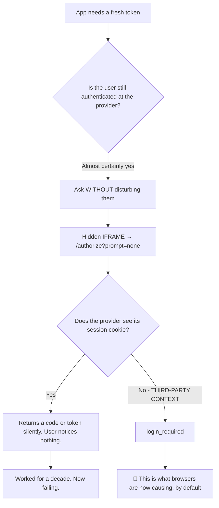
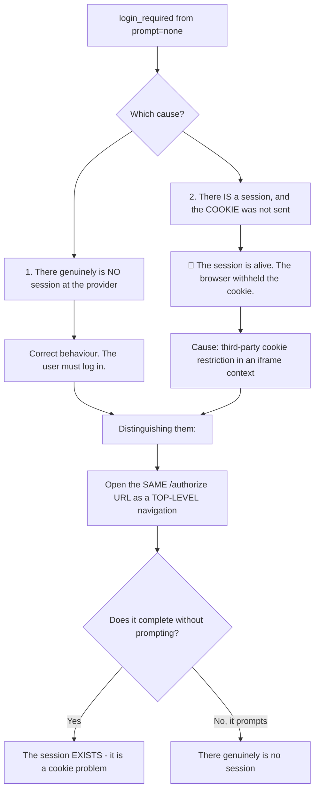
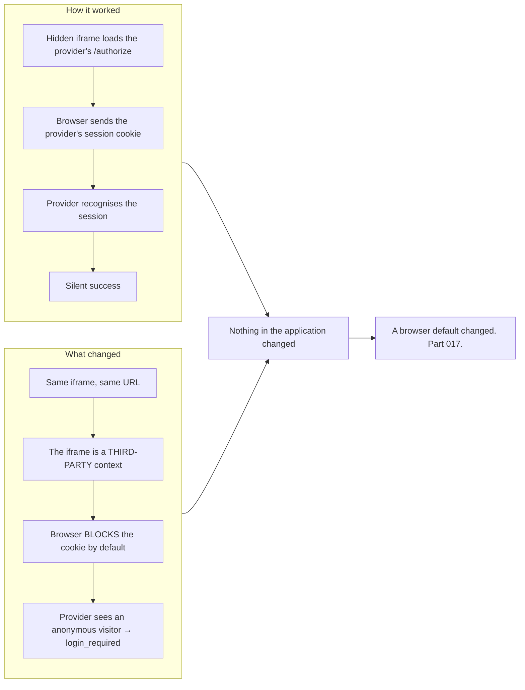
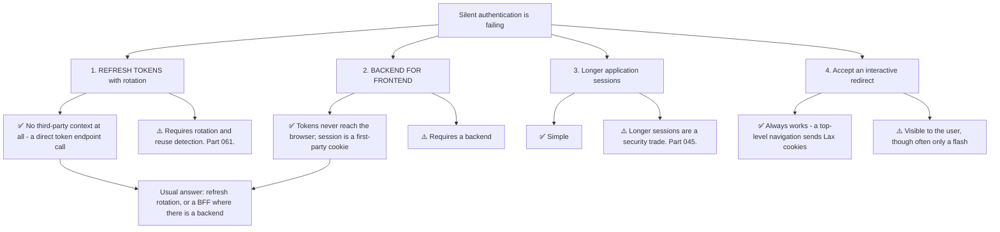
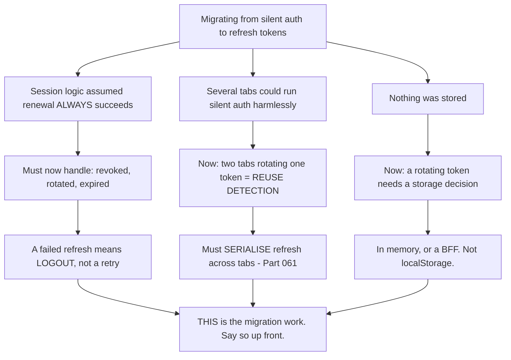
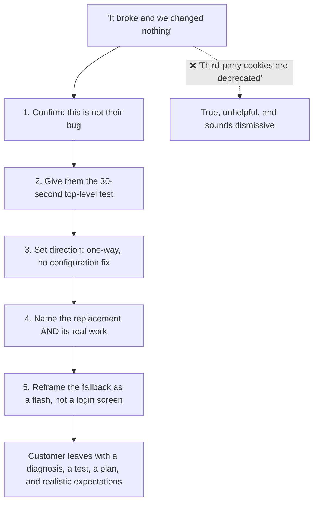
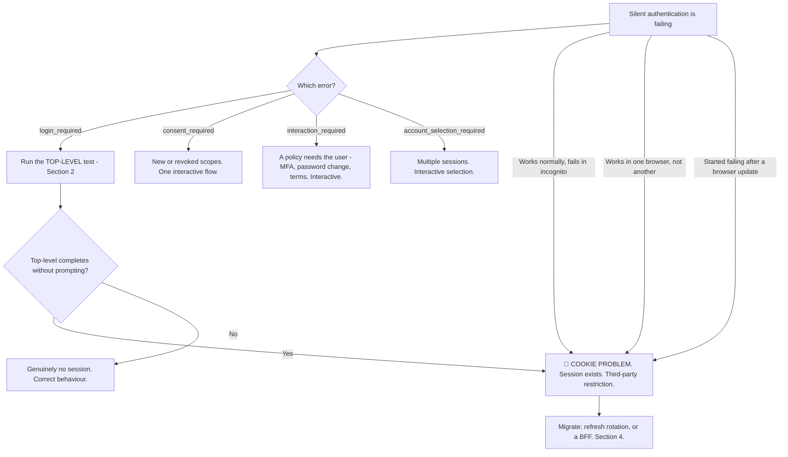

# Part 076 - Silent Authentication, prompt=none, and Cookie Constraints

> Section goal: Understand how applications keep sessions alive without prompting, why that mechanism is being removed by browsers, and what replaces it. This is currently one of the highest-volume "it broke and we changed nothing" ticket categories in identity.

Covers index item **076**. Maps to JD signals: *knowledge of OIDC*, *experience with troubleshooting web applications*, *knowledge of HTTP*, *strong analytical and problem-solving skills*, and *communicate technical concepts clearly*.

---

## 1. Start From Zero: The Problem Silent Auth Solved

An application needs a fresh token. The user is still authenticated at the provider. **Redirecting them away for a full page navigation is disruptive** — so applications asked the provider quietly, in a hidden iframe.

**`prompt=none` means: do not display anything to the user.** If interaction would be required — no session, consent needed, MFA needed — the provider returns an error instead of a page.

> **Analogy.** Glancing through a window to see whether the office is still open, rather than walking in and asking. Efficient — until the window is frosted, and then you learn nothing and cannot tell why.
>
> **Where it stops:** you would notice a frosted window. The iframe request completes normally and returns a legitimate-looking error, which is why the cause is not obvious.

---

## 2. The `prompt` Parameter

| Value | Meaning |
|---|---|
| **`none`** | Display nothing. Error if interaction is needed |
| `login` | Force re-authentication even if a session exists |
| `consent` | Force the consent screen |
| `select_account` | Prompt for account selection |
| *(absent)* | Normal behaviour — prompt if needed |

**The `prompt=none` error family:**

| Error | Means |
|---|---|
| **`login_required`** | No active session at the provider — **or the cookie was not sent** |
| **`consent_required`** | Session exists; consent needed for these scopes |
| **`interaction_required`** | Session exists; something else needs the user — MFA, a policy step |
| `account_selection_required` | Multiple sessions; the user must choose |

### 🔍 Plain-English deep-dive: `login_required` is ambiguous, and that ambiguity is the whole ticket

`login_required` has two entirely different causes with identical presentation:

**That distinguishing test is the single most useful technique in this Part**, and it costs one browser tab: take the exact `/authorize` URL the iframe used, strip `prompt=none`, and open it as a normal top-level navigation. `SameSite=Lax` cookies **are** sent on top-level navigations (Part 014), so if the flow completes without a prompt, the session was there all along.

**Why the ambiguity causes long tickets:** a customer sees `login_required`, reads it as "the user is not logged in," and starts investigating session lifetimes, token expiry, and their own logout logic. **All of that is the wrong layer**, and none of it will find anything.

**The other two errors are less ambiguous and worth recognising:**

| Error | Usually means |
|---|---|
| `consent_required` | A new scope was requested, or consent was revoked — the fix is a one-time interactive flow |
| `interaction_required` | A policy needs the user — MFA enrolment, a password change, a terms acceptance |

**`interaction_required` is worth calling out** because it is frequently the *correct* answer to a genuinely required step, and applications sometimes treat it as a failure and retry silently forever. **The right handling is to fall back to an interactive flow**, not to loop.

**The general handling rule for all four:** any `prompt=none` error means *silent renewal is not possible right now*. The application should fall back to an interactive redirect — not retry, not spin, and not treat it as a fatal error.

**Analogy:** knocking quietly and getting no answer. It could mean nobody is home, or that the door is thicker than it used to be. Knocking properly once settles it. **Where it stops:** a person hears both knocks the same way. Here the two knocks genuinely differ, which is exactly why the top-level test works.

---

## 3. Why It Is Failing

| Browser behaviour | Effect |
|---|---|
| Third-party cookies blocked by default | 🔴 Silent auth fails |
| Private/incognito browsing | 🔴 Fails — a free experiment customers have already run |
| Tracking-prevention features | 🔴 Fails, sometimes selectively |
| Partitioned cookie schemes | ⚠️ Partial; not a general fix |

**The direction is one-way.** No amount of application change restores it, which is why the answer is always migration rather than repair.

---

## 4. What Replaces It

| Replacement | When |
|---|---|
| **Refresh tokens + rotation** | ✅ The default answer for SPAs (Part 061) |
| **Backend for Frontend** | ✅ Best where any backend exists (Part 047) |
| Longer application session | A partial mitigation, with a security cost |
| Interactive redirect fallback | Always needed as the final fallback |

**Option 4 is not a failure state.** A top-level redirect completes and returns, often in a few hundred milliseconds and with no prompt — because `SameSite=Lax` cookies *are* sent. **The user experience is a brief flash, not a login screen**, and framing it that way makes it far more acceptable than "you'll have to log in again."

### 🔍 Plain-English deep-dive: refresh tokens fail differently, and that is the migration work

Moving from silent auth to refresh tokens looks like a small change and is not — **not because refresh is hard, but because it fails in ways silent auth did not.**

| | Silent authentication | Refresh tokens |
|---|---|---|
| Failure mode | Occasional, retryable | **Terminal** — revoked, rotated, expired |
| Correct response to failure | Retry, or fall back | **Treat it as logout** |
| Concurrency | Harmless — several iframes could run | 🔴 **Reuse detection fires** (Part 061) |
| State to manage | None | A token that **changes on every use** |
| Storage | None in the app | In memory, or a BFF (Part 047) |
| Lifetime ceiling | The provider's session | The refresh token's absolute lifetime |

**The concurrency row is the one that surprises people most**, and it produces a distinctive failure: a migration completes, works in testing, and then users start reporting random logouts. **Two tabs refreshing simultaneously rotate the same token, reuse detection reads the second use as theft, and the entire family is revoked** — logging the user out everywhere. Silent auth had no equivalent, because nothing was consumed.

**The failure-handling row produces the second most common post-migration bug:** a client that retries a failed refresh silently, forever. With silent auth that was reasonable — the next attempt might succeed. With refresh tokens the failure is terminal, so the retry loop produces an indefinite spinner and unnecessary provider load. **The correct behaviour is to clear the session and send the user through authentication.**

**Why naming all three up front matters:** a customer told "it's mostly an SDK flag" will hit these in production and lose confidence in everything else you said. **A customer told "the flag is trivial, and here are the three behaviours that change" plans for them** — and the migration finishes.

**The honest summary to give:** *"Requesting `offline_access` and enabling rotation is small. The work is that your session logic currently assumes renewal always succeeds, and refresh tokens can fail terminally, rotate on every use, and break if two tabs refresh at once."*

**Analogy:** swapping a tap you can turn on repeatedly for a ticket machine that issues one ticket at a time and voids the previous. The mechanism is simple; every habit built around the tap has to change. **Where it stops:** you would notice a ticket machine behaving differently. Code carries on doing what it did, and the difference only appears under concurrency and at failure.

---

## 5. Legitimate Uses That Remain

`prompt=none` is not obsolete — its **iframe-based** use is.

| Use | Still viable |
|---|---|
| **Top-level session check on app load** | ✅ Yes — a full navigation sends cookies |
| Silent renewal in an iframe | 🔴 No |
| Checking whether a user is already signed in, before showing a login button | ✅ Yes, as a top-level navigation |
| **Step-up with `prompt=login`** | ✅ Unaffected — it is a deliberate top-level redirect (Part 049) |
| Session Management specification's status iframe | 🔴 Same cookie dependency |

### 🔍 Plain-English deep-dive: how to have this conversation well

This ticket arrives as *"our application broke and we changed nothing,"* and it is one where the customer's framing is entirely correct. **Handling it well matters, because they have often spent days looking in the wrong place.**

**The five things to say, in order:**

**1. "This isn't your bug."** Nothing in their application changed. A browser default changed, and it affects every application using this mechanism. **Say it first**, because they have been searching their own code.

**2. "Here's how to confirm it in thirty seconds."** Open the same `/authorize` URL as a top-level navigation without `prompt=none`. If it completes without prompting, the session exists and the cookie was withheld. **Giving them a test they can run themselves is more convincing than an explanation.**

**3. "It will get worse, not better."** The direction is one-way across all browsers. This is not something to wait out, and there is no configuration that restores it.

**4. "Here is what replaces it."** Refresh tokens with rotation for a SPA, or a backend-for-frontend if they have any backend. Name the real work: refresh tokens fail differently, need cross-tab serialisation, and a failure should mean logout rather than a silent retry (Part 061).

**5. "And the fallback is less bad than it sounds."** An interactive top-level redirect works and is usually a brief flash rather than a login prompt, because the provider's session cookie *is* sent on a top-level navigation.

**Why step 1 matters more than it appears:** a team that has spent a week auditing their own session code is braced to be told they made a mistake. **Opening with "this isn't your bug" changes the entire tone of the engagement**, and it happens to be true.

**And why step 5 matters:** customers resist migration partly because they imagine users being sent to a login screen. **Correcting that specific misconception removes most of the resistance**, because the actual experience is far milder than the one they are picturing.

**Analogy:** a locksmith telling you your key is fine, the lock standard changed, here is how to check, and here is the replacement — rather than saying "that key type is deprecated." Same facts, entirely different outcome. **Where it stops:** a locksmith can fit the new lock. Here the customer does the work, which is why the plan has to be concrete enough to start.

---

## 6. Failure Modes

| Failure mode | What it looks like | Consequence | Correction |
|---|---|---|---|
| **Iframe silent renewal** | Worked for years | 🔴 Failing as cookies are restricted | Refresh rotation or a BFF |
| **Treating `login_required` as no session** | Investigating session lifetimes | Days in the wrong layer | Run the top-level test |
| **Retrying silent auth in a loop** | Endless spinner | Poor UX; provider load | Fall back to interactive |
| **Treating `interaction_required` as fatal** | Login blocked | A required step never completes | Fall back to interactive |
| **`consent_required` unhandled** | Renewal fails after a scope change | Confusing | One interactive flow |
| **Waiting for browsers to reverse** | No action taken | Progressive failure | The direction is one-way |
| **Migrating without cross-tab serialisation** | Random logouts | Reuse detection fires (Part 061) | Serialise refresh |
| **Assuming an interactive redirect means a login screen** | Migration resisted | Unnecessary delay | Usually a brief flash |
| **Lengthening sessions as the whole fix** | Simple | Security trade unexamined (Part 045) | A mitigation, not a solution |
| **Not testing in private browsing** | Missing a free signal | Slow diagnosis | Incognito is a fast experiment |

---

## 7. Troubleshooting Decision Tree: Silent Auth Failures

### Worked example

*"Our SPA logs users out every hour. It started a few weeks ago. We've reviewed our session code and found nothing."*

1. **"Started a few weeks ago, nothing changed, hourly cadence" is the fingerprint.** The hour is the access-token lifetime; the weeks correspond to a browser rollout.
2. **Get a HAR.** Look for a hidden iframe requesting `/authorize` with `prompt=none`, and check `response_type` (Part 072).
3. **Finding:** `prompt=none` in an iframe, returning `login_required`.
4. **Run the top-level test with them.** Take that exact URL, remove `prompt=none`, open it as a normal navigation. **It completes with no prompt.** The session is alive.
5. **Say the important sentence first:** this is not their bug. Their session code is fine — which is why a week of reviewing it found nothing.
6. **Explain the mechanism briefly.** The iframe is a third-party context; the browser now withholds the provider's cookie; the provider sees an anonymous visitor and correctly says `login_required`.
7. **Set the direction.** One-way, across browsers. No configuration restores it.
8. **Give the plan with honest effort:** refresh tokens with rotation. Name the real work — refresh failure should mean logout rather than a silent retry, and concurrent tabs need serialising or reuse detection will fire (Part 061).
9. **Reframe the fallback**, because they will ask: if refresh fails, an interactive top-level redirect is usually a brief flash rather than a login screen, since the provider's cookie *is* sent on a top-level navigation.
10. **Mention the free diagnostic** for next time: private browsing reproduces third-party cookie problems immediately, which turns a multi-day investigation into a two-minute one.

---

## 8. Lab: Silent Auth and Its Replacement

**Purpose.** Make silent authentication work, break it exactly as browsers do, and implement the replacement.

**Prerequisites.** Parts 014, 017, 021, 047, 061, 072 artifacts. A free Auth0 tenant and a SPA on a domain distinct from the tenant.

**Steps.**

1. Create `okta-prep/labs/076-silent-auth/`.
2. **Build iframe silent authentication.** Hidden iframe to `/authorize?prompt=none`, receiving the result via `postMessage` or fragment. **Confirm it works with third-party cookies allowed.**
3. **Capture the HAR.** Record the iframe request and the successful response. **Annotate it.**
4. **Block third-party cookies.** Repeat. **Record the exact error** and confirm it is `login_required`.
5. **Run the top-level test.** Take the same URL, remove `prompt=none`, open it as a top-level navigation. **Confirm it completes without prompting.** **Screenshot both** — this pair is the lab's central artifact.
6. **Private browsing.** Repeat in incognito with default settings. **Record that it fails there too**, and note this as the fastest available diagnostic.
7. **Trigger `consent_required`.** Request a new scope with `prompt=none` after prior consent. **Record the error.**
8. **Trigger `interaction_required`.** Enable an MFA or policy requirement and retry silently. **Record it.**
9. **Handle all four errors.** Extend your client to fall back to an interactive redirect for each, **never retrying silently.** Confirm no loop occurs.
10. **Measure the fallback.** Time an interactive top-level redirect end to end when the session is alive. **Record the duration** — this number is what makes the migration conversation easy.
11. **Implement refresh rotation.** Add `offline_access` and refresh-token rotation (Part 061). **Confirm renewal works with third-party cookies still blocked.**
12. **Add cross-tab serialisation.** Open three tabs, force simultaneous refresh, and **confirm no reuse-detection event** (Part 061).
13. **Refresh failure handling.** Force a refresh failure and **confirm your client treats it as logout**, not as a silent retry.
14. **BFF contrast.** If you have a backend, implement a minimal backend-for-frontend and **confirm renewal works with a first-party cookie** and no tokens in the browser.
15. **Write the guidance.** `silent-auth-migration.md` — one page: why it fails, the top-level test, the replacements, and the five-point customer conversation.
16. **Failure catalog + manifest.** Complete `MANIFEST.md`.

**Expected evidence.** Working iframe silent auth, its failure with cookies blocked, the top-level test screenshotted both ways, private-browsing confirmation, all four `prompt=none` errors triggered and handled, a measured interactive fallback duration, working refresh rotation under blocked cookies, cross-tab serialisation, correct refresh-failure handling, an optional BFF contrast, and one-page guidance.

**Validation rubric.**

| Check | Pass condition |
|---|---|
| Silent auth working | Confirmed with cookies allowed |
| Failure reproduced | `login_required` recorded verbatim |
| Top-level test | Both outcomes screenshotted |
| Private browsing | Failure confirmed |
| Four errors | All triggered and handled without looping |
| Fallback measured | Duration recorded |
| Refresh rotation | Works with cookies blocked |
| Cross-tab | No reuse event |
| Failure handling | Treated as logout |

**Cleanup and privacy.** Lab tenant, synthetic users, your own domains. **Restore browser cookie settings** at the end. Revoke all refresh tokens and delete the application.

---

## 9. JD Mapping

| Supplied JD signal | How this Part supports it |
|---|---|
| **Knowledge of OIDC** | `prompt` semantics and the error family |
| **Experience troubleshooting web applications** | Iframes, cookies, HAR analysis, and a decisive browser test |
| **Knowledge of HTTP** | Third-party context and `SameSite` behaviour |
| Strong analytical and problem-solving skills | Distinguishing two causes of one error in thirty seconds |
| **Communicate technical concepts clearly** | The five-point conversation for a not-your-bug ticket |
| Customer-obsessed attitude | Saying "this isn't your bug" first |
| Promote best practices | Migration with honest effort, and a reframed fallback |

---

## 10. Candidate Honesty Note

- **Claim safety:** *Learned architecture and lab experience*, and a genuinely current topic.
- **The strongest thing you can say:** *"Silent authentication is a hidden iframe requesting `/authorize` with `prompt=none`. It worked because the browser sent the provider's session cookie in the iframe. That iframe is a third-party context, and browsers now block those cookies by default — so the provider sees an anonymous visitor and correctly returns `login_required`. Nothing in the application changed."*
- **A second point, and it is the most useful technique here:** *"`login_required` is ambiguous — it means either there's genuinely no session, or there is one and the cookie wasn't sent. The test takes thirty seconds: open the same `/authorize` URL as a top-level navigation without `prompt=none`. `SameSite=Lax` cookies *are* sent on top-level navigations, so if it completes without prompting, the session was there and it's a cookie problem."*
- **A third, on why the ticket is long:** *"Customers read `login_required` as 'the user isn't logged in' and go looking at session lifetimes, token expiry, and their own logout code. All of that is the wrong layer, which is why they can spend a week and find nothing."*
- **A fourth, on how to open it:** *"I'd say 'this isn't your bug' first. A team that's spent days auditing their own session code is braced to be told they made a mistake, and opening that way changes the whole tone — and it's true."*
- **A fifth, on removing resistance:** *"Customers resist migrating because they picture users being sent to a login screen. The interactive fallback is a top-level navigation, so the provider's cookie *is* sent — it's usually a brief flash rather than a prompt. Correcting that specific misconception removes most of the objection."*
- **A sixth, a free diagnostic:** *"Private browsing reproduces third-party cookie problems immediately. 'Does it fail in incognito?' turns a multi-day investigation into a two-minute one, and it's an experiment the customer can run themselves."*
- **Do not overstate:** you have not migrated a production application off silent auth. Say you have built it, broken it exactly as browsers do, and implemented the replacement in a lab.

---

## 11. Official Source Anchors

Accessed **26 August 2026**.

| Source | What it defines |
|---|---|
| OpenID Connect Core §3.1.2.1 | The `prompt` parameter and its values |
| OpenID Connect Core §3.1.2.6 | `login_required`, `consent_required`, `interaction_required` |
| OpenID Connect Session Management 1.0 | The status iframe — subject to the same cookie constraints |
| IETF RFC 6265bis | `SameSite` and third-party cookie behaviour (Part 014) |
| OAuth 2.0 for Browser-Based Applications | Current guidance on renewal and the BFF pattern |
| Browser vendor documentation on third-party cookie phasing | The external timeline (Part 017) |
| Auth0 documentation — silent authentication and refresh rotation | Vendor guidance and migration paths |
| Okta developer documentation — silent authentication | Okta's position |

**Revalidate after 26 August 2026:** **browser behaviour is the fastest-moving element in this guide.** Recheck browser release notes and vendor migration guidance before any interview.

---

## ⭐ Likely Interview Questions for This Section

### Q1. "What is silent authentication and why is it failing?"
> *Model answer:* "It's an application asking the provider for a fresh token without disturbing the user — a hidden iframe requesting `/authorize` with `prompt=none`, which tells the provider to return an error rather than display anything if interaction would be needed. It worked because the browser sent the provider's session cookie inside that iframe. But an iframe pointing at another domain is a third-party context, and browsers now block those cookies by default. So the provider receives an anonymous request, sees no session, and correctly returns `login_required`. Nothing in the application changed — a browser default did, and the direction is one-way, so there's no configuration that restores it."

### Q2. "A customer gets `login_required` from silent auth. What does it mean?"
> *Model answer:* "It's ambiguous, and that ambiguity is the whole ticket. It means either there genuinely is no session at the provider, or there is one and the cookie wasn't sent. The test takes thirty seconds: take the exact same `/authorize` URL, remove `prompt=none`, and open it as a top-level navigation. `SameSite=Lax` cookies are sent on top-level navigations but not in a third-party iframe, so if the flow completes without prompting, the session was alive all along and this is a cookie problem. Customers usually read the error as 'the user isn't logged in' and go looking at session lifetimes and token expiry, which is the wrong layer — that's why these tickets run long."

### Q3. "What replaces silent authentication?"
> *Model answer:* "Refresh tokens with rotation for a SPA, because a refresh is a direct call to the token endpoint with no third-party context involved. Or a backend-for-frontend where any backend exists, which is better still — tokens never reach the browser and the session is a first-party cookie. Longer application sessions are a partial mitigation with a security cost rather than a solution. And an interactive redirect is always needed as the final fallback. I'd name the real work in the refresh migration rather than calling it a config change: refresh failure should mean logout rather than a silent retry, and concurrent tabs need serialising or reuse detection fires and logs everyone out."

### Q4. "How do you handle the four `prompt=none` errors?"
> *Model answer:* "All four mean the same operational thing — silent renewal isn't possible right now — so all four should fall back to an interactive redirect rather than retrying. `login_required` is either no session or a blocked cookie, and the top-level test distinguishes them. `consent_required` means new or revoked scopes, fixed by one interactive flow. `interaction_required` means a policy needs the user — MFA enrolment, a password change, terms acceptance — and it's often the *correct* answer to a genuinely required step, so applications that treat it as fatal or retry silently block the user forever. `account_selection_required` means multiple sessions and needs interactive selection. The anti-pattern across all four is the silent retry loop: an endless spinner and unnecessary provider load."

### Q5. "A customer says their app broke and they changed nothing. How do you handle it?"
> *Model answer:* "Take it at face value, because in this case it's true. I'd say 'this isn't your bug' first — a team that's spent a week auditing their own session code is braced to be told they made a mistake, and opening that way changes the tone. Then give them the thirty-second top-level test so they can confirm it themselves, which is more convincing than any explanation. Then set the direction: one-way across browsers, no configuration fix, so it will get worse. Then the replacement with honest effort. And finally reframe the fallback, because they're picturing users being sent to a login screen when it's actually a brief flash. Those five things in that order turn a frustrating ticket into a plan."

### Q6. "Is `prompt=none` obsolete?"
> *Model answer:* "The iframe use is; the parameter isn't. As a top-level navigation it still works fine, because `SameSite=Lax` cookies are sent — so checking whether a user is already signed in on application load, before deciding whether to show a login button, is still perfectly viable. What's dead is using it inside a hidden iframe for silent renewal, and the same applies to the Session Management specification's status iframe, which has an identical cookie dependency. And the other `prompt` values are unaffected: `prompt=login` for forcing re-authentication in step-up is a deliberate top-level redirect, so browser cookie policy doesn't touch it."

### Q7. "Why does incognito mode matter for diagnosing this?"
> *Model answer:* "Because it blocks third-party cookies by default, so it reproduces the problem instantly and for free — and customers have often already run the experiment without realising what it means. 'Works normally, fails in incognito' is close to conclusive for a third-party cookie dependency, and asking that one question can turn a multi-day investigation into a two-minute one. The same signal appears as 'works in Chrome but not Safari' or 'started failing after a browser update.' All three are the same underlying cause, and recognising the family means you don't have to diagnose each one from scratch."

### Q8. "What's the honest effort of migrating to refresh tokens?"
> *Model answer:* "The mechanical part is small — request `offline_access`, enable rotation, and use the SDK's refresh path. The real work is that refresh tokens fail differently from silent auth. Silent auth either worked or you retried; refresh tokens can be revoked, they rotate so the old one dies, and a failure means the user should be logged out rather than retried — so session logic built around 'renewal always succeeds' needs revisiting. Concurrent tabs need serialising, or two tabs rotating the same token triggers reuse detection and logs the user out of everything. And storage matters: in memory rather than `localStorage`, or a BFF if they have any backend. I'd name all of that up front, because calling it a config change loses trust the moment they start."

---

## 🧠 30-Second Memory Hooks

- **Silent auth = hidden iframe → `/authorize?prompt=none`.**
- **`prompt=none` = display nothing; error instead of a page.**
- **Four errors:** `login_required` · `consent_required` · `interaction_required` · `account_selection_required`.
- **ALL four mean: fall back to INTERACTIVE.** Never retry silently.
- **`login_required` is AMBIGUOUS:** no session **or** the cookie was withheld.
- **THE TEST (30 seconds):** same URL, **no `prompt=none`, top-level navigation**. Completes = the session exists.
- **`SameSite=Lax` IS sent on top-level navigations, NOT in an iframe.**
- **It is failing because a BROWSER DEFAULT changed.** One-way. No config fix.
- **"Works normally, fails in incognito" ≈ conclusive.**
- **Replacements:** **refresh rotation** · **BFF** · longer sessions (a trade) · interactive fallback.
- **The interactive fallback is a FLASH, not a login screen.** Say that.
- **Say "this isn't your bug" FIRST.**

---

## ✅ Completion Checklist

- [ ] **Knowledge:** I can explain why silent auth fails, name all four errors, and describe the top-level test.
- [ ] **Lab artifact:** `076-silent-auth/` contains working then failing silent auth, the top-level test screenshotted both ways, all four errors handled, working refresh rotation under blocked cookies, and one-page guidance.
- [ ] **Spoken:** I can run the five-point conversation in 90 seconds.
- [ ] **Judgement:** I say "this isn't your bug" first and reframe the fallback as a flash.
- [ ] **Currency check:** I have checked browser third-party cookie status **recently**, not from memory.
- [ ] **Source check:** I have read OIDC Core §3.1.2.1 and §3.1.2.6 myself.

---

*Next suggested section:* **[Part 077 - Social and Enterprise Federation via OIDC](Part-077-social-and-enterprise-federation-via-oidc.md)** — connecting external identity providers, and the differences between consumer and enterprise federation.
