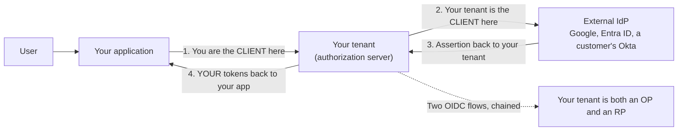
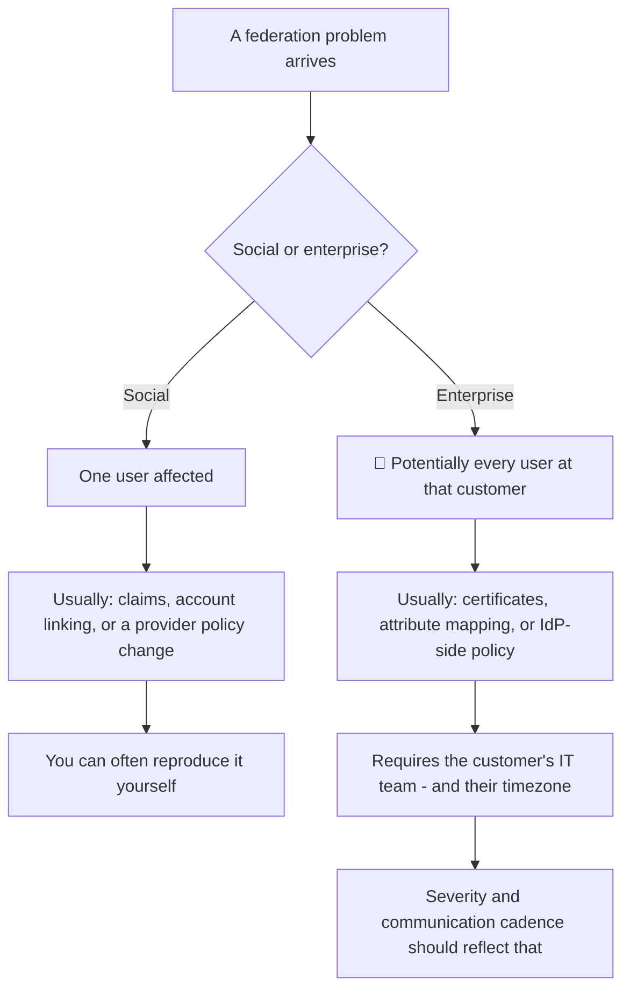
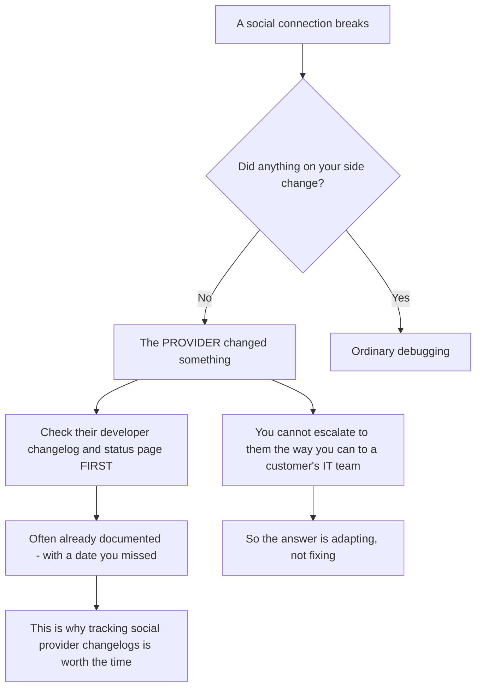
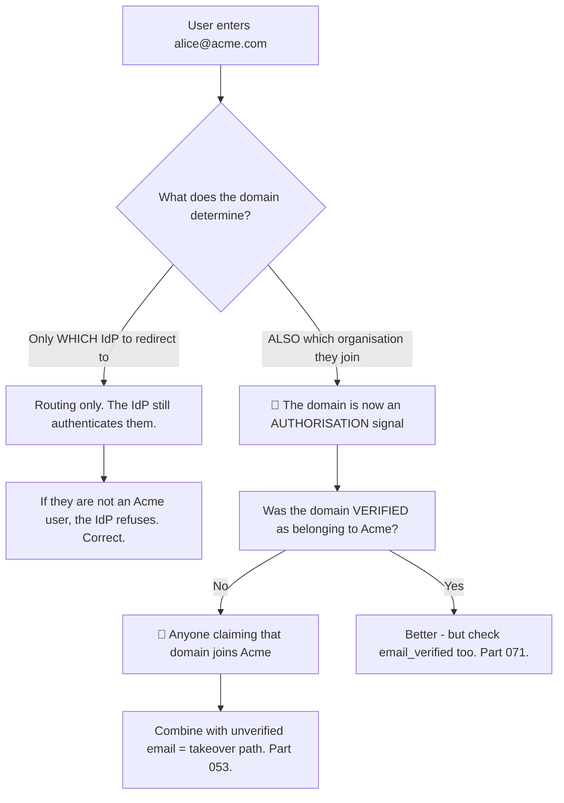
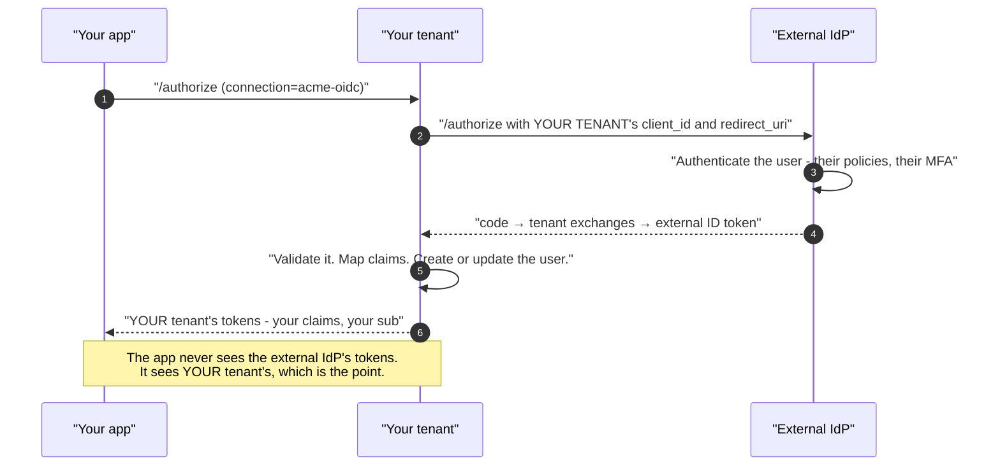
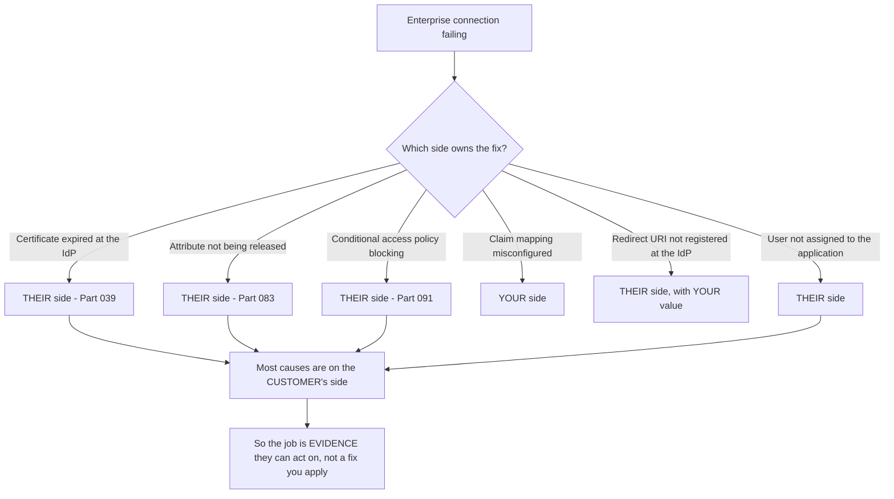
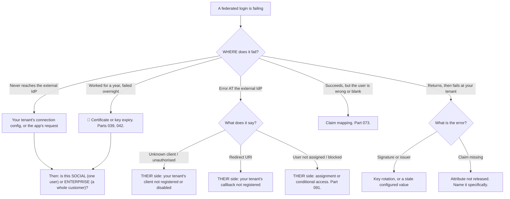

# Part 077 - Social and Enterprise Federation via OIDC

> Section goal: Understand how external identity providers are connected via OIDC, and the real differences between consumer social login and enterprise federation. These look similar in configuration and behave very differently in support.

Covers index item **077**. Maps to JD signals: *knowledge of OIDC*, *knowledge of authentication and authorization*, *experience with troubleshooting web applications*, *strong analytical and problem-solving skills*, and *communicate technical concepts clearly*.

---

## 1. Start From Zero: Your Provider Becomes a Client

When you connect an external identity provider, your authorization server plays **two roles at once**.

**The consequence that matters in support:** a failure can be in **either** flow, and the symptoms look similar. **Establishing which hop failed is the first move** — and it maps directly to Part 048's "where does it fail" question.

| Hop | Failure looks like |
|---|---|
| App → your tenant | Standard OAuth/OIDC errors (Parts 069, 071) |
| Your tenant → external IdP | An error at the external provider, or on return to your tenant |
| External IdP → your tenant | Assertion or claim problems (Part 073) |
| Your tenant → app | Claim mapping, or the user record |

> **Analogy.** A translator who both takes your request and asks a third party on your behalf. If the answer is wrong, you must establish whether they misheard you or misheard them.
>
> **Where it stops:** a translator can be asked. Here both hops fail with similar-looking errors, which is why locating the hop has to be deliberate.

---

## 2. Social Versus Enterprise

They look alike in configuration and differ in almost every operational respect.

| | **Social connection** | **Enterprise connection** |
|---|---|---|
| Provider | Google, Apple, GitHub, Facebook | Entra ID, Okta, Ping, ADFS, or a SAML IdP |
| Who configures it | **You**, once, for everyone | **You and the customer's IT team**, per customer |
| Users | Consumers, self-registering | Employees, managed |
| Email verified | Varies — **often not guaranteed** | Usually yes |
| Claims | A small, fixed set | Whatever the attribute mapping produces (Part 083) |
| Deprovisioning | ❌ None — the user simply stops signing in | ✅ Via the IdP, plus SCIM (Part 094) |
| Home-realm discovery | Not needed — the user picks | ✅ Needed — route by email domain |
| Failure blast radius | One user | 🔴 **An entire customer** |
| Who you talk to when it breaks | The end user | **The customer's identity team** |

**The bottom-right path is the operational point.** An enterprise connection failure is a customer-wide outage, involves a second organisation, and cannot be reproduced without them. **Treating it with the same urgency as a single social-login ticket is a mistake**, and so is the reverse.

### 🔍 Plain-English deep-dive: social providers change without telling you

Enterprise connections break because a certificate expires or a policy changes — events with an owner you can contact. **Social connections break because a company you have no relationship with changed a product decision.**

| Change a social provider might make | Effect on you |
|---|---|
| Stop releasing `email` by default | Account matching breaks for new users |
| Introduce a **private relay address** | The email is real, unique, and not the user's actual address |
| Require a new consent step or scope review | Existing consents may be reset |
| Change `sub` semantics or format | 🔴 Rare and catastrophic — identities no longer match |
| Deprecate an endpoint or API version | Connection fails on a published date |
| Tighten branding or naming requirements | Consent screens rejected until updated |

**The relay-address case is worth knowing specifically**, because it produces a confusing and increasingly common ticket. Some providers issue a per-application relay address rather than the user's real one. The address is genuine and deliverable, and it is **different from the address the same person uses everywhere else** — so account matching on email creates a second account (Part 071), and the user reports that their data has disappeared.

**The `sub` row is the one that would be catastrophic** and is thankfully rare. If a provider changed how `sub` is derived, every existing user would arrive as a new identity. **It is worth knowing that this is the risk you are accepting** when you key on `(iss, sub)` from a third party you do not control.

**What this changes about how you work:**

| Enterprise connection | Social connection |
|---|---|
| Escalate to the customer's IT team | **Nobody to escalate to** |
| Root cause is usually configuration | Root cause is often a **product decision** |
| Fix is on one side or the other | Fix is **adapting to a new reality** |
| Prevention: metadata URLs, monitoring | Prevention: **tracking changelogs** |

**The practical habit:** when a social connection breaks with no change on your side, **read the provider's developer changelog and status page before debugging anything.** The answer is frequently already published, with a date that was announced and missed.

**Analogy:** a supplier who changes their packaging without telling their customers, versus a colleague in another department who can be phoned. One is a conversation; the other is a newsletter you should have been reading. **Where it stops:** a packaging change is visible on arrival. A claim quietly disappearing from a token is visible only to whoever is looking for it.

---

## 3. Home-Realm Discovery

With enterprise connections, the application must decide **which** IdP to send a user to.

| Approach | How | Trade |
|---|---|---|
| **Email domain** | User enters an email; route by domain | ✅ Familiar. ❌ Needs domain verification |
| **Organisation selector** | User picks or arrives via an org-specific URL | ✅ Explicit. ❌ Extra step |
| **Subdomain per customer** | `acme.app.example.com` | ✅ Clean. ❌ Infrastructure work |
| **`login_hint`** | The application passes a hint | ✅ Smooth when known |
| **Connection parameter** | The application names the connection directly | ✅ Deterministic |

### 🔍 Plain-English deep-dive: domain-based routing is an authorisation decision in disguise

*"Anyone with an `@acme.com` email goes to Acme's identity provider"* is a routing rule. **It is also, silently, a statement about who belongs to Acme** — and if the same rule grants organisation membership, it becomes an authorisation control that was never designed as one (Part 104).

**Routing alone is safe**, and this is worth being clear about: sending `alice@acme.com` to Acme's IdP does not grant anything. If Alice is not an Acme user, Acme's IdP refuses to authenticate her. **The domain chose a door; the door still checks.**

**The risk appears when the domain also grants membership** — "auto-join by domain," a common and genuinely useful B2B convenience. Then two things must both be true:

1. **The domain is verified** as belonging to that organisation, by a process the customer completed.
2. **The email is verified** at the point of use — `email_verified`, not just an address in a claim (Part 071).

**Without both, the pattern is a takeover path**: someone asserting an `@acme.com` address at any federated provider joins Acme's tenant.

**A second, quieter problem worth raising:** users with a personal address at a company using enterprise SSO. `alice@gmail.com` working at Acme does not match the domain rule, so she cannot be routed — and the answer is usually an explicit invitation flow rather than domain matching (Part 053).

**And a third that generates real tickets:** organisations with **several** domains — acquisitions, country domains, legacy brands. A rule written for one domain silently excludes users on the others, and the symptom is *"some of our staff can't log in"* with no obvious pattern until someone notices it follows their email domain.

**The support question that finds all three:** *"How does the system decide which identity provider a user goes to, and does that decision grant them anything?"*

**Analogy:** a receptionist directing visitors by which company is on their business card. Directing is harmless — the company still checks them at their own door. Issuing a pass based on the card alone is not. **Where it stops:** a receptionist can see the person. A domain match is a string comparison, and strings are easy to assert.

---

## 4. Connecting an OIDC Provider

| Value | Direction | Notes |
|---|---|---|
| **Issuer / discovery URL** | IdP → you | Everything else can be fetched from it (Part 057) |
| **Client ID and secret** | IdP → you | Your tenant is the client here |
| **Redirect URI** | You → IdP | Your tenant's callback — **registered exactly** (Part 065) |
| **Scopes** | You → IdP | Determines which claims you receive |
| **Claim mapping** | Configuration | External claims → your user profile (Part 073) |

**The note at the bottom is the architectural benefit:** the application integrates once, with one provider, and every external IdP is normalised behind it. **A customer adding a new enterprise connection requires no application change at all** — which is the main reason to use a broker rather than integrating each IdP directly.

---

## 5. What Changes for Support

### 🔍 Plain-English deep-dive: an enterprise connection failure is a two-organisation incident

A social connection breaks and you debug it. An enterprise connection breaks and **the fix may be in a system you cannot see, owned by people you have not met, in another timezone.**

**Most causes sit with the customer**, which changes what a good response looks like. **Your deliverable is often not a fix — it is a precise, actionable evidence pack** for their identity team.

**What makes that pack good:**

| Element | Why |
|---|---|
| **A timestamp with timezone** | Their IdP logs are searchable by time (Part 069) |
| **The exact error and description** | Removes ambiguity about which failure |
| **What your side sent** | The authorization request, the client ID, the redirect URI |
| **What your side received** | The decoded assertion or ID token, claims listed, **signature stripped** |
| **What is missing or wrong**, named specifically | "`email` was not present" beats "attributes are wrong" |
| **What you need them to check** | One or two specific things, not a list of possibilities |
| **A correlation ID** | If either system provides one |

**Two things that make the difference between a two-day and a two-week resolution:**

**1. Name the specific thing, not the category.** *"The assertion contained `givenName` and `surname` but not `email`, and our connection expects `email`"* is directly actionable. *"There's an attribute mapping problem"* invites investigation.

**2. Say which side you believe owns it, and why — with the evidence attached.** Being wrong occasionally is fine; being vague guarantees a round trip. **Customers respect a clear, evidenced hypothesis far more than a neutral summary.**

**And the communication cadence matters more here** than on a single-user ticket. An enterprise connection failure is a customer-wide outage involving two organisations, so **proactive updates on a stated schedule** — even "no change yet, still waiting on their team" — prevent escalation far more effectively than a faster technical answer.

**Analogy:** a plumber establishing that the leak is on the water company's side. The useful deliverable is not a repair — it is a clear account of what was tested, what was found, and exactly what the water company needs to look at. **Where it stops:** a plumber can point at a pipe. You are describing a system you cannot see, which is why naming the specific missing value matters so much.

---

## 6. Failure Modes

| Failure mode | What it looks like | Consequence | Correction |
|---|---|---|---|
| **Not locating the hop** | Debugging the wrong flow | Wasted time | App→tenant or tenant→IdP first |
| **Social email assumed verified** | Works, then a takeover | 🔴 Account takeover (Part 071) | Check `email_verified` |
| **Domain routing granting membership** | Convenient | 🔴 Unverified-domain join (Part 104) | Verify domain **and** email |
| **Single-domain rule at a multi-domain customer** | "Some staff can't log in" | Confusing partial failure | Support several domains |
| **No path for personal addresses** | Users excluded | Blocked onboarding | Invitation flow |
| **Certificate or key expiry at the IdP** | Worked a year, died overnight | 🔴 Customer-wide outage | Metadata URL (Part 048) |
| **Attribute not released** | Blank profiles | Bad data, silent | Name the specific attribute |
| **Enterprise failure treated as low severity** | Slow response | 🔴 A customer-wide outage | Severity reflects blast radius |
| **Vague evidence to the customer's team** | Round trips | Days lost | Specific, actionable pack |
| **No proactive updates** | Silence during a two-org incident | Escalation | Stated cadence |
| **JIT with no deprovisioning** | Accounts persist | Audit gap (Part 048) | SCIM (Part 094) |
| **Assuming social providers are stable** | Provider changes a policy | Sudden breakage | Track provider changelogs |

---

## 7. Troubleshooting Decision Tree: Federation Failures

### Worked example

*"A customer's employees stopped being able to log in this morning. It worked yesterday. Only that customer is affected."*

1. **"One customer, sudden, nothing changed" is an enterprise connection failure**, and the blast radius is every user at that customer. **Set severity accordingly, and say so in the first response.**
2. **Locate the hop.** Ask where it breaks: before the customer's login page, after entering credentials, or on return. Answer: on return to your tenant.
3. **Get the exact error.** Signature validation failed.
4. **Two candidates:** the IdP rotated its signing key, or a configured certificate expired.
5. **Check your side.** The connection uses a **pasted certificate** rather than a metadata URL. **That is the cause** (Part 048) — a scheduled outage with no alarm attached.
6. **Immediate action:** fetch the IdP's current key material and update the connection. **Restore service first, explain after.**
7. **Then the durable fix:** switch to the metadata or discovery URL so rotation is picked up automatically.
8. **Then widen it, because this is the valuable part:** how many other enterprise connections use pasted certificates? There are usually several, with different expiry dates, none monitored. **Offering to audit that is worth more than this fix.**
9. **Communicate on a cadence**, because two organisations are involved and the customer's IT team may be engaged. Even "restored, root cause confirmed, prevention in progress" at a stated interval prevents escalation.
10. **Write it up** with the expiry date, the fix, the prevention, and the audit recommendation (Part 115).

---

## 8. Lab: Connect Both Kinds

**Purpose.** Configure a social and an enterprise connection, compare their behaviour, and practise the evidence pack.

**Prerequisites.** Parts 048, 071, 073 artifacts. A free Auth0 tenant, a social provider, and a second identity source — a free Entra tenant or another Auth0 tenant acting as an external OIDC IdP.

**Steps.**

1. Create `okta-prep/labs/077-federation/`.
2. **Draw the two chained flows** before configuring anything — application to tenant, tenant to external IdP. **Label which role your tenant plays in each.**
3. **Configure a social connection.** Sign in with a synthetic account. **Capture a HAR** and identify both hops.
4. **Record the claims** the social provider returns, including whether `email_verified` is present and its value. **This is §3's risk, evidenced.**
5. **Configure an enterprise OIDC connection** to your second identity source. Record every value exchanged and its direction (Part 048).
6. **Sign in through it.** Capture a HAR and identify both hops. **Compare the claim set** to the social connection's.
7. **Compare the resulting users.** Look at the two user records in your tenant: `sub` format, claims populated, connection recorded. **Build a comparison table.**
8. **Break hop two — client registration.** Use a wrong client ID for the external IdP. **Record where the error appears** — at the external IdP, before its login page.
9. **Break hop two — redirect URI.** Unregister your tenant's callback at the external IdP. **Record the error and its location.**
10. **Break the return — claim mapping.** Change an expected attribute name. **Record whether login fails or silently creates a user with missing data.** The silent case is the dangerous one.
11. **Break the return — signature.** Point the connection at wrong key material. **Record the error.** This is the §7 worked example.
12. **Home-realm discovery.** Implement domain-based routing. **Then test a user whose email domain does not match** and record the experience. Then test a **second domain** for the same organisation and record whether it works.
13. **Write the evidence pack.** For the hop-two redirect failure, write the message you would send the customer's identity team — timestamp with timezone, exact error, what you sent, what you received, the specific thing to check. **Half a page maximum.**
14. **Deprovisioning contrast.** Disable the user at the external IdP. Confirm login fails, then **confirm the user record still exists in your tenant** (Part 048).
15. **Write the guidance.** `federation-support.md` — one page: the two hops, social versus enterprise operational differences, and the evidence-pack template.
16. **Failure catalog + manifest.** Complete `MANIFEST.md`.

**Expected evidence.** A two-hop diagram drawn from memory, both connections working with HARs, a claim comparison including `email_verified`, a user-record comparison, four deliberate breakages with error locations recorded, home-realm routing with two negative cases, a half-page evidence pack, a demonstrated deprovisioning gap, and one-page guidance.

**Validation rubric.**

| Check | Pass condition |
|---|---|
| Two-hop diagram | Drawn before configuring; roles labelled |
| Both connections | Working, with HARs identifying both hops |
| Claim comparison | Including `email_verified` presence and value |
| Four breakages | Error **and location** recorded for each |
| Silent claim failure | Observed and flagged |
| Home-realm routing | Non-matching domain and second domain both tested |
| Evidence pack | Half a page, specific and actionable |
| Deprovisioning gap | User record persists after IdP disable |

**Cleanup and privacy.** Lab tenants and synthetic users only. **Never configure a federation against your employer's tenant or any customer's directory.** Delete both connections, all users, and both applications at the end.

---

## 9. JD Mapping

| Supplied JD signal | How this Part supports it |
|---|---|
| **Knowledge of OIDC** | Chained flows and the broker pattern |
| Knowledge of authentication and authorization | Domain routing as a disguised authorisation decision |
| **Experience troubleshooting web applications** | Two-hop HAR analysis |
| Strong analytical and problem-solving skills | Locating the failing hop first |
| **Communicate technical concepts clearly** | An evidence pack another organisation can act on |
| Collaborate across teams | Working with a customer's identity team |
| **Ownership from start to resolution** | Severity matching blast radius; proactive cadence; widening the audit |

---

## 10. Candidate Honesty Note

- **Claim safety:** *Learned architecture and lab experience*, with genuine adjacent background — Entra ID and Active Directory work is the IdP side of this.
- **The strongest thing you can say:** *"When you connect an external identity provider, your tenant is both an OpenID Provider to your application and a Relying Party to the external IdP. There are two chained flows, and the first thing I establish is which hop failed — before the external login page, at it, or on return — because the symptoms look similar and the owners are different."*
- **A second point, on the operational difference:** *"A social connection failure is one user; an enterprise connection failure is potentially every user at a customer, involves a second organisation, and usually cannot be reproduced without them. Severity and communication cadence should reflect that — proactive updates on a stated schedule prevent escalation better than a faster technical answer."*
- **A third, and it changes what a good response is:** *"Most enterprise federation causes sit on the customer's side — certificate expiry, an attribute not released, a conditional access policy, a user not assigned. So my deliverable is often an evidence pack rather than a fix: timestamp with timezone, the exact error, what we sent, what we received decoded with the signature stripped, the specific missing value named, and one or two things for them to check."*
- **A fourth, on precision:** *"Naming the specific thing beats naming the category. 'The assertion contained `givenName` and `surname` but not `email`' is actionable; 'there's an attribute mapping problem' invites a week of investigation."*
- **A fifth, on a design risk:** *"Domain-based routing is safe when it only chooses which IdP to redirect to — the IdP still authenticates them. It becomes an authorisation control when the domain also grants organisation membership, and then the domain must be verified *and* `email_verified` checked at the point of use, or anyone asserting that address anywhere joins the tenant."*
- **A sixth, a recurring ticket:** *"Organisations with several domains — acquisitions, country domains, legacy brands — break single-domain routing rules, and the symptom is 'some of our staff can't log in' with no pattern until someone notices it follows their email domain."*
- **Do not overstate:** you have not supported production enterprise federations. Say you understand both hops and have configured both connection types in a lab.

---

## 11. Official Source Anchors

Accessed **26 August 2026**.

| Source | What it defines |
|---|---|
| OpenID Connect Core | The flow used on both hops |
| OpenID Connect Discovery | Fetching the external IdP's configuration (Part 057) |
| OpenID Connect Core §5.1 | `email_verified` and the standard claims |
| Auth0 documentation — social and enterprise connections | Vendor configuration for both types (Part 101) |
| Okta documentation — identity providers | Okta's inbound federation model |
| Microsoft Entra ID documentation — OIDC applications | The most common enterprise IdP you will meet (Part 091) |
| IETF RFC 7644 (SCIM) | Deprovisioning the federation gap (Part 094) |
| Provider developer changelogs | Social provider policy changes |

**Revalidate after 26 August 2026:** protocol layers are stable. **Social provider policies change without notice** — track their changelogs, and recheck vendor connection configuration surfaces.

---

## ⭐ Likely Interview Questions for This Section

### Q1. "What happens architecturally when you add an external identity provider?"
> *Model answer:* "Your authorization server takes on two roles simultaneously. To your application it's the OpenID Provider — the application redirects there and receives your tenant's tokens. To the external IdP it's a Relying Party — your tenant redirects there with its own client ID and its own registered redirect URI. So there are two chained OIDC flows. The benefit is that your application integrates once and every external provider is normalised behind it, so a customer adding a new enterprise connection needs no application change at all. The support consequence is that a failure can be in either flow with similar-looking symptoms, so locating the hop is the first move."

### Q2. "How do social and enterprise connections differ operationally?"
> *Model answer:* "Almost everywhere except the configuration screen. Social connections are configured once by you for everyone, users self-register, email verification varies and often isn't guaranteed, and there's no deprovisioning — a user just stops signing in. Enterprise connections are configured per customer with their IT team, users are managed, attributes come from an attribute mapping, and deprovisioning works through the IdP plus SCIM. The differences that matter most in support are blast radius and ownership: a social failure is one user I can usually reproduce myself, while an enterprise failure is potentially every user at that customer, involves a second organisation, and often can't be reproduced without them. Severity and communication cadence should reflect that."

### Q3. "An enterprise connection breaks. What's your first move?"
> *Model answer:* "Establish where it fails — before the customer's login page, at it, or on return to our tenant — because that maps directly to who owns the fix. Before the login page usually means our connection configuration or their registration of our client. At their login page means their side: user not assigned, a conditional access policy, or our redirect URI not registered with them. On return means signature, issuer, or claim problems. Then I'd set severity based on blast radius, because this is a customer-wide outage rather than a single ticket. And because most causes are on their side, my deliverable is usually an evidence pack rather than a fix — timestamp with timezone, exact error, what we sent, what we received, and the specific thing for them to check."

### Q4. "What makes a good evidence pack for a customer's identity team?"
> *Model answer:* "Specificity, and naming which side you think owns it. A timestamp with timezone so they can search their logs. The exact error and description rather than a paraphrase. What our side sent — the authorization request, client ID, redirect URI. What we received, decoded with the signature stripped, with the claims listed. The specific missing or wrong value named — '`email` was not present in the assertion' rather than 'attribute mapping looks wrong'. And one or two things for them to check, not a list of possibilities. The last part matters: a clear, evidenced hypothesis about which side owns it gets acted on. A neutral summary of everything gets a round trip, and with two organisations and possibly two timezones involved, each round trip is a day."

### Q5. "Is routing users by email domain safe?"
> *Model answer:* "As routing, yes — sending `alice@acme.com` to Acme's IdP grants nothing, because Acme's IdP still authenticates her, and if she isn't an Acme user it refuses. The domain chose a door; the door still checks. It becomes unsafe when the domain *also* grants organisation membership, which is a common B2B convenience — then it's an authorisation control that was never designed as one. Two things must both hold: the domain is verified as belonging to that organisation through a process the customer completed, and `email_verified` is checked at the point of use rather than just reading an address from a claim. Without both, anyone asserting an `@acme.com` address at any federated provider joins Acme's tenant."

### Q6. "A customer says some of their staff can't log in, with no pattern."
> *Model answer:* "I'd suspect it follows their email domain. Organisations frequently have several — acquisitions, country domains, legacy brands after a rebrand — and a home-realm discovery rule written for one silently excludes users on the others. It looks patternless from outside because nobody thinks of email domain as a variable. I'd ask for a few affected addresses and a few working ones and compare the domains, which usually settles it in one message. The related case is users with personal addresses — someone at Acme using a personal email doesn't match any domain rule, and the right answer there is an invitation flow rather than trying to make domain matching cover it."

### Q7. "A customer's SSO worked for a year and broke overnight. What do you check?"
> *Model answer:* "Certificate or signing key expiry, almost certainly — 'worked a long time, failed suddenly, nothing changed' is the fingerprint of something time-based. I'd locate the hop first; a signature error on return points straight at it. The usual finding is a manually pasted certificate rather than a metadata or discovery URL, which is an outage with a known date and no alarm attached. Immediate fix is updating the key material to restore service. The durable fix is switching to the metadata URL so rotation is picked up automatically. And then the valuable part: asking how many other enterprise connections were configured the same way, because there are usually several with different expiry dates and none monitored. Offering to audit that is worth more than this fix."

### Q8. "Why use a broker rather than integrating each IdP directly?"
> *Model answer:* "Because the application integrates once and never changes again. Every external provider — a social login, a customer's Entra ID, another customer's Okta, a SAML IdP — is normalised behind one OIDC integration, so the application always receives your tenant's tokens with your claim shapes and your `sub`. Adding a new enterprise customer becomes a configuration task with no code change and no release. You also get one place for claim mapping, one place for account linking, one set of logs, and one session model. The cost is a second hop to reason about when something breaks, and a dependency on the broker — but for anything B2B with multiple customer IdPs, integrating each one directly doesn't scale past a handful."

---

## 🧠 30-Second Memory Hooks

- **Your tenant is BOTH an OP (to your app) and an RP (to the external IdP).** Two chained flows.
- **First move: WHICH HOP failed?** Before the IdP page · at it · on return.
- **Social = one user. Enterprise = a whole customer, and a second organisation.**
- **Most enterprise causes are on the CUSTOMER's side.** Your deliverable is an **evidence pack**.
- **Name the SPECIFIC value, not the category.** "`email` was absent" beats "mapping problem."
- **Include a TIMEZONE.** Their IdP logs are searched by time.
- **Domain ROUTING is safe. Domain-based MEMBERSHIP is an authorisation control.**
- **Needs both: verified DOMAIN and `email_verified` at the point of use.**
- **Multi-domain customers break single-domain rules** — "some staff can't log in."
- **"Worked a year, died overnight" = certificate or key expiry.** Metadata URL, not a pasted value.
- **Enterprise failures need a stated UPDATE CADENCE**, not just a faster fix.
- **A broker means the app integrates ONCE.** New customers are configuration, not code.

---

## ✅ Completion Checklist

- [ ] **Knowledge:** I can describe both hops, the social-versus-enterprise operational differences, and the domain-routing risk.
- [ ] **Lab artifact:** `077-federation/` contains both connections working with HARs, a claim comparison, four breakages with error locations, home-realm negative cases, and a half-page evidence pack.
- [ ] **Spoken:** I can locate a failing hop in 30 seconds and describe a good evidence pack in 45.
- [ ] **Judgement:** I set severity by blast radius and commit to an update cadence for two-organisation incidents.
- [ ] **Honesty check:** I claim Entra/AD background on the IdP side and lab experience on the broker side.
- [ ] **Source check:** I have read OIDC Core §5.1 and my vendor's enterprise connection documentation myself.

---

*Next suggested section:* **[Part 078 - Choosing Between OAuth, OIDC, and SAML](Part-078-choosing-between-oauth-oidc-and-saml.md)** — the decision customers actually face, and how to advise on it without dogma.
