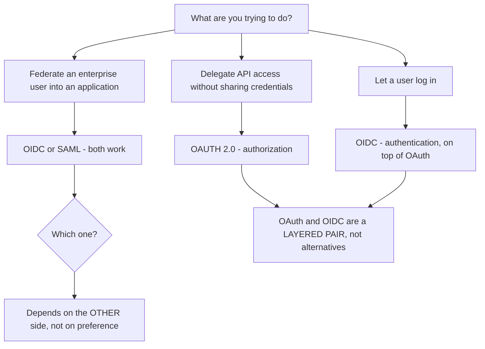
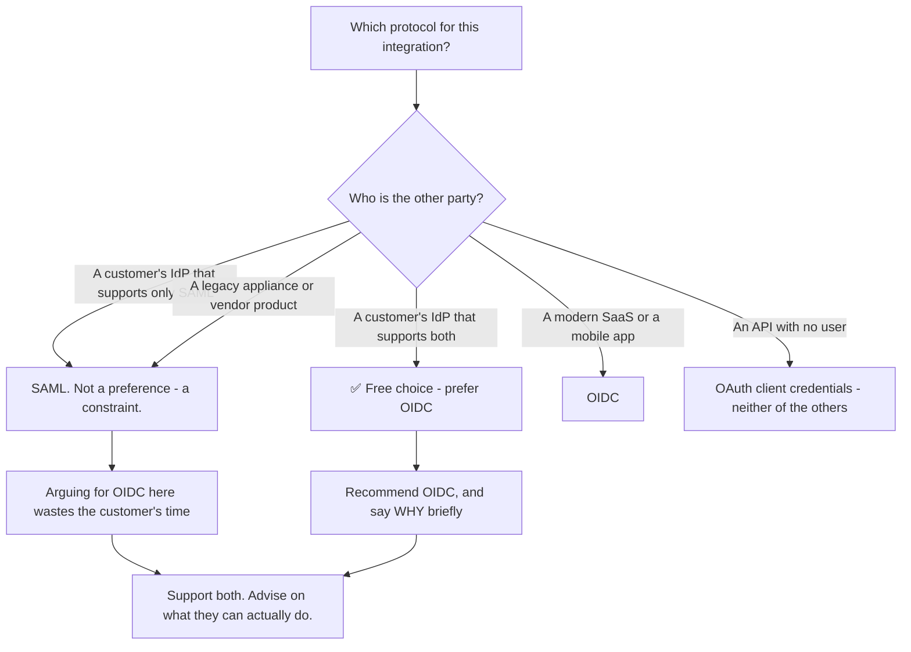
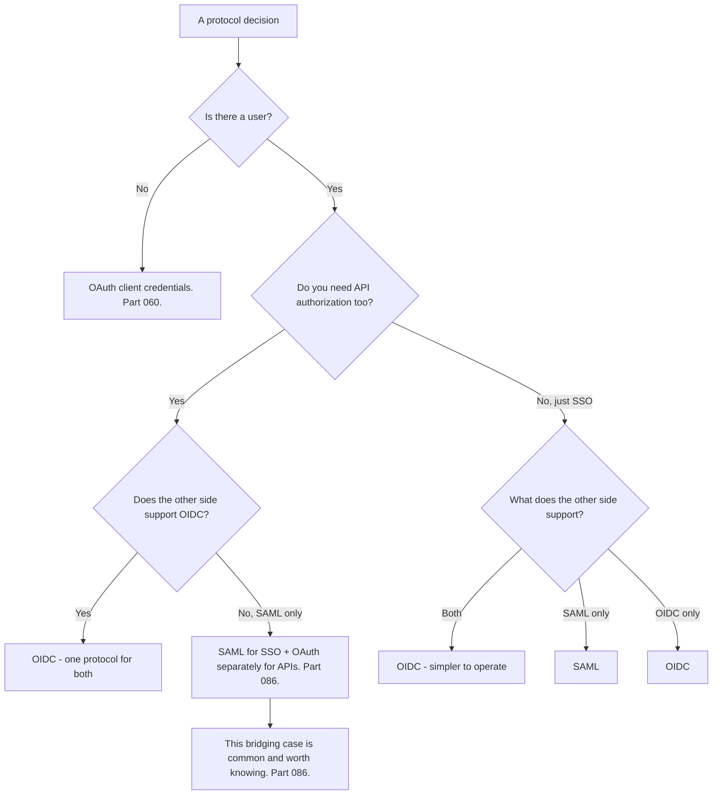
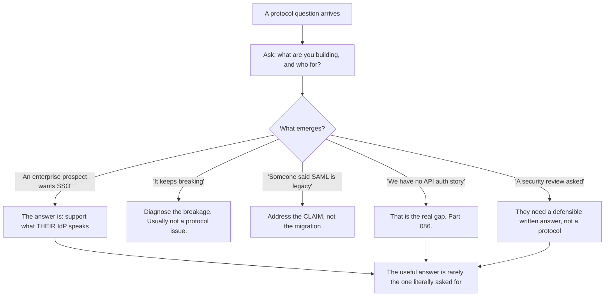
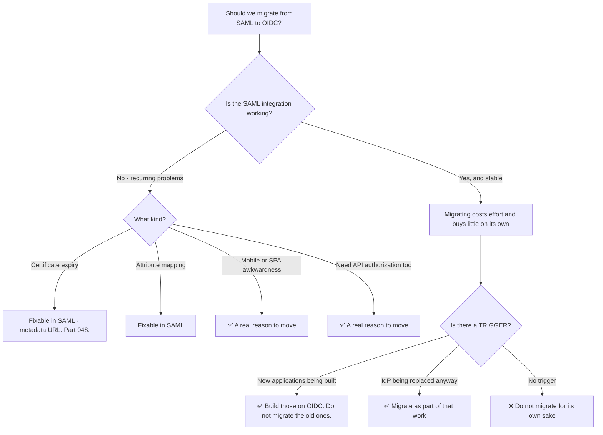
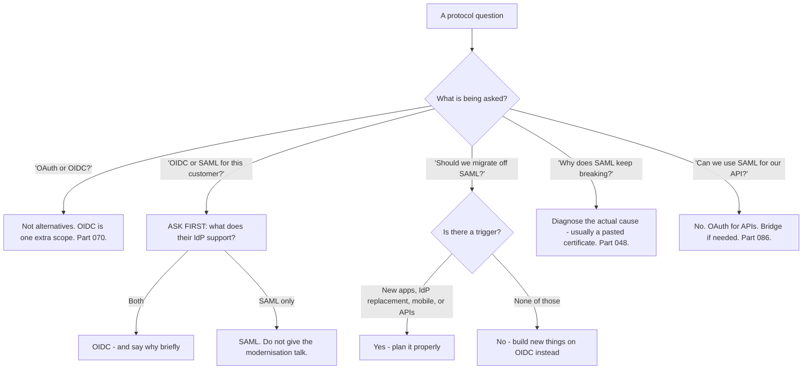

# Part 078 - Choosing Between OAuth, OIDC, and SAML

> Section goal: Learn to advise on protocol choice without dogma — the real decision criteria, what each protocol is genuinely better at, and how to handle the "should we migrate?" conversation. This closes Group G and bridges into Group H's SAML material.

Covers index item **078**. Maps to JD signals: *knowledge of SAML/OAuth/OIDC*, *communicate technical concepts clearly*, *strong analytical and problem-solving skills*, *promote best practices*, and *customer-obsessed attitude*.

---

## 1. Start From Zero: They Answer Different Questions

The most common framing error is treating all three as alternatives.

| | OAuth 2.0 | OIDC | SAML 2.0 |
|---|---|---|---|
| Answers | *May this client access this?* | *Who is this user?* | *Who is this user?* |
| Year | 2012 | 2014 | 2005 |
| Format | Tokens (JWT or opaque) | JWT | **XML** |
| Transport | HTTP, JSON | HTTP, JSON | HTTP, XML, form POST |
| Mobile and SPA | ✅ Native fit | ✅ Native fit | ⚠️ Awkward |
| API authorization | ✅ Purpose-built | ✅ Via OAuth | ❌ Not designed for it |
| Enterprise SSO | Via OIDC | ✅ Yes | ✅ **Deeply established** |
| Signing | JWS | JWS | XML Signature |

> **Analogy.** A delivery authorisation, a photo ID card, and a formal notarised letter of introduction. The first two are modern and compact; the third is older, more verbose, and still what many institutions require.
>
> **Where it stops:** you would choose a document based on what you need it for. Here the choice is frequently made **by the other party** — which is the single most important practical fact in this Part.

---

## 2. What Each Is Genuinely Better At

Being honest about SAML's strengths is what makes the advice credible.

| Strength | Protocol |
|---|---|
| API authorization and delegated access | **OAuth 2.0** — SAML was never designed for it |
| Mobile and single-page applications | **OIDC** — compact tokens, JSON, native library support |
| Discovery and self-configuring integration | **OIDC** (Part 074) |
| Modern security mechanisms — PKCE, DPoP, rotation | **OIDC/OAuth** |
| **Established enterprise deployment** | **SAML** — decades of installed base |
| **Rich, arbitrary attribute release** | **SAML** — the attribute model is more expressive |
| **Assertion encryption as standard practice** | **SAML** — commonly deployed, unlike JWE |
| **Vendor and appliance support** | **SAML** — many legacy systems support only SAML |
| Regulatory and procurement familiarity | **SAML** in some sectors |

### 🔍 Plain-English deep-dive: the choice is usually made by the other side

The most useful thing to internalise is that **protocol choice is rarely a free decision.** In enterprise federation, one party's capabilities decide it.

**Three practical consequences:**

**1. A product serving enterprises must support SAML.** Not as a legacy concession — as a requirement, because a meaningful share of enterprise customers have IdPs, appliances, or internal policies that only do SAML. **Telling them to modernise is not advice, it is a lost deal.**

**2. Recommending OIDC is only useful when there is a choice.** If the customer's identity team says their platform supports SAML only, the productive response is to configure SAML well — not to explain why OIDC is better. **Knowing when *not* to give the modernisation talk is part of giving good advice.**

**3. The right question is about the other side, not about preference.** *"What does your identity provider support?"* comes before any recommendation, and it frequently ends the discussion in one message.

**Where the advice genuinely matters** is when both are available, and then the case for OIDC is concrete rather than fashionable:

| Reason | Detail |
|---|---|
| Simpler troubleshooting | JSON and JWTs versus XML canonicalisation (Part 082) |
| Better mobile and SPA support | SAML in a mobile app is genuinely awkward |
| Discovery | Configuration fetched rather than exchanged (Part 057) |
| Same protocol family as API authorization | One mental model instead of two |
| Active development | PKCE, DPoP, rotation — SAML is stable, not evolving |

**And the honest counterweight**, which makes you credible rather than partisan: SAML's attribute model is more expressive, assertion encryption is routine in a way JWE is not, and an installed base of decades is a real asset rather than technical debt. **A support engineer who can say that is trusted on the rest.**

**Analogy:** advising on which language to write a contract in when the other party only reads one of them. Your preference is irrelevant; fluency in theirs is the useful skill. **Where it stops:** a contract can be translated. A protocol cannot be — one side must support what the other speaks.

---

## 3. The Decision Framework

| Situation | Answer |
|---|---|
| Machine to machine | OAuth client credentials |
| Consumer login | OIDC |
| Mobile or SPA | OIDC |
| Enterprise SSO, IdP supports both | OIDC |
| Enterprise SSO, IdP supports SAML only | SAML |
| Legacy appliance | Usually SAML |
| SSO **and** APIs, IdP is SAML-only | SAML for SSO, OAuth for APIs (Part 086) |

**The last row is a genuinely common architecture** and worth recognising: SAML federates the user into the application, and the application then obtains OAuth tokens for its own APIs. **Two protocols, cleanly separated by purpose.**

### 🔍 Plain-English deep-dive: the question behind the question

Customers rarely ask a protocol question for protocol reasons. **Establishing what they are actually trying to achieve changes the answer more often than any technical detail.**

| What they ask | What they usually mean |
|---|---|
| "Should we use OAuth or OIDC?" | "We're building login and don't know which term applies" |
| "Should we support SAML?" | "An enterprise prospect asked for SSO and we're deciding whether to build it" |
| "Should we migrate off SAML?" | Either "it keeps breaking" **or** "someone said it's legacy" |
| "Can we use SAML for our API?" | "We have SSO and no API authorization story" |
| "Which is more secure?" | "We're being asked in a security review and need an answer" |

**Two of those rows produce answers that look nothing like the question.**

**"Can we use SAML for our API?"** almost always means the customer has working SSO and no authorization model for their own APIs — so they are reaching for the protocol they already have. **The valuable response is not "no, SAML can't do that"; it is "what's protecting your APIs today?"** That question frequently uncovers a genuine gap: APIs protected only by a session cookie, or by a shared secret, or by nothing beyond network placement.

**"Which is more secure?"** is usually someone needing a defensible written answer for a security review. **A protocol comparison does not serve them; a short written statement does** — covering what each protocol provides, what their specific configuration does, and where the actual risk sits, which is nearly always in configuration rather than protocol choice (Part 066).

**The habit worth building:** when a protocol question arrives, ask what they are building and who for, before answering. **It costs one message and it changes the answer often enough to be worth it every time.**

**Analogy:** someone asking a hardware shop whether to buy a hammer or a mallet, when what they need is to know that the fixing they have chosen is wrong for the wall. Answering the literal question sells a tool and does not solve the problem. **Where it stops:** a shop can see the fixing. You can only ask — which is why asking is the skill.

---

## 4. The Migration Conversation

Customers ask whether to move from SAML to OIDC. **Usually the honest answer is "not on its own."**

### 🔍 Plain-English deep-dive: "if it works, leave it" is often the right advice

There is a professional temptation to recommend the newer technology. **Resisting it when it is not warranted is what makes you trusted on the occasions it is.**

**A working SAML integration has real value that migrating discards:**

| Asset | Lost on migration |
|---|---|
| It works, and has been tested against real users | Requires re-testing |
| The customer's IT team knows how to operate it | New learning on their side |
| Certificate rotation is understood — or automated | Must be re-established |
| Failure modes are familiar to both sides | New failure modes to learn |
| **No coordination cost** | Migration needs **two organisations** to schedule work |

**That last row is usually the largest hidden cost.** A SAML-to-OIDC migration is not a change you make; it is a change **two organisations make together**, requiring their identity team's time, a maintenance window, and a rollback plan. **For a working integration with no problems, that is a lot of coordination for no user-visible benefit.**

**The triggers that make migration genuinely worth it:**

| Trigger | Why |
|---|---|
| Building **new** applications | Build those on OIDC — no migration needed, just a decision |
| The IdP is being replaced anyway | The coordination cost is already being paid |
| Mobile or SPA support is required | SAML is genuinely awkward there |
| API authorization is needed | OIDC and OAuth share a model; SAML does not do this |
| Recurring problems that are **protocol**-shaped | Not certificate expiry — that is fixable in SAML |

**That last distinction matters.** Customers often propose migrating because SAML "keeps breaking," and the specific breakage is usually **certificate expiry from a pasted certificate** — which is fixed by using a metadata URL, not by changing protocol (Part 048). **Diagnosing the actual recurring problem before agreeing to a migration is the useful contribution.**

**The framing that serves the customer:**

> *"If your SAML integration is working, I wouldn't migrate it for its own sake — that's coordination across two organisations for no user-visible benefit. What I would do is build anything new on OIDC, and if the recurring issues are certificate expiry, that's fixable in SAML today with a metadata URL. If you need mobile support or API authorization, those are real reasons to move, and then it's worth planning properly."*

**Why this builds credibility:** a support engineer who recommends the newer thing every time is easy to discount. One who says "leave it alone" when that is right is listened to when they say "this genuinely needs changing."

**Analogy:** an electrician who tells you the old wiring is fine and to use modern wiring for the extension, rather than quoting to rewire the house. You believe them next time they say something must be replaced. **Where it stops:** wiring degrades physically. A working protocol integration does not decay — it only becomes a problem when requirements change.

---

## 5. Supporting Both

A product serving enterprises will support both, indefinitely.

| Concern | Implication |
|---|---|
| Two protocols to debug | Two evidence types: HAR plus decoded JWTs, or HAR plus decoded XML (Part 082) |
| Two certificate models | JWKS rotation versus SAML metadata (Parts 042, 048) |
| Two claim models | JWT claims versus SAML attributes (Part 083) |
| Two logout models | RP-initiated and back-channel versus SAML SLO (Parts 075, 085) |
| One user model underneath | Normalise both into the same identity record (Part 105) |

**The normalisation point is the design goal:** whatever protocol a user federated through, the application should see one consistent identity. **That is precisely what a broker provides** (Part 077), and it is why "we support both" is a configuration statement rather than a code statement.

---

## 6. Failure Modes

| Failure mode | What it looks like | Consequence | Correction |
|---|---|---|---|
| **Treating OAuth and OIDC as alternatives** | "Should we use OAuth or OIDC?" | Confused design | A layered pair — `openid` is one scope |
| **Recommending OIDC when there is no choice** | Advice ignored | Wasted time; lost credibility | Ask what the other side supports first |
| **Dismissing SAML as legacy** | Sounds modern | 🔴 Alienates enterprise customers | It is an installed base, not debt |
| **Migrating a working integration** | "Modernisation" | Cost across two organisations, no benefit | Trigger-driven only |
| **Misdiagnosing the reason to migrate** | "SAML keeps breaking" | Wrong fix | Certificate expiry is fixable in SAML |
| **Using SAML for API authorization** | Forced fit | Awkward and unsupported | OAuth for APIs |
| **Using OIDC where the IdP is SAML-only** | Cannot be configured | Blocked | Support SAML |
| **Not supporting both** | Simpler product | Lost enterprise deals | Both, indefinitely |
| **Two separate user models** | Federated users diverge | Duplicate accounts (Part 105) | Normalise underneath |
| **Assuming SAML means no OAuth** | SSO and APIs conflated | Missing API authorization | Bridge them (Part 086) |

---

## 7. Troubleshooting Decision Tree: Protocol Questions

### Worked example

*"Our SAML SSO breaks about twice a year and we're considering moving everything to OIDC. What do you think?"*

1. **Do not answer the migration question yet.** Ask what the breakages actually were.
2. **Answer:** twice, both times "login stopped working overnight" and both resolved by updating a certificate.
3. **That is not a protocol problem.** It is a pasted certificate expiring, and it is fixable in SAML today by using the IdP's metadata URL so rotation is picked up automatically (Part 048).
4. **Say so plainly**, because it changes the whole decision: migrating to OIDC would not have prevented either incident — key rotation exists there too, and a hardcoded key fails the same way (Part 042).
5. **Then address migration honestly.** If the SAML integration otherwise works, migrating is coordination across two organisations for no user-visible benefit. **Name that cost explicitly**, because it is usually invisible in the customer's own planning.
6. **Ask about triggers.** Are they building new applications? Is the IdP being replaced? Do they need mobile support or API authorization? **Those are the reasons that justify it.**
7. **Give the shaped recommendation:** fix the certificate problem today with a metadata URL; build anything new on OIDC; migrate the existing integration only if a trigger appears.
8. **Note the credibility effect internally.** Advising against a migration you could have supported is what makes the next recommendation land — and it is also simply the right answer here.

---

## 8. Lab: Compare Them Directly

**Purpose.** Federate the same user through both protocols and compare everything, so the choice is grounded in observation rather than opinion.

**Prerequisites.** Parts 048, 070–077 artifacts. A free Auth0 tenant plus a second identity source configurable as both a SAML and an OIDC provider.

**Steps.**

1. Create `okta-prep/labs/078-protocol-choice/`.
2. **Configure both connections** to the same external identity source — one SAML, one OIDC.
3. **Sign in through each** with the same synthetic user. **Capture a HAR of each.**
4. **Compare the wire formats.** Extract the SAML assertion and the OIDC ID token. **Decode both locally** (Part 040). Put them side by side.
5. **Compare the claim and attribute sets.** Record what each carries and how it is named. **Note the differences in expressiveness.**
6. **Compare the resulting user records** in your tenant: `sub`, connection, claims populated.
7. **Compare configuration effort.** Record every value exchanged for each connection and how many required the other side. **Which was fewer steps?**
8. **Compare the failure surfaces.** Break each in an equivalent way — a wrong signing key — and **record how easy each error was to diagnose.**
9. **Compare debugging effort honestly.** Time how long it takes to locate and read the identity assertion in each HAR. **Record both numbers.**
10. **Compare logout.** Configure logout for both and record what each requires (Parts 075, 085).
11. **Test the mobile case.** Attempt each in a mobile-style flow — a system browser redirect. **Record which is awkward and why.**
12. **The bridging case.** Configure SAML for SSO **and** obtain an OAuth access token for a test API in the same session. **Confirm both work together** (Part 086).
13. **Write the decision aid.** `protocol-choice.md` — one page: the decision tree, what each is genuinely better at, and the migration triggers.
14. **Write the migration script.** Half a page: how to answer "should we migrate?", including the questions to ask first and the certificate-expiry misdiagnosis.
15. **Failure catalog + manifest.** Complete `MANIFEST.md`.

**Expected evidence.** Both connections working, both wire formats decoded side by side, claim and attribute comparison, user record comparison, configuration effort recorded, equivalent breakages with diagnosability compared, timed debugging effort, logout comparison, a mobile-case assessment, a working bridged architecture, a one-page decision aid, and a migration conversation script.

**Validation rubric.**

| Check | Pass condition |
|---|---|
| Both connections | Same user through each |
| Wire formats | Both decoded, side by side |
| Claims vs attributes | Differences recorded |
| Configuration effort | Steps and cross-party values counted |
| Equivalent breakage | Diagnosability compared honestly |
| Debugging timed | Both durations recorded |
| Bridging | SAML SSO plus an OAuth API token in one session |
| Decision aid | One page, tree plus triggers |
| Migration script | Includes the certificate misdiagnosis |

**Cleanup and privacy.** Lab tenants and synthetic users only. Delete both connections and all users at the end. Redact tenant identifiers from saved HARs.

---

## 9. JD Mapping

| Supplied JD signal | How this Part supports it |
|---|---|
| **Knowledge of SAML/OAuth/OIDC** | All three positioned accurately against each other |
| **Communicate technical concepts clearly** | Advising without dogma; naming hidden costs |
| Strong analytical and problem-solving skills | Diagnosing the real cause before agreeing to a migration |
| **Promote best practices** | Building new on OIDC without forcing migration |
| **Customer-obsessed attitude** | Recommending "leave it alone" when that serves them |
| Collaborate across teams | Recognising migration as a two-organisation project |
| Exceed expectations on response quality | Answering the question behind the question |

---

## 10. Candidate Honesty Note

- **Claim safety:** *Learned architecture and lab experience.*
- **The strongest thing you can say:** *"OAuth and OIDC aren't alternatives — OIDC is a layer on OAuth, triggered by one scope. The real choice is OIDC versus SAML for federation, and it's usually made by the other side: if a customer's identity provider supports SAML only, that's a constraint, not a preference. So the first question is always what their IdP supports, and that often ends the discussion in one message."*
- **A second point, and it is what makes the advice credible:** *"SAML has genuine strengths — a more expressive attribute model, assertion encryption as routine practice, and decades of installed base in enterprise. Dismissing it as legacy alienates exactly the customers who need it most. A product serving enterprises supports both indefinitely."*
- **A third, on migration:** *"If a SAML integration works, I'd advise against migrating for its own sake. It's coordination across two organisations — their identity team's time, a maintenance window, a rollback plan — for no user-visible benefit. The triggers that justify it are building new applications, the IdP being replaced anyway, needing mobile or SPA support, or needing API authorization."*
- **A fourth, and it is the most useful diagnostic here:** *"Customers often want to migrate because 'SAML keeps breaking,' and the actual breakage is nearly always a pasted certificate expiring — which is fixable in SAML today with a metadata URL. Migrating wouldn't have prevented it, because key rotation exists in OIDC too and a hardcoded key fails the same way. Diagnosing the real recurring problem before agreeing to a migration is the valuable part."*
- **A fifth, on credibility:** *"Recommending the newer technology every time is easy to discount. Saying 'leave it alone' when that's right is what gets you listened to when you say something genuinely needs changing."*
- **A sixth, on a common architecture:** *"SAML for SSO plus OAuth for APIs is a legitimate and common pattern, not a compromise — two protocols cleanly separated by purpose. Assuming SAML means no OAuth is how applications end up with no API authorization story at all."*
- **Do not overstate:** you have not advised customers on protocol strategy. Say you have configured both against the same identity source and compared them directly.

---

## 11. Official Source Anchors

Accessed **26 August 2026**.

| Source | What it defines |
|---|---|
| IETF RFC 6749 | OAuth 2.0 — authorization |
| OpenID Connect Core 1.0 | OIDC — authentication on OAuth |
| OASIS SAML 2.0 Core, Bindings, Profiles | SAML — assertions and SSO (Part 079) |
| OASIS SAML 2.0 Metadata | Metadata and automated rotation |
| IETF RFC 8693 | Token exchange, including SAML assertions as subject tokens (Part 067) |
| Auth0 and Okta documentation — connection types | Vendor support for both protocols |
| Microsoft Entra ID documentation — SAML and OIDC | The most common enterprise IdP, supporting both |
| NIST SP 800-63C | Federation assurance, protocol-neutral |

**Revalidate after 26 August 2026:** all three specifications are stable. Recheck vendor support matrices and enterprise IdP capabilities, which do change.

---

## ⭐ Likely Interview Questions for This Section

### Q1. "OAuth, OIDC, or SAML — how do you choose?"
> *Model answer:* "First, OAuth and OIDC aren't alternatives — OIDC is a layer on OAuth triggered by one scope, so 'OAuth or OIDC' is usually a malformed question. The real choice is OIDC versus SAML for federation, and my first question is what the other side supports, because that often decides it entirely. If a customer's identity provider supports SAML only, that's a constraint rather than a preference, and arguing for OIDC wastes their time. Where both are available I'd recommend OIDC — simpler troubleshooting with JSON rather than XML canonicalisation, better mobile and SPA support, discovery instead of exchanged configuration, and the same protocol family as API authorization. And if there's no user at all, it's OAuth client credentials and neither of the other two applies."

### Q2. "Is SAML legacy?"
> *Model answer:* "It's older, and it's not technical debt — and being honest about that is what makes the rest of my advice credible. SAML has genuine strengths: a more expressive attribute model, assertion encryption as routine deployed practice in a way JWE isn't, and decades of installed base across enterprise IdPs and appliances. A meaningful share of enterprise customers have platforms or internal policies that only do SAML, so a product serving enterprises supports it indefinitely — not as a concession, as a requirement. Telling those customers to modernise isn't advice, it's a lost deal. What I'd say is that it's stable rather than evolving: the modern security work — PKCE, DPoP, refresh rotation — is happening in the OAuth family."

### Q3. "A customer asks whether to migrate from SAML to OIDC."
> *Model answer:* "I'd ask what's prompting it before answering. If the integration works, migrating is coordination across two organisations — their identity team's time, a maintenance window, a rollback plan — for no user-visible benefit, and that cost is usually invisible in their own planning until they start. The triggers that justify it are: building new applications, where the answer is to build those on OIDC rather than migrate the old ones; the IdP being replaced anyway, so the coordination cost is already being paid; needing mobile or SPA support, where SAML is genuinely awkward; or needing API authorization. Without one of those, my recommendation would be to leave it alone — and saying that when it's right is what makes people believe me when I say something must change."

### Q4. "A customer says SAML keeps breaking. What do you check?"
> *Model answer:* "What the actual breakages were, before accepting the premise. Nearly always it's certificate expiry — a signing certificate pasted into the connection rather than a metadata URL, so it works for a year and then fails overnight with no warning. That's fixable in SAML today by switching to the metadata URL so rotation is picked up automatically. The important point is that migrating to OIDC would not have prevented it: key rotation exists there too, and a hardcoded key fails in exactly the same way. So 'SAML keeps breaking' is usually 'our configuration has a scheduled outage in it,' and diagnosing that before agreeing to a migration is the valuable contribution."

### Q5. "Can SAML be used for API authorization?"
> *Model answer:* "Not well — it wasn't designed for it. SAML is about federating a user's identity into an application; it has no concept of scoped delegated access to an API, no bearer token model, and nothing equivalent to refresh tokens or PKCE. The common and entirely legitimate architecture is SAML for SSO plus OAuth for APIs: the user federates in via SAML, and the application obtains OAuth tokens for its own APIs separately. Two protocols cleanly separated by purpose rather than a compromise. There's also a bridging option — RFC 8693 token exchange accepts a SAML assertion as a subject token — which is useful when an application needs to move from a SAML-established session into OAuth-protected APIs."

### Q6. "What does supporting both cost a product?"
> *Model answer:* "Two of most things operationally: two evidence types when debugging — HAR plus decoded JWTs versus HAR plus decoded XML; two certificate models, JWKS rotation versus SAML metadata; two claim models, JWT claims versus SAML attributes with their own naming conventions; and two logout models. What it shouldn't cost is two user models — whatever protocol someone federated through, the application should see one consistent identity, which is exactly what a broker provides. That's the design goal, and it's why 'we support both' should be a configuration statement rather than a code statement: the application integrates once and both protocols are normalised behind it."

### Q7. "When is OIDC clearly the right answer?"
> *Model answer:* "Consumer login, mobile applications, single-page applications, and anywhere API authorization is also needed — because then one protocol family covers both and you have one mental model instead of two. Also anywhere the other side supports both, where I'd recommend it on operational grounds: discovery means configuration is fetched rather than exchanged by email, troubleshooting is JSON and JWTs rather than XML canonicalisation, and the modern security mechanisms are being developed there. Where it's clearly *not* the answer is when the other party can't speak it — a legacy appliance, an older IdP, or a customer whose internal policy mandates SAML. Then the useful skill is configuring SAML well rather than explaining why OIDC would be nicer."

### Q8. "How do you give protocol advice without sounding dogmatic?"
> *Model answer:* "By asking about constraints before stating preferences, and by being genuinely honest about the older option's strengths. 'What does your identity provider support?' comes before any recommendation and frequently ends the discussion. When both are available I'd give specific reasons rather than 'it's more modern' — simpler debugging, better mobile support, discovery, shared model with API authorization. And I'd name what SAML does better, because a support engineer who only ever recommends the newer thing is easy to discount. The same applies to migration: advising against one that isn't warranted is what earns the right to be believed when I say something genuinely needs to change. The goal is being useful to their situation, not being right about protocols."

---

## 🧠 30-Second Memory Hooks

- **OAuth and OIDC are a LAYERED PAIR, not alternatives.** `openid` is one scope.
- **The real choice is OIDC vs SAML** — and it is **usually made by the other side**.
- **First question: "What does your identity provider support?"** Often ends it.
- **SAML is an INSTALLED BASE, not technical debt.** Say so — it buys credibility.
- **SAML is better at:** expressive attributes · routine assertion encryption · appliance support.
- **OIDC is better at:** mobile and SPA · discovery · debugging · **shared model with API auth**.
- **SAML cannot do API authorization.** SAML for SSO + OAuth for APIs is a **legitimate pattern**.
- **"Should we migrate?" → only with a TRIGGER:** new apps · IdP replacement · mobile · APIs.
- **"SAML keeps breaking" = a pasted certificate.** Fixable in SAML. **Migration would not have helped.**
- **Migration is a TWO-ORGANISATION project.** Name that hidden cost.
- **Recommending "leave it alone" when right is what makes you believed later.**
- **Support both indefinitely. Normalise to ONE user model underneath.**

---

## ✅ Completion Checklist

- [ ] **Knowledge:** I can position all three accurately and name what SAML does genuinely better.
- [ ] **Lab artifact:** `078-protocol-choice/` contains both connections to one identity source, both wire formats decoded side by side, timed debugging comparison, a working bridged architecture, and a decision aid.
- [ ] **Spoken:** I can answer "which protocol?" in 45 seconds and the migration question in 60.
- [ ] **Judgement:** I ask what the other side supports before recommending, and I diagnose "SAML keeps breaking" before agreeing to a migration.
- [ ] **Honesty check:** I say "configured both in a lab," not advised customers on strategy.
- [ ] **Source check:** I have read OIDC Core §1 and the SAML 2.0 Profiles overview myself.

---

*Next suggested section:* **[Part 079 - SAML 2.0 From Zero: Assertions, Bindings, Profiles](Part-079-saml-20-from-zero-assertions-bindings-profiles.md)** — Group H begins: SAML properly, from first principles.
